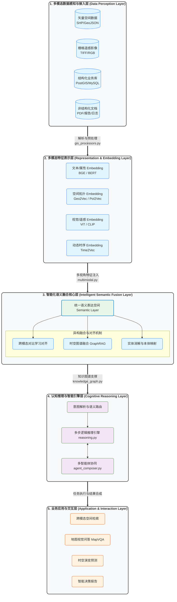

# Data Agent：多模态数据智能化语义融合模块技术架构

## 1. 架构总览
本模块旨在打破传统空间数据、遥感影像与结构化业务数据之间的“模态孤岛”，通过将物理世界的异构数据映射到统一的语义空间（Semantic Space），实现大模型驱动下的深度时空认知与推理。

---

## 2. 分层详细设计

### 2.1 数据感知与接入层 (L1)
*   **核心功能**：实现对多源异构数据的标准化摄取。
    *   **时空数据**：利用 `gis_processors.py` 实现 CRS（坐标参考系统）转换、空间清理。
    *   **遥感影像**：通过 `remote_sensing.py` 处理波段信息、切片（Tiling）及预处理。
    *   **业务文档**：抽取 PDF/报告中的半结构化信息，转化为知识片段。

### 2.2 多模态特征表示层 (L2)
*   **核心功能**：将物理数据抽象为高维语义向量（Embeddings）。
    *   **空间语义化**：通过 `Geo2Vec` 等模型，不仅对位置进行编码，更对空间邻近、包含、相交等**空间拓扑关系**进行语义编码。
    *   **视觉语义化**：利用预训练的遥感专用 Vision Transformer (ViT)，提取地表覆盖、建筑物密度等视觉特征。
    *   **跨模态共空间**：初步将图像特征与文本描述映射至相似的向量分布。

### 2.3 智能化语义融合核心层 (L3) —— **核心创新点**
*   **统一语义表达空间 (Semantic Layer)**：通过 `semantic_layer.py` 定义业务本体模型，使得“地块 A”在数据库中是 ID，在影像中是像素集合，在语义层中是一个具备属性和位置的“实体”。
*   **时空 GraphRAG**：
    *   **创新机制**：结合 `graph_rag.py`，将提取出的空间实体构建为时空知识图谱。
    *   **逻辑检索**：不仅通过相似度检索，更通过图路径检索（例如：检索“受 A 道路施工影响的所有 B 类商户”）。
*   **实体消解 (Entity Resolution)**：利用对比学习算法，自动识别影像中的“绿色斑块”即为矢量底图中的“某市政公园”。

### 2.4 认知推理与智能引擎层 (L4)
*   **意图解析**：将用户模糊的自然语言（如：“分析该区域最近三年的商业活力衰减情况”）转化为多模态查询计划。
*   **推理链条 (reasoning.py)**：执行 ReAct 框架，动态调度 `gis_tools` 进行空间分析，调度 `remote_sensing` 进行影像比对。
*   **多智能体协作 (agent_composer.py)**：由“协调者 Agent”负责任务分发，“专家 Agent”负责专业领域计算（如：Arcpy 脚本生成、统计学分析）。

### 2.5 业务应用与交互层 (L5)
*   **MapVQA**：支持用户直接针对地图或遥感影像提问：“图中左上角的建筑物高度是否符合规划限制？”
*   **跨模态搜索**：支持“以图搜地”、“以文搜图”以及复杂的时空语义检索。

---

## 3. 技术创新点总结

1.  **从“图层叠加”到“语义融合”**：传统 GIS 仅是 Layer 的视觉叠加，本项目实现了数据在 Embedding 级别的深度融合，Agent 可以像理解文字一样“理解”空间关系。
2.  **融合 GraphRAG 的时空推理**：引入图谱关系（如 *NearBy*, *Contains*, *FlowTo*）极大增强了 RAG 在处理地理逻辑时的准确性，有效解决了大模型的“空间幻觉”。
3.  **Agentic Workflow 的闭环**：通过 `agent_composer.py` 实现了从感知到推理再到自动化工具调用（如 Arcpy）的全链路自动化，大幅降低了非专业用户使用专业空间分析工具的门槛。

---
*文档版本：V1.2 | 模块负责人：Data Agent Architect Team*