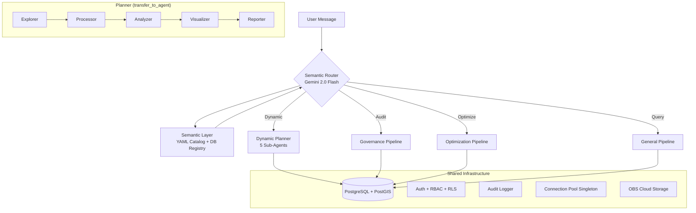

# GIS Data Agent (ADK Edition) v4.0-beta

An AI-powered geospatial analysis platform that turns natural language into spatial intelligence. Built on **Google Agent Developer Kit (ADK)** with three specialized pipelines for data governance, land-use optimization, and general spatial analysis.

## Core Capabilities

### Data Governance (数据治理)
- Topological audit (overlaps, self-intersections, gaps)
- Schema compliance checking against national standards (GB/T 21010)
- Multi-modal verification: PDF reports vs SHP/DB metrics
- Automated governance reports (Word/PDF)

### Land Use Optimization (空间优化)
- Deep Reinforcement Learning engine (MaskablePPO) for layout optimization
- Fragmentation Index (FFI) with 6 landscape metrics
- Paired farmland/forest swaps with strict area balance

### Business Spatial Intelligence (商业智能)
- Semantic query: natural language → auto-mapped SQL with spatial operators
- Site selection with chain reasoning (Query → Buffer → Overlay → Filter)
- DBSCAN clustering, KDE heatmaps, choropleth maps
- POI search, driving distance, geocoding (batch + reverse)
- Interactive multi-layer map composition

## Architecture



**Pipeline routing**: `DYNAMIC_PLANNER=true` (default) uses the Planner with `transfer_to_agent`; `false` falls back to 3 fixed `SequentialAgent` pipelines.

**Model tiering**: Explorer/Visualizer → Gemini 2.0 Flash, Processor/Analyzer/Planner → Gemini 2.5 Flash, Reporter → Gemini 2.5 Pro.

## Quick Start

### Docker (recommended)
```bash
docker-compose up -d
# Visit http://localhost:8000
# Login: admin / admin123
```

### Local Development
```bash
# 1. Configure environment
cp data_agent/.env.example data_agent/.env
# Edit .env with your PostgreSQL/PostGIS credentials and Vertex AI config

# 2. Install dependencies
pip install google-adk chainlit geopandas shapely rasterio folium sqlalchemy psycopg2-binary

# 3. Run
chainlit run data_agent/app.py -w
```

Default login: `admin` / `admin123` (seeded on first run). Self-registration available at `/register`.

## Feature Matrix

| Feature | Description |
|---|---|
| Semantic Layer | YAML catalog (15 domains, 7 regions, 8 spatial ops) + 3-level hierarchy + DB annotations |
| Data Lake | Unified data catalog across local/cloud/PostGIS backends with lineage tracking |
| Health Check API | K8s liveness/readiness probes + admin system diagnostics |
| Row-Level Security | PostgreSQL RLS with per-user data isolation |
| Connection Pool | Singleton SQLAlchemy engine with 5-min TTL semantic cache |
| Auth | Password + OAuth2 (Google), RBAC (admin/analyst/viewer) |
| File Sandbox | Per-user upload directory with OBS cloud sync |
| Spatial Memory | Persistent per-user memory (regions, preferences, analysis results) |
| Token Tracking | Per-user LLM usage with daily/monthly limits |
| Audit Log | Enterprise audit trail with admin dashboard |
| Report Export | Word/PDF with page headers, footers, pipeline-specific titles |
| Code Export | Reproducible Python scripts from analysis pipelines |
| Result Sharing | Public link generation with optional password + expiry |
| Template System | Save/reuse analysis workflows as templates |
| Bot Integration | WeChat, DingTalk, Feishu enterprise bot adapters |
| MCP Server | Model Context Protocol for external tool integration |
| Multi-Layer Maps | compose_map() with 5 layer types + LayerControl |
| Remote Sensing | Raster analysis, NDVI, LULC/DEM download |
| Real-time Streams | Redis Streams with geofence alerts + IoT data |
| Team Collaboration | Team creation, member management, resource sharing |

## Tech Stack

- **Framework**: Google ADK v1.21 (`google.adk.agents`, `google.adk.runners`)
- **LLM**: Gemini 2.5 Flash / 2.5 Pro (agents), Gemini 2.0 Flash (router)
- **UI**: Chainlit (password + OAuth2 auth)
- **Database**: PostgreSQL 16 + PostGIS 3.4
- **GIS**: GeoPandas, Shapely, Rasterio, PySAL, Folium, mapclassify, branca
- **ML**: PyTorch, Stable Baselines 3 (MaskablePPO), Gymnasium
- **Cloud**: Huawei OBS (S3-compatible) for file storage
- **Python**: 3.13+

## Project Structure

```
data_agent/
├── app.py                 # Chainlit UI, semantic router, auth, RBAC
├── agent.py               # Agent definitions, pipeline assembly (~290 lines)
├── toolsets/              # 15 BaseToolset modules (exploration, processing, analysis, ...)
├── prompts/               # 3 YAML prompt files (optimization, planner, general)
├── db_engine.py           # Connection pool singleton
├── health.py              # K8s health check API + startup diagnostics
├── data_catalog.py        # Unified data lake catalog + lineage tracking
├── semantic_layer.py      # Semantic catalog + 3-level hierarchy + TTL cache
├── semantic_catalog.yaml  # 15 domains, 7 regions, 8 spatial ops, 4 metric templates
├── database_tools.py      # PostgreSQL/PostGIS integration, RLS
├── gis_processors.py      # GIS operations (tessellation, buffer, clip, overlay, ...)
├── drl_engine.py          # Gymnasium environment for land-use optimization
├── auth.py                # Password/OAuth auth, user management
├── audit_logger.py        # Enterprise audit trail
├── memory.py              # Persistent spatial memory
├── token_tracker.py       # LLM usage tracking + limits
├── sharing.py             # Public link sharing
├── report_generator.py    # Markdown → Word/PDF
├── code_exporter.py       # Analysis → Python script export
├── pipeline_runner.py     # Headless pipeline execution
├── user_context.py        # ContextVar propagation
├── utils.py               # Shared helpers
└── migrations/            # SQL migration scripts (001-009)
```

## Running Tests

```bash
# All tests (~836 tests)
python -m pytest data_agent/test_*.py --ignore=data_agent/test_knowledge_agent.py

# Single module
python -m pytest data_agent/test_database.py -v
```

## Roadmap

| Version | Feature Set | Status |
|---|---|---|
| v1.0 | Local Files, Basic DRL | Done |
| v2.0 | Excel Geocoding, Report Generation | Done |
| v3.0 | PostGIS, Hard Routing | Done |
| v3.1 | Multi-Pipeline Architecture | Done |
| v3.2 | Semantic Layer, Business Suite | Done |
| v4.0-beta | Data Lake, Lineage, 3-Level Hierarchy, Health API | **Current** |
| v4.0 | Observability, Frontend Integration | In Progress |
| v5.0 | Multi-Modal, 3D Visualization | Planned |
