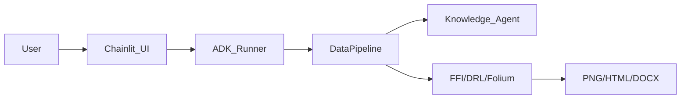

# Data Agent: AI-Powered Spatial Optimization Platform


**Data Agent** 是一个专为地理空间分析设计的 AI 智能体系统。它结合了 LLM 的语义理解能力与 GIS 的空间计算能力，能够自动完成从数据诊断、破碎化评估到空间布局优化的全流程任务。

## ✨ 核心特性
*   **🧠 智能体协同**: 5 个专业智能体 (Knowledge, Exploration, Processing, Analysis, Summary) 流水线协作。
*   **🌍 深度 GIS 分析**: 内置 FFI (破碎化指数) 计算引擎和 Maskable PPO 深度强化学习模型。
*   **📊 图文并茂**: 自动生成三联对比图 (Before/After/Diff) 和交互式 HTML 地图。
*   **📄 自动化报告**: 一键导出包含所有分析结论和图表的 Word 报告。
*   **⚡ 现代化交互**: 基于 Chainlit 的 Chat UI，支持思维链展示与实时反馈。

## 🚀 快速开始

### 1. 安装依赖
```bash
python -m venv .venv
.\.venv\Scripts\activate
pip install -r requirements.txt
```

### 2. 配置环境
复制 `.env.example` 为 `.env` 并填入 Google Cloud Project ID。

### 3. 启动应用
```bash
chainlit run data_agent/app.py -w
```
访问 `http://localhost:8000` 即可使用。

## 📚 文档中心
*   [用户手册 (User Manual)](docs/user_manual/index.md)
*   [运维手册 (Ops Manual)](docs/ops_manual/index.md)
*   [开发者指南 (Dev Guide)](docs/dev_guide/index.md)

## 🏗️ 架构设计


## 📜 许可证
MIT License
