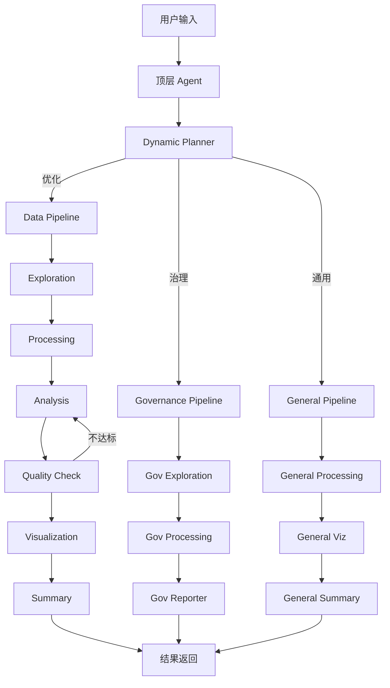

[English](./README_en.md) | **中文**

# GIS Data Agent (ADK Edition) v7.5

基于 **Google Agent Developer Kit (ADK)** 构建的 AI 驱动地理空间分析平台。通过自然语言语义路由，自动调度四大专业管道完成空间数据治理、用地优化、多源数据融合和商业智能分析。前端为 React 三面板 SPA，后端集成 38 个 REST API，支持多模态输入、3D 可视化、工作流编排、知识图谱推理和 Memory ETL 自动记忆提取。

## 核心能力

### 多源数据智能融合 (v5.5–v7.0)
- **五阶段流水线**：画像 → 评估 → 对齐 → 融合 → 验证
- **10 种融合策略**：空间连接、属性连接、分区统计、点采样、波段叠加、矢量叠加、时态融合、点云高度赋值、栅格矢量化、最近邻连接
- **5 种数据模态**：矢量、栅格、表格、点云 (LAS/LAZ)、实时流
- **智能语义匹配**：
  - 四层渐进式匹配：精确 → 等价组 → 单位感知 → 模糊匹配
  - **v7.0 向量嵌入匹配**：Gemini text-embedding-004 语义相似度（可选启用）
  - 目录驱动等价组 + 分词相似度 + 类型兼容检查 + 单位自动转换
- **LLM 增强策略路由 (v7.0)**：Gemini 2.0 Flash 根据用户意图智能推荐融合策略
- **分布式/核外计算 (v7.0)**：大数据集（>50万行/500MB）自动分块处理，避免 OOM
- **地理知识图谱 (v7.0)**：networkx 实体关系建模，空间邻接/包含关系检测，N跳邻居查询
- **栅格自动处理**：CRS 重投影、分辨率重采样、大栅格窗口采样
- **增强质量验证**：10 项检查（空值率、几何有效性、拓扑验证、KS 分布偏移检测等）

### 数据治理
- 拓扑审计（重叠、自相交、间隙检测）
- 字段合规性检查（GB/T 21010 国标）
- 多模态校验：PDF 报告 vs SHP/数据库指标
- 自动生成治理报告（Word/PDF）
- 多源数据融合（v6.0 集成）

### 空间优化
- 深度强化学习引擎（MaskablePPO）用地布局优化
- 破碎度指数（FFI）含 6 项景观指标
- 耕地/林地配对交换，严格面积平衡

### 商业智能
- 语义查询：自然语言 → 自动映射 SQL + 空间算子
- 选址推理链（查询 → 缓冲 → 叠加 → 过滤）
- DBSCAN 聚类、KDE 热力图、分级设色
- POI 搜索、驾车距离、批量/反向地理编码
- 交互式多图层合成 + 自然语言图层控制

### 多模态输入 (v5.2)
- 图片理解：自动分类上传图片，Gemini 视觉分析
- PDF 解析：文本提取 + 原生 PDF Blob 双策略
- 语音输入：Web Speech API，中/英文切换

### 3D 空间可视化 (v5.3)
- deck.gl + maplibre 3D 渲染器
- 支持拉伸体、柱状图、弧线图、散点图层
- 2D/3D 视图一键切换

### 工作流编排 (v5.4)
- 多步管道链式执行，参数化 Prompt 模板
- React Flow 可视化拖拽编辑器（数据输入/管道/输出三种节点）
- APScheduler Cron 定时执行
- Webhook 结果推送

## 核心架构：多智能体协作网络

GIS Data Agent 采用了先进的**层级式多智能体架构（Hierarchical Multi-Agent Architecture）**。系统内置了三种主要的工作流（Pipeline），并由一个顶层的 `Dynamic Planner` 进行意图识别和动态分发，完美践行了 ADK 的 `Generator-Critic` 和 `AgentTool` 最佳实践。



**管道路由**：`DYNAMIC_PLANNER=true`（默认）使用规划器进行动态意图分配，极大地降低了单体大模型的上下文负担。

**模型分层**：Explorer/Visualizer → Gemini 2.0 Flash，Processor/Analyzer/Planner → Gemini 2.5 Flash，Reporter → Gemini 2.5 Pro。

## 快速开始

### Docker（推荐）
```bash
docker-compose up -d
# 访问 http://localhost:8000
# 登录: admin / admin123
```

### 本地开发
```bash
# 1. 配置环境
cp data_agent/.env.example data_agent/.env
# 编辑 .env，填入 PostgreSQL/PostGIS 凭据和 Vertex AI 配置

# 2. 安装依赖
pip install -r requirements.txt

# 3. 启动后端
chainlit run data_agent/app.py -w

# 4. 启动前端（开发模式，可选）
cd frontend && npm install && npm run dev
```

默认账号：`admin` / `admin123`（首次运行自动创建）。登录页内置自助注册。

## 功能矩阵

| 类别 | 功能 | 描述 |
|---|---|---|
| **AI 核心** | 语义层 | YAML 目录（15 领域、7 区域、8 空间算子）+ 3 级层次 + DB 注解 |
| | 技能包 | 5 个命名工具集分组（空间分析、数据质量、可视化、数据库、协作） |
| | NL 图层控制 | 自然语言 显示/隐藏/样式/移除 地图图层 |
| | MCP 工具市场 | 配置驱动的 MCP 服务器连接 + 工具聚合 + DB 持久化 + 管理 UI (v7.1) |
| | 分析视角注入 | 用户自定义分析关注点，自动注入 Agent 提示词 (v7.1) |
| | Memory ETL | 管道执行后自动提取关键发现，智能去重，配额管理 (v7.5) |
| | 动态工具加载 | 按意图动态裁剪工具列表 (8 类别 + 10 核心工具)，ContextVar + ToolPredicate (v7.5) |
| | 反思循环 | 全部 3 条管道含 LoopAgent 质量反思 (v7.1) |
| **数据融合** | 融合引擎 (MMFE) | 五阶段流水线（画像→评估→对齐→融合→验证），10 种策略，5 种模态 |
| | 语义匹配 | 五层渐进匹配：精确 → 等价组 → 嵌入相似度 → 单位感知 → 模糊 |
| | 嵌入匹配 (v7.0) | Gemini text-embedding-004 向量语义匹配（可选启用） |
| | LLM 策略路由 (v7.0) | Gemini 2.0 Flash 意图感知策略推荐 (`strategy="llm_auto"`) |
| | 知识图谱 (v7.0) | networkx 空间实体关系建模，N跳邻居查询，最短路径 |
| | 分布式计算 (v7.0) | 大数据集 (>500K行) 自动分块读取和处理 |
| | 栅格处理 | 自动 CRS 重投影、分辨率重采样、大栅格窗口采样 |
| | 点云 & 流数据 | LAS/LAZ 高度赋值、CSV/JSON 流数据时态融合（时间窗口+空间聚合） |
| | 质量验证 | 10 项检查：空值/几何/拓扑/CRS/微面/异常值/KS分布偏移 |
| **多模态** | 图片理解 | 自动分类上传图片 → Gemini 视觉分析 |
| | PDF 解析 | pypdf 文本提取 + 原生 PDF Blob 双策略 |
| | 语音输入 | Web Speech API，中/英切换，脉冲动画 |
| **3D 可视化** | deck.gl 渲染 | 拉伸体、柱状图、弧线、散点图层 |
| | 2D/3D 切换 | MapPanel 一键切换，自动检测 3D 图层 |
| **工作流** | 引擎 | 多步管道链式执行 + 参数化模板 |
| | 可视化编辑器 | React Flow 拖拽编辑，3 种自定义节点 (v7.1) |
| | 定时执行 | APScheduler Cron 调度 |
| | Webhook 推送 | 执行完成后 HTTP POST 结果 |
| **数据** | 数据湖 | 统一数据目录 + 血缘追踪 + 资产一键下载（本地/云/PostGIS） |
| | 实时流 | Redis Streams 地理围栏告警 + IoT 数据 |
| | 遥感分析 | 栅格分析、NDVI、LULC/DEM 下载 |
| **前端** | 三面板 UI | 对话 + 地图 + 数据；支持 HTML/CSV 伪影渲染；React 18 + Leaflet + deck.gl |
| | Token 仪表盘 | 每用户日/月用量 + 管线分布可视化 |
| | 地图标注 | 协作式点击标注 + 团队共享 |
| | 底图切换 | 高德、天地图、CartoDB、OSM |
| **安全** | 认证 | 密码 + OAuth2 (Google) + 应用内自注册 |
| | RBAC + RLS | admin/analyst/viewer 角色 + PostgreSQL 行级安全 |
| | 账户管理 | 用户自助删除 + 级联清理 + 管理员保护 |
| | 审计日志 | 企业级审计追踪 + 管理仪表盘 |
| **企业** | Bot 集成 | 企业微信、钉钉、飞书 Bot 适配器 |
| | 团队协作 | 团队创建、成员管理、资源共享 |
| | 报告导出 | Word/PDF 含页眉页脚、管线定制标题 |
| **运维** | 健康检查 | K8s 存活/就绪探针 + 系统诊断 |
| | CI 管道 | GitHub Actions：测试 + 前端构建 + Agent 评估 |
| | 容器化 | Docker + K8s (Kustomize)、HPA、网络策略 |
| | 可观测性 | 结构化日志 (JSON) + Prometheus 指标 + 端到端 Trace ID (v7.1) |
| | 国际化 | 中/英双语，YAML 字典 + ContextVar |

## 技术栈

| 层级 | 技术 |
|---|---|
| **框架** | Google ADK v1.26 (`google.adk.agents`, `google.adk.runners`) |
| **LLM** | Gemini 2.5 Flash / 2.5 Pro（Agent），Gemini 2.0 Flash（路由） |
| **前端** | React 18 + TypeScript + Vite + Leaflet.js + deck.gl + React Flow |
| **后端** | Chainlit + Starlette（38 个 REST API 端点） |
| **数据库** | PostgreSQL 16 + PostGIS 3.4 |
| **GIS** | GeoPandas, Shapely, Rasterio, PySAL, Folium, mapclassify |
| **ML** | PyTorch, Stable Baselines 3 (MaskablePPO), Gymnasium |
| **云存储** | 华为 OBS（S3 兼容） |
| **流式** | Redis Streams（含内存回退） |
| **容器** | Docker + Docker Compose + Kubernetes (Kustomize) |
| **CI** | GitHub Actions（pytest + npm build + evaluation） |
| **Python** | 3.13+ |

## 项目结构

```
data_agent/
├── app.py                       # Chainlit UI、语义路由、认证、RBAC
├── agent.py                     # Agent 定义、管道组装
├── frontend_api.py              # 38 个 REST API 端点
├── workflow_engine.py           # 工作流引擎：CRUD、执行、Webhook、Cron 调度
├── multimodal.py                # 多模态输入：图片/PDF 分类、Gemini Part 构建
├── mcp_hub.py                   # MCP Hub Manager：配置驱动的 MCP 服务器管理
├── fusion_engine.py                # 多模态数据融合引擎（MMFE，~2100 行）
├── knowledge_graph.py              # 地理知识图谱引擎（networkx，~625 行）
├── pipeline_runner.py           # 无头管道执行器 (run_pipeline_headless)
├── toolsets/                    # 19 个 BaseToolset 模块
│   ├── visualization_tools.py   #   10 个工具：分级设色、热力图、3D、图层控制
│   ├── fusion_tools.py          #   数据融合工具集（4 个工具）
│   ├── knowledge_graph_tools.py #   知识图谱工具集（3 个工具）
│   ├── mcp_hub_toolset.py       #   MCP 工具桥接
│   ├── skill_bundles.py         #   5 个命名工具集分组
│   └── ...                      #   探查、地理处理、分析、数据库、语义层等
├── prompts/                     # 3 个 YAML 提示词文件
├── migrations/                  # 19 个 SQL 迁移脚本 (001-019)
├── locales/                     # 国际化：zh.yaml + en.yaml
├── db_engine.py                 # 连接池单例
├── health.py                    # K8s 健康检查 API
├── observability.py             # 结构化日志 + Prometheus
├── i18n.py                      # 国际化：YAML + t() 函数
├── test_*.py                    # 62 个测试文件 (1440+ 测试)
└── run_evaluation.py            # Agent 评估运行器

frontend/
├── src/
│   ├── App.tsx                  # 主应用：认证、三面板布局
│   ├── components/
│   │   ├── ChatPanel.tsx        # 对话 + 语音输入 + NL 图层控制
│   │   ├── MapPanel.tsx         # Leaflet 地图 + 2D/3D 切换 + 标注
│   │   ├── Map3DView.tsx        # deck.gl 3D 渲染器
│   │   ├── DataPanel.tsx        # 7 标签页：文件/表格/资产/历史/用量/工具/工作流
│   │   ├── WorkflowEditor.tsx   # React Flow 工作流可视化编辑器
│   │   ├── LoginPage.tsx        # 登录 + 应用内注册
│   │   ├── AdminDashboard.tsx   # 管理仪表盘
│   │   └── UserSettings.tsx     # 账户设置 + 自助删除
│   └── styles/layout.css        # 全部样式 (~2100 行)
└── package.json

.github/workflows/ci.yml        # GitHub Actions CI 管道
k8s/                             # 11 个 Kubernetes 清单
docs/                            # 文档
```

## 前端架构

自定义 React SPA 替代 Chainlit 默认 UI：

```
┌───────────────────┬──────────────────────────┬──────────────────────┐
│  对话面板 (320px)   │    地图面板 (flex-1)       │   数据面板 (360px)    │
│                    │                           │                      │
│  消息流             │  Leaflet / deck.gl 地图    │  7 个标签页:           │
│  流式输出           │  GeoJSON 图层              │  - 文件               │
│  操作卡片           │  2D/3D 切换               │  - 表格预览            │
│  语音输入           │  图层控制                  │  - 数据资产            │
│  NL 图层控制        │  协作标注                  │  - 管线历史            │
│                    │  底图切换                   │  - Token 用量         │
│                    │  图例                      │  - MCP 工具           │
│                    │                           │  - 工作流              │
└───────────────────┴──────────────────────────┴──────────────────────┘
```

## REST API 端点（38 条路由）

| 方法 | 路径 | 描述 |
|---|---|---|
| GET | `/api/catalog` | 数据资产列表（关键词/类型筛选） |
| GET | `/api/catalog/{id}` | 资产详情 |
| GET | `/api/catalog/{id}/lineage` | 数据血缘（上下游） |
| GET | `/api/semantic/domains` | 语义领域列表 |
| GET | `/api/semantic/hierarchy/{domain}` | 领域层次浏览 |
| GET | `/api/pipeline/history` | 管线执行历史 |
| GET | `/api/user/token-usage` | Token 消耗 + 管线分布 |
| DELETE | `/api/user/account` | 自助删除账户 |
| GET/PUT | `/api/user/analysis-perspective` | 分析视角查看/设置 (v7.1) |
| GET | `/api/user/memories` | 自动提取的智能记忆列表 (v7.5) |
| DELETE | `/api/user/memories/{id}` | 删除指定智能记忆 (v7.5) |
| GET | `/api/sessions` | 会话列表 |
| DELETE | `/api/sessions/{id}` | 删除会话 |
| GET/POST | `/api/annotations` | 标注列表/创建 |
| PUT/DELETE | `/api/annotations/{id}` | 更新/删除标注 |
| GET | `/api/config/basemaps` | 底图配置 |
| GET | `/api/admin/users` | 用户列表（管理员） |
| PUT | `/api/admin/users/{username}/role` | 修改角色（管理员） |
| DELETE | `/api/admin/users/{username}` | 删除用户（管理员） |
| GET | `/api/admin/metrics/summary` | 系统指标（管理员） |
| GET | `/api/mcp/servers` | MCP 服务器状态 |
| POST | `/api/mcp/servers` | 添加 MCP 服务器 (v7.1) |
| GET | `/api/mcp/tools` | MCP 工具列表 |
| POST | `/api/mcp/servers/{name}/toggle` | MCP 启停（管理员） |
| POST | `/api/mcp/servers/{name}/reconnect` | MCP 重连（管理员） |
| PUT | `/api/mcp/servers/{name}` | 更新 MCP 服务器配置 (v7.1) |
| DELETE | `/api/mcp/servers/{name}` | 删除 MCP 服务器 (v7.1) |
| GET/POST | `/api/workflows` | 工作流列表/创建 |
| GET/PUT/DELETE | `/api/workflows/{id}` | 工作流详情/更新/删除 |
| POST | `/api/workflows/{id}/execute` | 执行工作流 |
| GET | `/api/workflows/{id}/runs` | 执行历史 |
| GET | `/api/map/pending` | 待处理地图更新（前端轮询） |

## 运行测试

```bash
# 全量测试 (1440+ 测试)
python -m pytest data_agent/ --ignore=data_agent/test_knowledge_agent.py -q

# 单个模块
python -m pytest data_agent/test_fusion_engine.py -v

# 前端构建检查
cd frontend && npm run build
```

## CI 管道

GitHub Actions 工作流（`.github/workflows/ci.yml`）在 push 到 `main`/`develop` 及 PR 时触发：

1. **单元测试** — Python 测试 + PostGIS 服务容器 + JUnit XML
2. **前端构建** — TypeScript 编译 + Vite 生产构建
3. **Agent 评估** — 仅 `main` push 触发（需 `GOOGLE_API_KEY` secret）

## 版本路线

| 版本 | 功能集 | 状态 |
|---|---|---|
| v1.0–v3.2 | 基础 GIS、PostGIS、语义层、多管道架构 | ✅ 完成 |
| v4.0 | 前端三面板 SPA、可观测性、CI/CD、技能包、协作标注 | ✅ 完成 |
| v4.1 | 会话持久化、管道进度可视化、错误恢复、数据预览、i18n | ✅ 完成 |
| v5.1 | MCP 工具市场（引擎 + 前端展示 + 管线过滤） | ✅ 完成 |
| v5.2 | 多模态输入（图片理解 + PDF 解析 + 语音输入） | ✅ 完成 |
| v5.3 | 3D 空间可视化（deck.gl + MapLibre + 2D/3D 切换） | ✅ 完成 |
| v5.4 | 工作流编排（引擎 + Cron + Webhook） | ✅ 完成 |
| v5.5 | 多模态数据融合引擎 MMFE（5 模态、10 策略、语义匹配） | ✅ 完成 |
| v5.6 | MGIM 启发增强（模糊匹配、单位转换、数据感知策略、多源编排） | ✅ 完成 |
| v6.0 | 融合增强（栅格重投影、点云、流数据、语义增强、质量验证） | ✅ 完成 |
| v7.0 | 向量嵌入匹配、LLM 策略路由、地理知识图谱、分布式计算 | ✅ 完成 |
| v7.1 | MCP 管理 UI + DB 持久化、WorkflowEditor、分析视角注入、Prompt 版本管理、工具错误恢复、反思循环推广、端到端 Trace ID | ✅ 完成 |
| v7.5 | Memory ETL 自动提取 ✅、动态工具加载 ✅、Gemini Context Caching、MCP 安全加固 + per-User 隔离 | 进行中 |
| v8.0 | DB 驱动自定义 Skills、RAG 知识库、DAG 工作流、失败学习与自适应、动态模型选择、评估门控 CI | 规划中 |
| v9.0 | 实时协同编辑、边缘部署、数据连接器生态、多 Agent 并行、A2A 智能体互操作、主动探索与发现 | 远期 |

## 许可证

MIT
