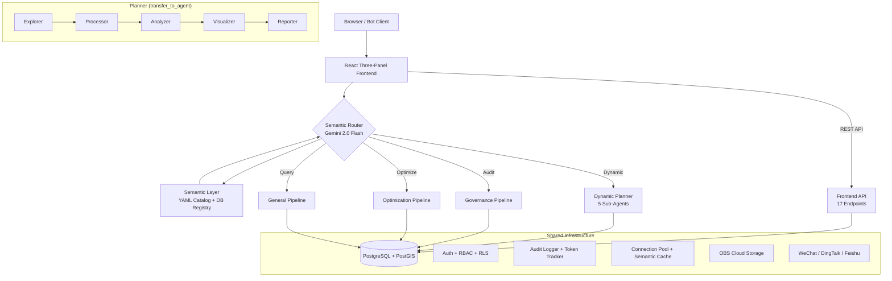

# GIS Data Agent (ADK Edition) v4.0

An AI-powered geospatial analysis platform that turns natural language into spatial intelligence. Built on **Google Agent Developer Kit (ADK)** with semantic intent routing, three specialized pipelines, a React three-panel frontend, and enterprise-grade security.

## Core Capabilities

### Data Governance (数据治理)
- Topological audit (overlaps, self-intersections, gaps)
- Schema compliance checking against national standards (GB/T 21010)
- Multi-modal verification: PDF reports vs SHP/DB metrics
- Automated governance reports (Word/PDF)

### Land Use Optimization (空间优化)
- Deep Reinforcement Learning engine (MaskablePPO) for layout optimization
- Fragmentation Index (FFI) with 6 landscape metrics
- Paired farmland/forest swaps with strict area balance

### Business Spatial Intelligence (商业智能)
- Semantic query: natural language → auto-mapped SQL with spatial operators
- Site selection with chain reasoning (Query → Buffer → Overlay → Filter)
- DBSCAN clustering, KDE heatmaps, choropleth maps
- POI search, driving distance, geocoding (batch + reverse)
- Interactive multi-layer map composition with NL layer control

## Architecture



**Pipeline routing**: `DYNAMIC_PLANNER=true` (default) uses the Planner with `transfer_to_agent`; `false` falls back to 3 fixed `SequentialAgent` pipelines.

**Model tiering**: Explorer/Visualizer → Gemini 2.0 Flash, Processor/Analyzer/Planner → Gemini 2.5 Flash, Reporter → Gemini 2.5 Pro.

## Quick Start

### Docker (recommended)
```bash
docker-compose up -d
# Visit http://localhost:8000
# Login: admin / admin123
```

### Local Development
```bash
# 1. Configure environment
cp data_agent/.env.example data_agent/.env
# Edit .env with your PostgreSQL/PostGIS credentials and Vertex AI config

# 2. Install dependencies
pip install -r requirements.txt

# 3. Run backend
chainlit run data_agent/app.py -w

# 4. Run frontend (dev mode, optional)
cd frontend && npm install && npm run dev
```

Default login: `admin` / `admin123` (seeded on first run). In-app self-registration available on the login page.

## Feature Matrix

| Category | Feature | Description |
|---|---|---|
| **AI Core** | Semantic Layer | YAML catalog (15 domains, 7 regions, 8 spatial ops) + 3-level hierarchy + DB annotations |
| | Skill Bundles | 5 named toolset groupings (spatial_analysis, data_quality, visualization, database, collaboration) |
| | NL Layer Control | Natural language show/hide/style/remove map layers via `control_map_layer` tool |
| **Data** | Data Lake | Unified data catalog across local/cloud/PostGIS backends with lineage tracking |
| | Real-time Streams | Redis Streams with geofence alerts + IoT data |
| | Remote Sensing | Raster analysis, NDVI, LULC/DEM download |
| **Frontend** | Three-Panel UI | Chat + Map + Data panels; React 18 + Leaflet.js + Recoil |
| | Token Dashboard | Per-user daily/monthly usage with pipeline breakdown visualization |
| | Map Annotations | Collaborative click-to-add annotations with team sharing |
| | Basemap Switcher | Gaode, Tianditu (conditional), CartoDB, OpenStreetMap |
| **Security** | Auth | Password + OAuth2 (Google) + in-app self-registration |
| | RBAC + RLS | admin/analyst/viewer roles + PostgreSQL Row-Level Security |
| | Account Management | User self-deletion with cascade cleanup + admin protection |
| | Audit Log | Enterprise audit trail with admin dashboard |
| **Enterprise** | Bot Integration | WeChat, DingTalk, Feishu enterprise bot adapters |
| | Team Collaboration | Team creation, member management, resource sharing |
| | Token Tracking | Per-user LLM usage with daily/monthly limits + pipeline breakdown |
| | Report Export | Word/PDF with page headers, footers, pipeline-specific titles |
| **Ops** | Health Check API | K8s liveness/readiness probes + admin system diagnostics |
| | CI Pipeline | GitHub Actions: tests, frontend build, agent evaluation |
| | Docker + K8s | Containerization, Helm/Kustomize, HPA, network policies |
| | Observability | Structured logging (JSON) + Prometheus metrics |

## Tech Stack

| Layer | Technology |
|---|---|
| **Framework** | Google ADK v1.21 (`google.adk.agents`, `google.adk.runners`) |
| **LLM** | Gemini 2.5 Flash / 2.5 Pro (agents), Gemini 2.0 Flash (router) |
| **Frontend** | React 18 + TypeScript + Vite + Leaflet.js + @chainlit/react-client |
| **Backend** | Chainlit + Starlette (17 REST API endpoints) |
| **Database** | PostgreSQL 16 + PostGIS 3.4 |
| **GIS** | GeoPandas, Shapely, Rasterio, PySAL, Folium, mapclassify, branca |
| **ML** | PyTorch, Stable Baselines 3 (MaskablePPO), Gymnasium |
| **Cloud** | Huawei OBS (S3-compatible) for file storage |
| **Streaming** | Redis Streams (with in-memory fallback) |
| **Container** | Docker + Docker Compose + Kubernetes (Kustomize) |
| **CI** | GitHub Actions (pytest + npm build + evaluation) |
| **Python** | 3.13+ |

## Project Structure

```
data_agent/
├── app.py                    # Chainlit UI, semantic router, auth, RBAC
├── agent.py                  # Agent definitions, pipeline assembly
├── frontend_api.py           # 17 REST API endpoints for React frontend
├── toolsets/                 # 16 BaseToolset modules
│   ├── exploration_tools.py  #   Data profiling & quality audit
│   ├── geo_processing_tools.py  # Buffer, clip, overlay, tessellation
│   ├── visualization_tools.py   # Choropleth, heatmap, layer control
│   ├── analysis_tools.py     #   Statistical analysis
│   ├── database_tools_set.py #   SQL query & table management
│   ├── semantic_layer_tools.py  # Semantic catalog browsing (9 tools)
│   ├── skill_bundles.py      #   5 named toolset groupings
│   ├── datalake_tools.py     #   Data catalog & lineage (8 tools)
│   ├── streaming_tools.py    #   Real-time stream data (5 tools)
│   ├── team_tools.py         #   Team collaboration (8 tools)
│   └── ...                   #   + location, memory, admin, file, remote sensing, spatial stats
├── prompts/                  # 3 YAML prompt files (optimization, planner, general)
├── migrations/               # 16 SQL migration scripts (001-016)
├── db_engine.py              # Connection pool singleton
├── health.py                 # K8s health check API + startup diagnostics
├── observability.py          # Structured logging + Prometheus metrics
├── data_catalog.py           # Unified data lake catalog + lineage tracking
├── semantic_layer.py         # Semantic catalog + 3-level hierarchy + TTL cache
├── map_annotations.py        # Collaborative map annotations CRUD
├── auth.py                   # Password/OAuth auth, registration, account deletion
├── audit_logger.py           # Enterprise audit trail
├── token_tracker.py          # LLM usage tracking + pipeline breakdown
├── memory.py                 # Persistent spatial memory
├── gis_processors.py         # GIS operations (tessellation, buffer, clip, overlay, ...)
├── drl_engine.py             # Gymnasium environment for land-use optimization
├── wecom_bot.py              # Enterprise WeChat bot adapter
├── dingtalk_bot.py           # DingTalk bot adapter
├── feishu_bot.py             # Feishu bot adapter
├── test_*.py                 # 48 test files (923+ tests)
└── run_evaluation.py         # Agent evaluation runner with JSON summary

frontend/
├── src/
│   ├── App.tsx               # Main app: auth, three-panel layout, user menu
│   ├── components/
│   │   ├── ChatPanel.tsx     # Chat interface + NL layer control
│   │   ├── MapPanel.tsx      # Leaflet map + annotations + basemap switcher
│   │   ├── DataPanel.tsx     # Files, CSV, catalog, history, usage (5 tabs)
│   │   ├── LoginPage.tsx     # Login + in-app registration
│   │   ├── AdminDashboard.tsx # Metrics, user management, audit log
│   │   └── UserSettings.tsx  # Account settings + self-deletion
│   └── styles/layout.css     # All styles (~1900 lines)
└── package.json

.github/workflows/ci.yml     # GitHub Actions CI pipeline
k8s/                          # 11 Kubernetes manifests
docs/                         # 8 documentation files
```

## Frontend Architecture

The frontend is a custom React SPA replacing Chainlit's default UI:

```
┌──────────────────┬──────────────────────────┬────────────────────┐
│  Chat Panel       │    Map Panel              │   Data Panel       │
│  (320px)          │   (flex-1)                │  (360px)           │
│                   │                           │                    │
│  Messages         │  Leaflet.js Map           │  5 tabs:           │
│  Streaming        │  GeoJSON Layers           │  - Files           │
│  Action Cards     │  Layer Control            │  - CSV Preview     │
│  NL Layer Ctrl    │  Annotations              │  - Data Catalog    │
│                   │  Basemap Switcher         │  - Pipeline History│
│                   │  Legend                    │  - Token Usage     │
└──────────────────┴──────────────────────────┴────────────────────┘
```

## REST API Endpoints (17 routes)

| Method | Path | Description |
|---|---|---|
| GET | `/api/catalog` | List data assets (keyword, type filters) |
| GET | `/api/catalog/{id}` | Asset detail |
| GET | `/api/catalog/{id}/lineage` | Data lineage (ancestors + descendants) |
| GET | `/api/semantic/domains` | Semantic domain list |
| GET | `/api/semantic/hierarchy/{domain}` | Browse domain hierarchy tree |
| GET | `/api/pipeline/history` | Pipeline execution history |
| GET | `/api/user/token-usage` | Token consumption + pipeline breakdown |
| DELETE | `/api/user/account` | Self-delete account (password confirmation) |
| GET | `/api/admin/users` | User list (admin only) |
| PUT | `/api/admin/users/{username}/role` | Update user role (admin only) |
| DELETE | `/api/admin/users/{username}` | Delete user (admin only) |
| GET | `/api/admin/metrics/summary` | System metrics (admin only) |
| GET/POST | `/api/annotations` | List / create map annotations |
| PUT/DELETE | `/api/annotations/{id}` | Update / delete annotation |
| GET | `/api/config/basemaps` | Available basemap layers |

## Running Tests

```bash
# All tests (923+ tests)
python -m pytest data_agent/ --ignore=data_agent/test_knowledge_agent.py -q

# Single module
python -m pytest data_agent/test_frontend_api.py -v

# Frontend build check
cd frontend && npm run build
```

## CI Pipeline

GitHub Actions workflow (`.github/workflows/ci.yml`) runs on push to `main`/`develop` and PRs:

1. **Unit Tests** — Python tests with PostGIS service container + JUnit XML output
2. **Frontend Build** — TypeScript compilation + Vite production build
3. **Agent Evaluation** — ADK agent evaluation on `main` push only (requires `GOOGLE_API_KEY` secret)

## Roadmap

| Version | Feature Set | Status |
|---|---|---|
| v1.0 | Local Files, Basic DRL | Done |
| v2.0 | Excel Geocoding, Report Generation | Done |
| v3.0 | PostGIS, Hard Routing | Done |
| v3.1 | Multi-Pipeline Architecture | Done |
| v3.2 | Semantic Layer, Business Suite | Done |
| v4.0-beta | Data Lake, Lineage, 3-Level Hierarchy, Health API | Done |
| v4.0 | Frontend Integration, Observability, CI, Skill Bundles | **Current** |
| v5.0 | Multi-Modal, 3D Visualization, MCP Marketplace | Planned |
