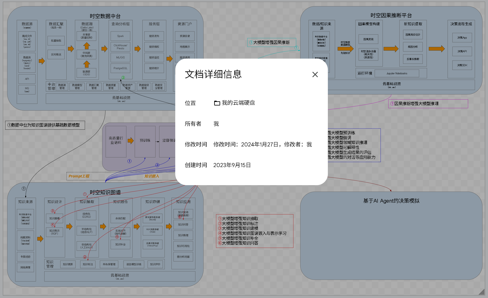
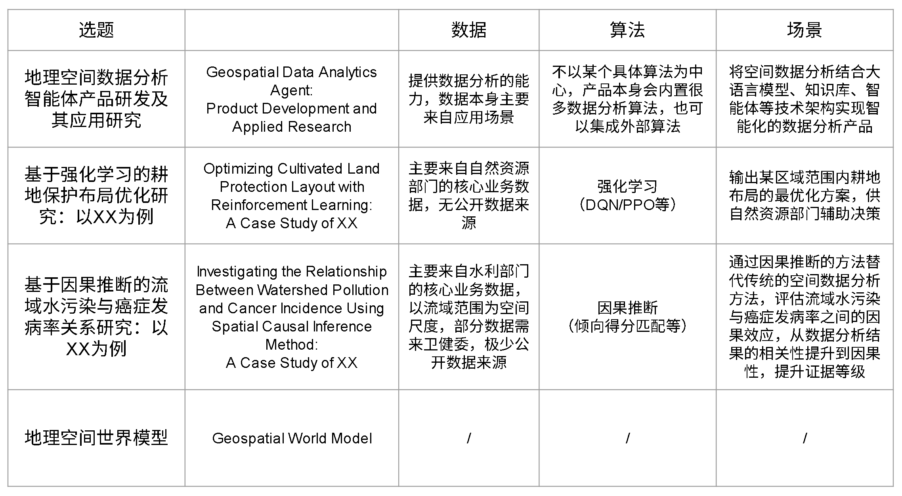
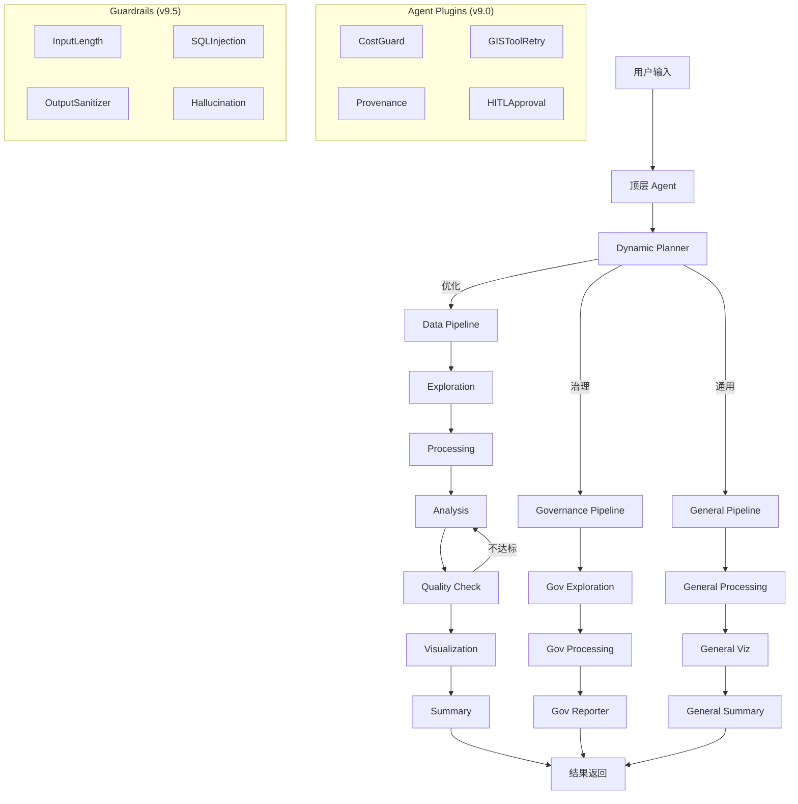

[English](./README_en.md) | **中文**

# GIS Data Agent (ADK Edition) v18.5

基于 **Google Agent Developer Kit (ADK) v1.27.2** 构建的 AI 驱动地理空间分析平台。通过多语言语义路由（中/英/日），自动调度三大专业管道完成空间数据治理、用地优化和通用空间智能分析。

系统实现了《Agentic Design Patterns》**21/21 (100%)** 设计模式，遵循 Google《Prototype to Production》AgentOps 白皮书规范（**78% 符合度**），涵盖 3 阶段 CI/CD（CI → Staging → Production）、评估门控、Canary 发布、Feature Flags、USD 成本熔断、HITL 审批、分布式追踪等生产级运维能力。

**v18.5 新增**：**智能体平台能力增强** — NL2Workflow（自然语言一句话生成可执行工作流 DAG，对标华为云 AgentArts 核心卖点）、提示词自动优化（bad case 收集 → 失败模式分析 → prompt 改进建议 → Human-in-the-loop 确认）、15 内置评估器（质量/安全/性能/准确性 4 大类，可插拔注册表）；**Palantir-inspired UI 重设计** — Deep Intelligence 深色主题（#0B0F19 base）、Inter + JetBrains Mono 字体、Lucide SVG 图标系统、DataPanel 3 组重构（数据资源/智能分析/平台运营）、左右分屏登录页、48px AppNav 图标导航栏。

**v18.0 新增**：**应用层数据库优化** — 连接池 5→20 + asyncpg 异步引擎（min=5, max=20）+ 读写分离接口预埋（华为云 RDS 只读副本就绪）+ 物化视图（mv_pipeline_analytics + mv_token_usage_daily）+ 连接池 Prometheus 监控（4 Gauge + 查询延迟 Histogram）。

## 项目思想起源

> 本项目的核心思想始于 2023 年 9 月，当时构想了一个将时空数据中台、时空知识图谱、因果推断平台与 AI Agent 决策模拟相融合的体系架构。经过两年多的迭代开发，这一愿景已在 GIS Data Agent 中逐步实现。

<p align="center">
  
</p>
<p align="center"><em>GIS Data Agent 项目的思想起源（2023 年 9 月）— 时空数据中台 × 因果推断 × 知识图谱 × AI Agent 决策</em></p>

<p align="center">
  
</p>
<p align="center"><em>Data Agent 项目中集成的世界模型、时空因果推断、深度强化学习的内容包含了毕业论文选题时所罗列的方向</em></p>

## 📚 官方技术文档

本项目提供基于 **DITA XML** 标准编写的工业级技术文档，内容涵盖架构白皮书、API 参考及多引擎配置指南等。

👉 **[在线阅读完整的 HTML 预览版 (中文)](docs/dita/preview.html)**

> **提示：** 
> 您可以通过运行 `python preview_docs.py` 自行编译最新的 DITA XML 源文件（位于 `docs/dita/` 目录），并查阅《多智能体架构深度解析》、《多源多模态数据融合引擎(MMFE)》、《GraphRAG 知识图谱》等深度内容。

## 📚 官方技术文档

本项目提供基于 **DITA XML** 标准编写的工业级技术文档，内容涵盖架构白皮书、API 参考及多引擎配置指南等。

👉 **[在线阅读完整的 HTML 预览版 (中文)](docs/dita/preview.html)**

> **提示：** 
> 您可以通过运行 `python preview_docs.py` 自行编译最新的 DITA XML 源文件（位于 `docs/dita/` 目录），并查阅《多智能体架构深度解析》、《多源多模态数据融合引擎(MMFE)》、《GraphRAG 知识图谱》等深度内容。

## 核心指标

| 指标 | 数值 |
|------|------|
| 测试覆盖 | 3300+ tests, 148 test files |
| 工具集 | 40 BaseToolset (含 OperatorToolset 4 算子 + ToolEvolutionToolset 8 工具), 5 SkillBundle, 240+ 工具 |
| ADK Skills | 26 场景化领域技能 (含 skill-creator AI 辅助创建) |
| REST API | 254 endpoints |
| DB 迁移 | 59 个 SQL 迁移 |
| DataPanel | 26 标签页 (3 分组: 数据资源/智能分析/平台运营) |
| Data Agent Level | **SIGMOD 2026 L3** (完整条件自主) |
| NL2Workflow | 自然语言 → 工作流 DAG (Kahn 拓扑排序 + 循环检测 + 23 Skill 元数据匹配) |
| 评估器 | 15 内置 (质量 5 + 安全 3 + 性能 3 + 准确性 4), 可插拔注册表 |
| 提示词优化 | bad case 三源收集 + LLM 失败分析 + prompt 改进 + HITL 确认 |
| UI 主题 | Palantir-inspired Deep Intelligence 深色主题 + Lucide SVG 图标 |
| 融合 v2.0 | 时序对齐 (3 插值 + 变化检测) + 语义增强 (本体 15 组 + LLM + KG) + 冲突解决 (6 策略) + 可解释性 (热力图 + 溯源), 84 新测试 |
| v16.0 L3 自主 | 语义算子 (4) + 多 Agent (13 子 Agent) + 错误恢复 (5 策略) + Guardrails (YAML 策略) + 遥感 Phase 1 (15+ 指数) + 工具演化 + AI Skill 生成 |
| Skill SDK | gis-skill-sdk v1.0.0 — CLI (new/validate/list/test/package) + 验证器 + 13/13 测试 |
| MCP 外部集成 | Claude Desktop + Cursor 完整配置指南 + stdio 传输层 |
| BCG 平台能力 | 6 大模块: Prompt Registry + Model Gateway + Context Manager + Eval Scenario + Token 追踪 + Eval 历史 |
| DB 优化 | 连接池 20+30 + asyncpg 异步 + 读写分离预埋 + 物化视图 + Prometheus 监控 |
| 矢量切片 | 三级自适应 (GeoJSON/FlatGeobuf/MVT) + Martin + 数据资产编码 DA-{TYPE}-{SRC}-{YEAR}-{SEQ} |
| 质检工作流 | 7 个预置模板 (3 通用 + DLG/DOM/DEM/三维模型专属), SLA 超时控制, DAG 并行, **前端一键生成质检报告 (4 模板 Word)** |
| 缺陷分类 | 30 个缺陷编码, 5 大类别 (FMT/PRE/TOP/MIS/NRM), 3 级严重度 (A/B/C), GB/T 24356 |
| 因果推断 | 三角度体系: A (GeoFM 统计 6 工具) + B (LLM 推理 4 工具) + C (因果世界模型 4 工具), 82 tests |
| 世界模型 | AlphaEarth 64-dim + LatentDynamicsNet 459K params + 5 情景 + 时间轴动画 + 因果干预/反事实 |
| DRL + World Model | Dreamer 式集成: ParcelEmbeddingMapper + ActionToScenarioEncoder + 辅助奖励前瞻 |
| NL2SQL | Schema-aware 动态查询 + 参数化安全 + 行政区模糊匹配 |
| 连接器 | 9 个插件式连接器 (WFS/STAC/OGC API/Custom API/WMS/ArcGIS REST/Database/ObjectStorage/ReferenceData) |
| 数据湖 | StorageManager 抽象层 (s3:// + file:// + postgis:// URI 路由 + 透明缓存) |
| 可观测性 | 25+ Prometheus 指标 + OTel 分布式追踪 + **告警规则引擎** + 实时监控仪表盘 + Grafana 模板 |
| 成本管理 | USD 定价表 (10 模型) + Token/USD 双级预算熔断 + 成本预估 |
| 数据安全 | PII 分类分级 (5 级) + 4 种脱敏策略 + 8 表 RLS 策略 + HITL 审批 (12 工具风险表) |
| 设计模式覆盖 | **21/21 (100%)** |

## 核心能力

### SIGMOD 2026 L3 条件自主能力 (v16.0)

7 大方向全面升级，达成完整条件自主 Data Agent 能力：

**1. 语义算子层 (S-4)**
- 4 个高阶算子：Clean / Integrate / Analyze / Visualize
- 自动策略选择：基于 DataProfile（行数/列数/几何类型/领域）智能路由
- 10+ 内置策略：crs_standardize / spatial_stats / drl_optimize / choropleth / heatmap 等
- OperatorToolset：5 个 ADK 工具暴露算子能力

**2. 多 Agent 协作 (S-5)**
- 4 个专家 Agent：DataEngineer / Analyst / Visualizer / RemoteSensing
- 2 个复合工作流：FullAnalysis (3 步) / RSAnalysis (2 步)
- Planner 扩展：7 → 13 子 Agent，支持专家委派
- prompts/multi_agent.yaml：独立 Agent 指令定义

**3. 计划精化与错误恢复 (S-6)**
- 5 策略恢复链：Retry → AlternativeTool → Simplify → Skip → Escalate
- PlanRefiner：自动插入修复步骤（CRS/拓扑/空值）
- 工作流集成：DAG 执行中自动恢复，recovered 状态标记
- TOOL_ALTERNATIVES 映射：20+ 工具降级路径

**4. Guardrails 策略引擎 (D-4)**
- YAML 驱动：standards/guardrail_policies.yaml
- 3 种效果：deny (静默拒绝) / require_confirmation (暂停) / allow (放行)
- 角色策略：viewer 禁用写操作 / analyst 确认导入 / admin 全放行
- GuardrailsPlugin：before_tool_callback 拦截

**5. 遥感智能体 Phase 1**
- 15+ 光谱指数：NDVI/EVI/SAVI/GNDVI/ARVI/NDRE/NDWI/MNDWI/NDBI/BSI/NBR/NDSI/CI/LAI/NDMI
- 经验池：6 个预置分析案例（农田/城市/水体/火灾/生态/积雪）
- 卫星预置源：5 个 STAC 模板（Sentinel-2/Landsat/Sentinel-1/DEM/LULC）
- 云覆盖评估：自动检测 + 降级建议

**6. 工具演化 (S-7)**
- 统一元数据注册表：50+ 工具描述/成本/可靠性/场景
- 失败驱动发现：分析失败模式 → 推荐替代/修复工具
- 动态注册/停用：运行时扩展工具库
- ToolEvolutionToolset：8 个工具（元数据查询/推荐/分析/注册）

**7. AI 辅助 Skill 创建 (D-5)**
- 自然语言 → Skill 配置：关键词分析 → 工具集推荐 → 指令生成
- skill-creator Skill：工作流定义（需求分析 → 推荐 → 生成 → 预览 → 保存）
- POST /api/skills/generate：一键生成完整 Skill 配置
- 支持中英文任务描述

### UI 增强与工具完善 (v15.9)

7 项用户体验优化与开发者工具完善，提升平台易用性和可扩展性：

**1. DRL 权重预设与工具提示**
- 3 种预设模式：平衡模式、坡度优先、连片优先
- 每个权重参数的工具提示说明
- 一键应用预设配置

**2. 字段映射拖拽编辑器**
- 原生 HTML5 拖放 API
- 表格视图 + 拖拽视图双模式切换
- 可视化映射连接显示

**3. MCP 外部客户端集成验证**
- Claude Desktop 完整配置指南
- Cursor IDE 集成说明
- stdio 传输层入口点（`mcp_server_stdio.py`）

**4. 任务分解确认 UI**
- 复杂查询自动分解为子任务
- 交互式任务编辑（描述/启用/禁用）
- 批准后执行 DAG 工作流

**5. 记忆提取确认流程**
- 管道执行后展示提取的记忆
- 用户编辑/添加/删除记忆
- 批量保存端点（`POST /api/memory/batch-save`）

**6. 消息总线监控面板**
- 统计卡片：总消息数、已送达、未送达、失败
- 消息列表过滤（发送者/接收者/类型/状态）
- 重放未送达消息、清理旧消息

**7. Skill SDK 完整发布**
- CLI 命令：new / validate / list / test / package
- 验证器模块（结构和元数据校验）
- 13/13 测试通过，可通过 PyPI 安装

### BCG 企业级平台能力 (v15.8)

基于 BCG《Building Effective Enterprise Agents》框架的 6 大平台能力，支持多场景部署和企业级运维：

**1. Prompt Registry（提示词注册表）**
- 环境隔离版本控制（dev/staging/prod）
- 数据库存储 + YAML 降级
- 版本部署与回滚：`create_version()` / `deploy()` / `rollback()`

**2. Model Gateway（模型网关）**
- 任务感知路由：3 模型（gemini-2.0-flash / 2.5-flash / 2.5-pro）
- 自动选择：基于 task_type、context_tokens、quality_requirement、budget
- 成本追踪：场景/项目归因，支持 FinOps 分析

**3. Context Manager（上下文管理器）**
- 可插拔提供者（语义层、知识库等）
- Token 预算强制执行
- 相关性排序优先级

**4. Eval Scenario Framework（场景化评估框架）**
- 场景专属指标（如测绘质检：defect_precision/recall/F1/fix_success_rate）
- 黄金数据集管理（`agent_eval_datasets` 表）
- 评估历史追踪

**5. 增强 Token 追踪**
- 场景和项目归因：`record_usage(scenario, project_id)`
- 多维度成本分析

**6. 增强评估历史**
- 场景、数据集、指标列：`record_eval_result(scenario, dataset_id, metrics)`

**API 端点**：8 个新端点（/api/prompts/*, /api/gateway/*, /api/context/*, /api/eval/*）

### 三角度时空因果推断体系 (v15.3)

三个互补角度构建完整的地理空间因果推断能力，为论文提供多维度证据支撑：

**Angle A — GeoFM 嵌入因果推断** (6 tools)
- **倾向得分匹配 (PSM)**：估计平均处理效应 (ATE/ATT)，支持空间距离加权匹配
- **暴露-响应函数 (ERF)**：连续暴露变量的因果剂量-响应关系
- **双重差分 (DiD)**：面板数据前后对比，支持实体固定效应
- **空间 Granger 因果**：VAR 模型逐对因果检验 + 热力图可视化
- **地理收敛交叉映射 (GCCM)**：非线性动力系统因果检测
- **因果森林**：异质性处理效应 (CATE) + 特征重要性
- **GeoFM 嵌入增强**：所有工具支持 `use_geofm_embedding=True`，将 AlphaEarth 64 维嵌入作为空间混淆控制变量

**Angle B — LLM 因果推理** (4 tools)
- **因果 DAG 构建**：Gemini 2.5 Pro 从地理问题中识别变量、混淆因子、中介变量和碰撞因子，生成 Mermaid 图 + networkx 可视化
- **反事实推理**：结构化推理链（"如果X没有发生，Y会怎样？"），含置信度和敏感性因子
- **因果机制解释**：接收 Angle A 的统计结果 JSON，LLM 给出因果机制解读和替代解释
- **What-If 情景生成**：生成结构化情景，自动映射到 Angle A 工具参数和 Angle C 世界模型情景

**Angle C — 因果世界模型** (4 tools)
- **空间干预预测**：对子区域施加干预情景，分析空间溢出效应（局部干预 → 全局影响）
- **反事实对比**：平行运行两个情景，逐像素计算 LULC 差异和因果效应图
- **嵌入空间处理效应**：用 cosine/euclidean/manhattan 距离度量两情景在嵌入空间的因果影响
- **统计先验整合**：用 Angle A 的 ATT 估计校准世界模型预测偏移（二分搜索情景编码缩放）

### 地理空间世界模型 (v15.2 Tech Preview)
- **JEPA 架构**：冻结 AlphaEarth 编码器（480M 参数）+ 轻量 LatentDynamicsNet 预测器（459K 参数）
- **嵌入空间预测**：在 64 维 L2 归一化超球面上学习土地利用变化动力学，无需像素级生成
- **5 种情景模拟**：城市蔓延、生态修复、农业集约化、气候适应、基线趋势
- **三大技术创新**：L2 流形保持 + 空洞卷积（170m 感受野）+ 多步展开训练损失
- **地图时间轴**：多年份 LULC 预测图层动画播放 + 卫星影像底图叠加
- **快捷路径**：世界模型请求跳过 LLM Planner 直接调用，仅 1 次 API 调用

### NL2SQL 动态数据查询 (v15.2)
- **Schema 发现**：`discover_database_schema()` 自动探索表结构、列类型、注释
- **参数化安全查询**：`execute_spatial_query()` 自动构造 LIKE 模糊匹配，零 SQL 注入风险
- **行政区划加载**：`load_admin_boundary()` 专用工具，自然语言地名 → 模糊匹配 → 自动 SQL → GeoJSON
- **动态扩展**：新增表到数据库后无需改代码，LLM 先发现 schema 再构造查询

### 多源数据智能融合 (v5.5–v7.0)
- **五阶段流水线**：画像 → 评估 → 对齐 → 融合 → 验证
- **10 种融合策略**：空间连接、属性连接、分区统计、点采样、波段叠加、矢量叠加、时态融合、点云高度赋值、栅格矢量化、最近邻连接
- **5 种数据模态**：矢量、栅格、表格、点云 (LAS/LAZ)、实时流
- **智能语义匹配**：
  - 四层渐进式匹配：精确 → 等价组 → 单位感知 → 模糊匹配
  - **v7.0 向量嵌入匹配**：Gemini text-embedding-004 语义相似度（可选启用）
  - 目录驱动等价组 + 分词相似度 + 类型兼容检查 + 单位自动转换
- **LLM 增强策略路由 (v7.0)**：Gemini 2.0 Flash 根据用户意图智能推荐融合策略
- **分布式/核外计算 (v7.0)**：大数据集（>50万行/500MB）自动分块处理，避免 OOM
- **地理知识图谱 (v7.0)**：networkx 实体关系建模，空间邻接/包含关系检测，N跳邻居查询
- **栅格自动处理**：CRS 重投影、分辨率重采样、大栅格窗口采样
- **增强质量验证**：10 项检查（空值率、几何有效性、拓扑验证、KS 分布偏移检测等）

### 数据治理
- 拓扑审计（重叠、自相交、间隙检测）
- 字段合规性检查（GB/T 21010 国标）
- 多模态校验：PDF 报告 vs SHP/数据库指标
- 自动生成治理报告（Word/PDF）
- 多源数据融合（v6.0 集成）

### 空间优化
- 深度强化学习引擎（MaskablePPO）用地布局优化
- **5 个 DRL 场景**：耕地优化、城市绿地布局、设施选址、交通网络、综合规划
- **NSGA-II 多目标 Pareto 优化**：快速非支配排序 + 拥挤距离，替代加权和方法
- **DRL + World Model Dreamer 集成 (v15.5)**：世界模型作为环境模型提供前瞻辅助奖励，ParcelEmbeddingMapper 将地块映射到 AlphaEarth 64D 嵌入，ActionToScenarioEncoder 将动作历史转换为场景向量
- 耕地/林地配对交换，严格面积平衡
- 分类着色地图渲染（Categorized Layer）：按地类/变化类型自动着色，中文图例

### 商业智能
- 语义查询：自然语言 → 自动映射 SQL + 空间算子
- 选址推理链（查询 → 缓冲 → 叠加 → 过滤）
- DBSCAN 聚类、KDE 热力图、分级设色
- POI 搜索、驾车距离、批量/反向地理编码
- 交互式多图层合成 + 自然语言图层控制

### 智能 Agent 协作 (v9.0)
- **Agent Plugins**：CostGuard (Token 预算)、GISToolRetry (智能重试)、Provenance (数据溯源)、HITLApproval (人机审批)
- **并行 Pipeline**：ParallelAgent 数据摄取，多源并行处理
- **跨会话记忆**：PostgresMemoryService 持久化对话记忆，跨会话上下文延续
- **智能任务分解**：TaskGraph DAG 分解 + 波次并行执行
- **Pipeline 分析**：延迟/成功率/Token 效率/吞吐量/Agent 分布 5 维度分析
- **Agent 生命周期钩子**：Prometheus 指标 + ProgressTracker 进度追踪

### 生产就绪加固 (v9.5)
- **Guardrails (4)**：InputLength (>50k 拒绝) + SQLInjection (注入检测) + OutputSanitizer (敏感信息清理) + Hallucination (幻觉警告)，递归挂载到所有子 Agent
- **SSE Streaming**：`run_pipeline_streaming()` 异步流式输出 + `/api/pipeline/stream` REST 端点
- **LongRunningFunctionTool**：DRL 优化异步执行，防止 Agent 重复调用
- **集中测试夹具**：conftest.py 共享 fixture，事件循环安全隔离

### 智能平台扩展 (v10.0)
- **GraphRAG 知识增强**：实体抽取 (Gemini+正则) → 共现图谱构建 → 图增强检索（向量 + 图邻居重排序），9 个 KB 工具
- **Per-User MCP 隔离**：用户可创建私有 MCP 服务器，owner_username + is_shared 控制可见性
- **用户自定义技能包**：DB 驱动的工具集 + ADK Skills 自由组合，意图触发匹配
- **高级空间分析 Tier 2**：IDW 插值、Kriging、地理加权回归 (GWR)、多时相变化检测、DEM 可视域分析
- **工作流模板市场**：5 个预置模板 + 发布/克隆/评分，一键复用工作流

### 虚拟数据层 + 连接器插件化 (v13.0–v14.5)
- **BaseConnector 插件架构 (v14.5)**：抽象基类 + ConnectorRegistry 注册表，6 个内置连接器
- **6 种数据源连接器**：WFS / STAC / OGC API / Custom API / **WMS/WMTS** (v14.5) / **ArcGIS REST FeatureServer** (v14.5)
- **Fernet 加密凭证存储**：连接器密钥安全持久化
- **查询时 CRS 自动对齐**：连接器返回 GeoDataFrame 后自动 `to_crs(target_crs)`
- **语义 Schema 映射**：text-embedding-004 向量嵌入 + 35 个规范地理空间词汇表自动字段匹配
- **连接器健康监控 + 图层发现**：端点连通性检测 + GetCapabilities / 服务信息自动发现
- **前端 WMS 图层渲染**：MapPanel 支持 `L.TileLayer.WMS` 直接渲染
- **FGDB 格式支持 (v14.5)**：Esri File Geodatabase 目录格式读取 + 图层枚举

### 数据标准与治理引擎 (v14.5)
- **Data Standard Registry**：YAML 标准定义 + 预置 GB/T 21010 地类编码表 (73 值) + DLTB 字段规范 (30 字段 M/C/O 约束) + 4 个代码表
- **标准驱动校验**：`check_field_standards` 通过标准 ID 自动加载，一键校验字段缺失/值域超限/类型不匹配
- **DataCleaningToolset (7 工具)**：空值填充（5 种策略）/ 编码映射转换 / 字段重命名 / 类型转换 / 异常值裁剪 / CRS 统一 / 缺失字段补齐

### MCP Server v2.0 (v13.1)
- **36+ 工具暴露**：底层 GIS 工具 + 6 个高阶元数据工具（search_catalog / get_data_lineage / list_skills / list_toolsets / list_virtual_sources / run_analysis_pipeline）
- 外部 Agent（Claude Desktop / Cursor）可通过 MCP 调用完整分析能力

### 可扩展平台 (v12.0–v14.3)
- **Custom Skills CRUD**：前端创建/编辑/删除自定义 LlmAgent，支持版本管理（最近 10 版回滚）、评分、克隆、审批发布
- **User-Defined Tools**：声明式工具模板（http_call / sql_query / file_transform / chain）
- **Marketplace 画廊**：聚合 Skills / Tools / Templates / Bundles，支持排序和热度排行
- **Skill SDK 规范**：`gis-skill-sdk` Python 包规范，外部开发者可独立开发 Skill
- **Plugin 插件系统**：动态注册自定义 DataPanel tab 插件
- **Skill 依赖图**：Skill A 依赖 Skill B 的 DAG 编排
- **Webhook 集成**：第三方平台 Skill 注册（GitHub Action / Zapier trigger）

### 多 Agent 编排增强 (v14.0–v14.3)
- **DAG 工作流**：拓扑排序 + 并行层 + 条件节点 + Custom Skill Agent 节点
- **节点级重试**：DAG 失败节点可单独重试，不重跑整个 workflow
- **A2A 双向 RPC**：Agent Card + Task lifecycle（submitted→working→completed）+ 主动调用远程 Agent
- **Agent Registry**：PostgreSQL 服务发现 + 心跳 + 状态管理
- **Circuit Breaker**：工具/Agent 连续失败时熔断，自动降级
- **条件分析链**：用户定义触发条件，pipeline 完成后自动执行后续分析

### 交互增强 (v14.0–v14.3)
- **多语言意图检测**：中/英/日自动识别 + 路由
- **意图消歧对话**：AMBIGUOUS 分类时弹出选择卡片
- **热力图支持**：deck.gl HeatmapLayer 集成
- **测量工具**：距离（Haversine）+ 面积（Shoelace）计算
- **3D 图层控制**：show/hide/opacity 调节面板
- **3D basemap 同步**：2D 底图选择自动同步到 3D 视图
- **GeoJSON 编辑器**：DataPanel 内粘贴/编辑 GeoJSON + 地图预览
- **标注导出**：GeoJSON / CSV 格式导出

### 多模态输入 (v5.2)
- 图片理解：自动分类上传图片，Gemini 视觉分析
- PDF 解析：文本提取 + 原生 PDF Blob 双策略
- 语音输入：Web Speech API，中/英文切换

### 3D 空间可视化 (v5.3)
- deck.gl + maplibre 3D 渲染器
- 支持拉伸体、柱状图、弧线图、散点图层
- 2D/3D 视图一键切换

### 工作流编排 (v5.4)
- 多步管道链式执行，参数化 Prompt 模板
- React Flow 可视化拖拽编辑器（数据输入/管道/技能 Agent/输出四种节点）
- **DAG 执行引擎**：拓扑排序 + 并行层 + 条件节点 + 跨步骤参数引用
- APScheduler Cron 定时执行
- Webhook 结果推送

### 用户自助扩展平台 (v12.0)
- **Custom Skills 前端 CRUD**：在"能力"Tab 创建/编辑/删除自定义 Agent（指令+工具集+触发词+模型等级）
- **User-Defined Tools**：声明式工具模板（HTTP 调用/SQL 查询/文件转换/链式组合），动态构建 ADK FunctionTool，通过 UserToolset 暴露给 Agent
- **多 Agent Pipeline 编排**：WorkflowEditor 新增 Skill Agent 节点，可视化编排多个自定义 Agent 组成 DAG 工作流
- **能力浏览 Tab**：聚合展示内置技能、自定义技能、工具集、自建工具，支持分类过滤和搜索
- **知识库 Tab**：KB CRUD、文档管理、语义搜索，支持 GraphRAG 图增强检索
- **面板拖拽调整**：三面板布局支持拖拽分隔条调整宽度（240-700px）

### 数据血缘与行业模板 (v12.1)
- **分析血缘自动追踪**：pipeline_run_id ContextVar 贯穿执行链，每次工具输出自动注册到 Data Catalog 并关联来源资产
- **血缘 DAG 可视化**：DataPanel 资产详情中横向 DAG 布局（来源→当前→派生），SVG 箭头连接，类型徽章
- **行业分析模板**：3 个首批行业模板（城市热岛效应分析、植被变化检测、土地利用优化），一键导入为工作流
- **CapabilitiesView 行业分组**：能力浏览 Tab 新增"行业模板"过滤器，按行业分类展示
- **API 模块化重构 (S-4)**：MCP Hub / Workflow / Skills 路由提取至独立模块，提取率 42%
- **Cartographic Precision UI**：Space Grotesk 字体 + Teal/Amber 配色 + 暖白 Stone 背景 + 等高线登录页
- **安全加固**：DB 降级后门移除 + 暴力破解防护（5 次失败锁定 15 分钟）
- **架构重构**：app.py 拆分（intent_router.py + pipeline_helpers.py 提取）+ React Error Boundaries

## 核心架构：多智能体协作网络

GIS Data Agent 采用了先进的**层级式多智能体架构（Hierarchical Multi-Agent Architecture）**。系统内置了三种主要的工作流（Pipeline），并由一个顶层的 `Dynamic Planner` 进行意图识别和动态分发，完美践行了 ADK 的 `Generator-Critic` 和 `AgentTool` 最佳实践。



**管道路由**：`DYNAMIC_PLANNER=true`（默认）使用规划器进行动态意图分配，极大地降低了单体大模型的上下文负担。

**模型分层**：Explorer/Visualizer → Gemini 2.0 Flash，Processor/Analyzer/Planner → Gemini 2.5 Flash，Reporter → Gemini 2.5 Pro。

## 快速开始

### Docker（推荐）
```bash
docker-compose up -d
# 访问 http://localhost:8000
# 登录: admin / admin123
```

### 本地开发
```bash
# 1. 配置环境
cp data_agent/.env.example data_agent/.env
# 编辑 .env，填入 PostgreSQL/PostGIS 凭据和 Vertex AI 配置

# 2. 安装依赖
pip install -r requirements.txt

# 3. 启动后端
chainlit run data_agent/app.py -w

# 4. 启动前端（开发模式，可选）
cd frontend && npm install && npm run dev
```

默认账号：`admin` / `admin123`（首次运行自动创建种子用户，建议登录后修改密码）。登录页内置自助注册。注意：数据库必须可用才能登录。

## 功能矩阵

| 类别 | 功能 | 描述 |
|---|---|---|
| **AI 核心** | 语义层 | YAML 目录（15 领域、7 区域、8 空间算子）+ 3 级层次 + DB 注解 |
| | 技能包 | 18 个细粒度场景技能（耕地合规、坐标变换、空间聚类、PostGIS 分析等），三级增量加载 (v7.5) |
| | 自定义 Skills | DB 驱动用户自建专家 Agent：自定义指令/工具集/触发词，@mention 调用，LLM 注入防护，**前端完整 CRUD** (v8.0/v12.0) |
| | 自定义 Tools | 声明式工具模板 (HTTP/SQL/文件/链式)，动态 FunctionTool 构建，UserToolset (v12.0) |
| | NL 图层控制 | 自然语言 显示/隐藏/样式/移除 地图图层 |
| | MCP 工具市场 | 配置驱动的 MCP 服务器连接 + 工具聚合 + DB 持久化 + 管理 UI + per-User 隔离 (v7.1/v10.0) |
| | 分析视角注入 | 用户自定义分析关注点，自动注入 Agent 提示词 (v7.1) |
| | Memory ETL | 管道执行后自动提取关键发现，智能去重，配额管理 (v7.5) |
| | 动态工具加载 | 按意图动态裁剪工具列表 (8 类别 + 10 核心工具)，ContextVar + ToolPredicate (v7.5) |
| | 失败学习 | 工具失败模式记录 + 历史经验提示注入 + 自动标记已解决 (v8.0) |
| | 动态模型选择 | 任务复杂度评估 → fast/standard/premium 模型自适应切换 (v8.0) |
| | Context Caching | Gemini 上下文缓存：长系统提示复用，降低 Token 成本，环境变量控制 TTL (v7.5) |
| | 反思循环 | 全部 3 条管道含 LoopAgent 质量反思 (v7.1) |
| **Agent 协作** | Agent Plugins | CostGuard (Token 预算) + GISToolRetry (智能重试) + Provenance (数据溯源) + HITLApproval (人机审批) (v9.0) |
| | ParallelAgent | 并行数据摄取 Pipeline，多源并行处理 (v9.0) |
| | 跨会话记忆 | PostgresMemoryService 持久化对话记忆，跨会话上下文延续 (v9.0) |
| | 任务分解 | TaskGraph DAG 分解 + 波次并行执行 (v9.0) |
| | Pipeline 分析 | 延迟/成功率/Token 效率/吞吐量/Agent 分布 5 维度分析 (v9.0) |
| | Agent Hooks | Prometheus 指标 + ProgressTracker 按管道追踪完成百分比 (v9.0) |
| **生产加固** | Guardrails | 4 个输入/输出护栏：InputLength + SQLInjection + OutputSanitizer + Hallucination (v9.5) |
| | SSE Streaming | run_pipeline_streaming() 异步流式 + /api/pipeline/stream 端点 (v9.5) |
| | LongRunningTool | DRL 优化异步执行，防止重复调用 (v9.5) |
| | conftest.py | 集中测试夹具，事件循环安全隔离 (v9.5) |
| **v10.0 扩展** | GraphRAG | 实体抽取 + 知识图谱构建 + 图增强向量检索 (v10.0) |
| | Per-User MCP | 用户级 MCP 服务器隔离，私有/共享控制 (v10.0) |
| | 自定义技能包 | 用户自由组合工具集+ADK Skills 的 DB 驱动技能包 (v10.0) |
| | 空间分析 Tier 2 | IDW/Kriging/GWR/变化检测/可视域分析 5 个高级工具 (v10.0) |
| | 工作流模板 | 预置+用户发布的工作流模板市场，克隆/评分 (v10.0) |
| **数据融合** | 融合引擎 (MMFE) | 五阶段流水线（画像→评估→对齐→融合→验证），10 种策略，5 种模态 |
| | 语义匹配 | 五层渐进匹配：精确 → 等价组 → 嵌入相似度 → 单位感知 → 模糊 |
| | 嵌入匹配 (v7.0) | Gemini text-embedding-004 向量语义匹配（可选启用） |
| | LLM 策略路由 (v7.0) | Gemini 2.0 Flash 意图感知策略推荐 (`strategy="llm_auto"`) |
| | 知识图谱 (v7.0) | networkx 空间实体关系建模，N跳邻居查询，最短路径 |
| | 分布式计算 (v7.0) | 大数据集 (>500K行) 自动分块读取和处理 |
| | 栅格处理 | 自动 CRS 重投影、分辨率重采样、大栅格窗口采样 |
| | 点云 & 流数据 | LAS/LAZ 高度赋值、CSV/JSON 流数据时态融合（时间窗口+空间聚合） |
| | 质量验证 | 10 项检查：空值/几何/拓扑/CRS/微面/异常值/KS分布偏移 |
| **多模态** | 图片理解 | 自动分类上传图片 → Gemini 视觉分析 |
| | PDF 解析 | pypdf 文本提取 + 原生 PDF Blob 双策略 |
| | 语音输入 | Web Speech API，中/英切换，脉冲动画 |
| **3D 可视化** | deck.gl 渲染 | 拉伸体、柱状图、弧线、散点图层 |
| | 2D/3D 切换 | MapPanel 一键切换，自动检测 3D 图层 |
| **工作流** | 引擎 | 多步管道链式执行 + 参数化模板 |
| | 可视化编辑器 | React Flow 拖拽编辑，4 种自定义节点（数据输入/管道/技能Agent/输出）(v7.1/v12.0) |
| | 定时执行 | APScheduler Cron 调度 |
| | Webhook 推送 | 执行完成后 HTTP POST 结果 |
| **数据** | 数据湖 | 统一数据目录 + 血缘追踪 + 资产一键下载（本地/云/PostGIS） |
| | RAG 知识库 | 用户上传文档 → 向量化存储 → 语义搜索，多租户隔离 (v8.0) |
| | 实时流 | Redis Streams 地理围栏告警 + IoT 数据 |
| | 遥感分析 | 栅格分析、NDVI、LULC/DEM 下载 |
| **前端** | 三面板 UI | 对话 + 地图 + 数据；13 个标签页；面板拖拽调整；React Error Boundary；React 18 + Leaflet + deck.gl |
| | 分类着色图层 | `categorized` 图层类型：按属性字段自动着色多边形 + 中文图例（v7.5） |
| | 文件管理 | 数据面板点击文件即可打开/下载（PDF/DOCX/HTML 等）(v7.5) |
| | Action 按钮 | 导出 PDF 报告、分享结果等按钮通过 ChainlitAPI 调用后端回调 (v7.5) |
| | Token 仪表盘 | 每用户日/月用量 + 管线分布可视化 |
| | 地图标注 | 协作式点击标注 + 团队共享 |
| | 底图切换 | 高德、天地图、CartoDB、OSM |
| **安全** | 认证 | 密码 + OAuth2 (Google) + 应用内自注册 + 暴力破解防护 (v12.0) |
| | MCP 安全加固 | per-User 工具隔离 + 安全沙箱 + 审计日志 (v7.5) |
| | RBAC + RLS | admin/analyst/viewer 角色 + PostgreSQL 行级安全 |
| | 账户管理 | 用户自助删除 + 级联清理 + 管理员保护 |
| | 审计日志 | 企业级审计追踪 + 管理仪表盘 |
| **企业** | Bot 集成 | 企业微信、钉钉、飞书 Bot 适配器 |
| | 团队协作 | 团队创建、成员管理、资源共享 |
| | 报告导出 | Word/PDF 含页眉页脚、管线定制标题 |
| **运维** | 健康检查 | K8s 存活/就绪探针 + 系统诊断 |
| | CI 管道 | GitHub Actions：测试 + 前端构建 + Agent 评估 + 评估门控 (v8.0) |
| | 容器化 | Docker + K8s (Kustomize)、HPA、网络策略 |
| | 可观测性 | 结构化日志 (JSON) + Prometheus 指标 + 端到端 Trace ID (v7.1) |
| | 国际化 | 中/英双语，YAML 字典 + ContextVar |

## 技术栈

| 层级 | 技术 |
|---|---|
| **框架** | Google ADK v1.27.2 (`google.adk.agents`, `google.adk.runners`) |
| **LLM** | Gemini 2.5 Flash / 2.5 Pro（Agent），Gemini 2.0 Flash（路由） |
| **前端** | React 18 + TypeScript + Vite + Leaflet.js + deck.gl + React Flow |
| **后端** | Chainlit + Starlette（241 个 REST API 端点 + SSE Streaming） |
| **数据库** | PostgreSQL 16 + PostGIS 3.4 |
| **GIS** | GeoPandas, Shapely, Rasterio, PySAL, Folium, mapclassify |
| **ML** | PyTorch, Stable Baselines 3 (MaskablePPO), Gymnasium |
| **云存储** | 华为 OBS（S3 兼容） |
| **流式** | Redis Streams（含内存回退） |
| **容器** | Docker + Docker Compose + Kubernetes (Kustomize) |
| **CI** | GitHub Actions（pytest + npm build + evaluation + route-eval） |
| **Python** | 3.13+ |

## 项目结构

```
data_agent/
├── app.py                       # Chainlit UI、RBAC、文件上传、管线调度 (3267 行)
├── agent.py                     # Agent 定义、管道组装、ParallelAgent
├── intent_router.py             # 语义意图路由 (从 app.py 提取)
├── pipeline_helpers.py          # 管线辅助：工具说明、进度渲染、错误分类
├── frontend_api.py              # 237 个 REST API 端点
├── pipeline_runner.py           # 无头管道执行器 + SSE 流式输出
├── dreamer_env.py               # DRL-World Model Dreamer 环境 (v15.5)
├── workflow_engine.py           # 工作流引擎：CRUD、顺序+DAG 执行、Webhook、Cron
├── multimodal.py                # 多模态输入：图片/PDF 分类、Gemini Part 构建
├── mcp_hub.py                   # MCP Hub Manager：配置驱动的 MCP 服务器管理
├── fusion_engine.py             # 多模态数据融合引擎（MMFE，~2100 行）
├── knowledge_graph.py           # 地理知识图谱引擎（networkx，~625 行）
├── custom_skills.py             # DB 驱动自定义 Skills：CRUD、验证、Agent 工厂
├── user_tools.py                # 用户自定义工具：声明式模板 CRUD (v12.0)
├── user_tool_engines.py         # 工具执行引擎：http_call/sql_query/file_transform/chain (v12.0)
├── capabilities.py              # 能力发现：聚合内置技能+工具集元数据 (v12.0)
├── failure_learning.py          # 工具失败模式学习：记录、查询、标记已解决
├── auth.py                      # 认证：密码/OAuth + 暴力破解防护 (v12.0 加固)
├── plugins.py                   # Agent Plugins：CostGuard、GISToolRetry、Provenance、HITL
├── guardrails.py                # Agent Guardrails：4 个输入/输出护栏（递归挂载）
├── conversation_memory.py       # PostgresMemoryService 跨会话记忆
├── task_decomposer.py           # TaskGraph DAG 任务分解 + 波次并行
├── pipeline_analytics.py        # Pipeline 分析仪表盘（5 个 REST 端点）
├── agent_hooks.py               # Agent 生命周期钩子（Prometheus + ProgressTracker）
├── knowledge_base.py            # RAG 知识库：文档向量化 + 语义搜索
├── graph_rag.py                 # GraphRAG：实体抽取 + 图构建 + 图增强检索 (v10.0)
├── custom_skill_bundles.py      # 用户自定义技能包：CRUD + 工厂 + 意图匹配 (v10.0)
├── workflow_templates.py        # 工作流模板市场：CRUD + 克隆 + 评分 (v10.0)
├── spatial_analysis_tier2.py    # 高级空间分析：IDW/Kriging/GWR/变化检测/可视域 (v10.0)
├── conftest.py                  # 集中测试夹具 + 事件循环安全
├── toolsets/                    # 40 个 BaseToolset 模块 (含 DreamerToolset)
│   ├── visualization_tools.py   #   11 个工具：分级设色、热力图、3D、图层控制
│   ├── analysis_tools.py        #   分析工具 + LongRunningFunctionTool (DRL)
│   ├── dreamer_tools.py         #   DRL-World Model Dreamer 集成工具 (v15.5)
│   ├── governance_tools.py      #   18 个工具：质量审计 + 标准校验 + 缺陷分类 + 精度核验
│   ├── data_cleaning_tools.py   #   11 个工具：清洗/转换/补齐/几何修复 (v14.5+v15.7)
│   ├── virtual_source_tools.py  #   7 个工具：数据源查询 + WMS 图层 + 图层发现
│   ├── fusion_tools.py          #   数据融合工具集（4 个工具）
│   ├── knowledge_graph_tools.py #   知识图谱工具集（3 个工具）
│   ├── user_tools_toolset.py    #   用户自定义工具桥接 (v12.0)
│   ├── mcp_hub_toolset.py       #   MCP 工具桥接
│   ├── skill_bundles.py         #   18 个场景技能分组
│   ├── spatial_analysis_tier2_tools.py # IDW/Kriging/GWR/变化检测/可视域 (v10.0)
│   └── ...                      #   探查、地理处理、数据库、语义层等
├── connectors/                  # 插件式数据源连接器 (v14.5)
│   ├── __init__.py              #   BaseConnector ABC + ConnectorRegistry
│   ├── wfs.py / stac.py / ogc_api.py / custom_api.py
│   ├── wms.py                   #   WMS/WMTS 图层配置连接器
│   └── arcgis_rest.py           #   ArcGIS FeatureServer 分页查询连接器
├── standard_registry.py         # 数据标准注册表 (v14.5)
├── standards/                   # 预置行业标准 YAML (v14.5)
│   ├── dltb_2023.yaml           #   DLTB 30 字段 + 4 代码表
│   └── gb_t_21010_2017.yaml     #   GB/T 21010 地类编码 73 值
├── skills/                      # 18 个 ADK 场景技能（kebab-case 目录）
├── prompts/                     # 3 个 YAML 提示词文件
├── evals/                       # Agent 评估框架（trajectory + rubric）
├── migrations/                  # 38 个 SQL 迁移脚本
├── locales/                     # 国际化：zh.yaml + en.yaml
├── db_engine.py                 # 连接池单例
├── tool_filter.py               # 意图驱动动态工具过滤（ToolPredicate + ContextVar）
├── health.py                    # K8s 健康检查 API
├── observability.py             # 结构化日志 + Prometheus
├── i18n.py                      # 国际化：YAML + t() 函数
├── test_*.py                    # 102 个测试文件 (2420+ 测试)
└── run_evaluation.py            # Agent 评估运行器

frontend/
├── src/
│   ├── App.tsx                  # 主应用：认证、三面板布局
│   ├── components/
│   │   ├── ChatPanel.tsx        # 对话 + 语音输入 + NL 图层控制
│   │   ├── MapPanel.tsx         # Leaflet 地图 + 2D/3D 切换 + 标注
│   │   ├── Map3DView.tsx        # deck.gl 3D 渲染器
│   │   ├── DataPanel.tsx        # 13 标签页：文件/表格/资产/历史/用量/工具/工作流/建议/任务/模板/分析/能力/知识库
│   │   ├── WorkflowEditor.tsx   # React Flow 工作流可视化编辑器（含 Skill Agent 节点）
│   │   ├── LoginPage.tsx        # 登录 + 应用内注册
│   │   ├── AdminDashboard.tsx   # 管理仪表盘
│   │   └── UserSettings.tsx     # 账户设置 + 自助删除
│   └── styles/layout.css        # 全部样式 (~2400 行)
└── package.json

.github/workflows/ci.yml        # GitHub Actions CI 管道
k8s/                             # 11 个 Kubernetes 清单
docs/                            # 文档
```

## 前端架构

自定义 React SPA 替代 Chainlit 默认 UI：

```
┌───────────────────┬──────────────────────────┬──────────────────────┐
│  对话面板 (var)    │    地图面板 (flex-1)       │   数据面板 (var)     │
│                    │                           │                      │
│  消息流             │  Leaflet / deck.gl 地图    │  13 个标签页:         │
│  流式输出           │  GeoJSON 图层              │  - 文件               │
│  操作卡片           │  2D/3D 切换               │  - 表格预览            │
│  语音输入           │  图层控制                  │  - 数据资产            │
│  NL 图层控制        │  协作标注                  │  - 管线历史            │
│                    │  底图切换                   │  - Token 用量         │
│                    │  图例                      │  - MCP 工具           │
│                    │                           │  - 工作流              │
│                    │                           │  - 建议/任务/模板/分析 │
│                    │                           │  - 能力/知识库         │
└───────────────────┴──────────────────────────┴──────────────────────┘
```

## REST API 端点（95 条路由）

| 方法 | 路径 | 描述 |
|---|---|---|
| GET | `/api/catalog` | 数据资产列表（关键词/类型筛选） |
| GET | `/api/catalog/{id}` | 资产详情 |
| GET | `/api/catalog/{id}/lineage` | 数据血缘（上下游） |
| GET | `/api/semantic/domains` | 语义领域列表 |
| GET | `/api/semantic/hierarchy/{domain}` | 领域层次浏览 |
| GET | `/api/pipeline/history` | 管线执行历史 |
| GET | `/api/pipeline/stream` | SSE 流式管线输出 (v9.5) |
| GET | `/api/user/token-usage` | Token 消耗 + 管线分布 |
| DELETE | `/api/user/account` | 自助删除账户 |
| GET/PUT | `/api/user/analysis-perspective` | 分析视角查看/设置 (v7.1) |
| GET | `/api/user/memories` | 自动提取的智能记忆列表 (v7.5) |
| DELETE | `/api/user/memories/{id}` | 删除指定智能记忆 (v7.5) |
| GET | `/api/sessions` | 会话列表 |
| DELETE | `/api/sessions/{id}` | 删除会话 |
| GET/POST | `/api/annotations` | 标注列表/创建 |
| PUT/DELETE | `/api/annotations/{id}` | 更新/删除标注 |
| GET | `/api/config/basemaps` | 底图配置 |
| GET | `/api/admin/users` | 用户列表（管理员） |
| PUT | `/api/admin/users/{username}/role` | 修改角色（管理员） |
| DELETE | `/api/admin/users/{username}` | 删除用户（管理员） |
| GET | `/api/admin/metrics/summary` | 系统指标（管理员） |
| GET | `/api/mcp/servers` | MCP 服务器状态 |
| POST | `/api/mcp/servers` | 添加 MCP 服务器 (v7.1) |
| GET | `/api/mcp/tools` | MCP 工具列表 |
| POST | `/api/mcp/servers/test` | MCP 连接测试 |
| POST | `/api/mcp/servers/{name}/toggle` | MCP 启停（管理员） |
| POST | `/api/mcp/servers/{name}/reconnect` | MCP 重连（管理员） |
| PUT | `/api/mcp/servers/{name}` | 更新 MCP 服务器配置 (v7.1) |
| DELETE | `/api/mcp/servers/{name}` | 删除 MCP 服务器 (v7.1) |
| GET/POST | `/api/workflows` | 工作流列表/创建 |
| GET/PUT/DELETE | `/api/workflows/{id}` | 工作流详情/更新/删除 |
| POST | `/api/workflows/{id}/execute` | 执行工作流 |
| GET | `/api/workflows/{id}/runs` | 执行历史 |
| GET | `/api/workflows/{id}/runs/{run_id}/status` | 执行状态查询 |
| GET | `/api/map/pending` | 待处理地图更新（前端轮询） |
| GET/POST | `/api/skills` | 自定义 Skills 列表/创建 (v8.0) |
| GET/PUT/DELETE | `/api/skills/{id}` | Skill 详情/更新/删除 (v8.0) |
| GET/POST | `/api/kb` | 知识库列表/创建 (v8.0) |
| POST | `/api/kb/search` | 知识库语义搜索 (v8.0) |
| GET/DELETE | `/api/kb/{id}` | 知识库详情/删除 (v8.0) |
| POST | `/api/kb/{id}/documents` | 上传知识库文档 (v8.0) |
| DELETE | `/api/kb/{id}/documents/{doc_id}` | 删除知识库文档 (v8.0) |
| GET | `/api/analytics/latency` | 管线延迟分析 (v9.0) |
| GET | `/api/analytics/tool-success` | 工具成功率分析 (v9.0) |
| GET | `/api/analytics/token-efficiency` | Token 效率分析 (v9.0) |
| GET | `/api/analytics/throughput` | 管线吞吐量分析 (v9.0) |
| GET | `/api/analytics/agent-breakdown` | Agent 分布分析 (v9.0) |
| GET | `/api/mcp/servers/mine` | 我的 MCP 服务器 (v10.0) |
| POST | `/api/mcp/servers/{name}/share` | MCP 共享切换 (v10.0) |
| GET/POST | `/api/bundles` | 技能包列表/创建 (v10.0) |
| GET | `/api/bundles/available-tools` | 可用工具集+技能列表 (v10.0) |
| GET/PUT/DELETE | `/api/bundles/{id}` | 技能包详情/更新/删除 (v10.0) |
| GET/POST | `/api/templates` | 工作流模板列表/创建 (v10.0) |
| GET/PUT/DELETE | `/api/templates/{id}` | 模板详情/更新/删除 (v10.0) |
| POST | `/api/templates/{id}/clone` | 克隆模板为工作流 (v10.0) |
| POST | `/api/kb/{id}/build-graph` | 构建知识库实体图谱 (v10.0) |
| GET | `/api/kb/{id}/graph` | 实体关系图谱数据 (v10.0) |
| POST | `/api/kb/{id}/graph-search` | 图增强语义搜索 (v10.0) |
| GET | `/api/kb/{id}/entities` | 知识库实体列表 (v10.0) |
| GET | `/api/capabilities` | 能力聚合（内置技能+自定义技能+工具集+用户工具）(v12.0) |
| GET/POST | `/api/user-tools` | 用户自定义工具列表/创建 (v12.0) |
| GET/PUT/DELETE | `/api/user-tools/{id}` | 用户工具详情/更新/删除 (v12.0) |
| POST | `/api/user-tools/{id}/test` | 用户工具试运行 (v12.0) |
| POST | `/api/tasks/submit` | 异步任务提交 |
| GET | `/api/tasks` | 任务列表 |
| GET/DELETE | `/api/tasks/{id}` | 任务详情/取消 |
| GET | `/api/suggestions` | 主动探索建议 |
| POST | `/api/suggestions/{id}/execute` | 执行建议 |
| POST | `/api/suggestions/{id}/dismiss` | 忽略建议 |

## 运行测试

```bash
# 全量测试 (2420+ 测试)
python -m pytest data_agent/ --ignore=data_agent/test_knowledge_agent.py -q

# 单个模块
python -m pytest data_agent/test_guardrails.py -v

# 前端构建检查
cd frontend && npm run build
```

## CI 管道

GitHub Actions 工作流（`.github/workflows/ci.yml`）在 push 到 `main`/`develop` 及 PR 时触发：

1. **单元测试** — Python 测试 + PostGIS 服务容器 + JUnit XML
2. **前端构建** — TypeScript 编译 + Vite 生产构建
3. **Agent 评估** — 仅 `main` push 触发（需 `GOOGLE_API_KEY` secret）
4. **路由评估** — API 端点计数校验

## 版本路线

| 版本 | 功能集 | Tests | 状态 |
|---|---|---|---|
| v1.0–v3.2 | 基础 GIS、PostGIS、语义层、多管道架构 | — | ✅ 完成 |
| v4.0 | 前端三面板 SPA、可观测性、CI/CD、技能包、协作标注 | — | ✅ 完成 |
| v4.1 | 会话持久化、管道进度可视化、错误恢复、数据预览、i18n | — | ✅ 完成 |
| v5.1–v5.6 | MCP 市场、多模态输入、3D 可视化、工作流编排、融合引擎 | — | ✅ 完成 |
| v6.0 | 融合增强（栅格重投影、点云、流数据、语义增强） | — | ✅ 完成 |
| v7.0 | 向量嵌入匹配、LLM 策略路由、知识图谱、分布式计算 | — | ✅ 完成 |
| v7.1 | MCP 管理 UI、WorkflowEditor、分析视角、反思推广、Trace ID | — | ✅ 完成 |
| v7.5 | MCP 安全加固、Memory ETL、动态工具加载、16 场景化 Skills、Context Caching | 1530 | ✅ 完成 |
| v8.0 | 失败学习、动态模型选择、评估门控 CI、DB 自定义 Skills、RAG 知识库 | 1735 | ✅ 完成 |
| v9.0 | Agent Plugins (4)、ParallelAgent、跨会话记忆、任务分解、Pipeline Analytics、Agent Hooks | 1859 | ✅ 完成 |
| v9.5 | conftest.py、Guardrails (4)、SSE Streaming、LongRunningFunctionTool、评估增强 | 1895 | ✅ 完成 |
| v10.0 | GraphRAG、per-User MCP 隔离、自定义技能包、高级空间分析 Tier 2、工作流模板 | 1993 | ✅ 完成 |
| v11.0 | 并发任务队列、推理链+置信度、主动探索建议、A2A 互操作、设计模式 19/21 | 2074 | ✅ 完成 |
| v12.0 | 自助扩展平台：Custom Skills CRUD、User Tools、多 Agent Pipeline 编排、能力浏览 Tab、知识库 Tab、面板拖拽、安全加固（SEC-1/SEC-2）、app.py 拆分、ADK v1.27.2 | 2121 | ✅ 完成 |
| v12.1 | 数据血缘自动追踪（pipeline_run_id + ContextVar）、血缘 DAG 可视化、行业分析模板（城市规划/环境监测/国土资源）、CapabilitiesView 行业分组、S-4 API 模块化 42%、Cartographic Precision UI 重设计 | 2123 | ✅ 完成 |
| v12.2 | 语义数据发现：向量嵌入混合搜索（text-embedding-004 + n-gram）、数据资产入图（KG 域边 + 关联发现）、Planner 数据发现优先策略 v7.2.0、语义度量定义（5 个预置度量 + register/resolve/list） | 2123 | ✅ 完成 |
| v13.0 | 虚拟数据层：4 种连接器（WFS/STAC/OGC API/Custom API）、Fernet 加密、CRS 自动对齐、语义 Schema 映射、连接器健康监控、VirtualSourceToolset、6 个 REST 端点 | 2150 | ✅ 完成 |
| v13.1 | MCP Server v2.0：6 个高阶元数据工具（search_catalog / get_data_lineage / list_skills / list_toolsets / list_virtual_sources / run_analysis_pipeline），36+ 工具暴露 | 2150 | ✅ 完成 |
| v14.0 | 交互增强 + 扩展市场：意图消歧、Marketplace 画廊、评分/克隆系统、DRL 场景模板（5 场景）、热力图、测量工具、3D 图层控制、DAG 断点续跑、节点级重试 | 2170 | ✅ 完成 |
| v14.1 | 智能深化 + 协作基础：追问上下文链、版本管理、标签分类、多场景 DRL 引擎、3D basemap 同步、GeoJSON 编辑器、Agent Registry、A2A 双向 RPC | 2180 | ✅ 完成 |
| v14.2 | 深度智能 + 生产就绪：条件分析链、NSGA-II 多目标 Pareto 优化、Circuit Breaker 熔断、标注导出、自适应布局 | 2190 | ✅ 完成 |
| v14.3 | 联邦多 Agent + 生态开放：多语言检测（zh/en/ja）、Skill 依赖图、Webhook 集成、Skill SDK 规范、Plugin 插件系统、完整 A2A 协议、Agent 联邦 | 2193 | ✅ 完成 |
| v14.4 | 治理深化 + 交互式可视化：GovernanceToolset (7 工具 + 6 维评分)、ChartToolset (9 ECharts 图表)、治理 Prompt 独立化、DataPanel 工作台重构 (4 分组 17 标签页) | 2193 | ✅ 完成 |
| v14.5 | **全栈治理升级**：BaseConnector 插件架构 (6→8 连接器)、Data Standard Registry、DataCleaningToolset、标准感知质检、Skill 5 模式、可观测性 Phase 1、治理运营、参数重跑 + 断点续跑 + 记忆搜索 | 2340+ | ✅ 完成 |
| v15.0 | **深度可观测 + 数据安全 + 分布式**：OTel 分布式追踪 + 决策追踪 + 9 Alert 规则；PII 分类分级 + 脱敏 + 8 表 RLS；分发审批 + 打包 + 评价 + 热度；8 连接器 (+Database +OBS)；版本管理 + 回滚 + 增量对比；19 Skills (Pipeline 融合 + data-quality-reviewer)；SparkGateway 三层路由 | 2420+ | ✅ 完成 |
| | **设计模式 21/21 (100%) 全覆盖** | | |
| v15.2 | **地理空间世界模型 + NL2SQL + 地图时间轴**：World Model Tech Preview (AlphaEarth JEPA, LatentDynamicsNet 459K params, 5 情景, L2 流形保持 + 空洞卷积 + 多步展开训练)；NL2SQLToolset (Schema 发现 + 参数化安全查询 + 行政区模糊匹配)；地图时间轴播放器 + 卫星底图；世界模型快捷路径 (1 API call)；意图路由优化 (确认语/世界模型关键词)；429 重试机制；会话历史修复 | 2550+ | ✅ 完成 |
| v15.5 | **DRL-World Model Dreamer + 因果推断论文**：DreamerEnv (ParcelEmbeddingMapper + ActionToScenarioEncoder)；三角度因果推断论文 (~520 行 LaTeX)；平台成熟度 12 项 | 2650+ | ✅ 完成 |
| v15.7 | **测绘质检智能体系统**：缺陷分类法 (30 编码, 5 类, GB/T 24356)；SLA 工作流引擎 (7 模板含 DLG/DOM/DEM/3D 专属)；GovernanceToolset 18 工具 + DataCleaningToolset 11 工具 + PrecisionToolset 5 工具；报告排版引擎 (封面+目录+动态表格+图表)；ArcGIS Pro 双引擎 MCP (arcpy + arcgis.learn 2.4.2)；4 个独立子系统 (cv-service/cad-parser/arcgis-mcp/reference-data)；告警规则引擎；案例库；人工复核工作流；实时监控仪表盘；端到端验证 (107K 要素, 8 秒) | 2700+ | ✅ 完成 |
| v15.8 | **BCG 企业级平台能力**：Prompt Registry (环境隔离版本控制) + Model Gateway (任务感知路由) + Context Manager (可插拔提供者) + Eval Scenario Framework (场景化评估) + 增强 Token 追踪 + 增强评估历史；8 个新 REST 端点，12/12 测试通过 | 2712+ | ✅ 完成 |
| v15.9 | **UI 增强与工具完善**：DRL 权重预设 (3 模式 + 工具提示)；字段映射拖拽编辑器 (HTML5 拖放 + 双视图)；MCP 外部客户端验证 (Claude Desktop/Cursor 集成指南 + stdio 入口)；任务分解确认 UI (交互式子任务编辑)；记忆提取确认流程 (批量保存端点)；消息总线监控面板 (统计/重放/清理)；Skill SDK 完整发布 (CLI + 验证器 + 13/13 测试) | 2712+ | ✅ 完成 |
| v16.0 | **SIGMOD 2026 L3 条件自主**��语义算子层 (4 算子 + 自动策略选择)；多 Agent 协作 (4 专家 + 2 工作流 + Planner 13 子 Agent)；计划精化与错误恢复 (5 策略链 + 自动修复插入)；Guardrails 策略引擎 (YAML 驱动工具级控制)；遥感智能体 Phase 1 (15+ 光谱指数 + 经验池 + 卫星预置)；工具演化 (元数据注册表 + 失败驱动发现)；AI 辅助 Skill 创建 (NL → 配置生成)；254 新测试，~2600 行新代码 | 2966+ | ✅ 完成 |
| v17.0 | **多模态融合 v2.0 增强**：时序对齐 (多时区标准化 + 3 种插值 + 轨迹融合 + 多期变化检测)；语义增强 (GIS 本体 15 等价组 + 8 推导规则 + LLM 语义理解 + KG 集成)；冲突解决 (6 策略 + 置信度评分 + 来源标注)；可解释性 (逐要素元数据 + 质量热力图 + 融合溯源)；5 新 API + FusionQualityTab；84 新测试，~3700 行 | 3100+ | ✅ 完成 |

## 设计模式覆盖 (21/21 = 100%)

| 模式 | 状态 | 实现 |
|------|------|------|
| 提示链 (Ch1) | ✅ | 3 条 SequentialAgent 管道 |
| 路由 (Ch2) | ✅ | Gemini 2.0 Flash 意图分类 |
| 并行化 (Ch3) | ✅ | ParallelAgent + TaskDecomposer |
| 反思 (Ch4) | ✅ | LoopAgent 全部 3 管道 |
| 工具使用 (Ch5) | ✅ | 35 工具集, 210+ 工具, 21 Skills |
| 规划 (Ch6) | ✅ | DAG 任务分解 + 波次并行 |
| 多智能体 (Ch7) | ✅ | 层级 Planner + 7 子 Agent |
| 记忆管理 (Ch8) | ✅ | Memory ETL + PostgresMemoryService |
| 学习适应 (Ch9) | ✅ | 失败学习 + GISToolRetryPlugin |
| MCP (Ch10) | ✅ | 3 传输协议 + DB CRUD + 管理 UI |
| 目标监控 (Ch11) | ✅ | ProgressTracker + Prometheus |
| 异常恢复 (Ch12) | ✅ | 恢复建议 + GISToolRetryPlugin |
| HITL (Ch13) | ✅ | BasePlugin + 13 工具风险注册 |
| 资源感知 (Ch16) | ✅ | 动态工具 + 动态模型 + CostGuard + LongRunning |
| 护栏安全 (Ch18) | ✅ | RBAC + RLS + 4 Guardrails |
| 评估监控 (Ch19) | ✅ | 4 管道评估 + CI + 5 Analytics |

## 许可证

MIT
