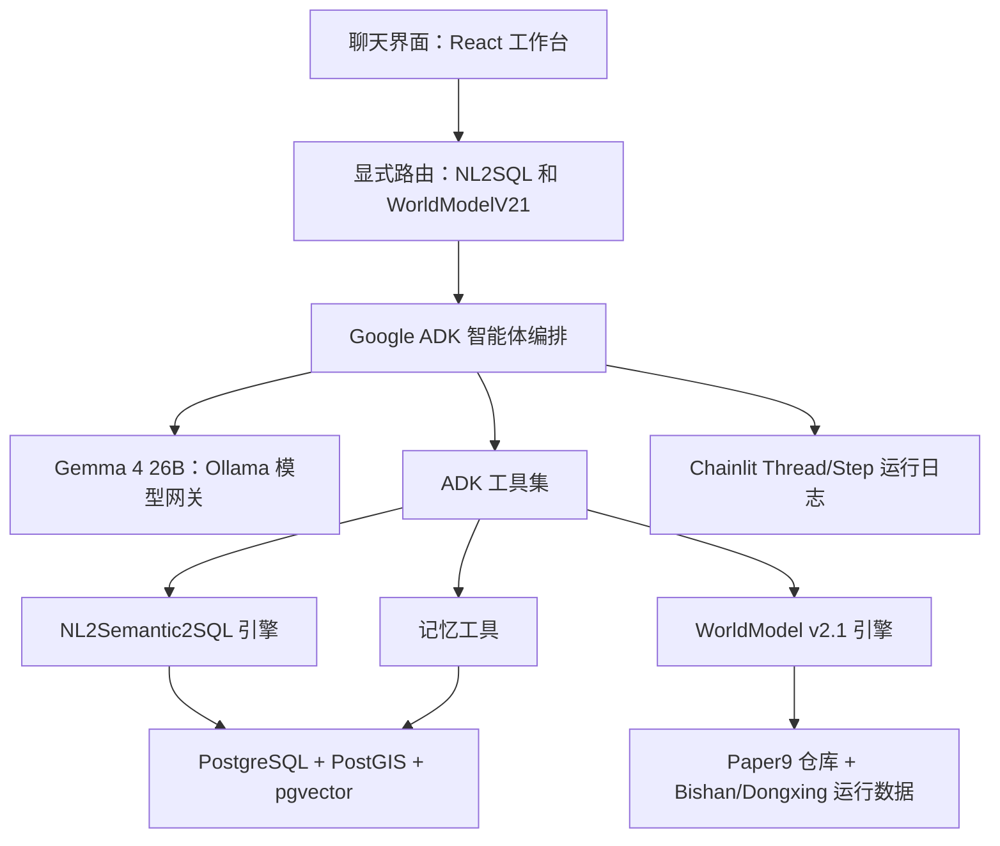

# 面向 Gemma 4 AI Agent 赛道的 GIS Data Agent

**中文** | [English](./README_en.md)

本项目是基于 Gemma 4 的 GIS Data Agent，面向 NL2Semantic2SQL 和 WorldModel v2.1 规划场景，重点展示原生工具调用和持久化记忆能力。

本仓库当前 README 面向 Gemma 4 开发者大赛赛道 A：AI Agent 组织，重点展示：

- Gemma 4 26B MoE 的规格选择依据。
- 基于 Google ADK 的多智能体架构。
- 原生函数调用和工具调用。
- 智能体记忆。
- 两个真实 GIS 场景：`nl2semantic2sql` 和 `worldmodelv2.1`。
- 纯 Docker Compose 可复现演示环境。

## 比赛要求对齐

| 比赛要求 | 本项目交付 |
|---|---|
| 核心代码包含 Gemma 4 调用逻辑 | `data_agent/model_gateway.py` 注册 `gemma4-26b-host228`，Docker 环境变量固定所有演示模型层级 |
| 原生函数调用和工具调用 | ADK `FunctionTool` / `LongRunningFunctionTool`，运行日志展示 `run_nl2semantic2sql` 和 `world_model_v21_status -> world_model_v21_pipeline` |
| 多步规划 | WorldModel v2.1 A/B/C/D 流程：Prepare、Sample、Train、Plan |
| 记忆机制 | `PostgresMemoryService`、`save_memory`、`recall_memories`、`auto_extract`、运行日志记忆统计 |
| 演示视频 5 分钟以内 | [docs/gemma4_ai_agent_demo_script.md](docs/gemma4_ai_agent_demo_script.md) |
| 技术报告 | [docs/gemma4_ai_agent_technical_report.md](docs/gemma4_ai_agent_technical_report.md) |
| 记忆和工具调用代码说明 | [docs/gemma4_ai_agent_code_walkthrough.md](docs/gemma4_ai_agent_code_walkthrough.md) |
| Docker 部署指南 | 本 README 的 [Docker Compose 快速启动](#docker-compose-快速启动) |
| 运行日志截图 | UI 路径：`工作台 -> 平台运营 -> 运行日志`；建议保存到 `docs/submission_screenshots/` |

## 为什么选择 Gemma 4 26B

模型选择基于同一套 CQ-125 PostGIS 基准测试，对 Gemma 4 家族 5 个规格在同一 host228 Ollama 环境下评测。

依据材料：

- [docs/assets/gemma4_host228_scale_sweep_summary.csv](docs/assets/gemma4_host228_scale_sweep_summary.csv)
- [docs/assets/gemma4_host228_scale_sweep.svg](docs/assets/gemma4_host228_scale_sweep.svg)


| 模型 | CQ-125 完全执行正确率 | 完整运行时间 | 选择判断 |
|---|---:|---:|---|
| Gemma4:e2b | 82/125 = 65.6% | 21.22 min | 准确率不足 |
| Gemma4:e4b | 80/125 = 64.0% | 13.49 min | 准确率不足 |
| Gemma4:12b | 107/125 = 85.6% | 16.45 min | 可作为备选 |
| Gemma4:26b | 113/125 = 90.4% | 12.50 min | 本项目采用 |
| Gemma4:31b | 114/125 = 91.2% | 20.04 min | EX 最高，但演示延迟更高 |

26B 只比 31B 低 1 道题，也就是 0.8 个百分点，但约快 37.6%。因此本项目选择 `Gemma4:26b` 作为比赛演示模型：接近 31B 的空间 SQL 执行准确率，同时更适合 5 分钟现场工具调用和多步规划演示。

该结果是固定主机部署探针，不声称统计显著优于 31B。

## 核心场景

### 1. NL2Semantic2SQL

用户输入中文空间问题，系统执行：

```text
@NL2SQL 统计距离道路网络中最长桥梁100米范围内的高德POI数量。
```

核心链路：

```text
@NL2SQL 显式路由
  -> DirectNL2SemanticSQLAgent
  -> function_call: run_nl2semantic2sql(user_question)
  -> 语义层 + schema grounding + few-shot 示例
  -> Gemma 4 26B SQL 生成
  -> 语义 SQL 改写
  -> SQL 后处理 / 只读护栏
  -> PostgreSQL + PostGIS 执行
  -> 结果摘要 + 可选地图图层
```

已验证空间查询包括：

| 查询 | 关键 PostGIS 处理 | 已验证结果 |
|---|---|---:|
| `bridge = T` 道路总长度 | `ST_Length(geometry::geography) / 1000` | `1376.5976 km` |
| 最长桥梁 100m 内 POI | CTE + `ST_DWithin(...::geography, 100)` | `35` |
| 与桥梁相交的建筑物轮廓 | `ST_Intersects` + `COUNT(DISTINCT b."Id")` | `1` |

为什么不是普通 NL2SQL：空间 SQL 需要处理 `geometry/geography` 单位、SRID、空间谓词、距离、面积、长度和空间连接去重。项目通过语义层 grounding 和 PostGIS 执行护栏降低 LLM 直接生成空间 SQL 的不稳定性。

### 2. WorldModel v2.1

用户输入短句即可运行县域 MPC 规划：

```text
@WorldModelV21 请先检查世界模型 v2.1 状态，然后使用 dongxing 数据集运行一次快速县域 MPC 规划。
```

Gemma 4 推荐工具轨迹：

```text
world_model_v21_status -> world_model_v21_pipeline
```

`world_model_v21_pipeline` 展示完整 A/B/C/D 阶段：

| 阶段 | 工具 | 演示行为 |
|---|---|---|
| A / Tool 1 Prepare | DLTB + DEM -> 准备数据 | `skipped_reused`，复用已准备数据 |
| B / Tool 2 Sample | 准备数据 -> 状态转移样本 | `skipped_reused`，复用已采样数据 |
| C / Tool 3 Train | 状态转移样本 -> ONNX 集成模型 | `skipped_reused`，复用已训练模型 |
| D / Tool 4 Plan | ONNX 集成模型 -> MPC 输出 | `ok`，真实运行 |

内置数据集预设：

| 数据集 | `prepared_dir` | `ensemble_dir` |
|---|---|---|
| `bishan` / `璧山` | `/app/bishan-runs/prepared` | `/app/bishan-runs/prepared/ensemble_seed0` |
| `dongxing` / `东兴` | `/app/dongxing-runs/prepared` | `/app/dongxing-runs/prepared/ensemble_seed0` |

已验证结果：

| 数据集 | 地块块数 | 图斑数 | `steps_run` | `total_reward` |
|---|---:|---:|---:|---:|
| Bishan | 2640 | 53004 | 100 | 66.43446147434678 |
| Dongxing | 3711 | 76377 | 100 | 112.63640181479221 |

地图按 `CHG_FLAG` 展示优化变化：

- 灰色：保持不变。
- 红色：耕地 -> 林地。
- 绿色：林地 -> 耕地。

## 架构


```mermaid
flowchart TB
  U["聊天界面：React 工作台"] --> R["显式路由：NL2SQL 和 WorldModelV21"]
  R --> A["Google ADK 智能体编排"]
  A --> M["Gemma 4 26B：Ollama 模型网关"]
  A --> T["ADK 工具集"]
  T --> N["NL2Semantic2SQL 引擎"]
  T --> W["WorldModel v2.1 引擎"]
  T --> MEM["记忆工具"]
  N --> PG["PostgreSQL + PostGIS + pgvector"]
  MEM --> PG
  W --> FS["Paper9 仓库 + Bishan/Dongxing 运行数据"]
  A --> LOG["Chainlit Thread/Step 运行日志"]
```

关键代码：

| 模块 | 文件 |
|---|---|
| Gemma 4 模型网关 | `data_agent/model_gateway.py`, `docker-compose.gemma4-demo.yml` |
| ADK 路由 | `data_agent/agent.py` |
| NL2Semantic2SQL 直接工具事件 | `data_agent/nl2semantic2sql_direct_agent.py` |
| NL2SQL 执行护栏 | `data_agent/nl2sql_executor.py`, `data_agent/nl2sql_grounding.py`, `data_agent/nl2sql_semantic_rewrite.py`, `data_agent/sql_postprocessor.py` |
| WorldModel v2.1 工具 | `data_agent/toolsets/world_model_v21_tools.py`, `data_agent/world_model_v21.py` |
| 记忆机制 | `data_agent/conversation_memory.py`, `data_agent/memory.py` |
| 运行日志 | `data_agent/app.py`, `data_agent/frontend_api.py`, `frontend/src/components/datapanel/AgentRunLogsTab.tsx` |

## Docker Compose 快速启动

### 前置条件

- Docker Desktop，或带 Compose 的 Docker Engine。
- 可访问已加载 `Gemma4:26b` 的 Ollama 主机。
- 本地 Paper9 / Bishan / Dongxing 路径与 `docker-compose.gemma4-demo.yml` 中的挂载一致；如果路径不同，启动前先调整挂载项。

当前演示 compose 文件需要以下本地挂载：

```yaml
- /Users/zhouning/arcgis-farmland-mpc:/app/paper9-demo:ro
- /Users/zhouning/farmland_mpc_runs/bishan:/app/bishan-runs:ro
- /Users/zhouning/arcgis-farmland-mpc/runs/dongxing:/app/dongxing-runs:ro
```

### 启动

```bash
docker compose -f docker-compose.gemma4-demo.yml up -d --build
```

打开：

```text
http://localhost:8000
```

如果启用了登录，本地演示账号为：

```text
admin / admin123
```

### 检查服务

```bash
docker compose -f docker-compose.gemma4-demo.yml ps
docker compose -f docker-compose.gemma4-demo.yml logs -f app
```

### 停止

```bash
docker compose -f docker-compose.gemma4-demo.yml down
```

只有在明确需要删除本地 Docker 卷时才使用 `-v`。

## 环境变量

演示 compose 文件固定了比赛模型和运行环境：

| 变量 | 演示值 | 用途 |
|---|---|---|
| `MODEL_CONFIG_FORCE_ENV` | `true` | 强制使用环境变量中的模型配置 |
| `ROUTER_MODEL` | `gemma4-26b-host228` | 意图路由模型 |
| `MODEL_FAST` | `gemma4-26b-host228` | 快速层级模型 |
| `MODEL_STANDARD` | `gemma4-26b-host228` | 标准层级模型 |
| `MODEL_PREMIUM` | `gemma4-26b-host228` | 高质量层级模型 |
| `NL2SQL_AGENT_MODEL` | `gemma4-26b-host228` | NL2SQL SQL 生成链路模型 |
| `NL2SQL_LLM_SCHEMA_MAPPER_MODEL` | `gemma4-26b-host228` | NL2SQL schema mapper 模型 |
| `EMBEDDING_MODEL` | `nomic-embed-text-v2-moe-host228` | few-shot 和语义检索 embedding |
| `OLLAMA_API_BASE` | `http://192.168.25.228:11434` | Ollama 服务地址 |
| `PAPER9_FARMLAND_MPC_REPO` | `/app/paper9-demo` | WorldModel v2.1 Paper9 仓库 |
| `PAPER9_FARMLAND_MPC_DEFAULT_PREPARED_DIR` | `/app/bishan-runs/prepared` | 默认 Bishan 准备数据 |
| `PAPER9_FARMLAND_MPC_DEFAULT_ENSEMBLE_DIR` | `/app/bishan-runs/prepared/ensemble_seed0` | 默认 Bishan ONNX 集成模型 |
| `PROJ_DATA` / `PROJ_LIB` | 容器内 pyproj 数据目录 | 修复投影运行时问题，例如 `EPSG:32648` |

PostGIS / Redis 也在 `docker-compose.gemma4-demo.yml` 中配置。

## 演示脚本

打开应用后依次运行以下提示词。

NL2Semantic2SQL：

```text
@NL2SQL 统计重庆2021年道路网络中所有桥梁道路（bridge = T）的总长度，单位为公里。
```

```text
@NL2SQL 统计距离道路网络中最长桥梁100米范围内的高德POI数量。
```

```text
@NL2SQL 统计出空间上与道路网络中任意桥梁（bridge = T）相交（Intersects）的建筑物轮廓数量。
```

WorldModel v2.1：

```text
@WorldModelV21 请先检查世界模型 v2.1 状态，然后使用 bishan 数据集运行一次快速县域 MPC 规划。
```

```text
@WorldModelV21 请先检查世界模型 v2.1 状态，然后使用 dongxing 数据集运行一次快速县域 MPC 规划。
```

记忆：

```text
请把本次演示保存为记忆：Gemma 4 完成了桥梁道路与建筑物相交的空间 NL2Semantic2SQL 查询，世界模型 v2.1 完成了 Bishan 和 Dongxing 县域 MPC 规划。关键词：Gemma4空间演示。
```

```text
检索关键词“Gemma4空间演示”的记忆。
```

完整录制指南：

- [docs/gemma4_ai_agent_demo_script.md](docs/gemma4_ai_agent_demo_script.md)

## 运行日志截图

比赛提交前，从以下页面截取运行日志：

```text
工作台 -> 平台运营 -> 运行日志
```

建议截图保存路径：

```text
docs/submission_screenshots/run_logs_nl2sql.png
docs/submission_screenshots/run_logs_worldmodel_v21.png
docs/submission_screenshots/run_logs_memory.png
```

每张截图建议展示：

- Thread / Step 时间线。
- 工具调用记录。
- 函数参数和响应摘要。
- 与记忆相关的统计。
- 生成地图图层的事件摘要。

该面板对应的 API 是：

```text
GET /api/agent/run-logs
```

## 提交文档

| 文档 | 用途 |
|---|---|
| [docs/gemma4_ai_agent_technical_report.md](docs/gemma4_ai_agent_technical_report.md) | 技术报告：模型选择、架构、场景和部署 |
| [docs/gemma4_ai_agent_code_walkthrough.md](docs/gemma4_ai_agent_code_walkthrough.md) | 面向 `nl2semantic2sql` 和 `worldmodelv2.1` 的记忆、工具调用代码说明 |
| [docs/gemma4_ai_agent_demo_script.md](docs/gemma4_ai_agent_demo_script.md) | 5 分钟演示脚本和本地复测证据 |
| [docs/assets/gemma4_host228_scale_sweep_summary.csv](docs/assets/gemma4_host228_scale_sweep_summary.csv) | Gemma 4 模型规格评测依据 |
| [docs/assets/gemma4_host228_scale_sweep.svg](docs/assets/gemma4_host228_scale_sweep.svg) | 模型规格评测图 |

## GitHub About

建议仓库描述（英文，适合 GitHub About）：

```text
Gemma 4 powered GIS Data Agent for NL2Semantic2SQL and WorldModel v2.1 planning with native tool calling and memory.
```

建议主题：

```text
agent-memory, ai-agent, docker-compose, function-calling, gemma4, geospatial, gis, google-adk, mpc, multi-agent, nl2sql, postgis, tool-calling, world-model
```

## 许可证

MIT
