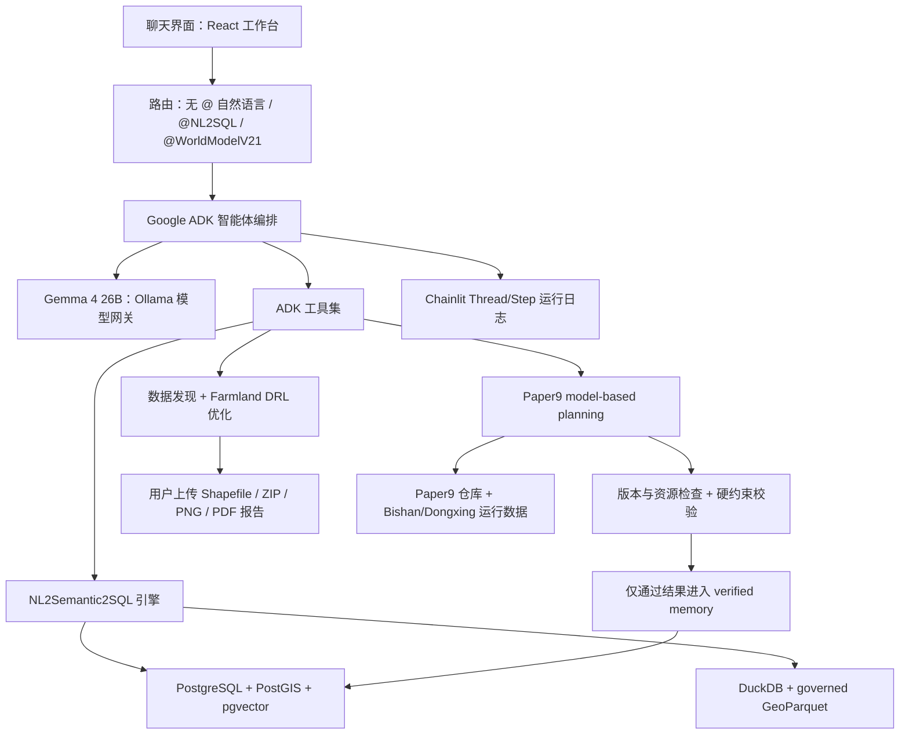

# 面向 Gemma 4 AI Agent 赛道的 GIS Data Agent

**中文** | [English](./README_en.md)

本项目是基于 Gemma 4 的 GIS Data Agent，面向自然语言 GIS 数据发现、耕地空间布局优化、NL2Semantic2SQL 和 Paper9 县域规划场景，重点展示 Google ADK 原生工具调用、受控多步规划、硬约束审计、有限恢复和已验证经验记忆。

### DLTB 两阶段演示入口

地类图斑（DLTB）演示已经明确拆成两条可独立验收的链路：

1. `scripts/run_dltb_semantic_demo.py`：从 FileGDB 探查、Raw 入湖、质量、数据模型标准化、本体引用、语义投影到受控智能问数；兼容旧命令 `scripts/run_dltb_vertical_demo.py`。
2. `scripts/run_dltb_paper9_demo.py`：从 DLTB + DEM 执行 Paper9 World Model v2.1 的 Tool 1 Prepare、Tool 2 Sample、Tool 3 Train、Tool 4 Plan 和硬约束审计，对应页面右侧“世界模型 v2.1”。

完整讲解、Windows 命令和重庆样例验证口径见 [`docs/reports/dltb_two_stage_demo_script_2026-08-07.md`](docs/reports/dltb_two_stage_demo_script_2026-08-07.md)。阶段 1 的报告通过阶段 2 的 `--upstream-report` 交接；重庆样例只证明技术链路可执行，不构成宁夏权威生产资格。

阶段 1 默认使用本地 Qwen 的 NL2Semantic2SQL 生成 PostgreSQL/PostGIS SQL；无数据库的离线开发机可显式选择 `--semantic-execution-engine lake` 验证 DuckDB 数据湖 SQL，不能把该诊断路径误写成 PostGIS 已连接。

本仓库当前 README 面向 Gemma 4 开发者大赛赛道 A：AI Agent 组织，重点展示：

- Gemma 4 26B MoE 的规格选择依据。
- 基于 Google ADK 的多智能体架构。
- 原生函数调用和工具调用。
- 智能体记忆。
- 三个真实 GIS 场景：无 `@` 数据发现与耕地优化、`nl2semantic2sql`、`worldmodelv2.1`。
- 纯 Docker Compose 可复现演示环境。

## 比赛要求对齐

| 比赛要求 | 本项目交付 |
|---|---|
| 核心代码包含 Gemma 4 调用逻辑 | `data_agent/model_gateway.py` 注册 Gemma 4 26B，Docker 环境变量固定所有演示模型层级 |
| 原生函数调用和工具调用 | ADK `FunctionTool` / `LongRunningFunctionTool`；Paper9 Agent 暴露 10 个细粒度工具，Gemma 4 根据工具响应选择下一步 |
| 受控多步规划 | `status -> inspect -> recall -> pipeline/plan -> audit -> commit/replan/HITL`；A/B/C/D 为底层算法阶段，不冒充模型动态规划 |
| 记忆机制 | 仅通过硬约束校验且空间产物完整的 Paper9 结果可进入 append-only verified episodic memory；未审计结果拒绝写入 |
| Agent 可靠性 | 3 个分支各 10 次真实 Gemma 4 + ADK 运行，30/30 行为契约通过；算法工具使用确定性替身，真实 Paper9 产物单独取证 |
| 工程质量 | 决赛关键测试 69 passed、接口兼容测试 52 passed；Ruff、Python 编译、前端生产构建和 Compose 解析通过，非阻断警告单独登记 |
| 演示视频 5 分钟以内 | [docs/gemma4_ai_agent_demo_script.md](docs/gemma4_ai_agent_demo_script.md) |
| 技术报告 | [docs/gemma4_ai_agent_technical_report.md](docs/gemma4_ai_agent_technical_report.md) |
| 记忆和工具调用代码说明 | [docs/gemma4_ai_agent_code_walkthrough.md](docs/gemma4_ai_agent_code_walkthrough.md) |
| Docker 部署指南 | 本 README 的 [Docker Compose 快速启动](#docker-compose-快速启动) |
| 运行日志截图 | UI 路径：`工作台 -> 平台运营 -> 运行日志`；建议保存到 `docs/submission_screenshots/` |

## 为什么选择 Gemma 4 26B

模型选择基于同一套 CQ-125 PostGIS 基准测试，对 Gemma 4 家族 5 个规格在同一 host228 Ollama 环境下评测。

依据材料：

- [docs/assets/gemma4_host228_scale_sweep_summary.csv](docs/assets/gemma4_host228_scale_sweep_summary.csv)
- [docs/assets/gemma4_host228_scale_sweep.svg](docs/assets/gemma4_host228_scale_sweep.svg)


| 模型 | CQ-125 完全执行正确率 | 完整运行时间 | 选择判断 |
|---|---:|---:|---|
| Gemma4:e2b | 82/125 = 65.6% | 21.22 min | 准确率不足 |
| Gemma4:e4b | 80/125 = 64.0% | 13.49 min | 准确率不足 |
| Gemma4:12b | 107/125 = 85.6% | 16.45 min | 可作为备选 |
| Gemma4:26b | 113/125 = 90.4% | 12.50 min | 本项目采用 |
| Gemma4:31b | 114/125 = 91.2% | 20.04 min | EX 最高，但演示延迟更高 |

26B 只比 31B 低 1 道题，也就是 0.8 个百分点，但约快 37.6%。因此本项目选择 `Gemma4:26b` 作为比赛演示模型：接近 31B 的空间 SQL 执行准确率，同时更适合 5 分钟现场工具调用和多步规划演示。

该结果是固定主机部署探针，不声称统计显著优于 31B。

## 研究背景与算法来源

本项目的三个演示场景不是孤立的 Agent UI 示例，而是把三个独立研究工程中的领域算法封装为 Gemma 4 可调用的工具、工作流和多智能体协作链路。Gemma 4 和 ADK 负责自然语言理解、工具选择、执行编排、结果解释和记忆沉淀；真正的业务难点来自空间优化、空间 SQL 语义 grounding 和县域级世界模型规划。

| 演示场景 | 研究工程 | 对应论文和投稿状态 | 在 GIS Data Agent 中的落地 |
|---|---|---|---|
| 耕地空间布局优化 | [zhouning/farmland-drl-optimization](https://github.com/zhouning/farmland-drl-optimization) | *Constrained Farmland Layout Optimization under Cultivated-Land Balance: A Two-Site Test of Dimension-Invariant Reinforcement Learning*，已投稿 *Land Use Policy* | 无 `@` 数据发现后自动进入 `Farmland Optimization Workflow`，调用 `drl_model` 和 `visualize_interactive_map`，输出优化后矢量、PNG、地图图层和 PDF 报告 |
| NL2Semantic2SQL | [zhouning/nl2geosql-reproduction](https://github.com/zhouning/nl2geosql-reproduction) | *Schema-Aware Grounding Effects in PostGIS Natural-Language-to-SQL: A Subset-Decomposed Evaluation Across Eleven LLMs*，已投稿 *Computers & Geosciences* | `@NL2SQL` 触发 `run_nl2semantic2sql`，将中文空间问题映射到语义层、schema grounding、PostGIS SQL 生成和只读执行护栏 |
| Paper9 / WorldModel v2.1 | [zhouning/arcgis-farmland-mpc](https://github.com/zhouning/arcgis-farmland-mpc) | *Reproducible model-based AI planning for county-scale farmland consolidation in fragmented mountain landscapes*，已投稿 Nature Portfolio 子刊 *Communications Earth & Environment* | `@WorldModelV21` 触发受控自主链路，将 Paper9 0.3.3 / paper9v2 2.2.3 包装为可审计的县域 MPC 工具链 |

三个场景对应的技术难点分别是：

- 耕地空间布局优化：在退坡还林、耕地占补平衡和地块连通性之间做约束优化，核心不是普通分类，而是带空间邻接结构和政策约束的地块级决策。
- NL2Semantic2SQL：在中文自然语言、语义层、PostGIS schema、空间谓词和 `geometry/geography` 单位语义之间建立 grounding，避免大模型把空间查询降级为普通 SQL。
- WorldModel v2.1：把县域地块状态转移学习成可用于 MPC 的世界模型，用已训练 ensemble 支撑快速规划，并通过 GIS 产物验证坡度、连通性和面积变化。

这意味着比赛演示的重点不是“把一个大模型接到几个函数上”，而是验证 Gemma 4 是否能稳定调用已经具备研究深度的 GIS 算法系统，并把真实数据、空间数据库、模型推理、规划输出、可视化和报告生成串成可解释的端到端工作流。

## 核心场景

### 1. 无 @ 数据发现与耕地空间布局优化

这个场景展示 GIS Data Agent 不是只能依赖 `@NL2SQL` / `@WorldModelV21` 显式路由。用户直接在对话框提问，系统会先发现用户上传的数据资产，再自动进入耕地空间布局优化专用工作流。

数据进入方式：

```text
上传 /Users/zhouning/Downloads/shp/斑竹村10000.zip
```

用户输入：

```text
我有哪些数据？
```

随后继续输入：

```text
基于斑竹村10000数据进行耕地空间布局优化分析
```

核心链路：

```text
自然语言输入
  -> GENERAL 数据发现：list_user_files / data catalog
  -> OPTIMIZATION 意图路由
  -> Farmland Optimization Workflow
  -> FarmlandDataPreparation
  -> FarmlandDRLOptimizer: drl_model(data_path)
  -> FarmlandOptimizationVisualizer: visualize_interactive_map(original, optimized)
  -> FarmlandOptimizationSummary
  -> 地图图层 + PNG + PDF 报告导出
```

本轮真实数据验证：

| 项目 | 结果 |
|---|---|
| 数据 | `斑竹村10000.shp`，EPSG:4523，10,653 个要素 |
| 路由 | `我有哪些数据` -> GENERAL；`基于斑竹村10000数据...` -> OPTIMIZATION |
| 工作流 | `Farmland Optimization Workflow (耕地空间布局优化)` |
| 核心工具 | `drl_model`, `visualize_interactive_map` |
| DRL 结果 | `Conversions=200`, `Pairs=0`, `Net Change=-130` |
| 可视化 | 生成优化 PNG、优化后 Shapefile、交互式对比地图 |
| 报告导出 | `Analysis_Report.pdf`，PDF 转换成功并嵌入优化 PNG |

录制口径：`Pairs=0` 时不要口播“成对置换已完成”；`Net Change=-130` 表示地类数量存在净变化，不应说成总量完全平衡。

### 2. NL2Semantic2SQL

用户输入中文空间问题，系统执行：

```text
@NL2SQL 统计距离道路网络中最长桥梁100米范围内的高德POI数量。
```

核心链路：

```text
@NL2SQL 显式路由
  -> DirectNL2SemanticSQLAgent
  -> function_call: run_nl2semantic2sql(user_question)
  -> 语义层 + schema grounding + few-shot 示例
  -> Gemma 4 26B SQL 生成
  -> 语义 SQL 改写
  -> SQL 后处理 / 只读护栏
  -> PostgreSQL + PostGIS 执行
  -> 结果摘要 + 可选地图图层
```

问数页面默认使用 PostGIS，也可以在输入框上方切换到“数据湖”。两种模式共用数据模型、本体和
语义层，只替换物理执行器：

```text
NL2Semantic2SQL -> PostgreSQL/PostGIS                 （默认，复杂空间查询/在线服务）
NL2Semantic2SQL -> DuckDB -> 治理 GeoParquet         （无需再次装载，批量属性/聚合）
```

湖上 SQL 只能查询语义目录发布的 GeoParquet 视图，禁止任意 `read_parquet`、写操作和扩展安装，
结果会返回执行引擎、SQL 方言和 projection ID。重庆 DLTB 的三道固定问题已完成 PostGIS、数据湖 SQL 与 GeoPandas 三引擎对账，详见
[`docs/reports/dltb_dual_nl2sql_engine_validation_2026-08-08.md`](docs/reports/dltb_dual_nl2sql_engine_validation_2026-08-08.md)。

已验证空间查询包括：

| 查询 | 关键 PostGIS 处理 | 已验证结果 |
|---|---|---:|
| `bridge = T` 道路总长度 | `ST_Length(geometry::geography) / 1000` | `1376.5976 km` |
| 最长桥梁 100m 内 POI | CTE + `ST_DWithin(...::geography, 100)` | `35` |
| 与桥梁相交的建筑物轮廓 | `ST_Intersects` + `COUNT(DISTINCT b."Id")` | `1` |

为什么不是普通 NL2SQL：空间 SQL 需要处理 `geometry/geography` 单位、SRID、空间谓词、距离、面积、长度和空间连接去重。项目通过语义层 grounding 和 PostGIS 执行护栏降低 LLM 直接生成空间 SQL 的不稳定性。

### 3. Paper9 受控自主规划

用户输入短句即可运行县域 MPC 规划：

```text
@WorldModelV21 请使用 bishan 数据集运行一次快速县域 MPC 规划，完成硬约束审计，并仅在通过后保存已验证经验。
```

首次审计通过时，Gemma 4 的完整工具轨迹是：

```text
world_model_v21_status
-> paper9_inspect_resources
-> paper9_recall_verified_episodes
-> world_model_v21_pipeline
-> paper9_audit_run
-> paper9_commit_verified_episode
```

首次审计失败时，只允许一次重规划：

```text
... -> paper9_audit_run(attempt=0, retryable=true)
-> world_model_v21_plan
-> paper9_audit_run(attempt=1)
-> commit_verified_episode 或 stop_and_request_human_review
```

`world_model_v21_pipeline` 展示完整 A/B/C/D 阶段：

| 阶段 | 工具 | 演示行为 |
|---|---|---|
| A / Tool 1 Prepare | DLTB + DEM -> 准备数据 | `skipped_reused`，复用已准备数据 |
| B / Tool 2 Sample | 准备数据 -> 状态转移样本 | `skipped_reused`，复用已采样数据 |
| C / Tool 3 Train | 状态转移样本 -> ONNX 集成模型 | `skipped_reused`，复用已训练模型 |
| D / Tool 4 Plan | ONNX 集成模型 -> MPC 输出 | `ok`，真实运行 |

内置数据集预设：

| 数据集 | `prepared_dir` | `ensemble_dir` |
|---|---|---|
| `bishan` / `璧山` | `/app/bishan-runs/prepared` | `/app/bishan-runs/prepared/ensemble_seed0` |
| `dongxing` / `东兴` | `/app/dongxing-runs/prepared` | `/app/dongxing-runs/prepared/ensemble_seed0` |

当前版本绑定与真实 Tool 4 验证：

| 项目 | 结果 |
|---|---:|
| Python 包 / 算法 | `paper9-mnr-offline-package 0.3.3` / `paper9v2 2.2.3` |
| Paper9 commit | `848514383948474e4b6387f171aea8a9272821db` |
| 输入空间记录 / 环境图斑 / blocks | 101,657 / 53,004 / 2,640 |
| MPC 步数 / 置换 | 100 / 424 对 |
| 耕地面积变化 | `+0.211604 ha` |
| 平均坡度变化 | `-0.815402%` |
| 连片度变化 | `+0.028379` |
| 百亩方面积变化 | `+29.980491 ha` |
| 硬约束校验 | 通过 |

本次本机验证使用 0.3.3 / 2.2.3 代码执行 Tool 4，但复用了 2026-06-27 旧流程生成的 Prepare / ONNX 产物，且输入被识别为旧三位测试编码。它不能表述为 v2.2.3 真实权威四库的完整 A/B/C/D 重训。

Gemma 4 + ADK 编排可靠性基线：

| 场景 | 通过率 | 固定轨迹工具数 | 平均延迟 | P95 延迟 |
|---|---:|---:|---:|---:|
| 首次审计通过 | 10/10 | 6 | 7.97 s | 9.53 s |
| 版本不兼容后停止 | 10/10 | 2 | 3.24 s | 4.88 s |
| 一次重规划后通过 | 10/10 | 8 | 13.57 s | 15.31 s |

30/30 的 Wilson 95% 区间为 88.65%–100%；每个 10/10 场景的区间为 72.25%–100%。该基线使用真实 Gemma 4 26B 与 Google ADK，Paper9 工具响应为确定性替身，专门测量工具选择和分支控制，不代表 30 次算法重跑。

地图按 `CHG_FLAG` 展示优化变化：

- 灰色：保持不变。
- 红色：耕地 -> 林地。
- 绿色：林地 -> 耕地。

## 架构


```mermaid
flowchart TB
  U["聊天界面：React 工作台"] --> R["路由：无 @ 自然语言 / @NL2SQL / @WorldModelV21"]
  R --> A["Google ADK 智能体编排"]
  A --> M["Gemma 4 26B：Ollama 模型网关"]
  A --> T["ADK 工具集"]
  T --> F["数据发现 + Farmland DRL 优化"]
  T --> N["NL2Semantic2SQL 引擎"]
  T --> W["Paper9 model-based planning"]
  W --> G["版本与资源检查 + 硬约束校验"]
  G --> MEM["仅通过结果进入 verified memory"]
  F --> FS1["用户上传 Shapefile / ZIP / PNG / PDF 报告"]
  N --> PG["PostgreSQL + PostGIS + pgvector"]
  N --> LAKE["DuckDB + governed GeoParquet"]
  MEM --> PG
  W --> FS["Paper9 仓库 + Bishan/Dongxing 运行数据"]
  A --> LOG["Chainlit Thread/Step 运行日志"]
```

关键代码：

| 模块 | 文件 |
|---|---|
| Gemma 4 模型网关 | `data_agent/model_gateway.py`, `docker-compose.gemma4-demo.yml` |
| ADK 路由与单一行为契约 | `data_agent/agent.py`, `data_agent/paper9_agent_prompt.py` |
| 无 @ 数据发现与耕地优化 | `data_agent/toolsets/file_tools.py`, `data_agent/data_catalog.py`, `data_agent/gis_processors.py`, `data_agent/drl_engine.py`, `data_agent/pipeline_helpers.py` |
| NL2Semantic2SQL 直接工具事件 | `data_agent/nl2semantic2sql_direct_agent.py` |
| NL2SQL 执行护栏 | `data_agent/nl2sql_executor.py`, `data_agent/nl2sql_grounding.py`, `data_agent/nl2sql_semantic_rewrite.py`, `data_agent/sql_postprocessor.py` |
| 数据湖 SQL 适配器 | `data_agent/lake_sql_executor.py`, `scripts/compare_nl2sql_engines.py` |
| Paper9 工具与适配器 | `data_agent/toolsets/world_model_v21_tools.py`, `data_agent/world_model_v21.py` |
| Paper9 审计与 verified memory | `data_agent/paper9_agent_governance.py` |
| Agent 行为评测 | `data_agent/paper9_agent_evaluation.py`, `scripts/run_paper9_adk_reliability_eval.py` |
| 通用记忆机制 | `data_agent/conversation_memory.py`, `data_agent/memory.py` |
| 运行日志 | `data_agent/app.py`, `data_agent/frontend_api.py`, `frontend/src/components/datapanel/AgentRunLogsTab.tsx` |
| Word / PDF 报告导出 | `data_agent/report_generator.py`, `data_agent/app.py` |

## Docker Compose 快速启动

### 前置条件

- Docker Desktop，或带 Compose 的 Docker Engine。
- 可访问已加载 `Gemma4:26b` 的 Ollama 主机。
- Paper9 0.3.3 源码目录和已准备的 Bishan / Dongxing 资源；通过 `.env.finals` 配置主机路径。

从模板生成本机配置，并填写绝对路径：

```bash
cp .env.finals.example .env.finals
```

### 启动

```bash
docker compose --env-file .env.finals -f docker-compose.gemma4-demo.yml up -d --build
```

打开：

```text
http://localhost:8000
```

如果启用了登录，本地演示账号为：

```text
admin / admin123
```

### 检查服务

```bash
docker compose -f docker-compose.gemma4-demo.yml ps
docker compose -f docker-compose.gemma4-demo.yml logs -f app
```

### 停止

```bash
docker compose -f docker-compose.gemma4-demo.yml down
```

只有在明确需要删除本地 Docker 卷时才使用 `-v`。

## 环境变量

演示 compose 文件固定了比赛模型和运行环境：

| 变量 | 演示值 | 用途 |
|---|---|---|
| `MODEL_CONFIG_FORCE_ENV` | `true` | 强制使用环境变量中的模型配置 |
| `ROUTER_MODEL` | `gemma4-26b-ollama` | 意图路由模型 |
| `MODEL_FAST` | `gemma4-26b-ollama` | 快速层级模型 |
| `MODEL_STANDARD` | `gemma4-26b-ollama` | 标准层级模型 |
| `MODEL_PREMIUM` | `gemma4-26b-ollama` | 高质量层级模型 |
| `NL2SQL_AGENT_MODEL` | `gemma4-26b-ollama` | NL2SQL SQL 生成链路模型 |
| `NL2SQL_LLM_SCHEMA_MAPPER_MODEL` | `gemma4-26b-ollama` | NL2SQL schema mapper 模型 |
| `EMBEDDING_MODEL` | `nomic-embed-text-v2-moe` | few-shot 和语义检索 embedding；使用非固定 IP 的 Ollama embedding 别名 |
| `OLLAMA_API_BASE` | `${OLLAMA_API_BASE:-http://host.docker.internal:11434}` | 宿主机本机 Ollama 服务地址；比赛现场可通过环境变量覆盖 |
| `PAPER9_HOST_REPO` | `/absolute/path/to/paper9-mnr-offline-package` | 主机端 Paper9 0.3.3 源码目录，容器内只读挂载到 `/app/paper9-demo` |
| `PAPER9_BISHAN_RUNS_HOST` | `/absolute/path/to/bishan-runs` | 主机端 Bishan Prepare / ONNX 资源 |
| `PAPER9_DONGXING_RUNS_HOST` | `/absolute/path/to/dongxing-runs` | 主机端 Dongxing 资源；主 Demo 默认使用 Bishan |
| `PAPER9_FARMLAND_MPC_REPO` | `/app/paper9-demo` | WorldModel v2.1 Paper9 仓库 |
| `PAPER9_FARMLAND_MPC_DEFAULT_PREPARED_DIR` | `/app/bishan-runs/prepared` | 默认 Bishan 准备数据 |
| `PAPER9_FARMLAND_MPC_DEFAULT_ENSEMBLE_DIR` | `/app/bishan-runs/prepared/ensemble_seed0` | 默认 Bishan ONNX 集成模型 |
| `PROJ_DATA` / `PROJ_LIB` | 容器内 pyproj 数据目录 | 修复投影运行时问题，例如 `EPSG:32648` |

PostGIS / Redis 也在 `docker-compose.gemma4-demo.yml` 中配置。

比赛演示默认假设 Ollama 运行在宿主机本机而不是 Docker 容器内，GIS Data Agent app 容器通过 `host.docker.internal:11434` 访问宿主机 Ollama。若现场必须改用另一台模型机器，只需要在启动前设置 `OLLAMA_API_BASE=http://<现场模型机IP>:11434`；不要使用 `gemma4-26b-host228` 或 `nomic-embed-text-v2-moe-host228` 这类固定公司局域网 IP 的历史 benchmark 别名。

## 演示脚本

打开应用后依次运行以下提示词。

无 `@` 数据发现与耕地优化：

```text
上传 /Users/zhouning/Downloads/shp/斑竹村10000.zip
```

```text
我有哪些数据？
```

```text
基于斑竹村10000数据进行耕地空间布局优化分析
```

完成后可点击“导出 PDF 报告”，验证生成的是 PDF，并包含优化 PNG。

NL2Semantic2SQL：

```text
@NL2SQL 统计重庆2021年道路网络中所有桥梁道路（bridge = T）的总长度，单位为公里。
```

```text
@NL2SQL 统计距离道路网络中最长桥梁100米范围内的高德POI数量。
```

```text
@NL2SQL 统计出空间上与道路网络中任意桥梁（bridge = T）相交（Intersects）的建筑物轮廓数量。
```

WorldModel v2.1：

```text
@WorldModelV21 请使用 bishan 数据集运行一次快速县域 MPC 规划，完成硬约束审计，并仅在通过后保存已验证经验。
```

演示结束后直接展示 `paper9_commit_verified_episode` 和下一任务中的 `paper9_recall_verified_episodes`，不要用手工保存的聊天摘要代替 Agent 的 verified episodic memory。

规划完成后点击“导出 PDF 报告”，系统会从本次运行的优化空间图层、MPC 汇总、函数调用轨迹、硬约束审计和经验提交记录生成专用报告。报告包含真实变化地图、关键指标看板、Gemma 4 + Google ADK 六步调用图、逐函数用时、审计表和交付物摘要；数值不从聊天文本推断，也不复用其他运行的静态图片。

完整录制指南：

- [docs/gemma4_ai_agent_demo_script.md](docs/gemma4_ai_agent_demo_script.md)

## 运行日志截图

比赛提交前，从以下页面截取运行日志：

```text
工作台 -> 平台运营 -> 运行日志
```

建议截图保存路径：

```text
docs/submission_screenshots/run_logs_nl2sql.png
docs/submission_screenshots/run_logs_worldmodel_v21.png
docs/submission_screenshots/run_logs_farmland_optimization.png
docs/submission_screenshots/run_logs_memory.png
```

每张截图建议展示：

- Thread / Step 时间线。
- 工具调用记录。
- 函数参数和响应摘要。
- 与记忆相关的统计。
- 生成地图图层的事件摘要。
- 时间应显示东八区 `+08:00`，不要出现次日漂移。
- 展开内容不足时点击“完整详情”查看全文。

该面板对应的 API 是：

```text
GET /api/agent/run-logs
```

## 提交文档

| 文档 | 用途 |
|---|---|
| [docs/gemma4_ai_agent_technical_report.md](docs/gemma4_ai_agent_technical_report.md) | 技术报告：模型选择、架构、场景和部署 |
| [docs/gemma4_ai_agent_code_walkthrough.md](docs/gemma4_ai_agent_code_walkthrough.md) | 面向无 `@` 耕地优化、`nl2semantic2sql` 和 `worldmodelv2.1` 的记忆、工具调用代码说明 |
| [docs/gemma4_ai_agent_demo_script.md](docs/gemma4_ai_agent_demo_script.md) | 5 分钟演示脚本和本地复测证据 |
| [docs/finals/README.md](docs/finals/README.md) | 决赛资料入口与证据状态 |
| [docs/finals/scoring_evidence_matrix.md](docs/finals/scoring_evidence_matrix.md) | 五项评分维度的证据、口径与缺口 |
| [docs/finals/quality_gate_report.md](docs/finals/quality_gate_report.md) | 精确测试集合、构建结果、运行状态与已知警告 |
| [docs/finals/demo_runbook.md](docs/finals/demo_runbook.md) | 5 分钟现场流程、视频备份与故障预案 |
| [docs/finals/qa.md](docs/finals/qa.md) | 3 分钟 Q&A 答案口径 |
| [docs/assets/gemma4_host228_scale_sweep_summary.csv](docs/assets/gemma4_host228_scale_sweep_summary.csv) | Gemma 4 模型规格评测依据 |
| [docs/assets/gemma4_host228_scale_sweep.svg](docs/assets/gemma4_host228_scale_sweep.svg) | 模型规格评测图 |

## GitHub About

建议仓库描述（英文，适合 GitHub About）：

```text
Gemma 4 powered GIS Data Agent for geospatial NL2Semantic2SQL, farmland optimization, and WorldModel v2.1 planning with native tool calling and memory.
```

建议主题：

```text
agent-memory, ai-agent, docker-compose, farmland-optimization, function-calling, gemma4, geospatial, gis, google-adk, mpc, multi-agent, nl2sql, postgis, tool-calling, world-model
```

## 许可证

MIT
