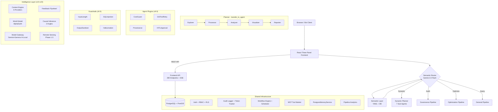

**English** | [中文](./README.md)

# GIS Data Agent (ADK Edition) v24.0

An AI-powered geospatial analysis platform that turns natural language into spatial intelligence. Built on **Google Agent Developer Kit (ADK) v1.27.2** with multi-language semantic intent routing (Chinese/English/Japanese), three specialized pipelines, a React three-panel frontend (Palantir-inspired dark theme, 3 groups, 29 tabs), and enterprise-grade security.

The system implements **all 21 of 21 (100%)** agentic design patterns, including three ADK Agent types (SequentialAgent / LoopAgent / ParallelAgent), 5 Agent Plugins, 4 Guardrails, SSE streaming, bidirectional A2A interop (Agent Card + Task lifecycle + Agent Registry), NSGA-II multi-objective Pareto optimization (5 scenarios), dynamic agent composition, Circuit Breaker fault tolerance, conditional analysis chains, and self-improvement. Backend serves **297 REST API endpoints**.

**v24.0**: **@SubAgent Mention Routing + NL2SQL Enhancement + PostGIS Direct Visualization** — Chat @mention routing (`mention_registry.py` + `mention_parser.py` + frontend autocomplete dropdown); NL2SQL multi-table recall fix (column-reverse-lookup + fallback supplement mode + synonym expansion), `execute_safe_sql` default limit raised from 1000 to 100000; PostGIS visualization 3-tier access fallback (ownership → semantic_sources → pg_class) + adaptive sampling for large tables (>100K rows auto-sample 10K); XMI domain standard system (parser + compiler + toolset + 6 REST APIs); 2026 Q2 technology four-lens roadmap refresh.

**v23.0**: **Gemma 4 Multi-Model Management + Platform Enhancements** — Gemma 4 31B registration (Gemini API + vLLM dual path), DB-persistent admin model config (ModelConfigManager), interactive frontend model switching UI, configurable Intent Router, LiteLLM extra_headers/extra_body support; intent disambiguation v2 (subtask decomposition + wave execution), DRL constraint modeling (hard/soft constraints), cross-layer association highlighting, offline Service Worker, embodied execution interface, annotation WebSocket real-time broadcast. 84 new tests.

**v21.0**: **Cross-System Lineage Tracking** — Dedicated `agent_asset_lineage` edge table supporting internal↔external any combination, external asset registration (Tableau/Airflow/PowerBI), BFS cross-system lineage graph traversal, 5 new REST endpoints. 13 new tests.

**v20.0**: **Distributed Task Queue + Redis Cache + Experience Improvements** — Unified Redis infrastructure (async/sync dual clients + SETNX distributed lock), TaskQueue Redis Sorted Set backend, dual-layer cache (Redis + memory), declarative multi-LLM YAML config, Agentic/Workflow dual execution mode, DuckDB Lite spatial adapter. 41 new tests.

## Official Technical Documentation

Industrial-grade **DITA XML** documentation with two document sets:

- **[Technical Architecture Guide (23 chapters)](docs/dita/preview-technical-guide.html)** — System architecture, semantic routing, multi-pipeline orchestration, 40 Toolset framework, fusion engine v2.0, DRL optimization, knowledge graph, causal inference, world model, remote sensing, surveying QC, model gateway, context engineering, autonomy levels, auth RBAC, database architecture, 280 REST APIs, frontend, map rendering, observability, evaluation CI/CD, architecture assessment
- **[User Guide (12 chapters)](docs/dita/preview.html)** — System overview, local deployment, GIS engine config, multi-modal fusion, GraphRAG, agent plugins & guardrails, advanced spatial analysis, MCP Hub & custom skills, causal inference, surveying QC, API reference, troubleshooting

> DITA XML sources in `docs/dita/` (2 ditamaps + 33 topics).

## Key Metrics

| Metric | Value |
|--------|-------|
| Test Coverage | 4700+ tests, 186 test files |
| Toolsets | 42 BaseToolset (incl. GovernanceToolset 18 tools + DataCleaningToolset 11 tools + PrecisionToolset 5 tools + NL2SQLToolset), 5 SkillBundle, 270+ tools |
| ADK Skills | 26 scenario skills (incl. surveying-qc, skill-creator, world-model, causal) + DB-driven custom Skills + User Tools |
| REST API | 297 endpoints (frontend_api 3438 lines + 24 route modules 4992 lines + app + stream + bots + WebSocket) |
| DB Migrations | 65 SQL migrations |
| DataPanel | 29 tabs in 3 groups (Data Resources / Intelligent Analysis / Platform Operations) |
| Connectors | 10 built-in (WFS, STAC, OGC API, Custom API, WMS, ArcGIS REST, Database, OBS, Reference Data, SaveMyself) |
| Data Agent Level | **SIGMOD 2026 L3+** (Full Conditional Autonomy + Context Engineering + Cross-System Lineage) |
| Context Engine | 6 Providers (semantic layer / knowledge base / knowledge graph / reference queries / success stories / metric definitions) + hybrid ranking + token budget |
| Feedback Flywheel | Frontend thumbs up/down → auto-curate reference queries + FailureAnalyzer batch optimization |
| Semantic Model | MetricFlow GIS-extended YAML + PostGIS auto-generation + MetricDefinitionProvider |
| NL2Workflow | Natural language → workflow DAG (Kahn topological sort + cycle detection + 23 Skill metadata matching) |
| Evaluators | 15 built-in (Quality 5 + Safety 3 + Performance 3 + Accuracy 4), pluggable registry |
| Prompt Optimization | 4-source bad case collection (eval_history + pipeline + audit_log + agent_feedback) + LLM failure analysis + prompt improvement + HITL confirmation |
| Multi-LLM Config | conf/models.yaml declarative + DB-persistent admin config + frontend interactive switching (Gemini/Gemma 4/DeepSeek/Qwen/local) |
| Dual Execution Mode | Agentic (LLM autonomous) / Workflow (deterministic template) mode detection and routing |
| DuckDB Lite | Lightweight spatial DB adapter (no PostGIS dependency, offline/demo deployment) |
| UI Theme | Palantir-inspired Deep Intelligence dark theme + Lucide SVG icons |
| BCG Platform | 6 modules: Prompt Registry + Model Gateway + Context Manager + Eval Scenario + Token Tracking + Eval History |
| DB Optimization | Pool 20+30 + asyncpg async + read-write split ready + materialized views + Prometheus monitoring |
| Vector Tiles | 3-tier adaptive (GeoJSON/FlatGeobuf/MVT) + Martin + asset coding DA-{TYPE}-{SRC}-{YEAR}-{SEQ} |
| Causal Inference | Three-angle system: A (GeoFM statistical 6 tools) + B (LLM reasoning 4 tools) + C (Causal world model 4 tools), 82 tests |
| World Model | AlphaEarth 64-dim + LatentDynamicsNet 459K params + 5 scenarios + timeline animation |
| DRL + World Model | Dreamer-style integration: embedding look-ahead + scenario encoding + auxiliary reward |
| Fusion v2.0 | Temporal alignment (3 interpolation + change detection) + Semantic enhancement (ontology 15 groups + LLM + KG) + Conflict resolution (6 strategies) + Explainability |
| Remote Sensing | Phase 1-3: 15+ spectral indices + change detection (3 methods) + Mann-Kendall + spatial constraint fact-check + multi-Agent debate |
| MCP Server | v2.0 — 36+ tools exposed (GIS primitives + high-level metadata + pipeline execution) |
| Design Pattern Coverage | **21/21 (100%)** |

## Core Capabilities

### BCG Enterprise Platform Capabilities (v15.8)

Six platform capabilities based on BCG's "Building Effective Enterprise Agents" framework for multi-scenario deployment:

**1. Prompt Registry** - Environment-isolated version control (dev/staging/prod), DB storage + YAML fallback, deploy/rollback operations

**2. Model Gateway** - Task-aware routing (3 models: gemini-2.0-flash/2.5-flash/2.5-pro), auto-selection based on task_type/context_tokens/quality/budget, cost tracking with scenario/project attribution

**3. Context Manager** - Pluggable providers (semantic layer, knowledge base), token budget enforcement, relevance-based prioritization

**4. Eval Scenario Framework** - Scenario-specific metrics (e.g., surveying QC: defect_precision/recall/F1/fix_success_rate), golden dataset management, evaluation history tracking

**5. Enhanced Token Tracking** - Scenario and project attribution: `record_usage(scenario, project_id)`, multi-dimensional cost analysis

**6. Enhanced Eval History** - Scenario, dataset, metrics columns: `record_eval_result(scenario, dataset_id, metrics)`

**API Endpoints**: 8 new endpoints (/api/prompts/*, /api/gateway/*, /api/context/*, /api/eval/*)

### Multi-Source Data Fusion (v5.5–v17.0)
- **Five-stage pipeline**: Profile → Assess → Align → Fuse → Validate
- **10 fusion strategies**: spatial join, attribute join, zonal statistics, point sampling, band stack, overlay, temporal fusion, point cloud height assignment, raster vectorize, nearest join
- **5 data modalities**: vector, raster, tabular, point cloud (LAS/LAZ), real-time stream
- **v17.0 Fusion v2.0 Enhancement**:
  - **Temporal Alignment**: Multi-timezone standardization, 3 interpolation methods (linear/nearest/spline), trajectory fusion, multi-period change detection
  - **Semantic Enhancement**: GIS domain ontology (15 equivalence groups, 8 derivation rules, 5 inference rules), LLM field understanding (Gemini 2.5 Flash), knowledge graph integration
  - **Conflict Resolution**: 6 strategies (source_priority, latest_wins, voting, llm_arbitration, spatial_proximity, user_defined) + per-feature confidence scoring + source annotation
  - **Explainability**: Per-feature metadata (_fusion_confidence, _fusion_sources, _fusion_method), quality heatmap GeoJSON, fusion lineage tracing, natural language decision explanation
- **Intelligent semantic matching**:
  - Five-tier progressive matching: exact → equivalence groups → embedding similarity → unit-aware → fuzzy
  - **v7.0 Vector embedding matching**: Gemini text-embedding-004 cosine similarity (opt-in)
  - Catalog-driven equivalence groups + tokenized similarity + type compatibility + auto unit conversion
- **LLM-enhanced strategy routing (v7.0)**: Gemini 2.0 Flash intent-aware strategy recommendation
- **Distributed/out-of-core computing (v7.0)**: Auto-chunked processing for large datasets (>500K rows / >500MB)
- **Geographic knowledge graph (v7.0)**: networkx entity-relationship modeling, spatial adjacency/containment detection, N-hop neighbor queries
- **Raster auto-processing**: CRS reprojection, resolution resampling, windowed sampling for large rasters
- **Enhanced quality validation**: 10 checks (null rate, geometry validity, topology, KS distribution shift, etc.)

### Data Governance
- Topological audit (overlaps, self-intersections, gaps)
- Schema compliance checking against national standards (GB/T 21010)
- Multi-modal verification: PDF reports vs SHP/DB metrics
- Automated governance reports (Word/PDF)
- Multi-source data fusion (v6.0 integration)

### Land Use Optimization
- Deep Reinforcement Learning engine (MaskablePPO) for layout optimization
- **5 DRL scenarios**: Farmland optimization, urban green space, facility siting, transport network, comprehensive planning
- **NSGA-II multi-objective Pareto optimization**: Fast non-dominated sorting + crowding distance
- Paired farmland/forest swaps with strict area balance
- Categorized map rendering: per-feature coloring by land type / change type with Chinese legend

### Business Spatial Intelligence
- Semantic query: natural language → auto-mapped SQL with spatial operators
- Site selection with chain reasoning (Query → Buffer → Overlay → Filter)
- DBSCAN clustering, KDE heatmaps, choropleth maps
- POI search, driving distance, geocoding (batch + reverse)
- Interactive multi-layer map composition with NL layer control

### Intelligent Agent Collaboration (v9.0)
- **Agent Plugins**: CostGuard (token budget), GISToolRetry (smart retry), Provenance (data lineage), HITLApproval (human-in-the-loop)
- **Parallel Pipeline**: ParallelAgent data ingestion, multi-source parallel processing
- **Cross-Session Memory**: PostgresMemoryService persistent conversation memory across sessions
- **Smart Task Decomposition**: TaskGraph DAG decomposition + wave-parallel execution
- **Pipeline Analytics**: 5-dimension analysis — latency, success rate, token efficiency, throughput, agent breakdown
- **Agent Lifecycle Hooks**: Prometheus metrics + ProgressTracker per-pipeline progress tracking

### Production Hardening (v9.5)
- **Guardrails (4)**: InputLength (>50k reject) + SQLInjection (pattern detection) + OutputSanitizer (sensitive data redaction) + Hallucination (warning injection), recursively attached to all sub-agents
- **SSE Streaming**: `run_pipeline_streaming()` async generator + `/api/pipeline/stream` REST endpoint
- **LongRunningFunctionTool**: DRL optimization async execution, preventing duplicate agent calls
- **Centralized Test Fixtures**: conftest.py shared fixtures with event loop safety isolation

### Intelligent Platform Extension (v10.0)
- **GraphRAG Knowledge Enhancement**: Entity extraction (Gemini+regex) → co-occurrence graph construction → graph-augmented retrieval (vector + graph neighbor re-ranking), 9 KB tools
- **Per-User MCP Isolation**: Users can create private MCP servers, owner_username + is_shared visibility control
- **Custom Skill Bundles**: DB-driven user-defined toolset + ADK Skills compositions with intent trigger matching
- **Spatial Analysis Tier 2**: IDW interpolation, Kriging, Geographically Weighted Regression (GWR), multi-temporal change detection, DEM viewshed analysis
- **Workflow Template Marketplace**: 5 built-in templates + publish/clone/rate, one-click workflow reuse

### Virtual Data Layer (v13.0)
- **4 data source connectors**: WFS / STAC / OGC API / Custom API, zero-copy on-demand queries
- **Fernet-encrypted credential storage**: Secure connector key persistence
- **Auto CRS alignment**: GeoDataFrame auto `to_crs(target_crs)` on query return
- **Semantic schema mapping**: text-embedding-004 vector embeddings + 35 canonical geospatial vocabulary for auto field matching
- **Connector health monitoring**: Endpoint connectivity checks + DataPanel health indicators

### MCP Server v2.0 (v13.1)
- **36+ tools exposed**: GIS primitives + 6 high-level metadata tools (search_catalog / get_data_lineage / list_skills / list_toolsets / list_virtual_sources / run_analysis_pipeline)
- External agents (Claude Desktop / Cursor) can invoke full analysis capabilities via MCP

### Surveying QC System (v15.7)
- **Defect taxonomy**: 30 codes, 5 categories (FMT/PRE/TOP/MIS/NRM), severity A/B/C per GB/T 24356
- **QC workflow templates**: 3 presets (standard 5-step, quick 2-step, full 7-step) with SLA/timeout per step
- **Alert engine**: Configurable threshold rules with webhook push
- **MCP tool selection rules**: Task-type → tool routing with fallback chain
- **Case library**: Structured QC experience records with search
- **Human review workflow**: review → mark → fix → approve via REST API
- **4 independent subsystems**: CV detection (YOLO), CAD/3D parser (ezdxf+trimesh), professional tool MCP servers (ArcGIS/QGIS/Blender), reference data service

### Spatiotemporal Causal Inference (v15.5)
- **Angle A** (Statistical): PSM, ERF, DiD, Granger, GCCM, Causal Forest — 6 tools with GeoFM embedding interface
- **Angle B** (LLM Reasoning): DAG construction, counterfactual reasoning, mechanism explanation, scenario generation — 4 tools via Gemini 2.5 Pro/Flash
- **Angle C** (World Model): Intervention prediction, counterfactual comparison, embedding effects, statistical priors — 4 tools + 8 REST endpoints + CausalReasoningTab frontend

### World Model Tech Preview (v15.0)
- **AlphaEarth**: 64-dim parcel embeddings + LatentDynamicsNet (459K params) JEPA architecture
- **5 DRL scenarios**: Farmland optimization, urban green space, facility siting, transport network, comprehensive planning
- **Dreamer integration**: Embedding look-ahead + scenario encoding + auxiliary reward
- **Timeline animation**: GIF optimization replay + before/after comparison PNG

### L3 Full Conditional Autonomy (v16.0)
- **Semantic operators** (4): spatial_join, buffer_intersect, zonal_stats, attribute_filter — composable GIS primitives
- **Multi-Agent collaboration**: 13 sub-agents with hierarchical planner + transfer_to_agent
- **Error recovery**: 5 strategies (retry, fallback, skip, decompose, escalate)
- **Guardrails**: YAML policy-driven safety constraints
- **Remote Sensing Phase 1**: 15+ spectral indices, LULC/DEM download, raster analysis
- **Tool evolution**: Self-improving tool selection based on usage patterns
- **AI Skill generation**: LLM-assisted skill creation from natural language descriptions

### Context Engineering + Feedback Flywheel (v19.0)
- **ContextEngine**: Unified context with 6 providers (semantic_layer / knowledge_base / knowledge_graph / reference_queries / success_stories / metric_definitions) + hybrid ranking + token budget enforcement
- **FeedbackLoop**: Frontend thumbs up/down → structured feedback → upvote auto-curates reference queries → downvote triggers FailureAnalyzer
- **ReferenceQueryStore**: Embedding search + NL2SQL few-shot injection + auto/manual curation
- **MetricFlow semantic model**: GIS-extended YAML format + PostGIS auto-generator + MetricDefinitionProvider

### L4 Autonomous Monitoring + Remote Sensing Phase 2-3 (v22.0)
- **DataLakeMonitor**: Continuous monitoring + IntrinsicMotivation ε-greedy exploration
- **RS Phase 2**: Change detection (3 methods) + Mann-Kendall trend + breakpoint detection + evidence assessment
- **RS Phase 3**: Spatial constraint fact-check + cross-validation + multi-Agent debate + code sandbox
- **API security**: RateLimitMiddleware + CircuitBreakerMiddleware (Starlette layer)
- **RS knowledge base**: 5 spectral indices + 3 classification systems + 3 processing flow templates
- **DRL animation**: GIF optimization replay + before/after comparison PNG

### Extensible Platform (v12.0–v14.3)
- **Custom Skills CRUD**: Create/edit/delete custom LlmAgents with versioning (last 10 rollback), rating, cloning, and approval workflow
- **User-Defined Tools**: Declarative tool templates (http_call / sql_query / file_transform / chain)
- **Marketplace Gallery**: Aggregates Skills / Tools / Templates / Bundles with sorting and popularity ranking
- **Skill SDK Specification**: `gis-skill-sdk` Python package spec for external developers
- **Plugin System**: Dynamic registration of custom DataPanel tab plugins
- **Skill Dependency Graph**: Skill A depends on Skill B via DAG orchestration
- **Webhook Integration**: Third-party Skill registration (GitHub Action / Zapier trigger)

### Multi-Agent Orchestration (v14.0–v14.3)
- **DAG Workflows**: Topological sort + parallel layers + conditional nodes + Custom Skill Agent nodes
- **Node-level Retry**: Retry individual failed DAG nodes without re-running entire workflow
- **Bidirectional A2A RPC**: Agent Card + Task lifecycle (submitted→working→completed) + active remote agent invocation
- **Agent Registry**: PostgreSQL-backed service discovery + heartbeat + status management
- **Circuit Breaker**: Auto-degrade on consecutive tool/agent failures
- **Conditional Analysis Chains**: User-defined triggers for automatic follow-up analysis after pipeline completion

### Interaction Enhancements (v14.0–v14.3)
- **Multi-language intent detection**: Chinese/English/Japanese auto-detection + routing
- **Intent disambiguation dialog**: Selection cards for AMBIGUOUS classifications
- **Heatmap support**: deck.gl HeatmapLayer integration
- **Measurement tools**: Distance (Haversine) + area (Shoelace) calculation
- **3D layer control**: Show/hide/opacity adjustment panel
- **3D basemap sync**: 2D basemap selection auto-synced to 3D view
- **GeoJSON editor**: In-DataPanel paste/edit GeoJSON + map preview
- **Annotation export**: GeoJSON / CSV format export

### Multimodal Input (v5.2)
- Image understanding: auto-classify uploaded images for Gemini vision analysis
- PDF parsing: text extraction + native PDF Blob dual strategy
- Voice input: Web Speech API with zh-CN / en-US toggle

### 3D Spatial Visualization (v5.3)
- deck.gl + maplibre 3D renderer
- Layer types: extrusion, column, arc, scatterplot
- One-click 2D/3D view toggle

### Workflow Builder (v5.4)
- Multi-step pipeline chain execution with parameterized prompt templates
- React Flow visual drag-and-drop editor (DataInput / Pipeline / Output nodes)
- APScheduler cron-based scheduled execution
- Webhook result push on completion

## Architecture



**Pipeline routing**: `DYNAMIC_PLANNER=true` (default) uses the Planner with `transfer_to_agent`; `false` falls back to 3 fixed `SequentialAgent` pipelines.

**Model tiering**: Explorer/Visualizer → Gemini 2.0 Flash, Processor/Analyzer/Planner → Gemini 2.5 Flash, Reporter → Gemini 2.5 Pro.

## Quick Start

### Docker (recommended)
```bash
docker-compose up -d
# Visit http://localhost:8000
# Login: admin / admin123
```

### Local Development
```bash
# 1. Configure environment
cp data_agent/.env.example data_agent/.env
# Edit .env with your PostgreSQL/PostGIS credentials and Vertex AI config

# 2. Install dependencies
pip install -r requirements.txt

# 3. Run backend
chainlit run data_agent/app.py -w

# 4. Run frontend (dev mode, optional)
cd frontend && npm install && npm run dev
```

Default login: `admin` / `admin123` (seeded on first run). In-app self-registration available on the login page.

## Feature Matrix

| Category | Feature | Description |
|---|---|---|
| **AI Core** | Semantic Layer | YAML catalog (15 domains, 7 regions, 8 spatial ops) + 3-level hierarchy + DB annotations |
| | Skill Bundles | 25 fine-grained scenario skills (farmland compliance, coordinate transform, spatial clustering, PostGIS analysis, world-model, causal, surveying-qc, etc.), three-level incremental loading (v7.5) |
| | Custom Skills | DB-driven user-defined expert agents: custom instructions/toolsets/triggers, @mention invocation, LLM injection protection (v8.0) |
| | NL Layer Control | Natural language show/hide/style/remove map layers via `control_map_layer` tool |
| | MCP Tool Market | Config-driven MCP server connection + tool aggregation + DB persistence + management UI + per-User isolation (v7.1/v10.0) |
| | Analysis Perspective | User-defined analysis focus, auto-injected into agent prompts (v7.1) |
| | Memory ETL | Auto-extract key findings after pipeline execution, smart dedup, quota management (v7.5) |
| | Dynamic Tool Loading | Intent-based dynamic tool filtering (8 categories + 10 core tools), ContextVar + ToolPredicate (v7.5) |
| | Failure Learning | Tool failure pattern recording + historical hint injection + auto-mark resolved (v8.0) |
| | Dynamic Model Selection | Task complexity assessment → fast/standard/premium adaptive model switching (v8.0) |
| | Context Caching | Gemini context caching: reuse long system prompts, reduce token cost, env-controlled TTL (v7.5) |
| | Reflection Loops | All 3 pipelines with LoopAgent quality reflection (v7.1) |
| **Agent Collaboration** | Agent Plugins | CostGuard (token budget) + GISToolRetry (smart retry) + Provenance (data lineage) + HITLApproval (human-in-the-loop) (v9.0) |
| | ParallelAgent | Parallel data ingestion pipeline, multi-source parallel processing (v9.0) |
| | Cross-Session Memory | PostgresMemoryService persistent conversation memory across sessions (v9.0) |
| | Task Decomposition | TaskGraph DAG decomposition + wave-parallel execution (v9.0) |
| | Pipeline Analytics | 5-dimension analysis: latency, success rate, token efficiency, throughput, agent breakdown (v9.0) |
| | Agent Hooks | Prometheus metrics + ProgressTracker per-pipeline progress tracking (v9.0) |
| **Production Hardening** | Guardrails | 4 input/output guards: InputLength + SQLInjection + OutputSanitizer + Hallucination (v9.5) |
| | SSE Streaming | run_pipeline_streaming() async generator + /api/pipeline/stream endpoint (v9.5) |
| | LongRunningTool | DRL optimization async execution, prevents duplicate calls (v9.5) |
| | conftest.py | Centralized test fixtures with event loop safety isolation (v9.5) |
| **v10.0 Extensions** | GraphRAG | Entity extraction + knowledge graph construction + graph-augmented vector retrieval (v10.0) |
| | Per-User MCP | User-level MCP server isolation, private/shared control (v10.0) |
| | Custom Skill Bundles | DB-driven user-composed toolset+ADK Skills bundles (v10.0) |
| | Spatial Analysis Tier 2 | IDW/Kriging/GWR/change detection/viewshed — 5 advanced tools (v10.0) |
| | Workflow Templates | Built-in + user-published workflow template marketplace with clone/rate (v10.0) |
| **v11.0-v14.3** | Concurrent Task Queue | Background task execution with priority scheduling (v11.0) |
| | A2A Bidirectional RPC | Agent Card + Task lifecycle + Agent Registry + remote invocation (v14.1) |
| | Circuit Breaker | Auto-degrade on consecutive tool/agent failures (v14.2) |
| | NSGA-II Pareto | Multi-objective optimization with fast non-dominated sorting (v14.2) |
| | Skill SDK | gis-skill-sdk v1.0.0 CLI (new/validate/list/test/package) (v14.3) |
| **Data Fusion** | Fusion Engine (MMFE) | Five-stage pipeline (Profile→Assess→Align→Fuse→Validate), 10 strategies, 5 modalities |
| | Semantic Matching | Five-tier progressive: exact → equivalence groups → embedding similarity → unit-aware → fuzzy |
| | Embedding Matching (v7.0) | Gemini text-embedding-004 vector semantic matching (opt-in) |
| | LLM Strategy Routing (v7.0) | Gemini 2.0 Flash intent-aware strategy recommendation (`strategy="llm_auto"`) |
| | Knowledge Graph (v7.0) | networkx spatial entity-relationship modeling, N-hop queries, shortest path |
| | Distributed Computing (v7.0) | Auto-chunked processing for large datasets (>500K rows) |
| | Raster Processing | Auto CRS reprojection, resolution resampling, windowed sampling for large rasters |
| | Point Cloud & Stream | LAS/LAZ height assignment, CSV/JSON stream temporal fusion (time window + spatial aggregation) |
| | Quality Validation | 10 checks: null rate, geometry, topology, CRS, micro-polygons, outliers, KS distribution shift |
| **Multimodal** | Image Understanding | Auto-classify uploaded images → Gemini vision analysis |
| | PDF Parsing | pypdf text extraction + native PDF Blob dual strategy |
| | Voice Input | Web Speech API with zh-CN / en-US toggle, pulse animation |
| **3D Visualization** | deck.gl Renderer | Extrusion, column, arc, scatterplot layers |
| | 2D/3D Toggle | One-click MapPanel toggle with auto-detect 3D layers |
| **Workflows** | Engine | Multi-step pipeline chain execution + parameterized templates |
| | Visual Editor | React Flow drag-and-drop with 3 custom node types (v7.1) |
| | Scheduled Execution | APScheduler cron triggers |
| | Webhook Push | HTTP POST results on completion |
| **v15.0+ Extensions** | World Model | AlphaEarth 64-dim embeddings + LatentDynamicsNet JEPA + 5 DRL scenarios + Dreamer integration (v15.0) |
| | Causal Inference | Three-angle system: statistical (6 tools) + LLM reasoning (4 tools) + world model (4 tools), 82 tests (v15.5) |
| | Surveying QC | Defect taxonomy (30 codes), SLA workflows, alert engine, case library, human review, 4 subsystems (v15.7) |
| | L3 Autonomy | Semantic operators (4), multi-Agent (13 sub-agents), error recovery (5 strategies), YAML guardrails (v16.0) |
| | Remote Sensing | Phase 1-3: 15+ spectral indices, change detection, Mann-Kendall, spatial fact-check, multi-Agent debate (v16.0-v22.0) |
| | Fusion v2.0 | Temporal alignment + semantic enhancement (ontology 15 groups) + conflict resolution (6 strategies) + explainability (v17.0) |
| | Vector Tiles | 3-tier adaptive (GeoJSON/FlatGeobuf/MVT) + Martin tile server + asset coding (v17.1) |
| | Context Engine | 6 providers + hybrid ranking + token budget enforcement + 3-min cache (v19.0) |
| | Feedback Flywheel | Frontend thumbs up/down → auto-curate reference queries + FailureAnalyzer + feedback dashboard (v19.0) |
| | Semantic Model | MetricFlow GIS-extended YAML + PostGIS auto-generator + MetricDefinitionProvider (v19.0) |
| | Redis Infrastructure | Distributed lock (SETNX + Lua) + task queue (Sorted Set) + dual-layer cache (v20.0) |
| | Multi-LLM Config | conf/models.yaml declarative + DB admin config + frontend interactive switching (v20.0) |
| | Cross-System Lineage | asset_lineage edge table + external asset registration (Tableau/Airflow/PowerBI) + BFS graph (v21.0) |
| | L4 Monitoring | DataLakeMonitor + IntrinsicMotivation ε-greedy + API rate limit + circuit breaker middleware (v22.0) |
| | Gemma 4 Multi-Model | DB-persistent ModelConfigManager + frontend model switching UI + configurable Intent Router (v23.0) |
| | Intent Disambiguation v2 | Subtask decomposition + user confirmation + wave sequential execution (v23.0) |
| | Offline Mode | Service Worker caching (map tiles + static assets + user data) (v23.0) |
| **Data** | Data Lake | Unified data catalog + lineage tracking + one-click asset download (local/cloud/PostGIS) |
| | RAG Knowledge Base | User document upload → vector storage → semantic search, multi-tenant isolation (v8.0) |
| | Real-time Streams | Redis Streams with geofence alerts + IoT data |
| | Remote Sensing | Raster analysis, NDVI, LULC/DEM download |
| **Frontend** | Three-Panel UI | Chat + Map + Data panels (29 tabs, 3 groups); HTML/CSV artifact rendering; React 18 + Leaflet + deck.gl |
| | Categorized Layers | `categorized` layer type: per-feature polygon coloring + Chinese legend (v7.5) |
| | File Management | Click any file in DataPanel to open/download (PDF/DOCX/HTML etc.) (v7.5) |
| | Action Buttons | Export PDF report, share results etc. via ChainlitAPI callAction (v7.5) |
| | Token Dashboard | Per-user daily/monthly usage with pipeline breakdown visualization |
| | Map Annotations | Collaborative click-to-add annotations with team sharing |
| | Basemap Switcher | Gaode, Tianditu (conditional), CartoDB, OpenStreetMap |
| **Security** | Auth | Password + OAuth2 (Google) + in-app self-registration |
| | MCP Security Hardening | Per-user tool isolation + security sandbox + audit logging (v7.5) |
| | RBAC + RLS | admin/analyst/viewer roles + PostgreSQL Row-Level Security |
| | Account Management | User self-deletion with cascade cleanup + admin protection |
| | Audit Log | Enterprise audit trail with admin dashboard |
| **Enterprise** | Bot Integration | WeChat, DingTalk, Feishu enterprise bot adapters |
| | Team Collaboration | Team creation, member management, resource sharing |
| | Report Export | Word/PDF with page headers, footers, pipeline-specific titles |
| **Ops** | Health Check API | K8s liveness/readiness probes + admin system diagnostics |
| | CI Pipeline | GitHub Actions: tests, frontend build, agent evaluation, eval-gated CI (v8.0) |
| | Docker + K8s | Containerization, Helm/Kustomize, HPA, network policies |
| | Observability | Structured logging (JSON) + Prometheus metrics + end-to-end Trace ID (v7.1) |
| | i18n | Chinese/English dual language, YAML dict + ContextVar |

## Tech Stack

| Layer | Technology |
|---|---|
| **Framework** | Google ADK v1.27.2 (`google.adk.agents`, `google.adk.runners`) |
| **LLM** | Gemini 2.5 Flash / 2.5 Pro (agents), Gemini 2.0 Flash (router), Gemma 4 31B (optional) |
| **Frontend** | React 18 + TypeScript + Vite + Leaflet.js + deck.gl + React Flow + @chainlit/react-client v0.3.1 |
| **Backend** | Chainlit + Starlette (280 REST API endpoints + SSE Streaming) |
| **Database** | PostgreSQL 16 + PostGIS 3.4 (64 migrations), DuckDB (Lite mode) |
| **Cache** | Redis (distributed lock + task queue + semantic cache), in-memory fallback |
| **GIS** | GeoPandas, Shapely, Rasterio, PySAL, Folium, mapclassify, branca |
| **ML** | PyTorch, Stable Baselines 3 (MaskablePPO), Gymnasium, NSGA-II |
| **Cloud** | Huawei OBS (S3-compatible) for file storage |
| **Streaming** | Redis Streams (with in-memory fallback) |
| **Container** | Docker + Docker Compose + Kubernetes (Kustomize) |
| **CI** | GitHub Actions (pytest + npm build + evaluation + route-eval) |
| **Python** | 3.13+ |

## Project Structure

```
data_agent/
├── app.py                       # Chainlit UI, semantic router, auth, RBAC (~3300 lines)
├── agent.py                     # Agent definitions, pipeline assembly, ParallelAgent
├── intent_router.py             # Semantic intent classification + language detection
├── pipeline_helpers.py          # Tool explanation, progress rendering, error classification
├── pipeline_runner.py           # Headless pipeline executor + SSE streaming
├── frontend_api.py              # 127 REST API routes (~2600 lines)
├── workflow_engine.py           # Workflow engine: CRUD, DAG execution, webhook, cron (~1370 lines)
├── multimodal.py                # Multimodal input: image/PDF classification, Gemini Parts
├── mcp_hub.py                   # MCP Hub Manager: config-driven MCP server management
├── custom_skills.py             # DB-driven custom Skills: CRUD, versioning, rating, clone, approval
├── user_tools.py                # User-defined declarative tools: CRUD, validation
├── user_tool_engines.py         # Tool execution engines + dynamic FunctionTool builder
├── model_gateway.py             # Unified model gateway: online (Gemini) + offline (LM Studio/Gemma) + LiteLLM
├── context_manager.py           # Pluggable context providers with token budget enforcement
├── prompt_registry.py           # DB-backed prompt versioning with environment isolation
├── eval_scenario.py             # Scenario-based evaluation framework with custom metrics
├── causal_inference.py          # Spatiotemporal causal inference: PSM, ERF, DiD, Granger, GCCM, Causal Forest (~1000 lines)
├── world_model.py               # AlphaEarth + LatentDynamicsNet JEPA world model
├── drl_engine.py                # DRL optimization: 5 scenarios + NSGA-II Pareto (~850 lines)
├── nl2workflow.py               # NL2Workflow: natural language → executable workflow DAG
├── prompt_optimizer.py          # Prompt auto-optimization: bad case collection + LLM analysis
├── evaluator_registry.py        # Pluggable evaluator registry: 15 built-in evaluators
├── feedback.py                  # Feedback flywheel: structured feedback + FailureAnalyzer
├── reference_queries.py         # Reference query store: embedding search + NL2SQL few-shot
├── semantic_model.py            # MetricFlow GIS-extended semantic model
├── fusion/                      # Multi-modal data fusion: 19 modules, 10 strategies
├── knowledge_graph.py           # Geographic knowledge graph: networkx DiGraph
├── knowledge_base.py            # RAG knowledge base + case library
├── graph_rag.py                 # GraphRAG: entity extraction + graph-augmented retrieval
├── a2a_server.py                # A2A protocol: Agent Card + Task lifecycle + bidirectional RPC
├── annotation_ws.py             # Annotation collaboration WebSocket broadcast
├── tile_server.py               # MVT vector tile generation: ST_AsMVT + expiry cleanup
├── db_engine.py                 # Connection pool singleton
├── db_engine_async.py           # asyncpg async engine: pool singleton + fetch/execute helpers
├── auth.py                      # Password hashing, brute-force protection, registration
├── user_context.py              # ContextVar for user_id/session_id/role propagation
├── observability.py             # Structured logging (JSON) + Prometheus + AlertEngine
├── health.py                    # K8s health check API + startup diagnostics
├── toolsets/                    # 40 BaseToolset modules
├── skills/                      # 25 ADK scenario skills (kebab-case directories)
├── connectors/                  # 10 pluggable connectors (WFS/STAC/OGC API/WMS/ArcGIS REST/DB/OBS/...)
├── standards/                   # YAML standards (defect_taxonomy, qc_workflow_templates, DLTB, GB/T 21010)
├── prompts/                     # 3 YAML prompt files
├── evals/                       # Agent evaluation framework (trajectory + rubric)
├── migrations/                  # 64 SQL migration scripts
├── locales/                     # i18n: zh.yaml + en.yaml
├── experiments/                 # SCI paper experiment framework (12 figures, 300 DPI)
├── subsystems/                  # 4 independent microservices (CV, CAD, Tool MCP, Reference Data)
└── test_*.py                    # 171 test files (3700+ tests)

frontend/
├── src/
│   ├── App.tsx                  # Main app: auth, three-panel layout, resizable panels
│   ├── components/
│   │   ├── ChatPanel.tsx        # Chat + voice input + NL layer control + feedback bar
│   │   ├── MapPanel.tsx         # Leaflet map + 2D/3D toggle + annotations + cross-layer highlight
│   │   ├── Map3DView.tsx        # deck.gl 3D renderer (extrusion/column/arc/scatter/heatmap)
│   │   ├── DataPanel.tsx        # 29 tabs in 3 groups with grouped tab navigation
│   │   ├── datapanel/           # 31 modular tab components
│   │   ├── WorkflowEditor.tsx   # React Flow workflow visual editor (4 node types)
│   │   ├── LoginPage.tsx        # Login + in-app registration
│   │   ├── AdminDashboard.tsx   # Admin dashboard (metrics, users, audit)
│   │   └── UserSettings.tsx     # Account settings + self-deletion
│   └── styles/layout.css        # Palantir-inspired dark theme (~2100 lines)
└── package.json

.github/workflows/ci.yml        # GitHub Actions CI pipeline (4 jobs)
k8s/                             # 11 Kubernetes manifests
docs/                            # Documentation + DITA XML
subsystems/                      # 4 independent microservice subsystems
```

## Frontend Architecture

Custom React SPA (Palantir-inspired dark theme) replacing Chainlit's default UI:

```
┌───────────────────┬──────────────────────────┬──────────────────────┐
│  Chat Panel        │    Map Panel              │   Data Panel         │
│  (320px)           │   (flex-1)                │  (360px)             │
│                    │                           │                      │
│  Messages          │  Leaflet / deck.gl Map    │  29 tabs (3 groups): │
│  Streaming         │  GeoJSON Layers           │                      │
│  Action Cards      │  2D/3D Toggle             │  Data Resources:     │
│  Voice Input       │  Layer Control            │   Files, Table,      │
│  NL Layer Ctrl     │  Annotations              │   Catalog, Sources,  │
│  Feedback Bar      │  Cross-Layer Highlight    │   Metadata, GeoJSON, │
│                    │  Basemap Switcher         │   Charts, Topology   │
│                    │  Legend                    │                      │
│                    │                           │  Intelligent Analysis│
│                    │                           │   Capabilities,Tools,│
│                    │                           │   KB, Suggestions,   │
│                    │                           │   Memory, Market,    │
│                    │                           │   WorldModel, Causal,│
│                    │                           │   Optimization,      │
│                    │                           │   History, Feedback  │
│                    │                           │                      │
│                    │                           │  Platform Operations:│
│                    │                           │   Usage, Analytics,  │
│                    │                           │   Governance, QC,    │
│                    │                           │   Alerts, Tracing,   │
│                    │                           │   MessageBus, Tasks, │
│                    │                           │   Workflows,Templates│
└───────────────────┴──────────────────────────┴──────────────────────┘
```

## REST API Endpoints (280 routes)

| Group | Count | Key Paths |
|---|---|---|
| Data Catalog + Lineage | 6 | `/api/catalog`, `/api/catalog/{id}/lineage` |
| Semantic Layer | 3 | `/api/semantic/domains`, `/api/semantic/hierarchy/{domain}` |
| Pipeline | 5 | `/api/pipeline/history`, `/api/pipeline/stream` (SSE) |
| User Management | 8 | `/api/user/token-usage`, `/api/user/memories`, `/api/user/account` |
| Sessions | 2 | `/api/sessions`, `/api/sessions/{id}` |
| Map Annotations | 4 | `/api/annotations` CRUD + WebSocket broadcast |
| Admin | 5 | `/api/admin/users`, `/api/admin/metrics/summary` |
| MCP Hub | 10 | `/api/mcp/servers` CRUD + toggle/reconnect/share |
| Workflows | 8 | `/api/workflows` CRUD + execute + run status |
| Custom Skills | 5 | `/api/skills` CRUD |
| Skill Bundles | 6 | `/api/bundles` CRUD + available-tools |
| User-Defined Tools | 6 | `/api/user-tools` CRUD |
| Knowledge Base + GraphRAG | 10 | `/api/kb` CRUD + graph-search + entities |
| Templates | 6 | `/api/templates` CRUD + clone |
| Pipeline Analytics | 5 | `/api/analytics/latency`, `tool-success`, `token-efficiency`, `throughput`, `agent-breakdown` |
| Task Queue | 4 | `/api/tasks` CRUD |
| Capabilities | 1 | `/api/capabilities` |
| Map Pending | 1 | `/api/map/pending` |
| Virtual Sources | 6 | `/api/virtual-sources` CRUD |
| QC Reviews | 4 | `/api/qc/reviews` workflow |
| Context Engine | 2 | `/api/context/preview` |
| Model Gateway | 3 | `/api/gateway/models`, `/api/gateway/cost-summary` |
| Prompt Registry | 3 | `/api/prompts/versions`, `/api/prompts/deploy` |
| Eval Scenario | 4 | `/api/eval/datasets`, `/api/eval/run`, `/api/eval/scenarios` |
| Feedback | 3 | `/api/feedback` CRUD + analytics |
| Reference Queries | 3 | `/api/reference-queries` CRUD |
| Lineage (cross-system) | 5 | `/api/lineage/edges`, `/api/lineage/graph` |
| Stream API | 5 | SSE streaming endpoints |
| Config | 2 | `/api/config/basemaps`, `/api/config/models` |
| Auth | 2 | `/auth/register`, `/auth/login` |
| Bot Adapters | 4 | WeChat, DingTalk, Feishu webhooks |
| Health | 2 | `/health`, `/ready` |

## Running Tests

```bash
# All tests (3700+ tests, 171 test files)
python -m pytest data_agent/ --ignore=data_agent/test_knowledge_agent.py -q

# Single module
python -m pytest data_agent/test_guardrails.py -v

# Frontend build check
cd frontend && npm run build
```

## CI Pipeline

GitHub Actions workflow (`.github/workflows/ci.yml`) runs on push to `main`/`develop` and PRs:

1. **Unit Tests** — Python tests with PostGIS service container + JUnit XML output
2. **Frontend Build** — TypeScript compilation + Vite production build
3. **Agent Evaluation** — ADK agent evaluation on `main` push only (requires `GOOGLE_API_KEY` secret)
4. **Route Evaluation** — API endpoint count validation

## Roadmap

| Version | Feature Set | Tests | Status |
|---|---|---|---|
| v1.0–v3.2 | Core GIS, PostGIS, Semantic Layer, Multi-Pipeline Architecture | — | ✅ Done |
| v4.0 | Frontend Three-Panel SPA, Observability, CI/CD, Skill Bundles | — | ✅ Done |
| v4.1 | Session Persistence, Pipeline Progress, Error Recovery, i18n | — | ✅ Done |
| v5.1–v5.6 | MCP Market, Multimodal Input, 3D Visualization, Workflow Builder, Fusion Engine | — | ✅ Done |
| v6.0 | Fusion Improvements (raster reprojection, point cloud, stream, quality) | — | ✅ Done |
| v7.0 | Vector Embedding, LLM Strategy Routing, Knowledge Graph, Distributed Computing | — | ✅ Done |
| v7.1 | MCP Management UI, WorkflowEditor, Analysis Perspective, Reflection Loops, Trace ID | — | ✅ Done |
| v7.5 | MCP Security, Memory ETL, Dynamic Tool Loading, 16 Scenario Skills, Context Caching | 1530 | ✅ Done |
| v8.0 | Failure Learning, Dynamic Model Selection, Eval-Gated CI, Custom Skills, RAG Knowledge Base | 1735 | ✅ Done |
| v9.0 | Agent Plugins (4), ParallelAgent, Cross-Session Memory, Task Decomposition, Pipeline Analytics, Agent Hooks | 1859 | ✅ Done |
| v9.5 | conftest.py, Guardrails (4), SSE Streaming, LongRunningFunctionTool, Evaluation Enhancement | 1895 | ✅ Done |
| v10.0 | GraphRAG, per-User MCP Isolation, Custom Skill Bundles, Spatial Analysis Tier 2, Workflow Templates | 1993 | ✅ Done |
| v11.0 | Concurrent Task Queue, Chain-of-Thought Reasoning, Proactive Exploration, A2A Interop, Design Patterns 19/21 | 2074 | ✅ Done |
| v12.0 | Extensible Platform: Custom Skills CRUD, User Tools, Multi-Agent Pipeline, Capabilities Tab, Security Hardening, ADK v1.27.2 | 2121 | ✅ Done |
| v12.1 | Data Lineage Tracking, Industry Templates, Cartographic Precision UI, API Modularization | 2123 | ✅ Done |
| v12.2 | Semantic Data Discovery: Vector Embedding Hybrid Search, KG Asset Graph, Semantic Metrics | 2123 | ✅ Done |
| v13.0 | Virtual Data Layer: 4 Connectors (WFS/STAC/OGC API/Custom API), Fernet Encryption, Semantic Schema Mapping | 2150 | ✅ Done |
| v13.1 | MCP Server v2.0: 6 High-Level Metadata Tools, 36+ Tools Exposed | 2150 | ✅ Done |
| v14.0 | Interaction + Marketplace: Intent Disambiguation, Rating/Clone, 5 DRL Scenarios, Heatmap, Measurement, 3D Layer Control | 2170 | ✅ Done |
| v14.1 | Smart + Collaboration: Follow-up Chains, Versioning, Tags, Multi-Scenario DRL, GeoJSON Editor, Agent Registry, A2A Bidirectional RPC | 2180 | ✅ Done |
| v14.2 | Deep Intelligence + Production: Analysis Chains, NSGA-II Pareto, Circuit Breaker, Annotation Export | 2190 | ✅ Done |
| v14.3 | Federation + Ecosystem: Multi-Language Detection (zh/en/ja), Skill Dependencies, Webhook, Skill SDK, Plugin System, Full A2A Protocol | 2193 | ✅ Done |
| v15.0 | Data Security (classification + masking + RLS), Distribution Feedback (approval + packaging + rating), Connector Extensions (Database + OBS), Data Versioning (snapshot + rollback), Spark Gateway, **World Model Tech Preview (AlphaEarth + LatentDynamicsNet JEPA)** | 2400+ | ✅ Done |
| v15.5 | Spatiotemporal Causal Inference (3 angles: statistical + LLM + world model), DRL-World Model Dreamer Integration | 2500+ | ✅ Done |
| v15.7 | Surveying QC System: Defect Taxonomy (30 codes), SLA Workflows, Alert Engine, MCP Tool Rules, Case Library, Human Review, 4 Subsystems (CV/CAD/Tool MCP/Reference Data) | 2650+ | ✅ Done |
| v16.0 | L3 Full Conditional Autonomy: Semantic Operators (4), Multi-Agent (13 sub-agents), Error Recovery (5 strategies), Guardrails YAML, Remote Sensing Phase 1, Tool Evolution, AI Skill Generation | 2800+ | ✅ Done |
| v17.0 | Fusion v2.0: Temporal Alignment + Semantic Enhancement + Conflict Resolution + Explainability, 84 new tests | 2900+ | ✅ Done |
| v17.1 | Vector Tiles: 3-tier adaptive (GeoJSON/FlatGeobuf/MVT) + Martin + Asset Coding | 2950+ | ✅ Done |
| v18.0 | DB Optimization: Pool 20+30, asyncpg async, read-write split ready, materialized views, Prometheus monitoring | 3000+ | ✅ Done |
| v18.5 | BCG Platform (6 modules) + Palantir UI Theme + NL2Workflow + Evaluator Registry + Prompt Optimizer | 3100+ | ✅ Done |
| v19.0 | Context Engineering + Feedback Flywheel: ContextEngine (6 providers), FeedbackLoop, ReferenceQueryStore, MetricFlow Semantic Model | 3200+ | ✅ Done |
| v20.0 | Distributed Task Queue (Redis), Dual-Layer Cache, Multi-LLM YAML Config, Agentic/Workflow Dual Mode, DuckDB Lite | 3300+ | ✅ Done |
| v21.0 | Cross-System Lineage: asset_lineage edge table, external asset registration (Tableau/Airflow/PowerBI), BFS graph traversal | 3400+ | ✅ Done |
| v22.0 | L4 Autonomous Monitoring, RS Phase 2-3 (change detection + fact-check + multi-Agent debate), API Security Middleware, DRL Animation | 3550+ | ✅ Done |
| v23.0 | Gemma 4 Multi-Model Management, Intent Disambiguation v2, DRL Constraint Modeling, Cross-Layer Highlight, Annotation WebSocket, Embodied Execution, Offline Service Worker, pyproject.toml dependency groups | 3700+ | ✅ Done |
| | **Design Pattern Coverage: 21/21 (100%) — Full Coverage** | | |

## Design Pattern Coverage (21/21 = 100%)

| Pattern | Status | Implementation |
|---------|--------|----------------|
| Prompt Chaining (Ch1) | ✅ | 3 SequentialAgent pipelines |
| Routing (Ch2) | ✅ | Gemini 2.0 Flash intent classification |
| Parallelization (Ch3) | ✅ | ParallelAgent + TaskDecomposer |
| Reflection (Ch4) | ✅ | LoopAgent across all 3 pipelines |
| Tool Use (Ch5) | ✅ | 40 toolsets, 270+ tools, 25 Skills |
| Planning (Ch6) | ✅ | DAG task decomposition + wave-parallel |
| Multi-Agent (Ch7) | ✅ | Hierarchical Planner + 7 sub-agents |
| Memory (Ch8) | ✅ | Memory ETL + PostgresMemoryService |
| Learning & Adaptation (Ch9) | ✅ | Failure learning + GISToolRetryPlugin |
| MCP Protocol (Ch10) | ✅ | 3 transports + DB CRUD + management UI |
| Goal Monitoring (Ch11) | ✅ | ProgressTracker + Prometheus |
| Recovery (Ch12) | ✅ | Recovery hints + GISToolRetryPlugin |
| HITL (Ch13) | ✅ | BasePlugin + 13-tool risk registry |
| Resource Awareness (Ch16) | ✅ | Dynamic tools + dynamic model + CostGuard + LongRunning |
| Guardrails & Safety (Ch18) | ✅ | RBAC + RLS + 4 Guardrails |
| Evaluation & Monitoring (Ch19) | ✅ | 4-pipeline eval + CI + 5 Analytics endpoints |

## License

MIT
