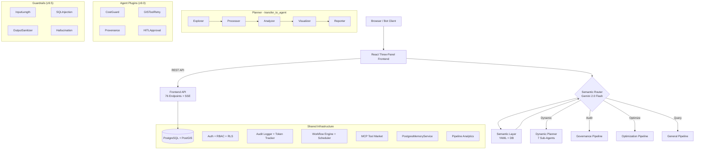

**English** | [中文](./README.md)

# GIS Data Agent (ADK Edition) v17.0

An AI-powered geospatial analysis platform that turns natural language into spatial intelligence. Built on **Google Agent Developer Kit (ADK) v1.27.2** with multi-language semantic intent routing (Chinese/English/Japanese), three specialized pipelines, a React three-panel frontend (Workbench with 4 groups, 26 tabs), and enterprise-grade security.

The system implements **all 21 of 21 (100%)** agentic design patterns, including three ADK Agent types (SequentialAgent / LoopAgent / ParallelAgent), 5 Agent Plugins, 4 Guardrails, SSE streaming, bidirectional A2A interop (Agent Card + Task lifecycle + Agent Registry), NSGA-II multi-objective Pareto optimization (5 scenarios), dynamic agent composition, Circuit Breaker fault tolerance, conditional analysis chains, and self-improvement. Backend serves **242 REST API endpoints**.

**v17.0**: Multimodal Fusion v2.0 Enhancement — 4 core modules upgrading the fusion engine: **Temporal Alignment** (multi-timezone standardization + linear/nearest/spline interpolation + trajectory fusion + multi-period change detection), **Semantic Enhancement** (GIS domain ontology reasoning with 15 equivalence groups + LLM field understanding + knowledge graph integration), **Conflict Resolution** (6 strategies: source_priority/latest_wins/voting/llm_arbitration/spatial_proximity/user_defined + confidence scoring + source annotation), **Explainability** (per-feature metadata injection + quality heatmap + fusion lineage tracing + decision explanation). 84 new tests, ~3700 lines of new code, 5 new REST APIs, FusionQualityTab frontend component.

**v16.0**: SIGMOD 2026 L3 Conditional Autonomy — Semantic operator layer (4 high-level operators), multi-agent collaboration (4 specialist agents + coordinator), plan refinement & error recovery (5-strategy chain), Guardrails policy engine (YAML-driven tool-level access control), remote sensing agent Phase 1 (15+ spectral indices + experience pool), tool evolution (unified metadata registry + failure-driven discovery), AI-assisted Skill creation (natural language → Skill config generation). Frontend additions: QC report generation UI (4 templates → Word), data standards browser, tool rule management panel.

**v15.8**: BCG Enterprise Platform Capabilities — Based on BCG's "Building Effective Enterprise Agents" framework, adds 6 platform capabilities: Prompt Registry (environment-isolated versioning), Model Gateway (task-aware routing + cost optimization), Context Manager (pluggable providers + token budget), Eval Scenario Framework (scenario-specific metrics + golden datasets), enhanced token tracking (scenario/project attribution), enhanced eval history (scenario metrics). 8 new REST endpoints, 12/12 tests passing, zero breaking changes.

**v15.7**: Surveying QC Agent System — Defect taxonomy (30 codes, GB/T 24356), SLA workflow engine (7 templates for DLG/DOM/DEM/3D models), ArcGIS Pro dual-engine MCP (basic arcpy + DL arcgis.learn 2.4.2), 4 independent subsystems (CV detection / CAD parser / ArcGIS MCP / reference data), real-time monitoring dashboard, alert rule engine, human review workflow.

## 📚 Official Technical Documentation

This project provides industrial-grade technical documentation written in the **DITA XML** standard, covering the architecture whitepaper, API references, and multi-engine configuration guides.

👉 **[Read the Full HTML Preview (Chinese)](docs/dita/preview.html)**

> **Note:** 
> You can compile the latest DITA XML source files (located in the `docs/dita/` directory) by running `python preview_docs.py`, and explore deep dives into the Multi-Agent Architecture, Multi-Modal Fusion Engine (MMFE), and GraphRAG Knowledge Graph.

## Key Metrics

| Metric | Value |
|--------|-------|
| Test Coverage | 3100+ tests, 142 test files |
| Toolsets | 40 BaseToolset (incl. GovernanceToolset 18 tools + DataCleaningToolset 11 tools + PrecisionToolset 5 tools), 5 SkillBundle, 240+ tools |
| ADK Skills | 24 scenario skills (incl. surveying-qc, skill-creator) + DB-driven custom Skills + User Tools |
| REST API | 242 endpoints |
| BCG Platform | 6 modules: Prompt Registry + Model Gateway + Context Manager + Eval Scenario + Token Tracking + Eval History |
| Causal Inference | Three-angle system: A (GeoFM statistical 6 tools) + B (LLM reasoning 4 tools) + C (Causal world model 4 tools), 82 tests |
| World Model | AlphaEarth 64-dim + LatentDynamicsNet 459K params + 5 scenarios + timeline animation |
| DRL + World Model | Dreamer-style integration: embedding look-ahead + scenario encoding + auxiliary reward |
| MCP Server | v2.0 — 36+ tools exposed (GIS primitives + high-level metadata + pipeline execution) |
| Agent Plugins | 5 (CostGuard, GISToolRetry, Provenance, HITLApproval, GuardrailsPlugin) |
| Guardrails | 4 (InputLength, SQLInjection, OutputSanitizer, Hallucination) |
| ADK Agent Types | SequentialAgent + LoopAgent + ParallelAgent |
| DRL Scenarios | 5 (Farmland / Urban Green / Facility Siting / Transport Network / Comprehensive) + NSGA-II Pareto |
| Design Pattern Coverage | **21/21 (100%)** |
| Streaming | Batch + SSE streaming |

## Core Capabilities

### BCG Enterprise Platform Capabilities (v15.8)

Six platform capabilities based on BCG's "Building Effective Enterprise Agents" framework for multi-scenario deployment:

**1. Prompt Registry** - Environment-isolated version control (dev/staging/prod), DB storage + YAML fallback, deploy/rollback operations

**2. Model Gateway** - Task-aware routing (3 models: gemini-2.0-flash/2.5-flash/2.5-pro), auto-selection based on task_type/context_tokens/quality/budget, cost tracking with scenario/project attribution

**3. Context Manager** - Pluggable providers (semantic layer, knowledge base), token budget enforcement, relevance-based prioritization

**4. Eval Scenario Framework** - Scenario-specific metrics (e.g., surveying QC: defect_precision/recall/F1/fix_success_rate), golden dataset management, evaluation history tracking

**5. Enhanced Token Tracking** - Scenario and project attribution: `record_usage(scenario, project_id)`, multi-dimensional cost analysis

**6. Enhanced Eval History** - Scenario, dataset, metrics columns: `record_eval_result(scenario, dataset_id, metrics)`

**API Endpoints**: 8 new endpoints (/api/prompts/*, /api/gateway/*, /api/context/*, /api/eval/*)

### Multi-Source Data Fusion (v5.5–v17.0)
- **Five-stage pipeline**: Profile → Assess → Align → Fuse → Validate
- **10 fusion strategies**: spatial join, attribute join, zonal statistics, point sampling, band stack, overlay, temporal fusion, point cloud height assignment, raster vectorize, nearest join
- **5 data modalities**: vector, raster, tabular, point cloud (LAS/LAZ), real-time stream
- **v17.0 Fusion v2.0 Enhancement**:
  - **Temporal Alignment**: Multi-timezone standardization, 3 interpolation methods (linear/nearest/spline), trajectory fusion, multi-period change detection
  - **Semantic Enhancement**: GIS domain ontology (15 equivalence groups, 8 derivation rules, 5 inference rules), LLM field understanding (Gemini 2.5 Flash), knowledge graph integration
  - **Conflict Resolution**: 6 strategies (source_priority, latest_wins, voting, llm_arbitration, spatial_proximity, user_defined) + per-feature confidence scoring + source annotation
  - **Explainability**: Per-feature metadata (_fusion_confidence, _fusion_sources, _fusion_method), quality heatmap GeoJSON, fusion lineage tracing, natural language decision explanation
- **Intelligent semantic matching**:
  - Five-tier progressive matching: exact → equivalence groups → embedding similarity → unit-aware → fuzzy
  - **v7.0 Vector embedding matching**: Gemini text-embedding-004 cosine similarity (opt-in)
  - Catalog-driven equivalence groups + tokenized similarity + type compatibility + auto unit conversion
- **LLM-enhanced strategy routing (v7.0)**: Gemini 2.0 Flash intent-aware strategy recommendation
- **Distributed/out-of-core computing (v7.0)**: Auto-chunked processing for large datasets (>500K rows / >500MB)
- **Geographic knowledge graph (v7.0)**: networkx entity-relationship modeling, spatial adjacency/containment detection, N-hop neighbor queries
- **Raster auto-processing**: CRS reprojection, resolution resampling, windowed sampling for large rasters
- **Enhanced quality validation**: 10 checks (null rate, geometry validity, topology, KS distribution shift, etc.)

### Data Governance
- Topological audit (overlaps, self-intersections, gaps)
- Schema compliance checking against national standards (GB/T 21010)
- Multi-modal verification: PDF reports vs SHP/DB metrics
- Automated governance reports (Word/PDF)
- Multi-source data fusion (v6.0 integration)

### Land Use Optimization
- Deep Reinforcement Learning engine (MaskablePPO) for layout optimization
- **5 DRL scenarios**: Farmland optimization, urban green space, facility siting, transport network, comprehensive planning
- **NSGA-II multi-objective Pareto optimization**: Fast non-dominated sorting + crowding distance
- Paired farmland/forest swaps with strict area balance
- Categorized map rendering: per-feature coloring by land type / change type with Chinese legend

### Business Spatial Intelligence
- Semantic query: natural language → auto-mapped SQL with spatial operators
- Site selection with chain reasoning (Query → Buffer → Overlay → Filter)
- DBSCAN clustering, KDE heatmaps, choropleth maps
- POI search, driving distance, geocoding (batch + reverse)
- Interactive multi-layer map composition with NL layer control

### Intelligent Agent Collaboration (v9.0)
- **Agent Plugins**: CostGuard (token budget), GISToolRetry (smart retry), Provenance (data lineage), HITLApproval (human-in-the-loop)
- **Parallel Pipeline**: ParallelAgent data ingestion, multi-source parallel processing
- **Cross-Session Memory**: PostgresMemoryService persistent conversation memory across sessions
- **Smart Task Decomposition**: TaskGraph DAG decomposition + wave-parallel execution
- **Pipeline Analytics**: 5-dimension analysis — latency, success rate, token efficiency, throughput, agent breakdown
- **Agent Lifecycle Hooks**: Prometheus metrics + ProgressTracker per-pipeline progress tracking

### Production Hardening (v9.5)
- **Guardrails (4)**: InputLength (>50k reject) + SQLInjection (pattern detection) + OutputSanitizer (sensitive data redaction) + Hallucination (warning injection), recursively attached to all sub-agents
- **SSE Streaming**: `run_pipeline_streaming()` async generator + `/api/pipeline/stream` REST endpoint
- **LongRunningFunctionTool**: DRL optimization async execution, preventing duplicate agent calls
- **Centralized Test Fixtures**: conftest.py shared fixtures with event loop safety isolation

### Intelligent Platform Extension (v10.0)
- **GraphRAG Knowledge Enhancement**: Entity extraction (Gemini+regex) → co-occurrence graph construction → graph-augmented retrieval (vector + graph neighbor re-ranking), 9 KB tools
- **Per-User MCP Isolation**: Users can create private MCP servers, owner_username + is_shared visibility control
- **Custom Skill Bundles**: DB-driven user-defined toolset + ADK Skills compositions with intent trigger matching
- **Spatial Analysis Tier 2**: IDW interpolation, Kriging, Geographically Weighted Regression (GWR), multi-temporal change detection, DEM viewshed analysis
- **Workflow Template Marketplace**: 5 built-in templates + publish/clone/rate, one-click workflow reuse

### Virtual Data Layer (v13.0)
- **4 data source connectors**: WFS / STAC / OGC API / Custom API, zero-copy on-demand queries
- **Fernet-encrypted credential storage**: Secure connector key persistence
- **Auto CRS alignment**: GeoDataFrame auto `to_crs(target_crs)` on query return
- **Semantic schema mapping**: text-embedding-004 vector embeddings + 35 canonical geospatial vocabulary for auto field matching
- **Connector health monitoring**: Endpoint connectivity checks + DataPanel health indicators

### MCP Server v2.0 (v13.1)
- **36+ tools exposed**: GIS primitives + 6 high-level metadata tools (search_catalog / get_data_lineage / list_skills / list_toolsets / list_virtual_sources / run_analysis_pipeline)
- External agents (Claude Desktop / Cursor) can invoke full analysis capabilities via MCP

### Extensible Platform (v12.0–v14.3)
- **Custom Skills CRUD**: Create/edit/delete custom LlmAgents with versioning (last 10 rollback), rating, cloning, and approval workflow
- **User-Defined Tools**: Declarative tool templates (http_call / sql_query / file_transform / chain)
- **Marketplace Gallery**: Aggregates Skills / Tools / Templates / Bundles with sorting and popularity ranking
- **Skill SDK Specification**: `gis-skill-sdk` Python package spec for external developers
- **Plugin System**: Dynamic registration of custom DataPanel tab plugins
- **Skill Dependency Graph**: Skill A depends on Skill B via DAG orchestration
- **Webhook Integration**: Third-party Skill registration (GitHub Action / Zapier trigger)

### Multi-Agent Orchestration (v14.0–v14.3)
- **DAG Workflows**: Topological sort + parallel layers + conditional nodes + Custom Skill Agent nodes
- **Node-level Retry**: Retry individual failed DAG nodes without re-running entire workflow
- **Bidirectional A2A RPC**: Agent Card + Task lifecycle (submitted→working→completed) + active remote agent invocation
- **Agent Registry**: PostgreSQL-backed service discovery + heartbeat + status management
- **Circuit Breaker**: Auto-degrade on consecutive tool/agent failures
- **Conditional Analysis Chains**: User-defined triggers for automatic follow-up analysis after pipeline completion

### Interaction Enhancements (v14.0–v14.3)
- **Multi-language intent detection**: Chinese/English/Japanese auto-detection + routing
- **Intent disambiguation dialog**: Selection cards for AMBIGUOUS classifications
- **Heatmap support**: deck.gl HeatmapLayer integration
- **Measurement tools**: Distance (Haversine) + area (Shoelace) calculation
- **3D layer control**: Show/hide/opacity adjustment panel
- **3D basemap sync**: 2D basemap selection auto-synced to 3D view
- **GeoJSON editor**: In-DataPanel paste/edit GeoJSON + map preview
- **Annotation export**: GeoJSON / CSV format export

### Multimodal Input (v5.2)
- Image understanding: auto-classify uploaded images for Gemini vision analysis
- PDF parsing: text extraction + native PDF Blob dual strategy
- Voice input: Web Speech API with zh-CN / en-US toggle

### 3D Spatial Visualization (v5.3)
- deck.gl + maplibre 3D renderer
- Layer types: extrusion, column, arc, scatterplot
- One-click 2D/3D view toggle

### Workflow Builder (v5.4)
- Multi-step pipeline chain execution with parameterized prompt templates
- React Flow visual drag-and-drop editor (DataInput / Pipeline / Output nodes)
- APScheduler cron-based scheduled execution
- Webhook result push on completion

## Architecture



**Pipeline routing**: `DYNAMIC_PLANNER=true` (default) uses the Planner with `transfer_to_agent`; `false` falls back to 3 fixed `SequentialAgent` pipelines.

**Model tiering**: Explorer/Visualizer → Gemini 2.0 Flash, Processor/Analyzer/Planner → Gemini 2.5 Flash, Reporter → Gemini 2.5 Pro.

## Quick Start

### Docker (recommended)
```bash
docker-compose up -d
# Visit http://localhost:8000
# Login: admin / admin123
```

### Local Development
```bash
# 1. Configure environment
cp data_agent/.env.example data_agent/.env
# Edit .env with your PostgreSQL/PostGIS credentials and Vertex AI config

# 2. Install dependencies
pip install -r requirements.txt

# 3. Run backend
chainlit run data_agent/app.py -w

# 4. Run frontend (dev mode, optional)
cd frontend && npm install && npm run dev
```

Default login: `admin` / `admin123` (seeded on first run). In-app self-registration available on the login page.

## Feature Matrix

| Category | Feature | Description |
|---|---|---|
| **AI Core** | Semantic Layer | YAML catalog (15 domains, 7 regions, 8 spatial ops) + 3-level hierarchy + DB annotations |
| | Skill Bundles | 16 fine-grained scenario skills (farmland compliance, coordinate transform, spatial clustering, PostGIS analysis, etc.), three-level incremental loading (v7.5) |
| | Custom Skills | DB-driven user-defined expert agents: custom instructions/toolsets/triggers, @mention invocation, LLM injection protection (v8.0) |
| | NL Layer Control | Natural language show/hide/style/remove map layers via `control_map_layer` tool |
| | MCP Tool Market | Config-driven MCP server connection + tool aggregation + DB persistence + management UI + per-User isolation (v7.1/v10.0) |
| | Analysis Perspective | User-defined analysis focus, auto-injected into agent prompts (v7.1) |
| | Memory ETL | Auto-extract key findings after pipeline execution, smart dedup, quota management (v7.5) |
| | Dynamic Tool Loading | Intent-based dynamic tool filtering (8 categories + 10 core tools), ContextVar + ToolPredicate (v7.5) |
| | Failure Learning | Tool failure pattern recording + historical hint injection + auto-mark resolved (v8.0) |
| | Dynamic Model Selection | Task complexity assessment → fast/standard/premium adaptive model switching (v8.0) |
| | Context Caching | Gemini context caching: reuse long system prompts, reduce token cost, env-controlled TTL (v7.5) |
| | Reflection Loops | All 3 pipelines with LoopAgent quality reflection (v7.1) |
| **Agent Collaboration** | Agent Plugins | CostGuard (token budget) + GISToolRetry (smart retry) + Provenance (data lineage) + HITLApproval (human-in-the-loop) (v9.0) |
| | ParallelAgent | Parallel data ingestion pipeline, multi-source parallel processing (v9.0) |
| | Cross-Session Memory | PostgresMemoryService persistent conversation memory across sessions (v9.0) |
| | Task Decomposition | TaskGraph DAG decomposition + wave-parallel execution (v9.0) |
| | Pipeline Analytics | 5-dimension analysis: latency, success rate, token efficiency, throughput, agent breakdown (v9.0) |
| | Agent Hooks | Prometheus metrics + ProgressTracker per-pipeline progress tracking (v9.0) |
| **Production Hardening** | Guardrails | 4 input/output guards: InputLength + SQLInjection + OutputSanitizer + Hallucination (v9.5) |
| | SSE Streaming | run_pipeline_streaming() async generator + /api/pipeline/stream endpoint (v9.5) |
| | LongRunningTool | DRL optimization async execution, prevents duplicate calls (v9.5) |
| | conftest.py | Centralized test fixtures with event loop safety isolation (v9.5) |
| **v10.0 Extensions** | GraphRAG | Entity extraction + knowledge graph construction + graph-augmented vector retrieval (v10.0) |
| | Per-User MCP | User-level MCP server isolation, private/shared control (v10.0) |
| | Custom Skill Bundles | DB-driven user-composed toolset+ADK Skills bundles (v10.0) |
| | Spatial Analysis Tier 2 | IDW/Kriging/GWR/change detection/viewshed — 5 advanced tools (v10.0) |
| | Workflow Templates | Built-in + user-published workflow template marketplace with clone/rate (v10.0) |
| **Data Fusion** | Fusion Engine (MMFE) | Five-stage pipeline (Profile→Assess→Align→Fuse→Validate), 10 strategies, 5 modalities |
| | Semantic Matching | Five-tier progressive: exact → equivalence groups → embedding similarity → unit-aware → fuzzy |
| | Embedding Matching (v7.0) | Gemini text-embedding-004 vector semantic matching (opt-in) |
| | LLM Strategy Routing (v7.0) | Gemini 2.0 Flash intent-aware strategy recommendation (`strategy="llm_auto"`) |
| | Knowledge Graph (v7.0) | networkx spatial entity-relationship modeling, N-hop queries, shortest path |
| | Distributed Computing (v7.0) | Auto-chunked processing for large datasets (>500K rows) |
| | Raster Processing | Auto CRS reprojection, resolution resampling, windowed sampling for large rasters |
| | Point Cloud & Stream | LAS/LAZ height assignment, CSV/JSON stream temporal fusion (time window + spatial aggregation) |
| | Quality Validation | 10 checks: null rate, geometry, topology, CRS, micro-polygons, outliers, KS distribution shift |
| **Multimodal** | Image Understanding | Auto-classify uploaded images → Gemini vision analysis |
| | PDF Parsing | pypdf text extraction + native PDF Blob dual strategy |
| | Voice Input | Web Speech API with zh-CN / en-US toggle, pulse animation |
| **3D Visualization** | deck.gl Renderer | Extrusion, column, arc, scatterplot layers |
| | 2D/3D Toggle | One-click MapPanel toggle with auto-detect 3D layers |
| **Workflows** | Engine | Multi-step pipeline chain execution + parameterized templates |
| | Visual Editor | React Flow drag-and-drop with 3 custom node types (v7.1) |
| | Scheduled Execution | APScheduler cron triggers |
| | Webhook Push | HTTP POST results on completion |
| **Data** | Data Lake | Unified data catalog + lineage tracking + one-click asset download (local/cloud/PostGIS) |
| | RAG Knowledge Base | User document upload → vector storage → semantic search, multi-tenant isolation (v8.0) |
| | Real-time Streams | Redis Streams with geofence alerts + IoT data |
| | Remote Sensing | Raster analysis, NDVI, LULC/DEM download |
| **Frontend** | Three-Panel UI | Chat + Map + Data panels; HTML/CSV artifact rendering support; React 18 + Leaflet + deck.gl |
| | Categorized Layers | `categorized` layer type: per-feature polygon coloring + Chinese legend (v7.5) |
| | File Management | Click any file in DataPanel to open/download (PDF/DOCX/HTML etc.) (v7.5) |
| | Action Buttons | Export PDF report, share results etc. via ChainlitAPI callAction (v7.5) |
| | Token Dashboard | Per-user daily/monthly usage with pipeline breakdown visualization |
| | Map Annotations | Collaborative click-to-add annotations with team sharing |
| | Basemap Switcher | Gaode, Tianditu (conditional), CartoDB, OpenStreetMap |
| **Security** | Auth | Password + OAuth2 (Google) + in-app self-registration |
| | MCP Security Hardening | Per-user tool isolation + security sandbox + audit logging (v7.5) |
| | RBAC + RLS | admin/analyst/viewer roles + PostgreSQL Row-Level Security |
| | Account Management | User self-deletion with cascade cleanup + admin protection |
| | Audit Log | Enterprise audit trail with admin dashboard |
| **Enterprise** | Bot Integration | WeChat, DingTalk, Feishu enterprise bot adapters |
| | Team Collaboration | Team creation, member management, resource sharing |
| | Report Export | Word/PDF with page headers, footers, pipeline-specific titles |
| **Ops** | Health Check API | K8s liveness/readiness probes + admin system diagnostics |
| | CI Pipeline | GitHub Actions: tests, frontend build, agent evaluation, eval-gated CI (v8.0) |
| | Docker + K8s | Containerization, Helm/Kustomize, HPA, network policies |
| | Observability | Structured logging (JSON) + Prometheus metrics + end-to-end Trace ID (v7.1) |
| | i18n | Chinese/English dual language, YAML dict + ContextVar |

## Tech Stack

| Layer | Technology |
|---|---|
| **Framework** | Google ADK v1.26 (`google.adk.agents`, `google.adk.runners`) |
| **LLM** | Gemini 2.5 Flash / 2.5 Pro (agents), Gemini 2.0 Flash (router) |
| **Frontend** | React 18 + TypeScript + Vite + Leaflet.js + deck.gl + React Flow |
| **Backend** | Chainlit + Starlette (85 REST API endpoints + SSE Streaming) |
| **Database** | PostgreSQL 16 + PostGIS 3.4 |
| **GIS** | GeoPandas, Shapely, Rasterio, PySAL, Folium, mapclassify |
| **ML** | PyTorch, Stable Baselines 3 (MaskablePPO), Gymnasium |
| **Cloud** | Huawei OBS (S3-compatible) for file storage |
| **Streaming** | Redis Streams (with in-memory fallback) |
| **Container** | Docker + Docker Compose + Kubernetes (Kustomize) |
| **CI** | GitHub Actions (pytest + npm build + evaluation + route-eval) |
| **Python** | 3.13+ |

## Project Structure

```
data_agent/
├── app.py                       # Chainlit UI, semantic router, auth, RBAC
├── agent.py                     # Agent definitions, pipeline assembly, ParallelAgent
├── frontend_api.py              # 76 REST API endpoints
├── pipeline_runner.py           # Headless pipeline executor + SSE streaming
├── workflow_engine.py           # Workflow engine: CRUD, execution, webhook, cron
├── multimodal.py                # Multimodal input: image/PDF classification, Gemini Parts
├── mcp_hub.py                   # MCP Hub Manager: config-driven MCP server management
├── fusion_engine.py             # Multi-modal Data Fusion Engine (MMFE, ~2100 lines)
├── knowledge_graph.py           # Geographic Knowledge Graph Engine (networkx, ~625 lines)
├── custom_skills.py             # DB-driven custom Skills: CRUD, validation, agent factory
├── failure_learning.py          # Tool failure pattern learning: record, query, mark resolved
├── plugins.py                   # Agent Plugins: CostGuard, GISToolRetry, Provenance, HITL
├── guardrails.py                # Agent Guardrails: 4 input/output guards (recursive attach)
├── conversation_memory.py       # PostgresMemoryService cross-session memory
├── task_decomposer.py           # TaskGraph DAG task decomposition + wave-parallel
├── pipeline_analytics.py        # Pipeline analytics dashboard (5 REST endpoints)
├── agent_hooks.py               # Agent lifecycle hooks (Prometheus + ProgressTracker)
├── knowledge_base.py            # RAG knowledge base: document vectorization + semantic search
├── graph_rag.py                 # GraphRAG: entity extraction + graph construction + augmented retrieval (v10.0)
├── custom_skill_bundles.py      # User custom skill bundles: CRUD + factory + intent matching (v10.0)
├── workflow_templates.py        # Workflow template marketplace: CRUD + clone + rating (v10.0)
├── spatial_analysis_tier2.py    # Advanced spatial analysis: IDW/Kriging/GWR/change detection/viewshed (v10.0)
├── conftest.py                  # Centralized test fixtures + event loop safety
├── toolsets/                    # 22 BaseToolset modules
│   ├── visualization_tools.py   #   10 tools: choropleth, heatmap, 3D, layer control
│   ├── analysis_tools.py        #   Analysis tools + LongRunningFunctionTool (DRL)
│   ├── fusion_tools.py          #   Data fusion toolset (4 tools)
│   ├── knowledge_graph_tools.py #   Knowledge graph toolset (3 tools)
│   ├── mcp_hub_toolset.py       #   MCP tool bridge
│   ├── skill_bundles.py         #   16 scenario skill groupings
│   ├── spatial_analysis_tier2_tools.py # IDW/Kriging/GWR/change detection/viewshed (v10.0)
│   └── ...                      #   exploration, geo processing, database, etc.
├── skills/                      # 16 ADK scenario skills (kebab-case directories)
├── prompts/                     # 3 YAML prompt files
├── evals/                       # Agent evaluation framework (trajectory + rubric)
├── migrations/                  # 29 SQL migration scripts
├── locales/                     # i18n: zh.yaml + en.yaml
├── db_engine.py                 # Connection pool singleton
├── tool_filter.py               # Intent-driven dynamic tool filtering (ToolPredicate + ContextVar)
├── health.py                    # K8s health check API
├── observability.py             # Structured logging + Prometheus
├── i18n.py                      # i18n: YAML dict + t() function
├── test_*.py                    # 85 test files (1993 tests)
└── run_evaluation.py            # Agent evaluation runner

frontend/
├── src/
│   ├── App.tsx                  # Main app: auth, three-panel layout
│   ├── components/
│   │   ├── ChatPanel.tsx        # Chat + voice input + NL layer control
│   │   ├── MapPanel.tsx         # Leaflet map + 2D/3D toggle + annotations
│   │   ├── Map3DView.tsx        # deck.gl 3D renderer
│   │   ├── DataPanel.tsx        # 7 tabs: files/table/catalog/history/usage/tools/workflows
│   │   ├── WorkflowEditor.tsx   # React Flow workflow visual editor
│   │   ├── LoginPage.tsx        # Login + in-app registration
│   │   ├── AdminDashboard.tsx   # Admin dashboard
│   │   └── UserSettings.tsx     # Account settings + self-deletion
│   └── styles/layout.css        # All styles (~2100 lines)
└── package.json

.github/workflows/ci.yml        # GitHub Actions CI pipeline
k8s/                             # 11 Kubernetes manifests
docs/                            # Documentation
```

## Frontend Architecture

Custom React SPA replacing Chainlit's default UI:

```
┌───────────────────┬──────────────────────────┬──────────────────────┐
│  Chat Panel        │    Map Panel              │   Data Panel         │
│  (320px)           │   (flex-1)                │  (360px)             │
│                    │                           │                      │
│  Messages          │  Leaflet / deck.gl Map    │  7 tabs:             │
│  Streaming         │  GeoJSON Layers           │  - Files             │
│  Action Cards      │  2D/3D Toggle             │  - Table Preview     │
│  Voice Input       │  Layer Control            │  - Data Catalog      │
│  NL Layer Ctrl     │  Annotations              │  - Pipeline History  │
│                    │  Basemap Switcher         │  - Token Usage       │
│                    │  Legend                    │  - MCP Tools         │
│                    │                           │  - Workflows         │
└───────────────────┴──────────────────────────┴──────────────────────┘
```

## REST API Endpoints (76 routes)

| Method | Path | Description |
|---|---|---|
| GET | `/api/catalog` | List data assets (keyword, type filters) |
| GET | `/api/catalog/{id}` | Asset detail |
| GET | `/api/catalog/{id}/lineage` | Data lineage (ancestors + descendants) |
| GET | `/api/semantic/domains` | Semantic domain list |
| GET | `/api/semantic/hierarchy/{domain}` | Browse domain hierarchy tree |
| GET | `/api/pipeline/history` | Pipeline execution history |
| GET | `/api/pipeline/stream` | SSE streaming pipeline output (v9.5) |
| GET | `/api/user/token-usage` | Token consumption + pipeline breakdown |
| DELETE | `/api/user/account` | Self-delete account (password confirmation) |
| GET/PUT | `/api/user/analysis-perspective` | View/set analysis perspective (v7.1) |
| GET | `/api/user/memories` | List auto-extracted smart memories (v7.5) |
| DELETE | `/api/user/memories/{id}` | Delete specific smart memory (v7.5) |
| GET | `/api/sessions` | Session list |
| DELETE | `/api/sessions/{id}` | Delete session |
| GET/POST | `/api/annotations` | List / create map annotations |
| PUT/DELETE | `/api/annotations/{id}` | Update / delete annotation |
| GET | `/api/config/basemaps` | Available basemap layers |
| GET | `/api/admin/users` | User list (admin only) |
| PUT | `/api/admin/users/{username}/role` | Update user role (admin only) |
| DELETE | `/api/admin/users/{username}` | Delete user (admin only) |
| GET | `/api/admin/metrics/summary` | System metrics (admin only) |
| GET | `/api/mcp/servers` | MCP server status |
| POST | `/api/mcp/servers` | Add MCP server (v7.1) |
| GET | `/api/mcp/tools` | MCP tool list |
| POST | `/api/mcp/servers/test` | MCP connection test |
| POST | `/api/mcp/servers/{name}/toggle` | Toggle MCP server (admin) |
| POST | `/api/mcp/servers/{name}/reconnect` | Reconnect MCP server (admin) |
| PUT | `/api/mcp/servers/{name}` | Update MCP server config (v7.1) |
| DELETE | `/api/mcp/servers/{name}` | Delete MCP server (v7.1) |
| GET/POST | `/api/workflows` | List / create workflows |
| GET/PUT/DELETE | `/api/workflows/{id}` | Workflow detail / update / delete |
| POST | `/api/workflows/{id}/execute` | Execute workflow |
| GET | `/api/workflows/{id}/runs` | Workflow execution history |
| GET | `/api/workflows/{id}/runs/{run_id}/status` | Workflow run status |
| GET | `/api/map/pending` | Pending map updates (frontend polling) |
| GET/POST | `/api/skills` | List / create custom Skills (v8.0) |
| GET/PUT/DELETE | `/api/skills/{id}` | Skill detail / update / delete (v8.0) |
| GET/POST | `/api/kb` | Knowledge base list / create (v8.0) |
| POST | `/api/kb/search` | Knowledge base semantic search (v8.0) |
| GET/DELETE | `/api/kb/{id}` | Knowledge base detail / delete (v8.0) |
| POST | `/api/kb/{id}/documents` | Upload knowledge base document (v8.0) |
| DELETE | `/api/kb/{id}/documents/{doc_id}` | Delete knowledge base document (v8.0) |
| GET | `/api/analytics/latency` | Pipeline latency analysis (v9.0) |
| GET | `/api/analytics/tool-success` | Tool success rate analysis (v9.0) |
| GET | `/api/analytics/token-efficiency` | Token efficiency analysis (v9.0) |
| GET | `/api/analytics/throughput` | Pipeline throughput analysis (v9.0) |
| GET | `/api/analytics/agent-breakdown` | Agent breakdown analysis (v9.0) |
| GET | `/api/mcp/servers/mine` | Current user's MCP servers (v10.0) |
| POST | `/api/mcp/servers/{name}/share` | Toggle MCP server sharing (v10.0) |
| GET/POST | `/api/bundles` | Skill bundle list / create (v10.0) |
| GET | `/api/bundles/available-tools` | Available toolsets + skills for composition (v10.0) |
| GET/PUT/DELETE | `/api/bundles/{id}` | Bundle detail / update / delete (v10.0) |
| GET/POST | `/api/templates` | Workflow template list / create (v10.0) |
| GET/PUT/DELETE | `/api/templates/{id}` | Template detail / update / delete (v10.0) |
| POST | `/api/templates/{id}/clone` | Clone template as workflow (v10.0) |
| POST | `/api/kb/{id}/build-graph` | Build KB entity graph (v10.0) |
| GET | `/api/kb/{id}/graph` | Entity-relationship graph data (v10.0) |
| POST | `/api/kb/{id}/graph-search` | Graph-augmented semantic search (v10.0) |
| GET | `/api/kb/{id}/entities` | KB entity list (v10.0) |

## Running Tests

```bash
# All tests (1993 tests)
python -m pytest data_agent/ --ignore=data_agent/test_knowledge_agent.py -q

# Single module
python -m pytest data_agent/test_guardrails.py -v

# Frontend build check
cd frontend && npm run build
```

## CI Pipeline

GitHub Actions workflow (`.github/workflows/ci.yml`) runs on push to `main`/`develop` and PRs:

1. **Unit Tests** — Python tests with PostGIS service container + JUnit XML output
2. **Frontend Build** — TypeScript compilation + Vite production build
3. **Agent Evaluation** — ADK agent evaluation on `main` push only (requires `GOOGLE_API_KEY` secret)
4. **Route Evaluation** — API endpoint count validation

## Roadmap

| Version | Feature Set | Tests | Status |
|---|---|---|---|
| v1.0–v3.2 | Core GIS, PostGIS, Semantic Layer, Multi-Pipeline Architecture | — | ✅ Done |
| v4.0 | Frontend Three-Panel SPA, Observability, CI/CD, Skill Bundles | — | ✅ Done |
| v4.1 | Session Persistence, Pipeline Progress, Error Recovery, i18n | — | ✅ Done |
| v5.1–v5.6 | MCP Market, Multimodal Input, 3D Visualization, Workflow Builder, Fusion Engine | — | ✅ Done |
| v6.0 | Fusion Improvements (raster reprojection, point cloud, stream, quality) | — | ✅ Done |
| v7.0 | Vector Embedding, LLM Strategy Routing, Knowledge Graph, Distributed Computing | — | ✅ Done |
| v7.1 | MCP Management UI, WorkflowEditor, Analysis Perspective, Reflection Loops, Trace ID | — | ✅ Done |
| v7.5 | MCP Security, Memory ETL, Dynamic Tool Loading, 16 Scenario Skills, Context Caching | 1530 | ✅ Done |
| v8.0 | Failure Learning, Dynamic Model Selection, Eval-Gated CI, Custom Skills, RAG Knowledge Base | 1735 | ✅ Done |
| v9.0 | Agent Plugins (4), ParallelAgent, Cross-Session Memory, Task Decomposition, Pipeline Analytics, Agent Hooks | 1859 | ✅ Done |
| v9.5 | conftest.py, Guardrails (4), SSE Streaming, LongRunningFunctionTool, Evaluation Enhancement | 1895 | ✅ Done |
| v10.0 | GraphRAG, per-User MCP Isolation, Custom Skill Bundles, Spatial Analysis Tier 2, Workflow Templates | 1993 | ✅ Done |
| v11.0 | Concurrent Task Queue, Chain-of-Thought Reasoning, Proactive Exploration, A2A Interop, Design Patterns 19/21 | 2074 | ✅ Done |
| v12.0 | Extensible Platform: Custom Skills CRUD, User Tools, Multi-Agent Pipeline, Capabilities Tab, Security Hardening, ADK v1.27.2 | 2121 | ✅ Done |
| v12.1 | Data Lineage Tracking, Industry Templates, Cartographic Precision UI, API Modularization | 2123 | ✅ Done |
| v12.2 | Semantic Data Discovery: Vector Embedding Hybrid Search, KG Asset Graph, Semantic Metrics | 2123 | ✅ Done |
| v13.0 | Virtual Data Layer: 4 Connectors (WFS/STAC/OGC API/Custom API), Fernet Encryption, Semantic Schema Mapping | 2150 | ✅ Done |
| v13.1 | MCP Server v2.0: 6 High-Level Metadata Tools, 36+ Tools Exposed | 2150 | ✅ Done |
| v14.0 | Interaction + Marketplace: Intent Disambiguation, Rating/Clone, 5 DRL Scenarios, Heatmap, Measurement, 3D Layer Control | 2170 | ✅ Done |
| v14.1 | Smart + Collaboration: Follow-up Chains, Versioning, Tags, Multi-Scenario DRL, GeoJSON Editor, Agent Registry, A2A Bidirectional RPC | 2180 | ✅ Done |
| v14.2 | Deep Intelligence + Production: Analysis Chains, NSGA-II Pareto, Circuit Breaker, Annotation Export | 2190 | ✅ Done |
| v14.3 | Federation + Ecosystem: Multi-Language Detection (zh/en/ja), Skill Dependencies, Webhook, Skill SDK, Plugin System, Full A2A Protocol | 2193 | ✅ Done |
| | **Design Pattern Coverage: 21/21 (100%) — Full Coverage** | | |

## Design Pattern Coverage (21/21 = 100%)

| Pattern | Status | Implementation |
|---------|--------|----------------|
| Prompt Chaining (Ch1) | ✅ | 3 SequentialAgent pipelines |
| Routing (Ch2) | ✅ | Gemini 2.0 Flash intent classification |
| Parallelization (Ch3) | ✅ | ParallelAgent + TaskDecomposer |
| Reflection (Ch4) | ✅ | LoopAgent across all 3 pipelines |
| Tool Use (Ch5) | ✅ | 24 toolsets, 130+ tools, 18 Skills |
| Planning (Ch6) | ✅ | DAG task decomposition + wave-parallel |
| Multi-Agent (Ch7) | ✅ | Hierarchical Planner + 7 sub-agents |
| Memory (Ch8) | ✅ | Memory ETL + PostgresMemoryService |
| Learning & Adaptation (Ch9) | ✅ | Failure learning + GISToolRetryPlugin |
| MCP Protocol (Ch10) | ✅ | 3 transports + DB CRUD + management UI |
| Goal Monitoring (Ch11) | ✅ | ProgressTracker + Prometheus |
| Recovery (Ch12) | ✅ | Recovery hints + GISToolRetryPlugin |
| HITL (Ch13) | ✅ | BasePlugin + 13-tool risk registry |
| Resource Awareness (Ch16) | ✅ | Dynamic tools + dynamic model + CostGuard + LongRunning |
| Guardrails & Safety (Ch18) | ✅ | RBAC + RLS + 4 Guardrails |
| Evaluation & Monitoring (Ch19) | ✅ | 4-pipeline eval + CI + 5 Analytics endpoints |

## License

MIT
