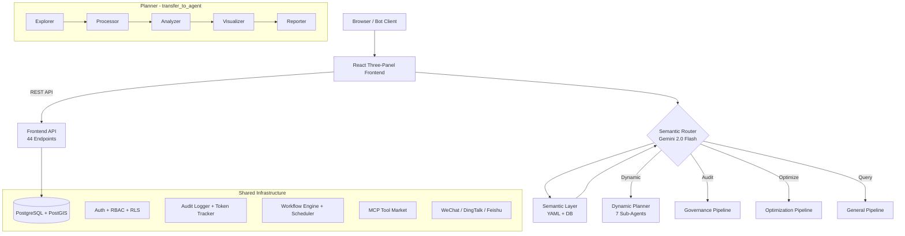

**English** | [中文](./README.md)

# GIS Data Agent (ADK Edition) v8.0

An AI-powered geospatial analysis platform that turns natural language into spatial intelligence. Built on **Google Agent Developer Kit (ADK)** with semantic intent routing, four specialized pipelines, a React three-panel frontend, and enterprise-grade security. Features multi-source data fusion, multimodal input, 16 ADK scenario skills, DB-driven custom Skills, Gemini Context Caching, failure learning & adaptation, dynamic model selection, evaluation-gated CI, categorized map rendering, 3D visualization, workflow orchestration, geographic knowledge graph, and Memory ETL auto-extraction.

## Core Capabilities

### Multi-Source Data Fusion (v5.5–v7.0)
- **Five-stage pipeline**: Profile → Assess → Align → Fuse → Validate
- **10 fusion strategies**: spatial join, attribute join, zonal statistics, point sampling, band stack, overlay, temporal fusion, point cloud height assignment, raster vectorize, nearest join
- **5 data modalities**: vector, raster, tabular, point cloud (LAS/LAZ), real-time stream
- **Intelligent semantic matching**:
  - Five-tier progressive matching: exact → equivalence groups → embedding similarity → unit-aware → fuzzy
  - **v7.0 Vector embedding matching**: Gemini text-embedding-004 cosine similarity (opt-in)
  - Catalog-driven equivalence groups + tokenized similarity + type compatibility + auto unit conversion
- **LLM-enhanced strategy routing (v7.0)**: Gemini 2.0 Flash intent-aware strategy recommendation
- **Distributed/out-of-core computing (v7.0)**: Auto-chunked processing for large datasets (>500K rows / >500MB)
- **Geographic knowledge graph (v7.0)**: networkx entity-relationship modeling, spatial adjacency/containment detection, N-hop neighbor queries
- **Raster auto-processing**: CRS reprojection, resolution resampling, windowed sampling for large rasters
- **Enhanced quality validation**: 10 checks (null rate, geometry validity, topology, KS distribution shift, etc.)

### Data Governance
- Topological audit (overlaps, self-intersections, gaps)
- Schema compliance checking against national standards (GB/T 21010)
- Multi-modal verification: PDF reports vs SHP/DB metrics
- Automated governance reports (Word/PDF)
- Multi-source data fusion (v6.0 integration)

### Land Use Optimization
- Deep Reinforcement Learning engine (MaskablePPO) for layout optimization
- Paired farmland/forest swaps with strict area balance
- Categorized map rendering: per-feature coloring by land type / change type with Chinese legend

### Business Spatial Intelligence
- Semantic query: natural language → auto-mapped SQL with spatial operators
- Site selection with chain reasoning (Query → Buffer → Overlay → Filter)
- DBSCAN clustering, KDE heatmaps, choropleth maps
- POI search, driving distance, geocoding (batch + reverse)
- Interactive multi-layer map composition with NL layer control

### Multimodal Input (v5.2)
- Image understanding: auto-classify uploaded images for Gemini vision analysis
- PDF parsing: text extraction + native PDF Blob dual strategy
- Voice input: Web Speech API with zh-CN / en-US toggle

### 3D Spatial Visualization (v5.3)
- deck.gl + maplibre 3D renderer
- Layer types: extrusion, column, arc, scatterplot
- One-click 2D/3D view toggle

### Workflow Builder (v5.4)
- Multi-step pipeline chain execution with parameterized prompt templates
- React Flow visual drag-and-drop editor (DataInput / Pipeline / Output nodes)
- APScheduler cron-based scheduled execution
- Webhook result push on completion

## Architecture



**Pipeline routing**: `DYNAMIC_PLANNER=true` (default) uses the Planner with `transfer_to_agent`; `false` falls back to 3 fixed `SequentialAgent` pipelines.

**Model tiering**: Explorer/Visualizer → Gemini 2.0 Flash, Processor/Analyzer/Planner → Gemini 2.5 Flash, Reporter → Gemini 2.5 Pro.

## Quick Start

### Docker (recommended)
```bash
docker-compose up -d
# Visit http://localhost:8000
# Login: admin / admin123
```

### Local Development
```bash
# 1. Configure environment
cp data_agent/.env.example data_agent/.env
# Edit .env with your PostgreSQL/PostGIS credentials and Vertex AI config

# 2. Install dependencies
pip install -r requirements.txt

# 3. Run backend
chainlit run data_agent/app.py -w

# 4. Run frontend (dev mode, optional)
cd frontend && npm install && npm run dev
```

Default login: `admin` / `admin123` (seeded on first run). In-app self-registration available on the login page.

## Feature Matrix

| Category | Feature | Description |
|---|---|---|
| **AI Core** | Semantic Layer | YAML catalog (15 domains, 7 regions, 8 spatial ops) + 3-level hierarchy + DB annotations |
| | Skill Bundles | 16 fine-grained scenario skills (farmland compliance, coordinate transform, spatial clustering, PostGIS analysis, etc.), three-level incremental loading (v7.5) |
| | Custom Skills | DB-driven user-defined expert agents: custom instructions/toolsets/triggers, @mention invocation, LLM injection protection (v8.0) |
| | NL Layer Control | Natural language show/hide/style/remove map layers via `control_map_layer` tool |
| | MCP Tool Market | Config-driven MCP server connection + tool aggregation + DB persistence + management UI (v7.1) |
| | Analysis Perspective | User-defined analysis focus, auto-injected into agent prompts (v7.1) |
| | Memory ETL | Auto-extract key findings after pipeline execution, smart dedup, quota management (v7.5) |
| | Dynamic Tool Loading | Intent-based dynamic tool filtering (8 categories + 10 core tools), ContextVar + ToolPredicate (v7.5) |
| | Failure Learning | Tool failure pattern recording + historical hint injection + auto-mark resolved (v8.0) |
| | Dynamic Model Selection | Task complexity assessment → fast/standard/premium adaptive model switching (v8.0) |
| | Context Caching | Gemini context caching: reuse long system prompts, reduce token cost, env-controlled TTL (v7.5) |
| | Reflection Loops | All 3 pipelines with LoopAgent quality reflection (v7.1) |
| **Data Fusion** | Fusion Engine (MMFE) | Five-stage pipeline (Profile→Assess→Align→Fuse→Validate), 10 strategies, 5 modalities |
| | Semantic Matching | Five-tier progressive: exact → equivalence groups → embedding similarity → unit-aware → fuzzy |
| | Embedding Matching (v7.0) | Gemini text-embedding-004 vector semantic matching (opt-in) |
| | LLM Strategy Routing (v7.0) | Gemini 2.0 Flash intent-aware strategy recommendation (`strategy="llm_auto"`) |
| | Knowledge Graph (v7.0) | networkx spatial entity-relationship modeling, N-hop queries, shortest path |
| | Distributed Computing (v7.0) | Auto-chunked processing for large datasets (>500K rows) |
| | Raster Processing | Auto CRS reprojection, resolution resampling, windowed sampling for large rasters |
| | Point Cloud & Stream | LAS/LAZ height assignment, CSV/JSON stream temporal fusion (time window + spatial aggregation) |
| | Quality Validation | 10 checks: null rate, geometry, topology, CRS, micro-polygons, outliers, KS distribution shift |
| **Multimodal** | Image Understanding | Auto-classify uploaded images → Gemini vision analysis |
| | PDF Parsing | pypdf text extraction + native PDF Blob dual strategy |
| | Voice Input | Web Speech API with zh-CN / en-US toggle, pulse animation |
| **3D Visualization** | deck.gl Renderer | Extrusion, column, arc, scatterplot layers |
| | 2D/3D Toggle | One-click MapPanel toggle with auto-detect 3D layers |
| **Workflows** | Engine | Multi-step pipeline chain execution + parameterized templates |
| | Visual Editor | React Flow drag-and-drop with 3 custom node types (v7.1) |
| | Scheduled Execution | APScheduler cron triggers |
| | Webhook Push | HTTP POST results on completion |
| **Data** | Data Lake | Unified data catalog + lineage tracking + one-click asset download (local/cloud/PostGIS) |
| | Real-time Streams | Redis Streams with geofence alerts + IoT data |
| | Remote Sensing | Raster analysis, NDVI, LULC/DEM download |
| **Frontend** | Three-Panel UI | Chat + Map + Data panels; HTML/CSV artifact rendering support; React 18 + Leaflet + deck.gl |
| | Categorized Layers | `categorized` layer type: per-feature polygon coloring + Chinese legend (v7.5) |
| | File Management | Click any file in DataPanel to open/download (PDF/DOCX/HTML etc.) (v7.5) |
| | Action Buttons | Export PDF report, share results etc. via ChainlitAPI callAction (v7.5) |
| | Token Dashboard | Per-user daily/monthly usage with pipeline breakdown visualization |
| | Map Annotations | Collaborative click-to-add annotations with team sharing |
| | Basemap Switcher | Gaode, Tianditu (conditional), CartoDB, OpenStreetMap |
| **Security** | Auth | Password + OAuth2 (Google) + in-app self-registration |
| | MCP Security Hardening | Per-user tool isolation + security sandbox + audit logging (v7.5) |
| | RBAC + RLS | admin/analyst/viewer roles + PostgreSQL Row-Level Security |
| | Account Management | User self-deletion with cascade cleanup + admin protection |
| | Audit Log | Enterprise audit trail with admin dashboard |
| **Enterprise** | Bot Integration | WeChat, DingTalk, Feishu enterprise bot adapters |
| | Team Collaboration | Team creation, member management, resource sharing |
| | Report Export | Word/PDF with page headers, footers, pipeline-specific titles |
| **Ops** | Health Check API | K8s liveness/readiness probes + admin system diagnostics |
| | CI Pipeline | GitHub Actions: tests, frontend build, agent evaluation, evaluation-gated CI (v8.0) |
| | Docker + K8s | Containerization, Helm/Kustomize, HPA, network policies |
| | Observability | Structured logging (JSON) + Prometheus metrics + end-to-end Trace ID (v7.1) |
| | i18n | Chinese/English dual language, YAML dict + ContextVar |

## Tech Stack

| Layer | Technology |
|---|---|
| **Framework** | Google ADK v1.26 (`google.adk.agents`, `google.adk.runners`) |
| **LLM** | Gemini 2.5 Flash / 2.5 Pro (agents), Gemini 2.0 Flash (router) |
| **Frontend** | React 18 + TypeScript + Vite + Leaflet.js + deck.gl + React Flow |
| **Backend** | Chainlit + Starlette (44 REST API endpoints) |
| **Database** | PostgreSQL 16 + PostGIS 3.4 |
| **GIS** | GeoPandas, Shapely, Rasterio, PySAL, Folium, mapclassify |
| **ML** | PyTorch, Stable Baselines 3 (MaskablePPO), Gymnasium |
| **Cloud** | Huawei OBS (S3-compatible) for file storage |
| **Streaming** | Redis Streams (with in-memory fallback) |
| **Container** | Docker + Docker Compose + Kubernetes (Kustomize) |
| **CI** | GitHub Actions (pytest + npm build + evaluation) |
| **Python** | 3.13+ |

## Project Structure

```
data_agent/
├── app.py                       # Chainlit UI, semantic router, auth, RBAC
├── agent.py                     # Agent definitions, pipeline assembly
├── frontend_api.py              # 44 REST API endpoints
├── workflow_engine.py           # Workflow engine: CRUD, execution, webhook, cron
├── multimodal.py                # Multimodal input: image/PDF classification, Gemini Parts
├── mcp_hub.py                   # MCP Hub Manager: config-driven MCP server management
├── fusion_engine.py                # Multi-modal Data Fusion Engine (MMFE, ~2100 lines)
├── knowledge_graph.py              # Geographic Knowledge Graph Engine (networkx, ~625 lines)
├── custom_skills.py             # DB-driven custom Skills: CRUD, validation, agent factory
├── failure_learning.py          # Tool failure pattern learning: record, query, mark resolved
├── pipeline_runner.py           # Headless pipeline executor (run_pipeline_headless)
├── toolsets/                    # 19 BaseToolset modules
│   ├── visualization_tools.py   #   10 tools: choropleth, heatmap, 3D, layer control
│   ├── fusion_tools.py          #   Data fusion toolset (4 tools)
│   ├── knowledge_graph_tools.py #   Knowledge graph toolset (3 tools)
│   ├── mcp_hub_toolset.py       #   MCP tool bridge
│   ├── skill_bundles.py         #   16 scenario skill groupings
│   └── ...                      #   exploration, geo processing, analysis, database, etc.
├── prompts/                     # 3 YAML prompt files
├── migrations/                  # 21 SQL migration scripts (001-021)
├── locales/                     # i18n: zh.yaml + en.yaml
├── db_engine.py                 # Connection pool singleton
├── tool_filter.py               # Intent-driven dynamic tool filtering (ToolPredicate + ContextVar)
├── health.py                    # K8s health check API
├── observability.py             # Structured logging + Prometheus
├── i18n.py                      # i18n: YAML dict + t() function
├── test_*.py                    # 66 test files (1530+ tests)
└── run_evaluation.py            # Agent evaluation runner

frontend/
├── src/
│   ├── App.tsx                  # Main app: auth, three-panel layout
│   ├── components/
│   │   ├── ChatPanel.tsx        # Chat + voice input + NL layer control
│   │   ├── MapPanel.tsx         # Leaflet map + 2D/3D toggle + annotations
│   │   ├── Map3DView.tsx        # deck.gl 3D renderer
│   │   ├── DataPanel.tsx        # 7 tabs: files/table/catalog/history/usage/tools/workflows
│   │   ├── WorkflowEditor.tsx   # React Flow workflow visual editor
│   │   ├── LoginPage.tsx        # Login + in-app registration
│   │   ├── AdminDashboard.tsx   # Admin dashboard
│   │   └── UserSettings.tsx     # Account settings + self-deletion
│   └── styles/layout.css        # All styles (~2100 lines)
└── package.json

.github/workflows/ci.yml        # GitHub Actions CI pipeline
k8s/                             # 11 Kubernetes manifests
docs/                            # Documentation
```

## Frontend Architecture

Custom React SPA replacing Chainlit's default UI:

```
┌───────────────────┬──────────────────────────┬──────────────────────┐
│  Chat Panel        │    Map Panel              │   Data Panel         │
│  (320px)           │   (flex-1)                │  (360px)             │
│                    │                           │                      │
│  Messages          │  Leaflet / deck.gl Map    │  7 tabs:             │
│  Streaming         │  GeoJSON Layers           │  - Files             │
│  Action Cards      │  2D/3D Toggle             │  - Table Preview     │
│  Voice Input       │  Layer Control            │  - Data Catalog      │
│  NL Layer Ctrl     │  Annotations              │  - Pipeline History  │
│                    │  Basemap Switcher         │  - Token Usage       │
│                    │  Legend                    │  - MCP Tools         │
│                    │                           │  - Workflows         │
└───────────────────┴──────────────────────────┴──────────────────────┘
```

## REST API Endpoints (44 routes)

| Method | Path | Description |
|---|---|---|
| GET | `/api/catalog` | List data assets (keyword, type filters) |
| GET | `/api/catalog/{id}` | Asset detail |
| GET | `/api/catalog/{id}/lineage` | Data lineage (ancestors + descendants) |
| GET | `/api/semantic/domains` | Semantic domain list |
| GET | `/api/semantic/hierarchy/{domain}` | Browse domain hierarchy tree |
| GET | `/api/pipeline/history` | Pipeline execution history |
| GET | `/api/user/token-usage` | Token consumption + pipeline breakdown |
| DELETE | `/api/user/account` | Self-delete account (password confirmation) |
| GET/PUT | `/api/user/analysis-perspective` | View/set analysis perspective (v7.1) |
| GET | `/api/user/memories` | List auto-extracted smart memories (v7.5) |
| DELETE | `/api/user/memories/{id}` | Delete specific smart memory (v7.5) |
| GET | `/api/sessions` | Session list |
| DELETE | `/api/sessions/{id}` | Delete session |
| GET/POST | `/api/annotations` | List / create map annotations |
| PUT/DELETE | `/api/annotations/{id}` | Update / delete annotation |
| GET | `/api/config/basemaps` | Available basemap layers |
| GET | `/api/admin/users` | User list (admin only) |
| PUT | `/api/admin/users/{username}/role` | Update user role (admin only) |
| DELETE | `/api/admin/users/{username}` | Delete user (admin only) |
| GET | `/api/admin/metrics/summary` | System metrics (admin only) |
| GET | `/api/mcp/servers` | MCP server status |
| POST | `/api/mcp/servers` | Add MCP server (v7.1) |
| GET | `/api/mcp/tools` | MCP tool list |
| POST | `/api/mcp/servers/{name}/toggle` | Toggle MCP server (admin) |
| POST | `/api/mcp/servers/{name}/reconnect` | Reconnect MCP server (admin) |
| PUT | `/api/mcp/servers/{name}` | Update MCP server config (v7.1) |
| DELETE | `/api/mcp/servers/{name}` | Delete MCP server (v7.1) |
| GET/POST | `/api/workflows` | List / create workflows |
| GET/PUT/DELETE | `/api/workflows/{id}` | Workflow detail / update / delete |
| POST | `/api/workflows/{id}/execute` | Execute workflow |
| GET | `/api/workflows/{id}/runs` | Workflow execution history |
| GET | `/api/map/pending` | Pending map updates (frontend polling) |
| GET | `/api/custom-skills` | List custom Skills (v8.0) |
| POST | `/api/custom-skills` | Create custom Skill (v8.0) |
| GET | `/api/custom-skills/{id}` | Skill detail (v8.0) |
| PUT | `/api/custom-skills/{id}` | Update Skill (v8.0) |
| DELETE | `/api/custom-skills/{id}` | Delete Skill (v8.0) |

## Running Tests

```bash
# All tests (1530+ tests)
python -m pytest data_agent/ --ignore=data_agent/test_knowledge_agent.py -q

# Single module
python -m pytest data_agent/test_fusion_engine.py -v

# Frontend build check
cd frontend && npm run build
```

## CI Pipeline

GitHub Actions workflow (`.github/workflows/ci.yml`) runs on push to `main`/`develop` and PRs:

1. **Unit Tests** — Python tests with PostGIS service container + JUnit XML output
2. **Frontend Build** — TypeScript compilation + Vite production build
3. **Agent Evaluation** — ADK agent evaluation on `main` push only (requires `GOOGLE_API_KEY` secret)

## Roadmap

| Version | Feature Set | Status |
|---|---|---|
| v1.0–v3.2 | Core GIS, PostGIS, Semantic Layer, Multi-Pipeline Architecture | ✅ Done |
| v4.0 | Frontend Three-Panel SPA, Observability, CI/CD, Skill Bundles | ✅ Done |
| v4.1 | Session Persistence, Pipeline Progress, Error Recovery, i18n | ✅ Done |
| v5.1 | MCP Tool Market (Engine + Frontend + Pipeline Filtering) | ✅ Done |
| v5.2 | Multimodal Input (Image + PDF + Voice) | ✅ Done |
| v5.3 | 3D Spatial Visualization (deck.gl + MapLibre) | ✅ Done |
| v5.4 | Workflow Builder (Engine + Cron + Webhook) | ✅ Done |
| v5.5 | Multi-Modal Data Fusion Engine MMFE (5 modalities, 10 strategies) | ✅ Done |
| v5.6 | MGIM-Inspired Enhancements (fuzzy matching, unit conversion, multi-source) | ✅ Done |
| v6.0 | Fusion Improvements (raster reprojection, point cloud, stream, quality) | ✅ Done |
| v7.0 | Vector Embedding, LLM Strategy Routing, Knowledge Graph, Distributed Computing | ✅ Done |
| v7.1 | MCP Management UI + DB Persistence, WorkflowEditor, Analysis Perspective, Prompt Versioning, Tool Error Recovery, Reflection Loop Expansion, End-to-End Trace ID | ✅ Done |
| v7.5 | Memory ETL Auto-Extraction, Dynamic Tool Loading, Categorized Map Rendering, Action Button Fix, File Download, Planner transfer_to_agent Fix, PostGIS SRID Detection Fix, genai SDK Migration, Gemini Context Caching, MCP Security + per-User Isolation, 16 Scenario Skills Enrichment | ✅ Done |
| v8.0 | DB-Driven Custom Skills, Failure Learning & Adaptation, Dynamic Model Selection, Evaluation-Gated CI, RAG Knowledge Base, DAG Workflow | 🔧 In Progress (4/7) |
| v8.5 | Terminal UI: Textual Full-Screen TUI + Typer CLI Entry + Streaming Event Callback + Hybrid Visualization | Planned |
| v9.0 | Real-time Collaboration, Edge Deployment, Data Connectors, Multi-Agent Parallel, A2A Agent Interop, Proactive Exploration & Discovery | Long-term |

## License

MIT
