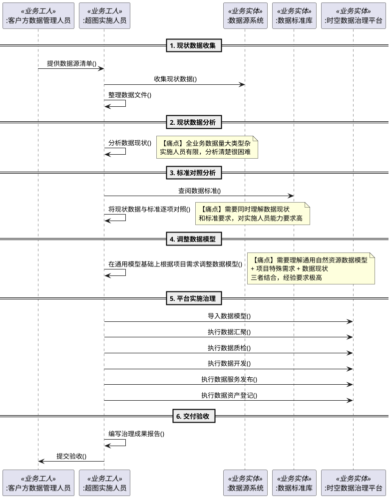

# GIS Data Agent — A-业务建模工作流成果

> 方法论：潘加宇《软件方法》ABCD 工作流
>
> 迭代：第 1 轮
>
> 日期：2026-04-06

---

## 1. 开发组织能力盘点

**开发组织**：北京超图软件股份有限公司 · 公共研发中心 · 数据中台 PDT（约 20 人）

| 能力 | 等级 | 说明 |
|------|------|------|
| AI Coding 实践 | **卓越**（公司内部） | 超图最早全面推进 AI Coding 的团队，举办了集团首个部门级 AI Coding 比赛 |
| AI Agent 工程 | **普通** | 入门阶段，落后于公司内部平台产品线（AgentX Server）及通用 Agent 平台（Dify/Coze 等） |
| GIS 二次开发 | **优秀** | 基于 iObjects + 开源栈（GeoPandas/PySAL/Rasterio），略强于内部其他 PDT 和外部集成商 |
| 时空数据治理产品积累 | **卓越**（行业内） | 已有时空数据治理平台在约 40 个项目中落地，具备完备的元数据管理体系 |
| 行业业务理解 | **普通** | 纯产品研发团队，无专职行业业务专家（自然资源、水利等领域业务理解依赖自建数产品线） |

### 核心竞争壁垒

**以数据为中心的定位 + 已有元数据管理体系**，与公司内部其他团队形成差异化：

| 团队 | 中心思维 | 短板 |
|------|---------|------|
| 平台产品线（AgentX Server） | 以 GIS 算法工具为中心 | 不能对接数据源 |
| 自建数大模型团队 | 以业务应用为中心 | 数据变化则需重新开发 API |
| **数据中台 PDT（GIS Data Agent）** | **以数据为中心** | **已有元数据管理体系做底座** |

---

## 2. 组织关系链

```
公共研发中心（数据中台PDT）──做产品──→ 自建数产品线 ──做项目──→ 最终客户
                                         ↑                        ↑
                                    技术支持                   大区驻场实施
```

- 开发组织（O1）：公共研发中心 · 数据中台 PDT
- 目标组织（O2）的两条通路：
  - 通路 1：自建数产品线 → 大区 → 客户（产品线做项目交付）
  - 通路 2：直接面向最终客户推广（集团允许，业绩复算）

---

## 3. 目标组织定位（爆炸法推导过程）

### 3.1 候选方向

| 方向 | 目标组织规格 | 评估 |
|------|------------|------|
| A. 自建数产品线技术支持团队 | 内部客户 | 不是最终价值判断者 |
| B. 大区实施团队 | 内部客户 | 同上 |
| C. 上海测绘院 | 主动提出智能体需求 | 有愿望，但无痛苦（项目尚未开始） |
| **D. 山西省测绘院** | **项目已启动一年多，推进困难** | **有真实痛苦，急需解决** |

### 3.2 上海 vs 山西的关键对比

| 维度 | 上海测绘院 | 山西省测绘院 |
|------|-----------|------------|
| 需求状态 | 提出"想做智能体"（愿望） | 项目做了一年多做不动（痛苦） |
| 用了产品吗 | 还没有 | 已在使用时空数据治理平台 |
| 痛苦程度 | 未知 | 极高（进展不如人意，各方有压力） |
| 验证价值 | 证明概念可行 | **证明智能化能救活一个快失败的项目** |

### 3.3 山西项目困境根因分析

- 客户把数据治理目标设定过大（全域全业务数据）
- 超图给了客户过高预期，自身实施能力不充分
- 总工的反馈：超图投入不够
- 总工的期望：既要全局顶层设计，也需要亮点，更需要实际解决问题

### 3.4 定位结果

- **目标组织规格**：已启动大规模时空数据治理项目但推进困难的省级测绘/自然资源机构
- **目标组织**：山西省测绘院（代表山西省自然资源厅）
- **目标组织负责人**：山西省测绘院总工

---

## 4. 愿景定稿

| 项 | 值 |
|---|---|
| **系统** | GIS Data Agent（时空数据智能体平台） |
| **目标组织规格** | 已启动大规模时空数据治理项目但推进困难的省级测绘/自然资源机构 |
| **目标组织** | 山西省测绘院（代表山西省自然资源厅） |
| **目标组织负责人** | 山西省测绘院总工 |
| **愿景** | 在不大幅增加超图投入的前提下，让停滞的数据治理项目能跑通具体场景并产出可验收的成果 |
| **度量指标** | 单个数据治理场景从启动到可验收交付的周期（人天） |

---

## 5. 现状业务流程建模

### 5.1 业务序列图（PlantUML）



### 5.2 痛点定位

```
步骤 1-4（数据收集 → 现状分析 → 标准对照 → 模型调整）
  → 零平台支持，纯人脑作业
  → 对实施人员能力要求极高，而实施人员能力普遍不足
  → ★ 项目卡在这里 ★

步骤 5-6（平台操作 → 交付验收）
  → 有平台支持但人用不好
  → 根因：步骤 1-4 没做清楚就进入步骤 5，导致盲目操作
```

### 5.3 GIS Data Agent 的改进方向

用 AI 填补步骤 1-4 的真空，让能力一般的实施人员也能完成数据现状分析和治理方案制定：

| 步骤 | 当前（纯人脑） | GIS Data Agent 能做的 |
|------|--------------|---------------------|
| 1. 数据收集 | 实施人员手动整理文件 | 自动扫描数据源、识别格式、生成数据清单 |
| 2. 现状分析 | 实施人员人肉看数据 | 自动做数据画像（字段分布、空值率、坐标系、几何类型、质量评分） |
| 3. 标准对照 | 人工逐项对照 | 自动将数据现状与标准进行语义匹配，生成差距报告 |
| 4. 模型调整 | 靠经验在通用模型上改 | 基于数据现状和标准差距，推荐模型调整方案 |

**核心竞争壁垒**：已有的元数据管理体系 + 40 个项目的数据治理经验 + 以数据为中心的架构定位。其他团队（AgentX Server 不接数据源、自建数大模型团队以业务应用为中心）均不具备这个基础。

---

## 6. 与之前 PRD 定位的对比

| 维度 | PRD 中的定位 | A-业务建模推导出的定位 |
|------|------------|---------------------|
| 目标用户 | 非 GIS 背景的数据分析师 | 超图实施人员 + 客户方数据管理人员 |
| 核心场景 | 上传 Excel，自然语言做空间分析 | 拿到一堆数据，搞清现状，对照标准，制定治理方案 |
| 竞争壁垒 | AI Coding 能力 | 40 个项目 + 元数据管理体系 |
| 产品价值 | 让不会 GIS 的人做分析 | 让能力不足的实施人员也能交付数据治理项目 |
| 第一个验证场景 | 假想的用户演示 | 山西一个真实的、正在痛苦中的项目 |

---

*A-业务建模 迭代 1 完成。下一步进入 B-需求工作流。*
