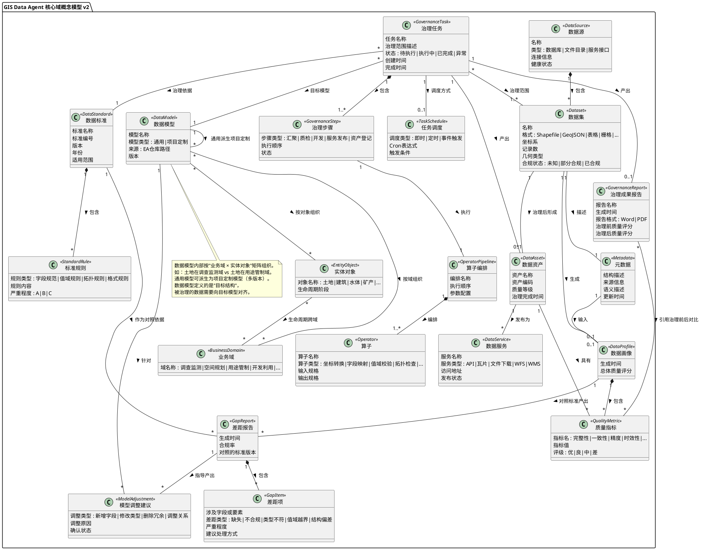

# GIS Data Agent — C-分析工作流成果

> 方法论：潘加宇《软件方法》ABCD 工作流
>
> 迭代：第 1 轮
>
> 日期：2026-04-06
>
> 前置输入：A-业务建模迭代 1 + B-需求迭代 1

---

## 1. C-分析的目标

提炼 GIS Data Agent 需要封装的**核心域机制**——独立于实现技术的领域概念和它们之间的关系。这张概念模型是系统设计（D 工作流）的约束基准：**所有数据库表、API、代码模块都应该能在这张图上找到对应的领域概念，不允许出现"孤儿表"或"概念重叠"。**

---

## 2. 核心域概念清单（21 个）

| 层 | 概念 | 英文标识 | 说明 |
|---|------|---------|------|
| **数据来源** | 数据源 | DataSource | 被治理数据的来源（数据库、文件目录、服务接口） |
| | 数据集 | Dataset | 从数据源中识别出的具体数据单元（一张表、一个文件集） |
| | 元数据 | Metadata | 描述数据集的结构、来源、语义等信息 |
| **数据认知** | 数据画像 | DataProfile | 对数据集的自动体检结果 |
| | 质量指标 | QualityMetric | 衡量数据质量的度量（完整性、一致性、精度、时效性等） |
| **标准与模型** | 数据标准 | DataStandard | 治理的依据和标尺（国标、行标、地标） |
| | 标准规则 | StandardRule | 数据标准中的具体条目（字段规范、值域规则、拓扑规则） |
| | 数据模型 | DataModel | 数据的目标结构定义，按"业务域 × 实体对象"矩阵组织 |
| | 业务域 | BusinessDomain | 数据模型的组织维度之一（调查监测、空间规划、用途管制、开发利用…） |
| | 实体对象 | EntityObject | 数据模型的组织维度之二（土地、建筑、水体、矿产…），生命周期跨多个业务域 |
| **分析** | 差距报告 | GapReport | 数据现状与标准的对照结果 |
| | 差距项 | GapItem | 差距报告中的具体条目（缺失、不合规、类型不符等） |
| | 模型调整建议 | ModelAdjustment | 基于差距分析对数据模型提出的修改建议 |
| **治理执行** | 治理任务 | GovernanceTask | 一次数据治理工作（范围可大可小：一张表到上百张表） |
| | 治理步骤 | GovernanceStep | 治理任务中的具体环节（汇聚、质检、开发、服务发布、资产登记） |
| | 算子 | Operator | 治理中的原子操作（坐标转换、字段映射、值域校验、拓扑检查…） |
| | 算子编排 | OperatorPipeline | 多个算子按逻辑组合成的处理流水线 |
| | 任务调度 | TaskSchedule | 控制治理任务的执行时机（即时、定时、事件触发） |
| **治理产出** | 数据资产 | DataAsset | 数据集经过治理后形成的成果，与数据集是两个不同的概念 |
| | 治理成果报告 | GovernanceReport | 可用于项目验收的交付文档 |
| | 数据服务 | DataService | 数据资产以 API/瓦片/文件/WFS/WMS 等形式对外发布 |

---

## 3. 核心域类图（PlantUML）



---

## 4. 概念逻辑链

**数据源**中包含**数据集**，数据集有**元数据**描述其结构和来源。对数据集做体检生成**数据画像**（含多项**质量指标**）。画像与**数据标准**（含**标准规则**）对照产出**差距报告**（含**差距项**）。差距报告指导在**数据模型**（按**业务域** × **实体对象**矩阵组织，通用→项目定制多版本派生）上产生**模型调整建议**。操作人员确认后创建**治理任务**，任务按**治理步骤**执行，每个步骤通过**算子编排**调用具体**算子**，任务可配置**任务调度**。治理完成后数据集形成**数据资产**，资产可发布为**数据服务**，同时产出**治理成果报告**。

```
数据源 → 数据集 → 元数据
                → 数据画像 → 质量指标
                               ↓ (对照)
                          数据标准 → 标准规则
                               ↓
                          差距报告 → 差距项
                               ↓ (指导)
                          数据模型 ← 业务域 × 实体对象
                               ↓       (矩阵组织)
                          模型调整建议
                               ↓ (确认后)
                          治理任务 → 治理步骤 → 算子编排 → 算子
                               ↓       ↑
                          任务调度    (可配置)
                               ↓
                    ┌──────────┼──────────┐
                    ↓          ↓          ↓
                数据资产   治理成果报告  质量指标(前后对比)
                    ↓
                数据服务
```

---

## 5. 用类图审视现有代码

### 5.1 现有 DB 表与核心域概念的映射

以下对照 `data_agent/migrations/` 中的 52 个 migration 文件，检查哪些表能映射到核心域概念，哪些是孤儿。

| 核心域概念 | 现有 DB 表 | 映射状态 |
|-----------|-----------|---------|
| 数据源 DataSource | agent_virtual_sources | **部分对应** — 虚拟数据源，但概念偏实现（连接器类型） |
| 数据集 Dataset | agent_data_catalog / agent_data_assets | **冲突** — TD-001，两张表表达同一概念 |
| 元数据 Metadata | agent_metadata_schemas (migration 044) | **部分对应** — 结构定义有，但语义描述不完整 |
| 数据画像 DataProfile | 无专用表 | **缺失** — 画像结果散落在代码中，未持久化 |
| 质量指标 QualityMetric | 无专用表 | **缺失** — 质检结果在治理步骤的输出中，未独立建模 |
| 数据标准 DataStandard | agent_standard_registry (migration 033) | **基本对应** |
| 标准规则 StandardRule | YAML 文件 (defect_taxonomy.yaml) | **不在 DB 中** — 仅文件形式，未结构化入库 |
| 数据模型 DataModel | 无表 — 依赖 EA 在线仓库 | **外部系统** — 需要接口对接 |
| 业务域 BusinessDomain | 无表 | **缺失** — 仅存在于 EA 仓库中的模型结构 |
| 实体对象 EntityObject | 无表 | **缺失** — 同上 |
| 差距报告 GapReport | 无表 | **缺失** — 标准对照分析是新增能力 |
| 差距项 GapItem | 无表 | **缺失** |
| 模型调整建议 ModelAdjustment | 无表 | **缺失** |
| 治理任务 GovernanceTask | agent_workflows | **偏差** — workflows 是通用工作流，非专用治理任务 |
| 治理步骤 GovernanceStep | agent_workflow_runs 中的 steps JSONB | **弱对应** — 步骤信息嵌在 JSONB 中，非独立实体 |
| 算子 Operator | toolsets/ 中的工具函数 | **代码态** — 未作为可管理的领域实体 |
| 算子编排 OperatorPipeline | workflow_engine.py 中的 steps 配置 | **代码态** — 同上 |
| 任务调度 TaskSchedule | agent_workflows.cron_schedule 字段 | **部分对应** — 仅 cron，缺事件触发 |
| 数据资产 DataAsset | agent_data_assets (migration 044/048) | **对应** — TD-001 修复后的统一表 |
| 治理成果报告 GovernanceReport | 无表 | **缺失** — 报告生成是新增能力 |
| 数据服务 DataService | agent_semantic_sources | **偏差** — 语义数据源，非治理后的服务发布 |

### 5.2 审视结论

| 状态 | 数量 | 概念列表 |
|------|------|---------|
| **对应良好** | 3 | 数据标准、数据资产、任务调度(部分) |
| **部分对应/有偏差** | 5 | 数据源、数据集(TD-001)、元数据、治理任务、数据服务 |
| **完全缺失** | 10 | 数据画像、质量指标、标准规则(仅YAML)、差距报告、差距项、模型调整建议、治理步骤(独立)、算子、算子编排、治理成果报告 |
| **外部系统** | 3 | 数据模型、业务域、实体对象（在 EA 仓库中） |

**核心发现：21 个核心域概念中，只有 3 个在 DB 中有良好对应，10 个完全缺失。**

这验证了复盘文章中的判断——现有的 52 个 migration 是从功能需求一一映射出来的（每加一个功能就补一张表），而不是从领域模型推导出来的。缺失的 10 个概念恰好集中在**步骤 1-4（数据感知→标准对照→模型推荐）**，正是 A 工作流中定位的"真空地带"。

### 5.3 现有代码中的"孤儿表"

以下表在 52 个 migration 中存在，但在核心域类图中找不到对应概念：

| 现有表 | 原始用途 | 建议 |
|--------|---------|------|
| agent_memories | 用户记忆（PRD 中的空间记忆功能） | 与当前愿景无关，P2 或更后 |
| agent_share_links | 结果分享链接 | 与当前愿景无关 |
| agent_knowledge_* | 知识图谱 / 知识库 | 可能用于领域知识辅助，但不是核心域概念 |
| agent_custom_skills | 自定义技能 | 平台扩展能力，不属于数据治理核心域 |
| agent_user_tools | 用户自定义工具 | 同上 |
| agent_skill_bundles | 技能包 | 同上 |
| agent_mcp_servers | MCP 服务注册 | 基础设施层，不属于核心域 |
| agent_eval_* | 评估框架 | 平台能力，不属于核心域 |
| agent_prompt_versions | 提示词版本管理 | 基础设施层 |

这些表不是"错误"，但它们属于**平台基础设施**或**PRD 中面向通用用户的功能**，而不是数据治理核心域。在产品聚焦阶段，这些可以作为第三层优先级保留，不投入新的研发精力。

---

## 6. 核心域概念对 CLAUDE.md 的约束建议

以下内容建议加入 CLAUDE.md，作为 AI 编码时的 C 层约束：

```markdown
## 核心域概念约束（C-分析层）

GIS Data Agent 的核心域包含 21 个概念，分为 6 层。所有新增的
DB 表、API 端点、Toolset 都必须能在核心域类图中找到对应概念。

### 概念-表映射规则
- 一个核心域概念对应且仅对应一张主表（聚合根）或一组明确的从表
- 不允许出现表达同一领域概念的两张表并存（TD-001 教训）
- 新增表之前必须先回答：这张表对应哪个核心域概念？

### 概念间关系规则
- 数据集和数据资产是两个不同的概念，不可混为一张表
- 数据模型的目标结构定义存放在 EA 仓库，系统通过接口读取
- 质量指标被数据画像和治理成果报告共同引用，应独立建模
- 算子是可管理的领域实体，不仅仅是代码中的工具函数

### 新增功能的 C 层检查清单
1. 这个功能涉及哪个核心域概念？
2. 该概念在 DB 中已有对应表吗？
3. 如果需要新建表，它和已有表的关系是什么？
4. 新建的 Toolset/API 是按领域概念组织还是按技术活动组织？
```

---

## 7. 下一步行动建议

### 7.1 优先补建的 DB 表（对应 P0 用例）

| 核心域概念 | 建议表名 | 对应用例 | 优先级 |
|-----------|---------|---------|--------|
| 差距报告 + 差距项 | agent_gap_reports / agent_gap_items | UC-04 标准对照 → UC-05 模型推荐 | **P0** |
| 治理成果报告 | agent_governance_reports | UC-07 生成报告 | **P0** |
| 数据画像 + 质量指标 | agent_data_profiles / agent_quality_metrics | UC-02 数据画像 | **P1** |
| 算子 + 算子编排 | agent_operators / agent_operator_pipelines | UC-06 执行治理 | **P1** |

### 7.2 需要重构的已有表

| 现有表 | 问题 | 建议 |
|--------|------|------|
| agent_data_catalog | TD-001 遗留，与 agent_data_assets 重叠 | 确认 migration 048 的统一是否彻底，彻底清除旧表引用 |
| agent_workflows | 通用工作流，未区分治理任务 | 评估是否需要专用的 agent_governance_tasks 表，或通过 type 字段区分 |
| agent_semantic_sources | 偏语义注册，非数据服务 | 评估是否需要独立的 agent_data_services 表 |

### 7.3 进入 D-设计时的指导原则

- 所有新模块（Toolset、API、DB 表）的命名和组织**按核心域概念分层**，不按技术活动分
- CLAUDE.md 中加入核心域约束，让 AI 编码时有 C 层参照
- 每个版本结束时做 C 层一致性检查

---

*C-分析 迭代 1 完成。21 个核心域概念 + 类图 + 现有代码审视 + 约束规则。*
