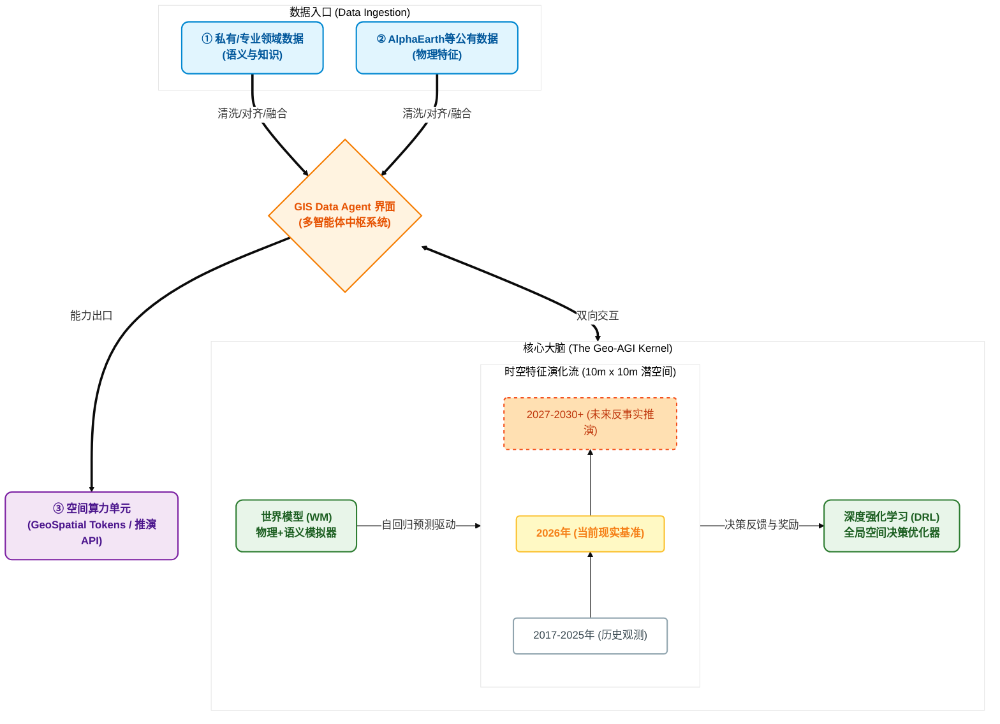

# 融资商业计划书 (Pitch Deck Narrative)
**项目名称**：GIS Data Agent —— 物理与语义融合的地理空间通用人工智能 (Geo-AGI)
**核心定位**：基于“世界模型 + 深度强化学习 (DRL)”的新一代空间决策引擎
**目标受众**：全球顶级 VC（如 Sequoia, a16z, Founders Fund 等投看重底层技术与 Paradigm Shift 的基金）

---

## 1. 核心引言 (The Hook & Vision)

**“传统的 GIS 只能告诉你世界‘现在’长什么样，而我们将告诉你世界‘未来’会怎样，以及你‘应该’怎么做。”**

物理世界正在以前所未有的速度发生变化（气候变暖、城市化扩张、供应链重构）。然而，人类管理地球的工具——传统的 GIS 软件——依然停留在“静态二维地图”和“手工设定规则”的石器时代。

**GIS Data Agent** 正在构建世界上第一个**地理空间通用人工智能 (Geo-AGI)**。
我们的愿景是打造一个**可计算、可推演、可优化的“活的地球数字孪生”**。

---

## 2. 技术内核：Paradigm Shift (Why it's a breakthrough)

我们不只是在做一个套壳的 LLM 应用，我们是在重构空间智能的底层逻辑。我们独创了 **“沙漏型架构（Hourglass Architecture）”**：

### 🧠 核心大脑 (The Kernel)：世界模型 (World Model) + 深度强化学习 (DRL)
*   **世界模型（理解与推演）**：我们以 Google AlphaEarth 的 64 维物理特征为底座，完美融合我们独创的“多模态社会语义特征（政务规划、POI、经济热力）”。世界模型在这一高维连续空间中自回归演化，能够进行高精度的 **反事实推演（What-if Simulation）**。*（如果在这里建一座高铁站，周边 5 年内的产业结构和地貌会发生什么变化？）*
*   **深度强化学习 DRL（决策与优化）**：在世界模型提供的“梦境模拟器”中，DRL 智能体可以在几秒钟内探索数百万种空间规划方案，从而输出**数学意义上的全局最优解**（如：最优的碳汇选址、最高效的物流中心布局、最抗洪的城市管网设计）。

### 🐙 触角与接口 (The I/O)：多智能体系统 (Multi-Agent System)
世界模型极其强大但也极其复杂，**GIS Data Agent 的多智能体系统是连接这个高维大脑与现实世界的完美接口。**
*   **Data 入口**：爬虫 Agent、政务解析 Agent、视觉 Agent 自动将无序的现实世界数据（新闻、PDF规划、遥感图）清洗、对齐并融合为高质量的“语义 Embedding”，源源不断地喂给世界模型。
*   **能力出口**：用户只需用自然语言提问，分析 Agent 会自动调用底层世界模型进行推演，并将生涩的高维张量转化为图表、BI 大屏、甚至可执行的 API 代码。**“让最高深的空间计算，变成像用 Google 搜索一样简单。”**

---

## 3. 长期护城河与竞争壁垒 (The Moat & Defensibility)

顶级投资人最看重的是“不可替代性”。如果巨头（如 Google, ESRI）明天也入局，我们的护城河绝不仅仅是短暂的“算法先发优势”，而是建立在以下五个维度的坚固壁垒：

1. **独家数据飞轮与“语义暗网” (The Semantic Data Flywheel)**
    * **壁垒所在**：大厂能通过卫星获取物理表象，但极度缺乏“微观社会语义数据”（如地方政务规划、未公开的招投标、商圈 POI 变更历史）。
    * **护城河**：我们的 Data Agent 早期疯狂积累的这些“脏数据”构成了不可复制的**“语义暗网”**。大厂能用算力碾压，但无法在短时间内重构我们沉淀多年的“政务/商业语义对齐映射表”。

2. **RLHF 与独有奖励模型 (Proprietary Reward Models for DRL)**
    * **壁垒所在**：DRL 最难的不是算法，而是“什么是最好的规划”这种缺乏标准答案的奖励函数（Reward Function）设计。
    * **护城河**：随着我们服务数十家头部地产商和规划局，系统会记录他们“采纳与拒绝”的方案，形成海量的人类反馈数据（RLHF）。训练出的**“空间规划 Reward Model”**将成为模仿者无法跨越的隐形资产。

3. **工作流垄断与高转换成本 (Workflow Stickiness & High Switching Cost)**
    * **壁垒所在**：我们不仅输出预测，更直接长在客户的业务动脉上。
    * **护城河**：Agent 结果直接对接 CAD/BIM 导入、触发内部 ERP 预算、推入 OA 审批流。一旦客户的决策工作流架设在我们的系统之上，**替换成本将是灾难性的**。

4. **成为“空间计算协议”的制定者 (Protocol & Standardization Moat)**
    * **壁垒所在**：物理空间与语义特征的融合目前尚无行业标准。
    * **护城河**：开放我们的 **GeoSpatial Token** 格式与多模态栅格对齐标准，让第三方开发者（PropTech, 农业科技）基于此构建垂直应用。我们将从一家软件公司蜕变为一个难以被颠覆的**生态系统（Ecosystem）**。

5. **极端场景的“长尾”应对能力 (The Edge-Case Engine)**
    * **壁垒所在**：通用大模型最难处理空间演变的“长尾分布”。
    * **护城河**：我们的多智能体架构（Multi-Agent）具有极强的动态灵活性。相比大厂僵化的单一模型，我们可以迅速派生出专攻“极端洪涝演变”或“乡村农田流转”的特化 Agent。

**🚀 一句话电梯游说 (Elevator Pitch)：**
> *“先发优势能为我们赢得 18 个月的时间窗口。在这期间，我们会通过 Agent 建立‘微观语义暗网’，并沉淀出全球唯一的‘空间规划 Reward Model’。当巨头醒来时，我们会从一个 AI 工具，蜕变为深度嵌入政企工作流、拥有专有数据飞轮的**空间决策基础设施**。”*

---

## 4. 万亿级市场机遇 (The TAM - Total Addressable Market)

我们正在重新定义一个万亿级市场：从“售卖 GIS 软件工具”转向**“提供 Spatial Intelligence-as-a-Service (空间智能即服务)”**。

*   **智慧城市 & 城市规划**：告别拍脑袋决策，实现基于动态仿真演算的智能国土空间规划。
*   **商业地产 & 零售选址**：超越传统的“人流分析”，实现基于商圈未来 5 年演化推演的动态估值。
*   **农业科技 & 碳资产管理**：在全球范围内进行微观地块级的产量预测、灾害模拟与碳汇优化。
*   **全球供应链 & 物流**：在气候异常和地缘政治变化下，动态重构物理仓储节点。

---

## 5. 商业模式与 GTM 战略 (Business Model & Go-to-Market)

我们正在引入一种革命性的 AI 基础设施计费模式：**Priced by GeoSpatial Tokens**。

就像 OpenAI 消耗算力来预测下一个词（Predict the next word）并按 Text Token 计费一样，我们构建了物理地球的世界模型，我们消耗算力来**预测地球的下一平方米（Predict the next square meter）**。

一个 **GeoSpatial Token** = 1个 10x10 米地块及其（物理 + 语义）高维 Embedding 状态。
我们的 API 计费公式为：**单次推演费用 = N (预测面积 Tokens) × T (时间跨度) × S (平行政策情景数) × P (单价)**。

基于此，我们采用 **PLG (Product-Led Growth)** 与 **Enterprise SaaS** 双轮驱动战略：

*   **Tier 1: 开发者 API (API-as-a-Service)**
    向全球的 PropTech、AgriTech、物流软件开发者开放“语义融合接口”与“空间推演 API”，按 **GeoSpatial Token** 调用量计费。让所有的地图应用都能一键接入我们的“大脑”。
*   **Tier 2: 企业级智能体订阅 (Enterprise Agents)**
    为政府规划部门、大型地产商、金融机构提供开箱即用的特定领域 Agent（如：违规用地审计 Agent、商圈选址 Agent）。按坐席和算力包包月/包年订阅。
*   **Tier 3: 私有化部署与定制 (On-Premise)**
    针对对数据极度敏感的国家安全机构或头部企业，提供本地化部署和专属行业的世界模型微调（Fine-tuning）服务。

---

## 6. 产品演进路线图 (Roadmap)

*   **Phase 1 (Month 1-6): 语义-物理对齐与检索 (The Ultimate Search)**
    完成 Data Agent 与 AlphaEarth 向量的深度拼接。实现支持自然语言的高维空间资产检索（如：“找出全国符合这种物理面貌且正在出台高新政策的潜力地块”）。
*   **Phase 2 (Month 6-12): 世界模型自回归推演 (Predicting the Future)**
    上线轻量级 LatentDynamicsNet，支持前向 5-10 年的地理空间动态推演及可视化，完成核心算法壁垒构建。
*   **Phase 3 (Month 12-18): DRL 决策引擎 (The Action Model)**
    引入强化学习框架，从“预测未来”迈向“改变未来”。系统能够针对特定目标（如 GDP 最大化或碳排放最小化）自动生成空间规划草案。
*   **Phase 4 (Month 18+): 空间智能体生态 (Agent Ecosystem)**
    开放生态，允许第三方开发者基于我们的“世界模型内核”创建各种垂类 GIS 智能体。

---

## 7. 融资需求与资金用途 (The Ask)

*   **本轮融资额**：[填写您的金额，如：500万 - 1000万 美元] (Seed / Series A)
*   **资金用途**：
    *   **50% 顶尖人才获取**：招募全球顶级的深度强化学习科学家、GeoAI 算法工程师以及分布式系统专家。
    *   **30% 算力与基础设施**：采购用于训练专属多模态语义对齐模型和世界模型的 GPU 算力。
    *   **20% 市场与生态扩展**：启动全球 GTM 计划，打造标杆客户案例（POC），建立开发者社区。

---

## 8. 技术论文与学术验证 (Technical Papers & Academic Validation)

我们的核心算法已通过严谨的学术同行评审验证，相关成果已整理为学术论文：

1.  **《A Transferable Deep Reinforcement Learning Framework for Farmland Spatial Layout Optimization Using Parcel-Level Scoring Policy》**
    *   **核心突破**：提出了维度无关的 `ParcelScoringPolicy` 架构，实现了在不同规模、不同地貌特征区域间的零样本（Zero-shot）模型迁移。
    *   **验证结果**：在四川/重庆丘陵地带的万级地块样本上，推理速度较传统遗传算法（GA）提升 60 倍以上，且在空间连通性优化指标上取得统计学显著优势（p < 0.01）。

2.  **《Geospatial World Modeling via Frozen Foundation Model Embeddings and Lightweight Latent Dynamics》**
    *   **核心突破**：利用 Google AlphaEarth 冻结编码器捕获物理特征，通过轻量级残差神经网络（LatentDynamicsNet）学习时空演化动力学。

---

### 结语 (Closing)
我们不仅是在开发下一代 GIS 系统，我们是在构建一个能够**理解、模拟并优化人类物理栖息地的超级大脑**。我们寻找那些有远见、相信技术可以重塑现实世界的顶尖投资人，与我们一起开启空间智能（Spatial Intelligence）的新纪元。