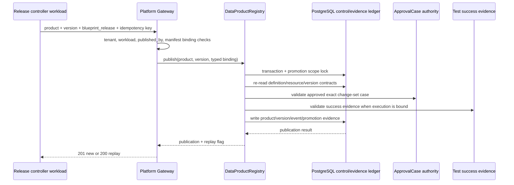

# ADR-206: Blueprint Release Publish Gateway

## Decision

Blueprint release publication is exposed through one platform gateway endpoint:

```text
POST /api/platform/v1/data-products/blueprint-releases
```

The endpoint accepts a typed `DataProductSpec`, `DataProductVersionSpec` and
`DataProductBlueprintReleaseBinding`, plus an idempotency key and publication
reason. The version manifest must contain the same `blueprint_release` binding
as the typed request. The authenticated caller must be a workload and
`version.published_by` must equal that workload identity.

The gateway performs only boundary responsibilities:

- authenticate the platform principal and require workload identity;
- enforce tenant equality and actor binding;
- parse the immutable product, version and Blueprint release contracts;
- reject a manifest/binding mismatch before side effects;
- delegate publication to `DataProductRegistry.publish()`;
- map conflict, not-found, unavailable and contract errors to stable HTTP
  responses; and
- return `201` for a new publication and `200` with `created=false` for an
  idempotent replay.



`DataProductRegistry` remains the only DataProductVersion publication
authority. ApprovalCase remains the approval authority, and the live registry
checks the exact approved change set, definition/resource hashes, quality and
test evidence before it writes product or lifecycle state. Promotion,
consumer-impact acknowledgement and rollback remain the registry's existing
authorities after publication.

The gateway does not write the control database directly, create a second
release table, infer approval from the caller, or create a parallel Blueprint
state machine. A release controller may retry the same request safely with
the same idempotency key; a key bound to different immutable content is a
conflict.

## Consequences

- The Blueprint path now has a usable HTTP boundary from review/test evidence
  to the existing product registry.
- Client code no longer needs an architecture-successor-specific publication
  service for ordinary Blueprint releases.
- The endpoint does not make AR-3 complete: production provider execution,
  CI/CD parity, model/version workbench, rollback UX and staging/production
  evidence remain separate gates.
- A caller with a valid workload identity still cannot bypass ApprovalCase or
  success-evidence checks because those checks occur inside the registry
  transaction.

## Verification

Focused route contracts cover:

- successful delegation with typed product/version/binding;
- workload-only admission and `published_by` anti-spoofing;
- manifest/binding mismatch rejection;
- tenant and registry conflict mapping; and
- idempotent replay mapping to HTTP `200` with `created=false`.

```bash
uv run pytest -q data_agent/test_platform_gateway.py \
  -k 'blueprint_release_publish or platform_gateway_routes_are_versioned_and_registered or platform_gateway_routes_are_visible_in_openapi'
```

The route tests exercise the gateway contract with a registry double. A
disposable PostgreSQL certification is still required before this slice can be
called production-verified; local route tests are not evidence of PostgreSQL,
ApprovalCase or provider availability.
