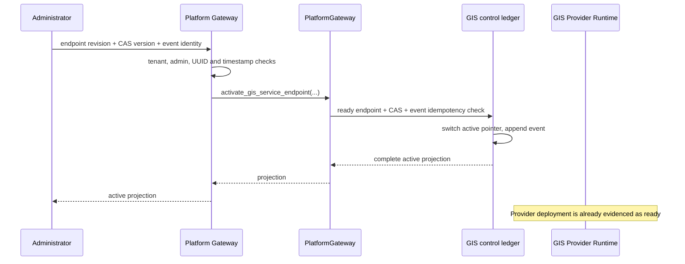

# ADR-207: GIS Service Control Plane Gateway

## Decision

Expose the active GIS service projection and the governed endpoint switch through
the versioned platform gateway:

```text
GET  /api/platform/v1/gis/services/{service_id}/control-projection
POST /api/platform/v1/gis/services/{service_id}/activation
```

`service_id` is converted by the gateway to the authenticated tenant's canonical
`gda://{tenant_id}/gis_service/{service_id}` resource URN. The read endpoint is
available to `admin` and `platform_operator` and returns the complete active
`GISServiceControlProjection`: endpoint, deployment, service definition, release,
layer, style, TMS, cache policy, service policy and MVT serving projection when
the active release contains them.

The activation endpoint is restricted to `admin`. Its immutable request binds:

```json
{
  "endpoint_revision_id": "uuid",
  "expected_state_version": 0,
  "reason": "activate the reviewed MVT endpoint",
  "idempotency_key": "gis-activation-001",
  "occurred_at": "2026-08-21T12:00:00Z"
}
```

`occurred_at` is mandatory and timezone-aware. Migration 153 includes it in the
activation event's idempotency comparison, so a retry with the same key can replay
the same immutable event rather than accidentally creating a new timestamped
request. The gateway forwards the complete contract with the authenticated actor
to `PlatformGateway.activate_gis_service_endpoint()`.

The existing PostgreSQL recorder remains the authority for all stateful checks:

- tenant RLS and service ownership;
- optimistic CAS on `endpoint_state_version`;
- endpoint ownership and a `ready` deployment;
- monotonic activation time;
- append-only activation event and idempotency-content comparison; and
- loading the post-switch active projection in the same transaction.



## Consequences

Operations clients have a single HTTP entry point to inspect the exact active
service state and perform a reviewable pointer switch. A caller cannot select a
different tenant by supplying a service URN, because the gateway builds it from
the authenticated tenant and the path identifier.

Deployment, provider readiness probing, approval admission, cache warmup,
provider-side activation, rollback orchestration and service SLO/incident handling
remain separate AR-4 commands. This endpoint changes only GDA's active endpoint
pointer after the pre-existing database readiness gate succeeds; it does not claim
that a provider deployment was created or externally activated by the request.

## Verification

Route contracts cover authentication, platform-role admission, administrator-only
activation, canonical service IDs, tenant-bound delegation, request validation,
CAS conflict mapping and OpenAPI registration. The Gateway and migration retain
the existing PostgreSQL certification for ready-deployment, RLS, CAS, immutable
event and cross-tenant behavior.

```bash
uv run pytest -q data_agent/test_platform_gis_service_control_routes.py
uv run pytest -q data_agent/test_gis_service_control_plane.py \
  data_agent/test_platform_gis_mvt_route.py
```
