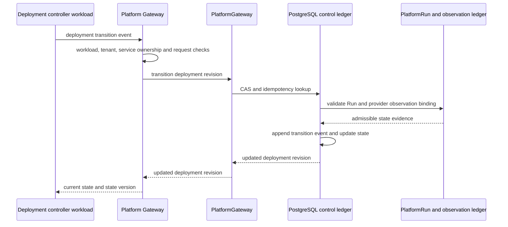

# ADR-208: GIS Service Deployment Transition Gateway

## Context

`ServiceDeploymentRevision` already has a governed PostgreSQL state machine:

```text
planned -> deploying -> ready | failed
```

Each deployment is bound to one `PlatformRun`, one immutable provider placement,
and one `ServiceReleaseBinding`. A terminal transition requires a provider
observation from that same Run, whose evidence names the exact deployment revision,
provider deployment ID and provider revision reference. `ready` additionally
requires a succeeded Run and a success-like observation; `failed` requires an
appropriate terminal Run and failure-like observation.

Without a platform API, callers would either need direct internal Python access or
would treat endpoint activation as an implicit deployment command. Neither gives
operations clients a complete, observable service lifecycle.

## Decision

Expose deployment inspection and state transition through the versioned platform
gateway:

```text
GET  /api/platform/v1/gis/services/{service_id}/deployments/{deployment_revision_id}
POST /api/platform/v1/gis/services/{service_id}/deployments/{deployment_revision_id}/transitions
```

Both routes construct the service URN from the authenticated tenant and path
`service_id`. They load the deployment and its service definition before returning
or transitioning it, so an existing UUID belonging to another GIS service is
reported as not found within this service path.

The transition route requires a workload identity. Its event identity is explicit:

```json
{
  "expected_state_version": 1,
  "to_state": "ready",
  "provider_observation_id": "uuid",
  "reason": "Martin readiness and contract evidence passed",
  "idempotency_key": "districts-r1-ready",
  "occurred_at": "2026-08-21T12:30:00Z"
}
```

`deploying` forbids a provider observation; `ready` and `failed` require one. The
route rejects a transition back to `planned`, normalizes a timezone-aware
`occurred_at`, and delegates to
`PlatformGateway.transition_service_deployment_revision()`. Migration 153 remains
the sole state authority for CAS, event replay, Run and observation evidence,
transition legality, RLS and immutable event persistence.

| Option | Result |
|---|---|
| Let Provider Runtime switch the active endpoint | Rejected: deployment state, endpoint routing and rollback pointer would be coupled to one provider implementation. |
| Let an administrator submit arbitrary deployment state | Rejected: an operator identity does not establish Run-bound provider evidence. |
| Workload transition route plus ledger verification | Chosen: the deployment controller submits observed lifecycle events, while the ledger proves their admissibility. |



## Consequences

The service control plane can now expose a revision from its initial `planned`
state, record the provider controller's `deploying` acknowledgement, and accept a
Run-bound `ready` or `failed` result before any endpoint activation is attempted.
The returned revision gives clients the current state, state version, terminal
observation and timestamps required to coordinate the next command.

This route does not call Martin, GeoServer, TiTiler, ArcGIS, SuperMap or any other
provider. It does not create a deployment, submit a `PlatformRun`, collect health
evidence, approve publication, create an endpoint, warm a cache, activate an
endpoint or orchestrate rollback. Those remain distinct commands so deployment
execution and evidence collection can be retried and reconciled independently.

## Verification

Route contracts cover authenticated service ownership, UUID validation, workload
identity, transition payload shapes, delegation of the full event identity, CAS
conflict mapping and the absence of a Martin provider invocation. Existing
GIS-control-plane tests and PostgreSQL certification cover state-machine, Run,
observation, RLS and immutable-event behavior.

```bash
uv run pytest -q data_agent/test_platform_gis_service_control_routes.py \
  data_agent/test_gis_service_control_plane.py \
  data_agent/test_platform_gis_mvt_route.py
```
