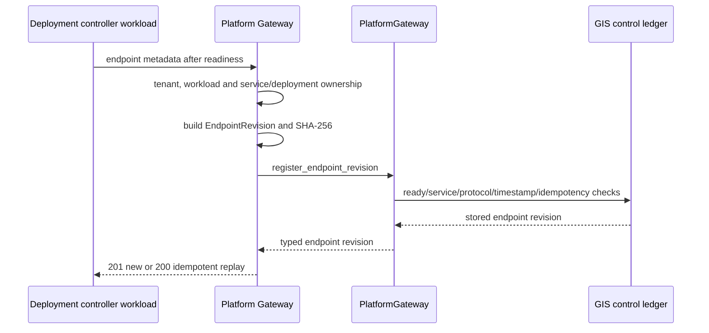

# ADR-209: GIS Service Endpoint Registration Gateway

## Context

A `ServiceDeploymentRevision` reaches `ready` only after the control ledger has
verified its `PlatformRun` and provider observation. The existing endpoint recorder
then accepts an immutable `EndpointRevision` only when it belongs to that exact
ready deployment and its GIS service. It also checks protocol compatibility,
credential-free HTTPS endpoint URI and creation time after readiness.

Endpoint activation was already available as a separate administrator action, but
there was no API for a deployment controller to register the endpoint revision that
activation consumes. That leaves a gap between deployment evidence and the active
pointer while inviting clients to bypass the platform boundary.

## Decision

Expose one workload-only endpoint registration route:

```text
POST /api/platform/v1/gis/services/{service_id}/deployments/{deployment_revision_id}/endpoints
```

The request contains only endpoint-specific immutable metadata:

```json
{
  "endpoint_revision_id": "uuid",
  "endpoint_protocol": "mvt",
  "endpoint_uri": "https://martin.internal.example/district-features",
  "endpoint_contract": {"schema": "gda.mvt_endpoint.v1"},
  "created_at": "2026-08-21T12:35:00Z"
}
```

The Gateway supplies the authoritative tenant, service URN, deployment revision,
workload identity and endpoint SHA-256. It first confirms that the path deployment
belongs to the path service, then constructs `EndpointRevision` and delegates to
`PlatformGateway.register_endpoint_revision()`.

Migration 153 remains responsible for storage-side checks and persistence:

- tenant RLS and deployment existence;
- ready deployment and matching service;
- endpoint timestamp after deployment readiness;
- service-type/protocol compatibility;
- immutable UUID/content idempotency; and
- append-only endpoint registration.



## Consequences

The service lifecycle now has a controlled API path from a ready deployment to a
typed endpoint revision, and activation can consume only that recorded revision.
Callers cannot supply a different tenant, service URN, deployment ID, creator or
checksum in the request body.

This route registers metadata only. It does not make the provider publicly
reachable, change the active endpoint pointer, perform a health probe, authorize a
release, warm or purge cache, or perform rollback. Those operations remain
independent so their evidence and retry behavior cannot be conflated with immutable
endpoint identity.

## Verification

Route tests cover workload-only admission, server-owned identity fields, endpoint
URI contract validation, ready-gate conflict mapping, absence of provider calls and
OpenAPI registration. The existing PostgreSQL certification continues to cover the
ready-deployment recorder condition, RLS and endpoint immutability.

```bash
uv run pytest -q data_agent/test_platform_gis_service_control_routes.py \
  data_agent/test_gis_service_control_plane.py \
  data_agent/test_platform_gis_mvt_route.py
```
