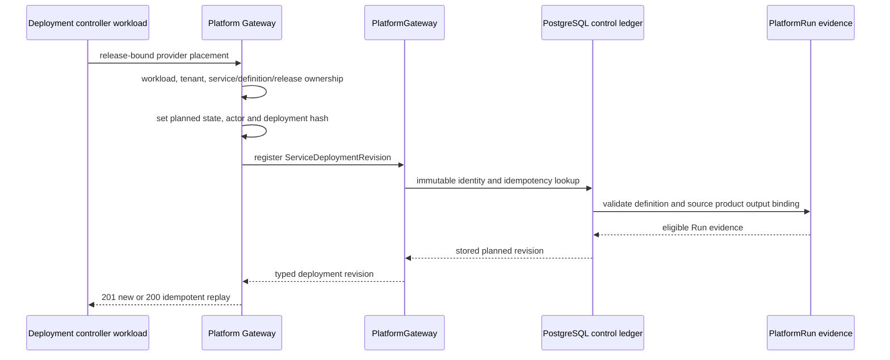

# ADR-210: GIS Service Deployment Registration Gateway

## Context

The GIS control ledger already persists an immutable `ServiceDeploymentRevision`.
Its identity binds one GIS service definition, one complete service release, one
`PlatformRun`, one provider placement and a configuration fingerprint. Migration
154 verifies that the release belongs to the definition, that the Run is for the
same definition and admits an eligible state, and that the Run contains the source
`DataProductVersion` output `ResourceVersion` required by the service definition.

The previously exposed APIs could inspect a deployment, record its state
transitions and register an endpoint after readiness. There was no HTTP entry point
to create the initial planned revision. A controller consequently had no governed
way to establish the release-bound identity that all later transition and endpoint
evidence depends on.

## Decision

Expose a workload-only deployment-registration route:

```text
POST /api/platform/v1/gis/services/{service_id}/deployments
```

The request supplies the immutable deployment placement and its existing Run:

```json
{
  "deployment_revision_id": "uuid",
  "service_definition_version_id": "uuid",
  "service_release_binding_id": "uuid",
  "run_id": "uuid",
  "revision_key": "r1",
  "provider_system": "martin",
  "provider_namespace": "gda-services",
  "provider_deployment_id": "district-features-r1",
  "provider_revision_ref": "sha256:...",
  "config_sha256": "sha256 hex",
  "created_at": "2026-08-21T12:20:00Z"
}
```

The Gateway resolves the service URN from the authenticated tenant and the path,
loads the definition and release, and verifies that both belong to that service. It
then constructs `ServiceDeploymentRevision` with fixed `planned` state and state
version `0`, authenticated actor identity and a server-computed deployment hash.
The existing `PlatformGateway.register_service_deployment_revision()` and migration
154 remain the only writers and final admission authority.

| Option | Result |
|---|---|
| Add a provider-specific deploy endpoint | Rejected: it would couple service identity to one provider and blur provider execution with control-plane registration. |
| Allow clients to write a planned deployment directly | Rejected: tenant, actor, service identity and immutable fingerprint could be forged or drift independently. |
| Workload registration plus ledger admission | Chosen: the controller declares a placement, while the ledger proves its release and Run evidence. |



## Consequences

The control-plane HTTP chain is now explicit:

```text
register planned deployment -> record provider transitions -> register ready endpoint -> activate pointer
```

Each step has separate immutable evidence and a narrow actor boundary. A caller
cannot substitute a tenant, service URN, creator, lifecycle state/version or
deployment checksum in the request.

Registration records intended placement only. It does not create a `PlatformRun`,
submit a provider deployment, invoke Martin or another GIS provider, approve a
release, collect readiness evidence, register an endpoint, warm a cache, switch the
active endpoint or roll back a service. Provider command dispatch, health/reconcile
receipts, approval admission, warmup, atomic switch and rollback orchestration
remain separate AR-4 work so failures can be retried and audited independently.

## Verification

Route contracts cover workload-only admission, path/service/release ownership,
server-owned actor and fingerprint fields, Run-evidence conflict mapping, the
absence of provider calls and OpenAPI registration. The existing migration tests
and PostgreSQL certification cover Run/release/product-output evidence, RLS,
immutable UUID/content idempotency and recorder-only writes.

```bash
uv run pytest -q data_agent/test_platform_gis_service_control_routes.py \\
  data_agent/test_gis_service_control_plane.py \\
  data_agent/test_platform_gis_mvt_route.py \\
  data_agent/test_platform_gateway.py \\
  data_agent/test_gis_service_control_plane_postgres.py
```
