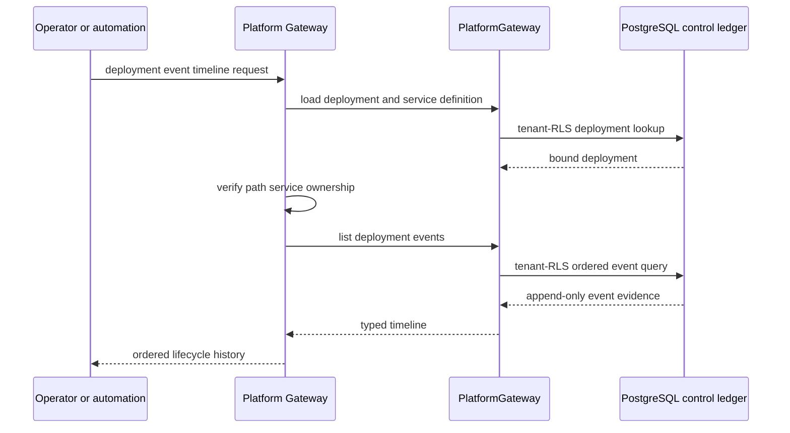

# ADR-211: GIS Service Deployment Event Timeline

## Context

`service_deployment_event` is already the append-only evidence ledger for every
`ServiceDeploymentRevision`. It records sequence number, state edge, workload
actor, reason, idempotency key, provider observation reference, occurrence time
and database-computed event digest. PostgreSQL enforces tenant RLS, a constrained
state machine and immutable events.

The Gateway could return a deployment's current state, but it could not return the
evidence timeline that explains how it reached that state. Operations clients would
therefore have to inspect database tables directly or infer history from the current
revision, neither of which is a governed platform interface.

## Decision

Expose a tenant- and service-bound read route:

```text
GET /api/platform/v1/gis/services/{service_id}/deployments/{deployment_revision_id}/events
```

The Gateway first loads the deployment and its GIS service definition, using the
authenticated tenant and path service identifier. A deployment belonging to another
service is reported as absent within this service path. It then calls
`PlatformGateway.list_service_deployment_events()` and returns events ordered by
their immutable sequence number.

The typed response carries the persisted identity and evidence fields:

```text
event_id, deployment_revision_id, sequence_no, from_state, to_state,
provider_observation_id, actor_subject, reason, idempotency_key,
event_sha256, occurred_at
```

| Option | Result |
|---|---|
| Derive lifecycle history from `ServiceDeploymentRevision` | Rejected: current state loses actor, reason, idempotency and provider-evidence history. |
| Let operations clients query control tables | Rejected: it bypasses Gateway ownership checks and spreads RLS/data-shape assumptions. |
| Gateway read projection over the existing event ledger | Chosen: exposes the existing evidence without adding a second audit store or lifecycle authority. |



## Consequences

The platform now exposes the complete recorded transition trail for a deployment:
initial `planned`, controller `deploying`, and any terminal `ready` or `failed`
event with its provider observation reference. This gives Operate, API, SDK and
future UI projections an auditable state explanation without granting direct
database access.

This route is read-only. It does not make an event valid, compute a new digest,
execute a deployment, contact a provider, probe health, modify active routing,
approve a release, warm or purge cache, or create ServiceSLO/Incident evidence.
Those remain separate lifecycle actions and must not be inferred from a visible
event timeline.

## Verification

Tests cover the typed transition state machine, tenant/service ownership before the
event query, ordered response projection and OpenAPI registration. Existing
PostgreSQL control-plane tests continue to cover RLS, append-only table guards,
sequence constraints, CAS transitions and provider-observation evidence.

```bash
uv run pytest -q data_agent/test_gis_service_control_plane.py \\
  data_agent/test_platform_gis_service_control_routes.py \\
  data_agent/test_platform_gateway.py \\
  data_agent/test_gis_service_control_plane_postgres.py
```
