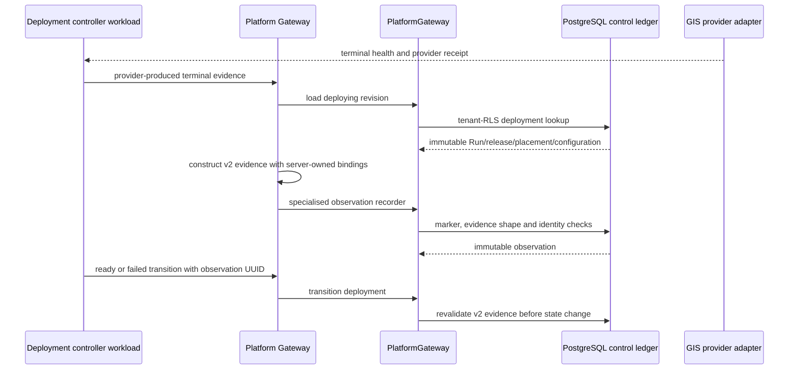

# ADR-212: GIS Service Deployment Readiness Evidence

## Context

`ServiceDeploymentRevision` can move from `deploying` to `ready` or `failed`
only with a `FrameworkAttemptObservation` from its `PlatformRun`. The original
transition check bound the deployment UUID and provider deployment/revision
references. The generic observation route, however, accepts arbitrary evidence
payloads. That left too much of the release identity implicit: a terminal
observation could omit the service definition, release binding, provider namespace,
configuration fingerprint, endpoint identity or concrete provider health receipt.

The Martin adapter already proves health and can produce a generic observation, but
it did not produce the immutable deployment identity that the control-plane ledger
needs to validate a real readiness result.

## Decision

Keep `framework_attempt_observation` as the sole provider evidence store. Add a
release-bound terminal evidence profile and recorder instead of a separate GIS
health table:

```text
POST /api/platform/v1/gis/services/{service_id}/deployments/{deployment_revision_id}/observations
```

The route is workload-only. Its request contains only provider-produced fields:
attempt number, framework kind, terminal state, provider version, credential-free
HTTPS endpoint, health-evidence hash, provider receipt and occurrence time. The
Gateway loads the path deployment first, then supplies every ownership field:

```text
tenant, PlatformRun, service definition, service release, provider system,
provider namespace, provider deployment ID, provider revision ref, config SHA-256
```

`PlatformGateway.record_gis_service_deployment_observation()` permits recording
only while the deployment is `deploying`, after that transition's timestamp. It
requires the external observation identity and all v2 evidence values to exactly
match the immutable deployment. It preserves the normal observation UUID/content
idempotency behavior.

Migration 207 adds two database controls:

1. A trigger rejects v2 GIS deployment evidence unless the specialised recorder's
   transaction marker is present and the terminal evidence shape is complete.
2. The replacement deployment transition function requires v2 evidence and again
   verifies Run, definition, release, provider system/placement/revision and
   configuration fields before changing state.

The Martin adapter now has `build_deployment_ready_observation()` and
`build_deployment_failed_observation()`. They create the same v2 contract from a
release context, deployment revision, HTTPS endpoint, concrete health result and
provider receipt. The failed path retains a non-200 health response as evidence;
a transport failure alone is not relabelled as a provider terminal result. The
adapter remains read-only: no provider deploy command or active pointer operation
is introduced.

| Option | Result |
|---|---|
| Accept generic observations as readiness evidence | Rejected: service/release/placement/configuration identity can be incomplete or supplied independently. |
| Create a GIS-specific health database and worker | Rejected: duplicates the existing run/observation ledger and introduces another lifecycle authority. |
| Constrain the existing observation ledger with a GIS terminal profile | Chosen: one evidence store, explicit provider contract and database-enforced transition admission. |



## Consequences

The terminal deployment evidence now explains exactly which release, provider
placement and configuration became ready or failed. A generic observation cannot
be relabelled as a v2 GIS readiness record, and a legacy v1 observation cannot
drive a terminal deployment transition. The control plane still retains ordinary
generic observations for all non-GIS provider cases.

This does not submit or reconcile a provider deployment automatically, verify
network reachability from every production zone, approve publication, build an
endpoint, warm cache, switch traffic, roll back, or establish a ServiceSLO/Incident
loop. It creates a reliable evidence admission boundary that those lifecycle stages
can consume.

## Verification

The Martin adapter, route contracts and Gateway regression cover ready/failed
identity binding, workload admission, HTTPS endpoint validation, no provider
execution and OpenAPI.
Disposable PostgreSQL 16 certification verifies that direct generic v2 evidence is
rejected, legacy v1 evidence cannot transition a deployment, the specialised
recorder supports exact replay and only its v2 evidence reaches `ready`.

```bash
uv run pytest -q data_agent/test_gis_provider_runtime.py \\
  data_agent/test_platform_gis_service_control_routes.py \\
  data_agent/test_gis_service_control_plane.py \\
  data_agent/test_platform_gateway.py \\
  data_agent/test_gis_service_control_plane_postgres.py
uv run python scripts/certify_gis_service_control_plane.py
```
