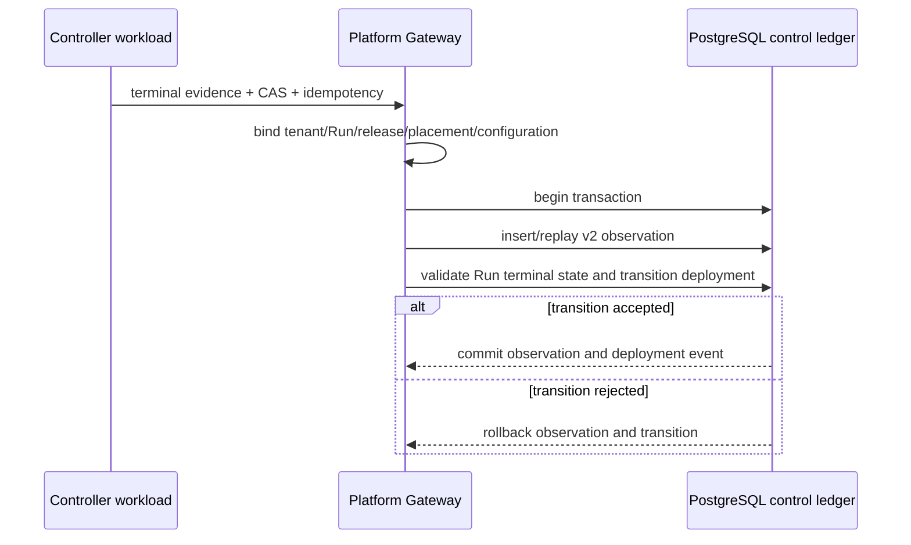

# ADR-213: GIS Service Deployment Terminal Settlement

## Context

Migration 207 makes a terminal GIS deployment observation release-bound and
requires the same evidence when a `ServiceDeploymentRevision` moves from
`deploying` to `ready` or `failed`. The original API exposes those as two
separate calls: record the observation, then submit a state transition. A
controller retry or process loss between them leaves a valid provider result in
the shared evidence ledger while the deployment remains `deploying`.

The execution Run is already owned by the existing PlatformRun lifecycle. In
particular, the database permits `ready` only after the Run succeeds, and
permits `failed` only after its failed/cancelled/timed-out terminal state. A GIS
provider health probe must not create a competing Run failure authority.

## Decision

Add one workload-only operation:

```text
POST /api/platform/v1/gis/services/{service_id}/deployments/{deployment_revision_id}/terminal-settlements
```

The caller supplies one terminal provider observation plus the expected
deployment state version, reason, idempotency key and settlement time. The
Gateway retains ownership of tenant, Run, definition, release, placement,
revision and configuration bindings. It derives the target deployment state:

| Provider observation | Deployment state |
|---|---|
| `success`, `succeeded`, `ready`, `completed` | `ready` |
| `failed`, `error`, `cancelled`, `timed_out` | `failed` |

Within one PostgreSQL transaction, the Gateway validates the v2 evidence,
enables the existing specialised observation recorder marker, inserts or
idempotently replays `FrameworkAttemptObservation`, then calls the existing
database deployment transition function. A failed transition rolls back the
observation insert. The response contains the final immutable observation and
deployment revision. Exact replays retain the original state event and return
`observation_created: false`.



The existing observation and transition endpoints remain available for bounded
controllers that must stage evidence independently. New controller flows use
terminal settlement whenever a provider result and its deployment transition are
one logical completion.

| Option | Result |
|---|---|
| Keep every controller on two independent calls | Rejected: leaves an avoidable evidence/state gap during controller failure and retry. |
| Add a GIS deployment worker or a second reconcile queue | Rejected: duplicates existing PlatformRun orchestration and introduces a second lifecycle authority. |
| Settle evidence and transition in the existing Gateway transaction | Chosen: keeps one Run, evidence ledger and transition authority while making one terminal completion atomic. |

## Consequences

The control plane now has an atomic terminal boundary for both ready and failed
provider results. It prevents an invalid failed deployment observation from
remaining when its associated Run is succeeded, and the existing database checks
continue to enforce release/configuration identity, RLS, state-version CAS and
append-only events.

This does not submit, poll or reconcile a provider deployment; create a Run;
change a provider endpoint; warm cache; activate traffic; roll back; or establish
ServiceSLO/Incident operations. Provider deployment and Run finalization remain
separate existing responsibilities.

## Verification

Route contracts cover workload admission, server-owned observation bindings,
chronology and zero calls to the separate low-level endpoints. Disposable
PostgreSQL 16 certification verifies ready settlement and exact replay, plus a
failed settlement against a succeeded Run that rolls back its observation.

```bash
uv run pytest -q data_agent/test_platform_gis_service_control_routes.py \\
  data_agent/test_gis_service_control_plane_postgres.py
uv run python scripts/certify_gis_service_control_plane.py
```
