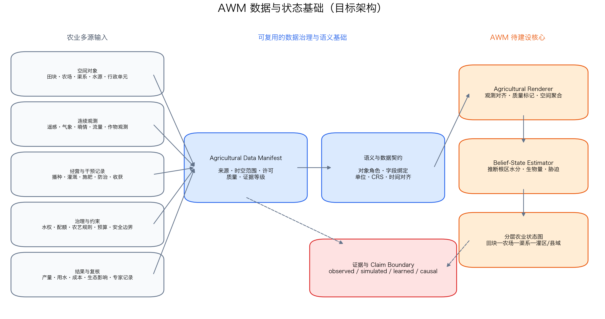
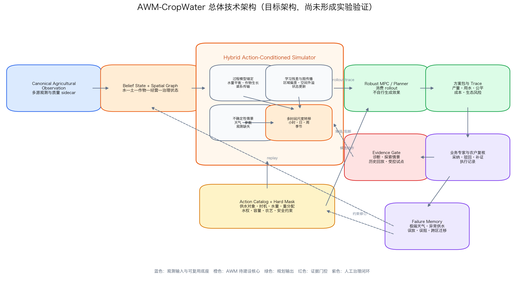

# 面向农业生产与水资源协同治理的农业世界模型（AWM）战略技术说明

日期：2026-07-11

面向对象：农业农村、水利灌溉、农田建设、种植业管理、农业资源环境、农业防灾减灾和数字农业相关业务负责人；公司管理层；农业空间智能、农业信息化、农业模型和地理信息平台建设相关技术负责人。

## 1. 摘要：AWM 的定位与合作价值

AWM（Agricultural World Model，农业世界模型）是面向农业生产、水资源协同配置、农业灾害风险和农业资源环境治理的专业化地理空间世界模型。它的目标不是把作物分类、长势监测、产量预测或农业知识问答重新包装成“世界模型”，也不是让人工智能替代农户、农艺专家、水资源调度人员或农业农村部门的决策职责，而是把田块、农场、渠系、水源、土壤、作物、天气、经营动作、农业规则和结果证据组织成“可计算、可推演、可审计的农业状态”，支持业务人员判断当前状态、推演管理动作后果、比较资源配置方案、识别风险并形成证据链。

可以用一句话概括：

> AWM 是面向农业生产与水资源协同治理的智能推演和证据审计引擎，用于帮助农业经营者和管理部门更准确理解水—土—作物状态，更稳健比较灌溉及生产管理方案，更早识别极端天气和资源约束风险，并清楚说明模型依据、不确定性和适用边界。

AWM 的基本原则是：

- 生命过程导向：农业状态不仅是地类和遥感像元，还包括作物物候、生物量、根区水分、养分、胁迫和土壤状态；
- 动作条件推演：模型必须区分“自然趋势会怎样”和“采取某个农业管理动作后会怎样”；
- 机制与学习结合：水文、土壤、作物和渠系过程模型负责基本规律与守恒约束，学习模型负责状态估计、区域校准、残差修正和复杂空间传播；
- 多尺度协同：田块、农场、渠系、灌区、县域和流域之间的状态、动作和结果必须能够关联；
- 证据分级：真实观测、过程模型模拟、数据驱动预测、专家先验和因果识别结果必须分开标注；
- 资源与安全约束优先：水权、配额、渠系容量、农艺时窗、投入品规范、生态红线和生产安全边界应形成硬约束或行动掩膜；
- 模型辅助：AWM 用于诊断、推演、方案搜索和证据组织，不直接替代生产经营、工程调度或行政管理责任；
- 人工复核：高风险、证据不足、跨区域迁移或极端天气条件下的建议必须进入农艺、水利或业务专家复核；
- 全程留痕：数据来源、观测质量、模型版本、动作序列、推演轨迹、约束命中和人工复核必须可追溯；
- 分级验证：概念设计、工程闭环、历史回放、真实干预验证、影子运行和受控试点必须分级，不把规划性设计表述为已验证系统。

当前必须明确：本项目尚未形成可运行的 AWM 工程原型，也没有可以支持 AWM 状态预测、动作条件转移或规划收益主张的农业实验数据。现阶段已有的是：

1. TWM 和 UWM 已形成的地理空间世界模型状态、行动、转移、证据门控和规划消费思想；
2. gisdataagent 中可复用的 TWM/UWM 工程合同与地理空间 kernel 代码基础；
3. 耕地空间优化、未来状态预测和 Paper13 被动未来感知规划等研究基础；
4. 本说明书提出的 AWM 理论边界、应用场景、目标架构、数据条件、验证阶梯和试点路线。

因此，现阶段最稳妥的定位是：

- AWM 已完成战略方向和目标架构定义；
- AWM-CropWater 已被筛选为优先旗舰原型；
- 当前可以讨论数据需求、业务动作、技术合同、试点组织和验证方案；
- 当前不能宣称 AWM 已经实现、已经优于传统方法、已经学到真实农业干预效果或已经具备生产决策能力。

本说明书的核心目的不是宣称 AWM 已经完成，而是说明：

1. 农业生产与资源治理中确实存在适合世界模型解决的状态—动作—未来问题；
2. AWM 应与普通农业遥感、作物预测、数字孪生和静态优化严格区分；
3. AWM 可以复用现有 Geospatial World Model Kernel，但必须增加农业特有的隐状态估计、生物物理守恒、多时间尺度动力学和空间干扰机制；
4. 在缺少实验数据的当前阶段，应先完成数据合同、过程模型基线、动作日志和验证设计，再逐级建立能力证据；
5. AWM 的首个试点应聚焦一个灌区或县域、一种主要作物和一个完整生长季的灌区—田块作物水分管理闭环。

## 2. 当前农业生产与资源治理面临的核心问题

近年来，农业农村、水利和自然资源相关部门以及农业经营主体已经积累了大量数据和系统，包括耕地和高标准农田数据、农作物遥感监测、气象观测、土壤墒情、灌区渠系、水库与取水监测、农业投入品、农机作业、农情调度、灾情监测、农产品产量、农业保险和经营管理记录。

这些系统构成了农业数字化的重要基础，但在面向“稳产增产、节水增效、绿色低碳、风险韧性和公平配置”的更高目标时，仍面临几个突出问题。

### 2.1 数据很多，但还没有统一转化为“农业状态”

农业数据通常分散在不同部门、不同平台、不同时间尺度和不同空间单元中：

- 遥感数据反映冠层、地表和长势代理；
- 气象数据反映降水、温度、辐射、风速和蒸散条件；
- 墒情传感器反映有限点位和有限深度的土壤水分；
- 渠库监测反映水源、流量、水位和输配水状态；
- 农事记录反映播种、灌溉、施肥、防治和收获动作；
- 土壤调查和耕地质量数据反映相对稳定的基础条件；
- 产量、成本和经营记录反映季末或年度结果；
- 农业政策、水权、配额、工程容量和农艺规程构成行动约束。

传统 GIS 和农业信息平台能够展示、叠加、统计和查询这些数据，但对“当前农业系统真正处于什么状态”这一问题，仍缺少统一、动态和带不确定性的表达。

例如，一个田块的真实生产状态并不等于一个 NDVI 数值。它还涉及：

- 当前作物和品种；
- 生育阶段和物候进度；
- 根区水分和水分胁迫；
- 土壤质地、持水能力和养分状态；
- 已执行灌溉、施肥和防治动作；
- 未来天气和供水条件；
- 田块与渠系、上游水源和相邻田块的关系；
- 观测是否缺失、滞后或存在尺度偏差。

AWM 要解决的第一件事，就是把分散农业数据组织成带空间关系、时间状态、观测质量和证据边界的统一农业状态。

### 2.2 能预测长势和产量，但难以回答“采取动作后会怎样”

农业人工智能已经广泛用于作物识别、长势监测、病虫害识别、产量预测、需水估计和适宜性评价。这些能力很重要，但大多数模型主要回答：

- 当前种了什么；
- 当前长势如何；
- 季末产量可能是多少；
- 哪些区域风险更高。

严肃的生产和治理问题往往是：

- 如果现在灌水，而不是三天后灌水，作物胁迫和产量风险怎样变化？
- 在总供水量受限时，水应在不同渠系和田块之间如何分配？
- 如果减少某次灌溉，节水收益与减产风险如何权衡？
- 如果连续高温或降雨推迟，原计划是否需要重规划？
- 如果采取某类水肥协同方案，对产量、成本和氮淋失可能产生什么影响？

只有能够把动作作为条件，预测动作后的未来状态和结果，模型才进入世界模型的核心问题。单纯预测天气驱动下的未来，不等于预测管理干预后的未来。

### 2.3 水、土、作物、经营和治理往往被割裂处理

农业生产不是单一系统。田块水分状态受天气、土壤、灌溉和渠系输水共同影响；作物生长受水分、养分、品种、播期和病虫害共同影响；农户动作又受劳动力、成本、设备、水权和风险偏好影响；区域管理还要考虑总供水量、上下游关系、粮食安全和生态影响。

在实际系统中，这些主题经常分别处理：

- 作物模型模拟生长过程；
- 水文模型模拟水量过程；
- 灌区系统管理渠系和配水；
- 遥感平台监测长势和灾情；
- 农业管理平台记录农事活动；
- 农业农村部门关注产量、结构和灾情；
- 水利部门关注取水、输配水和用水效率；
- 生态环境部门关注农业面源污染。

如果缺少统一状态和统一转移合同，系统很难对跨专业方案进行一致推演。AWM 的价值就在于把这些专业模型和数据组织到同一个“状态—动作—未来—结果—证据”框架内，而不是试图用一个黑箱模型替代所有专业模型。

### 2.4 农业系统具有部分可观测、多时间尺度和空间干扰特征

农业世界比普通静态空间预测更难，原因包括：

- 根区水分、生物量、养分状态和病虫害压力不能被持续完整观测；
- 天气和市场具有强外生不确定性；
- 灌溉和施肥在小时或日尺度发生，作物生长在日或周尺度变化，产量在季末观察，轮作和土壤健康需要多年评估；
- 同一灌区中，上游配水会影响下游可用水量；
- 病虫害、径流、地下水和农田排水会形成空间传播；
- 农户动作受政策、经验、信息和资源约束影响，历史动作存在选择偏差；
- 极端天气和新品种会改变历史关系，导致跨年份分布漂移。

因此，AWM 不能简单假设所有真实状态都能观测，也不能把一个时间步统一为固定粒度，更不能忽略相邻田块、上下游和跨区域外溢。

### 2.5 过程模型能够模拟，但不天然等于世界模型

作物、水文、土壤和灌区过程模型为农业模拟提供了坚实基础。但单个过程模型通常有自己的输入、参数、尺度和输出，未必具备：

- 多源观测同化和动态隐状态估计；
- 统一的农业空间对象和关系图；
- 可审计的农业动作合同；
- 跨模型的多步 rollout trace；
- 规划器消费接口；
- 证据等级和结论边界；
- 失败记忆和人工复核闭环。

因此，过程模型适合作为 AWM simulator 的机制后端或基线，而不是直接把任何作物模型或水文模型重新命名为 AWM。

### 2.6 人工智能可以给建议，但不能直接成为生产和调度依据

农业管理涉及产量风险、农户收益、水资源权益、食品安全、投入品规范和生态影响。模型建议如果错误，可能造成不可逆的生长季损失。

因此，AWM 不能直接依赖“模型说应该灌水”或“大模型推荐某种施肥方案”。严肃应用必须回答：

- 使用了哪些观测和数据；
- 当前状态估计是否可靠；
- 动作是否满足水权、容量、农艺和安全约束；
- 未来天气不确定性是否被考虑；
- 推演结果来自过程模型、学习模型还是历史因果证据；
- 建议对哪些田块、作物和年份有效；
- 哪些结果必须由农艺或水利专家复核。

AWM 的正确定位是提供可解释、可回放、可降级的辅助推演和方案比较能力，而不是自动替代农业经营与管理责任。

## 3. AWM 是什么：第一性原理与边界

### 3.1 AWM 的第一性原理

AWM 的第一性原理可以用四句话说明。

第一，农业生产系统的真实状态通常不能被完整直接观测。

卫星、无人机、气象站、墒情传感器和农事记录只能看到农业系统的一部分。根区水分、作物生物量、胁迫程度、养分状态和病虫害压力通常需要由观测与过程模型共同估计。因此，AWM 需要表达的不只是 observation，还包括对真实农业状态的 belief state。

第二，农业经营和资源调度本质上是对农业状态的干预。

灌溉、施肥、播种、品种选择、密度调整、病虫害防治、收获时机、渠系配水和应急改种都会改变未来状态。天气、市场和外来病虫害属于外生条件，不应与可控动作混为一谈。

第三，农业状态转移必须服从生物物理规律、空间关系和治理约束。

水量不能凭空产生，作物生长不能脱离物候和环境条件，渠系输水存在容量与损失，水权和配额限制可执行动作，投入品使用受到农艺和安全规范约束。AWM 的动力学不能只追求拟合精度，还必须检查守恒、边界和约束。

第四，好的农业智能工具必须能够推演不同动作序列，并说明证据、不确定性和适用边界。

如果系统只能展示农业现状，它是农业 GIS 或监测平台；如果只能预测季末产量，它是预测模型；如果只搜索灌溉方案但没有动作条件模拟器，它是优化工具；只有把观测、隐状态、动作、转移、空间传播、约束、证据和规划消费组织起来，才有可能形成严格的农业世界模型。

AWM 可以形式化为一个部分可观测、动作条件化、多尺度动态系统：

\[
b_t=P(x_t\mid o_{\le t},a_{<t})
\]

\[
x_{t+1}\sim T_\theta(x_t,a_t,e_t,G,R)
\]

\[
o_t\sim O_\phi(x_t,q_t)
\]

其中：

- \(x_t\) 是真实但不能完全观测的农业状态；
- \(o_t\) 是卫星、无人机、传感器、气象和农事记录等观测；
- \(b_t\) 是模型对真实状态的信念分布；
- \(a_t\) 是灌溉、施肥、播种、防治和调度等可执行动作；
- \(e_t\) 是天气、市场和外来病虫害等外生扰动；
- \(G\) 是田块、农场、渠系、水源、行政单元和流域构成的空间关系图；
- \(R\) 是水权、配额、工程容量、农艺规范、预算和生态约束；
- \(q_t\) 是观测质量和缺测状态；
- \(T_\theta\) 是动作条件化的农业动力学。

对业务人员来说，核心含义是：

> 当前农业状态 + 管理动作 + 外部情景 + 空间关系 + 资源和安全约束 -> 未来农业状态、产量风险、资源消耗、经营结果、生态影响、不确定性和复核需求。

### 3.2 AWM 不是什么

AWM 不是通用大模型或农业问答系统。

大模型可以作为交互入口、知识辅助和工具编排层，但不能替代农业状态估计、动作条件转移、过程守恒和证据验证。

AWM 不是农业遥感基础模型。

遥感基础模型可以提供作物分类、表征、变化检测或状态特征，但它通常不直接建模农业管理动作以及动作后的多步未来。

AWM 不是单次产量预测模型。

产量预测可以是 AWM 的输出头或评价结果，但如果模型不能比较不同管理动作的未来结果，它仍然只是预测器。

AWM 不是作物模型、水文模型或灌区模型的简单换名。

这些模型可以作为 AWM 的机制后端。AWM 还需要统一观测、状态估计、动作合同、空间图、规划消费、证据门控和复核闭环。

AWM 不是数字农业驾驶舱或三维农田展示系统。

地图、大屏、三维场景和实时监测可以展示 AWM 输入和输出，但展示界面不是 AWM 本体。

AWM 不是只做静态适宜性评价的农业 GIS。

耕地质量评价、作物适宜性分区和灌溉适宜性分析可以提供状态特征或约束，但不能替代动作条件推演。

AWM 不是优化器或强化学习策略的简单包装。

规划器、MPC、强化学习和启发式搜索只能消费 simulator 的 rollout。规划器如果自行生成收益而不调用可验证的动力学，不能代表 AWM。

AWM 不是自动农业决策系统。

它输出的是辅助研判、风险提示、情景推演和方案比较。实际灌溉、施肥、防治、工程调度和政策实施仍应由具有责任和授权的人员作出。

### 3.3 AWM 与当前“世界模型”热潮的关系

AWM 与通用世界模型的共同点是：都关心状态、动作、未来预测和基于内部模拟的规划。

AWM 的特殊性在于：

- 它的世界是开放的农业人地系统，而不是封闭游戏或局部机器人环境；
- 状态包括不可直接观测的生命和土壤过程；
- 动作反馈跨越小时、日、季节和多年；
- 天气和市场是不可控外生扰动；
- 水、病虫害、径流和经营行为具有空间传播和多主体相互作用；
- 真实农业试错代价高，不能依赖无限在线探索；
- 生产和治理结论必须接受守恒检查、历史回放、因果证据和专家复核。

因此，更准确的说法是：

> AWM 是世界模型思想在农业生产与农业资源治理领域的专业化落地。它以部分可观测农业状态为核心，以动作条件动力学为主干，以生物物理机制、空间关系、资源约束和证据门控为可信边界。

## 4. AWM 与农业 GIS、精准农业、过程模型、数字孪生和优化工具的区别

| 对比对象 | 主要特点 | 与 AWM 的关系 | AWM 的差异 |
|---|---|---|---|
| 农业 GIS | 农田图层、空间查询、统计、监测和制图 | AWM 必须建立在 GIS 能力之上 | AWM 将图层转化为可推演农业状态 |
| 农情遥感 | 作物识别、长势、灾情和产量代理监测 | 可作为 AWM observation 和 state encoder | AWM 进一步建模管理动作及多步未来 |
| 精准农业平台 | 传感器接入、变量作业、处方图和设备控制 | 可提供观测、执行和反馈通道 | AWM 强调跨田块、跨渠系和多情景推演 |
| 作物模型 | 模拟物候、生长、产量和胁迫 | 可作为 simulator 机制后端 | AWM 还需要状态同化、动作合同、规划和证据门控 |
| 水文/灌区模型 | 模拟水量、径流、输配水和工程过程 | 可作为水资源动力学后端 | AWM 连接作物状态、农户动作和多目标结果 |
| 农业数字孪生 | 对农田、设备和作物进行数字映射与监测 | AWM 可作为数字孪生的智能推演核心 | AWM 更强调反事实、多步规划和 claim boundary |
| 产量预测模型 | 根据历史和环境变量预测产量 | 可作为输出头或基线 | AWM 必须区分不同动作序列下的未来 |
| 优化/MPC/RL | 搜索资源配置或管理策略 | 是 AWM simulator 的消费者 | 不能脱离可验证动力学自行构造效果 |
| 通用大模型/智能体 | 问答、知识检索、任务编排和工具调用 | 可作为交互和编排层 | AWM 的可信性来自状态、转移和证据，不来自语言生成 |

AWM 不是要取代现有农业 GIS、遥感、作物模型、灌区系统、精准农业平台或优化工具，而是要在这些能力之上建立一个统一的农业状态—动作—未来—证据层。

## 5. AWM 能解决的农业业务问题

### 5.1 灌区水量分配与田间灌溉协同

这是最适合作为 AWM 首个旗舰原型的方向。

业务问题包括：

- 在总供水量受限时，不同渠系、农场和田块如何分配水量；
- 如何结合天气预报、土壤水分和作物物候安排灌溉时机；
- 如何评价上游配水对下游田块的影响；
- 如何在产量、水分生产率、供水公平、成本和生态影响之间权衡；
- 当天气、来水或设备状态变化时，如何滚动重规划。

这一场景同时具备清晰状态、可执行动作、频繁反馈、空间网络、资源约束和多目标结果，最符合严格世界模型闭环。

### 5.2 水肥协同和投入品管理

在灌溉闭环稳定后，AWM 可以扩展到：

- 灌水与施肥时机协同；
- 不同水肥方案对生长、产量和养分利用率的影响；
- 深层渗漏和氮淋失风险；
- 成本、收益和生态目标的联合比较；
- 对缺测、天气变化和土壤空间异质性的稳健性评估。

该方向需要真实施肥记录、土壤养分状态和环境结果数据。没有这些数据时，只能进行过程模型支持的情景推演，不能宣称真实因果效果。

### 5.3 播种、品种、密度和收获窗口管理

AWM 可以结合多年天气情景、土壤条件、品种特性和经营能力，比较：

- 不同播期和品种的产量及风险；
- 种植密度与资源利用效率；
- 收获窗口与天气、设备和品质风险；
- 极端天气条件下的重规划方案。

这类动作反馈周期较长，更适合季节尺度规划和多年历史回放。

### 5.4 病虫害传播和防治动作推演

病虫害识别本身不是世界模型。严格的应用需要建模：

- 病虫害压力的时间演化；
- 相邻田块和区域间传播；
- 气象和作物状态对传播的影响；
- 防治时机、范围和强度；
- 防治后的传播状态、损失、成本和生态风险。

该场景具有明显空间干扰，适合使用图动力学，但真实防治动作和后续结果记录是关键数据条件。

### 5.5 干旱、洪涝和高温灾害韧性

AWM 可以在多个天气集合情景下推演：

- 干旱期间不同供水和节水策略；
- 高温期间关键生育期保护；
- 洪涝和积水后的排水、补种或改种方案；
- 极端天气下的减产风险和资源优先级；
- 灾后恢复动作和恢复时间。

这一方向不能只输出灾害风险图，还必须比较具体应对动作后的未来状态和损失差异。

### 5.6 轮作、土壤健康和长期生产力

长期 AWM 可以处理：

- 不同轮作制度；
- 土壤有机质和结构变化；
- 盐渍化、酸化、侵蚀和退化风险；
- 多年产量稳定性；
- 短期收益与长期土壤健康之间的权衡。

该场景世界模型适配度高，但验证周期长，首期不宜作为唯一原型。

### 5.7 县域种植结构和粮食安全

县域或区域管理部门需要比较：

- 不同作物结构对产量、用水和收益的影响；
- 极端气候下的粮食生产风险；
- 区域水资源约束下的种植结构；
- 政策、补贴和保险条件变化下的经营响应；
- 不同乡镇和经营主体之间的资源公平。

该场景业务价值高，但动作反馈慢、政策选择偏差强，应在田块和灌区闭环形成后再扩展。

### 5.8 农业面源污染和流域协同治理

AWM 可以连接施肥、灌溉、降雨、径流、排水和下游水质，推演：

- 不同投入方案的面源污染风险；
- 田块措施对下游的空间影响；
- 流域内农业措施组合；
- 产量、收益、用水和环境目标之间的权衡。

这一方向能充分体现地理空间外部性，但需要流域监测和多部门数据。

### 5.9 高标准农田、土地整治和耕地布局

现有耕地空间布局优化、未来感知规划和 TWM 研究基础可以支撑：

- 高标准农田建设候选区比较；
- 耕地连片度、坡度、质量和灌排条件改善；
- 土地整治方案与后续生产状态的衔接；
- 耕地布局调整对长期产能和水资源的影响。

该方向位于 TWM 与 AWM 的交界：TWM 更关注土地空间治理和合规性，AWM 更关注调整后的农业生产动力学。两者应通过共同 kernel 协同，而不是相互替代。

### 5.10 农业证据审计和辅助决策

AWM 不仅输出推荐，还应输出：

- 当前状态估计和观测缺口；
- 候选动作及其可执行性；
- 多步 rollout trace；
- 产量、资源、成本、公平和生态结果；
- 模型不确定性；
- 过程模型、学习模型和因果证据来源；
- 需要人工复核的条件；
- 结果允许支持的最大 claim level。

### 5.11 应用场景优先级

| 层级 | 场景 | 世界模型适配度 | 首期优先级 | 严格判断 |
|---|---|---:|---:|---|
| 田块 | 灌溉时机与灌溉量优化 | 极高 | 高 | 动作清晰、反馈频繁、可多步推演 |
| 田块 | 水肥协同管理 | 极高 | 中 | 需要施肥日志和氮循环状态 |
| 田块 | 播种、品种和收获窗口 | 高 | 中 | 适合季节规划，反馈较慢 |
| 田块/区域 | 病虫害传播与防治 | 高 | 中 | 必须有传播和防治动作数据 |
| 田块/农场 | 轮作与土壤健康 | 高 | 低 | 路径依赖强，验证周期长 |
| 灌区 | 渠系水量分配与田间灌溉协同 | 极高 | 最高 | GIS、网络动力学和多主体决策特征最强 |
| 区域 | 干旱、洪涝和热害应对 | 极高 | 高 | 需要天气集合情景和稳健规划 |
| 县域 | 种植结构与粮食安全 | 高 | 中 | 价值大，但因果混杂和反馈周期较长 |
| 流域 | 农业面源污染治理 | 极高 | 中 | 空间外部性强，数据协同要求高 |
| 土地治理 | 高标准农田和耕地布局 | 高 | 中 | 属于 TWM–AWM 交界模块 |

### 5.12 不能单独称为 AWM 的农业 AI 应用

以下应用可以作为 AWM 的组件，但不能单独称为农业世界模型：

- 作物分类；
- 病虫害图片识别；
- 单时点长势评价；
- 单次产量预测；
- 土壤属性制图；
- 农田适宜性评价；
- 农业知识问答；
- 遥感基础模型；
- 不调用 simulator 的静态处方图；
- 没有动作条件转移的数字农业驾驶舱。

## 6. AWM 的总体技术架构：从农业数据到可审计推演

AWM 不是一个孤立模型，而是一条从农业数据治理、状态估计、混合动力学、方案规划到证据复核的完整链路。

总体路径可以概括为：

> 农业数据 manifest -> 语义与数据契约 -> Agricultural Renderer -> Belief-State Estimator -> 分层农业状态图 -> 混合动作条件模拟器 -> 稳健规划器消费 -> 证据门控 -> 人工复核与 Failure Memory。

{width=100%}

图 1. AWM 数据与状态基础目标架构。蓝色部分表示可从现有 GIS Data Agent、数据治理和语义融合体系复用的基础；橙色部分表示尚待建设和验证的 AWM 专业核心。该图是目标设计，不代表当前已经实现。

{width=100%}

图 2. AWM-CropWater 总体技术架构。Simulator 负责动作条件转移，Planner 只消费 rollout trace，Evidence Gate 控制结论等级，业务专家和农户复核结果进入 Failure Memory。该图是目标架构，当前尚无 AWM 实验结果。

### 6.1 Agricultural Data Foundation 与 manifest

AWM 首先需要建立可审计的农业数据基础。每一项数据都应进入统一 manifest，至少记录：

- 数据名称和业务角色；
- 数据来源、授权和许可条件；
- 空间范围、时间范围和坐标参考；
- 空间单元和时间频率；
- 单位、值域和质量规则；
- 真实观测、过程模拟、公开代理、拟合代理、专家先验、半合成或合成类型；
- 是否包含真实管理动作；
- 是否包含动作后的 outcome；
- 可支持的最大 claim level；
- 已知缺口和下游用途。

如果数据只有遥感、天气和产量，没有灌溉或其他真实管理动作日志，就不能用于证明真实动作效果。

### 6.2 语义与数据契约

农业数据具有明显的单位、尺度和术语差异。AWM 应建立统一契约，至少包括：

- 田块、农场、渠系、水源、行政单元和流域对象；
- 土壤、作物、天气、水资源、经营、约束和结果角色；
- 空间关系、上下游关系、田块邻接和管理隶属；
- 作物代码、品种、物候阶段、灌溉方式和投入品字典；
- 时间戳、事件时间、观测窗口和生长季；
- 水量、深度、流量、浓度、产量和成本等单位；
- 数据质量、缺测、插补和来源 sidecar。

AWM simulator 不应直接读取散乱原始文件，而应消费经过契约校验的 canonical observation 和 action log。

### 6.3 Agricultural Renderer：农业观测算子

Renderer 不是前端地图渲染器，而是将真实农业数据转化为模拟器可消费观测的 measurement operator。

其职责包括：

- 坐标、单位和时间对齐；
- 遥感、传感器、气象、渠系和农事记录融合；
- 田块和渠系空间聚合；
- 缺测、异常和质量标记；
- 构建田块、渠系和行政单元关系图；
- 生成 canonical agricultural observation；
- 保留所有处理步骤和证据来源。

Renderer 只能产生观测，不应把未经验证的推断直接当作真实状态。

### 6.4 Belief-State Estimator：部分可观测农业状态估计

农业状态估计器需要结合观测和机制模型，推断：

- 根区土壤水分；
- 作物物候和生物量；
- 水分或养分胁迫；
- 土壤可利用水量；
- 渠系和田块有效供水状态；
- 病虫害压力或其他不可完整观测状态；
- 对每个状态变量的不确定性。

状态估计应支持：

- 滤波和同化；
- 多源观测冲突处理；
- 缺测条件下的置信区间；
- 历史动作对当前状态的影响；
- 状态估计与真实传感器或田间调查的 holdout 验证。

### 6.5 分层农业状态图

AWM 的状态不是单一栅格或表格，而是多尺度空间图。

建议的节点包括：

- 田块；
- 农场或经营主体；
- 渠段和用水单元；
- 水库、泵站、闸门和水源；
- 村镇、乡镇、县域；
- 流域或子流域。

建议的关系包括：

- 田块邻接；
- 田块属于农场；
- 田块接受某渠段供水；
- 渠段上下游；
- 水源供给渠系；
- 田块位于行政单元或流域；
- 农机、劳动力或服务资源可达；
- 径流、病虫害或地下水传播关系。

状态图应支持田块—农场—灌区/县域之间的信息聚合和约束传递。

### 6.6 Action Catalog 与 Hard Mask

AWM 必须显式区分可控动作和外生情景。

首期 AWM-CropWater 动作建议包括：

- 选择供水对象；
- 确定灌溉时间；
- 确定灌溉量；
- 在水量不足时进行渠系和田块间重分配；
- 在天气或供水变化后暂停、提前、延后或调整动作。

外生情景包括：

- 天气预报和天气集合；
- 来水情景；
- 市场价格；
- 外来病虫害压力；
- 设备故障或突发事件。

硬约束应形成 action mask，例如：

- 水权和配额；
- 渠系容量和输水时延；
- 水源可用量；
- 田块灌溉设施条件；
- 作物生育期和农艺窗口；
- 最大或最小灌溉量；
- 预算、能源和设备限制；
- 生态流量和环境要求；
- 数据或状态不确定性过高时的安全阻断。

### 6.7 Hybrid Action-Conditioned Simulator

Simulator 是 AWM 的核心，必须回答：

> 在当前 belief state、候选动作、外生情景、空间关系和约束条件下，下一状态和多步未来可能怎样变化？

推荐采用混合动力学：

~~~text
作物/水文/渠系过程模型
+ 遥感与传感器状态同化
+ 图模型表达上下游和田块传播
+ 数据驱动残差修正
+ 真实干预记录的因果校准
+ 不确定性集合 rollout
~~~

过程模型负责：

- 水量平衡；
- 蒸散和土壤水分变化；
- 作物物候、生长和胁迫；
- 渠系输水和损失；
- 必要的养分或污染过程。

学习模型负责：

- 隐状态估计；
- 区域参数校准；
- 未建模过程的残差修正；
- 空间传播和多尺度关系；
- 不确定性和分布漂移检测。

Simulator 输出至少应包括：

- 未来 belief state；
- 作物胁迫和风险；
- 产量或产量区间；
- 总用水量和水分生产率；
- 成本、能耗和资源消耗；
- 农户或空间单元间公平性；
- 生态影响；
- 约束违反概率；
- 不确定性；
- rollout trace 和证据来源。

### 6.8 多时间尺度动力学

农业系统不能粗暴压缩为一个统一时间步。建议支持：

- 小时或事件级：降雨、供水、灌溉和设备动作；
- 日级：土壤水分、蒸散和作物胁迫；
- 周级：作物生长、病虫害扩散和管理响应；
- 季节级：产量、收益和资源效率；
- 年度及多年级：轮作、土壤健康、盐渍化和基础设施变化。

不同时间尺度之间应有清晰的聚合和状态传递合同。首期 AWM-CropWater 可采用日级核心状态加事件级灌溉动作，避免一开始覆盖全部尺度。

### 6.9 Planner：消费者，不是 AWM 本体

MPC、稳健优化、束搜索、强化学习和启发式算法可以作为 AWM planner，但必须满足：

- 只消费 simulator 输出和 rollout trace；
- 所有动作先经过 hard mask；
- 不自行编造动作收益；
- 比较多个天气和参数情景；
- 输出推荐动作、备选动作和拒绝原因；
- 保留多目标结果，而不是只输出一个黑箱分数；
- 高风险或证据不足方案自动进入人工复核。

如果 planner 不调用 simulator，只根据当前状态静态排序，它仍然是传统 GIS 决策支持或优化工具。

### 6.10 因果校准与空间干扰

历史农业动作不是随机选择的。农户通常在更干旱、更高风险或资源更充足的田块上采取不同动作。因此，相关性模型很容易把选择偏差误认为动作效果。

AWM 需要区分：

- observed transition：真实观测到的状态变化；
- mechanism simulated transition：过程模型模拟变化；
- learned transition：数据驱动模型预测变化；
- expert prior：专家规则或先验；
- causally identified effect：经过试验、准实验或可信因果识别的干预效果。

空间干扰也必须显式处理：

- 上游供水影响下游；
- 相邻田块的病虫害防治影响传播；
- 灌溉和降雨径流影响下游水体；
- 地下水开采和补给具有区域影响；
- 农户之间可能共享渠道、设备和信息。

没有真实动作和 outcome 数据时，AWM 可以做机制情景推演，但不能把模拟差异表述为已识别的真实因果效应。

### 6.11 Evidence Gate、Claim Ladder 与 Failure Memory

每个 AWM 输出都应带有证据门控结果。

建议的输出等级包括：

1. data_readiness_only：仅能说明数据准备和缺口；
2. diagnostic_only：可用于状态诊断，不能支持动作效果；
3. mechanism_scenario_only：可用于过程模型支持的探索性情景；
4. replay_ready：具备历史回放条件；
5. action_conditioned_validation：动作条件转移在留出数据上通过；
6. controlled_pilot_review：可进入影子运行或受控试点复核；
7. production_candidate_review：具备生产候选审查条件，但仍不代表自动决策。

Failure Memory 应按以下维度组织：

- 区域和土壤类型；
- 作物和品种；
- 生长季和极端天气；
- 动作类型和强度；
- 上下游位置；
- 观测缺失和数据质量；
- 误放行、误阻断和规划后悔；
- 过程守恒失败；
- 跨区域迁移失败；
- 专家驳回原因。

### 6.12 报告与业务闭环

AWM 应输出：

- 农业状态图；
- 观测质量和缺口报告；
- 候选动作清单和 action mask；
- 基线与干预 rollout；
- 产量、用水、成本、公平和生态结果；
- 不确定性和尾部风险；
- 证据等级；
- 需要复核的田块和动作；
- GIS 图层、表格和审计报告；
- 人工复核和执行反馈。

## 7. 当前基础、未完成能力与声明边界

本章与 TWM/UWM 现有方案中的“当前工程进展”不同。由于目前没有 AWM 实验数据和可运行原型，不能把可复用基础表述为 AWM 已实现能力。

### 7.1 已存在的可复用工程基础

截至 2026-07-11，gisdataagent 项目已经存在以下可复用基础：

- TWM 对项目、状态对象、空间关系、规则、证据、行动、forecast、counterfactual rollout、validation report 和 claim ladder 的结构化表达；
- TWM planner 中的行动条件 forecast、beam search、counterfactual rollout、行动掩膜、证据门控和因果校准接口；
- UWM 中的 renderer、scene state、action-conditioned simulator、evidence-gated planner 和多类评估模块；
- UWM geospatial kernel 中的状态图、行动、转移、空间传播、counterfactual rollout、evidence gate 和 validation 代码；
- GIS Data Agent 的数据、语义、智能体编排、API、GIS 输出和审计基础；
- Paper13 中面向未来土地状态的被动 future-aware farmland planning 研究设计；
- 现有耕地布局 DRL/MPC 和未来状态预测研究材料。

这些基础说明 AWM 不需要从零设计通用 kernel、证据门控和规划消费接口。

### 7.2 当前仍未完成的 AWM 专业能力

截至本说明书日期，以下能力尚未形成可验证实现：

- Agricultural Data Manifest 和权威农业数据接入；
- 田块—渠系—农场—灌区状态图；
- Agricultural Renderer；
- 根区水分、物候、生物量和胁迫的 belief-state estimator；
- AWM action catalog 和农业 hard mask；
- 作物—水文—渠系混合 simulator；
- 真实灌溉 action log 与 outcome panel；
- AWM-CropWater 多步 rollout；
- AWM planner benchmark；
- 真实农业历史回放；
- 跨年份、跨区域和极端天气验证；
- 因果校准或田间试验验证；
- 影子运行和受控生产试点；
- AWM API、Agent tool 和正式产品界面。

### 7.3 Paper13 与现有耕地研究的证据边界

Paper13 当前明确定位为研究设计和复现准备仓库，其可辩护的首版是：

> 使用预测的基线未来土地状态指导稳健耕地布局优化。

这属于 passive future-aware optimization。它不能自动支持：

- 任意农业动作条件化转移；
- 灌溉或施肥干预的因果效果；
- 作物—水分动态闭环；
- AWM-CropWater 已实现主张。

现有耕地布局研究可以作为 AWM 长期规划层和 TWM–AWM 接口基础，但不能替代农业生产世界模型实验。

### 7.4 当前最大允许声明

当前最大允许声明建议为：

> AWM 已完成严肃世界模型视角下的战略定义、应用版图、旗舰原型筛选、目标架构、数据需求、证据边界和试点路线设计；项目已有 TWM/UWM 和耕地规划研究基础可供复用，但 AWM 专业 renderer、belief-state estimator、simulator、planner 和农业实验验证尚未建立。

当前禁止声明：

- AWM 已经建成或可运行；
- AWM 已经在真实农业数据上验证；
- AWM 已经优于传统作物模型、灌区模型或人工方案；
- AWM 已经学到灌溉、施肥或防治的真实因果效应；
- AWM 已经能够自动指导农业生产或水资源调度；
- TWM/UWM 的实验结果可以直接代表 AWM 结果；
- 合成或过程模型轨迹可以替代真实农业干预 outcome。

## 8. 真实落地需要的条件和试点建议

### 8.1 需要的数据条件

建议首个 AWM-CropWater 试点至少准备以下数据。

空间基础：

- 田块边界和唯一标识；
- 作物类型、品种和播种信息；
- 农场或经营主体与田块对应关系；
- 渠系、水源、水库、泵站、闸门和取水点；
- 渠段上下游关系、容量、输水时间和损失；
- DEM、土壤类型、质地、田间持水量和基础耕地质量。

动态观测：

- 逐日或更高频气象；
- 降雨、温度、辐射、湿度、风速和参考蒸散；
- 土壤墒情或可用于校准的田间观测；
- 遥感植被、蒸散、地表温度和作物状态产品；
- 水源、渠系流量、水位和供水记录；
- 关键生育期田间调查。

动作记录：

- 灌溉时间；
- 灌溉对象；
- 灌溉量或持续时间；
- 供水来源和渠系路径；
- 灌溉方式；
- 调度调整、取消或失败记录；
- 后续阶段的施肥、防治和其他农事动作。

结果数据：

- 田块或可下推到田块的产量；
- 作物胁迫和灾损；
- 总用水量和用水效率；
- 成本、能耗和经营收益；
- 供水公平或上下游差异；
- 可能的渗漏、排水和环境结果；
- 专家复核、农户反馈和执行记录。

约束和规则：

- 水权和配额；
- 工程容量和调度规则；
- 作物灌溉制度和农艺窗口；
- 预算、设备和劳动力约束；
- 生态流量和取水限制；
- 数据权限和隐私要求。

### 8.2 需要的业务条件

试点必须由业务参与方共同明确：

- 试点要解决的唯一主问题；
- 空间范围和作物范围；
- 规划和执行时间尺度；
- 哪些动作真实可实施；
- 哪些约束属于硬约束；
- 方案由谁审核、执行和反馈；
- 哪些结果只能内部研判；
- 如何评价比现有方法有改进；
- 失败或不确定时如何降级。

没有真实动作和执行反馈，AWM 容易退化为状态预测；没有业务目标和约束，AWM 容易退化为科研模拟。

### 8.3 需要的验证条件

建议采用以下验证阶梯：

第一层：数据和观测验证。

- manifest 完整性；
- 空间拓扑和单位一致性；
- 遥感、传感器和气象时间对齐；
- 观测缺失和质量评估。

第二层：状态估计验证。

- 根区水分、物候、生物量和胁迫的 holdout；
- 过程模型和静态模型基线；
- 时间顺序负控；
- 跨田块和跨年份稳定性。

第三层：动作条件转移验证。

- 使用真实灌溉日志预测下一状态；
- 检查不同动作强度和时机；
- 检查水量守恒和渠系约束；
- 评估多步 rollout 漂移。

第四层：历史回放和规划验证。

- 从历史某一日开始重放；
- 比较真实调度、规则基线、过程模型优化和 AWM planner；
- 评估产量风险、用水、成本、公平和 decision regret；
- 检查极端天气和异常供水案例。

第五层：因果和受控试点验证。

- 田间试验、准实验或可信对照；
- 动作选择偏差诊断；
- 空间干扰评估；
- 影子运行；
- 小范围受控执行；
- 专家和农户复核。

### 8.4 需要的部署条件

AWM 涉及农业经营、取用水、产量和可能的经营主体数据，应优先支持：

- 本地化、专有云或可信内网部署；
- 数据不出域；
- 分级授权和脱敏；
- 田块和经营主体数据隔离；
- 模型和数据版本管理；
- 审计日志；
- GIS 图层和报告导出；
- 与农情、水利、灌区和农业管理系统接口对接；
- 边缘设备和弱网络条件下的数据同步；
- 模型异常、数据缺失和设备故障降级。

## 9. 风险控制：不替代生产责任、不虚构因果、不越过安全边界

### 9.1 不替代农户、农艺专家和调度人员

AWM 输出是辅助研判和方案比较，不是自动生产命令。实际灌溉、施肥、防治、设备控制和水资源调度应由有权、有经验和承担责任的人员决定。

### 9.2 不把相关性或过程模拟当作真实因果效果

模型可以表述：

- 在过程模型和当前假设下，某方案可能产生怎样的结果；
- 某动作在历史数据中与某类结果相关；
- 某候选方案在多个天气情景下相对稳健；
- 当前证据不足，需要补充动作日志或受控验证。

模型不能在缺乏证据时表述：

- 已证明某灌溉方案必然增产；
- 已证明某施肥方案真实降低污染；
- 已证明 planner 优于农艺专家；
- 模拟轨迹就是现实政策或生产效果。

### 9.3 硬约束和安全边界必须优先

任何高分方案如果违反水权、渠系容量、农艺时窗、投入品规范、安全限制或生态约束，都不能被推荐。数据缺失或状态不确定性过高时，应阻断高风险动作或要求人工复核。

### 9.4 极端天气和分布漂移必须单独处理

历史平均表现不能代表极端天气下的安全性。AWM 必须检查：

- 极端高温；
- 连续干旱；
- 强降雨和洪涝；
- 异常来水；
- 新品种和新管理制度；
- 跨区域迁移；
- 传感器故障和观测缺失。

### 9.5 多目标和公平性必须显式表达

AWM 不能只优化平均产量。还应检查：

- 总用水量；
- 水分生产率；
- 农户和上下游公平；
- 成本和能源；
- 生态影响；
- 尾部减产风险；
- 个别田块是否承担不成比例的损失。

### 9.6 全程留痕

每次 AWM 推演应记录：

- 数据和观测版本；
- 状态估计版本；
- 过程模型和学习模型版本；
- 动作和情景；
- hard mask；
- rollout trace；
- 证据等级；
- 约束命中；
- 人工复核；
- 实际执行和后续结果；
- 结论升级或降级原因。

## 10. 未来发展前景与战略价值

### 10.1 从农业监测走向农业可推演管理

当前数字农业大量能力集中在“看见农业”：看作物、看长势、看墒情、看灾情。AWM 的长期价值是进一步回答“如果采取不同动作，未来可能怎样”，把监测能力推进到可验证的管理推演能力。

### 10.2 从单田块精准农业走向田块—灌区—县域协同

精准农业往往聚焦单田块或单设备。AWM 可以通过多尺度空间图连接田块状态、农场经营、渠系配水和区域治理，使资源配置和生产管理能够在同一框架下协同。

### 10.3 从单点预测模型走向农业模型平台

AWM 可以组织：

- 遥感模型；
- 作物模型；
- 水文和灌区模型；
- 土壤和养分模型；
- 图动力学；
- 因果模型；
- 规划优化模型；
- 大模型和智能体编排。

这些模型不再孤立输出，而是围绕统一状态、动作、转移和证据合同协同。

### 10.4 从经验方案走向证据链辅助方案

AWM 不取消农户和专家经验，而是把经验、规则、历史案例和模型证据组织起来。长期可以形成：

- 区域化农艺知识；
- 极端天气失败记忆；
- 调度和生产案例库；
- 可回放的动作—结果轨迹；
- 可审计的方案比较记录。

### 10.5 从一次性农业项目走向可复用行业产品

成熟 AWM 可以形成可复用模块：

- Agricultural Data Manifest；
- 农业状态契约；
- Renderer；
- Belief-State Estimator；
- Hybrid Simulator；
- Action Catalog；
- Planner；
- Evidence Gate；
- Benchmark；
- GIS 和审计输出。

### 10.6 建立 Geospatial World Model 的第三个行业支柱

TWM 面向自然资源与国土空间治理，UWM 面向城市系统与宜居治理，AWM 面向农业生产与资源管理。三者共同验证同一个通用 kernel 能否支持不同地理世界：

~~~text
Geospatial World Model Kernel
├── TWM：土地、生态和空间治理
├── UWM：城市设施、人口与治理
└── AWM：水、土、作物与农业经营
~~~

AWM 的独特价值不在于复制 TWM/UWM，而在于引入部分可观测生命过程、生物物理守恒、多时间尺度和高频生产动作。

## 11. 建议的试点路线

建议采用四阶段路线，不在缺少数据时直接进入复杂强化学习或全县自动规划。

### 11.1 第一阶段：数据、对象和业务边界试点

目标：证明试点区域的数据可以形成可信农业观测和动作记录。

建议范围：

- 一个灌区或县域子区域；
- 一种主要作物；
- 一个完整生长季；
- 有明确田块边界、渠系关系和供水记录；
- 优先选择已有墒情、气象和产量数据的区域。

重点任务：

- 建立 Agricultural Data Manifest；
- 统一田块、渠系和水源标识；
- 建立对象和关系图；
- 明确灌溉动作和结果字段；
- 确认水权、容量和农艺约束；
- 输出数据缺口和证据等级。

阶段成果：

- 数据清单和质量报告；
- 田块—渠系空间图；
- 状态、动作和 outcome 数据合同；
- 试点业务边界；
- 当前允许 claim level。

### 11.2 第二阶段：Renderer、状态估计和传统基线

目标：证明多源数据能够形成可验证的农业状态。

重点任务：

- 生成 canonical agricultural observation；
- 建立土壤水分和作物状态基线；
- 接入一个可复现的过程模型；
- 进行时间和空间 holdout；
- 检查水量平衡和观测缺失；
- 与持久性、静态回归、纯过程模型等基线比较。

阶段成果：

- Agricultural Renderer v0；
- Belief-State Estimator v0；
- 状态估计验证报告；
- 过程模型校准报告；
- 数据和模型失败案例。

### 11.3 第三阶段：动作条件 simulator 和历史回放

目标：验证模型能回答“如果这样灌溉会怎样”。

重点任务：

- 建立灌溉 action catalog 和 hard mask；
- 构建真实 state-action-next_state 轨迹；
- 建立动作条件混合 simulator；
- 进行单步和多步 rollout；
- 回放历史供水和灌溉过程；
- 比较规则、过程模型和 learned residual；
- 建立 Failure Memory。

阶段成果：

- AWM-CropWater simulator v0；
- action-conditioned transition benchmark；
- 历史回放报告；
- 不确定性和约束审计；
- 当前反事实 claim boundary。

### 11.4 第四阶段：规划消费、影子运行和受控试点

目标：验证 AWM 是否能在不直接控制生产的情况下提供有价值的方案比较。

重点任务：

- 建立 robust MPC 或受约束 planner；
- 在多个天气和供水情景下规划；
- 与现行调度、专家方案和传统优化比较；
- 先进行影子运行，不直接下发控制；
- 由农户、农艺和调度专家复核；
- 在安全条件下选择小范围受控试点；
- 记录实际执行和后续 outcome。

阶段成果：

- 方案比较包；
- planner decision regret 报告；
- 专家复核和采纳记录；
- 受控试点结果；
- 生产候选审查建议。

## 12. 对农业农村和水利业务部门合作的建议

### 12.1 建议选择的首个合作方向

优先建议：

> 选择一个数据条件较好的灌区或县域，以一种主要作物为对象，开展“灌区配水—田间灌溉—作物水分状态—产量与用水效率”的受控试点。

选择标准应包括：

- 田块边界相对完整；
- 渠系和水源关系清楚；
- 有气象和至少部分墒情观测；
- 有历史供水或灌溉记录；
- 有可用于验证的产量或灾损数据；
- 动作和约束可以由业务专家明确；
- 试点结果可以量化；
- 不要求模型直接控制生产设备。

### 12.2 建议建立联合工作机制

建议联合工作组包括：

- 农业农村业务部门；
- 水利、灌区或用水管理部门；
- 农艺和作物专家；
- 农户、合作社或经营主体代表；
- 土壤、气象和农业资源环境人员；
- GIS 和数据工程团队；
- 过程模型和人工智能团队；
- 信息安全和数据合规人员。

联合工作组应共同确认：

- 数据授权和使用边界；
- 试点作物和生长季；
- 动作和约束字典；
- 模型评价指标；
- 专家复核流程；
- 影子运行和受控试点条件；
- 对外发布口径。

### 12.3 建议采用“辅助推演”而非“自动种田”定位

建议对外使用：

- 农业生产状态智能诊断；
- 灌区—田块协同推演；
- 证据门控的灌溉方案比选；
- 农业灾害情景推演；
- 水资源约束下的稳健生产规划。

不建议使用：

- 自动种田大脑；
- 自动替代农艺专家；
- 模型直接决定灌溉；
- 已证明全面增产节水；
- 无人监督的农业自动决策。

## 13. 对公司管理层的战略意义

### 13.1 从农业 GIS 项目走向农业空间智能能力

传统农业 GIS 项目擅长农田建库、遥感监测、地图服务、指标统计和平台建设。未来更高层竞争将转向：

- 是否能统一农业状态；
- 是否能理解农业动作和约束；
- 是否能连接过程模型与学习模型；
- 是否能推演不同方案；
- 是否能提供证据边界和复核闭环。

AWM 是公司从农业数据和平台能力走向农业空间智能能力的重要抓手。

### 13.2 形成 TWM、UWM、AWM 的产品矩阵

三类模型可以共享：

- 数据 manifest；
- 语义与状态合同；
- 空间图；
- action contract；
- transition contract；
- evidence gate；
- claim ladder；
- planner 消费接口；
- GIS 输出和审计能力。

同时保持行业专业内核独立：

- TWM 的核心是土地与治理规则；
- UWM 的核心是城市系统、暴露、服务与公平；
- AWM 的核心是水土作物过程、经营动作和资源配置。

### 13.3 从单点模型采购走向可扩展模型平台

农业项目中常见多个独立模型和供应商。AWM 可以形成统一接入框架，使作物模型、水文模型、遥感模型、图模型和优化器通过合同协同，降低每个项目重新集成的成本。

### 13.4 从概念竞争走向数据和验证竞争

农业世界模型最容易被质疑的地方是“没有真实动作数据，却宣称能模拟干预”。公司应把竞争力建立在：

- 真实动作日志；
- 状态和 outcome 数据；
- 过程模型校准；
- 历史回放；
- 受控试点；
- 证据门控；
- 跨区域失败记忆。

这比单纯使用更大的模型更难复制。

### 13.5 控制研发范围和商业风险

首期不应同时覆盖灌溉、施肥、病虫害、农机、轮作、市场和供应链。应从 AWM-CropWater 建立最小真实闭环，再按数据和业务价值扩展。

公司对外应把当前状态定位为战略设计和试点准备，而不是成熟产品。只有完成真实数据接入和历史回放后，才可提升工程能力声明。

## 14. 结语

AWM 的价值不在于把“世界模型”标签用于农业，而在于真正解决农业生产和资源治理中的几个关键问题：

- 多源农业数据如何从图层、传感器和记录转化为统一 belief state；
- 灌溉、施肥、防治和调度动作如何进入可审计 action contract；
- 水、土、作物和渠系状态如何在多时间尺度下转移；
- 过程模型和学习模型如何在守恒与证据边界下结合；
- 不同动作序列如何在天气和供水不确定性下比较；
- 产量、用水、成本、公平和生态影响如何共同评价；
- 模型输出如何经过 evidence gate 和人工复核进入业务试点。

当前项目已经具备 TWM/UWM 和耕地规划研究所形成的通用基础，但还没有 AWM 专业数据、专业 simulator 和实验验证。严肃的下一步不是继续扩大概念范围，而是选择一个数据条件较好的灌区或县域，围绕一种主要作物和一个生长季，建立真实的状态—灌溉动作—下一状态—产量与用水结果轨迹。

只有完成数据合同、状态估计、过程模型基线、动作条件历史回放和专家复核，AWM 才能从战略技术设计进入工程原型。只有进一步完成影子运行和受控试点，AWM 才可能成为可信、可控、可审计的农业生产与资源治理智能能力。

## 附录 A：AWM 核心模块

| 模块 | 职责 | 当前定位 |
|---|---|---|
| Agricultural Data Foundation | 管理农业数据来源、时空范围、质量、许可和 claim boundary | 目标设计，待建设 |
| 语义与数据契约 | 统一田块、渠系、作物、动作、单位、时间和结果字段 | 目标设计，可复用现有语义基础 |
| Agricultural Renderer | 将多源农业数据转为 canonical observation | 待建设 |
| Belief-State Estimator | 推断根区水分、物候、生物量和胁迫等隐状态 | 待建设 |
| Hierarchical Agricultural State Graph | 表达田块—农场—渠系—灌区/县域状态与关系 | 待建设 |
| Action Catalog | 定义灌溉及后续农业管理动作 | 待建设 |
| Hard Action Mask | 应用水权、容量、农艺、安全和证据约束 | 可复用 kernel 思想，农业规则待建设 |
| Hybrid Simulator | 过程模型、状态同化、图传播和学习残差联合转移 | 待建设 |
| Multi-timescale Runtime | 协调事件、日、周、季节和多年转移 | 待建设 |
| Robust Planner | 消费 rollout，搜索稳健方案 | 通用接口可复用，AWM planner 待建设 |
| Causal Calibration | 使用试验、准实验和历史动作结果校准干预效果 | 待建设 |
| Evidence Gate / Claim Ladder | 控制诊断、情景、回放、试点和生产候选等级 | 可复用现有基础，AWM gate 待适配 |
| Failure Memory | 记录极端天气、跨区迁移和错误动作案例 | 目标设计，待建设 |
| GIS & Audit Output | 输出图层、表格、方案包、trace 和复核记录 | 可复用 GIS Data Agent 基础 |

## 附录 B：首个试点建议数据表

| 数据组 | 关键内容 | 推荐频率 | 是否支撑动作效果 |
|---|---|---:|---|
| 田块与作物 | 田块 ID、边界、作物、品种、播期 | 季节/事件 | 仅状态基础 |
| 土壤 | 质地、持水量、土层、基础养分 | 年度/调查 | 状态与过程参数 |
| 气象 | 降雨、温度、辐射、湿度、风、蒸散 | 小时/日 | 外生情景 |
| 遥感 | 植被指数、蒸散、地表温度、作物状态 | 日/周 | 状态观测 |
| 墒情 | 不同深度土壤水分 | 小时/日 | 状态验证 |
| 渠系与水源 | 水源、渠段、上下游、容量、损失 | 静态+事件 | 动作可行性 |
| 供水与灌溉日志 | 时间、对象、水量、来源、方式、调整 | 事件级 | 核心动作证据 |
| 田间状态 | 物候、生物量、胁迫、灾情 | 周/关键期 | 状态和转移验证 |
| 结果 | 产量、用水、成本、能耗、灾损 | 季末/年度 | outcome |
| 治理约束 | 水权、配额、规则、预算和安全限制 | 版本化 | action mask |
| 复核与执行 | 专家意见、采纳、执行和异常 | 事件级 | 闭环证据 |

## 附录 C：建议验证指标

| 验证层级 | 建议指标 |
|---|---|
| 数据基础 | manifest 完整率、CRS/单位一致性、田块—渠系关联率、缺测率、动作日志覆盖率 |
| Renderer | canonical observation 可复现性、时间对齐误差、空间聚合误差、质量标记召回率 |
| 状态估计 | 土壤水分 MAE/RMSE、物候偏差、生物量/胁迫误差、区间覆盖率 |
| 物理一致性 | 水量平衡残差、非负约束、渠系容量违反率、状态边界违反率 |
| 单步转移 | next-state 误差、动作强度响应、不同生育期误差 |
| 多步 rollout | 累积误差、漂移率、守恒误差、尾部风险覆盖 |
| 空间传播 | 上下游效应、邻域传播误差、残差空间自相关、空间 bootstrap 稳健性 |
| 行动可行性 | false allow、false block、hard mask 合规率、专家复核通过率 |
| 方案比选 | decision regret、产量风险、用水、成本、公平、生态约束满足率 |
| 因果证据 | overlap、balance、placebo、negative control、空间干扰、试验或准实验一致性 |
| 跨域稳健性 | 跨年份、跨区域、跨土壤、跨品种和极端天气性能 |
| 生产闭环 | 影子运行一致性、采纳率、执行偏差、复核反馈回写率、实际 outcome 一致性 |

## 附录 D：推荐对外表述

面向农业农村和水利业务负责人：

> AWM 不是让人工智能替代农户、农艺专家和水资源调度，而是把田块、作物、土壤、天气、渠系、管理动作和结果证据组织起来，对灌溉和农业生产方案进行可追溯的情景推演和风险比较。

面向技术负责人：

> AWM 将农业系统表示为部分可观测的分层空间状态，以农业管理动作和外部情景为条件，通过过程模型、状态同化、图传播和学习残差预测未来状态，并由证据门控的 planner 消费 rollout。当前该架构尚待真实农业数据和动作 outcome 验证。

面向公司管理层：

> AWM 是 GIS Data Agent 在 TWM 和 UWM 之后面向农业领域的第三个专业化世界模型方向。当前价值在于完成正确的理论边界和试点设计，后续竞争壁垒将来自真实动作数据、过程模型校准、历史回放和受控试点，而不是概念包装。

当前可以表述：

- 已形成 AWM 战略技术定义和目标架构；
- 已筛选 AWM-CropWater 作为旗舰原型；
- 已明确数据、动作、状态、转移、证据和验证合同；
- 已有 TWM/UWM 和耕地规划研究基础可供复用；
- 正在准备真实农业数据和受控试点条件。

当前不建议表述：

- AWM 已经实现；
- AWM 已在真实农业场景验证；
- AWM 已经优于传统模型或专家；
- AWM 已证明真实增产节水效果；
- AWM 可以自动决定农业生产和水资源调度。

## 附录 E：本说明书使用的主要项目证据

本说明书主要基于以下材料整理：

- docs/twm-natural-resource-ministry-strategic-technical-proposal.md
- docs/uwm-urban-livability-strategic-technical-proposal.md
- docs/agricultural-world-model-application-landscape-and-flagship-design-2026-07-11.md
- docs/twm-geospatial-world-model-theoretical-innovation-2026-07-02.md
- docs/uwm-renderer-simulator-planner-theory-2026-07-04.md
- docs/reports/geospatial_world_model_geographic_gap_and_kernel_direction_2026-07-10.md
- docs/twm-lineage-and-architecture.md
- data_agent/territory_world_model/
- data_agent/uwm/
- data_agent/uwm/geospatial_kernel/
- /Users/zhouning/paper13-future-aware-farmland-planning/README.md

证据使用原则：

- 对当前代码存在的通用能力，表述为“可复用基础”，不表述为 AWM 已实现；
- 对 AWM renderer、state estimator、simulator、planner 和 benchmark，统一表述为目标架构或待建设能力；
- 对 Paper13，保留 passive future-aware optimization 的边界；
- 对尚不存在的农业数据、实验结果、模型指标和业务效果不作推测性数值声明；
- 对过程模型模拟、学习预测和因果识别结果分级表达；
- 所有架构图均标注为目标设计，不代表现状实现。
