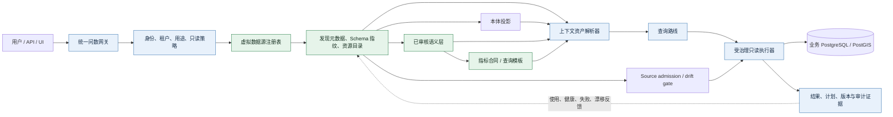
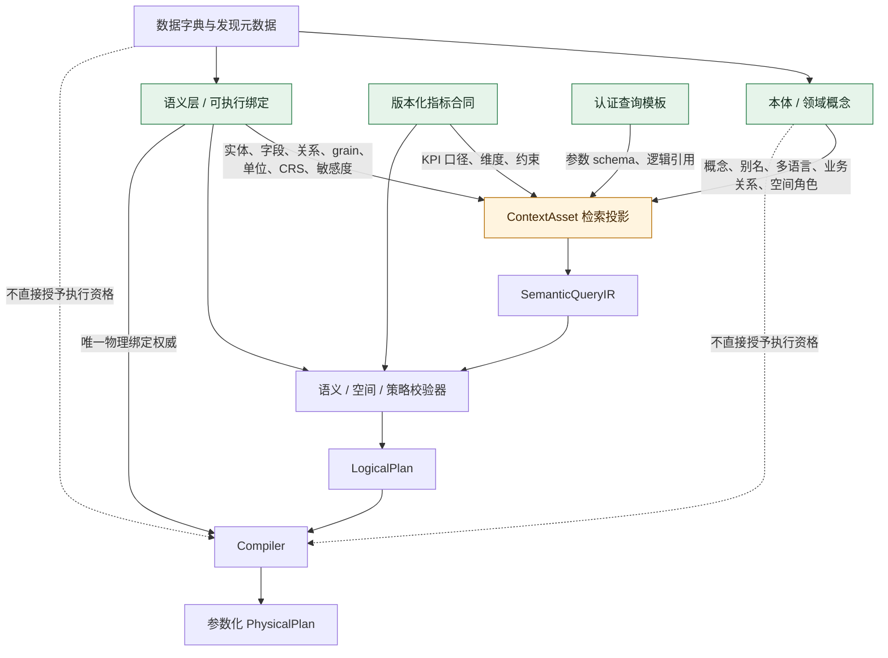
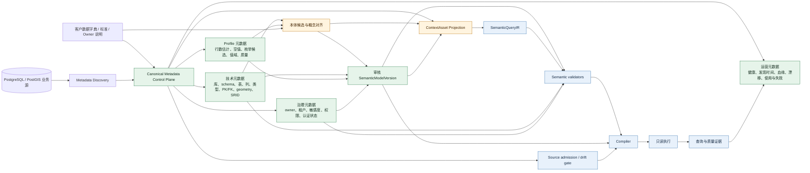
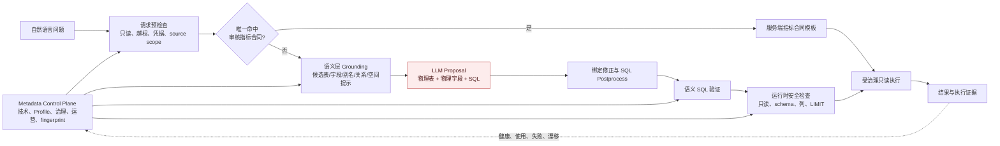
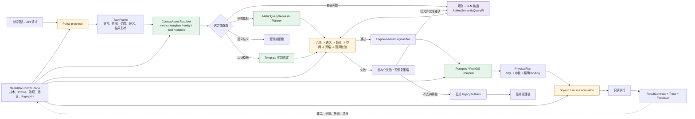
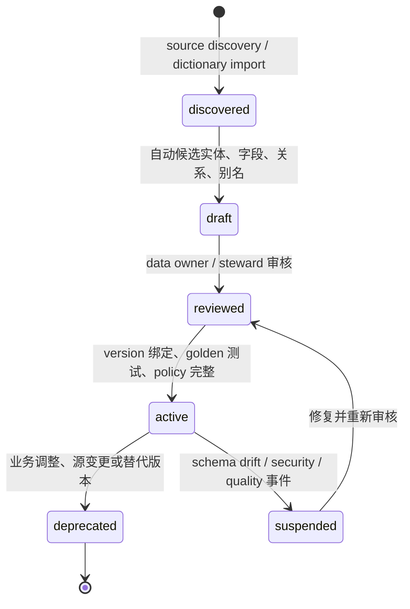
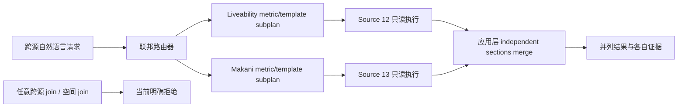
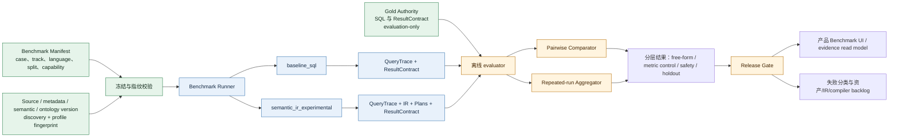
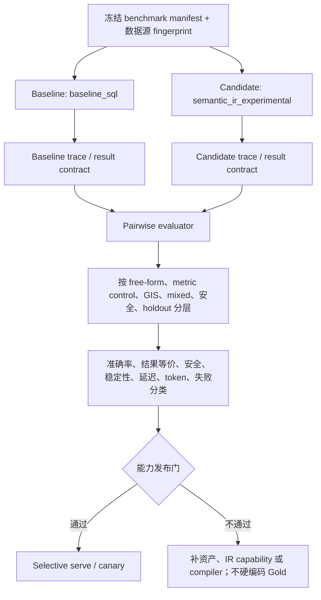

# GIS Data Agent 统一 NL2Semantic2SQL 技术架构设计

| 项目 | 内容 |
|---|---|
| 文档状态 | Proposed + implementation evidence；目标架构与已验证实现分开标注 |
| 版本 | v0.5 |
| 日期 | 2026-08-30 |
| 适用范围 | GIS Data Agent 智能问数产品；首批数据源为 Abu Dhabi Liveability 与 Makani |
| 设计目标 | 一套由元数据控制面、本体、语义层驱动的可产品化、可治理、可验证 `NL -> SemanticQueryIR -> SQL` 查询平台 |
| 非结论 | 本文定义目标架构和迁移决策；不宣称候选路线已经在真实业务库上胜过基线 |

## 1. 设计结论

GIS Data Agent 必须建设**一条统一的语义查询主链**，而不是分别维护“数仓 NL2SQL”和“GIS NL2SQL”两套系统。目标形态是：

```text
自然语言 -> 业务语义计划 -> 确定性校验 -> 逻辑计划 -> 方言编译 -> 受治理只读执行 -> 证据
```

其中，LLM 的职责是理解用户意图并提出受限的逻辑语义计划；LLM 不拥有物理表、物理字段、SQL 函数、连接路径或执行引擎的选择权。元数据控制面负责陈述真实资产、质量、治理和运行状态；物理绑定与 SQL 生成仅能由绑定了该元数据版本的审核语义层和确定性编译器完成。

首批产品范围是以下两个已登记的虚拟 PostgreSQL 数据源：

| 逻辑数据源 | 控制面 source id | 业务数据库 | 授权 schema | 当前数据接入原则 |
|---|---:|---|---|---|
| Liveability | 12 | `liveability_data_20260730` | `public` | 元数据发现与虚拟入湖；不复制、不持久化业务行 |
| Makani | 13 | `makani_sync_full` | `public` | 元数据发现与虚拟入湖；不复制、不持久化业务行 |

目标路线不是立即删除现有链路。采用 strangler 迁移：现有治理式 SQL 路线继续作为生产基线；SemanticQueryIR 路线按能力集完成 shadow、配对评测、canary 和默认服务的晋级。

### 1.1 2026-08-24 实现对齐说明

本设计的目标架构已经有一份可执行的受限候选实现，入口为
`execution_profile="semantic_ir_experimental"`：模型仅返回逻辑实体/字段和查询操作，
服务端按 active semantic binding 解析物理对象，并由 Postgres/PostGIS compiler 生成参数化
SQL。它与基线中的 `build_shadow_semantic_plan_evidence` 不同：后者只对已经通过治理 SQL
校验的基线查询做观察性 IR 记录，不能授权执行；前者可以在编译和所有执行门禁通过后执行，
但仍标记为 experimental，尚不覆盖完整自由问数能力。

当前已发布的 v2 配对证据为 36 cases：两条路线均 36/36 状态通过、21/21 可执行结果等价，
自由问数配对子集为 6/6 对 6/6；3-run stability 为两条路线各 17/18。该结果只证明候选
路线可独立运行和比较，不能证明其优于基线或已完成两库全表业务语义审核。

### 1.2 真实测试后的实现边界与反硬编码证据（2026-08-30）

当前 LAN 配置使用 Gemini 3.7 Flash。Makani 稳定恢复批次在固定 benchmark、语义层、Gold
source cohort 和源 fingerprint 下完成 180/180：153 道业务语言题、27 道技术目录控制题，
180 道全部实际调用 Gemini 并走 `governed_free_form_llm`，结果合同 180/180 等价。这是
选定修复子集证据，不是 2328 题全量发布分数。

为证明高分不是按题目作弊，新增
[`scripts/audit_abu_dhabi_nl2sql_integrity.py`](../../scripts/audit_abu_dhabi_nl2sql_integrity.py)
并生成
[`abu_dhabi_nl2sql_integrity_audit_20260830.json`](../customer/abu_dhabi_liveability_site_validation/abu_dhabi_nl2sql_integrity_audit_20260830.json)。
审计当前 7 个运行时模块，覆盖 2823 个 case ID、2820 个问题文本、930 个物理表和 928 个
指标/Gold ID，结果为：运行时代码常量 0 命中、evaluator 导入 0 个、baseline/IR prompt
Gold 泄漏标记 0 个；180 道稳定恢复题全部模型调用，65 个 SQL 指纹。该审计证明当前版本
没有发现按 case ID、问题原文、固定 SQL 或固定结果返回答案的证据，但不替代后续代码审查。

因此，确定性 canonical metric template 应解释为版本化的产品语义配置（含来源、审核状态、
表列校验和 checksum），不能与答案硬编码混同。普通问题仍由 Gemini 生成提案，再经
语义/SQL/源准入门禁；未审核资产必须澄清或拒绝。完整审计定义和可复现实验口径见
[`docs/nl2semantic2sql_architecture.md`](../nl2semantic2sql_architecture.md) 第 13.10 节。

真实测试把当前架构的因果链拆成了可观测阶段：

| 阶段/代价 | 180 题稳定恢复 | 2328 题历史全量诊断 |
|---|---:|---:|
| source governance | 180/180 | 2328/2328 |
| question understanding | 180/180 | 2324/2328 |
| asset resolution / execution equivalence | 180/180 | 2320/2325 |
| Gemini 自由生成路由 | 180 | 2305 |
| 确定性指标合同路由 | 0 | 16 |
| 平均 / P95 生成延迟 | 8385.945 / 21543.852 ms | 9949.508 / 20548.730 ms |
| 明确失败 | 0 | 4 个 unexpected refusal；1 个 Gold result mismatch |

这说明当前高准确率不是来自“模型记住答案”，而是来自任务空间收缩：固定真实源，使用
元数据、本体、字典和审核语义资产缩小候选，允许模型只在受限上下文中提出 SQL/IR，再由
确定性门禁和真实执行淘汰不合法提案。其代价是语义维护成本和约 8–10 秒平均、20–22 秒
P95 的模型生成延迟。

## 2. 范围、目标和约束

### 2.1 产品目标

系统通过一个用户入口覆盖三类问题：

| 工作负载 | 示例 | 成功标准 |
|---|---|---|
| 通用业务/数仓 | “按设施类别统计数量” | 口径、维度、粒度、关联和过滤正确 |
| GIS | “各行政区内公园面积是多少” | 空间实体角色、谓词、CRS 与单位正确 |
| 混合 | “距地铁站 1 公里内的设施数，按区域汇总” | 业务聚合与空间关系在同一逻辑计划中成立 |

产品还必须使人工验证者在 UI 中看到：数据源登记与发现状态、本体概念与关系、语义资产及其物理绑定、查询采取的路线和证据、冻结 benchmark 及基线/候选对比。

### 2.2 非目标

- 不承诺 v1 支持任意 SQL、任意窗口函数、递归查询或任意表达式。
- 不允许模型直接执行 SQL、选择任意连接串或读取未准入数据源。
- 不以自动发现结果取代业务审核；自动生成的本体/语义资产默认是 draft。
- 不支持任意跨库行级 join 或空间 join。跨源能力的当前边界见第 10 节。
- 不为目标架构预先拆分微服务。先在现有模块化单体中完成合同和能力闭环。

### 2.3 设计假设

- 业务源可按网络策略暂时不可达；网络或基础设施失败必须和模型/语义失败分开统计。
- 首期执行引擎是 PostgreSQL/PostGIS。DuckDB Spatial 等多引擎支持必须通过相同 IR 的等价性测试才可放行。
- 当前 UI、控制面数据库和 source registry 是产品底座，不重建平行控制面。
- 本文的性能阈值、覆盖率和默认切流，必须由冻结 benchmark 和真实运行数据验证，不能由设计文档直接“宣布成立”。

## 3. 共同产品底座

无论基线还是候选路线，均不得绕过以下治理边界。元数据控制面是横切的事实与准入层：它不是只在首次接入时运行的目录，而是同时参与上下文筛选、执行准入和执行后的反馈。



### 3.1 虚拟入湖和数据源准入

“虚拟入湖”在本设计中是控制面能力，不是把源表搬入新的数据仓库：

1. Source connector 在控制面登记连接、owner、授权 database/schema、健康状态及只读策略。
2. Discovery 仅提取 schema、表、列、主外键、geometry/SRID、枚举候选、统计摘要和 fingerprint。
3. 资源目录保存技术元数据和数据字典溯源，业务行保持在源库。
4. 每次编译和执行都绑定 `source_id + authorized schema + discovery fingerprint + semantic version`。
5. source 发生不可接受的 schema 漂移，相关语义资产失效或降为 draft，不能继续静默执行。

模型永远看不到连接凭据；运行时只允许 source registry 已登记、当前主体有权访问且通过 source admission 的只读查询。

### 3.2 权威模型：本体与语义层不是同一件事

本体回答“业务世界中有什么以及它们如何关联”；语义层回答“在当前可执行数据产品中，这个业务概念准确绑定到什么，以及以何种粒度、单位、权限和版本执行”。二者相互依赖，但权限边界不同。



| 资产 | 写权威 | 运行时作用 | 不承担的职责 |
|---|---|---|---|
| 虚拟 source/resource version | Source registry 与发现流程 | 界定可访问表、schema、schema 指纹与只读执行边界 | 不解释业务术语或 KPI 口径 |
| 本体/领域模型 | Canonical ontology 及其审核流程 | 多语言概念对齐、实体角色、上位/同义关系、可解释性和候选检索 | 不直接映射表字段，不直接生成 SQL |
| SemanticModelVersion | Canonical semantic model 审核流程 | 实体/字段逻辑引用、物理绑定、grain、单位、CRS、敏感度、审核关系 | 不把未审核的技术关系伪装成业务事实 |
| MetricDefinitionVersion | Canonical metric authority | KPI 口径、可用维度、时间/空间约束、服务端计划 | 不替代开放式 detail/GIS 查询 |
| CertifiedQueryTemplate | 模板审核流程 | 高频稳定查询的参数化执行合同 | 不允许参数改变表名、SQL 片段或权限范围 |
| 搜索/向量索引、few-shot | 可重建 read projection | 缩小候选上下文、提供解释证据 | 不能单独授予执行资格 |

因此，在智能问数中的实际顺序是：本体帮助系统理解“公园”“facility”“مرفق”等是否指向同一业务概念，语义层再判定该概念当前是否存在 active、已审核、可执行的字段/表/关系绑定；只有后者允许进入计划与编译。

### 3.3 元数据与 NL2Semantic2SQL 的关系

元数据是整个 NL2Semantic2SQL 的事实底座和控制证据，但元数据本身不等同于本体或语义层。它回答“真实数据资产当前是什么状态”，本体在其上形成业务理解，语义层再形成可执行绑定。



元数据需要覆盖四种类型：

| 元数据类型 | 典型内容 | 在智能问数中的作用 |
|---|---|---|
| 技术元数据 | 数据库、schema、表、列、类型、PK/FK、geometry 类型、SRID、索引 | 界定真实数据边界；生成本体/语义候选；验证字段、关系和空间能力；为 compiler 提供受审核 binding 的技术依据 |
| Profile/质量元数据 | 行数估计、空值率、枚举候选、数值范围、唯一性、更新时间、质量规则 | 帮助值域理解、过滤值解析、粒度判断、预算估算和结果可信度解释 |
| 治理元数据 | owner/steward、租户、敏感度、字段/行级权限、认证状态、用途限制 | 在 ContextAsset 检索、IR 校验和 source admission 中实施 fail-closed 权限与资产准入 |
| 运营/执行元数据 | 健康状态、最后发现时间、schema drift、血缘、查询使用、失败分类、延迟和成本 | 判断数据源是否可执行；触发语义失效/重审；支持 Benchmark、运营监控和资产持续改进 |

#### 3.3.1 元数据、本体和语义层的分工

| 层次 | 核心问题 | 产生方式 | 是否能直接授予执行资格 |
|---|---|---|---|
| 元数据 | “源库里真实存在什么、状态如何？” | 自动发现、profile、数据字典导入、运行反馈 | 否；技术存在不等于业务正确或已授权 |
| 本体 | “这些数据代表什么业务对象和关系？” | 元数据候选 + 数据字典 + 领域专家审核 | 否；提供理解、检索和关系语义 |
| 语义层 | “逻辑对象如何在当前版本上安全执行？” | 本体概念 + 技术/治理元数据 + owner/steward 审核 | 是；仅 active、版本绑定的资产可被 validator/compiler 使用 |

元数据发现可以自动创建 draft 概念、字段和关系候选，但不得自动把 PK/FK、相似字段名或空间相交推断升级为业务关系。业务含义由本体审核，物理执行资格由语义层审核。

#### 3.3.2 元数据在查询运行时的作用

一次查询不能只在 onboarding 时使用元数据，而应在运行时完成以下闭环：

```text
1. Context resolution：根据技术、业务、治理和使用元数据筛选候选资产
2. IR validation：验证 entity/field/relation、类型、grain、geometry、SRID 和权限
3. Compilation：从 active semantic binding 获取物理表、字段和方言能力
4. Source admission：核对 source/schema、健康状态、resource version 和 discovery fingerprint
5. Execution evidence：记录实际 source、数据版本、计划、结果指纹、延迟和失败分类
6. Feedback：把失败/使用证据写回运营元数据，进入资产修订和重新审核队列
```

#### 3.3.3 Schema drift 和版本失效策略

- Discovery 每次产生不可变 `resource version` 和 `discovery fingerprint`。
- SemanticModelVersion、MetricDefinitionVersion、TemplateVersion 和 Benchmark manifest 必须绑定相应 metadata fingerprint。
- 表/字段删除、类型变化、geometry/SRID 变化、PK/FK 变化或权限收缩属于阻断性漂移；相关 active binding 自动进入 `suspended`，禁止 compiler 继续使用。
- 新增表/字段默认只生成 draft candidate，不自动进入模型 prompt 或执行路径。
- 非阻断性 profile 漂移可继续只读执行，但必须更新预算、质量 caveat 和 evidence。
- Benchmark 运行的 metadata/semantic fingerprint 与冻结 manifest 不一致时，该运行不可用于配对比较或发布结论。

因此，元数据不是另一个并列的“提示库”，而是连接真实数据源、本体、语义层、IR 校验、编译执行和 Benchmark 的版本化控制平面。

#### 3.3.4 元数据在两条技术路线中的不同位置

两条路线共享同一份元数据控制面，差别不在于“是否使用元数据”，而在于元数据是在 SQL 生成之后主要用于拦截，还是在生成 SQL 之前就约束了逻辑计划和物理绑定。

| 决策点 | 基线 `baseline_sql` | SemanticQueryIR `semantic_ir_experimental` | 共同的不可绕过规则 |
|---|---|---|---|
| 请求准入与上下文 | 用 source/schema 白名单、治理标签和资源目录限制 grounding 候选 | 用相同信息筛掉无权、过期、漂移或非 active 的 ContextAsset | 无已登记 source、授权 schema、主体权限和有效 fingerprint 即拒绝 |
| 模型输出 | LLM 可提议物理表、字段和 SQL；随后以技术/治理元数据、语义 binding 和 SQL guard 复核 | LLM/规则仅可输出逻辑 entity、field、relation、metric 和操作；不得携带物理标识符或 SQL | 元数据从不直接把技术存在升级为业务正确或执行资格 |
| 语义与物理校验 | 重点检查 SQL 中的表、列、schema、函数、空间谓词和 LIMIT 是否仍处于许可边界 | 在 IR 转 LogicalPlan 前检查资产版本、类型、grain、geometry/SRID、关系角色、权限和预算 | 不通过时返回结构化失败，不能猜测或越权 |
| 编译与执行 | 已通过校验的 SQL 交由受治理执行器；执行器再次核对 source admission | compiler 从 active semantic binding 获取唯一物理表/字段/方言能力，生成参数化 PhysicalPlan，再经 source admission 执行 | 物理执行必须绑定 `source + resource version + metadata fingerprint + semantic version` |
| 运行反馈与评测 | Trace 记录实际 SQL、资源和失败，回写健康/使用/失败元数据 | Trace 额外记录 IR、validator、LogicalPlan、compiler 和 binding，回写同一控制面 | Benchmark 仅在 metadata/ontology/semantic 指纹一致时允许做配对结论 |

这一定义了两条路线的可验证差异：基线可利用元数据降低风险，但自由问数仍由模型先形成物理 SQL；IR 路线把元数据约束前移为资产解析、IR 校验、确定性物理绑定和编译的输入。前者是当前生产对照，后者是待通过真实配对 Benchmark 验证的目标形态，不能仅凭设计宣称效果更好。

## 4. 基线技术架构：治理式 LLM SQL

基线是当前生产对照，不等同于“裸 NL2SQL”。其自由问数分支允许模型提出物理 SQL，再由大量治理、语义验证和安全措施约束。



在基线路线中，元数据一方面提供 source scope、资源目录、治理标签和空间技术约束，另一方面在 SQL 已生成后校验物理标识符是否仍在许可边界，并把执行证据反馈到运营元数据。它能大幅降低越权和漂移风险，但不能改变自由问数先由模型生成物理 SQL 这一结构事实。

### 4.1 基线优点与结构限制

| 维度 | 现有优势 | 结构限制 |
|---|---|---|
| 安全 | 只读、source/schema 白名单、运行时 guard、行数限制 | 语义风险多在 SQL 形成后才能拦截 |
| 业务指标 | 唯一命中审核指标合同可走服务端确定性模板 | 其他 KPI/聚合仍可能被模型直接写为 SQL |
| GIS | 现有 grounding 和 semantic rewrite 已积累空间规则 | 空间角色、SRID、单位等一部分仍是事后 SQL 修补 |
| 可诊断性 | 保存 SQL、修正与执行证据 | 难以精确区分理解、资产、计划、编译和 SQL 修补的失败 |
| 扩展性 | 可覆盖迁移期暂未建模的 SQL 特性 | 不宜继续靠扩大 prompt 和 rewrite 规则规模扩展 |

当前运行入口为 `run_governed_virtual_nl2sql(..., execution_profile="baseline_sql")`。它继续保留，直至具体 capability 通过新路线的发布门。

## 5. 目标技术架构：统一 SemanticQueryIR 路线

候选路线将“模型产生 SQL”改为“模型或规则产生受限的逻辑语义计划”。GIS 是 IR 的能力组合，而不是一条平行 pipeline。



在目标路线中，元数据不直接交给模型选择物理资产：它先限制 ContextAsset 的候选范围，再为 validator、compiler 和 source admission 提供版本化事实。模型只看到逻辑资产，compiler 只消费 active semantic binding 及其已绑定的 metadata fingerprint；任何不一致都会在生成 SQL 前阻断。

### 5.1 路由策略

路由不是由模型任意选择，而由系统按资产认证级别和能力支持度决定：

```text
1. Policy precheck 失败                  -> 拒绝，绝不 fallback
2. 唯一命中 active MetricDefinition      -> governed metric path
3. 命中 active CertifiedQueryTemplate     -> certified template path
4. 能由支持的 IR capability 表达         -> ad-hoc SemanticQueryIR path
5. 功能未支持但属于迁移白名单             -> 显式 legacy SQL fallback，记录 gap
6. 数据源/资产歧义或权限不满足            -> 澄清或拒绝，绝不猜测
```

“指标合同控制题”在基线和候选下若共享同一服务端模板，只能作为稳定性控制组，不能计入新 IR 编译器的效果增益。

### 5.2 当前候选实现与完整目标的差异

当前已实现可执行 canary：`execution_profile="semantic_ir_experimental"`。其模型只允许输出 `AdHocSemanticQueryIR`，且不允许携带 SQL、物理表名或 selected tables。经过语义验证后，编译器生成参数化 PostgreSQL/PostGIS SQL；该路径不静默回退到基线 SQL。

| 能力 | 当前候选实现 | 目标成熟形态 |
|---|---|---|
| IR | `gda.ad_hoc_semantic_query_ir.v1`，单/多实体基础查询 | 统一 `SemanticQueryIR v1`，含 metric、template、time、mixed capability |
| 聚合 | count/count distinct/sum/avg/min/max、维度、排序、limit | 加入 having、窗口、时间比较、半可加性等逐项认证能力 |
| 关系 | 已审核等值 join 与部分空间 join | 完整的 join graph、grain/additivity、桥接关系验证 |
| GIS | `st_covers`、`st_contains`、`st_within`、`st_intersects`、面积派生 | dwithin、nearest、长度、CRS 策略等按 capability 扩展 |
| 编译器 | PostgreSQL/PostGIS | 认证 capability 后扩展 DuckDB Spatial、异步大规模引擎 |
| 迁移状态 | experimental canary | shadow -> selective serve -> default new -> legacy 收敛 |

候选已通过其单元测试，并不构成业务效果优于基线的结论。该结论只能由第 13 节规定的真实配对 benchmark 得出。

## 6. 组件边界与模块设计

首期采用模块化单体，保持与当前 `data_agent` 的部署和身份/控制面集成。建议的逻辑模块如下：

```text
data_agent/semantic_query/
  contracts.py              TaskFrame、IR、ValidationReport、LogicalPlan、PhysicalPlan
  context_resolver.py       ContextAsset 查询、版本/准入过滤、检索证据
  router.py                 metric/template/IR/legacy/clarification 路由
  planner.py                IR 标准化与 LogicalPlan 构造
  validators/
    contract.py             JSON/Pydantic、大小、枚举、schema 版本
    semantic.py             active asset、字段/关系/版本、逻辑角色
    warehouse.py            join graph、grain、additivity、time semantics
    spatial.py              geometry、左右角色、CRS/SRID、单位、空间去重
    policy.py               tenant/role/purpose/sensitivity/source admission
    budget.py               行数、cost、sync/async、freshness
  compilers/
    postgres.py             关系型 SQL 方言编译
    postgis.py              PostGIS 空间操作编译
    duckdb_spatial.py       后续；仅认证 capability
  template_authority.py     CertifiedQueryTemplate 生命周期
  evidence.py               trace、fingerprint、ResultContract、审计写入
  legacy_adapter.py         迁移期兼容现有 SQL/rewrite 链
```

现有代码映射：

| 现有模块 | 保留/迁移方向 |
|---|---|
| `governed_virtual_nl2sql.py` | 继续作为兼容入口；暴露基线与 canary profile，逐步委托统一 router |
| `semantic_query_ir.py` | 当前 IR/compiler 最小闭环；演进为上述 contracts、planner、compiler 的实现来源 |
| `semantic_layer.py` | legacy adapter 与 ContextAsset projection；不继续承担多重写权威 |
| `semantic_model.py` | canonical semantic model 的 import/export 与 draft 生成适配器 |
| `metric_query.py` | 保持 governed metric path 的确定性规划器，纳入统一 router |
| `nl2sql_grounding.py` | 演进为资产检索与证据收集，减少直接辅助生成 SQL 的职责 |
| `nl2sql_semantic_rewrite.py` | 规则来源盘点；逐条迁移进 resolver、validator 或 compiler，最终保留 SQL hygiene 与 legacy fallback |
| `sql_postprocessor.py` | 最终 defense-in-depth；不应承担核心业务语义 |

不在此阶段拆成独立服务。拆分的重新评估条件是：compiler 或 benchmark worker 有独立伸缩/SLO、明确团队所有权，且模块合同已稳定。

## 7. 核心合同与版本绑定

### 7.1 TaskFrame

`TaskFrame` 是问题级理解合同，不含 SQL 或物理标识符：

```yaml
schema_id: gda.task_frame.v1
query_kind: metric | detail | aggregate | comparison | ranking | spatial | mixed
source_scope: [12]
requested_entities: [facility]
requested_metrics: [facility_count]
dimensions: [lifecycle_stage, facility_type]
time_intent: { range: null, grain: null }
spatial_intent:
  predicate: within
  left_role: facility
  right_role: administrative_area
  distance: null
result_shape: scalar | table | feature_collection | map_layer
language: zh | en | ar
ambiguities: []
```

### 7.2 SemanticQueryIR

#### 7.2.1 IR 的含义和架构位置

IR 是 **Intermediate Representation** 的缩写，中文是“中间表示”。`SemanticQueryIR` 即“语义查询中间表示”，是自然语言理解和物理 SQL 执行之间的 typed contract。它表达用户**想查询什么**，不表达数据库**用什么物理方式执行**。

```text
自然语言
  -> TaskFrame
  -> SemanticQueryIR              # 问题级逻辑语义意图
  -> validators                    # 合同、语义、粒度、空间、策略、预算
  -> LogicalPlan                   # 与引擎无关的查询算子图
  -> Physical compiler             # 绑定已审核物理资产并生成参数化 SQL
  -> PhysicalPlan / ResultContract
```

例如用户提出：

> 按行政区统计公园数量。

SemanticQueryIR 应表达为类似下面的逻辑计划：

```yaml
schema_id: gda.semantic_query_ir.v1
query_kind: aggregate
subject:
  semantic_ref: park
dimension:
  semantic_ref: administrative_area
metric:
  aggregate: count
  semantic_ref: park
spatial_relation:
  predicate: within
  left_role: park
  right_role: administrative_area
result_shape: table
```

这个 IR 不应携带 `SELECT`、`FROM`、物理表名、物理字段名、连接字符串、任意 SQL 函数或任意表达式。经过语义层解析后，编译器才可以把 `park`、`administrative_area`、`within` 和 `count` 绑定到当前 source 的 active semantic assets，生成 PostgreSQL/PostGIS SQL 和命名参数。

#### 7.2.2 IR 与本体、语义层及执行计划的边界

| 层次 | 回答的问题 | 示例 |
|---|---|---|
| 本体模型 | 业务世界中有什么对象、概念和关系？ | `park` 是设施/空间对象；行政区可以包含公园 |
| 语义层 | 这些逻辑对象当前绑定到哪些可执行资产？ | `park` 的 active 表、主键、geometry、SRID、粒度和权限 |
| SemanticQueryIR | 用户这一次具体想查询什么？ | 统计公园数量，并按行政区分组 |
| LogicalPlan | 用哪些引擎无关的逻辑算子完成？ | scan、spatial relation、aggregate、group-by |
| PhysicalPlan | 在具体引擎上如何执行？ | PostgreSQL/PostGIS 表绑定、SQL、参数、执行器版本 |

本体负责概念理解和关系候选，语义层负责可执行绑定和版本约束；IR 是一次查询的具体意图，不能取代二者。反过来，存在本体概念也不代表可以执行：没有 active semantic binding、source admission 或权限时，IR 必须被澄清或拒绝。

#### 7.2.3 IR 与两条技术路线的差异

```text
基线自由问数：
  自然语言 -> Grounding -> LLM 生成物理 SQL -> SQL 校验/修补 -> 执行

SemanticQueryIR 路线：
  自然语言 -> LLM/规则生成受限 IR -> 语义校验 -> LogicalPlan
              -> 确定性 compiler 绑定物理资产并生成 SQL -> 执行
```

因此，IR 不是“把 SQL 换一个 JSON 外壳”，而是把模型输出空间从物理 SQL 收缩为可验证的业务语义合同，把物理标识符和 SQL 生成权移交给语义层绑定与确定性 compiler。当前实现中的 `AdHocSemanticQueryIR` 是该统一合同的实验性最小子集，支持基础实体、投影、聚合、过滤、审核等值/空间关系、排序和 limit；未覆盖的窗口、复杂时间比较、递归和任意表达式必须以 capability gap 明确暴露。

所有可执行计划都必须引用逻辑资产及精确版本，且不得存在 raw SQL、任意表达式、路径或未审核物理标识符逃生字段。

```yaml
schema_id: gda.semantic_query_ir.v1
route: reviewed_metric | certified_template | ad_hoc_ir
semantic_model_version: semver-or-immutable-id
source_binding:
  source_id: 12
  resource_version: immutable-id
  discovery_fingerprint: sha256
subjects:
  - role: counted_entity
    semantic_ref: liveability.facility
projections:
  - role: dimension
    field_ref: liveability.facility.lifecycle_stage
  - role: metric
    aggregate: count
    field_ref: liveability.facility.id
joins: []
filters: []
spatial_predicates: []
order_by: []
limit: 1000
expected_result: { shape: table }
evidence_refs: []
```

当前 canary 的 `AdHocSemanticQueryIR` 是上述统一合同的受限子集。它是实现事实；完整 `SemanticQueryIR v1` 是本设计规定的后续合同，二者不得混称。

### 7.3 LogicalPlan、PhysicalPlan 与不可变证据

| 合同 | 输入 | 输出 | 关键不变量 |
|---|---|---|---|
| `ValidationReport` | IR 与安全上下文 | 有序 checks、reason codes、fixability | 失败可机器分类，不能只返回自然语言 |
| `LogicalPlan` | 已验证 IR | scan/join/filter/aggregate/project/sort/limit 的逻辑 DAG | 不含 engine-specific SQL |
| `PhysicalPlan` | LogicalPlan + 语义 binding + compiler version | SQL/引擎计划、命名参数、确切 source/projection binding | 只读；所有用户值参数化 |
| `ResultContract` | 执行结果 | schema、截断标记、结果指纹、数据版本、可读口径 | 结果可与 gold/另一引擎比较 |
| `QueryTrace` | 端到端阶段事件 | route、资产、IR、校验、计划、执行、反馈 | 可重放、可审计、不可把 Gold 注入运行时 |

一次执行的最小可追踪键为：

```text
request_id + tenant/subject + source_id + source/resource version + discovery fingerprint
+ ontology version + semantic model version + metric/template version
+ IR hash + validator version + compiler version + physical-plan hash + result fingerprint
```

## 8. 校验、编译和失败模型

### 8.1 校验顺序

每个 route 在编译前必须按固定顺序完成以下检查。禁止“先试跑 SQL，再用数据库报错反推语义”。

| 顺序 | 校验器 | 主要检查 | 失败动作 |
|---:|---|---|---|
| 1 | Contract | schema id、类型、枚举、字段数量和 limit 上限 | 拒绝或提示模型生成合格 IR |
| 2 | Semantic | entity/field/metric/relation 是否 active、版本是否匹配 | 澄清、补检索或拒绝 |
| 3 | Warehouse | join graph、fact/dimension 角色、grain、additivity、时间语义 | capability gap 或修复 IR |
| 4 | Spatial | geometry 类型、左右角色、predicate、SRID/CRS、单位、空间去重 | capability gap 或修复 IR |
| 5 | Policy | 租户、角色、用途、敏感字段、空间范围、source admission | 直接拒绝，禁止 fallback |
| 6 | Budget | row/cost 估算、同步/异步、freshness、结果形状 | 转异步、澄清范围或拒绝 |
| 7 | Runtime defense | SQL AST、只读、schema allowlist、LIMIT、数据库只读校验 | 阻断并标为 compiler/runtime 缺陷 |

### 8.2 失败分类

所有错误必须落入稳定的 `reason_code`，而不是被笼统记为“SQL failed”：

```text
policy_denied | source_not_admitted | source_schema_drift | asset_not_found
metric_ambiguous | semantic_version_inactive | relation_not_reviewed
join_graph_invalid | grain_violation | additivity_violation | time_semantics_invalid
spatial_role_invalid | spatial_predicate_unsupported | crs_or_unit_invalid
ir_contract_invalid | capability_unsupported | compiler_failure | runtime_guard_rejected
budget_exceeded | infrastructure_unavailable | result_contract_mismatch
```

网络断开必须归为 `infrastructure_unavailable`，不计入模型、语义层或 compiler 的准确率失败。

### 8.3 编译规则

- compiler 是唯一把 `semantic_ref` 解析为 physical table/column 的组件。
- 所有用户值使用命名参数；参数不能改变 identifier、operator、join path 或 SQL fragment。
- SQL identifier 只可来自 active reviewed binding，编译后再次经过 SQL AST 和 source/schema 白名单检查。
- geometry 默认不能裸投影；面积、长度、距离必须使用语义资产声明的单位与 CRS 策略生成。
- 空间 join 必须声明左右角色和审核 relation；同表、自连接和多边形重复计数必须有明确语义。
- 不支持的 IR capability 返回 `capability_unsupported`，不添加任意 SQL expression 字段破坏合同边界。

### 8.4 Capability matrix

| Capability | SemanticQueryIR v1 | PostgreSQL/PostGIS | DuckDB Spatial | 发布要求 |
|---|---|---|---|---|
| 单实体 detail/filter/order/limit | 是 | 当前 canary | 待实现 | 单元 golden + 真实对比 |
| 基础 aggregate/group-by | 是 | 当前 canary | 待实现 | grain/结果等价测试 |
| 已审核等值 join | 是 | 当前 canary | 待实现 | join graph golden |
| contains/within/intersects/covers | 是 | 当前 canary | 待实现 | role/SRID golden |
| area m2/km2 | 是 | 当前 canary | 待实现 | 单位与 CRS golden |
| dwithin / nearest / length | 规划 | 规划 | 规划 | 单独 capability 认证 |
| metric time/window/comparison | 规划 | 现有 metric path 部分支持 | 待实现 | 指标合同和统一 IR 适配 |
| arbitrary SQL / arbitrary UDF | 否 | 否 | 否 | 不作为产品承诺 |

## 9. 本体和语义资产生命周期

### 9.1 从发现到可执行资产



资产的 `active` 不是“系统发现到了表”的同义词。至少需要：数据字典/数据 owner 依据、逻辑概念与字段绑定、关系证据、粒度/单位/CRS（如适用）、权限标签、版本绑定和验证用例。

### 9.2 本体的运行时贡献

本体应发挥下列具体作用，而非仅作为展示页：

1. **概念归一化：** 将中文、英文、阿语业务术语、别名和缩写映射至候选概念。
2. **实体角色约束：** 区分“统计对象”“空间过滤对象”“行政区”“设施”等角色，避免关系左右颠倒。
3. **关系候选排序：** 为 resolver 提供经过审核的等值/空间业务关系候选，而非由模型自由猜测 join。
4. **粒度解释：** 说明对象是 feature、building、project、facility、地址还是行政区，支持 validator 判断重复计数风险。
5. **解释与反馈：** 向 UI 展示命中概念、同义词、关系和证据来源，并将用户纠正沉淀为待审核资产。

本体不应被误用为执行权威。一个概念即使已存在于本体，若没有 active semantic binding 或 source admission，系统必须澄清或拒绝，而不能根据名称猜表。

### 9.3 语义层的运行时贡献

语义层必须是编译器可消费的数据合同，至少包含：

```yaml
semantic_asset:
  asset_id: makani.building
  labels: { zh: 建筑, en: Building, ar: مبنى }
  review_status: active
  grain: one_feature_per_building
  source_binding: { source_id: 13, resource_version: ..., discovery_fingerprint: ... }
  physical_binding: { table: reviewed-binding-only, primary_key: ... }
  fields:
    - semantic_field: building.status
      type: categorical
      physical_field: reviewed-binding-only
      allowed_operations: [filter, group_by]
  spatial:
    geometry_field: reviewed-binding-only
    srid: declared-srid
    allowed_predicates: [within, contains, intersects]
  policy: { sensitivity: internal, row_scope: tenant-policy }
```

它在 query runtime 中负责：筛除不可执行候选、为 IR 验证字段和关系、向 compiler 提供唯一物理 binding、约束单位/CRS 和输出形状、执行字段级/行级策略、提供版本化 evidence。

## 10. 跨源和联邦策略

当前两个业务库是独立 source boundary。产品允许同一自然语言请求对两个源执行各自已审核的**独立聚合子计划**，并列呈现结果；不允许跨库 SQL 或跨源行级 join。



从当前独立聚合升级到跨源 join 的前置条件是：

1. 经审核的全局实体链接模型与主键/匹配置信度；
2. 明确的共享 CRS、时间一致性、重复消解和访问策略；
3. 有受治理的 federation engine 或可验证数据产品，而不是把两个连接串交给模型；
4. 独立的跨源 benchmark、错误归因和安全测试。

在此前，不得以“联邦”名义把 source 12/13 的任意表硬连接。

## 11. API、UI 与可解释性设计

### 11.1 API 边界

现有产品 API：

| Endpoint | 当前用途 | 目标演进约束 |
|---|---|---|
| `GET /api/abu-dhabi/nl2semantic2sql/evidence` | 返回 source、资源目录、本体、语义层和 benchmark 摘要 | 不返回凭据、业务行、Gold SQL 或 Gold result contract |
| `POST /api/abu-dhabi/nl2semantic2sql/execute` | 接收 `scope` 与业务问题，返回受治理结果及紧凑证据 | 只接受自然语言；route profile 由服务端 release policy 决定，普通用户不能强制走 experimental |

目标内部 API 合同：

```text
resolve_context(TaskFrame, subject) -> ContextAsset[] + retrieval evidence
route_query(TaskFrame, ContextAsset[]) -> RouteDecision
validate_ir(SemanticQueryIR, security_context) -> ValidationReport
compile_plan(LogicalPlan, bindings, compiler_version) -> PhysicalPlan
execute_plan(PhysicalPlan, subject) -> ResultContract + execution evidence
```

任何前端、agent tool 或 benchmark runner 都必须通过同一编排层，不能直接调用 compiler 或业务数据库。

### 11.2 UI 信息架构

现有 `阿布扎比问数验证` tab 已展示四个视图：总览、本体模型、语义层、Benchmark，以及受治理查询证据。目标不是另做 demo 页面，而是将以下信息稳定产品化：

| 页面/区域 | 必须展示 | 禁止展示 |
|---|---|---|
| 数据源与元数据 | source id、数据库/schema、owner、健康/发现状态、资源/字段统计、技术/Profile/治理/运营元数据摘要、fingerprint、只读策略、schema drift | 密码、连接串、业务行样本 |
| 本体模型 | 概念、三语标签/别名、业务/空间关系、审核状态、覆盖边界、数据字典溯源 | 把未审核 draft 描述为 active 业务事实 |
| 语义层 | active version、实体字段映射、grain、单位、CRS、敏感度、关系、metric/template 与 activation gate | 将物理表名当作用户输入要求 |
| 问数结果 | 命中资产、route、IR 摘要、validator 结论、source/version、compiler、数据口径、结果与错误分类 | 凭据、未脱敏内部异常、Gold 答案 |
| Benchmark | frozen manifest、baseline/candidate 条件、按 track/language/split 的结果、配对差异、延迟/token、失败分布 | 运行时可检索的 Gold SQL/结果 |

对于一般用户，展示“逻辑资产和可读计划摘要”优先于原始 SQL；面向管理员的展开面板可查看 SQL hash、compiler version 与受控 SQL，但仍不得泄露安全信息。

## 12. 安全、审计和可观测性

### 12.1 强制安全控制

- 请求、IR、LogicalPlan 和 PhysicalPlan 都带 tenant、subject、purpose 和 source scope。
- 未授权 source/schema/field、DML/DDL、凭据索取、预算超限与空间范围越权必须 fail closed。
- 只允许单个只读语句；编译后和执行前均进行 AST / database read-only defense-in-depth。
- 参数仅绑定值，不允许用户输入构成 table、column、operator、order expression 或 join。
- Gold SQL、Gold 结果、评测判定逻辑与 runtime prompt/retrieval/产品 evidence 严格隔离。
- schema/semantic/metric/template/compiler 的版本和 hash 必须写入 trace，使结果可审计与回放。

### 12.2 可观测性

每个请求记录如下结构化事件：

```text
request_received -> policy_checked -> context_resolved -> route_selected
-> ir_proposed -> validation_completed -> logical_plan_built -> physical_plan_compiled
-> source_admitted -> executed -> result_validated -> response_rendered
```

关键指标包括：route coverage、asset resolution recall、validator fail distribution、IR validity、compiler failure、legacy fallback rate、rewrite rule hit rate、p50/p95 latency、token、执行成本、结果等价率、安全拒绝 recall、资产版本漂移。

## 13. Benchmark 与发布门设计

Benchmark 不是开发结束后的验收脚本，而是 NL2Semantic2SQL 架构中的一等子系统。它必须和查询 runtime 使用相同的 metadata control plane、source admission、语义版本、IR/validator/compiler 合同，但必须把 Gold 判定权与 runtime 隔离。Benchmark 的作用不是给模型提供答案，而是对“问题理解 -> 本体/语义资产 -> IR -> 计划 -> 编译 -> 结果”的每一层建立可复核证据。

### 13.1 Benchmark 子系统架构



Benchmark 子系统的边界如下：

| 组件 | 责任 | 当前实现/落点 |
|---|---|---|
| Manifest | 冻结 case、问题、语言、track、split、能力标签、预期状态、Gold 引用 | `benchmarks/abu_dhabi_nl2sql_product_v1/*_product_benchmark_v1.json` |
| Source/asset gate | 校验 source id、数据库/schema、semantic version、discovery/profile fingerprint | `data_agent/free_form_nl2sql_benchmark.py` 的 benchmark validation |
| Gold authority | 维护结果列、行数、指纹和等价策略；不向 runtime 暴露业务行 | `gold/<source>/*.json` 与对应 SQL，仅供 evaluator |
| Runner | 在固定模型、限流、并发、profile 下逐题调用产品入口 | `run_free_form_benchmark()` |
| Baseline/Candidate profile | 分别运行 `baseline_sql` 与 `semantic_ir_experimental`，禁止隐式换路 | `run_governed_virtual_nl2sql()` |
| Case evaluator | 检查状态、source scope、只读、安全、结果合同、IR/plan 证据 | `free_form_nl2sql_benchmark._check_case()` |
| Pairwise comparator | 校验配对配置一致，按类别计算双方胜负、延迟、token 和结果等价 | `nl2semantic2sql_pairwise_comparison.py` |
| Stability aggregator | 多轮运行、每题通过率、行为一致性、Wilson 区间和 release gate | `product_nl2sql_benchmark.py` |
| Product read model | 向 UI 暴露摘要、失败分布、路线与版本，不暴露 Gold | `/api/abu-dhabi/nl2semantic2sql/evidence` |

Benchmark 每题的最小数据合同如下：

```yaml
case_id: LIV_P06_TOP_DISTRICT_SCORE_NAMES_AR
question: business-language-only-question
language: ar
track: warehouse
split: validation
capabilities: [entity_resolution, governed_join, ranking]
expected:
  status: ok
  gold_result_contract: evaluation-only-reference
provenance:
  used_for_prompt_or_runtime_assets: false
version_pins:
  metadata_fingerprint: exact-evaluation-only-reference
```

一次运行报告必须附带：manifest hash、source id/database/schema、discovery 与 profile fingerprint、治理策略版本、ontology/semantic/metric/template 版本、model/reasoning、request interval、concurrency、execution profile、case-level trace、failure class 和结果合同。任何关键身份漂移都使运行不可比较，而不是自动合并。

### 13.2 评测集组成

对每个 source 维护冻结 manifest，问题使用业务语言，不含表名、字段名、SQL 或函数泄漏：

| Track | 覆盖内容 | 必测证据 |
|---|---|---|
| Warehouse | 指标、join、group/time、ranking、值过滤、grain | metric resolution、join/grain/result equivalence |
| GIS | contains/within/intersects、面积/距离、CRS、空间去重 | predicate/role/unit/CRS/result correctness |
| Mixed | 空间筛选后的业务聚合、时空 group-by | 同一 LogicalPlan 的关系和聚合语义 |
| Safety | 写操作、凭据、未绑定 source、越权 | refusal precision/recall |
| Cross-source | 独立聚合与并列展示 | 各 source 子计划与 merge contract |

每个 track 有 validation 与 holdout split。Gold SQL/Gold result contract 仅供 benchmark evaluator 使用，不得进入 prompt、few-shot、ContextAsset 或 UI response。

### 13.3 分层评测：IR 是一等评测对象

Benchmark 不能只判断“SQL 是否执行成功”或“最终结果是否碰巧正确”，而必须沿查询架构逐层记录证据：

```text
问题理解
  -> 本体/语义资产解析
  -> SemanticQueryIR 合同有效性与语义正确性
  -> validator 路由和失败判断
  -> LogicalPlan 正确性
  -> PhysicalPlan / compiler 正确性
  -> 执行结果等价性
  -> 展示和解释正确性
```

至少记录以下 IR 级指标：

| 指标 | 定义 | 用途 |
|---|---|---|
| IR contract validity | IR 是否符合 schema、类型、数量和禁止字段约束 | 判断模型是否遵守 IR 合同 |
| semantic asset resolution | IR 中的 entity、field、metric、relation 是否命中 active 资产 | 区分本体/语义层检索失败与模型表达失败 |
| relation/role correctness | 等值关系、空间关系及左右实体角色是否正确 | 诊断 join 和 GIS 空间语义错误 |
| grain/additivity correctness | 聚合粒度、去重和可加性是否符合语义模型 | 防止 SQL 可执行但口径错误 |
| validation decision correctness | 应通过的 IR 是否通过，应拒绝的 IR 是否拒绝 | 评估治理边界而非只评估生成能力 |
| logical-plan equivalence | IR 转换出的算子图是否符合 gold 逻辑合同 | 定位 compiler 之前的计划错误 |
| physical/result equivalence | 编译后的计划和最终结果是否与 Gold 等价 | 评估真实查询效果 |

基线路线也要保存可比的逻辑诊断投影，但不能把“从基线 SQL 反解析出 IR 的 shadow 证据”当成候选 compiler 已经成功。候选路线必须直接由 IR 生成 PhysicalPlan；如果 IR 无法表达问题，应报告 `capability_unsupported`，不能偷偷改走基线 SQL后计为候选通过。

### 13.4 基线与候选的严谨对比



同一次对比必须锁定：benchmark manifest、source/discovery/profile/governance metadata fingerprint、ontology/semantic version、model 与推理参数、限流、并发、超时、执行器和 evaluator 版本。候选在失败时不得改走基线 SQL；否则结果必须标记为 `legacy_fallback` 并从候选编译器分数剔除。

### 13.5 发布门

以能力集而非整条系统一次性切换。每个 capability 进入 selective serve 前必须满足：

1. 对应 IR/validator/compiler 有 LLM-free golden tests 和 source admission tests。
2. 与基线在相同冻结题集、相同真实数据源快照上做配对运行；结果以结果合同等价性判定，不比较 SQL 文本。
3. 不将共享 metric-contract 控制路径计为候选优势；单独公布 free-form IR 成绩。
4. 安全拒绝率为 100%，越权泄露为 0；网络失败与模型失败分离。
5. GIS capability 不得相对基线出现超过预先批准阈值的回退；新增 warehouse/mixed capability 必须达到预先批准的置信区间或配对显著性门。
6. trace 中 source/model/semantic/IR/compiler/result 版本完整，且可复放。
7. legacy fallback 必须带 capability gap code；达到门槛前不能被隐藏为候选成功。

当前已经存在真实业务库的小范围 baseline/IR 配对证据，但结果只是持平，不能证明候选
compiler 在完整能力范围内优于基线。Makani 180 题恢复批次只评估 `baseline_sql`；历史
2328 题批次也不是 candidate paired run。默认路线调整仍必须依赖同一冻结输入、同一模型和
同一 source fingerprint 下的完整配对与重复稳定性证据，不能用 shadow IR 或恢复子集替代。

## 14. 迁移路线和验收标准

| 阶段 | 交付 | 验收标准 | 生产状态 |
|---|---|---|---|
| 0. Baseline freeze | 三类 benchmark、trace schema、错误分类、metadata fingerprint | 可复跑、Gold 与运行时隔离、基线结果可审计 | 基线默认 |
| 1. Asset convergence | ContextAsset、metadata version gate、canonical crosswalk、metric-first 路由 | active metric 从任何入口产生同一 plan fingerprint | 基线默认 |
| 2. IR vertical slice | v1 contracts、PostGIS compiler、LLM 受限 IR | 支持集 golden 通过；新旧 shadow 无显著退步 | shadow/canary |
| 3. Template + mixed | 模板 authority、澄清、mixed LogicalPlan | 模板参数不可越权；mixed holdout 达门槛 | selective serve |
| 4. Multi-engine | capability matrix、跨引擎 conformance、rewrite 迁移 | 认证 IR 在每个允许引擎结果等价 | capability-based serve |
| 5. Operationalization | feedback 晋级、failure reflection、运营仪表盘 | 未审核资产零进入高信任执行路径；fallback 可量化下降 | default new path |

### 14.1 近期可执行工作包

1. 完成两个新业务库的发现快照、数据字典 crosswalk 和语义资产审核队列，不将技术目录数量误报为已完整本体覆盖。
2. 将当前 `AdHocSemanticQueryIR` 统一为版本化合同并补 warehouse、spatial、policy validator 的缺口测试。
3. 在当前真实 LAN 环境中为支持 capability 完成 baseline-vs-candidate 配对 benchmark；先做小探针，再跑完整冻结集和重复稳定性。
4. 将 UI 的 evidence read model 固化为上述页面信息契约，并增加配对 benchmark 的 route/分层结果展示；不得把评测 Gold 暴露给运行时。
5. 针对失败分类补语义资产或 compiler capability；禁止围绕 benchmark 问题、真实表名或 Gold SQL 增加 prompt 特例。

### 14.2 设计采纳的完成定义

本设计只有在以下事实同时成立时才可标记为“已落地”：

- 标准 metric/template 不依赖 LLM authored SQL；自由问数由受限 IR 驱动并由 compiler 生成 SQL。
- 本体与语义层均存在可审查版本、清晰写权威、产品可见状态和执行前使用证据。
- 任何执行都绑定精确 source/resource/discovery-profile-governance metadata/semantic/metric/template/compiler 版本。
- warehouse、GIS 和 mixed 使用同一入口、IR spine、policy 与 evidence contract。
- 跨源边界被产品和 evaluator 如实执行，未经批准的跨库 join 不可发生。
- 每个能力集通过真实配对 benchmark、安全和稳定性门；设计路线的优势用结果证明，而不是用架构文字声称。

## 15. 架构决策记录摘要

### ADR-UQ-001：统一 IR，不建设双 pipeline

**状态：** Proposed

**决策：** 使用一套 `TaskFrame -> SemanticQueryIR -> LogicalPlan -> compiler` 主链，GIS 作为空间 capability 组合。

| 方案 | 优点 | 代价 | 决策 |
|---|---|---|---|
| Warehouse 与 GIS 两条 pipeline | 局部短期交付快 | 资产、治理、测试重复；mixed query 不自然 | 拒绝 |
| SQL 为唯一中间表示 | 改动小 | 语义只能生成后修补，难做跨引擎 | 拒绝 |
| 统一 IR + capability extensions | 组合、验证、迁移清晰 | 需要先投资合同和 compiler | 选择 |

**重审触发：** 若统一 IR 无法以 capability 扩展表达经验证的高价值工作负载，且拆分能明显降低语义/治理复杂度。

### ADR-UQ-002：本体提供理解，语义层拥有可执行绑定

**状态：** Proposed

**决策：** 本体/搜索索引不直接授权执行；只有 active SemanticModelVersion、MetricDefinitionVersion、TemplateVersion 与 Source/ProductVersion 可被 compiler 使用。

**取舍：** 自动发现的概念更快进入检索，但必须经过审核才能进入执行路径；接受较慢的资产晋级，以换取业务正确性和审计性。

### ADR-UQ-003：确定性生产编排，受限 agentic 仅用于诊断

**状态：** Proposed

**决策：** 生产主链由确定性 router/validator/compiler 编排。诊断模式可让模型调用检索、验证和 dry-run 工具，但不授予任意 SQL 或 source access。

**重审触发：** 生产中存在已量化且无法通过受限 IR/澄清解决的复杂问题，并能证明受限 agentic loop 的安全、成本和稳定性。

### ADR-UQ-004：渐进迁移，不做 big-bang rewrite

**状态：** Proposed

**决策：** 按 capability 执行 `observe -> shadow -> selective serve -> default new -> retire`。legacy rewrite 规则逐条迁移并记录去向。

**取舍：** 迁移期两条路径并存、短期复杂度上升；通过明确 fallback expiry、pairwise comparator 和 route metrics 控制该成本。

### ADR-UQ-005：元数据是版本化控制面，不是 prompt 附件

**状态：** Proposed

**决策：** 将技术、Profile/质量、治理和运营元数据收敛到 canonical metadata control plane；它为本体/语义资产审核提供事实证据，并在两条查询路线运行时参与 ContextAsset 过滤、validator、source admission、drift gate、execution trace 和 Benchmark 可比性判断。

**取舍：** 这增加了 discovery、fingerprint、版本失效和 UI evidence 的建设成本；换取的是不把“模型碰巧看到的 schema”误当作稳定业务语义，且能让 schema/权限变化立即、可审计地阻断错误执行和无效 benchmark 结论。

### ADR-UQ-006：当前采用 governed hybrid baseline，IR 按能力晋级

**状态：** Accepted for current production baseline

**上下文：** 真实测试证明治理式 Gemini SQL 在冻结、已审核范围内可以达到很高的结果
等价率；同时，IR 路线已经可执行，但尚未在完整能力和重复稳定性上证明优势。

| 方案 | 优点 | 代价/风险 | 当前决策 |
|---|---|---|---|
| 原始 LLM 直接 SQL | 接入快、覆盖表达式广 | 物理资产、关系和安全控制过度依赖模型 | 拒绝 |
| 全模板系统 | 确定性强、延迟低 | 无法覆盖自由问法和长尾组合 | 仅用于唯一审核指标 |
| governed hybrid：指标合同 + 受治理 LLM SQL | 当前覆盖最广，门禁和失败可观测 | 平均约 8–10 秒；仍需治理模型提案 | 选择为当前 baseline |
| IR-only 立即默认 | 物理绑定和 SQL 生成可完全收回系统 | compiler/capability 与语义覆盖尚不完整 | 暂不选择；继续 canary |

**接受的取舍：** 迁移期保留两条路线，承担双路线测试和语义维护成本；换取不以架构偏好
替代真实效果证据。

**重审触发：** 某一 IR capability 在相同冻结输入上通过 compiler golden、安全、真实源结果
等价、重复稳定性和延迟门，并且无隐式 baseline fallback；该 capability 才可进入 selective
serve。只有主要产品能力均达到门槛后，才重审全局默认路线。

## 16. 相关实现与依据

- 架构评审输入：[GIS-Data-Agent-unified-intelligent-query-improvement-plan.md](/Users/zhouning/GIS-Data-Agent-unified-intelligent-query-improvement-plan.md)
- 当前基线/canary 入口：[governed_virtual_nl2sql.py](/Users/zhouning/gisdataagent/data_agent/governed_virtual_nl2sql.py:2608)
- 当前 IR、逻辑/物理计划和 compiler 子集：[semantic_query_ir.py](/Users/zhouning/gisdataagent/data_agent/semantic_query_ir.py:243)
- 产品 evidence/执行 API：[abu_dhabi_nl2sql_product_routes.py](/Users/zhouning/gisdataagent/data_agent/api/abu_dhabi_nl2sql_product_routes.py:382)
- 已有产品 UI：[AbuDhabiNl2SqlProductTab.tsx](/Users/zhouning/gisdataagent/frontend/src/components/datapanel/AbuDhabiNl2SqlProductTab.tsx:1)
- 历史路线与当前实现状态说明（非本设计的替代物）：[abu_dhabi_nl2semantic2sql_technical_route_review_2026-08-20.md](/Users/zhouning/gisdataagent/docs/reports/abu_dhabi_nl2semantic2sql_technical_route_review_2026-08-20.md)
