# GIS Data Agent 企业架构文档

> **版本**: v14.3 | **框架**: Google ADK v1.27.2 | **日期**: 2026-03-21

## 1. 概述与总览

GIS Data Agent（ADK Edition）是基于 Google Agent Developer Kit 构建的 AI 驱动地理空间分析平台。通过 LLM 语义路由将用户请求分发至三条专业管线（数据治理、用地优化、通用空间智能），支持用户自助扩展 Skills、Tools 和多 Agent 工作流。

### 1.1 系统核心指标

| 指标 | 数值 |
|------|------|
| 测试用例 | 2193+ |
| REST API 端点 | 123 |
| 数据库表 | 37+ 应用表 + 5 Chainlit 表 |
| Toolsets | 24 |
| ADK Skills | 18 内置 + DB 自定义 |
| 融合策略 | 10 |
| DRL 场景 | 5 + NSGA-II |
| Python 依赖 | 329 包 |

### 1.2 架构视图总览

| 视图 | 范围 | 关键制品 | 利益相关方 |
|------|------|----------|------------|
| 功能架构 | 业务能力分解 | 管线、Skills、Toolsets | 产品经理、业务分析师 |
| 应用架构 | 组件交互关系 | 前后端组件、API | 开发团队、架构师 |
| 数据架构 | 数据模型与流转 | ER 图、表清单 | DBA、数据工程师 |
| 技术架构 | 技术栈分层 | 框架、库、版本 | 技术负责人 |
| 部署架构 | 运行环境拓扑 | Docker、K8s、CI/CD | DevOps、SRE |
| 安全架构 | 认证授权与防护 | 认证流、RBAC、加密 | 安全团队 |
| 逻辑架构 | 请求处理流程 | 时序图、状态流 | 开发团队 |
| 物理架构 | 外部服务连接 | 网络拓扑 | 运维、网络工程师 |

### 1.3 系统上下文图

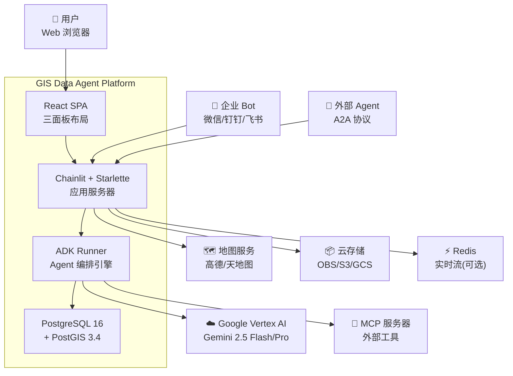

---

## 2. 功能架构

### 2.1 概述

平台功能围绕三条核心管线构建，辅以 18 个内置 Skills、24 个 Toolsets、用户自定义扩展体系和 DRL 优化引擎，形成完整的地理空间分析能力矩阵。

### 2.2 三管线架构

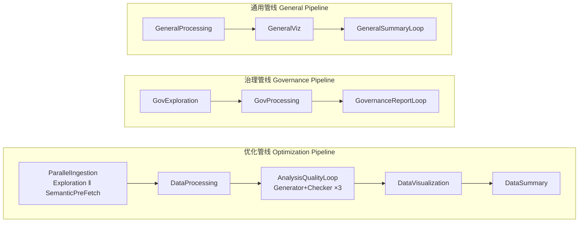

| 管线 | Agent 类型 | 核心能力 | 访问权限 |
|------|-----------|----------|----------|
| Optimization | SequentialAgent + ParallelAgent | 用地优化、DRL 训练、碎片化分析、NSGA-II 多目标 | admin, analyst |
| Governance | SequentialAgent | 拓扑验证、字段规范检查、GB/T 21010 合规 | admin, analyst |
| General | SequentialAgent | SQL 查询、可视化、聚类、热力图、通用空间分析 | admin, analyst, viewer |

### 2.3 内置 ADK Skills（18 个）

| Skills | 场景描述 |
|--------|----------|
| 3d-visualization | 三维可视化（deck.gl 拉伸/柱状/弧线图层） |
| advanced-analysis | 高级空间分析（回归、插值、主成分） |
| buffer-overlay | 缓冲区与叠加分析 |
| coordinate-transform | 坐标系转换（EPSG 互转） |
| data-import-export | 多格式数据导入导出（SHP/GeoJSON/GPKG/KML/CSV/Excel） |
| data-profiling | 数据质量剖析与统计摘要 |
| ecological-assessment | 生态评估（景观指数、生境分析） |
| farmland-compliance | 耕地合规检查（GB/T 21010） |
| geocoding | 地理编码与逆编码（高德 API） |
| knowledge-retrieval | 知识库检索（GraphRAG） |
| land-fragmentation | 土地碎片化分析与优化 |
| multi-source-fusion | 多源数据融合（10 种策略） |
| postgis-analysis | PostGIS 空间 SQL 分析 |
| site-selection | 选址分析（多因子加权） |
| spatial-clustering | 空间聚类（DBSCAN/K-Means/HDBSCAN） |
| team-collaboration | 团队协作与数据共享 |
| thematic-mapping | 专题制图（分级/分类/点密度） |
| topology-validation | 拓扑验证（间隙/重叠/悬挂节点） |

### 2.4 Toolsets（24 个）

| 类别 | Toolsets |
|------|---------|
| 核心分析 | ExplorationToolset, GeoProcessingToolset, AnalysisToolset, VisualizationToolset |
| 数据管理 | DatabaseToolset, SemanticLayerToolset, DataLakeToolset, FileToolset |
| 专业领域 | RemoteSensingToolset, SpatialStatisticsToolset, WatershedToolset, SpatialAnalysisTier2Toolset |
| 智能增强 | FusionToolset, KnowledgeGraphToolset, KnowledgeBaseToolset, AdvancedAnalysisToolset |
| 协作集成 | TeamToolset, LocationToolset, MemoryToolset, StreamingToolset |
| 系统管理 | AdminToolset, McpHubToolset, VirtualSourceToolset, UserToolset |

### 2.5 用户自助扩展体系

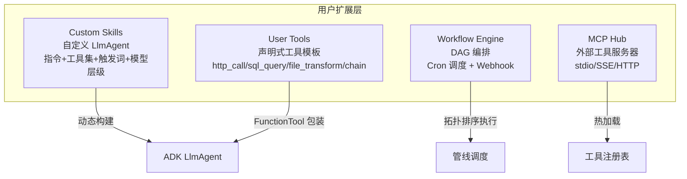

### 2.6 DRL 优化引擎

| 场景 | 算法 | 目标 |
|------|------|------|
| farmland_optimization | MaskablePPO | 耕地连片度最大化 |
| urban_green_space | MaskablePPO | 绿地覆盖率优化 |
| facility_siting | MaskablePPO | 设施选址效用最大化 |
| ecological_corridor | MaskablePPO | 生态廊道连通性 |
| multi_objective | NSGA-II | Pareto 前沿多目标优化 |

---

## 3. 应用架构

### 3.1 概述

应用采用四层架构：React SPA 前端 → Chainlit/Starlette 应用服务 → ADK Agent 编排引擎 → 工具执行层。支持 Web UI、企业 Bot、A2A 协议三种接入通道。

### 3.2 分层组件图

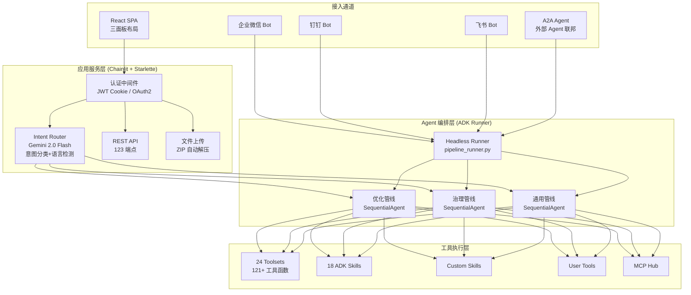

### 3.3 REST API 端点分组（123 个）

| 分组 | 端点数 | 路径前缀 | 功能 |
|------|--------|----------|------|
| 数据目录 | 8 | `/api/catalog` | 资产浏览、血缘追踪 |
| 语义层 | 6 | `/api/semantic` | 三级语义层级、指标定义 |
| 管线历史 | 4 | `/api/pipeline` | 运行记录、重放 |
| 用户管理 | 5 | `/api/user` | 个人信息、账户删除 |
| 管理后台 | 6 | `/api/admin` | 用户管理、审计日志、指标 |
| 地图标注 | 4 | `/api/annotations` | CRUD 标注 |
| MCP Hub | 10 | `/api/mcp` | 服务器 CRUD、热加载 |
| 工作流 | 8 | `/api/workflows` | CRUD、执行、运行记录 |
| 自定义 Skills | 5 | `/api/skills` | CRUD、版本、审批 |
| Skill Bundles | 6 | `/api/bundles` | 技能包管理 |
| 用户工具 | 6 | `/api/user-tools` | CRUD、执行 |
| 知识库 | 10 | `/api/kb` | KB + GraphRAG |
| 模板 | 6 | `/api/templates` | 分析模板 CRUD |
| 分析看板 | 5 | `/api/analytics` | 延迟、吞吐、Token 效率 |
| 任务队列 | 4 | `/api/tasks` | 后台任务管理 |
| 其他 | 30 | 各路径 | 建议、能力聚合、地图更新、Bot、A2A、系统配置 |

### 3.4 前端组件结构

| 组件 | 功能 |
|------|------|
| App.tsx | 认证状态、面板布局、用户菜单 |
| LoginPage | 登录 + 自注册模式切换 |
| ChatPanel | 消息流、流式渲染、Action Card |
| MapPanel | Leaflet 2D 地图、图层控制、底图切换（高德/天地图/CartoDB/OSM） |
| Map3DView | deck.gl + MapLibre 3D 渲染（拉伸/柱状/弧线/散点图层） |
| DataPanel | 12 个标签页（文件/CSV/目录/历史/Token/MCP/工作流/建议/任务/模板/分析/能力） |
| WorkflowEditor | ReactFlow DAG 编辑器（4 种节点类型） |
| AdminDashboard | 管理指标、用户管理、审计日志 |
| UserSettings | 账户信息 + 自助删除 |

---

## 4. 数据架构

### 4.1 概述

数据层以 PostgreSQL 16 + PostGIS 3.4 为核心，包含 37+ 应用表和 5 个 Chainlit 会话表。数据按领域分为 8 个域，通过语义层、知识图谱和数据目录实现元数据治理。

### 4.2 核心实体关系图

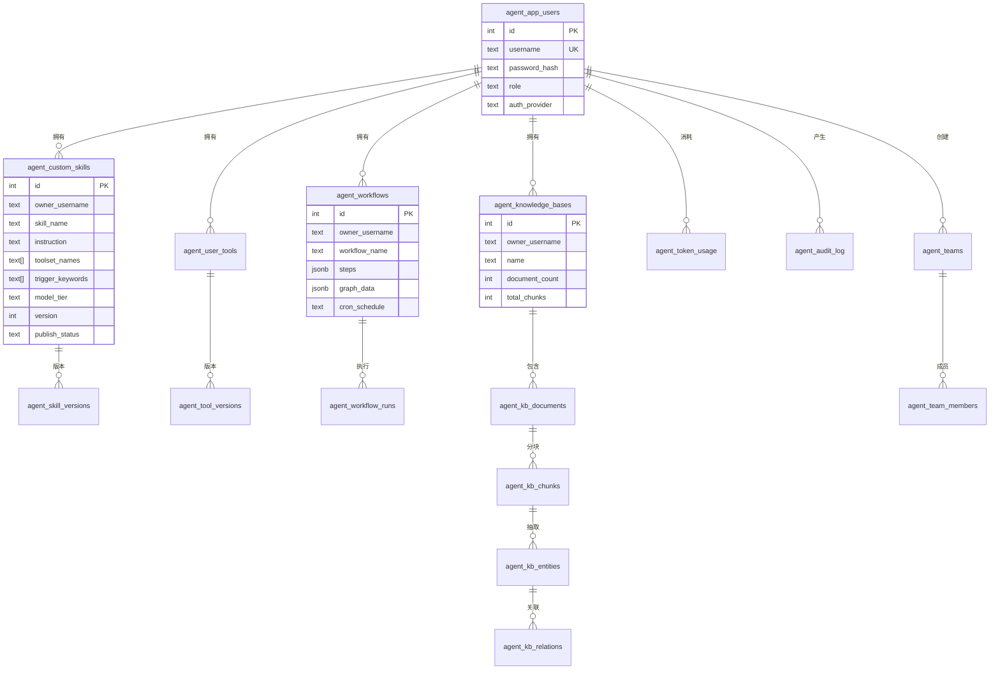

### 4.3 数据库表清单（按领域分组）

**核心域**

| 表名 | 模块 | 用途 |
|------|------|------|
| agent_app_users | auth.py | 用户账户（username, password_hash, role） |
| agent_token_usage | token_tracker.py | Token 消耗追踪（按用户/管线/模型） |
| agent_user_memories | memory.py | 用户空间记忆（JSONB） |
| agent_audit_log | audit_logger.py | 全链路审计日志 |
| agent_share_links | sharing.py | 资产共享链接（带过期时间） |
| agent_table_ownership | database_tools.py | PostGIS 表归属追踪 |

**Skills & Tools 域**

| 表名 | 模块 | 用途 |
|------|------|------|
| agent_custom_skills | custom_skills.py | 自定义 Skills（指令/工具集/触发词/版本/评分/审批） |
| agent_skill_versions | custom_skills.py | Skill 版本历史 |
| agent_user_tools | user_tools.py | 用户声明式工具（5 种模板类型） |
| agent_tool_versions | user_tools.py | 工具版本历史 |

**工作流域**

| 表名 | 模块 | 用途 |
|------|------|------|
| agent_workflows | workflow_engine.py | 工作流定义（DAG/Cron/Webhook） |
| agent_workflow_runs | workflow_engine.py | 工作流执行记录 |
| agent_analysis_chains | analysis_chains.py | 条件触发的后续分析自动化 |
| agent_analysis_templates | template_manager.py | 可复用分析模板 |
| agent_task_queue | task_queue.py | 后台任务队列 |

**知识域**

| 表名 | 模块 | 用途 |
|------|------|------|
| agent_knowledge_bases | knowledge_base.py | 知识库容器 |
| agent_kb_documents | knowledge_base.py | 知识库文档 |
| agent_kb_chunks | knowledge_base.py | 文本分块 + 向量嵌入（REAL[]） |
| agent_kb_entities | graph_rag.py | GraphRAG 实体抽取 |
| agent_kb_relations | graph_rag.py | GraphRAG 实体关系 |
| agent_knowledge_graphs | knowledge_graph.py | 地理知识图谱（networkx DiGraph） |

**数据管理域**

| 表名 | 模块 | 用途 |
|------|------|------|
| agent_data_catalog | data_catalog.py | 统一数据资产目录（含血缘） |
| agent_semantic_registry | semantic_layer.py | 语义层元数据注册 |
| agent_semantic_sources | semantic_layer.py | 语义层数据源映射 |
| agent_virtual_sources | virtual_sources.py | 虚拟数据源连接器（WFS/STAC/OGC/自定义） |
| agent_fusion_ops | fusion/db.py | 多模态融合操作记录 |
| agent_mcp_servers | mcp_hub.py | MCP 服务器配置（加密凭据） |

**协作域**

| 表名 | 模块 | 用途 |
|------|------|------|
| agent_teams | team_manager.py | 团队管理 |
| agent_team_members | team_manager.py | 团队成员 |
| agent_registry | agent_registry.py | 多 Agent 服务发现 + 心跳 |
| agent_plugins | plugin_registry.py | DataPanel 动态插件 |
| agent_map_annotations | map_annotations.py | 地图标注 |

**学习域**

| 表名 | 模块 | 用途 |
|------|------|------|
| agent_tool_failures | failure_learning.py | 工具失败学习 |
| agent_tool_preferences | self_improvement.py | 工具偏好 |
| agent_prompt_outcomes | self_improvement.py | Prompt 效果追踪 |

### 4.4 数据流

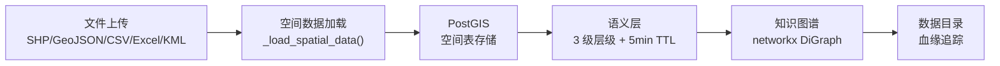

### 4.5 关键设计决策

- **JSONB 灵活 Schema**: parameters、metadata、config 等字段使用 JSONB，兼顾灵活性与查询性能
- **向量嵌入**: kb_chunks 使用 `REAL[]` 存储 768 维向量（text-embedding-004）
- **Fernet 加密**: MCP 服务器和虚拟数据源的凭据在 DB 中加密存储
- **幂等迁移**: 所有表使用 `CREATE TABLE IF NOT EXISTS` + `ALTER TABLE ADD COLUMN IF NOT EXISTS`

---

## 5. 技术架构

### 5.1 概述

技术栈分为四层：展示层、应用层、智能层、数据层，外加基础设施层。每层选型遵循"GIS 专业 + AI 原生 + 云就绪"原则。

### 5.2 技术栈分层图

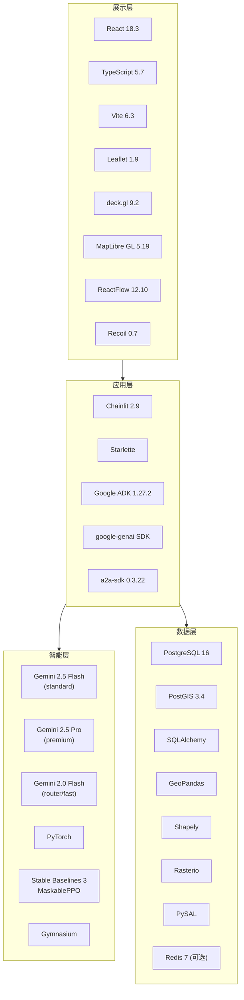

### 5.3 模型分层策略

| 层级 | 模型 | 用途 | 场景 |
|------|------|------|------|
| fast | gemini-2.0-flash | 意图路由、简单查询 | 低延迟场景 |
| standard | gemini-2.5-flash | 管线 Agent 默认 | 大多数分析任务 |
| premium | gemini-2.5-pro | 复杂推理 | 多步骤规划、高精度分析 |

### 5.4 关键依赖版本

| 类别 | 组件 | 版本 |
|------|------|------|
| 运行时 | Python | 3.13.7 |
| 运行时 | Node.js | 20 |
| 数据库 | PostgreSQL | 16 |
| 数据库 | PostGIS | 3.4 |
| GIS | GDAL | 3.9.3 |
| 框架 | Google ADK | 1.27.2 |
| 框架 | Chainlit | 2.9.6 |
| 前端 | React | 18.3.1 |
| 前端 | deck.gl | 9.2.10 |
| ML | PyTorch | latest |
| ML | Stable Baselines 3 | latest |

---

## 6. 部署架构

### 6.1 概述

支持三种部署模式：本地开发（直接运行）、Docker Compose（单机）、Kubernetes（集群）。CI/CD 通过 GitHub Actions 实现自动化测试、构建和评估。

### 6.2 K8s 部署拓扑

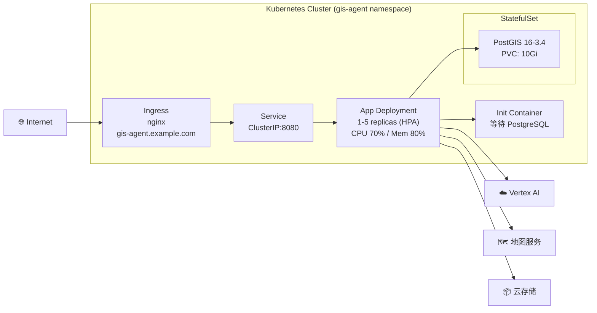

### 6.3 容器化

| 配置项 | 值 |
|--------|-----|
| 基础镜像 | `ghcr.io/osgeo/gdal:ubuntu-small-3.9.3` |
| 运行用户 | `agent`（非 root） |
| 暴露端口 | 8080 |
| 健康检查 | Liveness: `/health` (30s), Readiness: `/ready` (10s) |
| 资源请求 | 250m CPU, 512Mi RAM |
| 资源限制 | 2 CPU, 2Gi RAM |

### 6.4 Docker Compose 服务

| 服务 | 镜像 | 端口 | 用途 |
|------|------|------|------|
| app | 自构建 | 8000 | 应用服务器 |
| db | postgis/postgis:16-3.4 | 5433 | 数据库 |
| redis | redis:7-alpine | 6379 | 实时流（可选） |
| db-backup | 自构建 | - | 每日备份（7 天保留） |

### 6.5 CI/CD 流水线

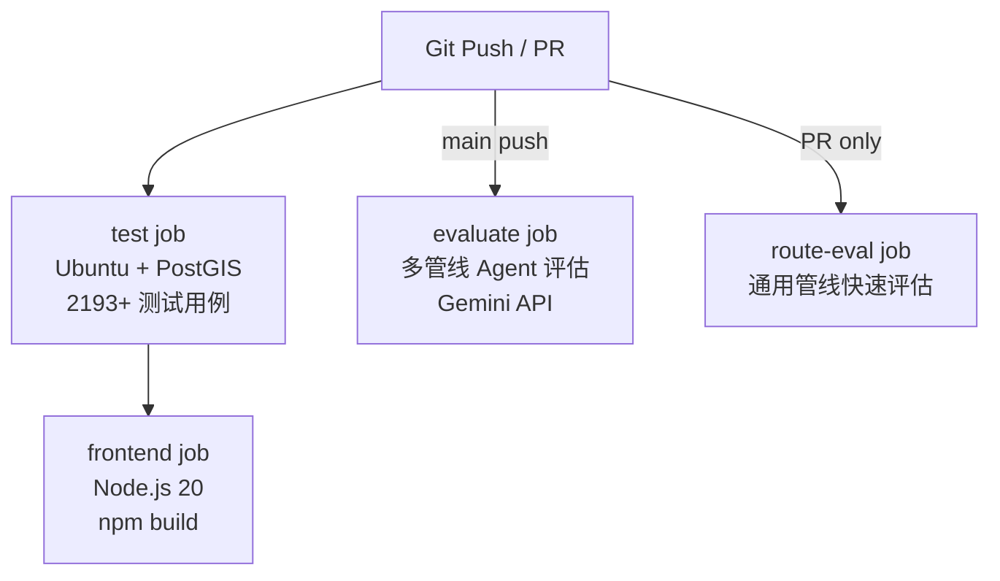

### 6.6 HPA 自动伸缩

| 参数 | 值 |
|------|-----|
| 最小副本 | 1 |
| 最大副本 | 5 |
| CPU 目标 | 70% |
| 内存目标 | 80% |
| 扩容速率 | +2 pods / 60s |
| 缩容速率 | -1 pod / 60s（稳定窗口 300s） |

---

## 7. 安全架构

### 7.1 概述

安全体系覆盖认证、授权、数据隔离、传输加密、凭据保护、容错和审计七个维度，实现多租户环境下的纵深防御。

### 7.2 认证授权流程

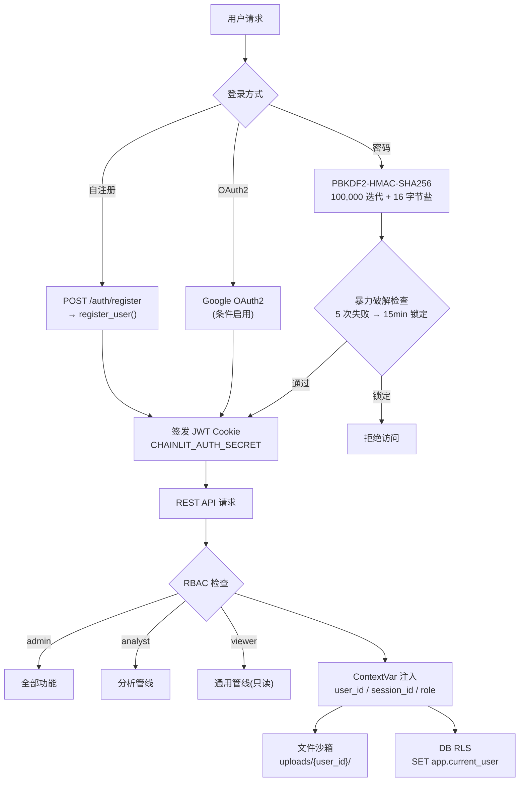

### 7.3 安全控制矩阵

| 维度 | 机制 | 实现 |
|------|------|------|
| 认证 | 密码哈希 | PBKDF2-HMAC-SHA256, 100K 迭代, 16B 盐 |
| 认证 | OAuth2 | Google（条件启用，需 OAUTH_GOOGLE_CLIENT_ID） |
| 认证 | 防暴力破解 | 5 次失败 → 15 分钟锁定，threading.Lock 线程安全 |
| 授权 | RBAC | admin / analyst / viewer 三级角色 |
| 授权 | 管线访问控制 | viewer 禁止访问 Governance/Optimization |
| 隔离 | 文件沙箱 | `uploads/{user_id}/`，`is_path_in_sandbox()` 校验 |
| 隔离 | 数据库 RLS | `SET app.current_user` 会话级注入 |
| 隔离 | ContextVar | 异步安全的用户身份传播 |
| 加密 | 凭据存储 | Fernet 对称加密（MCP/Virtual Sources） |
| 加密 | 传输 | HTTPS（Ingress TLS 终止） |
| 容错 | 熔断器 | CircuitBreaker: closed → open → half-open |
| 审计 | 日志 | 全链路审计（登录/上传/管线/导出/共享/RBAC 拒绝） |
| 网络 | K8s NetworkPolicy | 命名空间级 Pod 网络隔离 |

### 7.4 熔断器状态机

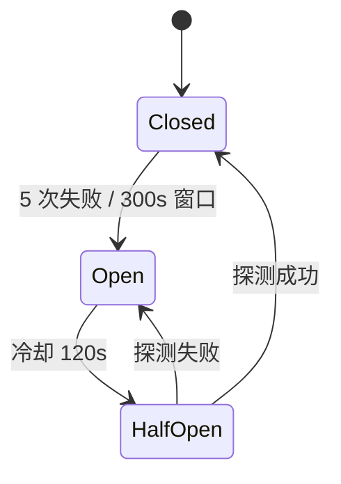

---

## 8. 逻辑架构

### 8.1 概述

逻辑架构描述请求从用户输入到最终响应的完整生命周期，包括意图分类、管线调度、Agent 链执行、工具调用和输出渲染。

### 8.2 请求生命周期

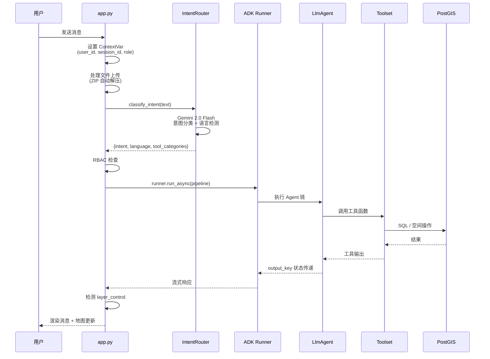

### 8.3 Agent 状态流（优化管线）

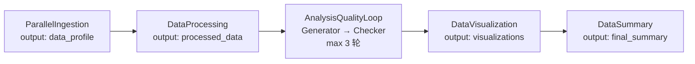

### 8.4 关键逻辑模式

| 模式 | 实现 | 说明 |
|------|------|------|
| 语义路由 | `classify_intent()` | Gemini Flash 分类为 OPTIMIZATION/GOVERNANCE/GENERAL/AMBIGUOUS |
| 质量门 | LoopAgent | Generator + Checker，最多 3 轮迭代直到质量达标 |
| 状态传递 | `output_key` | Agent 间通过 ADK session state 传递中间结果 |
| Headless 执行 | `pipeline_runner.py` | 零 Chainlit 依赖，返回 PipelineResult dataclass |
| 动态工具过滤 | `intent_tool_predicate` | 根据意图类别动态筛选可用工具 |
| 模型自适应 | `assess_complexity()` | 根据查询复杂度自动选择 fast/standard/premium 模型 |
| 多语言 | `detect_language()` | 自动检测 zh/en/ja，Agent 以对应语言回复 |

---

## 9. 物理架构

### 9.1 概述

物理架构描述系统与外部服务的实际网络连接关系，包括 AI 推理、地图瓦片、云存储、企业 Bot 和 MCP 工具服务器。

### 9.2 物理网络拓扑

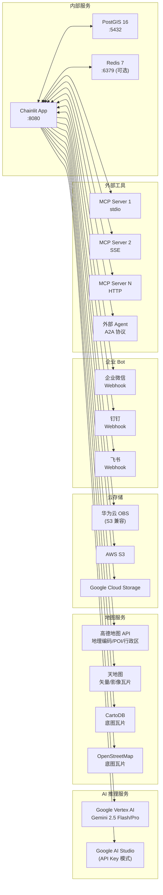

### 9.3 连接配置

| 服务 | 协议 | 认证方式 | 配置来源 |
|------|------|----------|----------|
| Vertex AI | gRPC/HTTPS | Service Account / API Key | GOOGLE_GENAI_USE_VERTEXAI, GOOGLE_API_KEY |
| PostGIS | TCP:5432 | 用户名/密码 | POSTGRES_HOST/PORT/USER/PASSWORD |
| Redis | TCP:6379 | 无/密码 | REDIS_URL |
| 高德地图 | HTTPS | API Key | GAODE_API_KEY |
| 天地图 | HTTPS | Token | TIANDITU_TOKEN |
| 华为 OBS | HTTPS (S3) | AK/SK | HUAWEI_OBS_AK/SK/SERVER/BUCKET |
| 企业微信 | HTTPS Webhook | Corp ID + Secret | WECOM_CORP_ID/APP_SECRET |
| 钉钉 | HTTPS Webhook | App Key + Secret | DINGTALK_APP_KEY/APP_SECRET |
| 飞书 | HTTPS Webhook | App ID + Secret | FEISHU_APP_ID/APP_SECRET |
| MCP 服务器 | stdio/SSE/HTTP | 自定义 | agent_mcp_servers 表（Fernet 加密） |

### 9.4 连接池配置

| 参数 | 值 | 说明 |
|------|-----|------|
| pool_size | 5 | 常驻连接数 |
| max_overflow | 10 | 最大溢出连接 |
| pool_recycle | 1800s | 连接回收周期 |
| pool_pre_ping | true | 使用前探活 |

---

## 10. 横切关注点

### 10.1 可观测性

| 维度 | 实现 | 说明 |
|------|------|------|
| 结构化日志 | `observability.py` | JSON 格式（ELK/CloudLogging 兼容），支持 text 回退 |
| Trace ID | ContextVar | `current_trace_id` 贯穿请求全链路 |
| Prometheus 指标 | `/metrics` | pipeline_runs, pipeline_duration, tool_calls, auth_events |
| 分析看板 | 5 个 API | 延迟分布、工具成功率、Token 效率、吞吐量、Agent 分解 |
| 健康检查 | `health.py` | `/health`（存活）、`/ready`（就绪）、子系统探针 |
| 启动诊断 | Banner | DB、云存储、Redis、Session、MCP Hub 状态汇总 |

### 10.2 多租户

| 层级 | 隔离机制 |
|------|----------|
| 请求级 | ContextVar（current_user_id, current_session_id, current_user_role） |
| 文件级 | `uploads/{user_id}/` 沙箱，`is_path_in_sandbox()` 校验 |
| 数据库级 | `SET app.current_user` 会话注入，RLS 就绪 |
| API 级 | JWT Cookie 认证，所有 123 端点强制鉴权 |
| 资源级 | owner_username 字段贯穿所有业务表 |

### 10.3 国际化

| 组件 | 机制 |
|------|------|
| 意图检测 | `detect_language()` 自动识别 zh/en/ja |
| Agent 回复 | 根据检测语言切换回复语言 |
| 前端 | YAML locale 文件 + `t()` 函数 |
| Prompt | 中文为主，支持多语言指令 |

### 10.4 容错与自愈

| 机制 | 模块 | 说明 |
|------|------|------|
| 熔断器 | circuit_breaker.py | 5 次失败 / 300s → 断路，120s 冷却后半开探测 |
| 工具重试 | agent.py | `_self_correction_after_tool` 自动修正 |
| 失败学习 | failure_learning.py | 记录工具失败模式，辅助后续决策 |
| 自我改进 | self_improvement.py | Prompt 效果追踪 + 工具偏好学习 |
| 质量门 | LoopAgent | Generator + Checker 循环，最多 3 轮 |

### 10.5 缓存策略

| 缓存 | TTL | 失效方式 |
|------|-----|----------|
| 语义层 | 5 分钟 | `invalidate_semantic_cache()` 写时失效 |
| Skills 注册表 | 懒加载 | `_RegistryProxy` 首次访问时加载 |
| 数据目录 | 按需 | 写操作后刷新 |

### 10.6 可扩展性

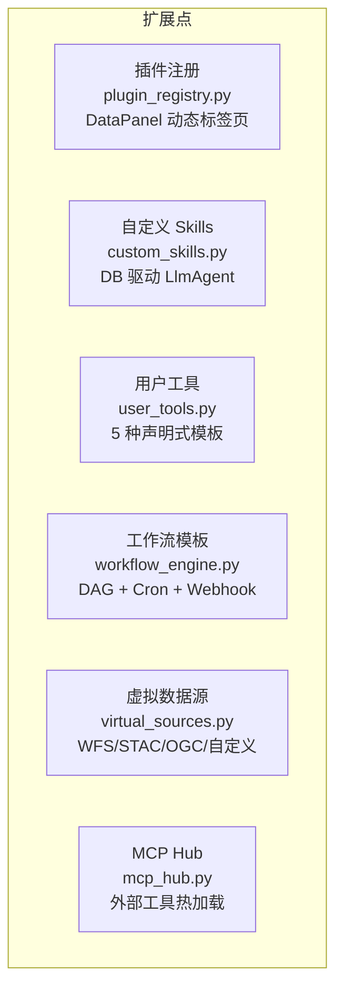

---

## 附录：模块索引

| 模块 | 行数 | 职责 |
|------|------|------|
| app.py | 3340 | Chainlit UI、RBAC、文件上传、图层控制 |
| frontend_api.py | 2572 | 123 REST API 端点 |
| agent.py | ~1500 | Agent 定义、管线组装、工具函数 |
| workflow_engine.py | 1370 | 工作流 CRUD、DAG 执行、调度 |
| drl_engine.py | ~850 | DRL 优化：5 场景 + NSGA-II |
| custom_skills.py | ~600 | 自定义 Skills CRUD + 版本 + 审批 |
| user_tools.py | ~500 | 用户工具 CRUD + 验证 |
| pipeline_runner.py | ~400 | Headless 管线执行器 |
| auth.py | ~300 | 密码哈希、防暴力破解、注册 |
| intent_router.py | 197 | 语义意图分类 + 语言检测 |
| circuit_breaker.py | ~150 | 熔断器状态机 |
| a2a_server.py | ~400 | A2A 协议：Agent Card + Task 生命周期 |
| observability.py | ~200 | 结构化日志 + Prometheus 指标 |
| health.py | ~150 | K8s 健康检查 + 启动诊断 |
| fusion/ | 22 模块 | 多模态数据融合：10 种策略 |
