> 文档定位：本手册是决赛现场的技术查询底稿，不替代 5 分钟 PPT 与演示脚本。回答评委时先给结论，再给一个可核验的实现或数字，最后主动说明边界。所有运行数字以 2026-07-30 决赛证据快照为准。

# 1. 现场使用方法

## 1.1 先记住这段 30 秒总答案

GIS Data Agent 面向两类真实地理空间任务：高频的自然语言空间问数，以及低频但高价值的县域耕地空间布局优化。Gemma 4 26B 负责理解目标、生成 GeoSQL、选择工具和根据反馈决定下一步；Google ADK 承载 Agent 生命周期、原生函数调用和调用事件；PostGIS、GIS 与县域耕地空间优化引擎负责确定性计算；独立治理代码负责版本兼容性、硬约束校验和经验写入权限。系统的核心不是让大模型猜空间结果，而是让它在可审计边界内组织真实计算。

县域优化部分同时展示了 `LLM + GWM` 的方向：图斑与空间块构成状态，空间块内的耕地与林地等量置换构成行动，学习型状态转移模型集成预测行动后果，MPC 使用预测搜索方案。当前实现应称为“领域化地理空间世界模型原型”，不是完整通用地理空间世界模型。

## 1.2 高频追问快速索引

| 评委问题 | 先回答什么 | 深入章节 | 建议搜索词 |
|---|---|---:|---|
| Gemma 4 到底做了什么？ | 决策与控制，不直接计算 GIS/MPC 数值 | 3、4 | `Gemma 4 职责` |
| ADK 是主链还是装饰？ | 主运行时，承载 10 个结构化工具和函数事件 | 4 | `10 个工具` |
| 多步规划在哪里？ | 任务级 2/6/8 工具分支；数值级 MPC 是另一层规划 | 4、6 | `两层规划` |
| 为什么选 26B？ | 113/125，接近 31B，但完整基准快约 37.6% | 3 | `CQ-125` |
| 和普通 NL2SQL 有什么区别？ | 专门处理 SRID、米制距离、空间谓词、去重与真实执行 | 5 | `GeoSQL` |
| 结果为什么是 35？ | 同一 PostGIS 快照、锁定 SQL、三层地图相互校验 | 5.7 | `最长桥梁` |
| Paper9 是什么？ | 县域优化引擎内部研发代号，主叙事不用它做产品名 | 6.1 | `内部代号` |
| 世界模型体现在哪里？ | 学习型状态转移模型集成；MPC 是消费者，不是模型本身 | 6.2 | `GWM` |
| 自主性体现在哪里？ | 观察、选择、审计后恢复或停止，并有代码强制边界 | 7 | `受控自主` |
| Memory 如何避免污染？ | 只提交通过校验且产物完整的 episode，幂等追加写入 | 7.4 | `verified memory` |
| 失败怎么办？ | 版本不兼容停止；审计失败最多重规划一次；再失败转人工 | 7.3 | `恢复分支` |
| 30/30 证明了什么？ | 证明受控场景中的 Gemma 4 + ADK 编排行为，不是 30 次算法重跑 | 9.2 | `30/30` |
| 自然资源部测试的是什么？ | 底层引擎历史版本的目标内网记录，不是当前 Agent 生产验收 | 12.9 | `内网证据` |
| 如何扩展到其他地区？ | 数据契约、CRS、编码、区域 ensemble 和独立验收必须重做 | 11 | `区域扩展` |

## 1.3 现场回答模板

推荐使用固定三段式：

1. **结论**：一句话直接回答，不先讲背景。
2. **证据**：给一个函数名、工具轨迹、基准数字或空间产物。
3. **边界**：说明这个证据不能外推为什么。

例如：

> 结论：Gemma 4 确实在做任务级规划，但不直接计算 MPC 数值。证据：真实 ADK 评测中，它根据工具反馈形成版本阻断、六工具成功和八工具恢复三种轨迹。边界：A/B/C/D 是确定性算法阶段，不能把固定 pipeline 说成大模型动态规划。

# 2. 系统目标与技术边界

## 2.1 真实用户与任务

目标用户不是泛化的“政府用户”，而是以下具体岗位：

- 自然资源调查与国土空间规划人员。
- 县域耕地整治与用途管制人员。
- GIS 数据分析师和空间数据库工程师。
- 需要审查规划过程、指标和空间成果的技术负责人。

系统选择两类任务，是为了同时证明广度与深度：

| 场景 | 频率与价值 | 原有痛点 | 系统输出 |
|---|---|---|---|
| NL2Semantic2GeoSQL | 高频、刚需 | SQL 看似合理但空间单位、SRID、谓词或去重错误 | 可执行 SQL、标量结果、地图与修正记录 |
| 县域耕地空间优化 | 低频、高价值 | 不能只给文字建议，必须满足业务约束并生成空间成果 | MPC 方案、指标、变化图层、审计与图文报告 |

## 2.2 核心设计原则

系统遵循四个原则：

- **模型做决策，工具做计算**：Gemma 4 不伪造 PostGIS 结果或 MPC 指标。
- **验证独立于模型**：面积、坡度、连片度和产物完整性由确定性 Python 代码校验。
- **失败默认停止**：版本、资源、SQL 安全或空间产物不满足要求时，不能把 warning 包装为成功。
- **经验必须带证据**：可复用经验必须关联版本、参数、输出目录、摘要哈希和审计结论。

## 2.3 一张图理解总体架构

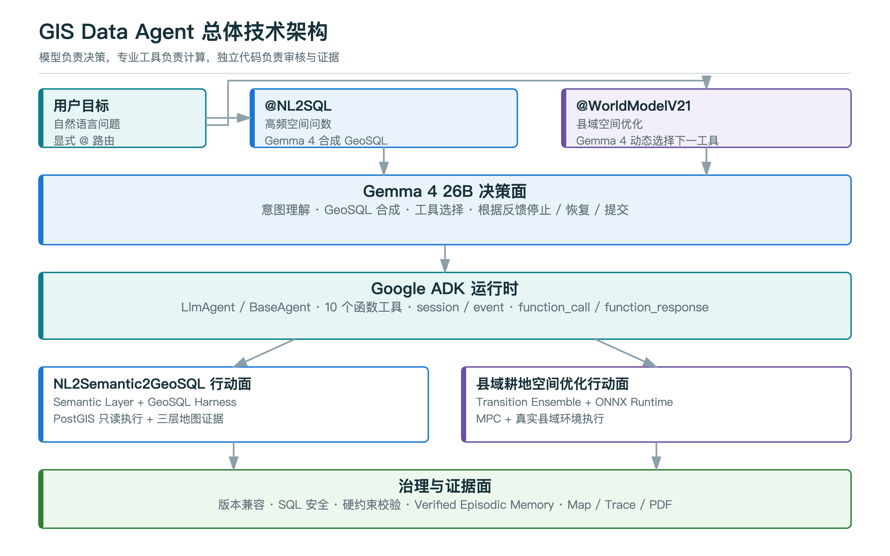{width=96%}

图中从上到下依次是用户与路由、Gemma 4 决策面、Google ADK 运行时、两个确定性行动面，以及独立治理与证据面。这里最重要的职责边界是：模型不直接伪造 GIS 或 MPC 数值，工具输出也不能绕过独立校验直接进入经验库。

## 2.4 Google 技术栈的准确口径

| 技术 | 当前角色 | 是否进入主链 | 现场表述 |
|---|---|---:|---|
| Gemma 4 | GeoSQL 合成、任务级工具决策、结果解释 | 是 | 核心模型 |
| Google ADK | Agent 运行时、10 个函数工具、长任务工具、session 与事件 | 是 | 核心框架 |
| AlphaEarth | 长期空间表征扩展方向 | 否 | `Tech Preview` |
| OKF | 人和 Agent 可读的知识交换 sidecar | 否 | 未来知识治理接口 |

ADK 是真正的架构组成，不是额外加一个 Google Logo。AlphaEarth 与 OKF 只在被追问未来扩展时说明，不应暗示已经进入生产闭环，也不应主张“Google 技术用得越多越有隐藏加分”。

# 3. Gemma 4 模型选型与部署

## 3.1 CQ-125 模型选型基准

模型选择基于同一主机、同一 CQ-125 PostGIS 基准和同一评测口径。`EX` 表示执行结果正确，不只是 SQL 字符串相似。

| 模型 | Full EX | Full Valid | 完整时间 |
|---|---:|---:|---:|
| Gemma4:e2b | 82/125 = 65.6% | 108/125 = 86.4% | 21.22 min |
| Gemma4:e4b | 80/125 = 64.0% | 110/125 = 88.0% | 13.49 min |
| Gemma4:12b | 107/125 = 85.6% | 120/125 = 96.0% | 16.45 min |
| **Gemma4:26b** | **113/125 = 90.4%** | **118/125 = 94.4%** | **12.50 min** |
| Gemma4:31b | 114/125 = 91.2% | 117/125 = 93.6% | 20.04 min |

26B 只比 31B 少 1 道执行正确题，即 0.8 个百分点，但完整运行时间从 20.04 分钟下降到 12.50 分钟，约快 37.6%。因此选择 26B 是准确率与时延的工程折中，不是声称 26B 在统计上显著优于 31B。

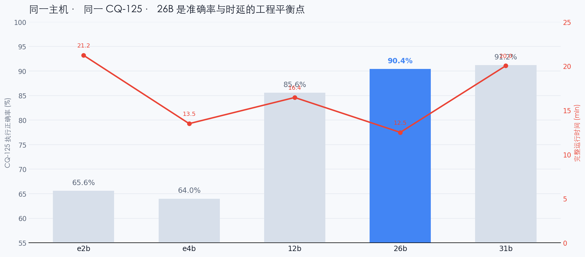{width=90%}

数据源：`docs/assets/gemma4_host228_scale_sweep_summary.csv`。

## 3.2 模型网关

`data_agent/model_gateway.py` 将逻辑模型名映射到实际后端。决赛环境关键配置为：

```text
logical model: gemma4-26b-ollama
backend: LiteLLM
model_id: ollama_chat/Gemma4:26b
api: Ollama OpenAI-compatible endpoint
extra_body: {"think": false}
request_timeout: 600 s
```

调用链为：

```text
业务 Agent
-> create_model("gemma4-26b-ollama")
-> Google ADK LiteLlm wrapper
-> LiteLLM / Ollama
-> Gemma4:26b
```

## 3.3 为什么固定 `think=false`

本地 Gemma 4 的 reasoning 模式会把大量内容放入 `message.thinking`，在某些工具循环中直到输出预算耗尽才产生可用的 `message.content`，表现为长时间空响应或超时。决赛版本关闭 thinking 输出，原因不是降低模型能力，而是：

- 工具参数必须稳定、短而结构化。
- 不向用户界面泄露内部推理文本。
- 避免 5 分钟演示中出现不可控的首 token 延迟。
- 让可审计证据落在函数调用和工具结果上，而不是不可验证的思维文本上。

## 3.4 离线与数据边界

Gemma 4、PostGIS、规划引擎和主要运行组件可在本地网络或内网环境运行。模型调用成本在当前本地部署中记为 0，但这不等于计算成本为零。模型服务、ONNX 推理、PostGIS 和 PDF 生成仍消耗主机 CPU、内存和等待时间。

# 4. Google ADK、原生函数调用与两层规划

## 4.1 两层规划必须分开讲

系统中存在两种性质不同的规划：

| 层级 | 规划者 | 输入 | 输出 | 是否由 LLM 决定 |
|---|---|---|---|---:|
| 任务级规划 | Gemma 4 + ADK | 用户目标、版本、资源、经验、审计反馈 | 下一工具、停止、重规划或提交 | 是 |
| 数值级规划 | MPC | 空间状态、可行动作、转移模型预测、约束 | 具体空间块行动序列 | 否，确定性算法 |

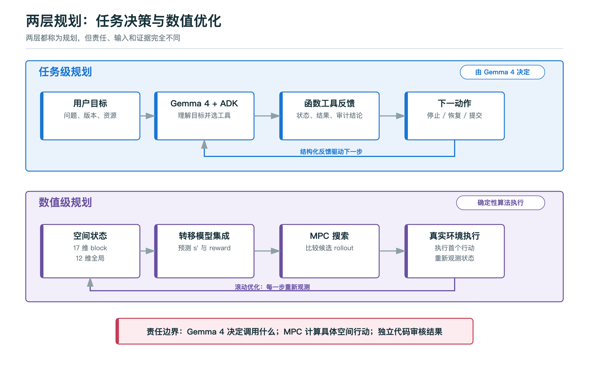{width=96%}

这一区分是回答“Gemma 4 真的在规划吗”的关键。Gemma 4 的证据是不同反馈导致不同工具轨迹；MPC 的证据是它在学习型状态转移模型上进行候选 rollout 和累计回报比较。

## 4.2 两个显式路由 Agent

### `@NL2SQL`

本地 Gemma/Ollama 路径使用 `DirectNL2SemanticSQLAgent`。它是一个确定性 ADK 外层：先发出 `run_nl2semantic2sql(user_question)` 的 `function_call` 事件，再调用高层工具并发出 `function_response`。高层工具内部仍调用 Gemma 4 生成 SQL。

这样设计是为了避免本地模型在多个低层语义、数据库工具之间重复循环。它保留了可审计函数事件，同时把空间 SQL 的 grounding、安全和执行交给确定性 harness。

准确口径：

> `@NL2SQL` 的外层工具选择是固定的，高层工具内部的 SQL 合成由 Gemma 4 完成；它不是本项目多步自主规划的主要证据。

### `@WorldModelV21`

`MentionWorldModelV21` 是标准 Google ADK `LlmAgent`，模型为 Gemma 4，且只绑定 `WorldModelV21Toolset`。Gemma 4 根据每次结构化响应决定下一工具。这一链路才是比赛要求中多步规划、工具使用和原生函数调用的主证据。

代码位置：`data_agent/agent.py::_build_mention_world_model_v21_agent`。

## 4.3 10 个 ADK 工具

`WorldModelV21Toolset` 暴露 5 个同步 `FunctionTool` 和 5 个 `LongRunningFunctionTool`。

| 工具 | ADK 类型 | 作用 | 关键输出或决策 |
|---|---|---|---|
| `world_model_v21_status` | FunctionTool | 检查适配器、包、算法版本与能力 | `version_compatible` |
| `paper9_inspect_resources` | FunctionTool | 检查 prepared、samples、ONNX 与编码契约 | `planning_ready`、可复用阶段 |
| `paper9_recall_verified_episodes` | FunctionTool | 按数据集召回已验证经验 | 最近 episode 与参数 |
| `paper9_audit_run` | FunctionTool | 校验指标和空间产物 | commit / replan / human review |
| `paper9_commit_verified_episode` | FunctionTool | 写入已验证经验 | `episode_id`、幂等状态 |
| `world_model_v21_prepare` | LongRunningFunctionTool | DLTB + DEM 数据准备 | prepared 目录与摘要 |
| `world_model_v21_sample` | LongRunningFunctionTool | 采样 transition 与 pairwise 数据 | NPZ 样本 |
| `world_model_v21_train` | LongRunningFunctionTool | 训练对比学习 ensemble 并导出 ONNX | 模型成员与训练摘要 |
| `world_model_v21_plan` | LongRunningFunctionTool | 单独执行 Tool 4 MPC | 规划目录、指标、地图 |
| `world_model_v21_pipeline` | LongRunningFunctionTool | 执行或复用 A/B/C/D | 四阶段状态与规划结果 |

长任务使用 `asyncio.to_thread` 包装同步计算，避免阻塞 ADK 的异步事件循环。工具参数采用 string-friendly 形式，进入服务层后统一转换与范围校验。

## 4.4 三类真实 Gemma 4 + ADK 轨迹

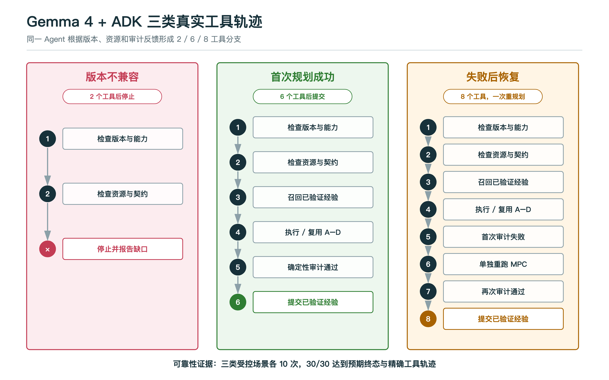{width=96%}

### 版本不兼容，2 个工具后停止

工具序列为 `world_model_v21_status` → `paper9_inspect_resources`，随后停止并报告缺口。图中的“停止”是终态，不计作第 3 个工具。

这是“知道什么时候不行动”的自主性证据。Agent 不能自动降级为旧算法再称为成功。

### 首次成功，6 个工具

工具序列为 `world_model_v21_status` → `paper9_inspect_resources` → `paper9_recall_verified_episodes` → `world_model_v21_pipeline` → `paper9_audit_run` → `paper9_commit_verified_episode`。

### 首次失败后恢复，8 个工具

工具序列为 `world_model_v21_status` → `paper9_inspect_resources` → `paper9_recall_verified_episodes` → `world_model_v21_pipeline` → 首次 `paper9_audit_run` 失败 → `world_model_v21_plan` → 再次 `paper9_audit_run` 通过 → `paper9_commit_verified_episode`。

三种受控场景各运行 10 次，均形成预期终态和精确工具轨迹。恢复分支只允许一次 `world_model_v21_plan`，第二次仍失败必须停止。

## 4.5 Prompt 约束与代码约束的区别

Prompt 负责告诉模型应该怎样做，例如先检查状态、首次规划带面积不减少约束、失败最多重规划一次。代码负责保证即使模型不遵守也不能越权，例如：

- 没有 `paper9_agent_audit.json`，提交函数直接拒绝。
- `hard_constraint_passed=false`，经验库直接抛出异常。
- 缺少优化空间产物，审计强制改为失败并转人工。
- 版本和区域模型维度不兼容，规划服务拒绝执行。

因此系统的可靠性不是只依赖 prompt，而是“模型策略 + 工具接口 + 确定性不变量”三层共同实现。

# 5. NL2Semantic2GeoSQL 关键实现

## 5.1 为什么不是普通 Text-to-SQL

空间 SQL 的主要难点不是语法，而是执行语义：

- 地理坐标系下 `geometry` 的长度和距离单位可能是度，不是米。
- 不同 SRID 的空间对象不能直接比较。
- `ST_Intersects`、`ST_Within`、`ST_Contains` 的方向和边界语义不同。
- 一对多空间连接会让计数膨胀，需要按业务实体主键去重。
- KNN `<->`、半径过滤和 `LIMIT` 的组合容易产生“看似合理但答非所问”的 SQL。
- 生产环境必须拒绝 DDL/DML、未 grounding 的表和无界危险查询。

所以系统不是把 schema 全量塞给模型，而是构建专门的 GeoSQL harness。

## 5.2 完整执行链

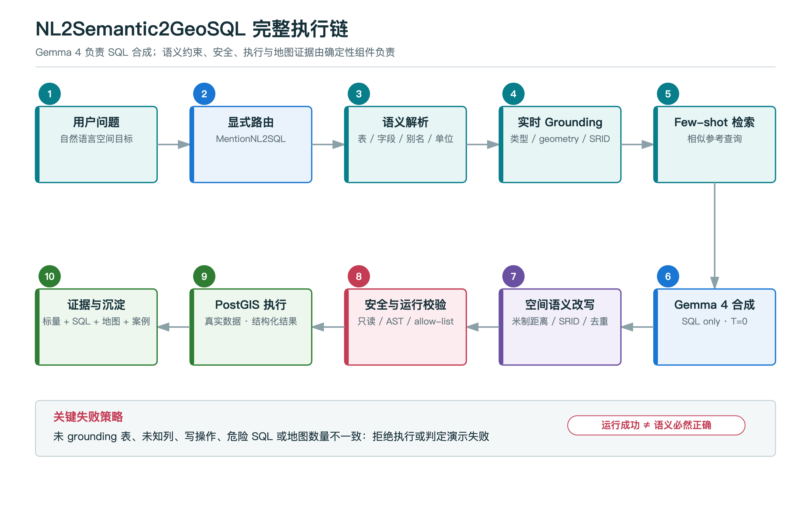{width=96%}

执行链可以归纳为四段：语义与实时 schema grounding、Gemma 4 SQL 合成、确定性语义修正与安全校验、PostGIS 真实执行与证据输出。图中的失败策略同样是运行契约的一部分，不是仅用于展示的说明文字。

关键实现文件：

| 文件 | 责任 |
|---|---|
| `data_agent/semantic_layer.py` | 语义源与字段定义 |
| `data_agent/nl2sql_grounding.py` | 候选表、live schema、few-shot 与 grounding prompt |
| `data_agent/nl2sql_executor.py` | Gemma SQL 合成、重试、执行与结构化返回 |
| `data_agent/nl2sql_semantic_rewrite.py` | 配置驱动的空间语义改写 |
| `data_agent/sql_postprocessor.py` | SQL AST/规则后处理与大表限制 |
| `data_agent/runtime_guards.py` | 占位 SQL、幻觉表与 allow-list 检查 |
| `data_agent/toolsets/nl2sql_tools.py` | 安全数据库执行 |
| `data_agent/nl2sql_presentation.py` | 中文结果和地图 handoff |

## 5.3 Semantic grounding

Grounding 层不会只返回表名。每个候选列可携带：

- 物理列名和安全引用形式。
- 业务别名和描述。
- PostgreSQL 类型、geometry 标记和 SRID。
- 单位与 semantic domain。
- 枚举值、原始编码和显示值映射。
- 是否为标识字段，用于 `COUNT(DISTINCT ...)`。

如果 Gemma 生成的 SQL 引用了未进入初始 top-k 的真实表，系统会先检查它是否由问题或语义上下文支持。未 grounding 的表默认触发一次约束重试；再次出现则拒绝，不会因为数据库里恰好存在就自动视为正确。

## 5.4 Gemma 4 SQL 合成

`nl2sql_executor.py::_generate_gemma_sql` 通过 LiteLLM 调用配置的 Gemma 4：

```text
temperature = 0.0
think = false
retry attempts = 3（可配置）
output contract = SQL only
```

SQL 合成是 Gemma 4 的核心贡献。Python harness 不预先写死最终 SQL，而是在生成后校正可判定的空间语义错误。

## 5.5 空间语义改写

`apply_semantic_sql_rewrites` 是配置驱动的规则链，主要覆盖：

- 表名版本归一化与问题别名匹配。
- 列别名、引号和大小写修正。
- 未知列拒绝。
- 枚举编码和显示值转换。
- 面积单位转换到平方米、平方公里或公顷。
- `ST_DWithin` 的 `geography` 米制距离修正。
- `ST_Distance`、`ST_Length` 的坐标与单位修正。
- SRID transform 和子查询 geometry 投影修正。
- 空间连接去重与 grouped count 修正。
- 不应出现的空间连接或过滤条件删除。

这类改写只使用 semantic context，不在 Python 中为某个 demo 问题硬编码答案。修正标签会随结构化结果返回，例如当前演示出现 `semantic_column_alias`。

## 5.6 安全与失败处理

执行前至少经过四层控制：

1. Prompt 要求只生成只读查询。
2. SQL postprocessor 拒绝写操作和危险结构，并可为大表增加限制。
3. Runtime guard 拒绝 `SELECT 1` 等放弃型占位 SQL、文件路径形态表名和 allow-list 外表名。
4. 数据库工具使用只读执行路径，返回结构化错误而不是继续猜测结果。

需要强调：运行成功只证明 SQL 可执行，不自动证明业务语义完全正确。因此自动沉淀的 reference query 仍应经过 benchmark 或人工复核后再晋升为高置信知识。这是当前知识循环需要继续加强的边界。

## 5.7 决赛查询为何返回 35

用户问题：

```text
统计距离道路网络中最长桥梁100米范围内的高德POI数量。
```

锁定参考 SQL：

```sql
WITH longest_bridge AS (
  SELECT geometry
  FROM cq_osm_roads_2021
  WHERE bridge = 'T'
  ORDER BY ST_Length(geometry::geography) DESC
  LIMIT 1
)
SELECT COUNT(DISTINCT p."ID") AS poi_count
FROM cq_amap_poi_2024 AS p
CROSS JOIN longest_bridge AS lb
WHERE ST_DWithin(
  p.geometry::geography,
  lb.geometry::geography,
  100
);
```

技术要点：

- `ST_Length(geometry::geography)` 按米比较桥梁长度。
- `ST_DWithin(...::geography, ..., 100)` 明确 100 米半径。
- `COUNT(DISTINCT p."ID")` 避免空间连接重复计数。
- roads 与 POI 使用锁定的版本表，而不是模糊表名。

最终验收连续 3 次返回 `35`，延迟为 `14.414 / 6.761 / 6.884 s`。右侧地图从同一 PostGIS 伴随查询快照加载：

- 高德 POI：35 个。
- 最长桥梁：1 条，`osm_id=708725252`，龙溪河大道，长度约 2167.57 米。
- 100 米缓冲区：1 个。

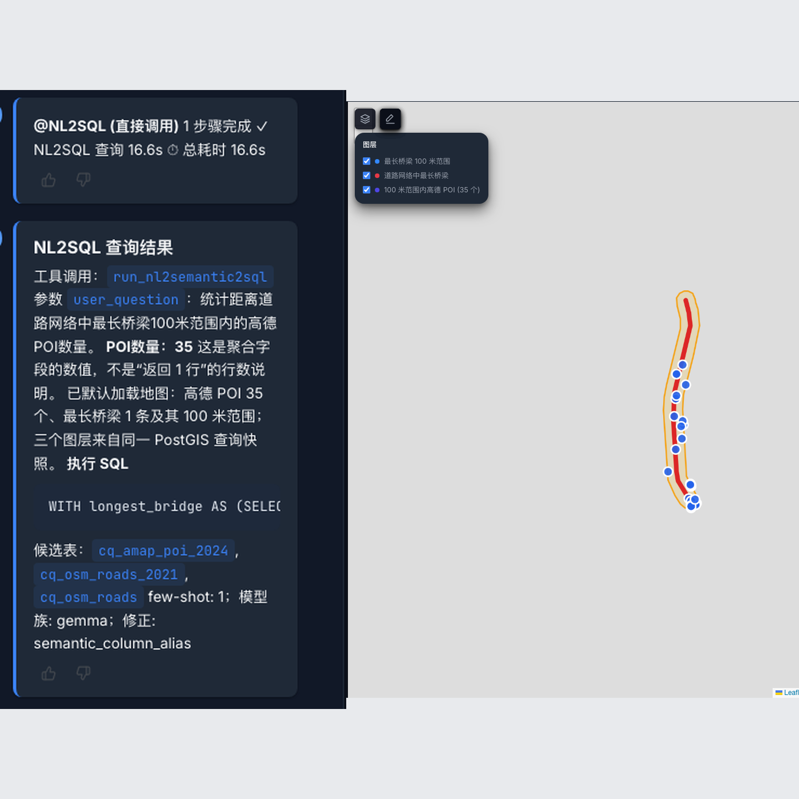{width=75%}

标量、SQL 与三层地图互相核查，比只显示“35”更有说服力。

## 5.8 CQ-125 能证明什么

CQ-125 用于比较同一环境中不同模型的执行正确率，并作为空间语义回归基准。它能证明模型选型有数据依据，也能发现 SRID、距离、面积、空间连接等典型失败模式。

它不能证明：

- 所有自然语言空间问题都能正确处理。
- 对任意数据库 schema 都有同样准确率。
- 113/125 与 114/125 之间存在统计显著差异。

# 6. 县域耕地空间优化引擎与地理空间世界模型

## 6.1 命名与思想来源

`Paper9` 是底层算法项目的内部研发代号，源于作者的第 9 篇论文工作。面向评委和用户，主名称统一为“县域耕地空间优化引擎”。只有在解释研究来源、代码路径或版本时才说明内部代号。

它不是为了给比赛临时拼接的脚本，而是一个可复现的 model-based spatial planning 工程，包括数据准备、转移采样、对比学习 ensemble、ONNX 导出、MPC、ArcGIS/QGIS/CLI 接口和独立验证产物。

## 6.2 与 GWM 的严格关系

可以用五个部件说明：

| GWM 部件 | 当前实现 | 技术含义 |
|---|---|---|
| 状态 `S` | 2,640 个空间块的 17 维 block 特征 + 12 维县域全局特征 | 当前世界状态表示 |
| 行动 `A` | 从可行空间块中选择一个 block，在内部执行耕地/林地 paired swaps | 受限行动空间 |
| 动力学 `T_theta` | 3-member transition model ensemble | 预测下一状态与奖励，是 GWM 内核雏形 |
| 规划器 | MPC | 消费模型预测、搜索行动，不是世界模型本身 |
| 验收层 | 面积、坡度、连片度与产物完整性校验 | 决定方案能否保存和复用 |

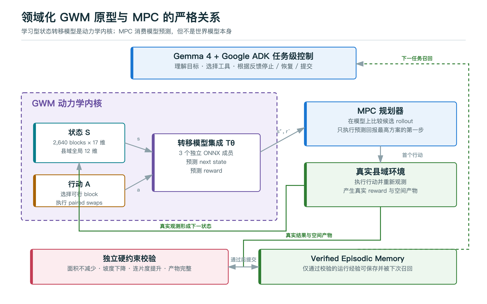{width=96%}

一句准确表述：

> 当前实现是领域化 GWM 原型。学习型状态转移模型集成是动力学内核雏形，MPC 是模型的消费者，Gemma 4 与 ADK 是任务级控制面，硬约束校验是决策治理外环。

## 6.3 状态表示

县域环境把图斑聚合为空间块。每个 block 的 17 维特征包含：

- 耕地与林地坡度统计。
- 可交换耕地/林地面积。
- 最优坡度改善潜力。
- 已使用置换预算与可用置换比例。
- block 紧凑度和面积。
- 邻接 block 的投资比例与耕地面积。
- 当前耕地面积和是否已投资。

12 维县域全局特征包含：

- 剩余预算与执行进度。
- 全局平均坡度和坡度改善。
- 连片度与连片度改善。
- 百亩方数量和面积比例。
- 已投资 blocks 比例。
- 乡镇间投资熵、跨乡镇协调占位和最大乡镇占比。

因此状态不是一张原始栅格，也不是 LLM 文本，而是服务于县域行动预测的结构化空间状态。

## 6.4 行动与环境

行动空间为 `Discrete(n_blocks)`，每一步选择一个具备可行置换条件的 block。环境在该 block 内选择高坡耕地转林地、低坡林地转耕地，并保持 paired swaps。当前锁定运行每一步最多执行若干对置换，100 个环境步骤完成 406 对双向置换。

面积不减少不只在事后检查。首次 planning 参数包含 `cultivated_area_floor_delta_ha=0`，环境的 action mask 会排除无法满足面积下限的候选行动。事后审计再独立复核最终指标，形成规划内约束与结果外审计两层保护。

## 6.5 状态转移模型结构

每个 ensemble member 是约 237K 参数的前馈 transition network：

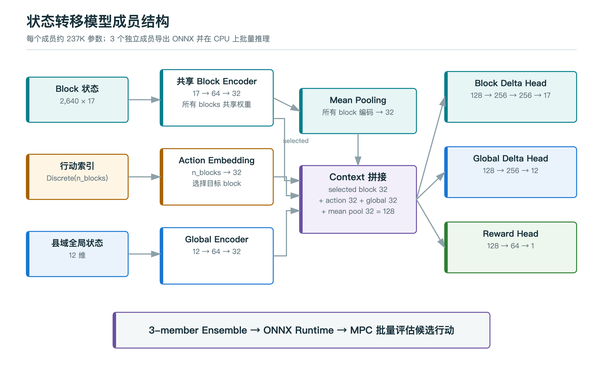{width=96%}

共享 block encoder 同时提供 selected-block 编码和全体 blocks 的 mean pooling；它们与 action embedding、global encoding 拼接为 128 维 context，再进入三个输出头。图底部的 ensemble 表示三个独立完整成员，而不是只对 reward head 做集成。

模型采用 residual prediction：

```text
next_selected_block = selected_block + predicted_block_delta
next_global_state   = global_state + predicted_global_delta
predicted_reward    = reward_head(context)
```

每个成员导出为 ONNX，由 ONNX Runtime 在 CPU 上批量推理。当前决赛资源包含 3 个成员。

重要扩展边界：`n_blocks` 会静态写入 ONNX 图和 action embedding，因此区域变化后不能直接复用其他区域的 ensemble。服务层通过 `assert_compatible` 与资源检查提前拒绝维度不匹配。

## 6.6 为什么使用对比/排序损失

普通 MSE 更关注预测值的绝对误差，但 MPC 更关心同一状态下“哪个行动更好”。Tool 2 除 transition tuple 外，还采集同一状态下不同动作的 pairwise 样本。

训练目标可概括为：

```text
L_total = L_state_MSE + 0.1 * L_reward_MSE + lambda_rank * L_rank

L_rank = max(0, margin - (R_hat(s, a_better) - R_hat(s, a_worse)))
```

当前默认 `lambda_rank=5.0`、`margin=0.1`。3 个成员使用不同随机种子训练，ensemble 同时提高稳定性，并可提供成员间预测差异作为不确定性信号。当前主 Agent 还没有把 ensemble 方差完整纳入自主风险决策，这是后续 GWM 完善方向。

## 6.7 MPC 如何选择行动

每个环境步骤的算法过程为：

1. 获取当前 block features、global features 和 action mask。
2. 对所有有效 actions 做一次 ensemble 批量预测。
3. 保留全局 top-k 候选及其下一状态。
4. 对每个候选继续向前 rollout `H-1` 步，continuation 可选 random 或 greedy。
5. 计算折扣累计预测回报。
6. 选择累计预测回报最高的第一个行动。
7. 在真实县域环境中执行该行动，得到真实 reward 与下一状态。
8. 重复直到预算或最大步骤结束。

概念公式：

```text
a_t* = argmax_a sum(k=0..H-1) gamma^k * R_hat(s_t+k, a_t+k)
```

决赛快速路径使用 `horizon=1`、`top_k=1`、`n_episodes=1`。这里 `horizon=1` 是每次 MPC 的前瞻步长，`steps_run=100` 是环境实际执行步数，二者不能混为一谈。

## 6.8 A/B/C/D 工具链

| 阶段 | 输入 | 处理 | 输出 | 决赛运行 |
|---|---|---|---|---|
| A / Prepare | DLTB、DEM、行政区等 | 坡度、图斑与 blocks 准备 | prepared data | 复用 |
| B / Sample | prepared environment | 随机 transition + pairwise action 采样 | `transitions.npz`、`pairwise.npz` | 复用 |
| C / Train | transition/pairwise samples | 3-member contrastive ensemble 训练 | ONNX members | 复用 |
| D / Plan | prepared + ONNX ensemble | MPC 搜索与真实环境执行 | 指标、数组、矢量成果 | 真实执行 |

决赛中 A/B/C 显示“已复用”不是没执行过，而是地区级一次性装备已存在；现场真实执行的是 D/Tool 4。技术报告必须明确：当前 v2.2.3 本机证据不是 A/B/C/D 全量重训。

## 6.9 锁定运行结果

当前 0.3.3 / 2.2.3 锁定证据：

| 指标 | 数值 |
|---|---:|
| 输入空间记录 | 101,657 |
| 进入县域环境图斑 | 53,004 |
| 空间 blocks | 2,640 |
| ONNX ensemble members | 3 |
| 环境步骤 | 100 |
| 完成置换对 | 406 |
| 耕地转林地 | 406 |
| 林地转耕地 | 406 |
| 耕地面积变化 | +1.9359359262 ha |
| 平均坡度变化 | -0.6077654973% |
| 连片度变化 | +0.0201841360 |
| 百亩方面积变化 | +35.1316192716 ha |
| 总回报 | 37.4093785660 |

硬约束校验结果：面积未减少、坡度下降、连片度提升、优化空间产物存在，允许写入已验证经验。

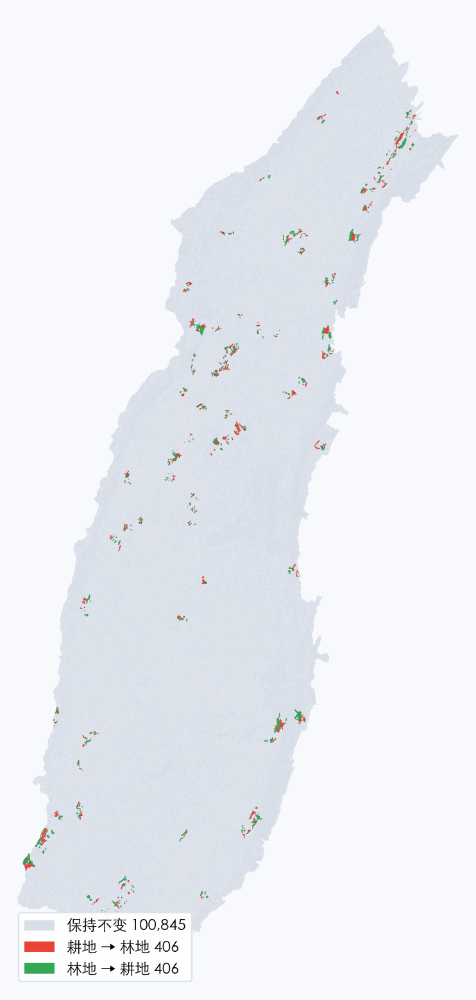{width=43%}

地图按 `CHG_FLAG` 分类：灰色保持不变，红色耕地转林地，绿色林地转耕地。

## 6.10 输出产物

Tool 4 至少产生：

- `mpc_summary.json`：参数、ensemble、逐 episode 指标和 shapefile 汇总。
- `mpc_land_use.npy`：最终地类状态。
- `optimized_dltb.shp`：优化后矢量图斑。
- `optimized_dltb.fgb`：便于 Web 地图加载的 FlatGeobuf。
- `paper9_agent_audit.json`：审计策略、结论、失败原因、下一动作和摘要 SHA-256。

聊天、地图、经验和 PDF 报告都应来自同一个运行目录，不从模型文字反推指标。

## 6.11 为什么当前还不是完整 GWM

当前原型仍缺：

- 多尺度状态表示，例如图斑、街区、县域、流域之间的统一层级。
- 多类型行动，而不只是 block 选择和两类地类置换。
- 长期 rollout 与跨时间尺度动力学。
- 完整的不确定性传播和风险敏感规划。
- 观测同化、因果校准与现实反馈闭环。
- 跨区域独立验证和可迁移的 action representation。

因此最有技术含量的表述不是“我们已经完成通用 GWM”，而是“我们已经把状态、行动、学习型动力学、规划器和审核外环在一个高价值地理空间任务中跑通”。

# 7. 受控自主、记忆与知识循环

## 7.1 自主性定义

自主性不是工具数量，也不是无限循环。当前系统把自主性定义为：

Agent 观察结构化状态，选择受支持行动，获取真实工具反馈，再判断继续、恢复、提交或停止，并为每个终态记录可复核证据。

自主范围被限定在当前数据集、10 个 ADK 工具、一次重规划和确定性业务约束内。

## 7.2 决策状态机

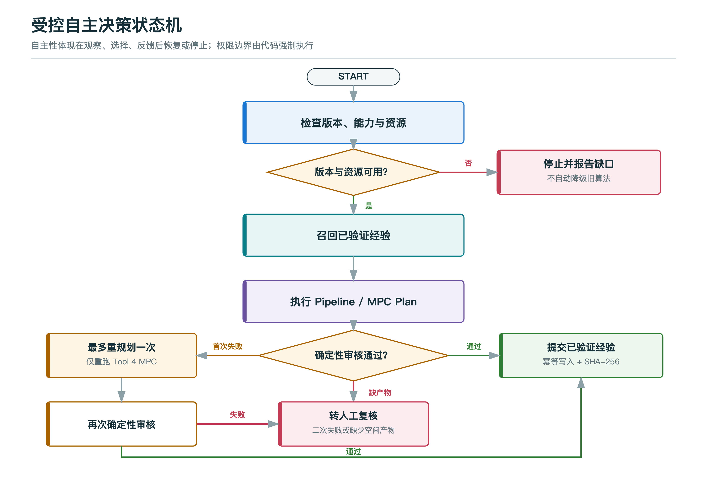{width=94%}

状态机中只有首次普通审核失败可以进入一次重规划；缺少空间产物直接转人工，第二次审核失败也必须停止。提交函数还会再次检查审核文件，因此图中的分支不是只依赖 prompt 的建议。

## 7.3 硬约束校验

`Paper9AuditPolicy` 默认规则：

```text
cultivated_area_change_ha >= 0
slope_change_pct < 0
cont_change > 0
optimized spatial artifact exists
max_replans = 1
```

审计返回机器可执行的 `next_action`：

- `commit_verified_episode`
- `replan_once`
- `stop_and_request_human_review`

如果 `mpc_summary.json`、记录字段或空间产物缺失，系统不会让 LLM 自行解释为成功。

## 7.4 Verified Episodic Memory

经验库不是聊天记录。每条记录包含：

- `schema_version`
- `episode_id`
- 数据集和用户目标
- 真实 `out_dir`
- 规划参数
- 指标与审计策略
- 适配器、包、算法和代码版本 provenance
- `mpc_summary.json` 的 SHA-256

`episode_id` 由稳定字段哈希生成，同一运行重复提交保持幂等。文件采用 append-only JSONL，写入后执行 `flush + fsync`。提交前代码强制检查：

```text
hard_constraint_passed == true
all_expected_outputs_exist == true
```

下一任务按 dataset 召回最近已验证 episode，用于提供有证据的参数和历史上下文。

## 7.5 多层记忆与知识的分工

| 层 | 机制 | 生命周期 | 可影响什么 |
|---|---|---|---|
| 即时状态 | ADK `output_key` / session state | 单次运行 | Agent 间结果传递 |
| 会话记录 | Chainlit Thread / Step | 单会话或历史会话 | 用户可见上下文 |
| 跨会话记忆 | Postgres memory service | 长期 | 历史片段召回 |
| 领域经验 | Verified episodic memory | 长期、只追加 | 规划参数与成功证据 |
| 语义知识 | Semantic registry、reference queries、ContextEngine | 版本化 | schema、术语、few-shot |

记忆回答“过去发生了什么”，知识回答“领域中什么定义和规则有效”。两者不能混成一个无限增长的向量库。

## 7.6 知识更新闭环的当前实现与缺口

当前已实现：

- GeoSQL 执行成功后可写入 reference query store，并做相似度去重。
- 规划结果只有通过审计才能进入 verified episodic memory。
- 召回结果按数据集隔离，并保留版本与摘要哈希。

仍需加强：

- “SQL 可执行”不等于“语义正确”，reference query 的高置信晋升应增加 benchmark 或人工审核。
- ensemble 不确定性尚未自动触发风险升级。
- 高风险耕地规则还不能由 Agent 自动改写或激活。
- 知识过期、冲突和来源优先级需要统一的版本治理。

目标知识循环应是：

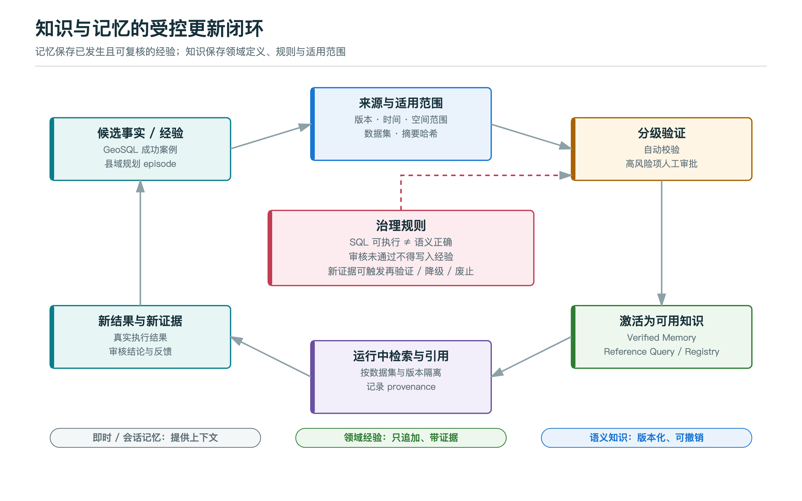{width=96%}

这比“让 Agent 自动学习一切”更符合自然资源高风险业务。

# 8. 可观测性、地图与报告

## 8.1 函数调用轨迹

ADK 事件被应用层捕获，形成按实际发生顺序排列的 `function_call` 与 `function_response`。World Model 展示层把每一步转换为：

- 观察/决策名称。
- 结果状态。
- 内部函数标识。
- 真实单步用时。

总用时包含模型推理、ADK 编排、工具执行和 UI 处理，因此应不小于各工具用时之和。小于 0.1 秒的快速工具显示三位小数，避免全部显示为 `0.0 秒`。

## 8.2 地图证据

地图不是装饰：

- NL2SQL 地图由同一 PostGIS 快照的伴随查询产生，图层要素数与标量答案一致。
- 县域规划地图来自本次 `optimized_dltb` 产物，按 `CHG_FLAG` 渲染。
- 地图为空、图层数不一致或读取了其他运行目录，都应视为演示失败。

## 8.3 图文 PDF 报告

县域规划导出的 `County_Farmland_Planning_Report.pdf` 由 `data_agent/world_model_v21_report.py` 生成，数据来自同一次工具轨迹和运行产物。报告约 5 页，包含：

- 规划成效看板。
- 县域变化地图。
- 六步原生函数调用轨迹。
- 逐函数用时和总用时。
- 硬约束校验表。
- 经验编号和交付物摘要。

报告不应暴露主机或容器绝对路径。内部函数名只作为审计证据，不作为产品名称。

# 9. 评测、可靠性与工程质量

## 9.1 证据必须分层

| 证据层 | 运行内容 | 能证明什么 | 不能证明什么 |
|---|---|---|---|
| A | 真实 Gemma 4 + ADK，工具为确定性替身 | 模型工具选择、停止和恢复 | 30 次真实 MPC 计算 |
| B | 本机真实 0.3.3 / 2.2.3 Tool 4 | 当前绑定、MPC、空间产物与校验 | A/B/C/D 全量重训或部内复测 |
| C | 底层引擎历史内网交接记录 | 历史版本在目标环境的工程可行性 | 当前 GIS Data Agent 生产验收 |
| D | AlphaEarth / OKF 设计 | 扩展方向 | 已进入主链 |

## 9.2 Gemma 4 + ADK 可靠性

三类场景各运行 10 次：

| 场景 | 通过 | 平均延迟 | P95 | 精确轨迹一致性 |
|---|---:|---:|---:|---:|
| 首次审计通过 | 10/10 | 7.97 s | 9.53 s | 100% |
| 版本不兼容停止 | 10/10 | 3.24 s | 4.88 s | 100% |
| 一次重规划后通过 | 10/10 | 13.57 s | 15.31 s | 100% |

总体 30/30，Wilson 95% 区间为 88.65% 到 100%。

为什么仍不能说“100% 可靠”：样本只有 30 次，输入是受控场景，且规划工具响应使用确定性替身。统计区间下界 88.65% 也明确表示证据仍有限。

## 9.3 真实 MPC 验证

锁定路径真实执行 0.3.3 / 2.2.3 的 Tool 4，并通过同一 Agent 轨迹完成审计与经验提交。历史自动验证总耗时为 `93.490 s / 112.940 s`；新版中文 UI 浏览器运行总用时 `88.6 s`，其中 MPC `73.7 s`。不同运行的时间和 episode ID 会变化，业务指标在锁定数据与参数下保持一致。

当前输入被识别为 `legacy_three_digit_test_data`，并复用旧流程生成的 prepared 与 ONNX。因此不能描述成 v2.2.3 对最新真实权威四库的全量重训。

## 9.4 决赛质量检查

| 检查 | 结果 | 说明 |
|---|---:|---|
| 最终镜像运行时回归 | 236 passed | NL2SQL、WorldModel、治理、预检与展示 |
| 宿主交付契约 | 6 passed | Compose、配置、instruction 与脚本入口 |
| 决赛关键 Python 子集 | 73 passed | 与 236 有范围关系，不能相加 |
| 模型网关与工具过滤 | 52 passed | 路由、thinking 与工具分类兼容性 |
| 确定性行为契约 | 5/5 | 成功、恢复、转人工、版本阻断、拒绝未审计写入 |
| Ruff / Python 编译 | passed / passed | 决赛关键模块 |
| 前端生产构建 | passed | 保留大 chunk 与依赖提示 |
| Compose 与核心容器 | passed / healthy | app、PostGIS、Redis |
| 主机预检 | 6/6 | 版本、prepared、3 个 ONNX、Gemma 标签 |

测试数量按不同责任层报告，不合并成一个夸大的“总测试数”。

## 9.5 边缘情况

当前显式覆盖：

- 版本不兼容，2 个工具后停止。
- 缺资源或区域 ensemble 不匹配，拒绝规划。
- 首次约束失败，只允许一次重规划。
- 第二次仍失败，停止并转人工。
- 缺空间产物，禁止经验写入。
- 重复提交同一 episode，保持幂等。
- SQL 引用未 grounding 表，重试后仍不合规则拒绝。
- SQL 为占位、幻觉表或写操作，拒绝执行。

## 9.6 已知非阻断项

- 前端主包仍较大，生产化应继续拆包。
- 部分 ADK/asyncio 依赖存在弃用 warning。
- 真实 MPC 某些空分组计算保留 RuntimeWarning，但未中止锁定验收。
- Live ADK 评测依赖 Ollama，不进入没有模型服务的普通 CI。
- 当前尚缺真实用户数、节省工时和人工修订率的公开统计。

# 10. 部署、安全与可复现性

## 10.1 决赛运行拓扑

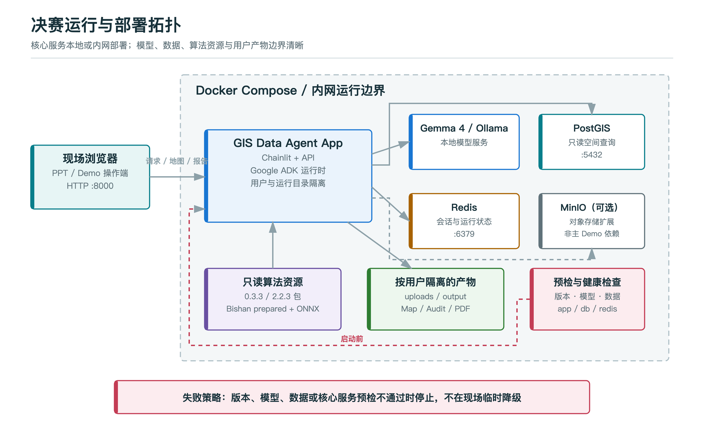{width=96%}

核心 Compose 服务为 app、db 和 redis；MinIO 可承担对象存储扩展。底层算法包与 prepared/ensemble 以只读方式挂载，运行输出写入按用户和时间隔离的目录。

## 10.2 预检

正式演示前必须验证：

- `paper9-mnr-offline-package == 0.3.3`
- `paper9v2 == 2.2.3`
- Bishan prepared 数据存在。
- 3 个 ONNX ensemble members 存在。
- `Gemma4:26b` 标签可用。
- app、PostGIS、Redis 为 healthy。

预检失败时应修复环境或切换到同版本录制视频，不应现场临时降级版本。

## 10.3 安全设计

- NL2SQL 通过只读策略、postprocessor、runtime guard 和数据库执行层形成纵深防御。
- 工具参数做类型、范围和枚举校验。
- 外部路径不直接展示给用户，输出目录按用户隔离。
- 版本不匹配、缺模型、缺数据或缺产物均采用 fail closed。
- 经验记录保存 schema version 和 SHA-256，便于追溯与防止无声替换。
- 高风险业务约束不由 LLM 自评，也不允许 Agent 自动激活新规则。

## 10.4 可复现性

仓库提供：

- `Dockerfile` 与 `docker-compose.gemma4-demo.yml`
- `.env.finals.example`
- 固定模型与算法版本检查
- 预检脚本、真实提示词验证器与行为契约评测
- CQ-125 模型选型数据
- 锁定 MPC 摘要、审计 JSON、地图和发布哈希
- 部署、演示、Q&A、主张边界与质量检查文档

# 11. 扩展到其他地区和生产环境

## 11.1 新增地区的必要步骤

1. 明确 DLTB、DEM、行政区和可选参考图层的数据契约。
2. 检查地类编码、唯一标识、几何有效性和面积单位。
3. 选择适合本地区的投影 CRS，不能机械使用 EPSG:32648。
4. 重新构建空间 blocks 与邻接关系。
5. 重新采样 transition/pairwise 数据。
6. 为新 `n_blocks` 训练本地区 ensemble。
7. 进行 ONNX parity 和区域维度检查。
8. 定义本地区硬约束与人工验收口径。
9. 使用独立空间产物复算面积、坡度和连片度。
10. 通过后才允许进入该地区的 verified memory。

## 11.2 为什么不能直接全国泛化

- 不同地区的地类编码、CRS、坡度分布和图斑粒度不同。
- action embedding 静态依赖 `n_blocks`。
- reward landscape 与政策约束具有地域性。
- 当前 ensemble 学到的是特定地区、特定状态和行动定义下的动力学近似。

架构支持扩展，不等于模型已经跨全国验证。

## 11.3 生产化优先事项

- 把 live model evaluation 放入具备 Ollama 的专用 CI runner。
- 增加超时、模型不可用、数据库瞬断和报告生成失败的端到端测试。
- 为 reference query 增加审核状态和自动降级机制。
- 把 ensemble disagreement 纳入 Agent 的风险信号。
- 对每个地区建立独立 benchmark、数据版本和验收清单。
- 增加真实用户效率指标：任务耗时、人工修订率、SQL 一次执行率和方案复核时间。

# 12. 深度技术问答

## 12.1 Gemma 4 是不是只是把一个固定 Python pipeline 调起来？

**20 秒回答**：不是，但要分层看。A/B/C/D 是确定性算法 pipeline；Gemma 4 的自主性体现在它先观察版本和资源，再根据经验与审计反馈选择停止、提交或只重跑 Tool 4。真实 ADK 评测出现 2、6、8 个工具三种轨迹，而不是每次固定走同一条链。

**继续追问时**：指出 `MentionWorldModelV21` 是标准 `LlmAgent`，`WorldModelV21Toolset` 暴露 10 个函数；`paper9_agent_governance.py` 独立于 ADK，确保模型不能绕过审计。

## 12.2 这算原生函数调用吗？

**20 秒回答**：World Model 主链使用 ADK `FunctionTool` 与 `LongRunningFunctionTool`，Gemma 4 产生结构化函数名和参数，ADK 返回结构化 function response。10 个工具中 5 个是同步控制工具，5 个是长任务工具。UI 的六步轨迹来自真实 ADK 事件，不是事后拼接文本。

**边界**：`@NL2SQL` 的外层函数事件是确定性 wrapper，SQL 合成本身由 Gemma 4 完成；多步动态工具选择的主证据来自 `@WorldModelV21`。

## 12.3 为什么不让 Gemma 4 直接生成最终规划方案？

**20 秒回答**：LLM 适合理解目标和选择工具，但不适合直接保证十万级空间记录上的面积守恒、坡度下降和连片度提升。数值方案由 transition model + MPC + 真实环境执行产生，约束由独立代码校验，这样结果可以复算和审计。

## 12.4 世界模型与强化学习的关系是什么？

**20 秒回答**：这是 model-based planning。先通过环境 rollout 采集 `(s, a, r, s')` 和 pairwise 行动排序数据，训练 transition/reward ensemble，再用 MPC 在模型上前瞻搜索。它借鉴了深度强化学习中的状态、行动、奖励和模型学习，但现场执行不是一个端到端 model-free policy。

## 12.5 为什么叫 GWM 原型而不是普通优化器？

**20 秒回答**：普通优化器可以只在当前状态上直接搜索；这里显式学习了 `state + action -> next state + reward` 的空间动力学，并让 MPC 消费这个预测模型。这已经具备世界模型的核心结构，但状态与行动仍是单领域、单尺度，所以只称领域原型。

## 12.6 为什么使用 ensemble？

**20 秒回答**：多个独立成员能降低单模型偶然误差，并提供预测分歧信号。当前 3 个 ONNX 成员在 MPC 中取均值预测；后续可以把成员方差作为风险信号，在不确定性过高时缩短 rollout、增加真实校验或转人工。

**边界**：当前主闭环主要使用均值，尚未完整实现基于方差的自主风险控制。

## 12.7 `horizon=1` 还能叫 MPC 吗？

**20 秒回答**：可以，它是 MPC 的退化快速配置，每一步仍重新观测状态、评估候选并执行第一步行动。为了 5 分钟演示使用 `H=1, K=1`；研究和生产场景可以使用更大的 H 与 K，但计算时间会上升。`H=1` 不能代表完整长时推演能力。

## 12.8 规划里面积不减少是软奖励还是硬约束？

**20 秒回答**：两层都有。首次调用把 `cultivated_area_floor_delta_ha=0` 传给环境，action mask 排除会突破面积下限的动作；规划结束后，独立审计再次要求面积变化大于等于 0，并同时检查坡度、连片度和空间产物。

## 12.9 自然资源部内网证据到底证明什么？

**20 秒回答**：底层县域耕地优化项目的内部交接材料记录，历史版本曾在目标内网使用真实权威数据完成全流程。这证明了底层算法的环境适配和业务可行性。当前 GIS Data Agent 绑定 0.3.3 / 2.2.3 做本机验证，不能说当前版本已经部内复测或生产验收。

## 12.10 为什么 30/30 还要给 Wilson 区间？

**20 秒回答**：因为有限样本的 100% 不等于总体永远 100%。30/30 的 Wilson 95% 区间下界约为 88.65%，主动报告区间能防止过度主张，也说明下一步应该扩大提示词变体和故障场景。

## 12.11 GeoSQL 的 benchmark 是不是只测语法？

**20 秒回答**：不是，核心指标是 execution accuracy。SQL 必须在同一 PostGIS 数据上执行并返回正确结果。Valid 只能说明能执行，EX 才说明结果正确。模型选型主要看 Full EX 和完整时延。

## 12.12 为什么要做 semantic rewrite，会不会变成手写规则代替模型？

**20 秒回答**：模型负责开放式语言理解和 SQL 合成；rewrite 只修正可确定的数据库与 GIS 语义，例如 SRID、米制距离、字段别名、枚举编码和空间连接去重。规则来自 semantic context，不返回预写答案。它相当于编译器的类型检查和优化，不是替代模型。

## 12.13 如何防止 SQL 注入或破坏数据库？

**20 秒回答**：Prompt 只是第一层，之后还有 AST/规则后处理、写操作拒绝、allow-list 表检查、占位/幻觉 SQL 检测和只读数据库执行。任何一层失败都返回拒绝，不会让模型自行绕过。

## 12.14 自动沉淀 reference query 会不会把错答案学进去？

**20 秒回答**：这是必须承认的风险。当前执行成功案例可以自动沉淀并做相似度去重，但执行成功不等于语义正确。高置信知识的下一步应增加 benchmark 复核、人工审批、来源与版本字段，以及错误后的降级或撤销机制。

## 12.15 Verified Memory 与普通 RAG 有什么不同？

**20 秒回答**：普通 RAG 主要检索文本；这里保存的是通过业务约束和产物完整性校验的结构化 episode，包含版本、参数、指标、摘要哈希和审计策略。它只能辅助下一次决策，不能覆盖高风险规则。

## 12.16 为什么只允许一次重规划？

**20 秒回答**：无限自主循环会增加时延、成本和不可预测性。一次恢复足以证明 Agent 能根据失败反馈调整；第二次仍失败说明模型、资源或约束需要人工判断。这个上限同时写进 prompt 与审计策略。

## 12.17 如何证明地图不是事先准备的图片？

**20 秒回答**：NL2SQL 地图来自与标量查询同一 PostGIS 快照，图层数量必须是 35/1/1；规划地图来自本次运行目录的 `optimized_dltb`，按 `CHG_FLAG` 渲染。报告、地图、指标和 episode 都关联同一次运行产物。

## 12.18 如何支持新数据集？

**20 秒回答**：Agent 层按 dataset preset 解耦，但算法层必须重新完成数据契约、CRS、地类编码、block 构建、采样、训练和地区独立验收。由于 action embedding 静态依赖 `n_blocks`，不能直接拿 Bishan ensemble 跑另一个县。

## 12.19 AlphaEarth 和 OKF 为什么没有放进主 Demo？

**20 秒回答**：因为主 Demo 只展示已经进入真实闭环并有证据的技术。ADK 已在主链；AlphaEarth 目前是长期空间表征方向，OKF 是知识交换 sidecar。未完成的集成不应该为了技术数量占用 5 分钟并增加评委追问风险。

## 12.20 最大创新点是什么？

**20 秒回答**：不是单独的 NL2SQL 或单独的 MPC，而是把 Gemma 4 的任务级决策、ADK 原生函数调用、学习型空间动力学、MPC、确定性审计和已验证经验连接成受控闭环。它展示了下一代空间智能体从“LLM 加工具”走向“LLM 加 GWM”的可实现路径。

# 13. 可说、限定说与不能说

## 13.1 可以直接说

- Gemma 4 26B 在 CQ-125 上执行正确 113/125，31B 为 114/125。
- 26B 完整基准 12.50 分钟，31B 为 20.04 分钟，26B 约快 37.6%。
- World Model Agent 使用 Google ADK 的 10 个函数工具。
- 真实 Gemma 4 + ADK 在三个受控分支中运行 30 次，30/30 符合契约。
- 当前真实 Tool 4 处理 101,657 条输入、53,004 个环境图斑和 2,640 个 blocks。
- 406 对置换后，面积、坡度和连片度通过硬约束校验。
- 未通过审计或缺空间产物的结果不能进入 verified memory。
- 当前实现是领域化 GWM 原型。

## 13.2 必须带限定词

- 30/30 是真实模型编排评测，算法工具为确定性替身。
- 本机运行真实执行 0.3.3 / 2.2.3 的 Tool 4，但复用历史 prepared/ONNX。
- 历史内网证据属于底层优化项目，不等于当前 Agent 生产验收。
- 架构支持区域扩展，不等于已经全国泛化。
- AlphaEarth 是 `Tech Preview`，OKF 是知识交换 sidecar。

## 13.3 不能说

- “Gemma 4 直接计算了 MPC 数值。”
- “A/B/C/D 固定 pipeline 就是大模型的动态规划。”
- “MPC 本身就是世界模型。”
- “当前已经是完整通用地理空间世界模型。”
- “0.3.3 / 2.2.3 已在自然资源部完成生产验证。”
- “当前 Bishan 输入是最新真实权威四库数据。”
- “30/30 证明所有真实问题 100% 可靠。”
- “AlphaEarth 和 OKF 已进入生产闭环。”

# 14. 代码与证据索引

## 14.1 核心代码

| 主题 | 文件 / 函数 |
|---|---|
| Gemma 4 模型配置 | `data_agent/model_gateway.py::ModelRegistry` |
| Agent 构建 | `data_agent/agent.py::_build_mention_nl2sql_agent`、`_build_mention_world_model_v21_agent` |
| World Model instruction | `data_agent/paper9_agent_prompt.py::PAPER9_AGENT_INSTRUCTION` |
| 10 个 ADK 工具 | `data_agent/toolsets/world_model_v21_tools.py::WorldModelV21Toolset` |
| A/B/C/D 适配器 | `data_agent/world_model_v21.py::WorldModelV21Service` |
| 硬约束审计 | `data_agent/paper9_agent_governance.py::evaluate_paper9_summary` |
| 经验库 | `data_agent/paper9_agent_governance.py::Paper9EpisodeStore` |
| NL2SQL 高层工具 | `data_agent/nl2sql_executor.py::run_nl2semantic2sql` |
| Semantic rewrite | `data_agent/nl2sql_semantic_rewrite.py::apply_semantic_sql_rewrites` |
| SQL runtime guard | `data_agent/runtime_guards.py::is_safe_sql` |
| NL2SQL 地图 | `data_agent/nl2sql_presentation.py` |
| 规划中文展示 | `data_agent/world_model_v21_presentation.py` |
| 规划 PDF | `data_agent/world_model_v21_report.py` |

底层县域优化项目：

| 主题 | 文件 |
|---|---|
| 17/12 维状态与环境 | `arcgis-farmland-mpc/farmland_mpc/county_env.py` |
| transition network | `arcgis-farmland-mpc/farmland_mpc/transition_model.py` |
| 对比学习 trainer | `arcgis-farmland-mpc/farmland_mpc/contrastive_trainer.py` |
| ensemble 训练与 ONNX | `arcgis-farmland-mpc/farmland_mpc/train_ensemble.py` |
| ONNX ensemble runtime | `arcgis-farmland-mpc/farmland_mpc/ensemble_runner.py` |
| MPC | `arcgis-farmland-mpc/farmland_mpc/mpc_plan.py` |

## 14.2 关键证据

| 证据 | 文件 |
|---|---|
| 模型选型 | `docs/assets/gemma4_host228_scale_sweep_summary.csv` |
| ADK 30 次可靠性 | `data_agent/demo_evidence/paper9/finals_20260730/adk_reliability_report.json` |
| 最终真实提示词验证 | `data_agent/demo_evidence/paper9/finals_20260730/verified_finals_demo_report.json` |
| 锁定 MPC 摘要 | `docs/finals/evidence/world_model_bishan_20260730_155442/mpc_summary.json` |
| 锁定审计 | `docs/finals/evidence/world_model_bishan_20260730_155442/paper9_agent_audit.json` |
| 行为契约 | `data_agent/demo_evidence/paper9/finals_20260730/behavior_contract_report.json` |
| 质量检查 | `docs/finals/quality_gate_report.md` |
| 主张边界 | `docs/finals/claim_register.md` |
| 唯一演示脚本 | `docs/finals/verified_demo_script.md` |

# 附录 A：锁定参数与版本

```text
Gemma model:             Gemma4:26b
ADK model adapter:       LiteLlm / ollama_chat
WorldModel adapter:      2.1.0
algorithm package:       0.3.3
algorithm version:       2.2.3
dataset:                 bishan
env_kind:                county
horizon:                 1
top_k:                   1
n_episodes:              1
continuation:             greedy
scoring:                  reward
cultivated area floor:   0 ha delta
ensemble members:        3
environment max steps:   100
```

# 附录 B：术语表

| 术语 | 含义 |
|---|---|
| ADK | Google Agent Development Kit，Agent 运行时与工具框架 |
| FunctionTool | 短时同步函数工具 |
| LongRunningFunctionTool | 长任务函数工具 |
| GeoSQL | 带空间类型、谓词、距离、面积、SRID 等语义的 SQL |
| EX | Execution Accuracy，执行结果正确率 |
| Valid | SQL 能成功执行，不一定答案正确 |
| GWM | Geospatial World Model，地理空间世界模型 |
| Transition Model | 预测 `state + action -> next state + reward` 的模型 |
| Ensemble | 多个独立模型成员组成的集成 |
| MPC | Model Predictive Control，模型预测控制 |
| Horizon | 每次 MPC 前瞻的步数 |
| Steps Run | 环境实际执行的步数 |
| Verified Episode | 通过业务约束和产物完整性校验的运行经验 |
| Fail Closed | 缺证据或不兼容时默认拒绝，而不是默认放行 |

# 附录 C：评分维度对应关系

| 评审维度 | 本手册中的核心证据 |
|---|---|
| 真实影响力 30% | 第 2 章用户与任务；第 5.7 节真实空间问数；第 6.9 节县域指标；第 13 章证据边界 |
| 技术卓越度 25% | 第 3 章模型选型；第 4 章 ADK；第 5 章 GeoSQL；第 6 章 GWM/MPC；第 7 章审核与记忆 |
| 功能完备性 20% | 第 8 章地图/报告；第 9.5 节边缘情况；第 10 章部署预检 |
| 创新性 15% | 第 4.1 节两层规划；第 6.2 节 GWM 关系；第 7 章受控自主闭环 |
| 演示表现 10% | 第 1 章快速索引；第 8 章证据呈现；第 12 章深度问答；第 14 章代码与证据索引 |
