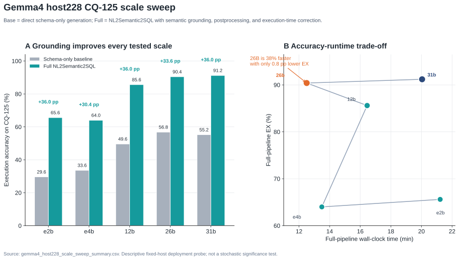

# GIS Data Agent Gemma 4 AI Agent 赛道技术报告

日期：2026-06-07  
参赛赛道：Track A - AI Agent  
核心模型：Gemma 4 26B MoE，本项目通过 Ollama tag `Gemma4:26b` 和模型别名 `gemma4-26b-host228` 调用。

## 1. 摘要

GIS Data Agent 是一个面向真实 GIS 数据分析与空间规划的多智能体系统。本次 Gemma 4 AI Agent 赛道提交聚焦两个可审计场景：

1. `NL2Semantic2SQL`：把中文空间问题转换为可执行 PostgreSQL/PostGIS SQL，覆盖空间谓词、距离、长度、面积、SRID、`geometry/geography` 单位和空间 join 去重等普通 NL2SQL 难以稳定处理的问题。
2. `WorldModel v2.1`：把县域耕地空间布局优化封装为世界模型状态检查和 A/B/C/D 四阶段工具链，使用 learned transition model + MPC 在 Bishan / Dongxing 数据集上生成可视化优化结果。

系统不是“把问题拼进 prompt 后让模型自由回答”。Gemma 4 通过 Google ADK Agent 和 Toolset 获取结构化函数声明，调用真实工具完成语义 grounding、PostGIS 执行、世界模型 MPC 规划、Memory 持久化和运行日志记录。比赛演示中的关键证据是：短句输入、原生工具调用轨迹、可复现 Docker 环境、真实数据库/模型产物、Memory 与运行日志截图。

## 2. 参赛要求对齐

| 比赛要求 | 本项目对应实现 | 代码或文档位置 |
|---|---|---|
| Gemma 4 调用逻辑 | `gemma4-26b-host228` 通过 Ollama Chat 接入，所有 demo 模型 tier 指向 26B | `data_agent/model_gateway.py`, `docker-compose.gemma4-demo.yml` |
| Native Function Calling / Tool Calling | ADK `FunctionTool` / `LongRunningFunctionTool` 暴露工具；WorldModel 由 Gemma 调用 `world_model_v21_status -> world_model_v21_pipeline` | `data_agent/agent.py`, `data_agent/toolsets/world_model_v21_tools.py` |
| 多步规划 | WorldModel v2.1 A/B/C/D pipeline：Prepare, Sample, Train, Plan；演示中复用 A/B/C，真实运行 Tool 4 MPC | `data_agent/world_model_v21.py`, `data_agent/world_model_v21_presentation.py` |
| Memory | ADK memory service、空间记忆工具、自动事实提取、运行日志中的 Memory 统计 | `data_agent/conversation_memory.py`, `data_agent/memory.py`, `data_agent/app.py` |
| 运行日志截图 | 前端“平台运营 -> 运行日志”展示 Thread/Step、Tool Calling、Memory、地图事件 | `data_agent/frontend_api.py`, `frontend/src/components/datapanel/AgentRunLogsTab.tsx` |
| Docker 部署 | 纯 Docker Compose，包含 PostGIS/pgvector、Redis、app，挂载 Paper9 和 Bishan/Dongxing 数据 | `docker-compose.gemma4-demo.yml` |
| 技术报告 | 本文档 | `docs/gemma4_ai_agent_technical_report.md` |
| Memory / Tool Calling 代码说明 | 限定 `nl2semantic2sql` 和 `worldmodelv2.1` 两个主场景，逐项说明函数调用链、Memory 和运行日志 | `docs/gemma4_ai_agent_code_walkthrough.md` |
| 演示视频脚本 | 5 分钟以内，覆盖 NL2SQL、WorldModel、Memory、日志 | `docs/gemma4_ai_agent_demo_script.md` |

## 3. 为什么选择 Gemma 4 26B

### 3.1 评测来源

模型选择基于同一套 CQ-125 PostGIS benchmark，对 Gemma 4 家族 5 个模型规模进行同主机固定环境评测。原始证据已复制到本仓库：

- `docs/assets/gemma4_host228_scale_sweep_summary.csv`
- `docs/assets/gemma4_host228_scale_sweep.svg`



### 3.2 结果表

| 模型 | CQ-125 full EX | CQ-125 full Valid | full runtime | 说明 |
|---|---:|---:|---:|---|
| Gemma4:e2b | 82/125 = 65.6% | 108/125 = 86.4% | 21.22 min | 小模型可运行，但空间 SQL 执行准确率不足 |
| Gemma4:e4b | 80/125 = 64.0% | 110/125 = 88.0% | 13.49 min | 速度可接受，准确率不足 |
| Gemma4:12b | 107/125 = 85.6% | 120/125 = 96.0% | 16.45 min | 可作为备选，但不如 26B |
| Gemma4:26b | 113/125 = 90.4% | 118/125 = 94.4% | 12.50 min | 本次提交采用 |
| Gemma4:31b | 114/125 = 91.2% | 117/125 = 93.6% | 20.04 min | EX 最高，但演示延迟更高 |

### 3.3 选择结论

31B 在该固定主机部署探针中取得最高 EX，`114/125 = 91.2%`；26B 为 `113/125 = 90.4%`，只低 1 道题，也就是 0.8 个百分点。但 26B 的 full runtime 是 12.50 分钟，31B 是 20.04 分钟，26B 约快 37.6%。SVG 图中也标注了“26B is 38% faster”。

因此本项目选择 Gemma 4 26B 的理由是工程上的准确率-延迟折中：它接近 31B 的空间 SQL 执行准确率，同时更适合 5 分钟比赛演示中的实时 Tool Calling、多步规划和本地 Docker 验证。该评测是固定主机部署探针，不写成统计显著性结论。

## 4. 总体架构

本次参赛版本可以按七层理解：

```mermaid
flowchart TB
  U[用户界面<br/>Chainlit + React 工作台] --> R[@mention 路由<br/>NL2SQL / WorldModelV21 / General]
  R --> A[Google ADK Agent 编排层<br/>LlmAgent / SequentialAgent / ParallelAgent / LoopAgent]
  A --> M[Gemma 4 模型网关<br/>gemma4-26b-host228 via Ollama]
  A --> T[Toolset / Native Function Calling<br/>FunctionTool / LongRunningFunctionTool]
  T --> N[NL2Semantic2SQL 引擎<br/>Semantic layer + grounding + PostGIS]
  T --> W[WorldModel v2.1 引擎<br/>Tool 1/2/3/4 + MPC]
  T --> MEM[Memory 工具<br/>save / recall / auto_extract]
  N --> PG[(PostgreSQL + PostGIS + pgvector)]
  MEM --> PG
  W --> FS[(Paper9 repo + Bishan/Dongxing runs)]
  A --> LOG[Thread/Step 运行日志<br/>Tool calls / Memory / Map events]
  LOG --> UI[运行日志截图]
```

### 4.1 交互层

用户可以在对话框中输入短句，例如：

```text
@WorldModelV21 请先检查世界模型 v2.1 状态，然后使用 dongxing 数据集运行一次快速县域 MPC 规划。
```

这类输入不要求用户手工填写 `prepared_dir`、`ensemble_dir`、`horizon`、`top_k` 等长参数。Agent 根据数据集名称解析默认路径，并把结构化参数交给工具。需要微调参数时，可以通过“世界模型 v2.1”tab 手动点击和修改。

### 4.2 ADK 多智能体编排层

`data_agent/agent.py` 是核心编排入口。系统使用 Google ADK 的：

- `LlmAgent`：负责模型推理、工具选择和最终响应。
- `SequentialAgent`：用于固定流程，例如数据工程、分析、可视化、总结。
- `ParallelAgent`：用于可并行的语义预取和数据探查。
- `LoopAgent`：用于生成-检查类迭代质量控制。

本次比赛重点使用两个显式路由 Agent：

- `MentionNL2SQL`：针对 `@NL2SQL`，在 Gemma/Ollama 路径上使用 `DirectNL2SemanticSQLAgent` 触发 `run_nl2semantic2sql` 工具事件，并由 Gemma 4 26B 完成 grounding 后 SQL 合成。
- `MentionWorldModelV21`：针对 `@WorldModelV21`，只暴露 WorldModel v2.1 工具，并要求先检查状态，再按默认策略调用 A/B/C/D pipeline。

### 4.3 Gemma 4 模型网关

`data_agent/model_gateway.py` 将业务模型名映射到实际后端。比赛 Docker 环境中：

```yaml
ROUTER_MODEL: gemma4-26b-host228
MODEL_FAST: gemma4-26b-host228
MODEL_STANDARD: gemma4-26b-host228
MODEL_PREMIUM: gemma4-26b-host228
NL2SQL_AGENT_MODEL: gemma4-26b-host228
NL2SQL_LLM_SCHEMA_MAPPER_MODEL: gemma4-26b-host228
OLLAMA_API_BASE: http://192.168.25.228:11434
```

这样可以确保路由、标准分析、NL2SQL schema mapper 都使用同一 Gemma 4 26B 模型。网关中对 Ollama/Gemma 路径关闭 reasoning/thinking 输出，避免把内部推理泄漏到用户响应或工具参数中。

### 4.4 Tool Calling 层

工具层是参赛技术重点。系统不是让 LLM 输出“伪 SQL”或“伪规划结果”，而是把函数声明交给 ADK，由 Agent 调用真实工具：

- `run_nl2semantic2sql(user_question)`：执行语义解析、SQL 生成、PostGIS 查询和结果格式化。
- `world_model_v21_status()`：检查 Paper9 包、默认路径、ONNX ensemble、PROJ 运行时。
- `world_model_v21_pipeline(...)`：运行或复用 A/B/C/D 四阶段世界模型工具链。
- `world_model_v21_plan(...)`：只运行 Tool 4 MPC。
- `save_memory(...)`, `recall_memories(...)`：保存与检索持久记忆。

工具调用与响应会被 `data_agent/app.py` 捕获为 Chainlit `Step`，并由 `GET /api/agent/run-logs` 聚合给前端运行日志 tab。

## 5. NL2Semantic2SQL 架构

### 5.1 为什么空间 SQL 需要专门架构

大多数 LLM 对普通 SQL 已有一定能力，但对空间 SQL 的稳定支持明显不足。PostGIS 查询不只是表名、列名和 `JOIN`，还包括：

- OGC 空间谓词：`ST_Intersects`, `ST_Contains`, `ST_Within`, `ST_DWithin`。
- 度量单位：长度、面积、距离在 `geometry` 和 `geography` 下含义不同。
- 坐标参考系统：不同 SRID 之间需要 `ST_Transform`，否则结果错误或执行失败。
- 空间 join 去重：建筑物与多条道路相交时必须按主键 `COUNT(DISTINCT ...)`，否则统计膨胀。
- KNN 和近邻查询：`<->`、`ST_Distance`、`ORDER BY` 与 `LIMIT` 的组合需要具体规则。
- 查询安全：生产系统不能让模型执行 DDL/DML 或无界大表扫描。

因此本项目采用 `NL2Semantic2SQL`，目标不是替代 LLM，而是给 Gemma 4 提供可执行、可约束、可纠错的空间 SQL harness。

### 5.2 三阶段流水线

参考 NL2Semantic2SQL 研究稿《Schema-Aware Grounding Effects in PostGIS NL2GeoSQL》，系统实现为三阶段：

1. Semantic resolution：基于 `agent_semantic_sources`、`agent_semantic_registry` 和语义层别名解析候选表、列、值域、空间操作和单位。
2. Grounded context assembly：检查 live PostGIS schema，注入 geometry type、SRID、样例值、few-shot 参考查询和空间算子规则。
3. SQL synthesis + correction：Gemma 4 26B 生成 SQL，随后经过语义 rewrite、AST 安全后处理、只读执行、失败反馈和有限重试。

对应代码：

- `data_agent/semantic_layer.py`
- `data_agent/nl2sql_grounding.py`
- `data_agent/nl2sql_executor.py`
- `data_agent/nl2sql_semantic_rewrite.py`
- `data_agent/sql_postprocessor.py`
- `data_agent/nl2sql_presentation.py`

### 5.3 空间 SQL harness 示例

当前 demo 中已经验证的空间查询包括：

| 查询 | 关键难点 | 已验证结果 |
|---|---|---|
| 统计重庆 2021 年 `bridge = T` 道路总长度，单位公里 | `ST_Length` 在地理坐标下不能直接当米，需要 `geometry::geography` | `1376.5975723658505 km` |
| 统计距离道路网络中最长桥梁 100 米范围内的高德 POI 数量 | 子查询找最长桥梁，`ST_DWithin` 使用米单位，POI 主键去重 | `35` |
| 统计与任意桥梁道路相交的建筑物轮廓数量 | `ST_Intersects` 空间谓词，建筑物和多条桥梁道路 join 后要 `COUNT(DISTINCT b."Id")` | `1` |

这些例子体现了 harness 的作用：Gemma 4 负责语言理解和 SQL 合成，但最后的执行正确性由语义层、空间规则、PostGIS 执行和后处理共同约束。

### 5.4 NL2SQL Tool Calling 说明

在 Gemma/Ollama demo 路径中，`@NL2SQL` 是显式路由。`DirectNL2SemanticSQLAgent` 会发出 ADK `function_call` 事件：

```python
types.Part.from_function_call(
    name="run_nl2semantic2sql",
    args={"user_question": question},
)
```

随后调用 `run_nl2semantic2sql(question)`，再发出 `function_response`。这样做的原因是：空间 SQL 场景需要确定性 grounding、可审计 SQL 和真实 PostGIS 执行，不适合让模型在多轮 agent loop 中随意探索工具。Gemma 4 的核心作用在 SQL 合成环节，工具调用事件则保证前端和运行日志能清晰展示“自然语言 -> 工具 -> SQL -> 数据库结果 -> 地图”的闭环。

## 6. WorldModel v2.1 架构

### 6.1 算法和“世界模型”的关系

参考 WorldModel v2.1 研究稿《Reproducible model-based AI planning for county-scale farmland consolidation》，WorldModel v2.1 是一个 model-based planning 系统。这里的“世界模型”不是 Dreamer 式的 recurrent latent generative world model，而是面向县域耕地整理的前馈确定性 transition model ensemble：

```text
state_t + action_t -> predicted state_{t+1}, predicted global metrics, predicted reward
```

它学习真实环境中“选择某个空间 block 后，环境执行若干耕地-林地交换”的状态转移和奖励变化。MPC 在每一步采样候选动作序列，用 learned transition model 快速向前滚动，选择累计预测奖励最高的第一步动作，再在真实环境中执行。这样能用较低成本替代昂贵的全环境仿真搜索。

核心要点：

- 状态：县域 block 级特征，包括耕地、林地、坡度、连通性等。
- 动作：选择一个空间 block。
- 环境执行：在该 block 内执行 paired farmland-forest swaps。
- 奖励：综合坡度降低、连通性改善、百亩方面积变化等目标。
- 模型：3 到 5 个 transition model 组成 ensemble，并导出 ONNX。
- 训练改进：使用 contrastive/ranking loss 改善 within-state action ranking，因为 MPC 更依赖动作排序而不是绝对 reward 标定。

### 6.2 A/B/C/D 工具链

论文中的 ArcGIS Pro 四工具 pipeline 已集成到 GIS Data Agent：

| 阶段 | 工具 | 功能 | 参赛演示策略 |
|---|---|---|---|
| A | Tool 1 Prepare | DLTB + DEM -> block/parcels prepared data | 演示中复用已有 prepared |
| B | Tool 2 Sample | prepared -> pairwise/transition samples | 演示中复用已有 samples |
| C | Tool 3 Train | samples -> contrastive ONNX ensemble | 演示中复用已有 ensemble |
| D | Tool 4 Plan | ensemble -> MPC planning output | 演示中真实运行快速县域 MPC |

对应代码：

- `data_agent/toolsets/world_model_v21_tools.py`：ADK Toolset，暴露 status/prepare/sample/train/plan/pipeline。
- `data_agent/world_model_v21.py`：Paper9 adapter，调用 Tool 1-4，校验路径和 ONNX，归一化输出。
- `data_agent/world_model_v21_presentation.py`：把 A/B/C/D 阶段、指标和地图说明格式化给用户。
- `frontend/src/components/datapanel/WorldModelV21Tab.tsx`：提供手动运行/复用 A-D 和只运行 Tool 4 的页面。

### 6.3 默认数据集和参数

为了避免在对话框中输入大量路径，工具层内置数据集 preset：

| dataset | prepared_dir | ensemble_dir |
|---|---|---|
| `bishan` / `璧山` | `/app/bishan-runs/prepared` | `/app/bishan-runs/prepared/ensemble_seed0` |
| `dongxing` / `东兴` | `/app/dongxing-runs/prepared` | `/app/dongxing-runs/prepared/ensemble_seed0` |

`MentionWorldModelV21` 的 instruction 明确要求：

- 用户提到 `dongxing` 或 `东兴` 时，工具参数必须设置 `dataset="dongxing"`。
- 用户提到 `bishan` 或 `璧山` 时，工具参数必须设置 `dataset="bishan"`。
- 用户未提供路径时，`prepared_dir` 和 `ensemble_dir` 保持空字符串，由工具根据 dataset 填充。
- 默认快速演示参数为 `env_kind=county`, `horizon=1`, `top_k=1`, `n_episodes=1`, `continuation=greedy`, `scoring=reward`。

这使得用户只需输入短句：

```text
@WorldModelV21 请先检查世界模型 v2.1 状态，然后使用 Bishan 数据集运行一次快速县域 MPC 规划。
```

### 6.4 WorldModel Tool Calling 和多步规划

`MentionWorldModelV21` 是标准 `LlmAgent`，绑定 `WorldModelV21Toolset()`。比赛演示推荐展示：

```text
world_model_v21_status -> world_model_v21_pipeline
```

其中 `world_model_v21_pipeline` 内部返回 A/B/C/D 阶段状态，例如：

```text
A / Tool 1 Prepare: skipped_reused
B / Tool 2 Sample: skipped_reused
C / Tool 3 Train: skipped_reused
D / Tool 4 Plan: ok
```

这比只展示两个工具名更符合比赛对“多步规划”的考察：status 是 Agent 主动的前置环境检查，pipeline 则展开完整 A/B/C/D 业务步骤，并在 UI 进度、最终响应和运行日志中展示每个阶段。

### 6.5 地图可视化

Tool 4 输出 `optimized_dltb.shp`、`optimized_dltb.fgb`、`mpc_land_use.npy`、`mpc_summary.json`。GIS Data Agent 会把规划结果加载到地图中，并按 `CHG_FLAG` 分类：

- 灰色：保持不变。
- 红色：耕地 -> 林地。
- 绿色：林地 -> 耕地。

这样评委不仅能看到数值指标，还能直观看到耕地空间布局优化的变化位置。

### 6.6 已验证数据集结果

根据本地 Docker 真实运行记录：

| 数据集 | blocks | parcels | steps_run | total_reward | 说明 |
|---|---:|---:|---:|---:|---|
| Bishan | 2640 | 53004 | 100 | 66.43446147434678 | A/B/C reused，D/Tool 4 真实运行 |
| Dongxing | 3711 | 76377 | 100 | 112.63640181479221 | A/B/C reused，D/Tool 4 真实运行 |

这些结果说明系统不是只绑定 Bishan 单一 demo，而是能根据用户短句切换 Bishan/Dongxing 数据集、解析正确路径并执行县域级 MPC。

## 7. Memory 与运行日志

### 7.1 Memory 不是历史会话

比赛中的 Memory 应理解为 Agent 可持久化有价值的用户偏好、分析结论或上下文事实，并在后续请求中检索复用。它不同于 UI 上的“历史会话”。历史会话主要恢复 Chainlit `Thread/Step` 消息；Memory 是 `agent_user_memories` 和 ADK memory service 里的可检索上下文。

### 7.2 当前 Memory 架构

系统当前文档和代码对应五层记忆体系，加上 ContextEngine 和 FeedbackLoop：

| 层级 | 机制 | 作用 | 代码 |
|---|---|---|---|
| L1 即时状态 | ADK `output_key` / session state | 单次 pipeline 内 Agent 间传递 | `data_agent/agent.py` |
| L2 会话记忆 | Chainlit session / Thread / Step | 当前会话消息和步骤 | `data_agent/session_storage.py`, `data_agent/app.py` |
| L3 跨会话记忆 | `PostgresMemoryService` | ADK Runner 检索历史片段并注入 | `data_agent/conversation_memory.py` |
| L4 长期空间记忆 | `save_memory`, `recall_memories`, `auto_extract` | 用户偏好、区域、分析结果、自动发现 | `data_agent/memory.py` |
| L5 知识与上下文 | ContextEngine providers, ReferenceQueryStore, KB/GraphRAG | few-shot、知识库、指标定义、案例库 | `data_agent/context_engine.py`, `data_agent/reference_queries.py` |

比赛演示最适合展示 L4 工具级 Memory，因为它可截图、可查询、可证明不是临时缓存：

```text
save_memory(memory_type="analysis_result", key="Gemma4空间演示_...", value={...})
recall_memories(memory_type="analysis_result", keyword="Gemma4空间演示")
```

### 7.3 自动提取和运行日志

`data_agent/app.py` 会在分析响应后尝试自动提取 facts，并调用 `save_auto_extract_memories()` 写入 `auto_extract` 类型记忆。`data_agent/frontend_api.py` 的 `/api/agent/run-logs` 会统计每个 thread 的：

- tool_count
- memory_count
- map_event_count
- step timeline
- function call args / response 摘要

前端 `AgentRunLogsTab.tsx` 展示这些统计，适合提交运行日志截图。

## 8. Guardrails 与安全执行

GIS Data Agent 的安全机制对比赛也很重要，因为空间 SQL 和规划工具都接触真实数据：

1. 输入护栏：`guardrails.py` 中包含输入长度限制和 SQL injection 模式检测。
2. 工具级策略：`GuardrailsPlugin` 通过 ADK `before_tool_callback` 执行工具策略。
3. SQL 后处理：`sql_postprocessor.py` 基于 AST 做只读 SELECT 安全检查、标识符修正和大表 `LIMIT` 保护。
4. 数据库执行：NL2SQL 走 PostgreSQL/PostGIS 只读执行和有限重试。
5. WorldModel 预检：Tool 4 前检查 `prepared_dir`、`ensemble_dir`、ONNX 成员和维度匹配，不允许用不匹配的 Dongxing ensemble 误跑。
6. HITL 能力：高风险工具可通过 ADK plugin 挂起并请求人工审批。

这些机制保证 demo 结果不是模型幻觉，而是经过真实执行和前置校验的结果。

## 9. Docker 可复现环境

比赛演示使用纯 Docker，而不是 Kubernetes。启动入口：

```bash
docker compose -f docker-compose.gemma4-demo.yml up -d --build
```

核心服务：

- `db`：`gis-postgis-pgvector:16-3.4`，包含 PostgreSQL/PostGIS/pgvector。
- `redis`：任务状态和缓存。
- `app`：GIS Data Agent + Chainlit + frontend API。

关键挂载：

- `/Users/zhouning/arcgis-farmland-mpc:/app/paper9-demo:ro`
- `/Users/zhouning/farmland_mpc_runs/bishan:/app/bishan-runs:ro`
- `/Users/zhouning/arcgis-farmland-mpc/runs/dongxing:/app/dongxing-runs:ro`

关键环境变量：

- `MODEL_CONFIG_FORCE_ENV=true`
- `ROUTER_MODEL=gemma4-26b-host228`
- `NL2SQL_AGENT_MODEL=gemma4-26b-host228`
- `PAPER9_FARMLAND_MPC_REPO=/app/paper9-demo`
- `PAPER9_FARMLAND_MPC_DEFAULT_PREPARED_DIR=/app/bishan-runs/prepared`
- `PAPER9_FARMLAND_MPC_DEFAULT_ENSEMBLE_DIR=/app/bishan-runs/prepared/ensemble_seed0`
- `PROJ_DATA` / `PROJ_LIB` 指向容器内 pyproj 数据库，避免 `EPSG:32648` 投影错误。

## 10. 演示视频建议结构

5 分钟内建议按以下顺序：

| 时间 | 内容 | 评分点 |
|---|---|---|
| 0:00-0:20 | 说明 GIS Data Agent 使用 Gemma 4 26B，面向真实空间 SQL 和县域规划 | 真实痛点 |
| 0:20-2:05 | `@NL2SQL` 运行桥梁道路/建筑/POI 空间查询，展示 SQL、结果、地图 | Tool Calling + PostGIS |
| 2:05-3:45 | `@WorldModelV21` 输入短句，展示 status -> A/B/C/D pipeline，Bishan/Dongxing MPC | 多步规划 + 世界模型 |
| 3:45-4:25 | 保存并检索 Memory，说明 Memory 和历史会话区别 | Agent Memory |
| 4:25-5:00 | 打开运行日志，展示 Tool Call、Memory、Step Timeline 和地图事件截图 | 可审计性 |

## 11. 已知边界

1. Gemma 4 26B 的选择来自 CQ-125 固定主机部署探针，不声称统计显著优于 31B。
2. `@NL2SQL` 在 Gemma/Ollama demo 路径上采用显式路由和确定性 ADK function call 事件，Gemma 4 主要用于 SQL 合成；`@WorldModelV21` 更适合展示 Gemma 驱动的多步工具规划。
3. WorldModel v2.1 的 demo 默认复用 A/B/C 长任务产物，现场真实运行 D/Tool 4，以保证 5 分钟视频可控；完整 A/B/C/D 代码链路已经集成。
4. Memory 自动提取有触发条件和配额限制，比赛录制应明确展示 `save_memory` 与 `recall_memories` 的工具级持久记忆。
5. README 和 GitHub About 已按本文档叙事刷新；提交前还需要补齐运行日志截图和 5 分钟演示视频。

## 12. 结论

本项目对准 AI Agent 赛道的核心不是做一个聊天式 GIS 问答，而是把 Gemma 4 26B 放进可审计的工程闭环中：ADK 多智能体编排负责路由和多步规划，Gemma 4 负责语言理解与工具选择，Toolset 负责真实 PostGIS 和世界模型执行，Memory 与运行日志负责跨会话上下文和评委可检查的证据。

从技术贡献看，`NL2Semantic2SQL` 解决的是空间 SQL 中语义 grounding、PostGIS 算子和执行正确性问题；`WorldModel v2.1` 解决的是县域耕地布局优化中昂贵环境仿真和组合规划问题。二者共同构成了一个以 Gemma 4 原生工具调用为核心的 GIS AI Agent 提交。
