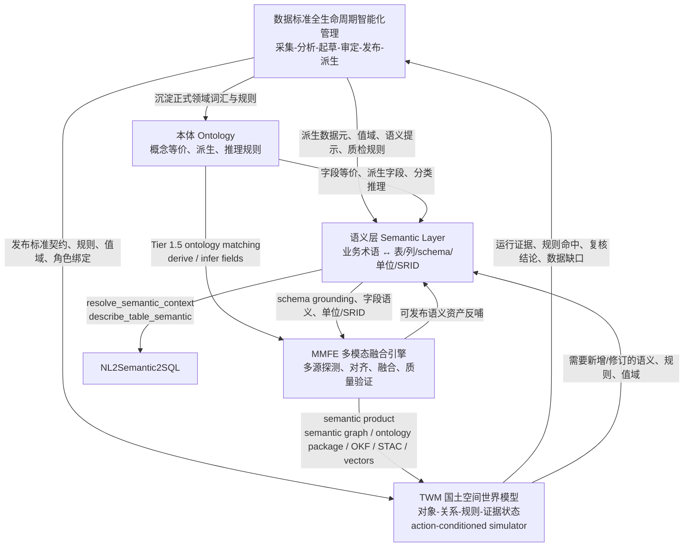
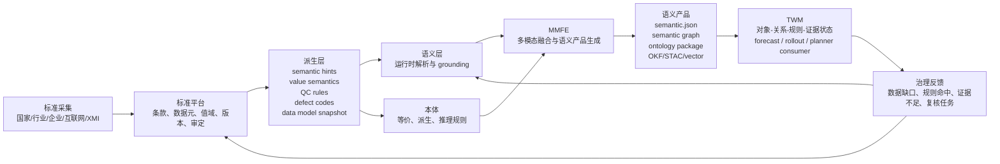

# MMFE、语义层与本体的关系

## 一句话结论

三者不是并列关系，而是分层关系：

```text
本体 Ontology
  ↓ 提供概念、同义、派生、推理规则
语义层 Semantic Layer
  ↓ 把自然语言、业务概念、表/列/schema/空间规则连接起来
MMFE 多模态融合引擎
  ↓ 在实际融合任务中使用这些语义，并产出新的语义产品
```

也可以换一种说法：

- 本体回答“这些概念之间是什么关系”
- 语义层回答“用户说的这个词，在系统里到底指什么数据对象”
- MMFE回答“拿着这些语义规则，怎么把异构地理数据真正融合起来”

## 总览图



上图里，标准平台是更上游的“权威治理源”，TWM 是更下游的“世界状态与推演消费层”；本体、语义层、MMFE 位于二者之间，分别负责规则、映射和数据生产。

---

## 1. 本体是什么

在本项目里，本体主要对应：

- `data_agent/standards/gis_ontology.yaml`
- `data_agent/fusion/ontology.py`

它的职责不是直接给用户答问题，也不是直接执行融合，而是提供一套稳定的领域知识规则，包括：

- 字段等价关系
  - 例如 `area`、`面积`、`mj`、`zmj`、`TBMJ` 属于同一语义组
- 派生规则
  - 例如 `building_height = floors * 3.0`
  - 例如 `population_density = population / area`
- 推理规则
  - 例如满足特定条件时可推断 `building_type`
  - 例如根据 `ndvi`、`slope` 推断植被等级或坡度等级

所以，本体本质上是 **GIS 领域知识的规则底座**。

### 在代码中的体现

`OntologyReasoner` 负责：

- 加载本体 YAML
- 建立等价字段索引
- 在字段匹配时做 ontology match
- 对融合结果做派生字段计算
- 对融合结果做推理字段补全

这说明本体是一个 **被调用的知识引擎**，不是顶层工作流本身。

---

## 2. 语义层是什么

在本项目里，语义层主要对应：

- `data_agent/semantic_layer.py`
- `data_agent/semantic_catalog.yaml`
- `data_agent/toolsets/semantic_layer_tools.py`

它是一个介于用户表达和物理数据 schema 之间的翻译层。

它的职责包括：

- 维护表级/字段级语义元数据
  - display name
  - synonyms
  - description
  - unit
  - geometry type
  - SRID
  - semantic domain
- 支持语义解析
  - `resolve_semantic_context()`
  - `describe_table_semantic()`
  - `browse_hierarchy()`
- 支持将业务概念映射到数据库对象
  - 比如把“面积”映射到 `Shape_Area`、`zmj`、`TBMJ`
  - 把“地类”映射到 `DLBM`、`DLMC`
- 为 NL2Semantic2SQL 提供 grounding
  - 让模型知道该查哪张表、哪个字段、单位怎么算、空间规则怎么用

所以，语义层本质上是 **业务语义到数据资产的中间层**。

### 它和本体的关系

本体关注的是“概念规则”；
语义层关注的是“系统里的语义注册与解析”。

可以理解为：

- 本体更像“知识规则库”
- 语义层更像“运行时语义索引和翻译器”

本体可以被语义层使用，但语义层不等于本体。

---

## 3. MMFE是什么

在本项目里，MMFE 主要对应：

- `data_agent/fusion/`
- `data_agent/fusion_engine.py`
- `data_agent/toolsets/fusion_tools.py`

它是多模态数据智能化语义融合引擎，负责把矢量、栅格、表格、点云、流式等异构数据真正融合起来。

它的主流程包括：

1. 数据探测 profiling
2. 兼容性评估 compatibility assessment
3. 语义字段对齐 semantic alignment
4. 融合执行 execution
5. 质量验证 validation
6. 可解释性、语义产品、发布 sidecar/publish

也就是说，MMFE 是 **执行层和产品化层**。

它不仅做“算”，还做：

- 字段语义对齐
- 冲突消解
- 时序对齐
- 可解释性增强
- 语义产品生成
- 向量发布
- Lakehouse / STAC / OKF / TWM 对接

---

## 4. MMFE 如何使用本体

这部分是三者关系里最关键的一点。

在 `data_agent/fusion/matching.py` 中，字段匹配采用分层策略：

- Tier 1: 精确匹配
- Tier 1.5: 本体推理匹配
- Tier 2: 等价组匹配
- Tier 2.5: LLM / embedding 匹配
- Tier 3: 单位感知匹配
- Tier 4: 模糊匹配

其中 Tier 1.5 明确调用：

- `OntologyReasoner`
- `find_field_matches_by_ontology()`

这说明：

- 本体不是融合引擎外部的理论装饰
- 它已经被插入 MMFE 的字段匹配主链路
- 它提供比“字符串相似”更强的语义匹配能力

此外，在 `data_agent/fusion/semantic_product.py` 中，MMFE 还会在生成 semantic product 时再次调用本体：

- `derive_missing_fields()`
- `apply_inference_rules()`

这意味着本体不仅参与“对齐”，还参与“产物增强”。

换句话说：

**本体对 MMFE 的作用有两层：**

1. 融合前：帮助字段对齐
2. 融合后：帮助生成派生字段和推理字段

---

## 5. MMFE 与语义层的关系

MMFE 和语义层不是谁包含谁，而是协同关系。

### 语义层偏重：

- 数据资产注册
- 业务术语映射
- 查询与 schema grounding
- 面向 NL2SQL / Agent 工具调用

### MMFE偏重：

- 多源数据处理
- 字段/结构对齐
- 融合执行
- 结果质量控制
- 产物发布和下游消费

可以理解为：

- 语义层更偏 **“理解已有数据”**
- MMFE 更偏 **“生产新的语义化数据产品”**

### 连接点

二者在“字段语义”上相连：

- 语义层维护概念、别名、层级、单位、SRID
- MMFE 在融合时需要这些语义来决定哪些字段可对齐、如何解释结果

从系统演进角度看，语义层是 MMFE 的上游语义基础设施之一。

---

## 6. 三者的数据流关系

更完整的数据流可以表示为：

```text
用户问题 / 业务任务
   ↓
语义层
   - 解析业务术语
   - 定位表/字段/空间规则
   - 提供 schema grounding
   ↓
本体
   - 提供字段等价
   - 提供派生规则
   - 提供分类推理
   ↓
MMFE
   - 执行多源字段对齐
   - 执行时空/空间/属性融合
   - 生成 semantic product
   ↓
下游产物
   - .semantic.json
   - semantic graph
   - semantic ontology package
   - pgvector / lancedb
   - STAC / Iceberg
   - OKF bundle
   - TWM state input
```

这里要特别注意：

- 语义层主要把“输入问题”翻译成“数据语义上下文”
- 本体主要把“概念关系”翻译成“可执行规则”
- MMFE主要把“规则 + 数据”翻译成“融合后的语义产品”

---

## 7. 语义产品视角下的三者关系

项目当前已经不只是停留在“融合结果文件”层面，而是在生成 **semantic product**。

相关代码包括：

- `data_agent/fusion/semantic_product.py`
- `data_agent/fusion/semantic_ontology.py`
- `data_agent/fusion/semantic_graph_trace.py`
- `data_agent/fusion/semantic_publisher.py`
- `data_agent/fusion/lakehouse_publisher.py`
- `data_agent/fusion/okf_exporter.py`

这说明 MMFE 的终点不是简单 GeoJSON，而是一个可被 Agent、向量检索、Lakehouse、TWM 消费的语义化产物。

在这个视角下：

- 本体负责提供语义增强规则
- 语义层负责提供概念命名和注册体系
- MMFE负责把它们沉淀为标准化语义产物

因此可以说：

**本体和语义层是语义基础设施，MMFE 是把语义基础设施转化为生产级数据产品的执行器。**

---

## 8. 对 NL2Semantic2SQL 的意义

你的项目里语义层并不只服务 MMFE，它也直接服务 NL2Semantic2SQL。

这条链路主要是：

```text
自然语言问题
  → resolve_semantic_context()
  → describe_table_semantic()
  → schema grounding
  → PostGIS SQL 生成
```

这里面 MMFE不是主执行者，语义层才是核心。

所以需要区分两条主线：

### 主线 A：查询理解线

- 用户自然语言
- 语义层
- NL2Semantic2SQL

### 主线 B：数据生产线

- 多模态原始数据
- 本体 + 语义对齐
- MMFE
- semantic product / TWM / Lakehouse

本体横跨两条线，但更深地嵌入在 MMFE 这条线里。

---

## 9. 最终定位

如果用一句更工程化的话来总结三者关系：

### 本体

是 **概念规则层**。  
负责定义领域内“哪些概念等价、哪些指标可推导、哪些条件可推断”。

### 语义层

是 **语义映射层**。  
负责把业务语言、自然语言和物理数据 schema 接起来。

### MMFE

是 **语义执行层 / 数据生产层**。  
负责在真实的异构地理数据上应用这些语义，生成高质量、可追溯、可发布的融合产物。

---

## 10. 一个简化判断标准

以后你判断一个能力属于哪一层，可以用下面这个标准：

- 如果它在回答“这个词是什么意思、对应哪个字段/表/概念”  
  → 属于语义层

- 如果它在回答“这两个概念是否等价、这个指标能不能推出来、这个对象属于哪类”  
  → 属于本体

- 如果它在回答“如何把这些数据真的融合出来、并形成可下游消费的结果”  
  → 属于 MMFE

---

## 11. 结论

三者关系可以概括为：

```text
本体 = 语义知识规则底座
语义层 = 业务语义到数据对象的翻译层
MMFE = 基于语义执行多模态融合并沉淀语义产品的引擎
```

更完整一点：

```text
本体定义“概念之间的关系”
语义层定义“系统里这些概念映射到什么数据”
MMFE定义“如何用这些概念和映射去生产新数据产品”
```

所以它们的关系不是“功能重复”，而是：

- 本体提供规则
- 语义层组织语义
- MMFE消费语义并产出产品

这也是你的 GIS Data Agent 从“会查数据”走向“会生产语义化空间数据资产”的关键结构。

---

## 12. 与“数据标准全生命周期智能化管理”的关系

数据标准全生命周期智能化管理平台不是语义层、不是本体，也不是 MMFE。它位于更上游，是 **标准资产的权威治理层**。

在项目设计中，它覆盖：

```text
采集 → 分析 → 起草 → 审定 → 发布 → 派生
```

对应代码和设计主要包括：

- `data_agent/standards/`
- `data_agent/standards_platform/`
- `data_agent/standard_registry.py`
- `data_agent/migrations/071_std_documents_and_versions.sql`
- `data_agent/migrations/072_std_clauses_and_elements.sql`
- `data_agent/migrations/073_std_references_and_snapshots.sql`
- `data_agent/migrations/074_std_outbox.sql`
- `data_agent/migrations/078_std_review_tables.sql`
- `data_agent/migrations/079_std_publish_derivation.sql`
- `data_agent/migrations/085_std_data_model_snapshot.sql`

### 它解决什么问题

标准平台解决的是“标准从哪里来、谁审定、何时发布、怎么派生、如何回滚”的问题。

它管理的是：

- 标准文档
- 标准版本
- 条款
- 数据元
- 值域
- 引用证据
- 审定流程
- 发布快照
- 下游派生关系

所以它的关键词不是“匹配”或“融合”，而是：

- 权威源
- 生命周期
- 版本化
- 审定
- 发布
- 派生
- 可回滚

### 它和语义层的关系

语义层负责运行时解析和 grounding，但语义层里的很多内容应该从标准平台派生而来。

典型派生包括：

- `to_semantic_hint`
  - 从标准数据元派生语义提示
- `to_value_semantics`
  - 从标准值域派生字段取值语义
- `to_synonym`
  - 从标准术语和别名派生数据源同义词

因此：

```text
标准平台 = 语义层的权威来源之一
语义层 = 标准派生结果的运行时索引与解析器
```

没有标准平台时，语义层可以靠人工注册和 YAML 运行；有标准平台后，语义层就有了可审定、可追溯、可更新的正式来源。

### 它和本体的关系

本体里的等价组、派生规则、推理规则，短期可以由 `gis_ontology.yaml` 维护；长期看，应逐步从正式标准、术语表、数据元和值域中抽取或校准。

也就是说：

```text
标准平台提供正式术语、数据元、值域、规则来源
本体把其中一部分沉淀为可执行的概念关系和推理规则
```

本体比标准平台更“运行时”和“规则化”；标准平台比本体更“治理化”和“权威化”。

### 它和 MMFE 的关系

MMFE 在融合时需要知道：

- 哪些字段是同一标准数据元
- 哪些值域是合法的
- 哪些字段必须存在
- 哪些字段需要质检
- 哪些融合结果可以被发布为可信数据资产

这些都可以由标准平台提供。

所以：

```text
标准平台定义“合规的数据应是什么样”
MMFE负责把多源数据融合成尽量符合该标准的数据产品
```

MMFE 生成的 semantic product 也可以反过来暴露标准差距：

- 字段缺失
- 值域不一致
- 单位不一致
- 标准角色绑定不完整
- 需要人工复核的字段映射

这些差距可以进入标准平台的审查、修订或派生闭环。

### 它和质检/治理的关系

标准平台还可以派生：

- `to_qc_rule`
- `to_defect_code`
- `to_data_model`

这意味着标准平台不只是语义提示来源，还能下发：

- 数据质量规则
- 缺陷分类法
- 数据模型快照
- DDL / XMI / 数据模型资产

因此它是 GIS Data Agent 从“工具集合”走向“标准驱动数据治理平台”的关键底座。

---

## 13. 与 TWM 的关系

TWM，即 Territory World Model，是更下游的国土空间治理世界模型层。

它不是 MMFE，也不是语义层，而是消费标准、语义、融合产品和证据，构建可推演的国土空间世界状态。

核心定位是：

```text
TWM = 面向国土空间治理的对象-关系-规则-证据世界模型
```

它关注的不是“查哪个字段”或“怎么融合两个图层”，而是：

- 当前国土空间状态是什么
- 对象之间有什么关系
- 哪些规则命中
- 证据是否足够
- 某个行动或情景会导致什么未来状态
- 哪些规划 claim 可以升级，哪些必须 review

### TWM 的输入

TWM 需要以下输入：

- 标准平台发布的角色契约、数据元、值域、规则
- 语义层解析后的数据资产语义
- MMFE 产出的 semantic product
- 多模态证据
  - 矢量
  - 栅格
  - 影像
  - 表格
  - 项目文档
  - 审批记录
  - 执法事件
- 规则评估和人工复核结果

其中 MMFE 产出的内容尤其关键，因为它把多源数据整理成 TWM 可消费的状态输入。

相关代码包括：

- `data_agent/fusion/twm_state_input.py`
- `data_agent/toolsets/territory_world_model_tools.py`
- `data_agent/world_model_v21.py`
- `data_agent/causal_world_model.py`
- `data_agent/migrations/090_twm_core.sql`

### MMFE 与 TWM 的边界

MMFE 做的是数据产品生产：

```text
多源数据 → 对齐 → 融合 → 语义产品
```

TWM 做的是世界状态建模和推演：

```text
语义产品 + 规则 + 证据 → 当前状态 → 未来状态 / 风险 / 效用 / 不确定性
```

所以二者边界很清楚：

- MMFE 负责“把数据做成可用的语义状态材料”
- TWM 负责“基于这些材料进行状态表示、规则推理、行动条件推演和证据门控”

### 标准平台与 TWM 的关系

标准平台给 TWM 提供“合法世界状态”的定义。

例如 TWM 的自然资源“一张图”角色契约包含：

- `parcel_current`
- `pbf`
- `eco_redline`
- `urban_boundary`
- `planning_zone`
- `project`
- `approval`
- `enforcement`
- `metadata_vector`

这些角色的字段、值域、必填项、质量规则，应由标准平台发布和维护。

因此：

```text
标准平台定义 TWM 应该消费什么结构
MMFE 生产符合该结构的语义产品
TWM 使用这些产品构建世界状态并推演
```

项目文档 `2026-06-16-twm-standard-platform-integration-next-step.md` 已经验证了这条线：

- TWM 一张图核心角色契约结构化为 JSON
- 写入标准平台
- 派生 `semantic_hint`
- 派生 `value_semantics`
- 派生 `qc_rule`
- 派生 `defect_code`
- 派生 `data_model_snapshot`

这说明 TWM 的数据基础正在从“测试包约定”升级为“标准平台发布的正式契约”。

### 语义层与 TWM 的关系

语义层为 TWM 提供运行时的字段理解和绑定辅助：

- 这个图层是否可以绑定为 `parcel_current`
- 这个字段是否对应标准数据元
- 这个值域是否符合标准
- 这个表是否具备构建 TWM state 的最低语义条件

TWM 不应该直接猜字段，也不应该绕过语义层去硬编码所有表结构。更稳妥的关系是：

```text
标准平台发布契约
语义层提供运行时解析
MMFE产出语义产品
TWM消费语义产品和契约构建状态
```

### 本体与 TWM 的关系

本体对 TWM 的作用是提供可执行的规则化领域知识。

例如：

- 字段等价有助于 TWM 识别输入是否满足角色字段要求
- 派生规则有助于补齐 `population_density`、`building_height` 等状态特征
- 推理规则有助于生成可进入 state 的分类状态

但需要注意：TWM 的规则系统比本体更大。

本体偏字段和概念规则；TWM 还需要：

- 规划约束
- 审批规则
- 保护红线规则
- 证据门控规则
- 因果校准规则
- claim 升级/降级规则

所以本体是 TWM 的语义知识来源之一，但不是 TWM 的完整规则引擎。

---

## 14. 五者的端到端闭环

把五者放在一起，最合理的系统链路是：



这条闭环可以拆成三段：

### 第一段：标准到语义

```text
标准平台 → 语义层 / 本体 / 质检规则
```

目标是让系统不靠人工经验和临时 prompt，而是由发布标准驱动语义理解、值域检查、质量规则和数据模型。

### 第二段：语义到数据产品

```text
语义层 + 本体 → MMFE → semantic product
```

目标是把异构、多源、多模态数据融合成可追溯、可检索、可审计、可发布的数据产品。

### 第三段：数据产品到世界模型

```text
semantic product + 标准契约 + 规则证据 → TWM
```

目标是把数据产品转为世界模型状态，支持规则推理、风险评估、情景推演、反事实 rollout 和规划方案消费。

### 第四段：世界模型反哺治理

```text
TWM 运行结果 → 标准修订 / 语义补齐 / 质检规则增强
```

TWM 会暴露实际运行中的问题：

- 某些标准角色缺字段
- 某些值域覆盖不足
- 某些规则无法自动判定
- 某些证据不足以升级 claim
- 某些数据源不满足 production gate

这些反馈应进入标准平台和语义层，形成治理闭环。

---

## 15. 更新后的分层定位

加入标准平台和 TWM 后，系统分层可以定义为：

| 层级 | 模块 | 核心问题 | 主要产物 |
|---|---|---|---|
| 标准治理层 | 数据标准全生命周期平台 | 什么是权威标准，如何审定、发布、派生、回滚 | 标准版本、条款、数据元、值域、QC 规则、数据模型快照 |
| 概念规则层 | 本体 | 概念之间如何等价、派生、推理 | 等价组、派生规则、推理规则 |
| 语义映射层 | 语义层 | 用户/业务术语对应哪些数据对象 | semantic context、table/column grounding、单位/SRID/值域提示 |
| 数据生产层 | MMFE | 如何把多源异构数据融合成可信语义产品 | fused GeoJSON、semantic product、semantic graph、OKF/STAC/vector |
| 世界模型层 | TWM | 当前状态是什么，行动会造成什么未来影响，证据是否足够 | state、rule hits、evidence gate、forecast、rollout、review tasks |

---

## 16. 当前工程口径下的严格关系定义

为了避免后续实现中混用概念，这里给出一版更严格的项目口径：

### 16.1 数据标准不是本体

数据标准平台管理的是：

- 标准文档
- 标准版本
- 条款
- 数据元
- 值域
- 审定/发布/派生状态

它回答的是：

**“什么是当前有效的权威标准，以及这个标准如何发布、回滚、派生和追溯。”**

因此数据标准平台是**权威治理源**，不是运行时本体引擎。

### 16.2 本体不是语义层

本体负责把标准中的对象、关系、字段、值域、规则语义化、契约化。

它回答的是：

**“这些概念之间是什么关系，这些字段/值域/关系/规则如何形成机器可消费的统一语义契约。”**

所以本体是**概念规则契约层**。

语义层负责把业务词汇、表、列、单位、SRID、值域提示注册到运行时上下文里。

它回答的是：

**“用户说的这个术语，在当前系统里落到哪张表、哪个字段、什么单位、什么空间对象上。”**

所以语义层是**运行时 grounding 层**。

### 16.3 MMFE 不是本体，也不是 TWM

MMFE 不负责定义权威标准，也不负责定义世界模型动力学。

MMFE 的职责是：

- 消费标准契约、本体规则、语义层提示
- 对齐多模态异构数据
- 生成可追溯的 semantic product / ontology package / state input

它回答的是：

**“如何把这些数据按统一语义加工成可供 TWM 和其他系统消费的语义产品。”**

所以 MMFE 是**语义产品构建层**。

### 16.4 TWM 消费本体，但不等于本体

TWM 需要本体、语义层、MMFE 和标准平台共同提供输入：

- 标准平台给出权威标准版本和派生契约
- 本体给出对象-关系-字段-值域-规则的统一表达
- 语义层给出运行时字段理解与绑定
- MMFE 给出可计算的语义产品和证据包

TWM 在此基础上构建的是：

- 对象-关系-规则-证据状态
- action-conditioned dynamics
- forecast / rollout / evidence gate

它回答的是：

**“当前状态是什么、动作会导致什么未来变化、证据是否足够支持规划结论升级。”**

所以 TWM 是**世界模型消费层**，不是语义定义层。

### 16.5 一句话总括

最简洁但不失真的关系可以固定为：

```text
数据标准平台定义权威版本
本体定义统一语义契约
语义层提供运行时 grounding
MMFE 生成语义产品
TWM 消费语义产品进行状态推演
```

最短总结：

```text
标准平台定义“应该是什么”
本体定义“概念之间怎么算”
语义层定义“数据里它在哪里”
MMFE负责“把数据做出来”
TWM负责“用这些数据推演和审计治理行动”
```

---

## 16. 更新后的判断标准

判断一个能力属于哪一层，可以用下面这个标准：

- 如果它在回答“这个标准条款、数据元、值域、版本是否权威，是否发布，派生到哪里”  
  → 属于数据标准全生命周期平台

- 如果它在回答“这两个概念是否等价、这个指标能不能推出来、这个对象属于哪类”  
  → 属于本体

- 如果它在回答“这个业务词对应哪个表、字段、单位、SRID、值域、schema 上下文”  
  → 属于语义层

- 如果它在回答“如何把这些多源数据对齐、融合、质检，并产出语义化数据产品”  
  → 属于 MMFE

- 如果它在回答“当前国土空间世界状态是什么，某个行动会导致什么风险/收益，证据是否足够升级结论”  
  → 属于 TWM

---

## 17. 最终结论

原来的三者关系可以概括为：

```text
本体提供规则
语义层组织语义
MMFE消费语义并产出产品
```

加入标准平台和 TWM 后，完整关系应升级为：

```text
标准平台提供权威标准和派生源
本体把标准/经验中的概念关系规则化
语义层把标准和本体转成运行时 grounding
MMFE把多源数据转成语义产品
TWM把语义产品转成可推演、可审计的世界状态
```

这五者组成的是一条从 **标准治理 → 语义理解 → 数据生产 → 世界建模 → 治理反馈** 的闭环。

这也是 GIS Data Agent 区别于普通 GIS 工具、普通 NL2SQL 系统或单纯数据融合工具的关键：它不是只让模型“会查、会算”，而是把标准、语义、数据、证据和规划推演放在同一个可追溯的治理链条里。
