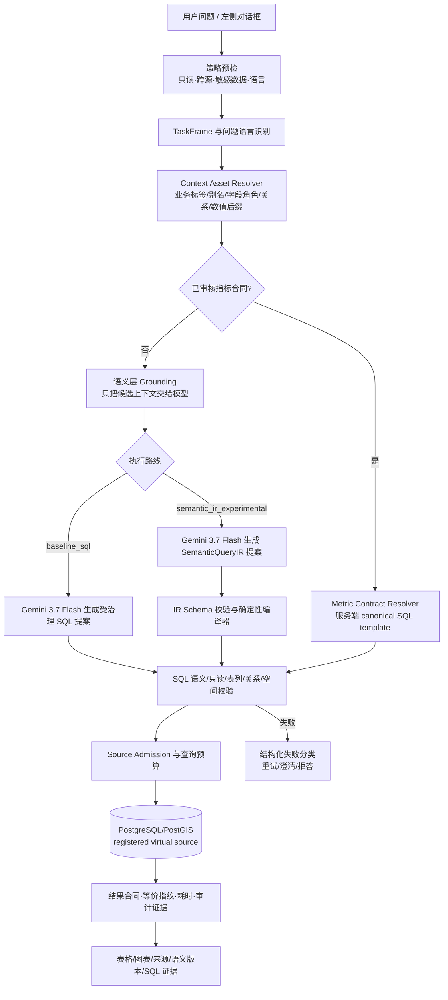

# NL2Semantic2SQL 技术架构文档

> **版本**: v3.3（2026-08-30 实测因果架构刷新版） | **验证状态**: 双路线已并行实现，`baseline_sql` 仍为默认生产路线 | **最后更新**: 2026-08-30

> 本文保留历史 v24.1 的设计与实验记录，但历史的“16/16”仅代表当时的重庆小 benchmark，不能代表当前阿布扎比两库产品能力。当前真实状态、路线边界、反硬编码审计和评测口径以本文第 13 节、`docs/customer/abu_dhabi_liveability_site_validation/abu_dhabi_v4_accuracy_diagnosis_and_optimization.md` 及 `abu_dhabi_nl2sql_integrity_audit_20260830.json` 为准。

## 当前状态快照（2026-08-30）

| 事项 | 当前事实 | 结论边界 |
|---|---|---|
| 默认产品路线 | `baseline_sql`：Gemini 3.7 Flash 生成受治理 SQL，经语义、只读、源准入和运行时 guard | 仍是默认生产入口 |
| 并行路线 | `semantic_ir_experimental`：模型只生成逻辑 IR，服务端校验并编译为参数化 Postgres/PostGIS SQL | 已有可执行受限子集，尚未整体晋级默认 |
| Liveability 语义配置 | 161 张技术表；8 张 `execution_eligible=true`，140 张技术问数可用，13 张明确排除 | 全表配置不等于全表业务语义审核 |
| Makani 语义配置 | 772 张技术表；604 张业务审核资产，764 张技术问数可用，161 张技术元数据/候选资产，7 张明确排除 | 全表配置不等于全表业务语义审核 |
| Gemini 真实测试证据 | Makani 稳定恢复子集 180/180；全部 180 题调用 Gemini，自由问数路线 180/180 结果等价 | 这是冻结 180 题子集证据，不是全库任意问题 100% |
| 当前全量重跑 | Makani `baseline_stable_full_v9` 正在同一冻结输入下运行 | checkpoint 只用于恢复与审计；未完成前不发布进度比例或新的全量准确率 |
| 全量历史测量 | Makani 2328 题批次业务语言 1840/1845（99.729%），但该批次未启用最新 artifact 不可变门禁 | 只能作为历史诊断，不作为当前发布分数 |
| Liveability 当前诊断 | 严格全量报告受 105 个 Gold 过期源结果影响；独立 cohort 分析为 386/387（99.742%），未重新调用模型 | 必须重新冻结输入并完整重跑后才能更新全量分数 |
| 真实源验证 | 依赖局域网和登记虚拟源的实时 discovery/source admission | 离线 artifact 测试不能代替实时数据库查询 |

本快照是工程状态，不是“全库业务语义已完善”或“新路线已胜出”的声明。所有运行时
执行都必须经过 `execution_eligible` 门禁；benchmark Gold、源行数据和问题特例不能进入
运行时 prompt、候选索引或产品缓存。

## 1. 系统概述

NL2Semantic2SQL 是 GIS Data Agent 平台中的自然语言到 SQL 翻译子系统。它将用户的中文自然语言问题转换为可执行的 PostgreSQL/PostGIS 空间查询，核心设计原则是**语义优先、schema 驱动、安全兜底**。

与传统 NL2SQL 方案（直接让 LLM 生成 SQL）不同，本系统在 LLM 介入前先完成一轮完整的语义解析和 schema grounding，将"用户说了什么"翻译成"数据库里有什么能回答这个问题"，再把这份结构化上下文交给 LLM 做最后的 SQL 组装。

**历史核心指标（2026-04 重庆小 benchmark，不代表当前阿布扎比产品）**：
- Benchmark 16 题全量通过（4 Easy + 4 Medium + 4 Hard + 4 Robustness）
- 简单查询端到端延迟 10-20 秒，复杂空间查询 40-70 秒
- 支持 Gemini 和 DeepSeek 双模型，输出质量一致
- 无英文表名输入也能正确匹配数据表

## 2. 整体架构

```
┌─────────────────────────────────────────────────────────────────┐
│                        用户自然语言问题                           │
│              "统计历史文化街区的总数量"                             │
└──────────────────────────┬──────────────────────────────────────┘
                           │
                           ▼
┌──────────────────────────────────────────────────────────────────┐
│                    ① NL2SQL Agent (LlmAgent)                     │
│  model: Gemini 3.7 Flash | tools: prepare + execute              │
│  instruction: 3 步顺序执行 + 安全规则 + 输出规则                   │
└──────────────────────────┬──────────────────────────────────────┘
                           │ 步骤 1: prepare_nl2sql_context()
                           ▼
┌──────────────────────────────────────────────────────────────────┐
│                 ② 语义解析层 (Semantic Layer)                     │
│                                                                  │
│  ┌─────────────┐  ┌──────────────┐  ┌────────────────┐          │
│  │ 表级同义词   │  │ 列级别名反查  │  │ 静态领域目录    │          │
│  │ 匹配        │  │              │  │ (YAML)         │          │
│  └──────┬──────┘  └──────┬───────┘  └───────┬────────┘          │
│         │                │                   │                   │
│         ▼                ▼                   ▼                   │
│  ┌──────────────────────────────────────────────────┐           │
│  │        resolve_semantic_context()                 │           │
│  │  输出: 候选表 + 匹配列 + 空间操作 + 区域过滤       │           │
│  └──────────────────────────┬───────────────────────┘           │
└─────────────────────────────┼───────────────────────────────────┘
                              │
                              ▼
┌──────────────────────────────────────────────────────────────────┐
│                ③ Grounding 引擎 (nl2sql_grounding)               │
│                                                                  │
│  ┌──────────────┐  ┌──────────────┐  ┌────────────────┐         │
│  │ Schema 充实   │  │ Few-shot 检索 │  │ Prompt 格式化  │         │
│  │ (describe_   │  │ (embedding   │  │ (SRID 规则 +   │         │
│  │  table)      │  │  cosine)     │  │  安全约束)     │         │
│  └──────┬───────┘  └──────┬───────┘  └───────┬────────┘         │
│         │                 │                   │                  │
│         ▼                 ▼                   ▼                  │
│  ┌──────────────────────────────────────────────────┐           │
│  │         build_nl2sql_context()                    │           │
│  │  输出: grounding_prompt (结构化 schema 文本块)     │           │
│  └──────────────────────────┬───────────────────────┘           │
└─────────────────────────────┼───────────────────────────────────┘
                              │
                              ▼
┌──────────────────────────────────────────────────────────────────┐
│              ④ LLM SQL 生成 (Gemini / DeepSeek)                  │
│                                                                  │
│  输入: grounding_prompt + 用户问题                                │
│  输出: SELECT ... FROM ... WHERE ... LIMIT 1000;                │
└──────────────────────────┬──────────────────────────────────────┘
                           │ 步骤 3: execute_nl2sql(sql)
                           ▼
┌──────────────────────────────────────────────────────────────────┐
│                  ⑤ 执行与自纠错 (Executor)                        │
│                                                                  │
│  ┌──────────┐  ┌──────────┐  ┌──────────┐  ┌──────────┐        │
│  │ SQL 后处理│→│ 安全执行  │→│ 错误检测  │→│ LLM 修复  │        │
│  │ (LIMIT/  │  │ (参数化  │  │ (最多 2  │  │ (Gemini  │        │
│  │  引号)   │  │  事务)   │  │  次重试) │  │  Flash)  │        │
│  └──────────┘  └──────────┘  └──────────┘  └──────────┘        │
│                                                                  │
│  成功 → auto_curate() 自动入库参考查询                            │
└──────────────────────────┬──────────────────────────────────────┘
                           │
                           ▼
┌──────────────────────────────────────────────────────────────────┐
│               ⑥ 输出清理与交付 (app.py + ChatPanel)              │
│                                                                  │
│  后端: 缓冲 sub_agent 输出 → clean_cot_leakage() 正则清理        │
│  前端: cleanCotLeakage() 显示层兜底 → ReactMarkdown 渲染         │
└──────────────────────────────────────────────────────────────────┘
```

## 3. 各层详细说明

### 3.1 NL2SQL Agent 定义

**文件**: `data_agent/agent.py` (第 883-902 行)

```python
"NL2SQL": lambda: LlmAgent(
    name="MentionNL2SQL",
    instruction="""...""",
    model=get_model_for_tier("standard"),  # provider-selected; current Gemini 3.7 Flash
    output_key="nl2sql_result",
    tools=[NL2SQLEnhancedToolset(), SemanticLayerToolset(),
           DatabaseToolset(tool_filter=["query_database", "describe_table"])],
)
```

**设计决策**：

| 决策点 | 选择 | 原因 |
|--------|------|------|
| Agent 框架 | Google ADK `LlmAgent` | 项目统一框架，支持 tool calling、output_key、plugin 挂载 |
| 模型层级 | standard（当前 Gemini 3.7 Flash） | 由共享模型网关选择；治理和执行合同与模型家族解耦 |
| 工具限制 | 只允许 prepare + execute | 防止 agent 自行调用 describe_table 绕过 grounding |
| 执行模式 | 3 步顺序 | 强制 grounding → 生成 → 执行的流程，避免跳步 |

**Instruction 中的关键规则**：

1. **LIMIT 硬规则**：所有 SELECT 必须包含 LIMIT，即使用户要求全部数据
2. **写操作拒绝**：DELETE/UPDATE/DROP 直接拒绝，不解释规则原文
3. **输出格式**：只输出最终结论，禁止输出推理过程
4. **拒绝格式**：标准化一句话拒绝，不追问用户

### 3.2 语义解析层 (Semantic Layer)

**文件**: `data_agent/semantic_layer.py`

这是整个系统的核心匹配引擎，负责把用户的自然语言映射到数据库中的具体表和列。

#### 3.2.1 数据模型

系统依赖两张元数据表：

**表 `agent_semantic_sources`** — 表级语义注册

```sql
CREATE TABLE agent_semantic_sources (
    id SERIAL PRIMARY KEY,
    table_name VARCHAR(255) UNIQUE NOT NULL,
    display_name VARCHAR(255),          -- 中文显示名，如"重庆历史文化街区"
    description TEXT,                    -- 表的业务描述
    geometry_type VARCHAR(50),           -- Polygon / Point / LineString
    srid INTEGER,                        -- 空间参考 ID，如 4326 / 4490 / 4523
    synonyms JSONB,                      -- 中文短别名数组，如 ["历史文化街区", "历史街区", "老街区"]
    suggested_analyses JSONB,            -- 推荐分析类型
    owner_username VARCHAR(100),
    is_shared BOOLEAN DEFAULT true
);
```

**表 `agent_semantic_registry`** — 列级语义注册

```sql
CREATE TABLE agent_semantic_registry (
    id SERIAL PRIMARY KEY,
    table_name VARCHAR(255) NOT NULL,
    column_name VARCHAR(255) NOT NULL,
    semantic_domain VARCHAR(100),        -- 语义域，如 NAME / ID / AREA / CATEGORY
    aliases JSONB,                       -- 列别名数组，如 ["楼层数", "层数", "层高"]
    unit VARCHAR(50),                    -- 单位，如 "万人" / "%" / "米"
    description TEXT,                    -- 列的业务描述
    is_geometry BOOLEAN DEFAULT false,
    owner_username VARCHAR(100),
    UNIQUE(table_name, column_name)
);
```

**技术选型说明**：

- **JSONB 存储同义词/别名**：PostgreSQL 原生 JSONB 支持 GIN 索引和 `@>` 操作符，比关系表更灵活
- **owner_username 多租户**：每个用户可以有自己的语义注册，`is_shared` 控制可见性
- **unit 字段**：直接嵌入 grounding prompt，让 LLM 知道"100 万 = 100（万人）"

#### 3.2.2 核心函数：resolve_semantic_context()

**文件**: `data_agent/semantic_layer.py` (第 374-595 行)

这个函数是语义解析的入口，执行 4 层渐进式匹配：

```
用户问题: "统计历史文化街区的总数量"
         │
         ▼
Layer 1: 表级同义词匹配
         synonyms 包含 "历史文化街区" → cq_historic_districts (conf=0.70)
         │
         ▼
Layer 2: 列级别名反查
         如果 Layer 1 未命中，扫描所有列的 aliases
         找到包含用户关键词的列 → 反推所属表
         置信度打 0.8 折扣
         │
         ▼
Layer 3: 静态领域目录匹配
         semantic_catalog.yaml 中的领域层次（LAND_USE / BUILDING / TRANSPORT）
         匹配 "林地" → LAND_USE.Forest → 生成 SQL 过滤条件
         │
         ▼
Layer 4: 用户自定义领域匹配
         agent_semantic_domains 表中的自定义层次
         支持 parent → child → sub_child 三级匹配
```

**输出结构**：

```python
{
    "sources": [                          # 匹配到的候选表
        {"table_name": "cq_historic_districts", "confidence": 0.70, ...}
    ],
    "matched_columns": {                  # 每张表匹配到的列
        "cq_historic_districts": [
            {"column_name": "jqmc", "aliases": ["街区名称"], "unit": "", ...}
        ]
    },
    "spatial_ops": [{"operation": "buffer"}],  # 检测到的空间操作
    "region_filter": None,                     # 区域过滤
    "metric_hints": [],                        # 指标提示
    "sql_filters": [],                         # 推荐 SQL WHERE 条件
}
```

#### 3.2.3 双向子串匹配算法

**文件**: `data_agent/semantic_layer.py` (第 247-280 行)

这是让"无英文表名查询"成为可能的关键算法。

```python
def _match_aliases(user_text: str, aliases: list, fuzzy: bool = True) -> float:
```

**匹配策略（按优先级）**：

| 策略 | 条件 | 置信度 | 示例 |
|------|------|--------|------|
| 精确匹配 | `alias == user_text` | 1.0 | "历史文化街区" == "历史文化街区" |
| 正向子串 | `alias in user_text` | 0.70 | "历史文化街区" in "统计历史文化街区的总数量" |
| 反向子串 | user_text 的子段出现在 alias 中，覆盖率 ≥50% | 0.50-0.65 | "搜索指数" 在 "2023年百度搜索指数" 中 |
| 模糊匹配 | SequenceMatcher ratio ≥ 0.75 | ratio×0.6 | 处理拼写变体 |

**反向子串的实现细节**：

```python
# 从用户文本中提取所有长度 ≥3 的子段
# 检查每个子段是否出现在 alias 中
# 计算覆盖率 = len(子段) / len(alias)
# 覆盖率 ≥ 50% 才算命中
for seg_len in range(min(len(user_lower), len(alias_lower)), 2, -1):
    for start in range(len(user_lower) - seg_len + 1):
        seg = user_lower[start:start + seg_len]
        if len(seg) >= 3 and seg in alias_lower:
            coverage = len(seg) / max(len(alias_lower), 1)
            if coverage >= 0.5:
                best_score = max(best_score, min(0.65, coverage))
```

**技术选型说明**：

- **为什么不用 embedding 做表匹配**：表名匹配是高频操作（每次查询都要跑），embedding API 调用 ~2 秒，而字符串匹配 <1ms。embedding 只用在 few-shot 检索（低频、高价值）
- **为什么 50% 覆盖率阈值**：低于 50% 会产生大量误匹配（如"数据"匹配到"AOI数据"），高于 70% 又会漏掉合理的短别名

#### 3.2.4 缓存策略

```
查询路径: 内存缓存 (dict, 5min TTL) → Redis 缓存 (5min TTL) → PostgreSQL
写入路径: PostgreSQL → 同时失效 Redis + 内存缓存
```

**技术选型说明**：

- **三级缓存**：内存最快（<1ms），Redis 跨进程共享（~5ms），DB 持久化
- **5 分钟 TTL**：平衡实时性和性能；元数据变更不频繁，5 分钟延迟可接受
- **失效函数**：`invalidate_semantic_cache(table_name=None)` 支持全量或单表失效

### 3.3 Grounding 引擎

**文件**: `data_agent/nl2sql_grounding.py`

Grounding 引擎的职责是把语义解析的结果组装成 LLM 能理解的结构化 prompt。

#### 3.3.1 核心函数：build_nl2sql_context()

```python
def build_nl2sql_context(user_text: str) -> dict:
```

**执行流程**：

```
1. resolve_semantic_context(user_text)     # ~2s
   → 得到候选表 + 语义提示
   
2. 模糊补充 (fuzzy supplement)             # <10ms
   → 对未命中的表做 _score_source() 评分
   → 取 top-2 低置信度补充表
   
3. Schema 充实                             # ~1s (每表 ~0.4s)
   → 对每张候选表调用 describe_table_semantic()
   → 合并语义注解 + 原始 schema
   → 构建 _build_candidate_table() 对象
   
4. Few-shot 检索（条件触发）               # 0s 或 ~18s
   → _should_fetch_few_shots() 判断是否需要
   → 如需要，调用 fetch_nl2sql_few_shots()
   
5. Prompt 格式化                           # <10ms
   → _format_grounding_prompt() 生成文本块
```

#### 3.3.2 智能 Few-shot 跳过

**文件**: `data_agent/nl2sql_grounding.py` (第 13-23 行)

Few-shot 检索是整个流程中最昂贵的操作（~18 秒，因为要调用 embedding API）。系统通过启发式规则决定是否跳过：

```python
def _should_fetch_few_shots(user_text, candidate_tables, semantic):
    # 多个高置信度表 → 复杂查询，需要 few-shot
    high_conf = [t for t in candidate_tables if t.get("confidence", 0) >= 0.6]
    if len(high_conf) > 1:
        return True
    # 用户问题包含复杂空间关键词
    if any(h in user_text for h in ("面积", "距离", "交集", "占比", ...)):
        return True
    # 空间操作 + 指标提示同时存在
    if semantic.get("spatial_ops") and (semantic.get("metric_hints") or semantic.get("sql_filters")):
        return True
    return False
```

**效果**：

| 查询类型 | 是否触发 few-shot | grounding 耗时 |
|----------|------------------|---------------|
| "统计历史文化街区的总数量" | 否 | ~4s |
| "找出常住人口超过100万的区县" | 否 | ~3s |
| "计算两个规划区的交集面积" | 是（多表 + "面积"） | ~21s |
| "解放碑周边1000米内的建筑物" | 是（多表） | ~21s |
| "查地下矿产资源" | 否（单表 + 无指标） | ~4s |

**技术选型说明**：

- **为什么不全部跳过 few-shot**：复杂空间查询（ST_DWithin + geography、ST_Intersection + SUM）如果没有 few-shot 示例，LLM 生成的 SQL 正确率显著下降
- **为什么阈值是 0.6**：低于 0.6 的表通常是 fuzzy fallback 补充的，不代表真正的多表查询意图

#### 3.3.3 Grounding Prompt 格式

`_format_grounding_prompt()` 生成的文本块包含以下段落：

```
[NL2SQL 上下文 — 必须严格遵循以下 schema]

## 候选数据源
### cq_historic_districts (重庆历史文化街区)
置信度: 0.70; 估计行数: 20
- jqmc :: character varying [单位: ] | 别名: 街区名称
- shape :: geometry(GEOMETRY,4490) | 别名: 几何
⚠ PostgreSQL 规则: 大小写混合列名必须使用双引号

## ⚠ SRID 不一致警告
- cq_historic_districts.shape: SRID=4490
- cq_osm_roads.shape: SRID=4326
- 建议: 将其他列 ST_Transform 到 SRID=4490 后再做空间运算

## 空间几何字段规则 (地理坐标)
- 适用于: cq_historic_districts.shape
- 面积: ST_Area(geom::geography) → 平方米
- 距离: ST_Distance(a::geography, b::geography) → 米

## 空间几何字段规则 (投影坐标)
- 适用于: cq_ghfw.shape
- ST_Area(geom) 直接返回平方米
- 禁止对这些列使用 ::geography

## 参考 SQL
- 问: 查找某个AOI区域周边指定距离范围内的建筑物
  SQL: SELECT b."Id", b."Floor" FROM ...

## 安全规则
- 只允许 SELECT 查询
- 大表全表扫描必须有 LIMIT
- 不允许 DELETE / UPDATE / INSERT / DROP / ALTER
```

**关键设计点**：

1. **SRID 规则分离**：地理坐标（4326/4490/4610）和投影坐标（4523 等）的面积/距离计算方式完全不同，必须在 prompt 中明确区分
2. **单位标注**：`[单位: 万人]` 直接嵌入列描述，让 LLM 知道"100 万 = WHERE 常住人口 > 100"
3. **Transform 建议**：当检测到多 SRID 时，明确建议目标 SRID，避免 LLM 猜测

### 3.4 执行与自纠错

**文件**: `data_agent/nl2sql_executor.py`

#### 3.4.1 两阶段工具设计

NL2SQL 暴露给 Agent 的只有两个工具：

**工具 1: `prepare_nl2sql_context(user_question: str) → str`**

- 调用 `build_nl2sql_context()` 获取完整 grounding
- 将候选表 schema 缓存到 `ContextVar`（供重试时使用）
- 返回格式化的 grounding prompt 文本

**工具 2: `execute_nl2sql(sql: str) → str`**

- SQL 后处理（LIMIT 注入、引号校验）
- 安全执行（参数化事务、超时保护）
- 最多 2 次 LLM 自纠错重试
- 成功后自动入库参考查询

#### 3.4.2 自纠错重试机制

```
attempt 0: 执行原始 SQL
  → 成功 → auto_curate() → 返回结果
  → 失败 → _retry_with_llm(question, failed_sql, error, schemas)
  
attempt 1: 执行 LLM 修复后的 SQL
  → 成功 → auto_curate() → 返回结果
  → 失败 → _retry_with_llm(...)
  
attempt 2: 最后一次尝试
  → 成功 → 返回结果
  → 失败 → 返回错误信息
```

**LLM 修复 prompt**：

```
你是 SQL 修复专家。以下 SQL 执行失败，请修复。
原始问题: {question}
失败 SQL: {failed_sql}
错误信息: {error}
可用 Schema: {schemas}
只返回修复后的 SQL，不要解释。
```

**技术选型说明**：

- **修复模型用 fast tier (gemini-2.0-flash)**：修复是机械性任务，不需要强推理，fast 模型更快更便宜
- **最多 2 次重试**：经验表明，如果 2 次修复都失败，问题通常不在 SQL 语法而在语义理解，继续重试无意义
- **ContextVar 缓存 schema**：重试时不需要重新调用 grounding，直接复用上一轮的 schema

#### 3.4.3 自动策展 (Auto-Curate)

每次成功执行后，系统自动将 (question, SQL) 对入库到 `agent_reference_queries`：

```python
def _auto_curate(question: str, sql: str) -> None:
    store = ReferenceQueryStore()
    domain_id = _extract_domain(sql)  # 从 SQL 中提取表名作为 domain
    store.add(
        query_text=question,
        response_summary=sql,
        task_type="nl2sql",
        source="auto_curate",
        domain_id=domain_id,
    )
```

**去重机制**：`ReferenceQueryStore.add()` 内置 cosine > 0.92 去重，相似问题不会重复入库。

### 3.5 参考查询库 (Reference Query Store)

**文件**: `data_agent/reference_queries.py`

#### 3.5.1 数据模型

```sql
CREATE TABLE agent_reference_queries (
    id BIGSERIAL PRIMARY KEY,
    query_text TEXT NOT NULL,            -- 自然语言问题
    description TEXT,                     -- 描述
    response_summary TEXT,                -- 对应的 SQL
    tags JSONB,                           -- 标签，如 ["spatial", "distance"]
    pipeline_type VARCHAR(50),
    task_type VARCHAR(50),                -- "nl2sql"
    source VARCHAR(30),                   -- "auto_curate" / "benchmark_pattern" / "manual"
    feedback_id BIGINT,
    embedding REAL[],                     -- 768 维向量
    domain_id VARCHAR(255),               -- 关联的表名
    use_count INTEGER DEFAULT 0,
    success_count INTEGER DEFAULT 0,
    created_by VARCHAR(100),
    created_at TIMESTAMP DEFAULT NOW()
);
```

#### 3.5.2 Embedding 检索

```python
def search(self, query: str, top_k: int = 5, task_type: str = None) -> list[dict]:
    query_emb = self._embed(query)  # Gemini text-embedding-004, 768 维
    # 从 DB 加载所有有 embedding 的记录
    rows = conn.execute("SELECT ... FROM agent_reference_queries WHERE embedding IS NOT NULL")
    # 计算 cosine similarity
    for row in rows:
        sim = dot(query_vec, emb_vec) / (norm(query_vec) * norm(emb_vec))
        scored.append((sim, row))
    # 按相似度降序排列，返回 top-k
    return sorted(scored, reverse=True)[:top_k]
```

**技术选型说明**：

| 决策点 | 选择 | 备选方案 | 选择原因 |
|--------|------|----------|----------|
| Embedding 模型 | Gemini text-embedding-004 | OpenAI ada-002, BGE-M3 | 项目已用 Gemini，无需额外 API key；768 维平衡精度和存储 |
| 向量存储 | PostgreSQL REAL[] | pgvector, Pinecone, Qdrant | 数据量小（<1000 条），不需要专用向量数据库；REAL[] 足够 |
| 相似度计算 | numpy cosine | pgvector <=> 操作符 | 全量加载到内存计算，避免 pgvector 扩展依赖 |
| 去重阈值 | cosine > 0.92 | 0.85, 0.95 | 0.92 在实测中平衡了去重效果和语义变体保留 |

#### 3.5.3 可复用空间 Few-shot 模式

**文件**: `data_agent/seed_nl2sql_patterns.py`

系统预置了两条 canonical 空间查询模式：

**模式 A: AOI 距离 + 建筑物属性过滤**

```
问: 查找某个AOI区域（如景点、商圈）周边指定距离范围内，
    满足楼层数或层高条件的建筑物，返回建筑物ID和楼层数

SQL: SELECT b."Id", b."Floor"
     FROM cq_buildings_2021 b
     JOIN cq_baidu_aoi_2024 a
       ON ST_DWithin(b.geometry::geography,
                     ST_Transform(a.shape, 4326)::geography, 1000)
     WHERE a."名称" LIKE '%解放碑%' AND b."Floor" > 30;
```

**教会 LLM 的关键点**：
- AOI polygon 需要先 `ST_Transform` 到 4326 再 `::geography`
- 距离查询用 `ST_DWithin(...::geography, ...::geography, 米)`
- 属性过滤是普通 WHERE 条件

**模式 B: 面面相交 + 总面积聚合**

```
问: 计算两个面图层（如规划区、管制区）的空间交集总面积，
    以公顷或平方米为单位返回单个汇总结果

SQL: SELECT SUM(ST_Area(ST_Intersection(j.shape, g.shape))) / 10000.0
       AS intersect_area_ha
     FROM cq_jsydgzq j
     JOIN cq_ghfw g ON ST_Intersects(j.shape, g.shape);
```

**教会 LLM 的关键点**：
- `ST_Intersects` 是 JOIN 条件
- `ST_Intersection` 计算交集几何
- **必须** 用 `SUM(...)` 聚合成单个总面积
- 投影坐标下 `ST_Area()` 直接返回平方米

### 3.6 输出清理

#### 3.6.1 后端缓冲 (app.py)

对 `sub_agent_direct` 类型的 pipeline，文本不再实时 streaming，而是先缓冲：

```python
if part.text:
    if pipeline_type != "sub_agent_direct":
        await final_msg.stream_token(part.text)  # 其他管道正常 streaming
    full_response_text += part.text               # sub_agent 只缓冲
```

Pipeline 结束后，先清理再发送：

```python
if full_response_text and pipeline_type in ("sub_agent_direct", "general"):
    cleaned = clean_cot_leakage(full_response_text)
    if cleaned != full_response_text:
        full_response_text = cleaned

if pipeline_type == "sub_agent_direct" and full_response_text:
    final_msg.content = full_response_text
    await final_msg.send()
```

#### 3.6.2 CoT 清理正则 (pipeline_helpers.py)

```python
_COT_PATTERNS = re.compile(
    r"(?:^|\n)"
    r"(?:让我|我来|我需要|我应该|根据规则|根据返回|不过根据|"
    r"所以我|实际上|用户想要|用户要求|不过，安全|现在我来|这涉及到)"
    r"[^\n]{0,200}\n?"
    r")+",
    re.MULTILINE,
)
```

#### 3.6.3 前端显示层兜底 (ChatPanel.tsx)

```typescript
function cleanCotLeakage(text: string): string {
    // 短拒绝归一化
    if (text.length < 120 && text.includes('DELETE/UPDATE/DROP')) {
        return '我不能执行修改、删除或新增数据的操作。我只能帮助查询。';
    }
    // 从最终答案标记开始截断
    const finalMarkers = ['已成功', '查询成功', '以下是结果', '数据来源表'];
    for (const marker of finalMarkers) {
        const idx = text.indexOf(marker);
        if (idx > 0) { text = text.slice(idx); break; }
    }
    // 正则清理推理痕迹
    // ...
}
```

**为什么需要前后端双层清理**：

- **后端清理**：处理缓冲后的完整文本，效果最好
- **前端清理**：兜底处理 Chainlit `msg.output` 和 `msg.content` 不同步的情况（前端渲染的是 `output`，后端 `update()` 改的是 `content`）

## 4. 安全机制

### 4.1 SQL 注入防护

- `execute_safe_sql()` 使用参数化查询
- `postprocess_sql()` 拒绝 DDL/DML 关键词
- Agent instruction 明确禁止写操作

### 4.2 资源保护

- 所有 SELECT 强制 LIMIT（默认 1000）
- CostGuard 插件监控 token 消耗（可配置阈值）
- 大表（>1M 行）在 grounding 中标记警告

### 4.3 幻觉防护

- 当 schema 中不存在用户请求的字段时，agent 直接拒绝
- 不会编造不存在的表名或列名
- Benchmark ROBUSTNESS_03 专门验证此能力

## 5. 复现指南

### 5.1 环境准备

```bash
# PostgreSQL 16 + PostGIS 3.4
# Python 3.13+
# Node.js 20+

pip install -r requirements.txt
cd frontend && npm install && npm run build
```

### 5.2 数据库初始化

```sql
-- 1. 创建语义源表
CREATE TABLE agent_semantic_sources (...);  -- 见 migration 009

-- 2. 创建语义注册表
CREATE TABLE agent_semantic_registry (...);  -- 见 migration 009

-- 3. 创建参考查询表
CREATE TABLE agent_reference_queries (...);  -- 见 migration 054

-- 4. 注册数据表的语义元数据
INSERT INTO agent_semantic_sources (table_name, display_name, synonyms)
VALUES ('cq_historic_districts', '重庆历史文化街区',
        '["历史文化街区", "历史街区", "文化街区"]');

-- 5. 注册列的语义元数据
INSERT INTO agent_semantic_registry (table_name, column_name, aliases, unit)
VALUES ('cq_district_population', '常住人口', '["常住人口"]', '万人');
```

### 5.3 种子 Few-shot

```python
from data_agent.seed_nl2sql_patterns import seed_nl2sql_patterns
seed_nl2sql_patterns(created_by="admin")
```

### 5.4 启动应用

```bash
PYTHONPATH="D:\adk" chainlit run data_agent/app.py -w
# 访问 http://localhost:8000
# 在聊天框输入: @NL2SQL 统计历史文化街区的总数量
```

### 5.5 验证 Benchmark

逐题测试 `benchmarks/chongqing_geo_nl2sql_full_benchmark_v2.json` 中的 16 道题，对比 golden SQL 结果。

## 6. 性能优化记录

| 优化项 | 优化前 | 优化后 | 方法 |
|--------|--------|--------|------|
| 简单查询 grounding | 22s | 4s | 智能跳过 few-shot embedding 检索 |
| MEDIUM_02 空间 join | 219s | 0.5s | 转换小表 polygon 而非大表 point，触发 GiST 索引 |
| DeepSeek CoT 泄露 | 整屏推理 | 干净结果 | 后端缓冲 + 正则清理 + 前端兜底 |
| 无表名查询匹配 | 0% | 100% | 双向子串匹配 + 中文同义词补齐 |
| 单位换算错误 | 100万→1000000 | 100万→100 | 列 unit 字段嵌入 grounding prompt |

## 7. Benchmark Strategy — 双轨评估

系统采用双轨评估体系，分别验证通用数据仓库 NL2SQL 能力和 GIS 空间 NL2SQL 能力：

### 7.1 BIRD mini_dev Track（通用仓库）

- **目标**：验证常规企业/数据仓库 NL2SQL 能力，对标业界 SOTA
- **数据集**：[BIRD mini_dev V2](https://github.com/bird-bench/mini_dev)（780 题，11+ 数据库，3 难度级别）
- **SQL 方言**：SQLite baseline + PostgreSQL A/B
- **评估重点**：joins, aggregation, nested query, warehouse-style schema grounding
- **脚本目录**：`scripts/nl2sql_bench_bird/`
- **指标**：Execution Accuracy (EX), Valid Rate, by-difficulty breakdown

### 7.2 FloodSQL / GIS Track（空间查询）

- **目标**：验证 PostGIS 空间 NL2SQL 差异化能力
- **数据集**：FloodSQL-Bench（443 题，10 PostGIS 表，L0-L5 难度）+ 重庆 GIS 自建 Benchmark（16 题）
- **SQL 方言**：PostgreSQL/PostGIS
- **评估重点**：ST_Intersects, ST_Buffer, ST_Area, SRID 推断, geometry reasoning
- **脚本目录**：`scripts/nl2sql_bench/`（FloodSQL）、`scripts/nl2sql_bench_cq/`（重庆 GIS）
- **指标**：Execution Accuracy (EX), 空间函数覆盖率

### 7.3 A/B 消融实验设计

两个 Track 均支持 baseline vs full pipeline 对比：

| 模式 | 描述 | 目的 |
|------|------|------|
| baseline | 裸 LLM + schema dump | 测 LLM 原始 SQL 生成能力 |
| full | semantic layer + grounding + few-shot + ContextEngine | 测完整 NL2Semantic2SQL 链路增益 |

通过 `delta = full_EX - baseline_EX` 量化 semantic layer 各组件的贡献。

---

## 13. 2026-08 当前生产架构（阿布扎比两库）

本节是当前实现的权威架构说明，覆盖 `liveability_data_20260730/public` 和
`makani_sync_full/public`。两库都通过同一个受治理虚拟数据源接口接入；源库只读，
业务行不写入 GIS Data Agent 控制库。元数据发现快照、字典对齐、本体、语义层、候选
目录、关系目录和 benchmark Gold 是不同信任级别的 artifact，不能互相越权。

### 13.1 端到端架构图



### 13.2 两条路线的真实边界

| 项目 | baseline_sql（当前默认生产路线） | semantic_ir_experimental（并行实验路线） |
|---|---|---|
| 模型输出 | `GovernedVirtualSQLProposal`：只允许受治理 SELECT | `GovernedSemanticIRProposal`：只允许逻辑实体、字段、关系和操作 |
| 物理表来源 | 模型可提出候选物理表，但必须经过 binding、SQL AST、语义表列和 runtime guard | 模型不得提交物理表；`semantic_query_ir.py` 编译器从 active binding 解析物理表 |
| 本体/语义作用 | 业务资产召回、prompt grounding、合同匹配、空间关系和字段白名单 | 业务资产召回、逻辑实体/字段授权、关系校验、空间意图校验、确定性 SQL 编译 |
| SQL 产生者 | Gemini 3.7 Flash + postprocessor/validator | SemanticQueryIR compiler；模型只产 IR，不产 SQL |
| 失败形态 | 表/列幻觉、聚合和空间语义错、SQL 修复失败 | IR schema 错、实体/字段未激活、关系不完整、编译器能力不足 |
| 当前地位 | 默认入口；仍需通过新 v4 语义层的 execution gate | 可执行受限 canary/paired 实验，不得据此宣布替代 baseline |

两条路线共享策略预检、候选召回、源准入、结果合同、审计和 benchmark comparator。这样
对比的是“SQL 提案”和“逻辑 IR 提案”的生成/编译差异，而不是两套数据源或两套 Gold。

### 13.3 元数据、本体、语义层和 SQL 的关系

```text
真实 PG/PostGIS 源
  └─ discovery snapshot（表/列/类型/SRID/约束/索引，不含源行）
       └─ technical semantic catalog（全表技术目录）
            ├─ dictionary alignment（数据字典证据）
            ├─ ontology（业务概念、粒度、关系、空间角色）
            └─ semantic layer（运行时 binding、字段角色、别名、合同、策略）
                 ├─ candidate catalog：可召回，不授权执行
                 ├─ reviewed asset：可召回；只有 execution_eligible=true 才可执行
                 └─ metric contract：审核运行模板，可直接执行或作为校验口径
```

- **元数据**回答“有什么”：物理对象、字段、类型、空间参考、版本和来源指纹。
- **本体**回答“它是什么以及如何关联”：业务概念、粒度、实体角色、同义关系、
  `contains/within/intersects/dwithin` 的方向与约束。
- **语义层**回答“本次查询能否用”：把本体和元数据投影成版本化运行配置，明确
  `retrieval_eligible`、`execution_eligible`、字段业务角色、值域语义和合同。
- **SemanticQueryIR**回答“用户要计算什么”：逻辑实体、字段、聚合、过滤、分组、
  排序和空间意图。编译器再把逻辑引用绑定到物理表列。
- **SQL**只是执行器方言产物，不能反向成为本体或语义真值。

### 13.4 关键实现模块

| 层 | 当前实现 | 主要职责 |
|---|---|---|
| 产品入口 | `data_agent/liveability_nl2sql.py`、`data_agent/makani_nl2sql.py` | 解析 `@Liveability`/`@Makani`，通过 current artifact registry 加载已发布语义层，调用统一 runner |
| 统一运行器 | `data_agent/governed_virtual_nl2sql.py` | 策略预检、合同路由、grounding、模型提案、校验、执行、证据 |
| 候选召回 | `data_agent/abu_dhabi_semantic_candidates.py` + runner 的 asset scoring | 多语言业务标签/别名、字段证据、数字后缀、关系邻居、歧义控制 |
| IR 模型/编译器 | `data_agent/semantic_query_ir.py` | Pydantic IR、逻辑实体绑定、字段/关系/空间校验、PostGIS SQL 编译 |
| SQL 保护 | `runtime_guards.py`、`sql_postprocessor.py`、`validate_semantic_sql()` | 只读、schema、表列、关系、geometry 投影和查询预算 |
| 控制面 API | `data_agent/api/abu_dhabi_nl2sql_product_routes.py` | 数据源、语义配置、ontology、benchmark 摘要和审计信息的只读展示 |
| 评测 | `benchmarks/abu_dhabi_nl2sql_product_v1/`、v4 scenario benchmark | Gold 隔离、分桶、双路线 paired comparison、失败分类和稳定性 |

### 13.5 v4 全表语义层与执行门禁

当前产品入口通过 current artifact registry 解析已发布语义资产，而不是在入口中固定一份
历史文件名：

- Liveability 当前解析到 `liveability_data_20260730_semantic_layer_current_20260826.json`：
  161 张技术表、161 张字段完整 binding、8 张业务审核资产、140 张技术问数可用表、
  13 张明确排除；另有 165 个 metric contract/pattern、5 条已发布关系和 4 条 caveat。
- Makani 当前解析到 `makani_sync_full_semantic_layer_v4_full_coverage.json`：772 张技术表、
  772 张字段完整 binding、604 张业务审核资产、764 张技术问数可用表、161 张技术元数据/
  候选资产、7 张明确排除；另有 775 个 metric contract/pattern、14 条已发布关系和 4 条 caveat。

全表覆盖不等于全表可执行。未完成业务审核的表可以进入技术目录和候选召回，不能进入 SQL/IR 执行授权。新语义层使用显式 `execution_eligible=false`，避免“有字典字段”被误认为“业务口径已审核”。旧 v3 语义层仅作为兼容测试 fixture，不应继续作为生产入口配置。

### 13.6 当前准确率问题的架构归因

当前低准确率不能用一个总分解释，必须分成：

1. **评估口径问题**：Liveability v4 validation/holdout 中有大量技术目录控制题，未审核表被拒绝是预期治理结果；它们不能和业务语言问数混算。
2. **语义覆盖问题**：Liveability 仍有大量表只有技术绑定；Makani 仍有待审核表和同名/后缀资产。缺少业务别名、粒度、值域和关系审核时，模型无法可靠区分。
3. **召回/消歧问题**：`UDM Building`/`UD Building`、`UPC road center`/`UPC road edge`、`aircompressor`/`aircompressor_1` 等需要保留资产族和数字后缀，不能只按词干匹配。
4. **空间任务框架问题**：中文、阿拉伯文“空间范围内按设施类型分组”曾把行政区误当分组维度，合同必须同时匹配对象、空间关系和用户明确的分组维度。
5. **协议问题**：IR 的结构化输出错误、实体未激活和编译器能力缺口会降低实验路线通过率；应按字段路径记录，而不是笼统记为模型失败。
6. **策略误拒问题**：裸“电话”不能直接等同个人敏感数据；公共电话亭/电话线属于业务设施，个人/居民联系方式才进入拒答策略。
7. **共享实体名的字段消歧**：当多个已发布资产共享同一业务名称时，若问题在分组/筛选子句中明确给出某资产独有的已发布字段，解析器可依据字段身份消歧；如果字段证据仍相同或缺失，继续返回澄清而不猜测。该规则只读取当前语义层，不包含 benchmark 或客户表名特例。

诊断依据与可复现样本见：
`docs/customer/abu_dhabi_liveability_site_validation/abu_dhabi_v4_accuracy_diagnosis_and_optimization.md`、
`liveability_v4_failure_taxonomy.json`、`makani_v4_failure_taxonomy.json`。

### 13.7 Benchmark 架构与正确性判定

Benchmark 不是一批“表名改写的问题”，而是产品能力矩阵：

| 维度 | 必须覆盖 |
|---|---|
| 查询形态 | 单表明细、单表总数、分组聚合、平均/总和、排名、过滤、多表等值 join、多表空间 join、混合问数 |
| 语言 | 中文、英文、阿拉伯文；同一逻辑 case 的多语言变体共享 Gold 语义 |
| 资产状态 | reviewed business asset、technical catalog control、unsupported/safety |
| 数据切分 | development、validation、holdout；来源和 Gold 与运行时隔离 |
| 正确性 | 状态合同、Gold result contract、结果等价指纹、表/列/空间关系证据；不能只比 SQL 字符串 |
| 路线对比 | 相同 case IDs、模型、推理强度、并发、语义版本和源库；逐 case paired comparison |

技术目录控制题的失败应计入治理拒绝/覆盖缺口，不应直接宣称“业务问数准确率为 0”。
真实源库不可达时只做离线配置和单元测试，不能生成真实查询结果或伪造 benchmark 通过率。

单次 benchmark 运行还必须满足输入 artifact 不可变约束：启动时从同一次字节读取解析
benchmark 和语义层，同时记录规范化 JSON SHA 与原始文件字节 SHA；实际问数只读取启动时
生成的语义快照。每个 case 发起前重新校验原始 benchmark/语义文件字节 SHA。只要任一文件
在运行中变化，评测器必须取消排队任务、把 checkpoint 标记为 `aborted` 并抛出配置错误，
不能把剩余题填成模型失败，也不能为该批次生成准确率结论。基于新语义重跑历史失败题时，
恢复报告只能声明 selected subset 的修复证据；只有同一稳定快照下完整重跑全部题目，才允许
更新全量准确率。

### 13.8 已发布评测证据（不是最终路线结论）

当前仓库中存在多套用途不同的冻结 benchmark，不能把它们相加后当成一个准确率：

| 资产 | 规模/范围 | 能证明什么 | 不能证明什么 |
|---|---:|---|---|
| `benchmarks/abu_dhabi_nl2semantic2sql_v2/` | 36 cases；Liveability 15、Makani 15、federated 6 | 资产召回/准入和一轮真实源 paired 评测 | 不能证明全库业务语义覆盖 |
| `benchmarks/abu_dhabi_nl2semantic2sql_v3/` | 26 challenge cases；Liveability 10、Makani 12、federated 4 | 挑战场景的候选集/安全门选择质量 | `selection_report` 明确未评 SQL/结果正确性 |
| `benchmarks/abu_dhabi_nl2sql_product_v1/` | 每库 15 cases，另有 federated v4 9 cases | 小范围产品入口、Gold result contract 和 UI 证据链 | 不能外推到数百张表的完整能力 |

已发布的 v2 真实源报告由
`benchmarks/abu_dhabi_nl2semantic2sql_v2/published_report_manifest.json` 固定：

- 单次 v6 paired：baseline 与 IR 均为 36/36 状态通过，21/21 可执行结果等价；真正发生模型路线差异的自由问数配对为 6 cases，结果为 6/6 对 6/6。
- 3-run stability：两条路线各 17/18 route observations 通过，候选没有稳定准确率优势；发布策略仍要求重复稳定性证据。
- 报告不包含 Gold payload 和源行数据，校验时检查报告 checksum；这不是运行时缓存。

因此当前正确表述是：**IR 路线已实现并可独立测量，在当前 Gemini stability scope 上与基线持平；稳定性证据已具备，但尚无完整语义覆盖或优势证据支持替代默认 baseline。**

### 13.9 当前阶段与下一步门槛

截至 2026-08-30，局域网下的 Gemini 双路线小范围稳定性已完成，Makani 180 题稳定恢复
也已完成；后续仍按以下门槛推进更大范围认证：

1. 完成共享候选解析器的唯一性/歧义回归：多语言空间表达、公共电话亭、相似表、数字后缀。
2. 扩充 validation/holdout 的单表、多表等值、多表空间和 mixed case，确保不以 36-case scope 代表全库能力。
3. 对 Makani 2328 题和 Liveability 495 题在同一冻结输入下完成 Gemini baseline/candidate
   的匹配证据；当前已有 Makani 180 题稳定恢复，但不是全量配对。
4. 对 Liveability 未审核绑定和 Makani 相似资产建立逐表审核队列，发布新的语义版本后再重跑评测。
5. 只有在更广语义覆盖、能力集完整性和无关键安全回归均达标后，才讨论默认路线是否调整。

本节描述的是当前可验证的工程状态，不把未来规划、历史 benchmark 或未审核业务语义包装成已完成能力。

### 13.10 基于真实测试的准确率解释与反硬编码证据（2026-08-30）

#### 13.10.1 “接近 100%”成立的准确率口径

这里的“接近 100%”不是指 Gemini 对任意自然语言都能猜中，也不是把结果写在
`case_id -> answer` 字典里。它只在以下条件同时满足时成立：问题属于冻结 benchmark，
Gold result contract 与当前源库快照一致，所涉及的业务资产已经发布，查询通过治理校验，
且结果按允许的等价指纹比较。准确率分母不包含无法回答的业务语义缺口，也不把技术目录
的“能数行”冒充为业务指标语义。

在这个口径下，稳定恢复批次给出了一个很有价值的隔离证据：

| 证据 | 数值 | 解释 |
|---|---:|---|
| Makani 稳定恢复子集 | 180/180 通过 | 中文 55、英文 62、阿拉伯文 63；生成 SQL 有 65 个唯一指纹 |
| 其中业务语言题 | 153/153 | 不是 SQL/表名泄漏题 |
| Gemini 实际调用 | 180/180 | 全部走 `governed_free_form_llm`，不是直接模板路由 |
| 结果等价 | 180/180 | 通过 Gold result contract 的等价指纹 |
| 运行时执行 | 180/180 | 源准入、只读、表列、关系和行数门禁全部通过 |
| 生成模型 | 180 次均为 `gemini-3.7-flash` | 没有混入其他模型或配额失败 |

该报告自身明确记录：`product_evaluation_run_valid=false`、
`product_baseline_claim_valid=false`、`benchmark_accuracy_claim=false`。原因不是运行失败，而是
它只覆盖选定恢复子集，不能被包装成产品发布批次。恢复子集用于证明“已定位失败在新语义和
同一模型下已修复”，全量发布分数必须来自完整冻结批次。

真实测试还允许把总分拆成架构阶段，而不是只看最终的 100%：

| 阶段 | 180 题稳定恢复 | 2328 题历史全量诊断 | 架构含义 |
|---|---:|---:|---|
| 数据源治理 | 180/180 | 2328/2328 | source registration、schema/fingerprint 和只读准入没有丢题 |
| 问题理解 | 180/180 | 2324/2328 | 历史全量的主要失败之一是 4 个非预期拒答 |
| 资产解析 | 180/180 | 2320/2325 | 候选唯一性、字段角色和关系决定是否找到正确资产 |
| 执行结果等价 | 180/180 | 2320/2325 | 历史全量另有 1 个 Gold result mismatch |
| 最终状态 | 180/180 | 2323/2328（99.7852%） | 后者含 3 个预期安全拒答；仅作历史诊断 |

路由分布说明高分不是一条固定模板覆盖全部问题：

| 路由 | 180 题稳定恢复 | 2328 题历史全量诊断 |
|---|---:|---:|
| `governed_free_form_llm` | 180 | 2305 |
| `deterministic_reviewed_metric_contract` | 0 | 16 |
| `deterministic_semantic_binding_gate` | 0 | 4 |
| `deterministic_read_only_request_policy` | 0 | 3 |

模型生成也有明确成本：稳定恢复批次平均生成延迟 8385.945 ms、P95 21543.852 ms；历史
全量批次平均 9949.508 ms、P95 20548.730 ms。高准确率不是“零成本魔法”，而是用版本化
语义资产、较大的 grounding 上下文、确定性校验和真实执行换取正确性。

该批次的可复现身份为：benchmark 原始字节 SHA-256
`251e291f7912e022bf4d2d8578c1bc43e79eb9ca2e07bd681a0ad92c16f35db7`，稳定 Makani 语义层
原始字节 SHA-256 `7a0e813c074d30fb058ef8bd3a6005456fcb81b7820acbc5b792d2756f58e69f`，Gold
source cohort ID `b4e96519f462b2d41b21e338c978eaa4d9c674d6a814de454804a157717253ef`；源库
discovery/profile 指纹分别为 `e2191ec40357df2eff238ea30e18895084a85d0ae52d078ea403b2f899671f4a`
和 `a4d99a4084081224ffcf6a02cda777b2aaf6052521573a7ee68f022d62809253`。这些指纹把结果
绑定到具体输入和源状态，防止用另一份语义或另一批 Gold 冒充本批次结果。

该批次是选定修复子集，不是 2328 题全量分数。Makani 2026-08-29 的历史全量测量为
业务语言 1840/1845（99.729%），但当时尚未启用最新的运行期 artifact 不可变门禁，
因此只能作为回归诊断证据；不能与 180 题恢复结果拼接成新的全量准确率。
Liveability 当前报告受到 105 个过期 Gold 源结果影响，独立 cohort 分析为 386/387
（99.742%），且明确标记“未重新调用模型”；只有在同一冻结输入下完整重跑后，才能发布
新的全量准确率。

#### 13.10.2 为什么冻结范围内可以很高

准确率来自多层约束叠加，而不是模型单点能力。其本质是把“在两个数据库所有对象上直接
猜 SQL”的开放问题，逐层收缩为“在已准入、已发布、与当前问题相关的小候选集上生成一个
可验证计划”的受约束问题：

1. **输入先冻结**：benchmark、语义层、源 discovery/profile 和 Gold source cohort 都有
   规范化指纹与原始字节 SHA；运行中发现文件变化会整批中止。
2. **问题被业务资产 grounding**：本体概念、业务标签、别名、字段角色、粒度、指标和
   已审核关系先把候选范围收窄，模型不需要在数百张物理表中盲猜。
3. **已审核指标走确定性控制**：唯一命中的 reviewed metric contract 可以由服务端 canonical
   模板执行；这属于版本化语义配置，不是按问题或 case ID 写答案。
4. **普通问题才调用 Gemini**：Gemini 负责在受限上下文中理解操作、字段和过滤条件；SQL
   提案仍必须通过 AST、schema、表列白名单、关系、空间谓词、只读和预算校验。
5. **结果按合同判断**：允许列别名、行顺序或数值精度的声明式差异，但不接受“看起来差不多”。
6. **失败会被显式暴露**：歧义、未审核资产、未支持能力、模型拒答、执行错误和 Gold 过期
   分开计数，不会被吞成“成功”。

```text
真实数据源与固定 fingerprint
  -> 全量技术元数据（有什么）
  -> 本体/字典/语义资产（它是什么、怎么关联）
  -> reviewed/execution gate（哪些可用于本次执行）
  -> 与问题相关的小候选集（模型只在这里推理）
  -> SQL 或 IR 提案
  -> 表列/关系/空间/只读/预算确定性门禁
  -> PostgreSQL/PostGIS 真实执行
  -> 与运行时隔离的 Gold result contract 判分
```

因此，模型切换会改变提案稳定性、延迟和 token 成本，但不会改变 source admission、语义
授权、SQL/IR 校验、只读执行和 evaluator 隔离合同。不同 LLM 家族应通过独立 adapter 和
同一冻结 benchmark 验证，不能为某个模型改写业务真值。

#### 13.10.3 反硬编码审计结果

本轮新增可重复审计脚本
[`scripts/audit_abu_dhabi_nl2sql_integrity.py`](../scripts/audit_abu_dhabi_nl2sql_integrity.py)，
并生成审计快照
[`abu_dhabi_nl2sql_integrity_audit_20260830.json`](customer/abu_dhabi_liveability_site_validation/abu_dhabi_nl2sql_integrity_audit_20260830.json)。
审计可用以下命令重放（只读，不访问业务源库）：

```bash
cd gisdataagent
.venv/bin/python scripts/audit_abu_dhabi_nl2sql_integrity.py \
  --output docs/customer/abu_dhabi_liveability_site_validation/abu_dhabi_nl2sql_integrity_audit_20260830.json
```

审计快照 SHA-256 为 `7176efedfc2c6b11eef79a172e8aadaf24f9bd6e44139e0a9f3fc0a96cda600e`；
脚本本身的 SHA-256 为 `3adf464963499f9cf9f933d0c359c5954f41fe567061f1bf58a24b7d0a51f72e`。
审计覆盖两个产品入口、统一运行器、IR 编译器、候选解析器和 SQL/runtime guard，共 7 个
运行时代码模块；结果如下：

| 反作弊检查 | 结果 | 证据 |
|---|---|---|
| benchmark 2823 个 case ID、2820 个问题文本是否出现在运行时代码字符串常量中 | 0 命中 | `runtime_has_no_benchmark_case_literals` |
| 930 个物理表名、928 个指标/Gold ID 或 canonical SQL 是否硬编码在运行时代码中 | 0 命中 | `runtime_has_no_concrete_source_or_metric_literals` |
| 运行时是否导入 benchmark/evaluator 模块 | 0 个导入 | `runtime_does_not_import_evaluator` |
| 两份语义层是否嵌入完整 benchmark case ID 或问题原文 | 0 命中 | `semantic_assets_do_not_embed_benchmark_instances` |
| baseline/IR prompt 是否包含 Gold 结果、Gold SQL、expected result 或源行标记 | 0 个标记 | `runtime_prompt_gold_isolation` |
| benchmark provenance 是否逐题声明不得用于 prompt/runtime asset | 全部为 `false` | `benchmark_cases_are_marked_non_runtime_assets` |
| 稳定恢复证据是否全部为 Gemini 自由生成且无确定性指标直达路由 | 180/180 | `stable_evidence_is_model_generated_and_non_deterministic_route` |
| 稳定恢复批次是否保留运行时/Gold 隔离 | 通过 | Gold SQL/结果/问题均不进入 runtime |
| 稳定恢复批次是否启用 artifact 不可变门禁 | 通过 | 每题前校验，使用启动字节快照 |

对“模型确实参与”的交叉证据是：180 个问题文本全部唯一，180 题均记录
`gemini-3.7-flash`，且全部记录 `governed_free_form_llm`；生成 SQL 指纹有 65 个唯一值，
而不是一个固定 SQL 复制给所有题。2328 题历史全量记录了 2305 次 Gemini 调用、780 个
不同 SQL 指纹；其余是安全拒答、语义门禁或审核运行模板，均有明确路由记录。

这里必须区分两种东西：

- **允许的声明式配置**：语义层中的业务别名、字段角色、关系、指标粒度和 reviewed
  canonical SQL template。它们有版本、来源、审核状态、表列校验和 checksum，是产品知识，
  不依赖 benchmark case ID，也不包含 Gold 结果。
- **禁止的答案硬编码**：按 case ID、问题原文、固定 SQL、固定结果或 Gold 指纹直接返回答案，
  或把 Gold 数据注入 prompt。上述审计正是检查后一类行为。

因此，当前证据支持的结论是：**受冻结、已建模、已审核且 Gold 可验证的范围内，近 100% 是
由语义配置、确定性门禁、受限 Gemini 推理和结果合同共同得到的；它不能外推为两库所有表、
所有字段、所有任意问法已经 100% 可回答。** 未审核资产仍应澄清或拒绝，直到业务语义、
粒度、值域和关系完成发布。

## 14. 2026-09-04 v34 / v36 更新

Liveability 最新表卡已生成 v34 语义层与 v33 本体，165/165 表卡、3479/3479 字段与
source_id=12 当前发现匹配。Gemini Semantic IR 全量回归报告：
`docs/customer/abu_dhabi_liveability_site_validation/liveability_v36_gemini37flash_semantic_ir_full76_representation_enumfix_20260904.json`。

本轮修复的是两个通用表示/绑定问题：单元素 `partition_by` 和布尔值字符串归一化；以及
`AP50`/`ap50` 值域键冲突时优先当前源观测值。所有修复后的计划仍通过同一严格 schema、
语义白名单、审核关系和只读编译门禁。

| 指标 | 结果 |
| --- | ---: |
| 76 题总通过 | **76/76（100%）** |
| 28 题 Gold 查询等价 | **28/28（100%）** |
| 查询执行成功 | **28/28（100%）** |
| 拒答 precision / recall | **100% / 100%** |
| 基础设施失败 | **0** |

该结果是有限冻结 benchmark 的证据，不是全库任意问数完成声明；`baseline_sql` 仍是默认
生产路线，Semantic IR 仍为候选路线。后续工作是全库业务语义、关系、指标、值域和
baseline/IR 配对稳定性覆盖。

## 15. 2026-09-05 运行时适配与语义边界更新

Gemini provider adapter 现在对结构化 JSON 的单值布尔包装做无损规范化，并将任何无法唯一
解释的包装留给严格 schema 失败闭环。这样模型供应商的协议差异不会被误判为业务语义，也
不会绕过 IR 白名单、关系审核、只读 SQL 门禁或编译器。

Universal quantification 已作为通用编译能力发布：模型只提交审核策略 ID、逻辑字段、运算符
和显式阈值；策略定义有效行、哨兵值、分组键和评估范围，编译器负责 CTE、聚合和完整性判断。
该机制已在 F030 真实源端到端验证，不依赖题目编号或固定结果。

F003 的边界是有依据的拒答而非缺陷掩盖：当前源能观察到设施多边形和公园计算地块，但题目
中的 Pocket/Regional/Beach/Linear Park 到实际值域的映射尚未由业务表卡确认，且总面积与按类型
计数来自不同事实粒度。产品化实现必须保留此拒答，直到语义关系、类型映射和面积口径完成
审核；不能因 benchmark 需要而硬编码类别或 Gold SQL。

修复后 76 题 semantic IR 回归报告为
`docs/customer/abu_dhabi_liveability_site_validation/liveability_v40_gemini37flash_semantic_ir_full76_bool_normalization_20260905.json`：
总通过 `76/76`、Gold 等价 `28/28`、执行成功 `28/28`、拒答 precision/recall
`100%/100%`、基础设施失败 `0`。这仍是冻结 benchmark 与当前 source fingerprint 的
有限样本证明；它证明的是当前已审核合同和 IR 能力的可靠性，不是两库任意问题已经全覆盖。

## 16. 2026-09-05 v37 / v51 / v52 双路线配对实测

业务源恢复后，使用同一冻结 benchmark、同一 source fingerprint、同一 Gemini 3.7 Flash
配置，在 v37 语义层上分别重跑两条路线：

- baseline：`docs/customer/abu_dhabi_liveability_site_validation/liveability_v51_gemini37flash_baseline_full76_v37_20260905.json`
- Semantic IR：`docs/customer/abu_dhabi_liveability_site_validation/liveability_v52_gemini37flash_semantic_ir_full76_v37_20260905.json`
- 配对比较：`docs/customer/abu_dhabi_liveability_site_validation/liveability_v51_v52_dual_route_pairwise_20260905.json`
- 反硬编码审计：`docs/customer/abu_dhabi_liveability_site_validation/abu_dhabi_nl2sql_integrity_audit_20260905.json`

| 指标 | baseline v51 | Semantic IR v52 |
| --- | ---: | ---: |
| 总题通过 | 75/76（98.68%） | **76/76（100%）** |
| 查询执行成功 | 28/28（100%） | **28/28（100%）** |
| Gold 结果等价 | 27/28（96.43%） | **28/28（100%）** |
| 拒答 precision / recall | 100% / 100% | **100% / 100%** |
| 基础设施失败 | 0 | 0 |

唯一 baseline 差异为 F032：问题要求按 `needed_ap50` 排序的前 10 个社区服务缺口，baseline
生成结果遗漏了该度量列；Semantic IR 生成了同一业务结果并通过 Gold 等价。这是通用自由
问数投影/排序生成稳定性问题，不能通过题号特判或固定答案修复。运行时现已增加通用的
“定量排名必须投影主排序度量”门禁：缺少首要排序表达式时触发标准模型重试，不自动补列
或绑定题目。F024 在本轮按已发布的等价结果合同通过。配对报告的 release gate 仍为关闭；候选路线还需重复
稳定性和更大范围 benchmark 后才可考虑生产晋级。

本轮反硬编码审计未发现 benchmark case ID、问题原文、Gold SQL、Gold 结果、固定物理表/
指标常量或 evaluator 导入；运行时继续保持 Gold 隔离和 artifact 不可变门禁。因此这里的
100% 严格限定为当前 76 题冻结样本，不代表两库全库任意问数已经完成。

## 2026-09-06 标准互操作与 Apache Ossie 边界

新增 `data_agent.semantic_interop` 作为独立互操作适配层。Liveability/Makani 运行时 JSON
仍是唯一权威配置；本体可投影为 OWL/RDF Turtle、JSON-LD、SKOS 和 SHACL，语义层可额外
投影为 Apache Ossie Core Metadata Specification `0.2.0.dev0` YAML。Ossie 的
`semantic_model/datasets/fields/relationships/metrics` 只承载可移植的语义模型结构，
GDA 的 source fingerprint、审核/激活门禁、空间关系、answerability 与完整 metric contract
通过 `custom_extensions` 保留。

标准文件不是可直接执行的问数配置：严格导入要求 GDA 扩展载荷和 hash 一致；普通外部
OWL/RDF/Ossie 只能以 `projection-only` 导入并标记为不可执行，随后必须重新绑定源、审核
版本与关系/指标合同。实测四个 Abu Dhabi 资产均完成 RDF 解析和扩展 hash 无损回读；
详细矩阵见 `docs/semantic_interoperability.md`。
