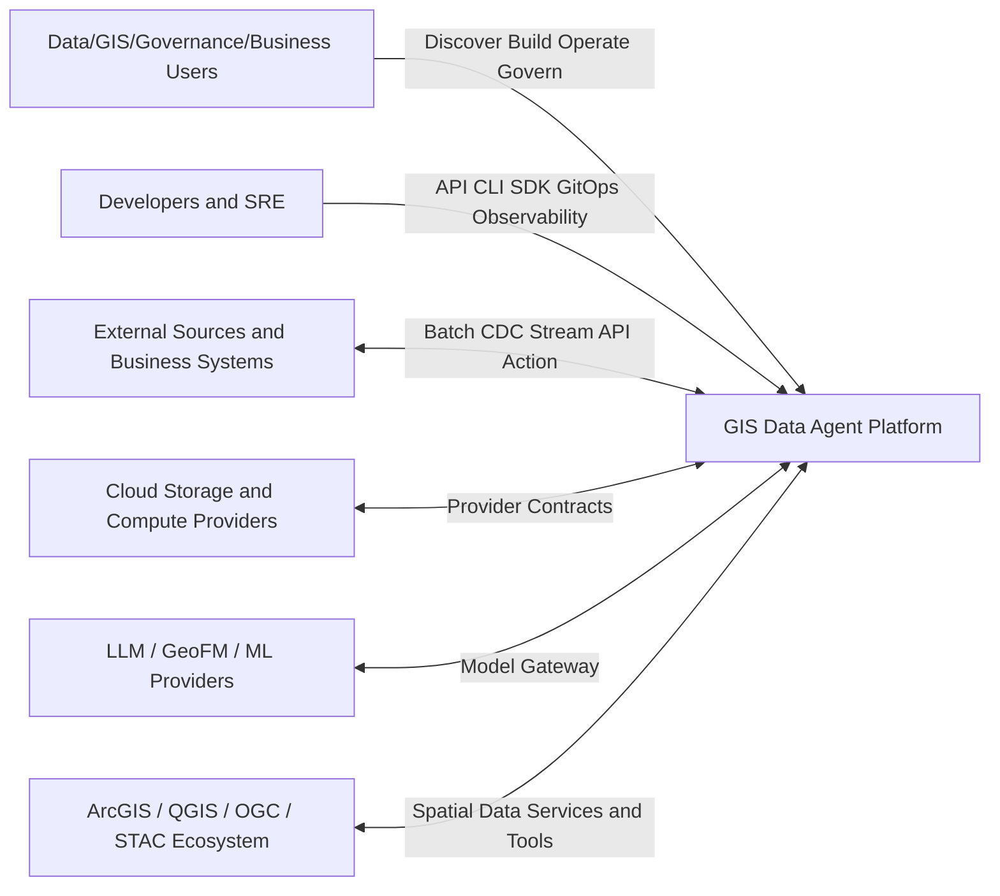
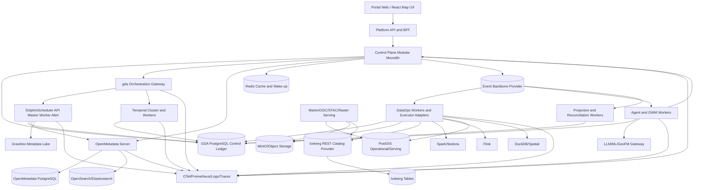

# GIS Data Agent 新一代 Data Platform 目标技术架构

**文档日期**：2026-07-19

**文档状态**：Target Architecture / Architecture Baseline Candidate

**规划视野**：2026-2036

**适用范围**：GIS Data Agent 数据平台、DataOps、AgentOps、空间语义、Operational Ontology、MMFE、Data for AI、GWM 及其私有化/云/轻量部署

**关联决策**：ADR-001 至 ADR-007、Apache OSSIE 语义交换评估、Cognitive Runtime 详细设计

---

## 0. 执行摘要

### 0.1 技术架构的一句话定义

GIS Data Agent 的目标技术架构不是“湖仓 + LLM + GIS 工具”的组合，而是：

> 一个以稳定资源身份和不可变版本为数字主线，以统一元数据与统一调度为双控制面，以可配置湖仓/轻量/云执行为数据面，以空间语义和 Operational Ontology 为业务对象层，以 LLM 可选、确定性优先的 Cognitive Runtime 管理 Agent，以 GWM 管理世界状态和行动后果，并通过 DataOps、AgentOps、GWMOps 持续运营的开放型地理空间 Data Platform。

### 0.2 架构总纲：三类真值、六个平面、一条合同脊柱

#### 三类权威真值

1. **治理与产品真值**：OpenMetadata 是通用治理 catalog（owner、domain、glossary、classification、quality、generic lineage）的写权威；Gravitino 是技术 metadata lake 和跨 catalog technical object 的权威层；GIS Data Agent PostgreSQL Control Ledger 保存 ResourceURN 映射、不可变定义/版本、PolicyDecision、Approval、PlatformRun、Artifact、Action、Outcome、SLO 和 Audit。三者由受控 fabric bridge 连接，不形成双写。
2. **数据与证据真值**：原始证据、湖表 snapshot、轻量引擎 snapshot 和业务源系统有效事件构成版本化数据真值；PostGIS Serving、STAC、搜索、图和 Agent Context 均为可重建投影。
3. **执行与行动真值**：DolphinScheduler 是 DataOps process/task/schedule/backfill 的执行真值，Temporal 是 Agent/GWMOps durable workflow 的执行真值；GDA Control Ledger 保存 PlatformDefinition、PlatformRun correlation、immutable binding、Policy/Approval、Artifact/Evidence、ActionResult 和对象 etag，而不重复实现其 queue、lease 或 workflow history。

#### 六个平面

```text
Experience Plane        Web/Map/Canvas/API/SDK/CLI/TUI/Notebook/Agent
Control Plane           Metadata + Orchestration + Policy + Release
Data Plane              Ingest + Lakehouse + Batch/Stream/Spatial Compute
Semantic/Action Plane   Canonical Semantics + OSSIE + Operational Ontology
Intelligence Plane      Cognitive Runtime + MMFE + AI + GWM
Operations Plane        DataOps + AgentOps + GWMOps + SRE + Security
```

#### 一条合同脊柱

```text
SubjectContext
 + ResourceURN / Immutable Version
 + DefinitionVersion / InputBinding
 + Run / Attempt / Artifact
 + PolicyDecision / Approval / ChangeSet
 + Event / Lineage / Evidence
 + SLO / Incident / Release
```

任何 UI、SQL、Notebook、API、SDK、CLI、TUI、Agent、MCP、A2A、Spark、Flink、PostGIS、DuckDB、云服务或 GWM kernel 都必须接入这条合同脊柱。不能因为某个组件“能运行”，就允许它建立自己的资源 ID、版本、队列、权限或产物真值。

### 0.3 最重要的架构取舍

1. **控制面采用模块化单体，不立即全面微服务化**。业务边界在代码、schema、API 和事件上严格隔离，部署拆分由独立扩缩容、故障隔离、组织所有权或 SLO 证据触发。
2. **PostgreSQL 是控制权威，不是所有数据的唯一存储**。默认分析真值在 MinIO + Iceberg，PostGIS 负责业务事务、空间编辑和低延迟 Serving，DuckDB 负责轻量与交互。
3. **默认 Spark/Sedona + Flink，但 Definition 不绑定具体引擎**。任务声明 capability 和 portability class，provider compiler 产生并固化 ExecutionPlanArtifact。
4. **不承诺虚假的“透明跨引擎迁移”**。portable、engine-family 和 provider-native 三种可移植等级必须显式标注，迁移产生新版本并经过 golden equivalence。
5. **Agent 是受治理的规划与调用者，不是权限、元数据、调度或数据库权威**。LLM 提出候选；Schema、Policy、State Machine、Evaluator 和 HITL 决定是否执行。
6. **GWM 是数据平台上的状态与行动内核，不是数据平台的替代品**。GWM 只消费已发布 DataProductVersion，输出 ScenarioProduct、DecisionProposal 和 OutcomeObservation。
7. **只采用局部 CQRS 和 append-only event/audit，不默认全面 Event Sourcing**。当前状态保存在关系模型，事件用于传播、审计、重建投影和因果追踪。
8. **OSSIE 是开放语义交换 profile，不是内部唯一权威模型**。内部 Canonical Semantic Model 还必须覆盖 GIS、治理、Operational Action、Evidence 和 GWM binding。
9. **不自研元数据管理框架**。OpenMetadata 是治理 catalog，Gravitino 是技术 metadata lake/federation；GIS Data Agent 只实现受版本控制的空间/证据 extension 与 metadata fabric bridge。
10. **不自研 scheduler 或 durable workflow runtime**。DolphinScheduler 是 DataOps DAG/schedule/backfill framework；Temporal OSS 是 Agent/GWMOps 长流程、审批、signal 和 compensation runtime；`PlatformRun` 只做跨框架 correlation，不重写其状态机。
11. **LLM 不是平台前提**。所有生产 capability 先以 `CapabilitySpec` 定义 typed command/query、policy、preview、Run/Artifact 和审计，再投影到 Web、API/SDK、CLI/TUI、Notebook 与 MCP/A2A Agent tool；LLM 只能生成候选意图、计划和解释，`llm_mode=disabled` 仍完整支持确定性平台路径。

### 0.4 已冻结的框架选型

1. 治理 catalog：OpenMetadata 1.13.1 认证基线；技术 metadata lake/federation：Apache Gravitino 1.3.x 认证线。GIS Data Agent 只实现 `gda-metadata-fabric-bridge`、空间/时间/证据 extension、ResourceURN/entity/object mapping 和 OpenLineage emitter；不自研 catalog、connector framework、治理 UI、通用搜索、通用 lineage 图或技术 metadata lake。
2. DataOps 调度中心：Apache DolphinScheduler self-hosted。GIS Data Agent 只实现 `gda-orchestration-gateway`、Definition/DataProduct -> ProcessDefinition compiler、external run correlation 和 provider task adapter；不自研 cron scheduler、DAG engine、task queue、backfill、worker group、资源队列或 DataOps UI。
3. Agent/GWMOps durable runtime：Temporal OSS 1.31.2 认证基线。GIS Data Agent 只实现 typed Action/Policy/Approval adapter 与 evidence/outcome projection；不自研 durable timer、workflow history、retry/signal、activity recovery 或 saga/compensation runtime。
4. Spark/Flink/云作业生命周期：Spark Operator/submit、Flink Kubernetes Operator 与云 provider adapter。GIS Data Agent 只实现 ExecutionPlan compiler 与 conformance/reconcile adapter；不自研计算引擎或 Kubernetes controller。

Gravitino 必须先通过 MinIO/Iceberg + Spark/Sedona + Flink 的真实 conformance，才可成为对应 DeploymentProfile 的 TableCatalogProvider；在此之前使用已认证 Iceberg REST catalog，绝不以 Trino 或文档成功替代。框架版本均以经过安全、兼容、备份恢复和 conformance suite 验证的 release 为准；表中的版本是当前认证基线，不是容器镜像的浮动标签。

---

## 1. 架构上下文

### 1.1 目标用户与外部系统

| 参与者 | 主要诉求 |
|---|---|
| 数据架构师 | 领域划分、分层、模型、数据产品、容量和成本规划 |
| 数据工程师 | Source/Sync、SQL/DAG/Notebook、批流任务、测试、发布和恢复 |
| GIS 工程师 | CRS、geometry、topology、空间分析、地图/影像/3D 服务 |
| 数据治理人员 | 标准、合同、质量、安全、审批、血缘、问题和影响分析 |
| 数据科学家/GWM 研究人员 | 可复现 Dataset、Feature、State、Action、训练、评测和 rollout |
| 业务用户 | 搜索、问数、地图、分析、申请订阅、方案比较和决策说明 |
| 平台/SRE/安全人员 | 部署、容量、成本、SLO、审计、备份恢复和事件处置 |
| Agent/外部应用 | 通过同一 typed API、MCP/A2A、事件和 SDK 消费受治理能力 |

外部系统包括关系/空间数据库、对象存储、文件系统、消息/CDC、API、遥感/地图服务、企业 IAM、云计算平台、BI/GIS 平台、模型服务和真实业务行动系统。

### 1.2 C4 System Context



### 1.3 已确认约束

- 私有化是一级部署形态，不是公有云版本的降级版；
- 部署环境可能没有 LLM、外网或 Agent worker；Web、API/SDK、CLI/TUI、Notebook、调度、质量、安全、审批、服务、地图和确定性 GWM/规则路径在 `llm_mode=disabled` 下仍须完整可用；
- 默认数据湖存储为 MinIO；
- 默认湖表为 Iceberg；
- 默认批计算为 Spark/Sedona；
- 默认流计算为 Flink；
- PostGIS 和 DuckDB/Spatial 支持轻量存算一体；
- Azure 等云能力通过 provider adapter 接入；
- 传统时空数据中台 v3.0 的完整用户任务是能力下限；
- 当前团队和负载不足以证明全面微服务、Kafka、RDF Store、专用搜索/向量集群是默认依赖；但元数据治理与编排属于基础能力，采用 OpenMetadata + Gravitino、DolphinScheduler 和 Temporal，避免以“规模尚小”为由长期自研 catalog/scheduler；
- GWM 是差异化内核，但不能绕过 Data Platform、DataOps 和治理。

### 1.4 当前实现与目标架构的关系

当前代码已经有 Python/Chainlit/Starlette 应用、React 空间前端、PostgreSQL/PostGIS、MinIO、Redis、Martin、StorageManager、SparkGateway、DuckDB adapter、workflow、task queue、outbox、语义层、标准平台、OTel、Agent registry、Prompt registry、eval、MMFE 和多个 GWM kernel。

这些是迁移资产，不是目标边界。当前主要结构性问题是：

- `frontend_api.py` 等模块承担过多 BFF、领域和运维职责；
- workflow、TaskQueue、SparkGateway、outbox 和 background task 没有共享 Run/Attempt/Lease 真值，且 APScheduler/Redis queue 是应用级实现，不是目标调度平台；
- metadata、semantic、Standards、STAC、model/prompt/tool 和 GWM registry 缺共同 ResourceURN/Version，`MetadataManager` 也不是企业 metadata framework；
- Docker Compose、K8s、Helm、Terraform 和 env schema 仍有配置漂移；
- 默认 Lakehouse 组件存在，但尚未形成从 Raw 到 Product/Serving 的生产合同；
- AgentOps 和 DataOps 组件存在，但 release/incident/replay/rollback 闭环尚未完成。

目标技术架构采用增量替换：新路径先进入统一合同，旧模块通过 anti-corruption adapter 迁移，达到双读一致后停止旧写路径，不做大爆炸重写。

---

## 2. 质量属性与架构驱动因素

### 2.1 质量属性优先级

| 优先级 | 属性 | 架构要求 |
|---:|---|---|
| 1 | 正确性与可追溯 | 输入、定义、引擎、产物、结论和行动全部锁定版本 |
| 2 | 安全与数据主权 | 用户/服务/Agent/worker 统一身份，权限下推到结果和副作用 |
| 3 | 可恢复性 | Web/worker/scheduler/engine 任意中断后可接管、重试、取消和 reconcile |
| 4 | 可演进性 | 存储、表格式、计算、模型和云 provider 可替换但不破坏逻辑合同 |
| 5 | 互操作性 | Iceberg/Parquet/GeoParquet、STAC、OGC、OSSIE、OpenLineage、OTel 等开放边界 |
| 6 | 性能与弹性 | 按 workload placement，控制面不承载大数据，执行面独立扩缩容 |
| 7 | 易用性与可达性 | Web/Map、API/SDK、CLI/TUI、Notebook 与 Agent 共享对象；Agent 降低配置复杂度但不隐藏工程状态，受限或无 LLM 环境仍可完成专业任务 |
| 8 | 成本可控 | 每个 Run、Artifact、Model/Agent/GWM 调用可归因、预算和优化 |

### 2.2 SLO 不采用一个全局数字

平台为每个 DataProduct/Service/Agent/GWM Deployment 绑定 `ReliabilityClass`：

```text
Class D: development / disposable
Class S: standard production
Class C: critical decision support
Class M: mission/regulated action
```

每类冻结独立的 availability、freshness、latency、RPO、RTO、retention、support window 和 approval policy。没有真实 workload 基准前，不在总体架构中伪造吞吐量和 p99 数字。

### 2.3 架构不变量

1. 一个资源只有一个稳定 `ResourceURN`；
2. 已发布 Version 不可变；
3. Run 只引用不可变 DefinitionVersion 和 InputVersion；
4. 大数据和大产物不进入控制面数据库或消息 payload；
5. 所有状态变更有 actor、reason、time、trace、policy 和 expected version；
6. 所有副作用有 idempotency、risk class、approval 和 compensation/reconcile 语义；
7. 所有读投影可从权威版本重建；
8. 所有 Agent/GWM 结论保留 observed/derived/proxy/simulated/synthetic 证据等级；
9. LLM 不授予权限、不推进发布状态、不自行宣布成功；LLM 缺失不剥夺任何 P0 production capability 的确定性调用、审计或恢复路径；
10. 未通过 conformance 的 provider 不进入生产 placement 候选集。
11. 每个生产 capability 都有版本化 `CapabilitySpec`，并至少有一个 non-agent deterministic path 与一个受治理 Agent tool path；入口等价以 definition/policy/run/artifact/audit 等价判定，而不是要求相同 UI 像素。

---

## 3. 目标逻辑架构

### 3.1 六平面总体视图

```text
+--------------------------------------------------------------------------+
| EXPERIENCE PLANE                                                         |
| Discover | Build | Operate | Govern | Map/2D/3D | Agent | API/CLI/SDK    |
+------------------------------------+-------------------------------------+
                                     | typed command/query/change set
+------------------------------------v-------------------------------------+
| CONTROL PLANE                                                            |
| Metadata | Orchestration | Policy | Approval | Release | Incident | Cost |
+----------------------+----------------------+----------------------------+
                       |                      |
             immutable definitions       policy/placement decisions
                       |                      |
+----------------------v----------------------v----------------------------+
| DATA PLANE                                                               |
| Source/CDC/File/API -> Raw -> ODS -> DWD/DIM -> DWS -> ADS/Projections   |
| Object/Lake/Table | Spark/Sedona | Flink | PostGIS | DuckDB | Cloud      |
+----------------------+----------------------+----------------------------+
                       |                      |
+----------------------v----------------------v----------------------------+
| SEMANTIC & ACTION PLANE                                                   |
| Canonical Semantics | OSSIE | Domain Ontology | Operational Object/Action|
+----------------------+----------------------+----------------------------+
                       | governed context/state/action
+----------------------v---------------------------------------------------+
| INTELLIGENCE PLANE                                                        |
| Cognitive Runtime | MMFE | AI/ML | GWM State/Dynamics/Rollout/Planner    |
+----------------------+---------------------------------------------------+
                       |
+----------------------v---------------------------------------------------+
| OPERATIONS PLANE                                                          |
| DataOps | AgentOps | GWMOps | SRE | Security | Audit | FinOps | DevEx     |
+--------------------------------------------------------------------------+
```

### 3.2 平面之间的硬边界

- Experience Plane 不直接持有业务真值，只提交 command/query 并消费 projection；
- Control Plane 只保存小型控制状态和引用，不扫描大数据；
- Data Plane 不自行决定 owner、release 或 policy；
- Semantic Plane 不复制海量事实，保存类型、定义、映射、规则和稳定引用；
- Intelligence Plane 不直接写生产权威对象，所有副作用必须通过 Action/Run；
- Operations Plane 观测并控制生命周期，但不能绕过领域状态机修改结果。

---

## 4. C4 Container 技术架构

### 4.1 目标容器图



### 4.2 容器职责

| 容器 | 首期部署 | 职责 | 不承担 |
|---|---|---|---|
| Portal Web | 独立静态资源/Ingress | Discover/Build/Operate/Govern、地图、DAG、SQL、审批、Agent | 权限和业务真值 |
| Platform API/BFF | 与 Control Plane 同进程可接受 | Auth context、API composition、SSE/WebSocket、request validation | 长任务、引擎计算 |
| Control Plane | 模块化单体 | ResourceURN mapping、Definition、Policy adapter、Release、Approval、PlatformRun、Incident、Cost | catalog/scheduler/durable runtime 的重复实现 |
| gda Orchestration Gateway | 独立进程 | Policy gate、Definition compiler、DolphinScheduler/Temporal launch、PlatformRun correlation、artifact/lineage evidence | cron、DAG、queue、timer、workflow runtime |
| DolphinScheduler | self-hosted 多副本 | DataOps process/task、schedule、complement/backfill、project/tenant、worker group/resource queue、DataOps UI | Agent/HITL durable workflow、行动补偿 |
| Temporal | self-hosted 多副本 + 独立 worker | Agent/GWM long-running workflow、approval signal、timer、activity retry、compensation | catalog、DataOps process scheduler |
| Drive Transfer Client | 用户设备/边缘/浏览器或 CLI/TUI | 目录发现、受限上传/下载、分片传输、断点恢复、完整性反馈；只持有本地恢复缓存 | 元数据/Run/权限/入湖真值，或隐式扫描用户文件系统 |
| DataOps Worker/Adapter | 水平扩展 | DuckDB/Python/GDAL、OpenMetadata/Gravitino ingestion、Spark/Flink/K8s/cloud task/provider adapter | 作为唯一 Run 真值 |
| Agent/GWM Worker | 独立扩展/隔离 | Cognitive Workspace、Planner、Retriever、Tool/Action、Evaluator、GWM rollout | 授权和隐式生产写入 |
| Projection/Reconciler | 独立进程 | STAC、PostGIS、metadata fabric bridge、搜索、图、Agent Context、OSSIE projection 构建与对账 | 成为第二权威 |
| GDA PostgreSQL | HA/托管或 Stateful | control/evidence ledger、policy、approval、PlatformRun correlation、审计、可选轻量数据/Serving | 通用 catalog、默认大规模湖扫描 |
| OpenMetadata | 独立服务 | catalog、治理、quality、generic lineage、discovery/search UI | GWM/action/control ledger、technical metadata lake、物理数据存储 |
| Gravitino | 独立服务 | metalake/catalog/schema/table/fileset、technical metadata、cross-catalog/region federation | business governance UI、产品发布/审批、GWM/action control truth |
| Redis | 可选 | cache、wake-up、短期 progress、rate limit | 唯一 queue payload 或状态真值 |
| Event Backbone | provider | outbox 事件、订阅、重放、DLQ | 替代关系事务 |
| MinIO/Object Storage | 默认 | Raw、COG、document、artifact、warehouse object | 业务关系和发布状态 |
| Iceberg Catalog | 独立 provider | namespace/table/snapshot commit 协调 | 统一业务 metadata authority |
| Spark/Sedona | 默认 batch | 大规模批、空间 ETL、模型/特征构建 | 交互 API 状态 |
| Flink | 默认 stream | CDC、事件时间、window、stream state、checkpoint | 全平台消息总线真值 |
| PostGIS | operational/serving | 编辑事务、空间索引、低延迟查询、MVT 数据源 | 默认湖仓历史真值 |
| DuckDB/Spatial | light/interactive | 单机、preview、local lake query、edge | 高并发写和无限扩展 |

### 4.3 模块化单体内部边界

Control Plane 至少划分以下 bounded contexts，每个模块拥有自己的 command service、repository、schema/table prefix、events 和 API；禁止跨模块直接修改表：

```text
Identity & Subject Context
Resource & Control Ledger
Metadata Fabric Bridge & GIS Extension
Schema, Contract & Semantic Model
Orchestration & Artifact
Data Product & Release
Quality & Governance Issue
Policy & Approval
Service & Projection
Operational Object & Action
AgentOps
GWMOps
Incident, SLO & Cost
Audit & Compliance
```

部署仍可同进程，但代码依赖只能由上层 application port 指向领域 port，外部技术通过 adapter 接入。拆服务的触发条件是独立扩缩容、隔离、团队所有权、发布节奏或已测 SLO，而不是代码行数。

---

## 5. 数字主线与核心领域模型

### 5.1 ResourceURN 与不可变版本

```text
Resource
  resource_urn
  kind
  namespace/tenant
  owner/steward
  lifecycle

ResourceVersion
  version_id
  resource_urn
  parent_version_id
  schema_ref
  content_hash
  transaction_time
  valid_time
  created_by
  status
```

`ResourceURN` 表示稳定身份，不包含物理 URI。`ResourceVersion` 表示不可变内容或定义。物理位置通过 `PhysicalBindingVersion` 关联，迁移 bucket、catalog、database 或 cloud region 不改变资源身份。

### 5.2 四种时间必须分开

| 时间 | 含义 |
|---|---|
| transaction time | 平台何时记录或知道该事实 |
| valid time | 事实在现实世界中何时有效 |
| event time | 流事件在源系统发生的时间 |
| processing time | 平台处理事件的时间 |

GWM 还增加 `scenario_time`。任何时空对象、政策、标准、地块状态和 Action outcome 不得只保留一个模糊 `timestamp`。

### 5.3 核心对象图

```text
Resource -> ResourceVersion -> PhysicalBindingVersion
                      |
                      +-> SchemaVersion -> FieldVersion
                      +-> DataContractVersion
                      +-> SemanticModelVersion
                      +-> PolicyBindingVersion

DataProductSpecVersion
  -> JobDefinitionVersion -> TaskGraphVersion
  -> QualityContractVersion
  -> ServiceProjectionSpecVersion
  -> ReliabilityClass

PlatformRun -> FrameworkRunReference -> FrameworkAttemptObservation -> Artifact
     |                  |                       |                    |
     +------------------+-----------------------+--------------------+-> LineageEvent
     +-> PolicyDecision / Approval / QualityAssessment / terminal verdict

ReleaseCandidate -> Promotion -> DataProductVersion -> ProjectionRevision
                                           |
                                           +-> ServiceDeploymentRevision
                                           +-> AgentContextProjection
                                           +-> AI/GWM StateProjection
```

### 5.4 内容寻址与业务版本同时存在

- `version_id` 是业务和治理版本；
- `content_hash` 验证内容不可变和去重；
- `snapshot_id` 是外部表/catalog 的物理提交标识；
- `build_id` 是 projection 构建版本；
- `etag` 用于 operational object 乐观并发；
- 这些标识不能互相替代。

---

## 6. 统一元数据控制面

### 6.1 已选框架与边界

采用 **OpenMetadata 1.13.1** 作为 governance catalog，采用 **Apache Gravitino 1.3.x** 作为 technical metadata lake/federation；二者均替代自建 catalog。OpenMetadata 运行在独立 PostgreSQL + OpenSearch/Elasticsearch 上，负责 owner/steward、domain、glossary、classification、quality、generic lineage、discover/search 和治理 UI。Gravitino 负责 metalake、catalog、schema、table/fileset/topic、跨 catalog/region technical object 与 access metadata。

GIS Data Agent 的 PostgreSQL Control Ledger 不是其中任一框架的替代品：它只保存 `ResourceURN <-> OpenMetadata entityLink <-> Gravitino object` 映射、不可变 DefinitionVersion、PolicyDecision、Approval、PlatformRun correlation、Artifact/Evidence、Action/Outcome 和本平台审计。空间/时态/证据采用 versioned metadata fabric bridge extension；GWM world state/action/outcome 不被降维为 catalog JSON。

Gravitino 从 AR-1 起必须完成 MinIO/Iceberg + Spark/Sedona + Flink 真实 conformance；官方 1.3 文档对 Spark/Flink 多引擎支持仍属 roadmap，因此在通过 create/read/write/schema evolution/snapshot/cancel/reconcile/lineage 前，不能成为默认 Lakehouse 的唯一 `TableCatalogProvider`。首期不 fork OpenMetadata/Gravitino、不开发通用 catalog UI、connector framework、lineage graph 或质量工作台。

### 6.2 六类元数据

| 类型 | 示例 | 权威来源 |
|---|---|---|
| 技术元数据 | metalake/catalog/schema/table/fileset、type、CRS、partition、snapshot、location | Gravitino + provider harvester |
| 业务元数据 | term、owner、description、domain、适用范围 | owner/steward |
| 操作元数据 | Run、Attempt、freshness、cost、usage | orchestration/runtime |
| 治理元数据 | contract、quality、classification、policy、approval | governance/policy |
| 语义元数据 | dataset、field、metric、concept、relationship、action | semantic/ontology authority |
| 证据元数据 | source、claim、derivation、confidence、observed/proxy/synthetic | evidence producer/evaluator |

### 6.3 Authority Matrix

每个字段都有 authority class。Harvester 不得覆盖 steward 描述，Agent 不得覆盖技术 schema，人工 lineage 不得伪装为运行 lineage，LLM 推断不得变成发布规则。

```text
Physical Provider      > physical structure/snapshot/job facts
Gravitino             > metalake/catalog/schema/table/fileset and federation facts
OpenMetadata           > catalog, owner/steward, domain, glossary, classification,
                          schema, generic lineage and generic quality facts
DolphinScheduler/Temporal > framework-local process/task/workflow state; emits execution observations
GDA Control Ledger     > ResourceURN mapping, immutable definition/input evidence,
                          PolicyDecision, Approval, PlatformRun correlation, Action/Outcome
Standards               > normative concept/rule/value domain
Agent/LLM               > candidate only, pending evidence and approval
```

### 6.4 Active Metadata Loop

```text
DolphinScheduler-triggered Harvest / DolphinScheduler-Temporal Run / OpenLineage Event
 -> MetadataObservation
 -> Drift/Impact/Policy/Quality Evaluation
 -> Issue or CandidateChangeSet
 -> Owner/Agent-assisted Remediation
 -> Approval/Run
 -> New Version
 -> Re-harvest and Verify
```

元数据中心必须能主动发现 schema drift、失效 owner、孤儿资产、过期标准、断裂 lineage、低质量高使用产品、策略不一致和 GWM input drift，而不只是提供搜索页面。

### 6.5 Projection 策略

OpenMetadata 是通用 governance catalog 的写权威，Gravitino 是 technical metadata/federation 的权威层。GDA Control Ledger 保存专属 control/evidence 事实和常用 correlation 查询；以下均是可重建读投影：

- full text/search/vector index；
- lineage graph；
- RDF/GeoSPARQL；
- STAC catalog；
- OSSIE document；
- Agent Context Bundle。

OpenMetadata 自带的 search backend 为治理 catalog 需要的标准依赖，不作为 GDA control ledger 的第二写权威。Gravitino 是否进入每个 profile 的 Iceberg table catalog path 由 Spark/Flink conformance 决定；专用图/RDF 只有在 OpenMetadata/Gravitino/GDA 的 catalog/impact 查询已无法满足已冻结 SLO 时才引入。

---

## 7. 统一调度与作业控制面

### 7.1 已选框架与统一语义

**Apache DolphinScheduler self-hosted** 是唯一的 DataOps orchestration framework，负责版本化 process definition、visual DAG、schedule、manual trigger、complement/backfill、project/tenant、worker group/resource queue、task plugin、alert 和 DataOps UI。Raw ingestion、OpenMetadata/Gravitino ingestion、Iceberg maintenance、Spark/Sedona batch、Flink deployment/reconcile、PostGIS/STAC projection、quality、publish 和 replay 都编译为 DolphinScheduler process/task。

**Temporal OSS 1.31.2 认证基线**负责 AgentOps/GWMOps 的 durable workflow：跨天等待、human approval signal、tool/action、外部 side effect、GWM rollout、retry、timer、cancel、compensation、versioning/replay。它不是 DataOps scheduler，也不存储 catalog 真值。

`gda-orchestration-gateway` 只把 `PlatformDefinitionVersion` 编译/提交给 DolphinScheduler 或 Temporal，固化 `PlatformRun` 与外部 run id、policy/approval、immutable bindings、artifact/evidence 和 terminal verdict。它不实现 cron、DAG engine、lease、queue、timer 或 workflow history。

| OrchestrationClass | Runtime | 示例 |
|---|---|---|
| `dataops` | DolphinScheduler | 分区摄取、湖仓 ETL、质量、complement/backfill、projection publish |
| `durable_agent` | Temporal | Agent plan、审批、长时 tool chain、外部系统 mutation |
| `durable_gwm` | Temporal | state build、rollout、evaluation、scenario/action loop |
| `action` | Temporal + typed Action adapter | 补偿、reconcile、human signal、真实业务副作用 |

### 7.2 Definition 与 Run 分离

```text
JobDefinitionVersion
  required_capabilities
  portability_class
  TaskGraphVersion
  resource_profile
  retry/cancel/checkpoint policy
  input/output schema
  side_effect_class

Run
  definition_version
  frozen input bindings
  resolved compute/storage bindings
  execution identity
  purpose/budget/SLO
  state/version
```

运行时参数必须进入 `RunInputBinding` 并计算 hash，不能作为不可审计的临时覆盖。

### 7.3 状态机

```text
PlatformRun:
requested -> policy_pending -> accepted -> dispatched -> running
                                              |            |
                                              v            v
                                           evaluating   cancelling -> cancelled
                                              |
                                              v
                                         publishing -> succeeded | failed

FrameworkAttemptObservation:
observed -> active -> retrying -> active
                   |-> succeeded | failed | cancelled | unknown
```

`PlatformRun` 的状态是 DolphinScheduler/Temporal state 的受控 projection，而不是重写 scheduler state machine。`FrameworkAttemptObservation` 保留 external process/task/activity/compute attempt id、时间、状态和 artifact reference，用于完整 lineage；它不承担 lease/claim/retry 真值。DolphinScheduler 负责 process/task queue、worker group、launch/retry，Temporal 负责 workflow history/timer/replay；GDA gateway 只执行 terminal/result reconciliation、policy gate 和跨系统关联。旧的 worker claim/lease 实现仅在迁移期间作为 compatibility adapter，不得继续扩展。

### 7.4 Executor SPI

```python
class ExecutorProvider(Protocol):
    def capabilities(self) -> CapabilityManifest: ...
    def prepare(self, attempt: AttemptSpec) -> ExecutionPlanArtifact: ...
    def submit(self, plan: ExecutionPlanArtifact) -> ExternalJobRef: ...
    def reconcile(self, ref: ExternalJobRef) -> ExecutorObservation: ...
    def cancel(self, ref: ExternalJobRef, mode: CancelMode) -> CancelResult: ...
    def collect(self, ref: ExternalJobRef) -> list[ArtifactDescriptor]: ...
```

Provider 还必须声明：

- checkpoint/snapshot 能力；
- transaction boundary；
- idempotency 语义；
- cancel/force-cancel 支持；
- credential mode；
- region/data sovereignty；
- resource/cost metrics；
- supported spatial types；
- conformance version。

### 7.5 Placement Resolver

```text
Required Capability + SLO + Data Location + Policy + Budget
 -> filter certified providers
 -> enforce sovereignty/security/compatibility
 -> score locality/cost/queue/saturation
 -> reserve capacity
 -> persist PlacementDecisionVersion
 -> compile and freeze ExecutionPlanArtifact
```

Agent 可以解释和建议 placement，但最终选择由确定性 resolver 完成。

### 7.6 幂等和副作用

`idempotency_key` 至少包含 trigger、definition version、logical input version、scheduled time 和 tenant。外部副作用分级：

| Class | 例子 | 要求 |
|---|---|---|
| L0 read | query/preview | timeout、budget、audit |
| L1 derived write | 新 Artifact/临时表 | content hash、isolated namespace |
| L2 publish | active projection/service | prepare/validate/atomic switch/rollback |
| L3 operational mutation | 修改业务对象 | ActionType、etag、approval、idempotency、compensation |
| L4 irreversible/external | 通知、审批提交、真实控制 | explicit human authority、safety case、reconcile |

“Exactly once”只在明确的事务边界内承诺。跨外部 API、数据库和对象存储的端到端 exactly-once 通常不可实现，架构采用 at-least-once delivery + idempotent effect + reconciliation。

---

## 8. 事件与一致性架构

### 8.1 事务 Outbox 是默认一致性原语

```text
Domain Command
 -> validate identity/policy/expected version
 -> DB transaction: state change + outbox event
 -> commit
 -> outbox relay
 -> event backbone
 -> idempotent consumers
 -> read projections/reconciliation
```

禁止 database commit 后再“尽力发送事件”的 dual write。

### 8.2 事件 Envelope

采用 CloudEvents 兼容 envelope，至少包含：

```text
event_id / event_type / schema_ref
occurred_at / recorded_at
tenant_id / subject_ref / purpose
resource_urn / resource_version
correlation_id / causation_id / trace_id
aggregate_version / idempotency_key
classification / region
payload_ref or compact payload
```

事件 payload 只携带小型事实和 Artifact reference。大 geometry、raster、dataframe、prompt transcript 或 model checkpoint 不进入事件总线。

### 8.3 Event Backbone Profile

| Profile | 默认实现 | 边界 |
|---|---|---|
| Lightweight | PostgreSQL outbox + polling/NOTIFY，可选 Redis wake-up | 简单、离线、较低吞吐 |
| Standard Production | Kafka-compatible/Redpanda adapter，是否启用由 AR-8 和负载触发 | 长保留、重放、多消费者、高吞吐 |
| Cloud Managed | 云事件流 adapter | 必须通过 ordering、retention、DLQ、identity、cost 认证 |

Flink 是流计算执行器，不自动等于平台事件总线；两者可以共享 Kafka-compatible backbone，但职责不同。

### 8.4 一致性等级

- Control Plane command：单资源强一致、跨资源显式 saga/changeset；
- Metadata projection：最终一致，返回 authority/freshness；
- Lake snapshot publish：snapshot commit 后再推进 ProductVersion；
- Serving projection：最终一致但有 build revision 和 active pointer；
- Agent/GWM context：固定 input version，运行中不静默漂移；
- Operational Action：etag + policy + approval + action transaction/reconcile。

---

## 9. 数据接入与同步架构

### 9.1 核心合同

```text
SourceDefinitionVersion
ConnectionBindingVersion -> CredentialReference
DiscoverySnapshot
SyncDefinitionVersion
  mode: full | incremental | CDC | event | virtual
  key/watermark/delete/schema-drift policy
  source/target mapping
  reconciliation contract
SyncRun -> Batch/Offset/Checkpoint -> ReconciliationResult
```

### 9.2 Connector SPI

每个 connector 必须声明并认证：

- discover/schema/sample/preview；
- full/incremental/CDC；
- insert/update/delete 语义；
- watermark/offset/checkpoint；
- schema drift；
- retry/resume；
- credential rotation；
- rate limit/backpressure；
- source consistency；
- data type/CRS mapping；
- reconciliation 和 deletion tombstone。

### 9.3 文件与大对象接入

传统平台的云盘客户端被保留并升维为一级 `DriveTransfer` capability family，而不是浏览器上传控件。它覆盖用户设备/边缘侧目录发现、上传、下载、目录同步、暂停/恢复和大文件状态展示；客户端不是 AI Agent，不依赖 LLM。

```text
Drive Client / Web / gda drive CLI-TUI / SDK / authorized Agent tool
  -> DriveEndpoint + FolderBinding + TransferSession (policy/quota/scope)
  -> scoped S3 multipart pre-signed URL OR certified NAS/SMB transfer gateway
  -> quarantine object prefix + part receipt/checkpoint
  -> full integrity + malware/content scan + ArtifactManifest
  -> DolphinScheduler ingest/parse/metadata process
  -> immutable Landing/Raw Artifact, then ODS/Bronze if approved
```

- 核心对象是 `DriveEndpoint`、`FolderBinding`、`TransferSession`、`TransferCheckpoint`、`FileRevision`、`IntegrityVerdict`、`ArtifactManifest` 与 `IngestRequest`。客户端本地数据库只保存可丢失的恢复缓存；服务端 session、manifest、policy、audit 和 Artifact 是耐久控制事实。
- 默认对象存储传输使用 S3 multipart pre-signed URL；S3/MinIO、NAS、SMB、FTP/SFTP 和云盘/云文件可经认证 `TransferProvider` 接入。浏览器或受限反向代理确有需要时可引入 tus-compatible provider，但不另建文件真值。
- 每个 part 记录 part number、size、checksum、receipt/ETag、retry 和上传者；完成时以完整文件 content hash 和输入 fingerprint 验证。multipart ETag 不得被误作完整内容 hash。源文件在暂停期被修改、credential 过期、客户端崩溃或服务端重启时，必须能拒绝错误续传或从最后已验证 part 安全恢复。
- 上传完成后仍落在 tenant-scoped quarantine；必须通过 hash、格式/恶意内容扫描、classification、许可/配额、bundle completeness 和 manifest 后，才能由 DolphinScheduler 触发 parser/profiler 并提升为 Landing/Raw。Shapefile 以 bundle 验证，禁止只接收 `.shp`；CAD/BIM/point cloud/raster/document 保留原对象和 manifest，解析产物是独立 Artifact，不覆盖原始证据。
- 目录同步要有 checkpoint、tombstone、冲突策略和显式删除语义；远程删除或本地路径变化不直接删除已发布 Raw/DataProduct。所有上传/下载、失败、恢复、取消和提升均有 `SubjectContext`、idempotency、quota、classification、Run/Artifact/audit。
- Agent 可以提出或提交已授权 `DriveTransfer` plan，但不能读取用户本地目录、下载文件或扩大同步范围；本地客户端必须显式授予路径、操作、期限和最大字节范围。LLM 禁用时，Web/API/SDK/CLI/TUI/客户端仍完整运行，并返回同一 TransferSession/Artifact 事实。

### 9.4 CDC 与流语义

- 使用 source offset + event time + schema version；
- Flink checkpoint 固化到 Run/Artifact；
- watermark 和 late-data policy 属于 DefinitionVersion；
- Iceberg sink 或等价云湖表提交形成 snapshot；
- delete 使用明确 tombstone/merge policy；
- 端到端守恒通过源计数、key checksum、增删改统计和目标 snapshot 对账。

---

## 10. 地理空间湖仓与存储架构

### 10.1 一套逻辑分层

```text
Landing/Raw
 -> ODS/Bronze
 -> DIM + DWD/Silver
 -> DWS/Gold
 -> ADS/Serving
 -> AI Dataset / Agent Context / GWM State Projection
```

不再维护与 Bronze/Silver/Gold 平行的第二套 ODS/DWD/DWS 副本。中文数仓分层和 Medallion 只是同一生命周期的两套别名。

### 10.2 各层工程语义

| 层 | 内容 | 允许操作 | 发布门 |
|---|---|---|---|
| Raw | 原始对象、源事件、checksum、manifest | append、tombstone | 来源/完整性/安全扫描 |
| ODS/Bronze | 可解析、保真、带摄取元数据 | typed ingest、schema capture | schema/row reconciliation |
| DIM/DWD/Silver | 标准化、去重、主数据、业务明细 | merge、SCD、空间校验 | contract/quality/standard/security |
| DWS/Gold | 主题聚合、指标、特征 | aggregate/materialize | metric conservation/freshness |
| ADS/Serving | API/Map/Query/Agent/GWM 投影 | rebuild/atomic switch | service/ACL/SLO/consumer compatibility |

### 10.3 数据家族与开放格式

| 数据家族 | 默认权威格式 | 目录/发现 | Serving |
|---|---|---|---|
| 表格/矢量/时序事实 | Iceberg + Parquet/GeoParquet | Metadata + Iceberg Catalog | PostGIS/DuckDB/API |
| 栅格/遥感 | COG；多维 cube 可用 Zarr provider | STAC + Metadata | range/tiles/analysis service |
| 文档/音视频 | immutable object + manifest | Metadata/search projection | signed URL/stream/API |
| 点云 | COPC/LAZ/EPT provider | STAC/metadata | point-cloud/3D service |
| 3D/mesh | glTF/3D Tiles/object manifest | scene catalog | Cesium/3D Tiles service |
| 模型/特征/checkpoint | artifact manifest + model format | Model/GWM registry projection | inference/rollout service |

### 10.4 空间表合同

跨引擎最小空间合同至少包含：

```text
geometry encoding and geometry type
CRS authority/code/WKT2 and axis order
XY/Z/M dimensionality
bbox/extent and spatial accuracy
validity/topology requirements
event/valid time
optional H3/S2/Quadbin/geohash derived index
```

空间索引列是可重建加速投影，不是 geometry 的替代真值。不能默认按 geometry、object ID 或高基数 H3 cell 做 Iceberg partition。partition 由 workload 基准选择时间、区域或受控 spatial bucket，并配合 sort order、file statistics 和 compaction。

### 10.5 Iceberg Catalog 边界

- 开发可使用简单 catalog；
- 生产多写必须采用 Iceberg REST Catalog 兼容 provider；
- catalog 负责 table/snapshot commit，不负责业务 owner、policy 或 DataProduct lifecycle；
- catalog 选择需要独立 ADR，比较 HA、locking、branch/tag、IAM、DR、云兼容和运维成本；
- snapshot commit 与 Metadata/Product publish 通过 prepare/commit/reconcile 协调，不假设跨系统原子事务。

### 10.6 生命周期维护

必须有独立 maintenance definitions：

- small-file compaction；
- manifest rewrite；
- statistics/index refresh；
- snapshot expiration；
- orphan-file detection；
- PostGIS vacuum/analyze/index health；
- COG overview/validation；
- retention/legal hold；
- projection rebuild and checksum reconciliation。

---

## 11. 计算架构

### 11.1 Workload 分类

| Workload | 默认候选 | 特点 |
|---|---|---|
| preview/local | DuckDB/Spatial、GeoPandas | 快速、隔离、小数据 |
| operational spatial | PostGIS pushdown | 事务、索引、低延迟 |
| batch analytical | Spark/Sedona | 大规模扫描、join、空间 ETL |
| stream/CDC | Flink | event time、state、checkpoint |
| interactive federation | PostGIS/DuckDB；Trino 等为条件 adapter | 不作为首期强制依赖 |
| AI/MMFE | Python/GPU/Spark provider | 数据对齐、特征、训练/推理 |
| GWM | dedicated CPU/GPU executor | state build、rollout、planner、evaluation |

### 11.2 Typed Operator Registry

每个 operator 定义：

```text
operator_id/version
input/output schema
required capability
determinism and side-effect class
resource profile
parameter schema
quality assertions
lineage behavior
preview implementation
production compiler implementations
compatibility/conformance version
```

Visual DAG、SQL、Notebook、API、Agent 都生成同一个 TaskGraphVersion，不维护五套运行语义。

### 11.3 Notebook 生产边界

Notebook 是探索环境，不直接成为生产任务。发布时必须固化：

- source revision；
- environment/container digest；
- dependencies/SBOM；
- input versions；
- parameter schema；
- output contract；
- resource limits；
- tests；
- network/data access policy。

发布结果是 JobDefinitionVersion 或 Model/GWM BuildDefinitionVersion，不是一个活跃 notebook session。

---

## 12. Canonical Semantic Layer、OSSIE 与 Ontology

### 12.1 四层语义模型

```text
L1 Technical Semantics
schema/type/CRS/unit/time/grain/source

L2 Analytical Semantics
dataset/field/dimension/measure/metric/relationship

L3 Domain & Governance Ontology
concept/value-domain/rule/standard/evidence/applicability

L4 Operational Ontology
object/state/link/action/function/interface/policy/change set
```

GWM 的 State/Action/Transition binding 位于 L4 之上，不塞入普通 BI semantic model。

### 12.2 Canonical Semantic Model

内部权威模型至少包含：

```text
SemanticModelVersion
LogicalDatasetVersion
FieldDefinitionVersion
RelationshipDefinitionVersion
MetricDefinitionVersion
GrainDefinition
Unit/MeasureDefinition
SpatialDescriptorVersion
TemporalDescriptorVersion
ConceptDefinitionVersion
ConceptMappingVersion
Rule/ConstraintVersion
EvidenceBinding
```

Metric 必须声明 grain、aggregation、filter、unit、time semantics、spatial rollup、null behavior、validity、owner 和 certification，不能只保存一段 SQL 字符串。

### 12.3 OSSIE 定位

- OSSIE 是 Canonical Semantic Model 的 import/export projection；
- OSSIE stable/draft spec version 必须锁定；
- GIS 未进入 core 的字段通过 typed `GIS_DATA_AGENT` extension 序列化；
- converter 必须输出 structural/semantic loss report；
- CI 进行 schema、reference、expression、round-trip 和 metric equivalence 验证；
- OSSIE document 不成为第二写权威。

### 12.4 Semantic Query IR

禁止从自然语言直接跳到可执行 SQL。目标链路是：

```text
Question/Intent
 -> TaskFrame
 -> authorized semantic subgraph
 -> SemanticQueryIR
 -> metric/grain/join/time/spatial validation
 -> policy rewrite and query budget
 -> LogicalPlan
 -> provider PhysicalPlan/SQL
 -> execution
 -> result/evidence/lineage
```

LLM 生成 `SemanticQueryIR` 候选，compiler 和 validator 决定是否合法。`SemanticQueryIR` 至少表达 selected metric、dimensions、filters、spatial predicate、time range、grain、sort、limit 和 expected result schema。

### 12.5 Operational Ontology

```text
ObjectTypeDefinition
PropertyTypeDefinition
LinkTypeDefinition
StateMachineDefinition
ActionTypeDefinition
Function/Capability Binding
InterfaceTypeDefinition
PolicyBinding
```

`ActionTypeDefinition` 必须包含参数、目标对象、前置条件、证据要求、权限、副作用等级、合法状态转换、审批、幂等、补偿、Evaluator 和实现 binding。

本体不复制业务事实。ObjectInstanceRef 指向 PostgreSQL/PostGIS、Standards、DataProductVersion 或外部业务系统，并携带 version/etag。

---

## 13. Data Product 与服务架构

### 13.1 DataProductSpec

```text
identity/domain/owner/steward
source/input contracts
logical layer and placement requirements
schema/semantic/quality/security contracts
build definitions
SLO and reliability class
cost/capacity/retention
projections and consumers
deprecation/replacement policy
```

### 13.2 发布状态机

```text
draft
 -> validating
 -> release_candidate
 -> awaiting_approval
 -> promoted
 -> active
 -> deprecated
 -> retired

validation failure -> rejected/fix-required
active incident     -> suspended/rollback
```

发布动作记录 input snapshot、definition、standard、semantic model、quality verdict、policy、approval、artifact hash、projection build 和 rollback pointer。

### 13.3 Projection 与 ServiceDefinition

一个 DataProductVersion 可以派生：

- SQL/attribute API；
- OGC API Features/Tiles/Processes；
- STAC Catalog/Collection/Item；
- MVT/vector tile；
- COG/raster tile；
- file/export；
- map/scene definition；
- Agent Context；
- AI Dataset/Feature；
- GWM State Projection。

每个 `ServiceDefinitionVersion` 声明 request/response schema、auth、quota、rate limit、cache、SLO、consumer compatibility 和 deprecation。发布采用新 revision 构建、验证、原子切换 active pointer；不在原表上就地变更。

### 13.4 API Gateway 不是服务生命周期

Gateway 负责认证、路由、限流、WAF 和观测；Service Control Plane 负责定义、版本、部署、consumer、SLO、回滚和退役。二者不能混为一个组件。

---

## 14. Cognitive Runtime 与 Agent 技术架构

### 14.1 Agent Runtime 不是 LLM Wrapper

```text
Entry -> RuntimeFactory -> RuntimeIdentity/Policy/Budget
 -> Typed Cognitive Workspace
 -> Deterministic Attention Router
 -> Perception/Retrieval/Ontology/Planning
 -> Action/Capability/Tool Execution
 -> Evaluator/HITL
 -> Response/Artifact/Checkpoint
```

LLM 是可替换 reasoning provider。Runtime 拥有合法状态转换、budget、timeout、permission、stop condition、checkpoint 和 evaluation closure。

### 14.2 AgentSpecBundle

```text
AgentSpecVersion
PromptVersion
ModelBindingVersion
Tool/Skill/Capability Versions
PolicyVersion
Semantic/Ontology Context Contract
Memory Contract
EvaluationBinding
Budget/SLO
DeploymentRevision
```

bundle hash 锁定一次 AgentRun 的完整运行配置。不能只记录 model name 和 prompt version。

### 14.3 Tool 与 Action 的区别

- Tool 是技术实现；
- Capability 是平台可执行能力；
- Action 是针对业务对象的受治理状态变更；
- Planner 对只读分析可选择 capability；对副作用任务必须先选择 ActionType；
- 一个 Action 可以更换 Tool 实现，但不能扩大权限、输入、状态转换或副作用。

### 14.4 Policy-aware Context Compiler

Agent 不获取整个 catalog、ontology 或数据库 schema。Context Compiler 输入 SubjectContext、task、resource scope、policy、budget 和固定 versions，输出最小必要 Context Bundle：

```text
authorized semantic subgraph
relevant evidence and standards
allowed actions/capabilities/tools
input/output schemas
examples/verified queries
data/version/quality warnings
token/cost budget
```

cache key 必须包含 tenant、subject/policy digest、resource version、purpose 和 context compiler version，防止跨租户或策略变更后的缓存泄漏。

### 14.5 AgentOps Loop

```text
AgentSpecBundle
 -> offline eval / safety / cost / regression
 -> approval
 -> shadow
 -> canary
 -> active deployment
 -> AgentRun / TaskStep / ToolCall / PolicyObservation
 -> online verdict / feedback / incident
 -> disable or rollback
 -> new bundle version
```

AgentRun 与 DataRun 关联但不共用业务状态机。AgentRun 记录认知和工具轨迹，DataRun 记录确定性数据生产。

---

## 15. GWM 与 GWMOps 技术架构

### 15.1 GWM 在平台中的位置

```text
Governed DataProductVersion
 -> MMFE/State Builder
 -> WorldStateVersion
 -> Dynamics/Transition Model
 -> RolloutRun
 -> Constraint Gate
 -> PlannerRun
 -> ScenarioProduct/DecisionProposal
 -> Policy/Human Approval
 -> Operational Action
 -> OutcomeObservation
 -> Calibration/Evaluation/New Version
```

### 15.2 GWM 核心合同

```text
WorldStateSchemaVersion
ActionSchemaVersion
ExogenousContextSchemaVersion
ConstraintSetVersion
DynamicsModelVersion
ObservationModelVersion
ObjectiveSetVersion
ScenarioSetVersion
RolloutDefinitionVersion
PlannerDefinitionVersion
Uncertainty/Calibration Contract
OutcomeObservation
```

WorldState 每个变量必须携带 value、time、spatial support、unit、source version、evidence grade、uncertainty 和 missingness。不能把 observed、proxy、imputed、simulated 和 synthetic 状态混为同一事实。

### 15.3 LLM + GWM 双驱动

```text
LLM:
intent, knowledge, hypothesis, explanation, candidate plan

GWM:
state estimation, action-conditioned transition,
counterfactual rollout, uncertainty, multi-step planning

Deterministic Control:
identity, legal actions, hard constraints, budget,
approval, execution, audit, rollback
```

LLM 不直接修改 GWM state，GWM 也不授予 Action 权限。二者通过 typed State/Action/Scenario contracts 协作。

### 15.4 Outcome Ledger

这是未来 5～10 年最重要的数据资产之一：

```text
DecisionProposal
 -> approved ActionInstance
 -> intended ChangeSet
 -> execution observation
 -> actual OutcomeObservation(s)
 -> attribution/confounders
 -> expected-vs-actual error
 -> model/planner/evidence versions
```

Outcome Ledger 必须是双时间、空间化、证据分级和可审计的。没有真实 action-outcome 数据，GWM 只能停留在被动预测或演示性规划。

### 15.5 GWMOps

GWMOps 是 AgentOps/ModelOps 的专业 bounded context，不新建第三套平台控制面。它复用 Metadata、Orchestration、Policy、Artifact、Release、Incident，同时增加：

- state/action schema compatibility；
- scenario/replay dataset；
- spatial/temporal/cross-region holdout；
- action ablation 和 shuffled-action test；
- uncertainty calibration；
- constraint violation；
- rollout stability；
- planner regret/utility；
- outcome drift；
- safety case 和 deployment envelope。

### 15.6 GWM 生产门

只有通过以下证据链才能从 research 升级为 production：

```text
data/evidence audit
 -> historical replay
 -> temporal holdout
 -> spatial holdout
 -> cross-domain transfer
 -> action signal ablation
 -> uncertainty calibration
 -> hard constraint audit
 -> shadow decision comparison
 -> human-reviewed pilot
 -> outcome feedback
```

---

## 16. 安全、身份与多租户架构

### 16.1 SubjectContext

```text
tenant_id
subject_id / subject_type(user, service, agent, worker)
roles/groups/attributes
delegation chain
purpose
data scopes
spatial/temporal scopes
session/trace
authentication strength
```

SubjectContext 显式传递到 repository、cache、retrieval、executor、tool、projection 和 audit；不能依赖异步线程中的隐式 ContextVar。

### 16.2 身份链

- Human 使用企业 OIDC/OAuth2；默认私有化可接 Keycloak 类 provider；
- service/worker 使用 workload identity 或短期证书；
- Agent 使用 delegation token，权限是用户委托、Agent policy 和 tool policy 的交集；
- executor 获取短期、最小权限 credential，不继承 Web 管理员连接；
- 外部 MCP/A2A 需要双向身份、capability allowlist 和请求签名。

### 16.3 Policy Decision

输入至少包含：

```text
SubjectContext
Resource/Object/Property/Link/Action
resource version and classification
spatial/temporal scope
purpose
requested operation and parameters
risk/evidence/approval state
environment/provider/region
```

输出为 `allow | deny | requires_approval`，附 policy version、obligations、redaction、row/spatial filter、reason code 和 decision expiry。LLM 不参与授权。

### 16.4 纵深执行点

| 层 | Enforcement |
|---|---|
| API/BFF | token、tenant、request schema、rate limit |
| Control repository | object authorization、PostgreSQL RLS |
| Semantic query | field/metric visibility、policy rewrite |
| Compute provider | workload identity、namespace、resource quota |
| Storage | bucket/prefix/key policy、encryption |
| PostGIS | role/RLS/column/spatial predicate |
| Agent context | policy-aware minimization/redaction |
| Tool/Action | parameter allowlist、side-effect/approval gate |
| Output | result filtering、watermark、download audit |

### 16.5 多租户隔离等级

| Isolation Class | 形态 | 适用 |
|---|---|---|
| Shared | shared control DB + RLS，独立 namespace/prefix | 常规多租户 |
| Dedicated Data | shared control plane，独立 DB/bucket/catalog namespace | 高敏数据 |
| Dedicated Runtime | 独立 worker/compute namespace 和 network | 强资源/执行隔离 |
| Dedicated Stack | 独立 control/data plane | 监管、关键基础设施、离线场景 |

同一产品可按 tenant policy 选择 isolation class，但合同和 API 不分叉。

### 16.6 代码与 Notebook Sandbox

- 非 root container；
- read-only base filesystem；
- per-run workspace；
- CPU/memory/GPU/time/process/file limits；
- default-deny network egress；
- signed image and dependency allowlist；
- secret broker，不把 secret 注入 notebook 内容；
- output scanning/classification；
- execution transcript 和 artifact hash。

---

## 17. API、SDK 与生态架构

### 17.1 接口层次

| 接口 | 用途 |
|---|---|
| REST/OpenAPI | 外部管理、查询、产品和服务 API |
| SSE/WebSocket | Run/Agent/preview 的进度与交互 |
| Events/AsyncAPI | metadata、run、release、incident、outcome 订阅 |
| Internal ports/gRPC optional | 高吞吐内部服务拆分后使用 |
| MCP/A2A | 受治理 Agent 能力交换 |
| OGC/STAC | 地理空间发现、访问和处理 |
| OSSIE | 分析语义模型交换 |
| SDK/CLI/TUI | GitOps、CI/CD、应用开发、离线运维、SSH/堡垒机值守和自动化 |
| Capability Registry | 版本化 capability discovery，以及 OpenAPI/AsyncAPI/MCP/A2A/UI schema 投影 |

### 17.2 API 规则

- command/query 分离命名，但不做不必要的全量 CQRS；
- 所有修改 API 支持 idempotency key、expected version 和 request ID；
- 长任务返回 RunRef，不保持 HTTP 请求执行；
- error 使用稳定 code、retryability、correlation ID 和 violated contract；
- pagination 使用稳定 cursor；
- resource version 必须显式或按 active pointer 解析并返回 resolved version；
- API schema、event schema、SDK 和 UI form 从同一 typed definition 生成。

### 17.3 LLM 可选的 CapabilitySpec 与多入口

每个生产能力都有一个版本化 `CapabilitySpec`：`capability_id/version/owner/lifecycle`、input/output JSON Schema 与 semantic type、`query|command|long_running`、读写资源/side effect/risk class、`SubjectContext`/policy obligations、idempotency/expected version、dry-run/preview、同步结果或 `RunRef`、Artifact/Evidence、cancel/compensate/reconcile，以及 OpenAPI/AsyncAPI-CloudEvents/MCP tool 映射。Web、Map/Canvas、SDK、CLI、TUI、Notebook 和 Agent 都是该合同的适配器，不能拥有业务状态机或绕过 `Capability Gateway -> Policy -> Definition/ChangeSet -> Orchestration -> Artifact/Audit`。

`gda` CLI 使用项目已具备的 Python `Typer` + `Rich`，`gda` TUI 使用项目已具备的 `Textual`，二者只调用公开 API。CLI 必须支持 JSON/YAML 输入输出、`--dry-run`、`--wait`、稳定退出码和 credential delegation；TUI 必须支持 catalog/definition diff、Run/日志/进度、质量问题、审批和恢复。TUI 对地图能力展示 layer/extent/style/Artifact descriptor，不复制 Web 的像素渲染。MCP/A2A tool 从 `CapabilitySpec` 投影，返回 resolved version、policy、RunRef 和 Evidence，而不是自由文本成功声明。

DeploymentProfile 显式声明 `llm_mode = disabled | optional | required_for_agent_feature`。在 `disabled` 下，只有自然语言理解、生成式解释和明确标为 Agent enhancement 的功能可不可用；平台必须返回 `LLM_UNAVAILABLE` 与等价确定性入口，不能隐藏或损坏治理、开发、质量、安全、审批、调度、服务、地图、GWM 确定性路径及其恢复。所有 P0 capability 必须在禁用 LLM、外网和 Agent worker 的测试 profile 中通过 Web/API/SDK/CLI/TUI/Notebook 的 parity 测试；每个 capability 还必须有受治理 Agent tool path。

### 17.4 Plugin/Extension Manifest

Connector、Operator、Quality Rule、Projection、Skill、Tool、MCP server、GWM kernel 和 Domain Pack 统一声明：

```text
stable ID/version/owner/license
input/output schema
capabilities and compatibility
permissions and side effects
resource/network requirements
configuration and secret refs
tests/conformance/signature/SBOM
deprecation policy
```

插件安装只登记候选；通过 signature、security scan、compatibility 和 conformance 后才能激活。

---

## 18. 可观测性、SRE 与 FinOps

### 18.1 四类可观测事实不能混用

| 类型 | 作用 |
|---|---|
| Log | 诊断文本和结构化事件 |
| Metric | 聚合健康、容量、延迟和成本 |
| Trace | 跨组件调用因果与延迟 |
| Lineage | 数据/模型/产物版本的生产依赖 |

Trace 不能替代 Lineage，聊天 Step 也不能替代 AgentRun。

### 18.2 统一关联键

所有 telemetry 至少包含适用的：

```text
tenant_id
resource_urn/resource_version
run_id/task_run_id/attempt_id
agent_run_id/tool_call_id
gwm rollout/planner run id
trace_id/correlation_id
provider/engine/region
release/deployment revision
```

### 18.3 SLI

平台级：API availability、OpenMetadata freshness/reindex lag、Gravitino metadata/federation health、DolphinScheduler schedule/process/task queue age、Temporal workflow/task-queue latency、provider saturation、projection lag。

数据产品级：freshness、completeness、quality、schema compatibility、consumer errors、replay success。

Agent 级：task success、online verdict、tool error、policy block、human takeover、cost/latency。
GWM 级：calibration、constraint violation、rollout stability、outcome drift、planner regret。

### 18.4 Incident 模型

```text
Alert/Observation
 -> Incident
 -> Impacted Resource/Product/Consumer
 -> Mitigation/Rollback/Replay
 -> Problem/Root Cause
 -> Corrective ChangeSet
 -> Verification
```

DataIncident、AgentIncident、SecurityIncident 和 GWMQualityIncident 共享通用 Incident spine，但保留领域字段和响应状态机。

### 18.5 Cost Attribution

所有成本归因到 tenant、product、run、provider、engine、model/agent/GWM deployment：

- compute CPU/GPU/memory/time；
- storage/egress/request；
- LLM token/cache；
- Spark/Flink slot；
- PostGIS/DuckDB query；
- projection/service request；
- idle reserved capacity。

预算是 Policy 输入。超预算可降级、排队、要求审批或阻断，不能在任务结束后才统计。

---

## 19. 高可用、备份与灾难恢复

### 19.1 可重建与不可重建资产

| 资产 | 恢复策略 |
|---|---|
| GDA Control Ledger | HA + PITR + schema/versioned backup + restore drill |
| OpenMetadata | 独立 PostgreSQL + search snapshot + extension/package pin + reindex/bridge replay drill |
| Gravitino | metadata store + catalog/provider configuration + bridge replay + federation recovery drill |
| DolphinScheduler | metadata DB + process definition/version + worker/resource/alert configuration + schedule/complement restore drill |
| Temporal | persistence store + namespace/workflow compatibility + worker/image digest + signal/replay/restore drill |
| Object Raw/Artifact | versioning/replication/checksum/legal hold |
| Iceberg table/catalog | object replication + catalog metadata backup + snapshot audit |
| PostGIS operational source | WAL/PITR/HA，按业务事务恢复 |
| PostGIS serving | 从 DataProductVersion 重建，必要时保留 warm replica |
| Redis | 可丢 cache；若承担 wake-up 可重放 DB state |
| Search/graph/STAC/OSSIE | 从 Metadata/DataProductVersion 重建 |
| Agent/GWM deployment | 从 immutable bundle/model/artifact 恢复 |

### 19.2 RecoveryClass

每个资源绑定：

```text
RPO/RTO target
backup frequency/retention
replication region
restore dependency order
degraded mode
rebuild source
last drill evidence
owner/on-call
```

### 19.3 降级原则

- LLM provider 故障或 `llm_mode=disabled`：保留完整确定性数据平台和专业工作面，包括 Web/API/SDK/CLI/TUI/Notebook、调度、质量、安全、审批、服务、地图和确定性 GWM/规则；仅自然语言、生成式解释和明确标记的 Agent enhancement 返回 `LLM_UNAVAILABLE` 及等价入口；
- GWM 故障：保留数据、分析、规则和传统模型，不生成推演结论；
- OpenMetadata/search 故障：停止 governance catalog 写入和自动发现；GDA 保留已批准 DataProduct/Control evidence 的受限只读路径，不绕过权限或将缓存升为权威；
- Gravitino 故障：停止依赖其 technical catalog/federation 的新 launch；已认证 Iceberg catalog profile 保持可运行，不能将缓存元数据升为权威；
- RDF/vector projection 故障：降级到固定 OntologyPackage/PostgreSQL，只读且不绕过权限；
- event backbone 故障：command 继续写 DB/outbox，限制积压并在恢复后重放；
- DolphinScheduler 故障：冻结新的 DataOps launch，保留外部 compute reconcile、已发布产品和恢复队列；恢复后按 idempotency/correlation key 补发；
- Temporal 故障：冻结新的 Agent/GWM action workflow，保留专业工作台和只读分析；恢复后由 workflow history/reconcile 继续，不能由 API 补写终态；
- Spark/Flink 故障：Run 保持可恢复，允许经审批切换兼容 provider 或等待；
- serving projection 故障：回退上一 active revision。

### 19.4 故障注入

必须测试：DolphinScheduler master/worker/worker-group 高可用、process retry/complement/backfill、Temporal worker 全部退出后 signal/timer 恢复、迟到结果、catalog commit 后 OpenMetadata/Gravitino bridge publish 前退出、projection switch 中断、event 重复/乱序、credential rotation、provider timeout、跨租户缓存、PostGIS/Iceberg 对账、Agent tool 超时、GWM rollout 资源耗尽。

---

## 20. 部署 Profiles

### 20.1 Lightweight Integrated

```text
React/Web + Platform API/Control + DolphinScheduler local/container worker
PostgreSQL/PostGIS
DuckDB/Spatial
optional MinIO
Redis optional
local/model provider
shared OpenMetadata + Gravitino + DolphinScheduler control services (remote or dev profile)
Temporal disabled unless durable Agent/GWM test is required
```

适合开发、边缘、离线和中小数据。仍保留 ResourceVersion、Run、Artifact、DataProductVersion 和逻辑分层，不因为单机部署取消工程合同。

### 20.2 Default Lakehouse Production

```text
Ingress/API/Web replicas
Control Plane modular monolith replicas + GDA PostgreSQL Control Ledger HA
OpenMetadata + dedicated PostgreSQL + OpenSearch/Elasticsearch
Gravitino metadata lake + certified catalog/provider bindings
DolphinScheduler API/master/worker/alert + metadata DB + worker groups/resource queues
Temporal cluster + namespace + isolated Agent/GWM workers (from T5 onward)
DataOps worker pools and executor adapters
Redis HA optional
MinIO distributed/enterprise-compatible deployment
Iceberg REST Catalog provider
Spark/Sedona
Flink
PostGIS operational/serving
Martin + STAC/Raster service
OTel + Prometheus/Grafana + log/trace backends
```

### 20.3 Cloud Managed/Azure Profile

逻辑组件不变，替换：

- object/data lake storage binding；
- Iceberg/compatible table catalog binding；
- batch/stream/interactive compute binding；
- managed PostgreSQL/PostGIS or certified alternative；
- self-hosted OpenMetadata/Gravitino/DolphinScheduler/Temporal on Kubernetes, or individually certified managed equivalents behind the same bridge/gateway contracts；
- identity/KMS/secrets/monitoring/event backbone；
- region、private network 和 sovereignty policy。

不能把“Azure 支持”简化为改一个 S3 URI。每个 provider 必须通过 identity、snapshot、cancel、reconcile、lineage、cost、backup/restore 和故障注入认证。

### 20.4 Hybrid/Federated

数据尽量留在权威域，通过：

- metadata federation；
- semantic/OSSIE exchange；
- policy-aware query/pushdown；
- approved data product replication；
- signed Artifact/manifest；
- cross-domain Action contract。

不承诺任意跨域实时 join。稳定消费优先使用 DataProduct projection 和明确复制合同；联邦 SQL 是条件能力。

### 20.5 环境与供应链

- dev/staging/prod 分离 namespace、identity、keys 和 data；
- image digest 和 signed artifact，不使用生产 `latest`；
- GitOps/IaC 是部署权威；
- schema migration 是独立 Job，支持 expand/migrate/contract；
- SBOM、provenance、license、vulnerability scan；
- secret 不进入 Git、image、event、trace 或 prompt；
- 配置使用 typed schema、version 和 fingerprint，启动时校验漂移。

---

## 21. 默认技术栈与替换边界

| 能力 | 默认/首期 | 可替换边界 | 选择说明 |
|---|---|---|---|
| 前端 | React + TypeScript + MapLibre/deck.gl | Web client | 已有基础，支持地图和专业工作面 |
| API/Control | Python + Starlette/FastAPI style + Pydantic | OpenAPI/typed ports | 复用当前能力，先模块化收束 |
| GDA Control Ledger | PostgreSQL + PostGIS/ltree/pgvector as needed | typed Control/Evidence APIs | ResourceURN mapping、Policy/Approval、PlatformRun/Artifact/Action/Outcome；不是通用 catalog |
| Governance Catalog | OpenMetadata 1.13.1 + 独立 PostgreSQL + OpenSearch/Elasticsearch | `gda-metadata-fabric-bridge`、OpenMetadata API/ingestion | owner/domain/glossary/classification、quality、generic lineage、search、协作 UI；不再自研 |
| Technical Metadata Lake | Apache Gravitino 1.3.x + certified catalog/provider bindings | `gda-metadata-fabric-bridge`、metalake/catalog crosswalk | cross-catalog/region technical metadata/federation；Spark/Flink 未认证前不作为唯一 Iceberg catalog |
| DataOps Orchestration | Apache DolphinScheduler self-hosted + metadata DB + master/worker/alert/resource queue | `gda-orchestration-gateway`、process/compiler/task adapter | visual DAG、schedule、complement/backfill、worker group、resource queue、DataOps UI |
| Durable Agent/GWMOps | Temporal OSS 1.31.2 认证基线 | typed Action/Approval/Policy adapter | 跨天等待、signal、retry、activity recovery、compensation/versioning；不承担 DataOps asset scheduler |
| Lineage Exchange | OpenLineage event envelope | `gda-lineage-emitter` | 统一运行血缘交换，bridge 写入 OpenMetadata 并关联 PlatformRun |
| Object Storage | MinIO S3 API | StorageProvider | 私有化默认，云对象存储可替换 |
| Drive Transfer | `DriveTransfer` capability + S3 multipart pre-signed URL；Python `Typer`/`Rich` CLI、`Textual` TUI；认证 NAS/SMB/FTP/SFTP provider | TransferProvider、Web/SDK/Agent tool adapter | 大文件上传/下载/目录同步、断点恢复、完整性、quarantine 与入湖；客户端不保存平台真值，不依赖 LLM |
| Table Format | Iceberg | TableCatalogProvider | snapshot/schema evolution/open ecosystem |
| Batch | Spark + Sedona | ExecutorProvider | 默认大规模批和空间计算 |
| Stream | Flink | ExecutorProvider | event time/state/checkpoint |
| Light/Preview | DuckDB + Spatial | InteractiveExecutor | 单机、边缘、快速 preview |
| Operational/Serving | PostGIS | ServingProvider | 事务、空间索引、MVT |
| Tile | Martin/compatible | ServiceProjection | 轻量高性能 MVT |
| Semantic Exchange | OSSIE profile | converter SPI | 开放 BI/AI 语义交换 |
| Identity | OIDC provider；私有化可选 Keycloak | IdentityProvider | 企业联邦和 workload identity |
| Policy | Policy Adapter + Postgres RLS；OPA/Cedar 条件 ADR | PolicyDecision API | 先证明表达力和延迟需求 |
| Event | Postgres outbox；Kafka-compatible 条件升级 | EventBackboneProvider | outbox 只传播 command/event；不替代 DolphinScheduler/Temporal |
| Observability | OpenTelemetry + Prometheus ecosystem | exporter/backend | 开放信号和厂商中立 |

技术选型表不是采购清单。默认组件只有进入真实 vertical slice、通过 conformance、SLO、恢复和运维成本验证后才能标记 production-supported。

---

## 22. 架构演进与迁移

### 22.1 Strangler 迁移顺序

```text
1. Schema/Config/Runtime Truth Freeze
2. OpenMetadata + Gravitino metadata fabric foundation + GIS extension + ResourceURN/entity/object bridge
3. DolphinScheduler foundation + PlatformRun correlation + executor/task adapters
4. 地类图斑 Source -> Raw -> Product -> Serving vertical slice
5. Metadata/Lineage/Quality/Policy bridge cutover
6. Visual/SQL/Notebook/Agent 共用 Definition
7. DataOps release/incident/replay
8. Temporal foundation + AgentSpecBundle/AgentRun/AgentOps
9. MMFE/Data for AI projection
10. Temporal-backed GWM/GWMOps and Outcome Ledger
11. conditional scale/federation/heavy ontology
```

### 22.2 当前模块迁移映射

| 当前模块 | 目标归属 | 迁移策略 |
|---|---|---|
| `MetadataManager`/asset tables | OpenMetadata + Gravitino + GDA Control Ledger | `gda-metadata-fabric-bridge` 双读/ResourceURN/entity/object mapping；迁移后停止 generic metadata 旧写 |
| `semantic_layer.py`/semantic model/metrics | Canonical Semantic Context | crosswalk、双读、统一 version/authority |
| workflow engine/APScheduler | DolphinScheduler | workflow 转为 versioned process definition/task/schedule；停止生产 cron |
| TaskQueue | compatibility/progress adapter | 取消 queue 真值；短期只转发 PlatformRun/DolphinScheduler/Temporal progress |
| SparkGateway | DolphinScheduler task + Spark ExecutorProvider | 外部 job ref + reconcile，不保留内存真值 |
| Standards outbox | Standards domain events | 保留领域表，平台 outbox 使用通用 envelope |
| Prompt/Agent/eval registry | Temporal-backed AgentOps Context | 合并为 AgentSpecBundle/Deployment/EvaluationBinding；long-running AgentRun 改为 Temporal workflow |
| MMFE ontology/product | DataProduct + Semantic/GWM projection | 从受治理 ProductVersion 构建 |
| GWM/TWM/UWM kernels | Temporal-backed GWM Executor/GWMOps | 统一 State/Action/PlatformRun/Artifact/Evidence contracts；rollout/evaluation 进入 Temporal |
| frontend_api.py | BFF + domain APIs | 按 bounded context 拆模块，不急于拆进程 |

### 22.3 不迁移原则

- 不把临时上传目录变成湖仓真值；
- 不把现有 JSONB lineage 原样搬入新表；
- 不把所有 Chat thread 转成 AgentRun；
- 不把所有 Python 函数注册成 Tool；
- 不把所有 GIS 对象复制到 graph/RDF；
- 不在 DolphinScheduler/Temporal/GDA gateway 迁移完成前继续增加新的 scheduler/queue/workflow runtime；
- 不为追求整洁重写已通过真实验证的 GIS/GWM 算法内核。

---

## 23. Architecture Fitness Functions

架构必须通过自动化“适应度函数”，而不仅靠评审文档。

### 23.1 Contract Fitness

- 所有 active resource 有 ResourceURN 和 immutable Version；
- Run 引用的 definition/input/provider 均可解析；
- Artifact 有 producer attempt、hash、schema/media 和 classification；
- provider conformance matrix 与运行选择一致；
- OSSIE round-trip 无静默损失；
- Service/SDK/event schema 兼容性通过。

### 23.2 Reliability Fitness

- DolphinScheduler master/worker/schedule 多副本不重复创建 logical process instance 或产品发布；
- Temporal worker 全部重启后，timer/signal/activity 能恢复且 PlatformRun correlation 不丢失；
- late result 被 fencing 拒绝；
- publish 任一阶段中断不推进 active pointer；
- projection 可从 ProductVersion 重建；
- backup restore 和 PITR 有定期证据；
- DataIncident 能触发 rollback/replay 并验证恢复。

### 23.3 Security Fitness

- 双租户 metadata/search/cache/lineage/tool 结果零泄漏；
- Agent 权限不超过用户委托与 tool policy 交集；
- spatial/temporal/row/column policy 在查询和输出均生效；
- secret 不出现在 log/trace/event/artifact/prompt；
- 高风险 Action 无 approval 不执行；
- plugin/image/package signature 和 SBOM 通过。

### 23.4 Data Fitness

- Raw 到 Product 的 count/key/amount/area 守恒；
- PostGIS/DuckDB/Spark/Flink 代表任务在批准容差内等价；
- CRS、axis order、area/distance unit golden cases 通过；
- schema drift/delete/late event/replay 正确；
- Iceberg snapshot、STAC item、Serving revision 和 ProductVersion 可相互追踪。

### 23.5 Agent/GWM Fitness

- Agent bundle offline/shadow/canary/rollback 闭环；
- 每个 ToolCall 有 policy、input/output、side effect、verdict；
- LLM-only 与 LLM+GWM 对照评测；
- action ablation、spatial/temporal holdout、uncertainty calibration；
- hard constraint violation 阻断；
- observed/proxy/synthetic evidence 不混淆；
- outcome feedback 能回到固定 model/planner version。

---

## 24. 关键风险与反模式

| 反模式 | 后果 | 架构控制 |
|---|---|---|
| Agent 直连数据库并自由写入 | 越权、不可重放、无血缘 | Action/Run/Policy/Approval |
| 每个模块维护自己的 registry | 版本和 owner 漂移 | ResourceURN/Version + projection |
| Redis/内存保存唯一任务状态 | 重启丢失、无法接管 | DolphinScheduler/Temporal durable state + GDA PlatformRun correlation |
| 把 PostGIS 当全部湖仓 | 大对象、历史、批量扩展受限 | Iceberg truth + PostGIS serving |
| 把 MinIO 文件目录叫 Data Lakehouse | 无事务、schema、snapshot | Iceberg catalog/snapshot contract |
| 用一个 JSONB 保存所有元数据 | 查询/约束/权威失控 | 核心关系强类型，扩展才 JSONB |
| 宣称任意引擎透明切换 | 结果和语义不一致 | portability class + golden tests |
| 为每种能力建微服务 | 运维和分布式事务爆炸 | 模块化单体 + extraction trigger |
| Kafka/图/RDF/向量库先行 | 技术负担无业务收益 | workload/SLO/ADR 准入门 |
| ai_context 充当规则或权限 | prompt 注入和不可审计 | Standards/Policy/Evidence authority |
| GWM 绕过 DataProductVersion | 训练/推演不可复现 | StateProjection + fixed version |
| 预测模型包装成世界模型 | 能力边界失真 | GWM maturity/evidence gate |
| 只监控基础设施 | 产品失败无法定位消费者影响 | Product/Agent/GWM SLI + Incident |

---

## 25. ADR 路线

ADR-006 和 ADR-007 已接受，冻结元数据治理和编排框架选型。后续 ADR 按依赖顺序建立：

| ADR | 决策 |
|---|---|
| ADR-006 | OpenMetadata + Gravitino metadata fabric、GIS extension 与 authority boundary（Accepted） |
| ADR-007 | DolphinScheduler + Temporal 分层编排平台与 PlatformRun correlation（Accepted） |
| ADR-008 | ResourceURN、不可变版本与双时间模型 |
| ADR-009 | Control Plane 模块边界与禁止跨模块写表 |
| ADR-010 | Event envelope、transactional outbox 与 backbone 升级门 |
| ADR-011 | Iceberg REST Catalog 生产 provider 选型 |
| ADR-012 | Canonical Semantic Model 与 OSSIE interchange profile |
| ADR-013 | SemanticQueryIR 与多引擎 compiler |
| ADR-014 | Identity delegation、SubjectContext 与 PolicyDecision contract |
| ADR-015 | 多租户 isolation classes |
| ADR-016 | Notebook sandbox 与 productionization contract |
| ADR-017 | ServiceDefinition、OGC/STAC/MVT projection 生命周期 |
| ADR-018 | AgentSpecBundle、Temporal AgentRun 和 ToolCall 运营模型 |
| ADR-019 | GWM contracts、Temporal GWMOps 与 Outcome Ledger |
| ADR-020 | ReliabilityClass、RPO/RTO 和 degraded mode |
| ADR-021 | Kafka/Redpanda、Trino、RDF/Graph 的 workload 准入门 |

---

## 26. 分阶段交付架构

### Phase T0：Architecture Truth

交付 schema/config fingerprint、ResourceURN 规则、`CapabilitySpec`/OpenAPI/AsyncAPI/MCP projection、`llm_mode`、typed config、migration truth、模块所有权和当前资产 crosswalk；部署 OpenMetadata、Gravitino、DolphinScheduler 的隔离 sandbox，完成 OIDC、backup/restore、OTel、Helm/IaC 和最小健康检查，不迁入生产写流量。

### Phase T1：Control Spine

交付 OpenMetadata/Gravitino GIS extension/bridge、ResourceURN/entity/object mapping、SubjectContext、PlatformDefinition/PlatformRun/Artifact、outbox、最小 PolicyDecision、DolphinScheduler process/task/worker group、一个 metadata fabric ingestion process 与故障注入。禁止再为生产任务增加 APScheduler 或 TaskQueue。

### Phase T2：Geospatial Lakehouse Slice

以真实地类图斑完成 Source/Sync、`DriveTransfer` 云盘客户端（上传/下载/目录同步/中断恢复/完整性/quarantine）、Raw/ODS/DWD/DWS/ADS、MinIO/Iceberg/Spark/Sedona/Flink、PostGIS Serving、STAC、OpenMetadata governance/quality/lineage、Gravitino technical metadata POC、DolphinScheduler complement/backfill/replay 和跨 profile conformance。

### Phase T3：Semantic Data Product Engineering

交付 Canonical Semantic Model、OSSIE converter、SemanticQueryIR、typed operator、Visual/SQL/Notebook/API/SDK/CLI/TUI、DataProduct release、质量安全发布门；所有 P0 capability 先通过 LLM-free parity gate。

### Phase T4：Service and Operations

交付 ServiceDefinition、OGC/STAC/MVT/API、申请订阅、SLO/Incident/Problem、backup/restore、projection rebuild 和完整 DataOps。

### Phase T5：Agentic Platform

部署 Temporal production profile，交付 Cognitive Runtime、policy-aware context、AgentSpecBundle、Temporal AgentRun/ToolCall、approval signal、eval、shadow/canary、online verdict、incident/rollback 和 Human/Agent uplift 证明；Agent tool 必须从既有 CapabilitySpec 投影，不能另建隐式 pipeline。

### Phase T6：Data for AI/MMFE

将矢量、栅格、文本、时序、规则和图对齐为版本化 AI Dataset/Context/Feature/State projection，进入同一 DataProduct lifecycle。

### Phase T7：GWM/GWMOps

交付 WorldState/Action/Dynamics/Rollout/Planner contracts、Temporal-backed Outcome Ledger workflow、GWM Ops、真实 action-outcome pilot 和 G4/G5 成熟度门。

### Phase T8：Conditional Scale

只在证据触发时增加 Kafka-compatible backbone、Trino、专用 vector/graph/RDF、跨区域 federation、service mesh 和多集群调度；Gravitino、DolphinScheduler、Temporal 与 OpenMetadata 的能力扩展仍须经过版本、容量、隔离和恢复认证。

---

## 27. 总体验收标准

目标技术架构只有同时满足以下条件才算落地：

1. 传统平台核心任务全部有 Web/API/SDK/CLI/TUI/Notebook 中至少一个 Human/automation 结构化入口和非 Agent、无 LLM 可重放路径；
2. 同一任务可由专业入口或 Agent 生成同一个 typed Definition/ChangeSet；入口差异可审计而不能改变 policy/run/artifact 真值；
3. 数据从 Source 到 Product/Service/Agent/GWM 全链具备 ResourceVersion、Run、Artifact、Lineage 和 Policy；
4. Default Lakehouse、Lightweight 和一个 Cloud/Azure 代表 provider 通过同一 conformance suite；
5. scheduler/worker/engine/publish 故障均能接管、取消、回滚或 reconcile；
6. DataOps release/SLO/incident/replay 完整闭环；
7. AgentOps bundle/eval/canary/verdict/incident/rollback 完整闭环；
8. GWM 的 State/Action/Transition/Evidence/Outcome 可追踪并通过对照评测；
9. 双租户、空间/时间/字段/行动权限无泄漏；
10. 所有对外“支持”都有版本、认证、测试、部署和恢复证据。
11. 每个 P0 capability 都有 `CapabilitySpec`、OpenAPI/AsyncAPI/MCP 投影、CLI/TUI 可达性矩阵和 LLM-free test evidence；可视化能力可在终端以 descriptor/Artifact 方式操作，不要求复制浏览器渲染。

---

## 28. 最终判断

GIS Data Agent 的技术领先不能建立在组件数量上，而要建立在一种比传统数据平台和普通 Agent 平台都更严格的数字主线上：

```text
现实对象和数据证据
 -> 稳定身份与不可变版本
 -> 受治理数据产品
 -> 语义和运营对象
 -> Agent 候选计划
 -> GWM 行动后果推演
 -> Policy/Human 决策
 -> 可执行 Action
 -> 真实 Outcome
 -> 可回放学习与新版本
```

传统 Data Platform 通常止于数据产品和分析；普通 Agent Platform 通常止于工具调用；数字孪生通常止于状态展示；预测平台通常止于未来估计。GIS Data Agent 的目标架构把四者连接起来，同时保留工程真值、安全边界和恢复能力。

真正值得建设的终局不是一个“更会聊天的 GIS 中台”，而是：

> **一个开放、可部署、可治理、可行动、可推演、可验证的 Geospatial Data-to-Action-and-World Platform。**

这份技术架构的关键不在于一次性安装全部候选技术，而在于从第一条 vertical slice 开始，坚持同一 Resource、Version、Run、Artifact、Policy、Evidence、Action 和 Outcome 合同。只要这条合同脊柱稳定，存储、计算、模型和云平台可以持续替换；如果这条脊柱不稳定，再先进的湖仓、Agent 或 GWM 都只会形成新的孤岛。

---

## 29. 关联文档

- `docs/roadmap.md`
- `docs/roadmap-mainline-checkpoint-2026-07-19.md`
- `docs/architecture-review-2026-07-19.md`
- `docs/traditional-platform-baseline-and-agentic-elevation-2026-07-19.md`
- `docs/architecture-decisions/adr-001-geospatial-lakehouse-and-postgis-boundary.md`
- `docs/architecture-decisions/adr-002-unified-metadata-control-plane.md`
- `docs/architecture-decisions/adr-003-unified-orchestration-and-job-control-plane.md`
- `docs/architecture-decisions/adr-004-capability-floor-and-dual-entry-agentic-platform.md`
- `docs/architecture-decisions/adr-005-dataops-and-agentops-operating-loops.md`
- `docs/architecture-decisions/adr-006-openmetadata-governance-and-active-metadata-platform.md`
- `docs/architecture-decisions/adr-007-dolphinscheduler-temporal-orchestration-platform.md`
- `docs/reports/apache-ossie-semantic-layer-value-assessment-2026-07-19.md`
- `docs/designs/gis_data_agent_cognitive_runtime_2026-07-15/GIS_Data_Agent_Cognitive_Runtime_详细设计说明书.md`

## 30. 证据边界

- 本文是目标技术架构，不表示所有组件已经实现；
- 默认技术栈是开箱 profile，不是不可替换的产品绑定；
- 未提供真实容量、用户数、延迟、RPO/RTO 和预算，因此具体 sizing 由 workload benchmark 和 ReliabilityClass 决定；
- Kafka/Redpanda、Trino、OPA/Cedar、RDF/Graph、专用向量/搜索和 service mesh 均为条件路线；OpenMetadata、Gravitino、DolphinScheduler 与 Temporal 是已选择框架，但每次升级、扩容和 provider 变更仍须通过 conformance；
- 云 provider 必须逐项认证，不以营销名称推断能力；
- GWM 生产状态必须按数据、行动、验证和 outcome 证据判定，不能由文档命名或演示效果决定。
