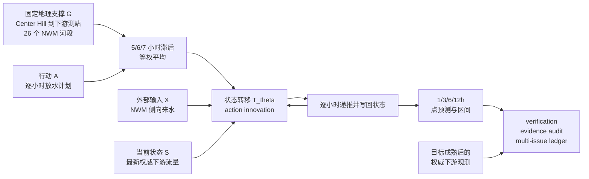

# 当前数据场景如何用 GWM 建模过程表达

日期：2026-07-31  
对象：Geospatial Kernel V2 / Center Hill action-innovation shadow candidate  
状态：候选已冻结，默认关闭，尚未验证，尚未准入

## 1. 核心结论

当前使用的数据场景，本质上是一个“水库放水如何沿固定河网影响下游流量”的小型 GWM。它不是在模拟整个地球，也不是完整水动力模型，而是在一个严格限定的空间和时间范围内学习并执行：

> 当前河流状态 + 水库行动 + 外部来水 -> 未来河流状态

从 GWM 视角看，这个场景已经形成完整的最小闭环：

> 空间 -> 状态 -> 行动 -> 转移 -> 未来状态 -> 不确定性 -> 观测验证 -> 证据治理

## 2. 当前数据场景

空间对象是美国 Center Hill 水库到下游出口测站之间的一条固定有向河网：

- 行动入口：水库河段 `18434265`
- 结果出口：下游河段/测站 `18421703`
- 中间包含 26 个固定 NWM 河段
- 固定网络身份：`center-hill:dam-to-gauge:full-incremental-subnetwork-v1`
- 预测时间步长：1 小时
- 支持的预测时距：1、3、6、12 小时

需要明确：当前模型没有逐河段求解流速、水深和质量守恒。河网主要用于限定“哪个水库行动影响哪个下游结果”、传播方向和候选滞后时间。当前真正预测的是出口处的一个标量，即下游流量。

## 3. GWM 要素映射

| GWM 要素 | 当前数据场景中的含义 |
|---|---|
| Geography `G` | 水库到测站的固定有向河网、行动入口、结果出口和 26 个河段 |
| State `S_t` | 预测时刻能够获得的最新下游流量 `q_t` |
| Action `A_t` | Center Hill 水库逐小时放水计划 |
| External forcing `X_t` | NWM 逐小时侧向来水预测 |
| Transition `T` | 放水变化和侧向来水怎样改变下一小时流量 |
| Observation `O_t` | 目标时刻成熟后取得的下游实际流量 |
| Uncertainty `U` | 1、3、6、12 小时各自的经验误差范围 |
| Evidence `E` | 冻结参数、输入版本、预测回执、观测文件、验证和账本 |

换句话说，GWM 在这里不是一张地图，也不是单独的预测模型，而是“地理约束下的状态变化系统”。

## 4. 建模过程



运行过程可以拆成八步：

1. 锁定水库到测站的地理网络身份，禁止混入其他流域。
2. 在 issue time 取得当时可用的最新下游流量，作为初始世界状态。
3. 取得 issue time 已可用的水库放水计划，作为行动序列。
4. 取得 issue time 已可用的 NWM 侧向来水预测，作为外部环境输入。
5. 根据固定的 5、6、7 小时滞后，把水库行动映射到下游有效行动。
6. 每小时执行一次状态转移，并把预测结果写回下一小时状态。
7. 提取 1、3、6、12 小时点预测，并附加冻结的不确定性区间。
8. 目标时刻过去后，读取权威观测进行评分；观测不得反向进入预测过程。

## 5. 状态转移机制

当前冻结的 action-innovation 公式是：

```text
q[t] = q[t-1]
     + drift
     + action_change_beta * (effective_action[t] - effective_action[t-1])
     + forcing_beta * nwm_lateral[t]
```

冻结参数为：

```text
drift              = -1.0346407225 m3/s per hour
action_change_beta =  0.3298888457
forcing_beta       =  0.7141335343
```

有效行动定义为过去第 5、6、7 小时水库放水量的等权平均：

```text
effective_action[t]
  = (release[t-5h] + release[t-6h] + release[t-7h]) / 3
```

因此，该模型学习的是“行动变化”，而不是行动绝对值：

- 水库持续稳定放水时，行动变化为零，不会在每个小时重复增加下游流量。
- 水库有效放水突然增加 `30 m3/s` 时，该小时行动贡献约为 `0.3299 x 30 = 9.9 m3/s`。
- 如果同时存在 `10 m3/s` 的 NWM 侧向来水，外部来水贡献约为 `0.7141 x 10 = 7.14 m3/s`。
- 加上基线漂移后，该小时预测流量约在上一小时基础上增加 `16 m3/s`。

每算完一小时，预测结果都会写回成为下一小时状态。因此 12 小时预测不是直接套用一个 12 小时公式，而是连续执行 12 次状态转移。

模型输出被限制在 `0` 到 `10000 m3/s` 范围内。这个限制用于防止明显不合理的负流量或数值爆炸，但不等于物理水动力守恒。

## 6. 当前使用的数据

当前场景使用历史 Center Hill 开发数据，不是已经投入运行的实时预报数据：

- 开发面板长度约为 672 小时。
- 参数拟合使用其中 160 个小时。
- 拟合窗口为 2021-12-09 02:00 UTC 至 2021-12-16 01:00 UTC。
- 数据字段包括水库放水、下游观测流量和 NWM 侧向来水。
- 固定空间支撑和 5、6、7 小时滞后在参数冻结后不得按评估窗口重新选择。

当前历史诊断尚未证明放水计划和 NWM 输入在当时 issue time 已经以相同版本真实可用。因此现有结果只能支持“该转移机制值得进入 shadow 验证”，不能支持“它已经是业务预报模型”。

## 7. 不确定性表达

模型在点预测外，为每个预测时距附加冻结的经验绝对误差半径：

| 预测时距 | 经验误差半径 |
|---:|---:|
| 1h | `42.7375 m3/s` |
| 3h | `68.0870 m3/s` |
| 6h | `85.6304 m3/s` |
| 12h | `124.1804 m3/s` |

区间按以下方式生成，并裁剪到物理流量范围：

```text
lower[h] = max(0, point[h] - radius[h])
upper[h] = min(10000, point[h] + radius[h])
```

这些半径来自每个时距 475 个历史校准样本，目标边际覆盖率为 90%。但当前不作以下声明：

- 不声明时间序列满足 IID 或可交换性。
- 不声明有限样本覆盖保证。
- 不声明条件覆盖保证。
- 不声明换到其他流域仍然有效。

## 8. 预测与观测的隔离

GWM 的预测过程必须遵守信息时间边界：

```text
issue time 之前或当时可用：
  最新下游状态 + 放水计划版本 + NWM 预测版本

issue time 之后才成熟：
  1/3/6/12h 下游实际观测
```

未来观测只能用于评分，不能用于：

- 修改预测值。
- 修改区间半径。
- 重新选择滞后。
- 重新拟合参数。
- 删除区间未覆盖的样本。

当前实现的证据链为：

```text
sealed forecast receipt
  -> authoritative observation batch
  -> receipt-bound outcome document
  -> prospective verification
  -> exact-source evidence audit
  -> issued-forecast reconciliation
  -> multi-issue evidence ledger
```

账本会区分三类已发行预测：

- `scored_and_source_recomputed`：已经评分，并从源文件重新计算验证结果。
- `pending_outcomes`：目标尚未全部成熟。
- `unscored_matured`：目标已经成熟但尚未评分，属于必须暴露的完整性风险。

## 9. 当前能够回答的问题

当前 geospatial kernel 可以回答一个边界明确的问题：

> 在 Center Hill 固定水库到测站网络上，如果以某个 issue time 的最新下游流量为初始状态，并使用当时可用的放水计划和 NWM 侧向来水预测，那么未来 1、3、6、12 小时的下游流量及其经验区间是多少？

它目前不能回答：

- 整个河网每个河段的水深、流速和流量场。
- 洪水淹没范围。
- 严格质量守恒的水动力过程。
- 5、6、7 小时滞后是否等同于真实物理传播时间。
- 任意长时间滚动预测是否稳定。
- 换到其他水库或流域是否仍然有效。
- 某个放水政策是否具有已经验证的因果优势。

## 10. GWM 视角下的实现程度

当前实现已经具备小型 GWM 的主要组成部分：

- 有明确的地理支撑和网络身份。
- 有时间一致的状态、行动和外部输入。
- 有可递归执行的状态转移算子。
- 有多时距预测和不确定性表达。
- 有预测与未来观测隔离。
- 有冻结、哈希绑定、验证、复算、发行清单和多期账本。

但当前仍是一个有严格边界的 shadow candidate，而不是完成验证的通用 geospatial kernel：

- `runtime_default_enabled = false`
- `candidate_admitted = false`
- `geospatial_kernel_validated = false`
- `operational_forecast_validated = false`
- `multi_system_generalization_validated = false`
- `selective_reporting_bias_excluded = false`

真正欠缺的不是再增加一个公式，而是连续的真实 issue-time 输入版本、目标成熟后的权威观测、完整发行清单，以及跨流域 prospective 证据。

### 10.1 Prospective 物理底座内部遥测执行

当前已经补齐一条面向后续真实 episode 的 outcome-free Manning 执行入口。对于通过冻结 manifest 预检的 24 小时 episode，执行器会重新核对全部输入文件身份，将 feature/edge axis 编译为单出口有向无环河网，并强制要求真实 `full_lengths_m`、`effective_lengths_m` 和显式 `action_entry_feature_ids`；部分河段存在 forcing 时还必须提供可审计的空间覆盖支持，缺项不能用默认值补齐。

执行成功后会在同一 episode 目录封存：

- 24 步出口物理预测；
- feature axis 与 edge axis；
- 逐步逐河段状态；
- 逐步内部边通量；
- 逐步水量账本；
- 输入、守恒、状态连续性和 outcome 隔离收据。

输出目录必须事先不存在，仓库路径逃逸、输入身份漂移、动作施加到未注册入口、缺少河长或非准入物理步骤都会在写入正式报告前失败。该能力只说明“未来输入一旦按合同到达，物理底座可以无 outcome 地生成训练所需内部量”，不说明已经取得真实 prospective episode，也不说明 learned innovation 已经拟合、优于 raw physical 或获得运行时准入。现有历史窗口仍不得重新标记为 prospective。

### 10.2 Prospective episode 执行台账

当前已经补齐独立的 prospective execution ledger。它接收完整的 manifest 清单和 execution report 清单，将每个已通过预检的 manifest 归入三种互斥状态：`executed_and_sealed`、`pending_execution` 或 `invalid`。台账不会信任执行报告中的现成结论，而会重新读取并核对 manifest、物理预测以及 feature axis、edge axis、reach state、edge flux、step mass ledger 五类遥测的文件大小、SHA-256、schema 和 episode 身份。

对已执行 episode，台账还会重新检查 24 个逐小时预测步、时间支持、输入可用时间、feature/edge 轴对齐、内部状态连续性和逐步水量守恒；重复 episode ID、重复 `(system_id, forecast_issue_time)`、复用预测或遥测哈希、孤立 execution report、路径逃逸、输出篡改或 outcome 字段都会 fail closed。整个编译入口不接受 outcome 参数，也不执行 innovation 拟合。

诊断拟合门禁是非补偿性的：`center_hill` 与 `j_percy_priest` 必须分别达到至少 28 个唯一 issue time 和 672 个已封存小时预测步，而且所有 manifest 都必须合法并完成一一对账。在任一条件未满足时，`diagnostic_fit_ready` 保持 `false`。截至 2026-07-31，真实 prospective manifest 和 execution report 的数量仍为 0；测试 fixture 只验证软件契约，不计入科学证据。

### 10.3 Manning execution addendum 冻结

原始 internal-innovation rollout protocol 保持字节不变，文件 SHA-256 仍为 `411071ad99c597358199710365e1267e2ce0847685484208b2a1169056ba8f41`。在它之上新增了独立的 Manning execution addendum，文件 SHA-256 为 `df066a7c1384ffd9ce84569c5bc9858c5c7986e7017fff2914fb4f1ed1fbcb10`，内部 canonical seal 为 `7119405b5ba2497d25dc00d25cb574467c06ba772e26e9c9960ee8a8b2181b7e`。

addendum 冻结并绑定 manifest preflight、outcome-free Manning executor 和 prospective execution ledger 三段代码。新的 manifest 必须显式绑定 addendum 的路径、文件哈希、文件大小、schema 和 seal；preflight 会重新计算 addendum seal、旧 rollout protocol 身份以及全部冻结代码身份。只篡改文件并同步重算 addendum seal仍不能通过，因为冻结代码哈希必须与当前执行代码逐字一致。

Manning execution report 契约因此升级为 `gwm.geospatial_kernel.prospective_manning_episode_execution.v2`，报告会携带已经验证的 addendum 身份，execution ledger 再次将该身份与 manifest preflight 结果一一核对。这个冻结只封住未来执行链，不改变当前证据状态：真实 prospective manifest、预测、outcome 和 innovation fit 仍然都不存在。

### 10.4 Prospective manifest 生产签发

当前已经补齐面向真实 issue time 的 manifest 签发入口。签发器接收六类已经落盘的输入及独立的 source availability receipt 文件，不接受 outcome、score 或拟合参数。receipt 必须逐项绑定输入名称、文件 SHA-256、`available_at` 和非空 `source_id`，并通过顶层 `issued_at` 与 `issuer_id` 说明 receipt 自身何时、由谁形成；签发器不会根据命令行参数替调用方补造这些来源事实。

签发必须在 forecast issue 后 15 分钟内且在 support start 之前完成。签发器重新读取所有输入、拒绝重复 JSON key、非有限数、仓库路径逃逸、符号链接和任何 outcome 字段，然后自动绑定原 rollout protocol 与 Manning execution addendum。manifest 先写入同目录临时文件，只有现有冻结 preflight 全部门禁通过后才以排他硬链接原子发布；失败不会留下正式 manifest 或临时文件，也不会覆盖既有文件。

该入口已经通过完整的 `manifest -> Manning execution -> execution ledger` 软件链路测试，但没有据此生成仓库内的真实 episode。source receipts 当前只做到内容与哈希绑定，尚无可信外部时间戳，因此 `trusted_external_timestamp_verified=false`；测试时钟和 fixture 不构成 prospective 科学证据。

### 10.5 RFC 3161 外部时间戳门禁

当前已经冻结 RFC 3161 timestamp-authority registry，并实现离线验证器。时间戳 token 必须以 source availability receipt 的精确 SHA-256 作为 message imprint；验证器使用登记的 TSA leaf certificate 与 CA bundle 执行 OpenSSL 签名链验证，同时核对 `timeStamping` EKU、证书有效期、SHA-256 imprint、policy OID allowlist，以及 `receipt issued_at <= token time <= forecast issue time`。HTTP `Date` 响应头、本机时钟和自签测试 TSA 都不能单独形成生产可信时间证据。

密码学实现已经用临时测试 TSA 的真实证书链、RFC 3161 query 和 DER response 验证，并确认 receipt 改动一个字节就会失败；该测试 authority 明确标记为 `test_only`，没有写入生产 registry。当前生产 registry 的登记 authority 数量为 0，因此状态是 `blocked_no_registered_rfc3161_timestamp_authority`，`trusted_external_timestamp_verification_ready=false`。本轮没有访问外部 TSA、没有取得真实 token，也没有改变 prospective episode 数量。

### 10.6 TSA 候选权威离线准入

当前已经补齐独立的 TSA candidate dossier 准入评估器。它只读取调用方提交的本地材料，逐件重算 SHA-256 与文件大小，并以非补偿门禁核对 HTTPS 服务端点、RFC 3161 policy OID allowlist、法律实体与服务身份、service policy、CPS、吊销策略、TSA leaf 的 `timeStamping` EKU 与活动期，以及真实 canary receipt/DER token 的签名链和精确 message imprint。自签 leaf、`test_only` 声明、HTTP 端点、材料漂移或任一密码学失败都会使候选保持拒绝状态。

评估器不发起网络请求，也不自动修改冻结 registry；即使一个 dossier 全部门禁通过，结论也只是 `candidate_eligible_for_manual_registry_admission`，不是“已经登记”。截至当前，提交的现实生产候选 dossier 数仍为 0，固化报告状态为 `awaiting_timestamp_authority_candidate_dossier`，因此生产 authority 数、真实 RFC 3161 token 数和真实 prospective episode 数仍全部为 0。

### 10.7 可信 prospective 执行台账

原 Manning execution ledger 保持冻结且字节不变；在它下游新增可信执行台账，重新调用原台账复算 manifest、预测和五类内部遥测，然后为每个 manifest 强制匹配唯一 timestamp binding。binding 必须绑定 manifest 与 DER response 的精确路径、SHA-256 和文件大小，台账再从 manifest 找到 source receipt，并调用已登记生产 authority 的 RFC 3161 验证器重新核对证书链、message imprint、policy OID 和时间顺序。缺失 binding、重复使用 token、文件漂移或 envelope 与 manifest receipt 不一致均不能由 episode 数量补偿。

因此诊断拟合现在有两把同时生效的锁：原物理执行台账必须满足 `center_hill` 和 `j_percy_priest` 各 28 个唯一 issue time、各 672 个小时步；同时每个 manifest 的 receipt 都必须具有可信外部时间戳。当前固化可信台账状态为 `blocked_no_registered_rfc3161_timestamp_authority`，两系统真实 episode 覆盖仍均为 0，`diagnostic_fit_ready=false`。该台账不读取 outcome，也不执行 innovation 拟合。

### 10.8 回到模型：物理优先的在线残差适配

跨系统结果已经说明，Center Hill 拟合的 action-innovation、固定状态修正、AR(1) residual decay 和 horizon residual retention 迁移到 J. Percy Priest 后都不能战胜 raw physical；继续搬运源系统系数只会破坏较好的物理轨迹。为此新增了目标系统在线残差适配器：每个时距只使用在当前 issue time 前已经成熟的历史 forecast error。短时距使用完整物理预测轨迹中的前视涨落量作为相位代理，固定映射为 `1h <- 3h`、`3h <- 6h`、`6h <- 12h`，特征定义为 `physical(predictor horizon) - physical(latest observation time)`；然后再用逐样本配对平方误差检查 shadow 修正。只有至少 24 个已成熟 shadow 样本的平均改善大于 `1.96 × 改善标准误` 时才应用修正；任一证据不足时，输出严格等于 raw physical。

适配器固定区分两种误差：1h、3h 和 6h 使用前视物理轨迹校正响应相位与幅度；12h 不传播短时状态残差，只学习已成熟物理误差的在线均值偏差。两个既有 J. Percy Priest 窗口共 8 个“窗口 × 时距”组合中，新方法 8 个 RMSE 改善、0 个持平、0 个退化。主窗口 1h/3h/6h/12h 的 RMSE 差分别为 `-8.202601 / -4.129028 / -1.145438 / -0.091606 m3/s`；复制窗口 1h/3h/6h/12h 分别为 `-14.988356 / -8.632748 / -0.244883 / -0.214032 m3/s`。同时 8/8 优于旧 WWM 和 source-fitted residual retention，因此 posthoc 数值准确性门已经通过。

进一步按每个时距的配对平方误差计算 horizon-overlap HAC 标准误后，8 个数值改善中有 5 个超过 `1.96 × HAC 标准误`：主窗口 1h/3h/6h 的 `z` 分别为 `6.745 / 3.543 / 2.106`，复制窗口 1h/3h 分别为 `9.690 / 6.344`。同一时距轨迹的初版虽有改善，但更长时距轨迹显著更强，提示当前物理路由可能存在系统性相位滞后；这仍只是待证伪的机制解释，并未识别真实 celerity 偏差。

为区分“两个窗口一起调出来的映射”与“较早窗口选择后能够迁移的映射”，又对全部合法前视时距做了历史交叉窗口诊断。只用 2022-03-31 至 2022-04-28 主窗口选择时，1h 目标的 3h/6h/12h 预测器相对 raw physical 的 RMSE 差依次为 `-8.202601 / -3.449971 / -0.008625 m3/s`，3h 目标的 6h/12h 预测器依次为 `-4.129028 / +0.236642 m3/s`；因此主窗口唯一选出 `1<-3、3<-6、6<-12`。把这个映射原样用于 2022-11-10 至 2022-12-08 的较晚窗口后，1h 三个候选依次为 `-14.988356 / -4.885123 / +0.033020 m3/s`，3h 两个候选依次为 `-8.632748 / +0.010302 m3/s`，完整排序保持一致。这降低了“映射仅是单窗口偶然”的可能性，但由于两个窗口在本轮设计前都已暴露，它仍是历史迁移诊断，不是独立复制或 prospective 验证，也不能证明真实路由波速参数存在偏差。

最关键的主张边界是：上述 `1<-3、3<-6、6<-12` 映射本身是在两个目标窗口结果已经暴露后发现的。因此报告虽然设置 `accuracy_requirement_passed=true`，最终 promotion 仍因 `fresh_prospective_design_passed=false` 保持 false。当前成果只能冻结为下一窗口候选，不能回头把这两个窗口称为独立验证。HAC 诊断也不声明为正式 Diebold-Mariano 检验。

两个目标窗口分别有 228 和 201 行 `observed_discharge_m3s < 0`。核查确认它们来自 USGS `03430200` 原始 `00060` 序列，限定符为已审核 `A`，并非 CSV 解析或单位换算错误；ADR-035 也要求原样保留并参与评分。在线学习器现已允许这些有限有符号观测在成熟后进入更新，同时继续把物理预测约束为非负。由于当前运动波路由不表达回水或反向流，这些负值仍是“观测域比物理算子域更宽”的明确限制，不能被解释为模型已经模拟了反向流。

### 10.9 固定 v4 的 Center Hill 跨系统压力测试

在不重新选择相位映射、不转移任何在线权重、每个窗口从空状态重新开始的条件下，又把 J. Percy Priest 上形成的固定 v4 算法回放到两个 Center Hill 历史窗口。主窗口 1h/3h/6h/12h 相对 raw physical 的 RMSE 差为 `-2.335758 / 0 / -3.719321 / -1.954740 m3/s`；复制窗口依次为 `0 / 0 / 0 / -0.436408 m3/s`。合计 4/8 改善、4/8 由证据门回退为完全相同的 raw physical、0/8 退化，其中只有主窗口 1h 的配对平方误差改善超过 `1.96 × HAC 标准误`。

因此，这次压力测试没有通过“两个窗口所有时距都严格改善”的跨系统准确性门，不能说明相位适配已经形成稳定的跨水库规律；但它验证了一个较弱而实际的性质：当 Center Hill 数据不支持短时修正时，shadow performance gate 会停止应用修正，避免把 J. Percy Priest 的经验强行迁移过去。两个 Center Hill outcome 早已暴露，物理轨迹仍使用历史实际行动和回溯 NWM forcing，所以该结果同样只是 posthoc 诊断，不是新的验证窗口。

### 10.10 物理优先的在线专家混合 v5 候选

四窗口结果揭示的不是一个固定模型处处占优，而是系统间最优专家相反：J. Percy Priest 上 v4/raw physical 明显强于旧 WWM，Center Hill 上旧 WWM 明显强于 raw physical。基于这个事实新增了受约束的在线专家混合器，以 v4 为默认基线、旧 WWM 为候选专家，对每个时距独立估计：

```text
prediction = max(0, v4 + w_h * (WWM - v4)),  0 <= w_h <= 1
```

`w_h` 只使用当前 issue time 前已经成熟的本窗口误差估计，不跨系统或窗口传递。只有至少 24 个成熟样本、正向权重超过 `1.96 ×` 系数标准误、并且随后 shadow 配对平方误差改善也超过 `1.96 ×` 标准误时才应用；否则严格输出 v4。

四个既有窗口的 16 个“窗口 × 时距”组合全部优于 raw physical，0 个退化，其中 13/16 的配对平方误差改善超过 horizon-overlap HAC 门。相对 v4，两个 J. Percy Priest 窗口完全不激活 WWM，因此 8/8 与 v4 相同；两个 Center Hill 窗口 8/8 改善且全部获得 HAC 支持。Center Hill 主窗口相对 raw physical 的 1h/3h/6h/12h RMSE 差为 `-52.551707 / -42.684641 / -31.064714 / -18.794128 m3/s`，复制窗口为 `-16.043197 / -10.641364 / -8.099306 / -4.393677 m3/s`。

这个结果首次在当前四个历史窗口上同时通过了统一的 posthoc 数值准确性门，但不能被解释为模型已经验证。第一，混合机制是在四个窗口结果暴露后提出的；第二，Center Hill 上混合器虽然大幅战胜物理轨迹，仍因因果 warm-up 和保守权重而落后于直接 WWM；第三，它主要解决“什么时候信物理、什么时候信 learned expert”的在线仲裁问题，并没有单独证明新的可迁移动力学。因此最终 promotion 继续为 false，必须把整个 v5 算法原样冻结后交给新 issue-time 数据检验。

### 10.11 与传统在线专家选择的对比

为避免把在线仲裁本身误写为 GWM 独有创新，又增加两个低复杂度基线：固定 `50% v4 + 50% WWM`，以及证据门控 Follow-the-Leader。后者对每个时距累计已经成熟的 v4 与 WWM 平方误差；至少 24 个样本后，只有 `mean(v4 loss - WWM loss) > 1.96 × standard error` 时才硬切换到 WWM，否则继续使用 v4。它与 v5 使用相同的成熟样本数和证据阈值，不跨窗口传递状态。

传统硬选择器同样在四窗口 16 个组合上全部优于 raw physical，也从不退化于 v4。相对 v5，它在 Center Hill 主窗口 4/4 更优，在复制窗口只赢 1h、却在 3h/6h/12h 分别退化 `+0.443023 / +0.270176 / +1.108628 m3/s`；两个 J. Percy Priest 窗口 8/8 与 v5 完全相同。因此总体是 5 胜、3 负、8 平，双方都不严格支配对方。固定 50/50 混合则在四个窗口所有时距都落后于 v5，说明数据驱动门控是必要的，但连续权重并不天然优于传统硬选择。

按 issue time 追加外部后悔值复算后，结论仍然不是单边的。Center Hill 主窗口四时距等权的最终每样本外部后悔值，v5 为 `486.591370 m6/s2`，传统选择器为 `221.328992 m6/s2`，选择器更低；复制窗口中 v5 为 `23.652082 m6/s2`，选择器为 `41.655278 m6/s2`，v5 更低。两个 J. Percy Priest 窗口两者都为 `0`。因此四窗口是 v5 一胜、选择器一胜、两平；前缀轨迹进一步保留了 warm-up 期间的瞬时损失，但仍未形成跨窗口支配。该后悔值是在历史 outcome 已暴露后相对事后最佳固定组成专家计算，只能作为 posthoc 时序诊断。

针对 v5 双门导致的 warm-up，又执行了三个不使用未来 outcome 的消融。只用回归权重下置信界提前激活时，相对 v4 为 8 胜、2 负、6 平，J. Percy Priest 12h 的两次退化直接破坏了物理回退底线；叠加成熟配对损失门后，下置信版本相对传统选择器为 0 胜、7 负、9 平，被选择器严格支配；损失门加原始 OLS 连续权重相对选择器为 1 胜、4 负、11 平，相对 v5 为 5 胜、3 负、8 平，仍无统一支配。三个候选因此全部拒绝，没有创建 v6，也没有修改 prospective v5。这一否证说明当前瓶颈不是把第二道门简单删掉，而是需要新的未见数据来区分“主窗口需要更快激活”和“复制窗口需要更保守激活”这两个相反需求。

进一步审计了现有预测产物是否足以支持“预测前水情上下文 -> 专家适用性”门控。可共同复算的代理量只有 v4/WWM 专家差值、最新物理残差、raw/v4 目标变化等；Center Hill 主窗口中这些代理与 `selector loss - v5 loss` 的最大绝对 Pearson 相关仅为 `0.066386`。复制窗口 12h 的有符号专家差值相关达到 `0.325438`，但较早主窗口同一相关只有 `0.001817`，不能解释为可迁移信号。两个 J. Percy Priest 窗口因 v5 与选择器完全相同，学习目标方差为零。

预测 CSV 中虽然没有显式放水和 NWM forcing，但两份封存历史输入报告分别绑定了两个水库、两个 672 小时窗口的逐小时 CWMS 实际放水和 NWM v3 retrospective `q_lateral`。本轮已按 issue time 将它们重新接入审计：放水特征只使用当前历史放水和固定 `5/6/7h` 滞后权重形成的有效放水变化；forcing 特征只使用固定主河道路径上的侧向来水和，Center Hill 路径 26 个 reach，J. Percy Priest 路径 5 个 reach。没有使用目标时刻观测，也没有拟合门控。

显式情境仍未给出可迁移判别力。Center Hill 的 16 个“4 个情境特征 × 4 个时距”比较中，主窗口和复制窗口只有 7 个相关同号；每项先取两窗口绝对相关的较小值，再取其中最大值，结果只有 `0.040242`。同一规则下原预测代理的最大值为 `0.040403`，所以显式历史放水/NWM 情境没有增强跨窗口信号。J. Percy Priest 的比较目标仍为常数，相关不可估。更重要的是，这些 action 是事后归档实际值，NWM 是 retrospective forcing，来源发布延迟和 operational issue-time 版本均未验证，不能冒充业务预测输入。因此当前产物仍不足以拟合可信情境门控，本轮没有创建 v6，也没有修改 prospective v5；下一次建模必须依赖真正封存的 issue-time action plan、NWM forecast 和新成熟 outcome。

#### 10.11.1 在线残差不确定区间

当前 v5 与传统选择器原本都只有点预测。现已增加与点预测解耦的在线残差包络：对每个窗口、模型和 `1h / 3h / 6h / 12h` 时距分别维护扩展校准集，只接收在本次 issue time 前已经成熟的绝对预测误差；目标边际覆盖固定为 `90%`，至少积累 24 个样本后，半径取有限样本秩 `ceil((n + 1) × 0.9)` 对应的绝对误差。该算子不修改 v5 或 Follow-the-Leader 的点预测，也不在 interval inference 时读取当前或未来 outcome。

四个历史窗口全部获得可评分区间，但结果没有支持 v5 优越。16 个“窗口 × 时距”比较中，按同时惩罚漏覆盖和区间宽度的 interval score，v5 为 3 胜、传统选择器 5 胜、8 平；两者都只有 11/16 个组合达到或超过 `90%` 经验覆盖，最差覆盖率均为 `84.8771%`，即低于目标约 `5.1229` 个百分点。Center Hill 主窗口的 1h/3h/6h 由传统选择器取得更低 interval score，12h 由 v5 略优；复制窗口则是传统选择器赢 1h/3h，v5 赢 6h/12h，再次呈现跨窗口权衡而非统一支配。

区间下界没有裁剪为零，因为 J. Percy Priest 的权威观测包含审核后的负流量；在可评分的 418 个负值预测样本中，两种方法均覆盖 414 个。这里的负下界只是观测不确定区间，不表示物理状态算子已经模拟回水或反向流。由于误差序列具有时间依赖、点预测器也在线变化，本报告不主张 exchangeability、有限样本覆盖保证或条件覆盖保证。该结果补齐了不确定性表达能力，但仍是已暴露窗口上的 posthoc 诊断；未创建新的点模型版本，未改变 prospective v5，也未提升 geospatial kernel 的验证等级。

这项对比收窄了 v5 的准确主张：v5 的现有优势是复制窗口中的保守稳定性，而不是已经证明了算法优越性。下一次真正的新窗口应同时冻结 v5 为主候选、证据门控 Follow-the-Leader 为传统自适应基线；只有 v5 在未见数据上表现出更低误差或更低外部后悔值，才可以主张在线混合机制提供了传统选择器之外的增量。

### 10.12 未见数据双路预测入口

现在已经把上述比较落实为一个固定的 prospective 双路预测核，而不是继续在四个已暴露窗口上挑选新算法。主候选固定为 v5 连续权重混合，传统对照固定为证据门控 Follow-the-Leader；两者共享同一组按系统、时距隔离的成熟样本，因此不会因各自维护样本而出现比较轴错位。每次 issue 必须同时提交 `1h / 3h / 6h / 12h` 的 v4 与 WWM 预测，运行器一次性同时输出两种结果，当前窗口的分数不能决定只保留哪一种。

在线状态只保存继续计算所需的三个量：`WWM - v4`、已经成熟的 `observed - v4` 误差，以及当时通过系数门的 v5 shadow 平方误差；它不保存原始观测流量。每个状态样本都有唯一 ID 和成熟时间，所有成熟时间必须不晚于 `state_as_of`，而 `state_as_of` 又必须不晚于本次 issue time。这样既允许两种在线方法使用过去已经可知的反馈，又阻止当前或未来结果进入本次预测。

命令行运行器的 issue 输入采用严格字段白名单，不接受 outcome、observation、score 或 loss 字段；输出保留两条预测、v5 权重与两层证据门、传统基线是否切换到 WWM，以及输入、状态、代码和输出的 SHA-256。新增测试已经证明空状态时两种方法都严格回退 v4，24 个支持样本后按各自冻结公式激活，prospective v5 路径与现有 v5 实现逐字段相等，传统选择器也与历史对照评估公式一致。

这一进展只补齐了“新数据到来时如何不偷看结果地同时出两条预测”的执行缺口，没有制造新的验证结果。截至当前，尚未用真实的新 issue-time v4/WWM 输入执行该入口，也没有新的 outcome 或评分；因此 v5 相对传统选择器的优越性、跨系统泛化和 geospatial kernel 验证状态都没有升级。下一步只有一件有科学增量的事：在 Center Hill 与 J. Percy Priest 的真实新 issue time 上原样运行两条预测，先封存预测，再取得成熟观测并统一评分。

### 10.13 成熟观测驱动的在线状态闭环

双路预测之后又补齐了独立的状态更新通道。预测通道仍然不接受任何观测；状态更新通道则必须拿到上一轮 outcome-free run report，并沿报告中的 SHA-256 重新读取原 issue、原成熟状态和原预测文件，再用冻结代码完整复算一次。只有复算结果与已经落盘的预测逐字一致，更新才会继续；预测文件、输入状态或代码被事后修改都会直接失败。预测的记录时间还必须早于最短 1h target，避免把事后回放伪装成 prospective issue。

观测批次必须明确绑定系统、权威 source ID、`authoritative` evidence、`approved` 质量状态、target time、真实 availability time 和 retrieval time，并声明没有插值。只有 `available_at <= retrieved_at <= update_time` 的有限值可以更新；有符号观测原样参与误差计算，因此 J. Percy Priest 的已审核负流量不会被截断。更新后只保留 `WWM-v4`、`observed-v4` 和必要时的 v5 shadow 平方误差，不把原始观测写入下一轮状态。同一 forecast ID 只能更新一次，当前状态还必须包含产生该预测时的全部旧状态，不能换一份无关历史接着学习。

这使在线流程在软件上形成了完整循环：`旧状态 -> 同时产生 v5/传统基线预测 -> 封存 -> 观测成熟 -> 压缩为新状态 -> 下一 issue`。更新入口不计算 RMSE、胜负或 promotion，因此不会边看当前窗口成绩边选择算法。新增测试已覆盖精确预测复算、负观测、未成熟观测、重复更新和预测篡改。当前仍没有真实新 issue、真实新状态更新或新评分，科学证据等级不变。

### 10.14 Prospective 双系统评分锁

现在又补齐了与在线状态完全分离的 campaign 评分器。评分器只接受 Center Hill 和 J. Percy Priest 两个系统的 campaign index；index 中每个 issue 必须同时绑定 outcome-free run report 和未插值的权威观测批次。评分前会逐 issue 重新复算 v5 与 Follow-the-Leader 两条封存预测，并重新核对预测、观测、系统、时距和 target time。评分结果不会写回预测文件或在线状态，因此不能在同一 campaign 内根据成绩改权重或换算法。

最低覆盖预先固定为每个系统、每个 `1h / 3h / 6h / 12h` 时距至少 500 个共同完整样本。每个时距分别报告 v5 与传统选择器的 RMSE、MAE、bias、预测分歧次数、MSE 比率，以及 `selector loss - v5 loss` 的 horizon-overlap HAC 标准误。系统主指标是四个时距等权的 `mean(MSE_v5 / MSE_selector)`，不允许 Center Hill 的收益补偿 J. Percy Priest 的退化，反之亦然。

评分器还会始终报告两个组成专家 v4 与 WWM 的 RMSE、MAE 和 bias，并在观测揭晓后为每个系统、每个时距标出表现更好的固定组成专家。四个时距等权汇总的 `mean(MSE_v5 / MSE_best_fixed_constituent)` 是一个更苛刻的次级诊断：它回答连续混合器是否至少没有输给事后看来更好的单一专家，而不是替代预先冻结的 v5 对 Follow-the-Leader 主比较。由于“最佳组成专家”是在 outcome 可见后选出的，该诊断不能充当新的在线基线或独立 promotion gate。

为保留在线学习过程而不只看终局平均误差，评分器还按 issue time 计算平方损失外部后悔值：到任一时点，分别累计 v5、传统选择器、v4 和 WWM 的损失，再用候选累计损失减去当时两个固定组成专家中较小的累计损失。每个时距报告最终累计后悔值、最终每样本平均后悔值、最大和最小前缀后悔值；负值表示混合器在该段样本上甚至优于两个固定专家，最大前缀则暴露 warm-up 期间一度付出的代价。系统层对四个时距的最终平均后悔值等权汇总，并与传统选择器比较。这个时序诊断同样使用事后 comparator，只是次级诊断，不改变主 gate，也不构成理论上的无后悔保证。

“v5 对传统在线选择器具有受限增量价值”的 gate 是非补偿性的：两个系统的主指标都必须在数值上 `<= 1`，至少一个系统必须 `< 1`，并且这个严格改善的系统中至少一个时距的平均配对平方损失改善必须大于 `1.96 × HAC 标准误`。这里的 `<= 1` 只称为“数值不退化”，不称为统计非劣。任一系统任一时距少于 500 行时，整个 gate 直接保持 false。这个结论即使未来通过，也只比较两种在线仲裁方法，不等于 geospatial kernel 已经验证，更不等于超越 HEC-RAS、HEC-HMS 或其他完整传统水动力系统。

主 gate 通过但次级组成专家诊断失败时，只能表述为“v5 相对传统在线选择器具有受限增量价值，但仍未超过至少一个事后最佳固定组成专家”；不得表述为广义模型优越、WWM 优越或 geospatial kernel 整体优越。只有两项都通过，才说明 v5 在该 campaign 内同时守住了传统选择器和组成专家两条比较线，仍然不自动外推到其他系统、其他水情或完整传统模型。

测试已经覆盖“一系统严格改善、另一系统完全持平”的允许情形、第二系统退化、主 gate 通过但输给固定组成专家、499 行样本不足、两系统封存文件精确复算以及 artifact hash 篡改。测试 fixture 不构成真实 campaign；当前没有真实 campaign index、没有 prospective score，外部可信时间证明仍为 false，因此本节没有提升任何现有科学结论。

### 10.15 反事实放水响应审计

本轮把 WWM 最关键但此前没有单独验证的能力拿出来做了压力测试：在每个 issue time 之后，把原历史放水方案分别永久增加或减少 `10 m3/s`、`50 m3/s`，issue time 及之前的放水历史保持不变，NWM forcing 和最新可用下游状态保持不变，然后比较 `1h / 3h / 6h / 12h` 的下游响应。审计覆盖 Center Hill 与 J. Percy Priest 各两个 672 小时历史窗口，共执行 2,404 个 issue、生成 38,464 条“基准方案对干预方案”响应记录；没有重新拟合任何系数，也没有读取目标时刻 outcome。负向放水干预仍服从放水不得小于零的边界，因此报告同时记录了实际被零边界截断的动作比例。

从纯数学结构看，算子按设计工作。四窗口共 19,232 个滞后前检查全部通过：由于干预严格从 issue time 之后开始，`1h / 3h` 下游流量没有提前变化。9,616 个“`-50 < -10 < 原方案 < +10 < +50`”单调性检查全部通过，38,464 条响应的方向也全部正确。未受流量上下界裁剪时，`6h / 12h` 的“下游流量变化 / 有效放水变化”中位数在所有水库、窗口和干预幅度下都回到冻结的 action coefficient `0.329888845704`。这证明实现忠实执行了“正放水变化经固定 `5/6/7h` 滞后产生正下游变化”的方程。

但数值可用性没有跨窗口成立。预声明门要求反事实轨迹的裁剪步比例和滞后后响应塌缩比例都不超过 `5%`。Center Hill 主窗口两项均为 `0%`，是唯一通过的窗口；Center Hill 复制窗口的裁剪比例为 `6.134969%`，已超过阈值，响应塌缩为 `2.924791%`。J. Percy Priest 主窗口的裁剪和塌缩分别为 `23.775607%`、`6.253851%`，复制窗口分别为 `28.035869%`、`6.006711%`，两者均失败。四窗口负向干预的放水零边界截断比例还分别达到 `15.514593%`、`36.541411%`、`29.989712%`、`33.060237%`，说明部分“减小放水”方案实际无法完整施加。

所以结论必须分成两层。第一层是结构结论：当前 kernel 有一个方向正确、时滞正确、单调的反事实动作接口。第二层是科学结论：这个方向主要由非负 action coefficient、正滞后权重和输出裁剪共同保证，不是从替代放水方案的真实下游结果中识别出来的因果效应；三个窗口的高裁剪还会把本应不同的方案压成相同输出。当前历史数据只观测到实际执行过的一条放水轨迹，没有同一水情下替代放水方案的 outcome，也没有随机试验或可识别的自然实验。因此反事实接口 promotion gate 保持 false，不能用于宣称“多放或少放多少就一定造成多少下游变化”，没有修改 v5、prospective candidate 或 runtime 默认设置。

### 10.16 平滑边界状态更新否证

针对上一节发现的硬裁剪，本轮实现了一个不增加拟合参数的边界保持状态更新：action、forcing、固定 `5/6/7h` 滞后和冻结系数仍先产生原始每小时增量；负增量接近零流量时改用指数衰减，正增量接近最大流量时也用指数衰减。该映射在小增量附近与原加法更新一阶等价，理论上始终留在物理流量区间内，不再使用 `max(0, raw)` 或 `min(maximum, raw)`。它是独立 posthoc 候选，没有修改冻结 action-innovation 算子。

同一四窗口、同一 issue 和同一初始状态的比较证明“去掉硬裁剪”本身并不足以修好 WWM。16 个“窗口 × 时距”RMSE 比较中，平滑边界算子 7 胜、旧硬裁剪算子 9 胜、0 平。Center Hill 主窗口的 `1h / 3h / 6h / 12h` 全部由旧算子更低，RMSE 退化分别为 `0.011120 / 0.230578 / 0.416888 / 0.060726 m3/s`；Center Hill 复制窗口则四个时距全部由新算子更低，改善为 `0.805288 / 0.913407 / 0.929686 / 2.472238 m3/s`。J. Percy Priest 主窗口只在 `1h / 3h` 改善、`6h / 12h` 退化，复制窗口只在 `1h` 改善、其余三个时距退化。跨窗口不存在统一优越性。

它确实改善了部分边界症状：四窗口预测均没有精确落在上下边界，反事实场景的硬裁剪比例全部变为零；J. Percy Priest 主窗口和复制窗口的滞后后响应塌缩率分别从 `6.253851% / 6.006711%` 降到 `4.313001% / 3.825503%`。但新递归同时引入了轨迹排序错误：Center Hill 主窗口的 2,604 次放水等级单调性检查只有 2,575 次通过，复制窗口 2,608 次只有 2,605 次通过。原因是每小时 action-change 增量经过依赖当前状态的非线性衰减后，原来线性递推中可累计的动作差异不再保持全路径顺序；“每一步映射本身单调”不等于“整条不同放水方案轨迹保持单调”。

因此该平滑边界候选被拒绝：准确度非退化门、四窗口结构门和最终 promotion gate 均为 false，没有创建 v6，也没有改变 prospective v5。这个否证把下一步技术方向进一步收窄了：边界约束必须作用于保持累计动作势单调的状态表示，或者来自显式库容/连续性方程，不能只把现有每小时加法结果换成一个平滑函数。

### 10.17 累计动作势修复结构但未修复精度

沿着上一节收窄的方向，本轮实现了累计潜状态候选。每个 issue 仍以最新权威下游流量为观测锚点，冻结的 drift、action-change coefficient、`5/6/7h` 滞后权重和 forcing coefficient 仍逐小时产生同一组增量；不同之处是这些增量先累加到无界的 latent potential，再只通过一次以观测流量为锚点、以 `0` 和最大流量为渐近边界的单调投影得到流量。预测状态同时携带锚点、累计势和投影流量，所以一个连续 `12h` rollout 与先做 `6h`、再从其完整潜状态续做 `6h` 严格相等。该候选没有新增拟合参数，也没有修改冻结 action-innovation 算子。

这个状态表示修复了上一版递归平滑的结构错误。四个历史窗口的滞后前零响应、响应符号和放水等级单调性检查全部通过，四窗口数值响应门也全部通过；反事实场景不再发生输出裁剪。滞后后响应塌缩率在 Center Hill 两窗口均为 `0%`，J. Percy Priest 主窗口和复制窗口分别为 `0.585336%` 和 `2.181208%`，相对硬裁剪的 `6.253851%` 和 `6.006711%` 明显下降。换句话说，累计动作势解决了“动作差异在递归边界变换中丢失或次序翻转”的实现问题。

但它没有解决预测准确度。相对原硬裁剪算子，16 个“窗口 × 时距”RMSE 比较是累计势候选 7 胜、硬裁剪 9 胜、0 平；相对上一版递归平滑候选则是 5 胜、11 负、0 平。Center Hill 主窗口四个时距全部退化；复制窗口仅 `1h / 3h / 12h` 改善；J. Percy Priest 两窗口都只在 `1h / 3h` 改善，在 `6h / 12h` 退化。因此准确度非退化门和最终 promotion gate 仍为 false。

失败模式也已经定位：投影虽然保持顺序，却在接近边界时压缩累计势，且这种压缩会随 rollout 延续。四窗口 potential retention 的第 5 百分位依次为 `0.830978 / 0.581963 / 0.144281 / 0.058163`；J. Percy Priest 的长时距动作势只保留很小一部分，正好对应其 `6h / 12h` 退化。这里能成立的结论只是“结构问题已修复，长期状态动力学仍然错误”，不能把数学单调性解释成因果识别，也不能把更平滑的反事实响应解释成预测能力提升。

因此累计势候选被拒绝，没有创建 v6、没有改变 prospective v5、没有启用 runtime 默认值。下一轮模型工作不应继续试换任意边界函数；要么引入显式库容与连续性状态，使动作影响通过质量守恒自然传递，要么在独立数据上识别可检验的潜状态演化和长时距保持机制。在这两类证据出现前，硬裁剪、递归平滑和累计势都只能保留为 posthoc 对照。

### 10.18 守恒双路物理响应与河段储水分解

本轮不再构造新的边界函数，而是把“显式储水与连续性”落实为双路物理响应核。每次从完全相同的河段储水状态出发，基准放水和干预放水共享同一 NWM forcing、同一河网和同一 Manning 几何，分别推进完整物理轨迹；动作响应定义为两条出口轨迹之差。每一步同时核对：新增放水体积、两轨迹出口体积之差、两轨迹河段储水之差，以及两次物理求解数值残差之差。响应值不做裁剪，也没有新增拟合参数。

初次 posthoc 审计使用 Center Hill 与 J. Percy Priest 已封存 primary 输入，各取第 `0 / 168 / 336 / 504h` 四个 issue state；每个 issue 对 `-50 / -10 / +10 / +50 m3/s` 四档永久放水干预推进 12 小时，并在 `1 / 3 / 6 / 12h` 报告响应。每个系统共执行 16 对轨迹、192 个配对物理步。两系统都是 192/192 逐步质量守恒通过、192/192 方案方向通过、16/16 完整等级 `-50 <= -10 <= baseline <= +10 <= +50` 有序，说明“动作差异通过河段储水和出口通量守恒传播”的软件机制成立。

显式记账首次把此前笼统的“长时距衰减”拆成了可解释的水量去向。到 12 小时时，Center Hill 新增或减少的放水体积中位数只有 `4.148107%` 已体现为出口体积，`95.851893%` 仍表现为河段储水差；J. Percy Priest 则分别为 `71.899476%` 和 `28.100524%`。对应的 12h 瞬时响应增益中位数分别为 `0.219457` 和 `0.954673`，而冻结 learned action-change coefficient 是 `0.329889`。三者只作量纲相同的机制诊断，不能视为同一估计量，但它们已经足以否定“一个全局边界保持率或一个全局动作系数可以同时描述两个河网”的弱假设。

时间结构同样明显不同。Center Hill 可测的首个响应出现在第 2 小时，但冻结 `5h` 参考滞后之前的绝对出口响应体积只占 12 小时内总量的 `0.003159%`，因此早到信号在体积上几乎可以忽略。J. Percy Priest 的首响中位数为第 1 小时，`5h` 前体积占比达到 `17.049533%`；不过这里的 `5h` 是从既有 learned support 带来的参考，不是对 J. Percy Priest 独立识别出的真实滞后，不能据此直接判定物理路由过快。

这次推进解决的是“动作响应有没有守恒内部状态”而不是“绝对流量预测是否更准”。审计没有打开 USGS outcome，初始河段储水来自 NWM modeled state，未来历史放水只作为声明的情景日程且 operational vintage 未验证；因此没有 RMSE 比较、没有因果识别、没有 promotion，也没有修改 prospective v5。下一步模型工作应以这个双路物理差分作为反事实响应骨架，分别识别或验证两个系统的传播时间和状态初始化，再检验它能否替换 v5 中经验 action response；在此之前不能把守恒性质写成预测优越性。

### 10.19 签发态河段蓄水敏感性与滞后证据边界

本轮首先检验上一节最直接的未决问题：Center Hill 与 J. Percy Priest 的巨大响应差异，会不会只是 modeled reach storage 初值选错造成的。审计在两个系统的第 `0h / 336h` 签发态，分别把当时整网河段蓄水乘以 `0.8 / 1.0 / 1.2`；每个缩放状态都让基准与干预轨迹从同一状态出发，共享 forcing、几何和河网，对 `-50 / +50 m3/s` 方案推进 12 小时。这里缩放的是签发时刻状态，不是把 336 小时前的初值误差一路传播到第二个 issue，因此它直接度量当前动作响应对状态初始化误差的敏感性。两系统各完成 12 对轨迹、144 个配对物理步；质量守恒和方向检查均为 `144/144`，逐小时 `-50 <= baseline <= +50` 等级顺序均为 `72/72`。

数据本身暴露了一个不能回避的可识别性限制：J. Percy Priest 在两个 issue 后的 12 小时基准放水都为 0，`-50 m3/s` 经过非负放水边界后仍是 0，六条缩放轨迹实际没有动作激励。因此报告保留这些行和守恒检查，但把恢复率、增益和首响标为未定义；跨系统稳健性只在共同有效的 `+50 m3/s` 轴上比较，共有 `2 issue × 3 scale = 6` 组，而不是把零响应冒充减放水实验。

结果显示跨系统差异没有被这组初始状态扰动解释掉。6/6 共同有效比较都保持 Center Hill 出口恢复更低、河段储水滞留更高、12h 末响应增益更低。按缩放因子 `0.8 / 1.0 / 1.2` 汇总，Center Hill 的 12h 出口体积恢复率中位数为 `2.642391% / 3.435520% / 4.175001%`，储水滞留为 `97.357609% / 96.564480% / 95.824999%`，响应增益为 `0.153301 / 0.185358 / 0.211711`；J. Percy Priest 的有效正向响应相应为 `71.900609% / 71.953526% / 71.998451%`、`28.099391% / 28.046474% / 28.001549%` 和 `0.965504 / 0.964341 / 0.963334`。首响在三档状态下也没有变化，Center Hill 均为第 2 小时，J. Percy Priest 均为第 1 小时。

但“跨系统排序稳健”不等于“状态初始化已经解决”。Center Hill 单个 issue/动作对的 12h 出口恢复率相对名义状态最大偏移 `25.631683%`，响应增益最大偏移 `19.882528%`，说明它的绝对预测仍明显依赖签发态蓄水；J. Percy Priest 对应最大偏移只有 `0.139053%` 和 `0.234546%`。严谨结论是：测试范围内的 ±20% 蓄水误差不足以推翻两系统的响应级差，但 Center Hill 的定量响应仍把状态初始化暴露为瓶颈。由于两个系统的拓扑、几何、forcing 和动作历史同时不同，本审计也不能把差异因果归结为其中某一个因素。

传播时间的声明边界同时被收紧。审计绑定的 Stage 32 盲证据已经拒绝 Center Hill 的跨事件共同滞后：四个事件支持集合依次为 `[5,6,7] / [6,7] / [7] / []`，交集为空，且经验滞后明确不等于物理或水力传播时间；当前绑定证据中也没有 J. Percy Priest 的独立滞后支持。因此本轮报告的“`5h` 前响应体积占比”只是一把非通用比较尺，不能用作校准真值。三档状态下 Center Hill 该占比中位数约为 `0.000770% / 0.001521% / 0.002633%`，J. Percy Priest 为 `15.732112% / 15.982019% / 16.195692%`，它说明模型内传播形态不同，不验证任何系统的真实 travel time。

本轮仍是 posthoc 机制审计：没有用当前 rollout 的未来观测、没有评分预测精度、没有因果识别、没有 promotion，也没有修改 prospective v5。下一步不应再猜一个通用滞后系数；应优先为 J. Percy Priest 建立独立事件传播证据，并为 Center Hill 引入可观测或可同化的签发态水力状态，再进行 outcome-free 冻结和新观测评分。

### 10.20 统一蓄水缩放的时间迁移否证

上一节证明 Center Hill 的动作响应对签发态蓄水敏感，但“敏感”不等于“乘一个系数就能校正预测”。本轮因此直接评估绝对流量：在原两系统 672 小时盲验证窗口内，每 12 小时取一个互不重叠的 issue，共 56 个；每个 issue 从当时名义 Manning 状态的 `0.8 / 1.0 / 1.2` 三档启动，使用已归档的未来实际放水和 NWM v3 retrospective forcing 推演 `1h / 3h / 6h / 12h`。前 28 个 issue 仅用于按四时距等权 MSE 选择一个系统级缩放，后 28 个 issue 固定验证，不允许用后半段结果换尺度。

执行层先完成了严格对账。每个系统运行 168 条 12 小时轨迹、2,016 个物理步，质量守恒均为 `2,016/2,016`；名义 `1.0` 在 224 个“issue × horizon”位置与原 outcome-free 封存 Manning 预测逐点完全相等，最大绝对差为 `0 m3/s`。因此后续差异来自签发态蓄水缩放，不是另换算子、时间轴或输入文件。

Center Hill 的前半段等权 MSE 在 `0.8 / 1.0 / 1.2` 下分别为 `8567.139877 / 6455.946202 / 8184.666242 m6/s2`，选择器直接保留名义 `1.0`。后半段各时距 RMSE 为 `94.742184 / 100.471642 / 83.658569 / 86.445071 m3/s`；同期因果持久性为 `17.146271 / 54.541711 / 74.330718 / 91.660339 m3/s`，物理轨迹只在 `12h` 优于持久性。这说明上一节看到的 Center Hill 状态敏感性并不能被一个全网统一尺度转化成准确度收益。

J. Percy Priest 的前半段等权 MSE 依次为 `534.636313 / 487.659188 / 465.182873 m6/s2`，因此选择 `1.2`。但固定转移到后半段后，`1h / 3h` RMSE 从名义的 `30.099412 / 38.570947` 恶化到 `31.670237 / 41.840176 m3/s`，只在 `6h / 12h` 从 `38.155881 / 30.774101` 微幅改善到 `37.838439 / 30.715401 m3/s`。四时距等权 MSE 比名义状态高 `6.925278%`，且 `1h` 仍没有战胜持久性。前半段最优尺度没有跨时间稳定迁移。

结论是统一蓄水缩放候选被否证：Center Hill 不选择校正，J. Percy Priest 选择出的校正后半段总体退化；两系统“全部时距优于名义状态”和“全部时距优于持久性”两道门都失败。该结果也解释了为什么不能把上一节的 ±20% 敏感性直接写成状态同化方案：真实误差不是一个可由整网同乘系数表达的单自由度误差，更可能需要沿河网位置、当前出口观测、局部水深/流量关系和传播方向共同约束的状态增量。

这仍是 outcome 已暴露后的历史 posthoc 时间迁移，未来放水不是经 issue-time 验证的业务计划，forcing 也不是 NWM forecast；因此没有 promotion、没有改变 prospective v5。下一步不再扩大统一尺度搜索网格，而应实现带空间结构和质量守恒约束的观测状态更新，并先用前半段确定更新规则，再在后半段检验其增量是否同时改善短时距和长时距。

### 10.21 签发时刻出口观测更新与主干传播否证

本轮把上一节提出的状态同化方向实现成三个可直接对照的签发态：不更新的名义 Manning 状态、只用签发时刻出口流量修正出口河段蓄水、以及把同一个对数蓄水创新以固定单位增益传播到权威主干但不改支流。每个 issue 只使用该时刻已结束支持区间的 USGS 流量，不使用未来目标；观测造成的分析增量单独记为外部状态校正，后续 12 小时仍由原守恒河网算子自由演化。前 28 个 issue 只负责在三种模式中选一个联合两系统规则，后 28 个 issue 固定验证。主干单位增益没有用 outcome 拟合，并明确标为 diagnostic candidate，而不是已准入状态关系。

执行账本全部通过。Center Hill 与 J. Percy Priest 各运行 168 条轨迹、2,016 个物理步，质量守恒均为 `2,016/2,016`；每个系统的 168 个分析增量账本全部闭合，主干模式的 56 次支流不变检查全部通过。名义模式在各系统 224 个“issue × horizon”位置与原 outcome-free 封存 Manning 预测逐点完全相等，最大误差为 `0 m3/s`。J. Percy Priest 的 56 个签发观测中有 15 个为负，超出当前前向 Manning 反演的非负定义域；评估器没有裁零，而是明确拒绝这 15 次同化并回退名义状态，其余 41 次才执行更新。

校准期联合等系统、等时距 MSE 在名义、仅出口、主干传播三种模式下分别为 `3471.802695 / 2595.057492 / 4021.437839 m6/s2`，所以固定选择“仅出口观测更新”。验证期相同汇总指标分别为 `4792.343472 / 3741.375780 / 4963.043552 m6/s2`：仅出口更新相对名义下降 `21.930141%`，而主干单位传播反而上升 `3.561933%`。后者在 Center Hill 的等时距 MSE 从 `8385.534675` 恶化到 `8748.067905 m6/s2`，虽然在 J. Percy Priest 从 `1199.152269` 改善到 `1178.019199 m6/s2`，仍足以否定“一个出口创新可以用同一比例代表整条主干”的跨系统假设。

仅出口更新有真实的历史信号，但没有通过严格全面胜出门。Center Hill 的验证期等时距 MSE 比名义低 `24.370710%`，在 `1h / 3h / 6h` 改善，但 `12h` RMSE 微增 `0.000565 m3/s`；而且它只在 `12h` 胜过因果持久性，短时距仍明显落后。J. Percy Priest 的等时距 MSE 比名义低 `4.863523%`，在 `1h / 12h` 改善，在 `3h / 6h` 分别微增 `0.018389 / 0.001681 m3/s`；它在四个时距都胜过持久性。由于两个系统都没有同时在所有时距胜过名义和持久性，historical assimilation support gate 保持 false。

因此这轮不是“状态同化已解决”，而是把方向进一步缩窄：出口观测对短时预测有价值，但不能无衰减地铺到整条主干，也不能替代 Center Hill 的强短时持久性。下一步若继续，应检验有距离衰减和传播时间约束的候选，或者引入第二个独立主干观测；不能继续把单站观测复制成全河网真值。当前 USGS 归档值被假定在 support end 即可用，实际 API 延迟未验证；未来放水仍是归档动作，forcing 仍是 NWM retrospective，且历史 outcome 在设计前已暴露。因此没有 fresh prospective validation、没有 promotion、没有修改 prospective v5，也没有启用 runtime 默认值。

### 10.22 主干距离局部化获得历史信号但未全面胜出

本轮直接检验 10.21 留下的问题：无衰减主干传播失败，是否意味着所有空间更新都应放弃。新候选不读取第二测站，也不拟合连续衰减尺度，而是只使用权威主干有效河长构造两个确定性剖面。线性剖面为 `1 - 下游至出口距离 / 主干最大距离`，二次剖面为线性值的平方；动作入口、出口图增益和全部支流增益固定为 0，出口河段仍由同一局部 Manning 反演单独更新。这样越靠近出口的主干河段越受当前出口观测影响，越靠近水库的河段越接近原 modeled state。候选数值参数没有用 outcome 拟合，但“线性还是二次”的家族选择仍只允许使用前 28 个 issue 的 calibration outcome。

实验保留名义状态、上一轮胜出的出口单点更新、线性局部化和二次局部化四种模式，在同一 56 个 issue、同一 `1h / 3h / 6h / 12h` 目标上重跑。每个系统完成 224 条 12 小时轨迹和 2,688 个物理步，质量守恒为 `2688/2688`；224 个分析增量账本全部闭合，两种局部化共 112 次支流不变检查全部通过。名义模式在 224 个报告位置继续以 `0 m3/s` 最大误差复现封存预测。Center Hill 的 26 段主干中 24 段取得正局部化增益，J. Percy Priest 的 5 段主干中 3 段取得正增益；入口、出口和全部支流保持 0。

校准期联合等系统、等时距 MSE 在名义、出口单点、线性局部化和二次局部化下分别为 `3471.802695 / 2595.057492 / 2625.909246 / 2347.053290 m6/s2`，所以选择器固定选择二次局部化。验证期相同指标分别为 `4792.343472 / 3741.375780 / 3050.967728 / 2881.173114 m6/s2`。二次局部化相对上一轮出口单点再下降 `22.991614%`，相对名义物理态下降 `39.879662%`；线性局部化相对出口单点也下降 `18.453320%`。这说明 10.21 的失败对象是“无衰减地复制出口创新”，不是空间状态更新这个方向本身。

跨系统看，二次局部化相对出口单点把 Center Hill 等时距 MSE 从 `6341.920334` 降到 `4639.879887 m6/s2`，下降 `26.837935%`；J. Percy Priest 从 `1140.831225` 降到 `1122.466340 m6/s2`，下降 `1.609781%`。但改善仍不全面。Center Hill 的 `1h / 3h / 6h` RMSE 相对出口单点分别下降 `23.167579 / 32.506683 / 6.678775 m3/s`，`12h` 却上升 `4.898500 m3/s`；J. Percy Priest 的 `1h / 12h` 分别下降 `1.975899 / 0.004101 m3/s`，`3h / 6h` 分别上升 `0.288141 / 0.038562 m3/s`。Center Hill 仍只在 `12h` 胜过持久性，J. Percy Priest 则四个时距都胜过持久性。

所以这次可以成立的结论是“基于主干距离的局部化比无衰减传播和出口单点更有历史解释力”，不能成立的结论是“已经获得通用状态同化器”。选择模式没有在两个系统所有验证时距同时胜过出口单点、名义物理态和持久性，historical localization support gate 仍为 false。继续针对已经看过的验证结果拼接 `12h` 出口模式或按系统切换会构成新的 posthoc 路由设计，本轮不这样做；合理下一步是先冻结一个按时距选择专家的规则，再换未使用时间窗验证，或者取得当前窗口的第二个独立主干观测。当前仍有归档 outcome 先验暴露、USGS 实际发布延迟未验证、未来动作非业务签发计划和 retrospective forcing 等限制，因此没有 promotion、没有改变 prospective v5、没有启用 runtime 默认值。

### 10.23 按时效同化策略已冻结，当前验证集不再计分

本轮没有继续从已经暴露的后 28 个 issue 中挑好看的组合，而是把“按预测时效选择签发态更新方式”实现成一个严格、默认关闭的数据合同。冻结器只读取前 28 个 calibration issue，分别计算两个系统等权的逐时效 MSE；修改或破坏父报告中的 validation metrics 不会改变策略选择，相关防泄漏测试已固定这一性质。合同只接受 `1h / 3h / 6h / 12h`，对其他时效直接拒绝，也不能通过反序列化把 `admitted` 或 `runtime_default_enabled` 改成 true。

校准集冻结出的映射为：`1h -> 线性距离局部化`、`3h -> 二次距离局部化`、`6h -> 仅出口观测更新`、`12h -> 名义物理态`。对应最小的两系统等权 MSE 分别为 `230.499110 / 1219.405545 / 2655.806911 / 4577.367415 m6/s2`。这不是当前窗口的新成绩：该路由思想是在 validation 结果已经暴露后提出的，所以当前后 28 个 issue 明确标记为不可用于验证该候选，也没有计算或发布一组“拼接后验证 RMSE”。

这组校准选择本身也暴露出稳定性风险。`6h` 的仅出口模式只比名义态低约 `0.248%`；`12h` 的名义态只比仅出口模式低约 `0.000514%`，几乎是平局。因此冻结的是一个可证伪候选身份，不是已经发现四条可靠物理规律。策略规范化 SHA-256 为 `69d191ee497c80aa1340d39a0932a726eba23dcd1061c14c1f0f8c6e0e148278`；后续只有在冻结时刻之后真正未使用、同时覆盖两个系统和四个时效的窗口上，以同一摘要执行，才有资格进入全面胜出门。当前没有消费新窗口、没有 promotion、没有修改 prospective v5，也没有启用 runtime 默认值。

### 10.24 按时效策略获得 outcome-free 推演内核

上一节冻结的是映射，本轮补上真正执行该映射的核心算子。新接口只接受当前 modeled reach stock、当前出口观测、未来 12 小时动作边界和逐河段侧向 forcing；它构造名义、仅出口、线性距离局部化和二次距离局部化四条独立分析轨迹，逐小时调用同一个守恒河网算子，再按冻结策略只暴露各时效对应的候选预测。接口不存在 target、outcome、score 或 loss 参数，观测的 `available_at` 必须等于 issue time；晚到哪怕 1 秒也会拒绝执行。缺失或负流量观测继续显式回退名义态，不裁零。

距离增益与 closure 构造也从 posthoc 评估脚本提取到了同一个核心模块，历史评估器改为调用该实现。随后在 Center Hill 和 J. Percy Priest 的第一个真实 issue 上重放：两个系统共执行 `4 模式 × 12 步 × 2 系统 = 96` 个物理步和 8 个分析账本，质量守恒、账本闭合及局部化支流不变检查全部通过；`2 系统 × 4 模式 × 4 时效 = 32` 个出口预测与上一轮封存明细逐点一致，绝对容差为 `1e-12 m3/s`。负观测回退和 post-issue 观测拒绝也有独立测试。

依赖报告已按“签发态父报告 → 距离局部化报告 → 时效策略冻结”顺序全部重算。父层仍选择仅出口更新，距离层仍选择二次局部化，距离层验证 MSE 相对出口的比例仍为 `0.7700838630423734`；策略映射及其 SHA-256 均未改变。这里增加的是 outcome-free 软件执行能力和实现同源性，不是新窗口预测证据。当前旧 issue 重放不能验证候选，prospective v5、promotion 和 runtime 默认值仍保持不变。

### 10.25 冻结下一段历史留出实验，但尚未取值和评分

本轮把按时效策略的下一次可证伪实验固定到了仓库此前未被 kernel 报告消费的相邻 NWM 时间块。初态时刻为 `2022-04-28 00:00Z`，使用 NWM time chunk `563`；推演窗口为 `2022-04-28 01:00Z` 至 `2022-05-26 01:00Z`，使用 forcing chunk `564`，共 672 小时。Center Hill 和 J. Percy Priest 均每 12 小时签发一次，分别得到 56 个 issue；每个 issue 同时封存 `1h / 3h / 6h / 12h` 四个目标位置，最后一个 `12h` 目标恰好落在窗口终点。策略摘要继续固定为 `69d191ee497c80aa1340d39a0932a726eba23dcd1061c14c1f0f8c6e0e148278`，outcome-free 核心、河网、几何和 forcing 空间支撑均按已有哈希绑定，不允许在看到该窗口 outcome 后修改。

评分门也在取值前锁死：主指标为 RMSE，候选必须在两个水系、四个时效的每一个分组中，都严格优于固定二次距离局部化和因果 issue 观测持久性，并且全部执行账本通过；不允许跨水系或跨时效平均补偿。每组至少要有 48 个共同完整 issue。这个条件比“整体平均更好”更苛刻，目的是直接回答按时效路由能否稳定胜过单一同化方式和传统短时基线，而不是再制造一个事后好看的汇总数。

输入计划也已离线生成，但没有执行网络请求。去重后计划包含 8 个 NWM Zarr 对象、2 个 CWMS 放水序列请求，以及 `2 水系 × 56 issue = 112` 个 USGS 签发态请求，共 122 个外部请求。每个 USGS 请求只覆盖 `issue_time - 5 分钟` 到 `issue_time`，请求终点严格等于签发时刻；执行时还必须按 issue 时间顺序，先取得同一时刻两个水系的签发观测并封存两者全部模式预测，才能请求下一个 issue，禁止一次性预取 112 个观测值。计划中没有完整 outcome URL，也没有加载动态值。实际 USGS 发布延迟仍未验证，缺少精确签发时刻值时只能回退名义状态。

因此当前准确状态是：holdout 协议已冻结、请求清单已完成；inputs 未取得、outcome-free predictions 未执行、outcomes 未取得、胜出门未计算。这个窗口只能称为“设计冻结后的历史留出”，不能称为实时 prospective，因为动作仍是归档 CWMS 放水，forcing 仍是 NWM retrospective，而且无法证明外部世界从未有人访问过这些历史值。prospective v5、candidate promotion 和 runtime 默认值仍全部不变。

### 10.26 122 个冻结请求完成，预测已封存但仍未评分

本轮实际执行了 10 个静态请求和 112 个 issue-only USGS 请求，恰好完成上一节冻结的 122 个请求，没有增加完整 outcome 请求。静态输入获取了 8 个 NWM Zarr 对象与 2 条 CWMS 动作序列：Center Hill 为 435 条河段，J. Percy Priest 为 43 条河段，两者均得到完整 672 小时 forcing；streamflow、velocity 和 q_lateral 的 fill value 均为 0，CWMS 动作小时轴无缺口。原始 NWM/CWMS 响应和所有解码数组均以 SHA-256 登记。这里的 NWM 仍是 retrospective，CWMS 仍是归档动作，不能解释成业务签发时真正可获得的 forecast/action vintage。

112 个 USGS 请求没有批量预取，而是严格按 56 个 issue 的时间顺序执行。每个时刻先取得两个水系在该 issue 的精确时间值，再运行名义、仅出口、线性局部化和二次局部化四种模式，推进并核对下一 canonical state，随后写入双水系 joint seal；只有 seal 落盘后才请求下一个 issue。最终形成 56 个连续 SHA-256 seal，首节点 previous seal 为空，末节点摘要为 `49448d2230c47214d0f3b8cc4b8a969dfc5cbae8efcbfcb2dfe33a7a0ca712d5`。共封存 `56 issue × 2 水系 × 4 模式 × 4 时效 = 1,792` 条 constituent prediction，其中按策略选择的预测位置为 448 个。

独立只读验证器逐节点重算了 seal 与前序链接，核验 112 个原始 issue 观测文件、112 个 next canonical state 文件，并从 issue JSON 逐字节重建完整预测 CSV。448/448 个分析账本、5,376/5,376 个四模式物理步质量检查、112/112 个名义独立推进一致性检查全部通过，名义最大误差为 `0 m3/s`。两个站点的 56 个 issue 均找到精确时间值；Center Hill 56 个值均非负，J. Percy Priest 有 50 个非负值和 6 个负值。负值没有裁零，而是原样进入 frozen core 的定义域检查并回退名义状态。

这一步消除了“候选是否真的按冻结策略、按因果顺序跑过新窗口”的工程不确定性，但还没有回答“预测是否更准”。完整 USGS outcome 序列尚未请求，预测 CSV 没有 target、score 或 loss 列，RMSE/MAE/bias 和八个“水系 × 时效”严格胜出门都未计算。执行 wrapper 的摘要是在执行后登记，而非协议冻结时预提交；真正预冻结的是策略、outcome-free core、窗口、比较器和评分门。历史 USGS 值在 support end 当时是否已经公开仍无法追溯验证。因此当前仍是设计冻结后的历史留出，不能改称实时 prospective，不能 promotion，也不能启用 runtime 默认值。

### 10.27 历史留出已评分，按时效策略仅通过 3/8 组

在读取完整 outcome 前，评分补充协议先绑定了预测文件、rollout 验证报告、结果获取器和评分器的 SHA-256，并固定两条完整 USGS URL。随后每个水系只执行一次请求，总远程尝试数为 2。目标统一定义为 `(t-1h, t]` 内全部原生采样的小时均值：Center Hill 原生间隔为 30 分钟，672/672 小时完整；J. Percy Priest 原生间隔为 15 分钟，666/672 小时完整。缺少任一原生样本的小时直接记为缺失，没有插值或补值。

正式评分只执行一次。每个水系、每个时效分别使用共同完整样本，候选必须同时严格低于固定二次距离局部化和 issue 时刻观测持久性；相等也算失败。结果如下，数值均为 RMSE，单位为 `m3/s`：

| 水系 | 时效 | n | 冻结策略 | 固定二次模式 | 观测持久性 | 分组门 |
|---|---:|---:|---:|---:|---:|---|
| Center Hill | 1h | 56 | 12.607 | 13.650 | 10.935 | 失败：未胜持久性 |
| Center Hill | 3h | 56 | 39.636 | 39.636 | 32.152 | 失败：与二次模式相同，且未胜持久性 |
| Center Hill | 6h | 56 | 39.935 | 36.752 | 36.321 | 失败：两条对照均更好 |
| Center Hill | 12h | 56 | 55.124 | 60.752 | 67.788 | 通过 |
| J. Percy Priest | 1h | 55 | 13.075 | 13.895 | 14.467 | 通过 |
| J. Percy Priest | 3h | 55 | 15.360 | 15.360 | 33.832 | 失败：与二次模式相同 |
| J. Percy Priest | 6h | 55 | 7.881 | 7.912 | 41.753 | 通过 |
| J. Percy Priest | 12h | 56 | 20.974 | 20.968 | 56.311 | 失败：比二次模式高 0.006 |

所以形式结论很明确：8 个“水系 × 时效”组只有 3 个通过，候选支持门为 false。Center Hill 的有效增量只出现在 12h，J. Percy Priest 则出现在 1h 和 6h，当前按时效选择规则没有跨水系稳定迁移。Center Hill 1h 的简单观测持久性更好，Center Hill 6h 的两条对照都更好；J. Percy Priest 12h 虽然只以约 `0.006 m3/s` 输给固定二次模式，在预声明的严格门下仍必须判失败。

两个 3h 组还暴露了协议层面的结构问题：冻结策略在 3h 本来就选择二次距离模式，而固定对照也是同一个二次距离模式，因此二者预测逐点相同，严格优于门在这两个组中数学上不可能通过。这个问题在完整 outcome 访问前已经由合成测试明确，但原 holdout 协议早已冻结，不能事后把“严格低于”改成“允许持平”。因此本次总门失败必须保留；这些 3h 结果可证明实现一致，却不能证明候选相对该对照有增量。

独立验证器没有调用正式评分器，而是从两份原始 USGS JSON 重新聚合目标，逐字节重建两份 outcome CSV 和 448 条评分样本，并独立重算 8 组 RMSE、MAE、bias 与门槛。重建全部一致，确认结果访问为 2 次、正式评分为 1 次、无插补、无调参。该窗口仍是设计冻结后的历史留出：NWM 是 retrospective，CWMS 是归档动作，历史 USGS 发布延迟无法验证。因此 geospatial kernel 仍维持 Stage 2、功能证据 L2、总体证据 L1-L2、TRL 3-4；候选不 promotion，runtime 继续默认关闭，也不能宣称已经超越传统方法。

这条候选路线到此应视为完成了一次失败但有效的否证，不再在同一 outcome 上继续调规则。若启动下一轮，必须使用新的未见窗口，并在取值前修正比较问题：3h 应改用真正不同的固定策略，或者把“策略相对其组成模式的增量”定义为跨时效整体问题，而不能要求一个模式严格战胜它自己。

### 10.28 失败候选正式结案，后续只冻结机制复现设计

上一节的文字结论现在已经落实为机器可判定的终局 disposition。结案器重新验证了策略冻结、评分协议、唯一一次正式评分和独立重建报告，确认支持门为 false、3 组通过、5 组失败、没有插补和事后调参。`distance_localized_horizon_policy_v1` 的 disposition 固定为 `rejected_for_promotion`，该 candidate ID 不允许重开；现有实现只能作为离线诊断或对照，不能用于生产预测。任何模型规则变化都必须创建新的 candidate ID，当前已经暴露的 outcome 不能再用于为新候选选择规则。

运行时边界也完成了代码级审计。策略对象的构造和反序列化仍强制 `admitted=false`、`runtime_default_enabled=false`；结案器扫描了 `data_agent/api`、`data_agent/toolsets`、`frontend/src` 以及 app、agent、frontend API 三个显式入口，共 242 个生产源文件，没有发现 `horizon_assimilation` 引用。因此当前不是“虽然评分失败但可能被某个接口误用”，而是候选失败与生产不可达两层同时成立。

在不重开旧候选的前提下，本轮另行冻结了一个机制级复现设计，问题改为：按时效选择器能否在一个新的未见窗口中，优于任何一种“所有时效都固定使用同一模式”的策略。每个水系先分别计算候选、四种固定模式和 issue 观测持久性在 `1h / 3h / 6h / 12h` 上的 RMSE，再对四个时效等权平均。候选在 Center Hill 和 J. Percy Priest 各自都必须严格低于四种固定策略和持久性，仍不允许跨水系补偿。单个时效允许候选与其所选组成模式相等，因为要检验的是“跨时效选择”相对“全时效固定”的系统级增量；原先 3h 要严格战胜自身的逻辑矛盾由此消除。

这个设计不是新的验证结果，也不会推翻旧候选的拒绝。当前没有选择新窗口或 NWM chunk，没有生成 URL，没有执行请求。仓库其他研究阶段已经使用过 `2022-06-23` 附近的历史值，因此不能机械地把紧邻时间块称为未见窗口。下一道门是单独生成 unused-window adjudication：同时审计 NWM 初态/forcing、CWMS 动作、USGS issue 观测和目标 outcome 的本地消费记录；审定完成前，网络和值访问均保持关闭。即使未来机制复现通过，也只能增加“按时效选择机制”的证据，不能逆转 `distance_localized_horizon_policy_v1` 已经失败的 disposition。

### 10.29 历史未使用窗口裁决：有界归档已无合格完整块

未使用窗口裁决已经在不访问网络、不编译 URL、不请求新值的条件下完成。裁决器首先重新验证冻结的机制复现设计及其全部绑定工件，再绑定 NWM 时间轴元数据：起点为 `1979-02-01 01Z`，时间块为 672 小时，归档长度为 385,704 小时。前一评分窗口之后只有 chunk `565–572` 八个完整候选块；终端 chunk `573` 只有 648 小时，不能满足冻结设计的 672 小时要求。

本地消费判据刻意保守。若 `data/geotransport_v0_1` 或 `benchmarks/geotransport_v0_1` 的文本文件中存在落入候选右开区间 `[start,end)` 的时区化 ISO 时间戳，或者文件树中存在 `raw/nwm/{q_lateral,time,streamflow}/<chunk>[.<feature_chunk>].zst` 对象，就判定该块已经被本项目消费。扫描只识别时间戳 token 和文件名，不解析相邻业务数值。结果覆盖 1,116 个文件，其中 871 个文本文件共 137,140,762 字节；共解析 848,204 个合法时区化时间戳，候选区间内命中 226,891 次，另发现 12 个候选 chunk 的直接 NWM 对象文件。完整命中按“块、证据类型、文件”聚合为 267 条账本记录并由 SHA-256 绑定。

| NWM chunk | 右开时间窗 | 时间戳命中 | 直接 NWM 对象 | 结论 |
|---:|---|---:|---:|---|
| 565 | 2022-05-26 01Z 至 2022-06-23 01Z | 2,231 | 0 | 已消费 |
| 566 | 2022-06-23 01Z 至 2022-07-21 01Z | 2,423 | 0 | 已消费 |
| 567 | 2022-07-21 01Z 至 2022-08-18 01Z | 2,093 | 0 | 已消费 |
| 568 | 2022-08-18 01Z 至 2022-09-15 01Z | 1,870 | 0 | 已消费 |
| 569 | 2022-09-15 01Z 至 2022-10-13 01Z | 1,646 | 3 | 已消费 |
| 570 | 2022-10-13 01Z 至 2022-11-10 01Z | 3,263 | 6 | 已消费 |
| 571 | 2022-11-10 01Z 至 2022-12-08 01Z | 211,947 | 3 | 已消费 |
| 572 | 2022-12-08 01Z 至 2023-01-05 01Z | 1,418 | 0 | 已消费 |

因此裁决状态为 `no_repository_unconsumed_full_historical_chunk_found`，选择窗口和 chunk 都是 `null`，历史机制复现不能继续执行。这个结果不是模型性能失败，而是实验设计诚实性的停止条件：继续从同一有界 retrospective 归档中挑块，会把已经看过的时期包装成“未见数据”。下一条可信路线只能是预先封存的未来实时观测活动，或者接入一个本仓库从未消费过的新归档时期，并在任何值访问前重新冻结完整复现协议。旧候选仍保持拒绝、生产不可达，当前没有执行预测或评分，也没有新增 validation 或 superiority 声明。

### 10.30 技术重置：从手工增益切换到河网局部集合状态估计

针对前述“知道放水和来水，却不知道整条河道当前状态”的根问题，本轮不再增加距离权重或时效选择规则，而是实现了独立的河网局部确定性集合 Kalman 分析内核。输入不再是一条名义储量轨迹，而是多个物理模型成员在同一签发时刻的全河网储量，以及当时已经可获得的一个或多个权威流量观测。状态—观测 Kalman 增益由 ensemble 的样本交叉协方差计算，因此某条河段是否随观测更新取决于物理成员中实际呈现的共同变化，而不是预写的线性或二次距离公式。

空间约束仍由河网提供，但职责被收窄为抑制有限 ensemble 的远距离伪相关。内核按相邻河段中心距离计算河网最短路，并使用紧支撑 Wendland C2 taper；超出局部化半径的增益严格为零。观测同时受 valid time、available time、最大年龄、质量状态和 evidence level 约束，分析 API 不接受 target、outcome、score 或 loss。多站观测联合进入观测协方差矩阵，不再逐站手工叠加。

状态分析可能代表对历史初态误差的补偿，因此不能伪装成河道内部转移通量。实现对每个 ensemble 成员显式登记“分析后总储量 − 先验总储量”，并验证 `analysis storage = forecast storage + external analysis correction`；随后分析平均状态可以直接交给既有 Manning 河网算子，后续一小时物理传播继续通过原有全网质量守恒门。六个合成测试已经覆盖：相关上游状态更新、无协方差支路保持不变、紧支撑局部化、多站联合分析、feature 顺序协变、因果观测拒绝，以及分析状态进入 Manning 传播后的质量闭合。

这一步只解决了“同化算子是否存在”的工程缺口，还没有证明实际预测变好。当前算子固定为 diagnostic-only、未准入、runtime 不可达；真实使用前仍缺少由初态、粗糙率和 forcing 不确定性共同传播形成的物理 ensemble，也缺少新的未消费水系或未来预封存窗口。因此下一项核心开发应是物理 ensemble forecast cycle，而不是立即在旧 outcome 上调局部化半径。

### 10.31 物理 ensemble forecast-analysis-forecast 闭环

上一节缺少的物理 ensemble cycle 已经实现。它不从高斯噪声随机生成无法解释的成员，而是要求每个成员显式携带按 feature 对齐的初态储量、Manning `n`、水库边界行动和 modeled forcing 乘子。提供的最小对称设计共有七个成员：名义成员，加上初态、粗糙率、forcing 各一对上下扰动；三个扰动幅度必须由调用者明确给出，且 cycle 会拒绝缺少任一必需物理不确定性来源的成员集合。放水扰动通道已经保留，但不是当前最小集合的必选来源。

执行顺序现在形成了真正闭环。每个成员先从共同 reference time 使用自己的初态、粗糙率和历史 forcing 经过守恒 Manning 河网传播到 analysis time；集合状态估计器使用各成员自己的 Manning 几何生成预测观测并完成因果联合分析；分析后的每个成员再沿同一个未来行动场景和各自 forcing 成员逐步传播，输出逐时 outlet flow ensemble 及 mean、P05、median、P95。整个 API 不接受 target、outcome、score 或 loss。

质量语义保持分层：状态分析造成的储量变化只进入显式 external analysis correction 账本，不伪装成物理通量；历史传播和未来传播的每一个成员、每一个时间步继续执行全网物理质量守恒门。在合成 Y 型河网测试中，七成员经历一小时历史传播和三小时未来传播，共 28 个物理转移检查全部通过；结果产生非零预报分布，粗糙率上下成员形成不同预测观测，签发态观测创新缩小，重复执行逐字段确定一致。该结果仍只是算子和接口不变量，不是实际水系 skill：扰动幅度没有用暴露 outcome 调参，算子继续 diagnostic-only。下一项不再新增数学模块，而应把 cycle 接到一个新的、未消费的数据水系或未来预封存执行清单。

### 10.32 真实双水系首个 issue 已完成物理集合闭环

物理 ensemble cycle 已接到 `2022-04-28 01:00Z` 的真实 Center Hill 与 J. Percy Priest 首个 issue，不再停留在合成 Y 型河网。输入只来自已经封存的 outcome-free 链：`00:00Z` NWM modeled 初始河段储量、`00:00–01:00Z` CWMS support-end 放水、`01:00Z` NWM `q_lateral`、首个 issue 的 USGS 出口观测，以及 issue 后的放水和 modeled forcing。运行器只读取冻结协议、静态输入报告和封存预测文件中的 `issue_observed_outlet_m3s`，函数签名不接受 outcome path、future target、score 或 loss，也没有打开 outcome/scoring 文件。时间对齐先从 `00:00Z` 物理传播到 `01:00Z`，再做签发态分析，随后推演至 `13:00Z`；CWMS interval mean 的 support-end 语义有协议依据，但 NWM `q_lateral` 在这个一小时先验传播中采用 support-end 假设，区间支撑尚未独立验证。归档 USGS 值在历史 issue 当时是否已经发布也没有验证。

两个真实系统都使用预先声明而非 outcome 拟合的七成员设计：初态储量 `±10%`、Manning `n ±10%`、modeled forcing `±20%`，局部化半径 `100 km`，观测误差取签发态流量的 `10%` 且下限 `1 m³/s`。Center Hill 全网 435 个 feature，签发态观测创新从 `-23.0685 m³/s` 缩至 `-14.1479 m³/s`，绝对值下降 `38.67%`；它的先验 gauge ensemble 标准差为 `11.5654 m³/s`，创新约为 `1.99` 个先验标准差。J. Percy Priest 全网 43 个 feature，创新从 `88.3212 m³/s` 缩至 `83.0925 m³/s`，只下降 `5.92%`；其先验标准差仅 `5.2187 m³/s`，观测创新达到 `16.92` 个先验标准差，明确显示当前 ensemble 对该系统严重欠离散。两个系统的 `1h / 3h / 6h / 12h` 出口 ensemble 均有非零 P05–P95 spread；每个系统完成 `7 × (1+12)=91` 个物理转移检查，全部通过，分析外部储量修正账本也全部闭合。

这一步把工程完成度从“核心数学模块存在”推进到“真实拓扑、真实几何、真实初态、真实放水、真实 forcing 和真实签发态观测可以端到端运行”。但它仍不是 skill 证据：没有读取四个未来时效的实测流量、没有计算 RMSE、没有与 persistence、ARX、HEC-RAS 或 t-route 比分，也没有证明扰动幅度或 `100 km` 半径合理。J. Percy Priest 的 `16.92σ` 创新说明当前七成员先验协方差尚不足以表达该系统的状态误差，但不能据此在已暴露 issue 上放大扰动；下一版 ensemble spread 应由外部水力参数误差、forcing ensemble 或预封存规则确定，再到新的实时 issue 或仓库从未消费的新水系与固定传统基线共同评分。

### 10.33 河网谱分区把空间协方差秩从 6 提升到 21/19

七成员设计的根本限制不是成员数本身，而是每个来源只有“全网一起高、全网一起低”一个空间方向。本轮在同一个物理 cycle 内新增了河网谱分区 ensemble：先按相邻河段中心距离构造长度加权的无向邻接矩阵，再计算归一化 graph Laplacian 的低频特征向量；前三个非平凡低频向量只用于把河网切成平滑的正负区域，不读取流量观测。初态、Manning `n` 和 modeled forcing 分别保留全网统一正负对，并各增加三组谱分区正负对，加上名义成员共 `1 + 3 × 2 × (1+3) = 25` 个成员。feature 顺序改变时，成员映射回 feature ID 后保持一致。

这个设计刻意没有放大不确定性。每个谱分区在任一 feature 上都只取 `-1/+1`，每个来源的成员成对对称；因此 25 成员中每个 feature 的乘子均值仍严格为 `1`，样本方差仍是 `fraction²/3`，与七成员 one-factor-at-a-time 设计逐 feature 完全相同。变化只发生在空间协方差：Center Hill 的先验储量异常矩阵秩从 `6` 升至 `21`、协方差有效秩从 `1.0227` 升至 `2.1982`；J. Percy Priest 从 `6` 升至 `19`、有效秩从 `1.1561` 升至 `1.5002`。两个真实系统各完成 `25 × (1+12)=325` 个物理转移检查，`325/325` 全部守恒，分析账本也全部闭合。

结果同时给出了清楚的否证边界。Center Hill 的先验 gauge 标准差基本不变，`11.5654→11.5637 m³/s`，创新绝对值下降比例从 `38.67%` 变为 `38.73%`；说明增加空间秩没有偷增边际 spread。J. Percy Priest 的空间秩虽然提高，但 gauge 标准差反而从 `5.2187` 降至 `4.4691 m³/s`，创新仍为 `19.77σ`，分析创新下降比例仅从 `5.92%` 增至 `7.62%`。所以当前结论不是“25 成员胜过 7 成员”，而是“空间结构缺失已被修复，总体不确定性幅度不足仍未修复”。由于该 issue 已经看过，不能用它选择更大的扰动；下一步必须从独立的水力参数误差资料、NWM forcing ensemble 或预封存规则确定幅度，再在新数据上评分。

### 10.34 外部物理剖面把 J. Percy Priest 欠离散从 19.77σ 降到 5.34σ

固定 `±10% / ±10% / ±20%` 幅度已经被替换为一条独立的、按 feature 对齐的诊断路径。新类型同时绑定三组幅度数组、feature ID、来源语义、证据时间和 claim flag；任何结果派生来源、越过评估窗的时序来源、错误 feature 轴、非有限值、幅度大于等于 1，或者试图把该剖面标记为已准入，都会直接失败。图分区 ensemble 构造器保持原有标量 API 兼容，同时可以接受逐河段数组；对第 `i` 条河段，成员均值仍严格为 `1`，样本方差为该河段 `fraction_i²/3`。

三组幅度没有读取当前 issue 的 USGS 观测或未来 target。初态幅度来自严格前置的 `2022-03-31 00Z–2022-04-28 00Z` 672 小时物理重放与 `2022-04-28 00Z` NWM modeled reference state 之间的对称闭合差；Manning 幅度来自同一 RouteLink 中河槽 `n` 与漫滩 `nCC` 的结构差；forcing 幅度来自前置 NWM `q_lateral` 的逐河段小时变化 90 分位。它们分别只能称为 `model_closure_discrepancy`、`hydraulic_structural_contrast` 和 `forcing_change_proxy`，不是统计校准后的预报误差分布。前置重放在 Center Hill 和 J. Percy Priest 分别完成 672 个物理步，最大质量残差/容差比仅为 `0.000571` 和 `0.000874`。

状态闭合差证明原固定 10% 先验过窄：Center Hill 初态幅度中位数为 `0.8863`、P90 为 `0.9845`；J. Percy Priest 中位数为 `0.3833`、P90 为 `0.9734`。RouteLink 两个系统全部 feature 的 `nCC/n=2`，所以对称结构差均为 `1/3`。forcing 具有明显空间稀疏性：Center Hill 435 条河段只有 42 条非零，最大幅度 `0.3125`；J. Percy Priest 43 条中 22 条非零，中位数 `0.0990`、P90 `0.4325`、最大 `0.6183`。这也解释了为什么单一全网 forcing 百分比不适合两个系统。

外部剖面已经实际进入同一 25 成员真实 forecast-analysis-forecast cycle，两个系统各 `325/325` 个物理转移检查通过。Center Hill 的 gauge 先验标准差从 `11.5637` 增至 `26.7877 m³/s`，创新从 `1.999σ` 降至 `1.023σ`；J. Percy Priest 从 `4.4691` 增至 `16.2305 m³/s`，从 `19.766σ` 降至 `5.337σ`。因此“总幅度完全不足”已经得到实质缓解，但还没有完全解决，尤其 J. Percy Priest 仍明显欠离散。

同化效果不能由 spread 代替。J. Percy Priest 的分析创新绝对值缩减从 `7.62%` 提升到 `52.53%`，但 Center Hill 反而从 `38.73%` 降到 `3.05%`；后者说明新集合虽覆盖了观测尺度，状态—观测协方差方向仍不够可靠。该 issue 已经可见，不能据此调整幅度、谱模式或局部化。新路径继续保持 diagnostic-only、未准入、runtime 默认关闭；没有读取未来四个时效 outcome，没有计算 skill，也没有形成超越传统方法的证据。下一步技术问题已经收敛为：用新的预封存 issue 检验区间覆盖和同化方向，而不是继续在这个 issue 上追求更好数字。

### 10.35 v4 在线学习已进入可持久化的集成 WWM 运行闭环

复盘后重新检查发现，原 prospective 双路入口虽然不读取 outcome，却直接接收外部预先计算好的 `physical_online_residual_adaptation_v4_m3s`。因此它只能证明 v5 混合层没有看答案，不能证明最有希望的 v4 学习器确实从签发时刻的成熟状态生成预测。这是模型运行链的实质缺口，不是文档缺口。

当前已补齐三段闭环：

1. v4 可把每个水系、每个时效的成熟充分统计量序列化，并在进程重启后重放出完全相同的预测；状态只保存物理轨迹变化、物理预测误差和影子误差平方，不保存原始观测序列。
2. 集成 outcome-free 运行器只接收原始物理预测、action-innovation WWM 预测、签发时刻物理状态和输入可用时间，现场生成 v4，再同时生成 v5 与传统 Follow-the-Leader 选择器；预计算 v4 字段会被拒绝，晚于 issue time 才可用的输入也会被拒绝。
3. 成熟观测更新器会重新计算并校验封存预测，用同一批已成熟权威观测同步推进 v4 学习状态与 v5/选择器状态；集成评分器随后复用原有双水系、四时效、每组至少 `500` 个完整样本和 HAC 配对损失门，但该 selector 门现在只是总 promotion gate 的一个必要条件，不再单独代表候选胜出。

这次推进解决的是“学习候选能否连续运行并接受最终裁决”，没有增加新的真实 outcome 证据。现有四个历史窗口仍然表明：v4 在 J. Percy Priest 强、在 Center Hill 弱，action-innovation WWM 则相反；因此没有把 v4 单独提升为通用候选，也没有改变 v5、promotion 或 runtime 默认值。真正剩余的工作已经收敛为两项外部任务：把冻结的 action-innovation shadow receipt 与物理预测来源接入新 issue 合同，以及在冻结后未见窗口上累计足够的双水系签发样本。完成前仍不能宣称 WWM 或 geospatial kernel 已验证。

### 10.36 WWM promotion gate 已加入 raw physical、persistence 和锁定 ARX

进一步审计发现，上一版集成评分只比较 v5 与在线 Follow-the-Leader 选择器。这个比较能回答“混合器是否优于另一个在线组合规则”，却不能回答“WWM 是否超过传统方法”。更关键的是，当前 action-innovation 候选冻结只绑定 Center Hill 的 `dam-to-gauge` 子网和 `5/6/7h` 动作滞后；J. Percy Priest 使用的是这组参数的零重拟合迁移，而正式跨系统报告已经给出 `zero_refit_transfer_supported=false`。因此，J. Percy Priest 的 action-innovation 列可以作为待裁决专家继续运行，但不能描述成已有双水系 action receipt freeze，也不能当作已验证的跨系统 WWM。

签发合同现已升级为 v3。每个 issue 必须携带签发前最后一条权威、未插值的出口流量；签发输入允许保留其真实的 provisional 或 approved 状态，而事后评分 outcome 仍必须是 approved。合同还要求至少覆盖 `issue-7h` 到 `issue+12h` 的连续小时放水和 lateral forcing，且这些输入的 availability 均不得晚于 issue time。运行器在内部直接生成两条传统预测：观测持久性，以及由固定参数文件反序列化得到的 causal ARX(1)。ARX 参数文件 SHA-256 固定为 `60dcc0e4310b89d79db99ff9b6e4cb93d60d824a8ff7e1bce47598a522d082fe`，训练截止时间为 `2021-12-16T01:00:00Z`；报告、参数描述符、文件大小和双重哈希必须一致。issue 中手填 persistence/ARX、断裂小时轴、晚到输入或参数漂移都会失败。该 ARX 是 outcome-calibrated 的传统对照，不是获准进入 runtime 的 GWM 组件。

正式总门现在同时要求：

1. 原 v5 对 Follow-the-Leader selector 门通过；
2. Center Hill 与 J. Percy Priest 的 `1h / 3h / 6h / 12h` 每一组中，v5 的 MSE 对 raw physical、causal persistence 和 classical ARX 均不退化，不允许跨水系或跨时效补偿；
3. 每个水系至少有一个时效，相对该组事后最强的上述三条基线取得 HAC 支持的配对平方损失改善；
4. 每个“水系 × 时效”至少有 `500` 个完整、权威、approved 且未插值样本。

这次变化把“是否超过已有方法”变成了一个能明确失败的判据，但没有制造胜出结果。当前只完成了 outcome-free 签发、成熟状态重放和评分软件闭环；没有取得新的未见 outcome，没有形成满足覆盖量的双水系 campaign，也没有计算出可用于 promotion 的正式分数。软件 smoke 中总门保持 `false`。所以截至本节，WWM/geospatial kernel 仍是 shadow/diagnostic 候选，未准入、runtime 默认关闭；下一步不是再改门，而是按这个已固定合同取得真实新 issue 和成熟 outcome。

### 10.37 2026-08-01 首次 live preflight 给出三个输入阻断

`2026-08-01T08:04:20Z` 完成了第一次面向当前公开数据的 WWM live preflight。它没有读取未来 outcome，也没有生成预测，只检查一个 Center Hill v3 issue 所需的真实输入是否存在。USGS `03424730` 当前接口成功返回 47 条半小时流量，最新值有效时刻为 `07:00Z`，流量为 `16.8 ft³/s`，即 `0.475723 m³/s`，qualifier 为 `P`。这说明“实时权威输入通常是 provisional”，也证明原来把签发输入和事后 approved outcome 混为一谈会让实时入口不可达。因此 v3 允许权威、未插值的 provisional 输入，同时保持评分 outcome 必须 approved，promotion 门没有放宽。

USACE CWMS 通过保留 TLS 主机名验证的固定 IP 回退成功返回 HTTP 200，但 `CETT1-CENTER_HILL.Flow.Ave.~1Day.1Day.celrn-cwms-forecast` 在 `2026-08-01T00:00Z–2026-08-03T00:00Z` 的 `total=0`、`values=[]`，而且目录语义本身是约 1 天，不是所需的逐小时计划。NOAA NOMADS 的 NWM `2026-08-01 06Z` short-range `+1h` channel 文件可访问，HTTP 200，文件大小 `12,631,792` 字节，最后修改时间为 `07:29:40Z`；但这里只证明一个文件存在，没有取得完整 `1h / 3h / 6h / 12h` forcing 轴，也没有冻结历史 `q_lateral` 与 operational channel runoff 变量之间的转换。因此不能把它直接填入 issue。

首次审计时 Center Hill 单 issue 有三个明确阻断：没有覆盖 `issue-7h` 至 `issue+12h` 的逐小时放水计划，没有完整且语义已冻结的 NWM forcing，没有封存的物理预测 receipt。正式双水系可信 campaign 还多两个阻断：J. Percy Priest 的 action-innovation 零重拟合迁移历史失败，以及 RFC3161 注册机构数仍为 0。它因而返回 `center_hill_live_wwm_v3_issue_ready=false` 和 `trusted_dual_system_campaign_ready=false`，并拒绝编译 issue、拒绝执行物理预测。这里获得的是第一次基于当前数据的可重算 no-go，不是新的模型 skill 结果；后续 10.38 节已用官方 TVA 原生调度线索进一步拆分第一个阻断。

### 10.38 官方 TVA 原生调度已定位，但 API 与物理换算仍分别阻断

TVA 官方 Android 应用 `TVA Lake Info`（包名 `com.tva.lakeinfo`，版本 `5.2.0`）证明 Center Hill 的未来动作并非不存在。APK 内保留的 source map 明确给出生产基址 `https://apigw-public.tva.gov/river`，Center Hill 静态身份为 `CEHT1 / Center Hill / USACE / gpData=true`，运行时代码执行 `GET /generation-releases/CEHT1`，并把响应的 `Day / Time / Generators` 映射为日期、分时时段和运行机组数。因此真正的原生控制动作是 `generator_count`，不是 `m³/s`。这些源码、静态配置和实际 HTTP 响应均已按 SHA-256 绑定到候选审计报告。

`2026-08-01T08:37:05Z` 的真实请求没有得到调度表，而是被 Cloudflare 以 HTTP 403、错误码 `1009` 拒绝；TLS 主机名验证保留，响应头和 17 字节原始响应体均已保存。这个结果只说明当前执行出口受到地域访问策略限制，不能解释为 API 不存在，也不能解释为已经取得了未来计划。审计器现在可以在未来获得 200 响应时严格验证 `Day / Time / Generators`、America/Chicago 本地时间、`issue-7h` 到 `issue+12h` 的 19 个显式小时以及重叠/缺口；缺失时段不会被静默补成零机组，服务端未给出计划发布时间时也不会把 HTTP 获取时间冒充计划版本时间。

动作合同由此正式拆成两层。第一层 `native_dispatch_action` 只表达“何时运行几台机组”；第二层 `physical_release_boundary` 才表达物理模型需要的 `m³/s`。为检验第二层，本轮又取得并哈希绑定了 2021–2025 共 `43,825` 个小时的 CWMS `man-rev` 库水位和尾水位，并与已有 turbine、orifice、sluice、spillway 四分量精确 UTC 联结。turbine flow 在 `21,210` 个稳定小时中出现三条事后潜在运行带，中位数约为 `110.75 / 226.25 / 337.00 m³/s`，但这些只是从流量反推的潜在类别，不是独立观测的 1/2/3 台机组标签。按潜在机组数使用固定单机流量仍有 `12.13 m³/s` RMSE；同期水头回归只降到 `11.20 m³/s`，且单机流量对水头的斜率反而为 `-0.94`，说明尾水位受放流同时影响，不能当作签发前外生变量。另有 `9,687 / 43,825 = 22.1%` 的小时至少一个非机组分量非零，原生 generator count 本身无法表达总放流。

因此当前没有冻结水头相关的单机 turbine rating，也没有 prospective 的闸门、泄洪和其他非机组放流分量；即使未来 API 返回完整机组时段，也不能直接乘一个常数生成总放流。对应的 live preflight 已升级为 v3，并按 `2026-08-01T09:00:00Z` 重算：Center Hill 现在有四个阻断，分别是原生调度不可签发、机组数到物理放流未冻结、NWM forcing 合同未冻结、物理预测 receipt 缺失；双水系 campaign 另有迁移失败和外部时间戳缺失，共六个阻断。结论仍是 `center_hill_live_wwm_v3_issue_ready=false`，没有编译 issue、没有读取未来 outcome、没有验证 geospatial kernel。

## 11. 一句话总结

当前 geospatial kernel 已是一个在固定河网约束下，以空间结构化全河网集合储量为状态、以水库放水为行动、以 NWM 来水为外部环境、用签发态观测校正后逐小时推演未来流量的小型 GWM；它已在两个真实水系完成外部物理剖面驱动的 25 成员端到端闭环，将 J. Percy Priest 的先验异常从 `19.77σ` 降到 `5.34σ`，并已定位 Center Hill 官方原生机组调度接口，但真实调度获取、机组数到物理放流的转换、operational forcing 和新窗口评分仍未完成，因此继续处于 diagnostic/shadow、默认关闭和未准入状态。

## 12. 实现依据

- [Action-innovation 冻结参数](../../data/geotransport_v0_1/kernel_innovation_candidate/parameters.json)
- [点预测候选冻结](../../benchmarks/geotransport_v0_1/geospatial_kernel_action_innovation_candidate_freeze.json)
- [不确定性候选冻结](../../benchmarks/geotransport_v0_1/geospatial_kernel_action_innovation_uncertainty_freeze.json)
- [状态转移实现](../../data_agent/uwm/geospatial_kernel_v2/action_innovation_transition.py)
- [Shadow runtime](../../data_agent/uwm/geospatial_kernel_v2/action_innovation_shadow_runtime.py)
- [Prospective outcome 与评分契约](../../data_agent/uwm/geospatial_kernel_v2/action_innovation_prospective_verification.py)
- [源文件 evidence audit](../../scripts/audit_geospatial_kernel_action_innovation_prospective_evidence.py)
- [多期证据账本](../../scripts/compile_geospatial_kernel_action_innovation_prospective_ledger.py)
- [Prospective Manning episode outcome-free 执行入口](../../scripts/run_geospatial_kernel_internal_innovation_manning_episode.py)
- [Prospective internal-innovation 执行台账](../../scripts/compile_geospatial_kernel_internal_innovation_execution_ledger.py)
- [Manning execution addendum](../../benchmarks/geotransport_v0_1/geospatial_kernel_internal_innovation_manning_execution_addendum.json)
- [Manning execution addendum 冻结器](../../scripts/freeze_geospatial_kernel_internal_innovation_manning_execution_addendum.py)
- [Prospective manifest 生产签发器](../../scripts/seal_geospatial_kernel_internal_innovation_prospective_manifest.py)
- [RFC 3161 TSA registry](../../benchmarks/geotransport_v0_1/geospatial_kernel_internal_innovation_timestamp_authority_registry.json)
- [RFC 3161 receipt 时间戳验证器](../../scripts/verify_geospatial_kernel_internal_innovation_rfc3161_timestamp.py)
- [TSA candidate dossier 离线准入评估器](../../scripts/assess_geospatial_kernel_internal_innovation_timestamp_authority_candidate.py)
- [TSA candidate 当前零提交评估](../../benchmarks/geotransport_v0_1/geospatial_kernel_internal_innovation_timestamp_authority_candidate_assessment.json)
- [可信 prospective 执行台账编译器](../../scripts/compile_geospatial_kernel_internal_innovation_trusted_execution_ledger.py)
- [当前可信 prospective 执行台账](../../benchmarks/geotransport_v0_1/geospatial_kernel_internal_innovation_trusted_execution_ledger.json)
- [物理优先在线残差适配器](../../data_agent/uwm/geospatial_kernel_v2/physical_online_residual_adaptation.py)
- [在线残差适配回放评估器](../../scripts/evaluate_geospatial_kernel_physical_online_residual_adaptation.py)
- [在线残差适配 posthoc 报告](../../benchmarks/geotransport_v0_1/geospatial_kernel_physical_online_residual_adaptation_posthoc_report.json)
- [相位超前映射历史迁移诊断器](../../scripts/evaluate_geospatial_kernel_phase_lead_mapping_transfer.py)
- [相位超前映射历史迁移报告](../../benchmarks/geotransport_v0_1/geospatial_kernel_phase_lead_mapping_transfer_posthoc_report.json)
- [固定 v4 Center Hill 压力测试器](../../scripts/evaluate_geospatial_kernel_physical_online_residual_adaptation_cross_system.py)
- [固定 v4 Center Hill 压力测试报告](../../benchmarks/geotransport_v0_1/geospatial_kernel_physical_online_residual_adaptation_center_hill_posthoc_report.json)
- [物理优先在线专家混合核](../../data_agent/uwm/geospatial_kernel_v2/physical_online_expert_blend.py)
- [在线专家混合四窗口评估器](../../scripts/evaluate_geospatial_kernel_physical_online_expert_blend.py)
- [在线专家混合 posthoc 报告](../../benchmarks/geotransport_v0_1/geospatial_kernel_physical_online_expert_blend_posthoc_report.json)
- [传统在线专家基线评估器](../../scripts/evaluate_geospatial_kernel_online_expert_traditional_baselines.py)
- [传统在线专家基线报告](../../benchmarks/geotransport_v0_1/geospatial_kernel_online_expert_traditional_baselines_posthoc_report.json)
- [Prospective v5 与传统基线双路预测核](../../data_agent/uwm/geospatial_kernel_v2/prospective_online_expert_pair.py)
- [Outcome-free 双路预测运行器](../../scripts/run_geospatial_kernel_online_expert_pair_outcome_free.py)
- [成熟观测在线状态更新器](../../scripts/update_geospatial_kernel_online_expert_pair_matured_state.py)
- [Prospective 双系统在线专家评分器](../../scripts/score_geospatial_kernel_online_expert_pair_prospective.py)
- [在线专家上下文充分性审计器](../../scripts/audit_geospatial_kernel_online_expert_context_sufficiency.py)
- [当前在线专家上下文充分性报告](../../benchmarks/geotransport_v0_1/geospatial_kernel_online_expert_context_sufficiency_audit.json)
- [在线残差不确定区间算子](../../data_agent/uwm/geospatial_kernel_v2/online_residual_envelope.py)
- [在线专家不确定性回放评估器](../../scripts/evaluate_geospatial_kernel_online_expert_uncertainty.py)
- [在线专家不确定性 posthoc 报告](../../benchmarks/geotransport_v0_1/geospatial_kernel_online_expert_uncertainty_posthoc_report.json)
- [反事实放水响应算子](../../data_agent/uwm/geospatial_kernel_v2/counterfactual_action_response.py)
- [四窗口反事实放水响应审计器](../../scripts/audit_geospatial_kernel_counterfactual_action_response.py)
- [反事实放水响应 posthoc 报告](../../benchmarks/geotransport_v0_1/geospatial_kernel_counterfactual_action_response_posthoc_report.json)
- [边界保持 action-innovation 算子](../../data_agent/uwm/geospatial_kernel_v2/boundary_preserving_action_innovation.py)
- [边界保持四窗口评估器](../../scripts/evaluate_geospatial_kernel_boundary_preserving_action_innovation.py)
- [边界保持 posthoc 报告](../../benchmarks/geotransport_v0_1/geospatial_kernel_boundary_preserving_action_innovation_posthoc_report.json)
- [累计动作势 action-innovation 算子](../../data_agent/uwm/geospatial_kernel_v2/cumulative_potential_action_innovation.py)
- [累计动作势四窗口评估器](../../scripts/evaluate_geospatial_kernel_cumulative_potential_action_innovation.py)
- [累计动作势 posthoc 报告](../../benchmarks/geotransport_v0_1/geospatial_kernel_cumulative_potential_action_innovation_posthoc_report.json)
- [守恒双路 Manning 动作响应核](../../data_agent/uwm/geospatial_kernel_v2/conservative_twin_action_response.py)
- [双系统守恒动作响应审计器](../../scripts/audit_geospatial_kernel_conservative_twin_action_response.py)
- [双系统守恒动作响应 posthoc 报告](../../benchmarks/geotransport_v0_1/geospatial_kernel_conservative_twin_action_response_posthoc_report.json)
- [签发态河段蓄水敏感性审计器](../../scripts/audit_geospatial_kernel_twin_response_state_sensitivity.py)
- [签发态河段蓄水敏感性 posthoc 报告](../../benchmarks/geotransport_v0_1/geospatial_kernel_twin_response_state_sensitivity_posthoc_report.json)
- [签发态河段蓄水敏感性响应明细](../../data/geotransport_v0_1/geospatial_kernel_twin_response_state_sensitivity_posthoc/responses.csv)
- [统一蓄水缩放时间迁移评估器](../../scripts/evaluate_geospatial_kernel_modeled_storage_scale_transfer.py)
- [统一蓄水缩放时间迁移 posthoc 报告](../../benchmarks/geotransport_v0_1/geospatial_kernel_modeled_storage_scale_transfer_posthoc_report.json)
- [统一蓄水缩放时间迁移预测明细](../../data/geotransport_v0_1/geospatial_kernel_modeled_storage_scale_transfer_posthoc/predictions.csv)
- [签发态观测同化时间迁移评估器](../../scripts/evaluate_geospatial_kernel_issue_state_assimilation.py)
- [签发态观测同化 posthoc 报告](../../benchmarks/geotransport_v0_1/geospatial_kernel_issue_state_assimilation_posthoc_report.json)
- [签发态观测同化预测明细](../../data/geotransport_v0_1/geospatial_kernel_issue_state_assimilation_posthoc/predictions.csv)
- [主干距离局部化评估器](../../scripts/evaluate_geospatial_kernel_distance_localized_assimilation.py)
- [主干距离局部化 posthoc 报告](../../benchmarks/geotransport_v0_1/geospatial_kernel_distance_localized_assimilation_posthoc_report.json)
- [主干距离局部化预测明细](../../data/geotransport_v0_1/geospatial_kernel_distance_localized_assimilation_posthoc/predictions.csv)
- [按时效同化策略合同](../../data_agent/uwm/geospatial_kernel_v2/horizon_assimilation_policy.py)
- [按时效同化策略冻结器](../../scripts/freeze_geospatial_kernel_horizon_assimilation_policy.py)
- [按时效同化策略冻结证据](../../benchmarks/geotransport_v0_1/geospatial_kernel_horizon_assimilation_policy_freeze.json)
- [Outcome-free 按时效同化推演内核](../../data_agent/uwm/geospatial_kernel_v2/horizon_assimilation_rollout.py)
- [双系统 outcome-free 推演一致性测试](../../data_agent/test_geospatial_kernel_horizon_assimilation_rollout.py)
- [按时效策略历史留出协议冻结器](../../scripts/freeze_geospatial_kernel_horizon_assimilation_holdout_protocol.py)
- [按时效策略历史留出冻结协议](../../benchmarks/geotransport_v0_1/geospatial_kernel_horizon_assimilation_holdout_protocol.json)
- [历史留出输入请求规划器](../../scripts/plan_geospatial_kernel_horizon_assimilation_holdout_inputs.py)
- [历史留出输入请求计划](../../benchmarks/geotransport_v0_1/geospatial_kernel_horizon_assimilation_holdout_input_plan.json)
- [历史留出协议与因果请求边界测试](../../data_agent/test_freeze_geospatial_kernel_horizon_assimilation_holdout_protocol.py)
- [历史留出静态输入获取器](../../scripts/acquire_geospatial_kernel_horizon_assimilation_holdout_static_inputs.py)
- [历史留出静态输入报告](../../benchmarks/geotransport_v0_1/geospatial_kernel_horizon_assimilation_holdout_static_inputs_report.json)
- [历史留出顺序 outcome-free 执行器](../../scripts/run_geospatial_kernel_horizon_assimilation_holdout_outcome_free.py)
- [历史留出 outcome-free 推演报告](../../benchmarks/geotransport_v0_1/geospatial_kernel_horizon_assimilation_holdout_rollout_report.json)
- [历史留出封存预测明细](../../data/geotransport_v0_1/geospatial_kernel_horizon_assimilation_holdout/outcome_free_rollout/predictions.csv)
- [历史留出 seal 链验证器](../../scripts/verify_geospatial_kernel_horizon_assimilation_holdout_rollout.py)
- [历史留出 seal 链验证报告](../../benchmarks/geotransport_v0_1/geospatial_kernel_horizon_assimilation_holdout_rollout_verification.json)
- [静态输入获取边界测试](../../data_agent/test_acquire_geospatial_kernel_horizon_assimilation_holdout_static_inputs.py)
- [顺序 outcome-free 推演边界测试](../../data_agent/test_run_geospatial_kernel_horizon_assimilation_holdout_outcome_free.py)
- [seal 链验证器测试](../../data_agent/test_verify_geospatial_kernel_horizon_assimilation_holdout_rollout.py)
- [历史留出评分协议冻结器](../../scripts/freeze_geospatial_kernel_horizon_assimilation_holdout_scoring_protocol.py)
- [历史留出评分冻结协议](../../benchmarks/geotransport_v0_1/geospatial_kernel_horizon_assimilation_holdout_scoring_protocol.json)
- [历史留出 outcome 获取器](../../scripts/acquire_geospatial_kernel_horizon_assimilation_holdout_outcomes.py)
- [历史留出 outcome 获取报告](../../benchmarks/geotransport_v0_1/geospatial_kernel_horizon_assimilation_holdout_outcomes_report.json)
- [历史留出一次性评分器](../../scripts/score_geospatial_kernel_horizon_assimilation_holdout.py)
- [历史留出正式评分](../../benchmarks/geotransport_v0_1/geospatial_kernel_horizon_assimilation_holdout_score.json)
- [历史留出评分样本](../../data/geotransport_v0_1/geospatial_kernel_horizon_assimilation_holdout/scoring/scored_cases.csv)
- [历史留出评分独立验证器](../../scripts/verify_geospatial_kernel_horizon_assimilation_holdout_score.py)
- [历史留出评分独立验证报告](../../benchmarks/geotransport_v0_1/geospatial_kernel_horizon_assimilation_holdout_score_verification.json)
- [历史留出评分协议与掩码测试](../../data_agent/test_geospatial_kernel_horizon_assimilation_holdout_scoring.py)
- [历史留出评分独立验证测试](../../data_agent/test_verify_geospatial_kernel_horizon_assimilation_holdout_score.py)
- [按时效候选终局结案器](../../scripts/close_geospatial_kernel_horizon_assimilation_candidate.py)
- [按时效候选终局 disposition](../../benchmarks/geotransport_v0_1/geospatial_kernel_horizon_assimilation_candidate_disposition.json)
- [按时效候选结案与 runtime 不可达测试](../../data_agent/test_close_geospatial_kernel_horizon_assimilation_candidate.py)
- [选择器机制复现设计冻结器](../../scripts/freeze_geospatial_kernel_horizon_selector_replication_design.py)
- [选择器机制复现冻结设计](../../benchmarks/geotransport_v0_1/geospatial_kernel_horizon_selector_replication_design.json)
- [选择器机制复现设计边界测试](../../data_agent/test_freeze_geospatial_kernel_horizon_selector_replication_design.py)
- [历史未使用窗口裁决器](../../scripts/adjudicate_geospatial_kernel_horizon_selector_unused_window.py)
- [历史未使用窗口裁决报告](../../benchmarks/geotransport_v0_1/geospatial_kernel_horizon_selector_unused_window_adjudication.json)
- [历史窗口本地消费命中账本](../../data/geotransport_v0_1/geospatial_kernel_horizon_selector_unused_window_adjudication/consumption_hits.csv)
- [历史未使用窗口裁决边界测试](../../data_agent/test_adjudicate_geospatial_kernel_horizon_selector_unused_window.py)
- [河网局部集合状态估计内核](../../data_agent/uwm/geospatial_kernel_v2/ensemble_graph_state_estimation.py)
- [河网局部集合状态估计与 Manning 接口测试](../../data_agent/test_geospatial_kernel_ensemble_graph_state_estimation.py)
- [物理 ensemble Manning forecast cycle](../../data_agent/uwm/geospatial_kernel_v2/ensemble_manning_forecast_cycle.py)
- [物理 ensemble cycle 闭环测试](../../data_agent/test_geospatial_kernel_ensemble_manning_forecast_cycle.py)
- [真实双水系首 issue ensemble 运行器](../../scripts/run_geospatial_kernel_real_ensemble_first_issue.py)
- [真实双水系首 issue ensemble 报告](../../benchmarks/geotransport_v0_1/geospatial_kernel_real_ensemble_first_issue_report.json)
- [真实双水系谱分区 ensemble 报告](../../benchmarks/geotransport_v0_1/geospatial_kernel_real_graph_partition_ensemble_first_issue_report.json)
- [特征级物理不确定性剖面类型](../../data_agent/uwm/geospatial_kernel_v2/physical_uncertainty_profile.py)
- [外部物理不确定性剖面编译器](../../scripts/compile_geospatial_kernel_external_uncertainty_profiles.py)
- [真实双水系外部物理不确定性剖面](../../benchmarks/geotransport_v0_1/geospatial_kernel_external_physical_uncertainty_profiles.json)
- [真实双水系外部剖面 ensemble 报告](../../benchmarks/geotransport_v0_1/geospatial_kernel_real_external_profile_ensemble_first_issue_report.json)
- [外部物理不确定性剖面测试](../../data_agent/test_geospatial_kernel_external_uncertainty_profiles.py)
- [真实双水系首 issue 集成与隔离测试](../../data_agent/test_geospatial_kernel_real_ensemble_first_issue.py)
- [可持久化 v4 在线学习状态](../../data_agent/uwm/geospatial_kernel_v2/physical_online_residual_adaptation.py)
- [集成 prospective WWM 候选运行核](../../data_agent/uwm/geospatial_kernel_v2/prospective_wwm_candidate.py)
- [集成 WWM outcome-free 签发器](../../scripts/run_geospatial_kernel_prospective_wwm_candidate_outcome_free.py)
- [集成 WWM 成熟观测状态更新器](../../scripts/update_geospatial_kernel_prospective_wwm_candidate_state.py)
- [集成 WWM 双水系 go/no-go 评分器](../../scripts/score_geospatial_kernel_prospective_wwm_candidate.py)
- [Classical causal ARX 算子](../../data_agent/uwm/geospatial_kernel_v2/classical_arx_baseline.py)
- [锁定 ARX 参数](../../data/geotransport_v0_1/kernel_innovation_traditional_arx_posthoc/parameters.json)
- [传统 ARX 历史对照报告](../../benchmarks/geotransport_v0_1/geospatial_kernel_traditional_arx_posthoc_report.json)
- [WWM live input preflight](../../scripts/audit_geospatial_kernel_prospective_wwm_live_preflight.py)
- [2026-08-01 live preflight 报告](../../benchmarks/geotransport_v0_1/geospatial_kernel_prospective_wwm_live_preflight_20260801.json)
- [TVA 原生调度候选审计器](../../scripts/audit_geospatial_kernel_tva_native_dispatch_candidate.py)
- [TVA Center Hill 原生调度候选报告](../../benchmarks/geotransport_v0_1/geospatial_kernel_tva_native_dispatch_candidate_20260801.json)
- [Center Hill 调度到物理放流转换审计器](../../scripts/audit_geospatial_kernel_center_hill_dispatch_conversion.py)
- [Center Hill 调度转换可识别性报告](../../benchmarks/geotransport_v0_1/geospatial_kernel_center_hill_dispatch_conversion_audit_20260801.json)
