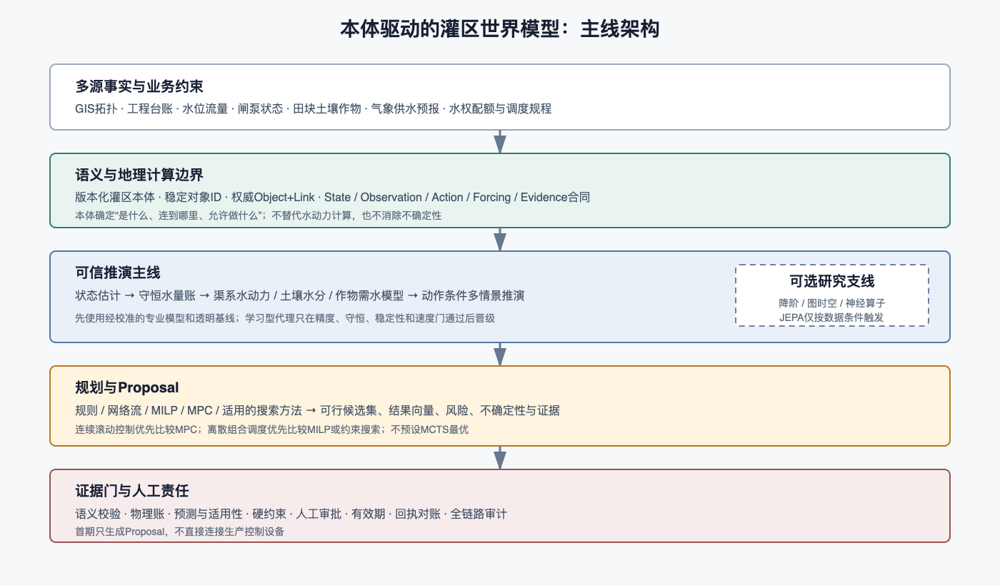
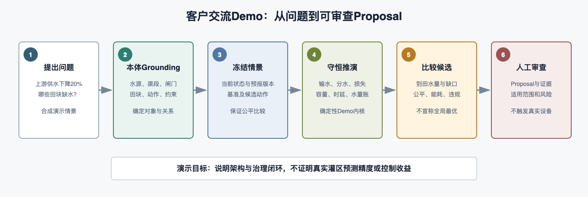

# 阅读说明

本材料用于与灌区管理、调度、信息化和科研团队讨论一期建设方向。内容按客户关心的顺序组织：先说明业务价值，再说明系统怎样工作、今天能展示什么、一期怎样落地，以及需要共同确认的前提条件。

文中将三类内容明确区分：

| 内容 | 含义 |
|---|---|
| 本次可展示 | 使用合成灌区数据的可点击原型，用于说明工作方式 |
| 一期可建设 | 需要接入真实数据、完成参数校准和专家确认后交付的系统能力 |
| 后续研究 | 需要独立数据和对照试验验证的学习模型或跨灌区能力 |

本方案不承诺当前已经具备真实灌区预测精度、全局最优调度、自动控制或跨灌区直接迁移能力。真实项目的可用范围，以数据质量、模型校准、独立验证和运行治理结果为准。

# 一、我们建议共同建设什么

## 1.1 一句话定位

建设一个面向灌区日常调度和方案论证的辅助系统：它把灌区对象、渠系关系、实时状态、外部预报、运行规则和候选动作放在同一个可追溯的语义框架中，在不直接控制设备的前提下，帮助调度人员比较“如果这样做，可能会怎样”。

这里的“世界模型”不是一个只给出单一预测值的黑盒模型，而是一组受对象关系、守恒关系、工程容量和管理规则约束的状态推演能力。系统输出的是带条件、带证据、可人工复核的候选方案。

## 1.2 优先解决的业务问题

一期建议先解决四类高频、可验证的问题：

1. **状态看不全**：部分渠段或田间状态缺测，调度人员难以判断当前水量和供水缺口。
2. **方案比较慢**：面对来水变化、设备限制或临时需求，需要反复手工比较多个配水方案。
3. **结果难追溯**：方案依据、使用的数据版本、约束条件和人工修改分散在不同记录中。
4. **经验难复用**：优秀调度经验难以沉淀为可查询的对象、规则和案例。

## 1.3 预期业务改善

一期不以“替代调度员”为目标，而以以下可验收改善为目标：

| 方向 | 一期希望达到的状态 |
|---|---|
| 看得清 | 能在统一渠系图上查看对象、关系、状态、数据质量和缺测情况 |
| 算得明 | 能在固定时间窗内比较基准方案和有限候选方案，并展示水量账与约束结果 |
| 审得过 | 每个候选方案都有版本、证据、不可行原因和人工审核记录 |
| 接得上 | 方案输出可与现有调度台账、报表或工单流程衔接；一期不直接下发设备控制 |

# 二、系统怎样工作



## 2.1 从问题到候选方案

客户提出“未来 24 小时来水下降时如何保障末端”这类问题后，系统按以下顺序处理：

1. **确定范围**：识别涉及的水源、渠段、闸门、分水口、田块和时间窗。
2. **核对语义**：确认对象的类型、上下游关系、供水关系、单位和版本。
3. **冻结输入**：记录当前状态、可用观测、预报、规则和允许动作。
4. **运行推演**：用守恒水量账、渠系时延、效率和专业模型或经过验证的代理模型比较候选方案。
5. **检查约束**：检查容量、最低保障、水权配额、时窗、权限和设备状态。
6. **生成 Proposal**：输出结果对比、风险、不可行原因和候选动作序列，提交有权人员审核。
7. **记录结果**：保存审核、修改、采纳、执行和事后观测，为下一次评估提供证据。

## 2.2 本体在系统中的作用

本体是系统的共同语言，不是水动力模型的替代品。它主要负责：

- 统一“渠段、闸门、分水口、田块、量测点”等对象名称和稳定标识；
- 表达对象之间的上游、下游、控制、供水和观测关系；
- 规定状态、动作、约束、单位、时间和空间范围；
- 让自然语言问题能够落到确定对象和已注册的计算功能；
- 让结果可以追溯到使用的对象版本、数据版本和规则版本。

水量如何传播、土壤水分如何变化、作物需要多少水，仍然由专业模型、状态估计和经过验证的计算内核负责。

## 2.3 学习模型的定位

一期建议先建立可解释的专业模型和守恒基线，再评估学习型模型是否能在相同任务上提供速度或精度增量。JEPA、图时空模型、降阶模型和神经算子都属于待验证候选，不作为一期已经实现或必然采用的技术承诺。

# 三、一期系统组成

## 3.1 灌区语义模型

一期建议建立一个经过专家确认的灌区应用 profile，复用已有空间对象、单位、时间、来源和证据治理能力。最小对象包括：

| 对象组 | 示例对象 | 主要用途 |
|---|---|---|
| 水源与渠系 | 水库、干渠、支渠、节点、分水口 | 表达输水网络和边界 |
| 控制与量测 | 闸门、泵站、流量计、水位站 | 表达动作、观测和设备状态 |
| 农业单元 | 田块、土壤剖面、作物、灌溉单元 | 表达需水和到田结果 |
| 管理对象 | 管理分区、用水户、水权配额、运行规则 | 表达治理约束 |
| 计算与治理 | 状态估计、预报、Proposal、Evidence | 表达结果来源和责任链 |

关键关系包括 `upstreamOf`、`downstreamOf`、`controlledBy`、`observedBy`、`supplies` 和 `deliversTo`。空间相交或名称相似不会自动被认定为水力连通，权威拓扑需要经过核验和发布。

## 3.2 状态与数据治理

系统需要同时保存三种信息：

- **事实状态**：最近观测到的流量、水位、闸位、土壤水分和作物阶段；
- **估计状态**：结合模型和多源观测得到的状态，以及估计不确定性；
- **情景状态**：在某个来水、天气或动作假设下的推演状态。

事实、估计和情景不能混写。每条数据至少带有时间、单位、来源、质量、空间范围和版本。历史回放只允许使用当时实际可获得的数据，不能把事后修订的天气或结果信息带入过去。

## 3.3 推演与规划

一期建议形成“专业模型 + 可解释规划”的工程主线：

- 渠系：根据数据条件选择一维水动力、运动波、扩散波或渠池模型；
- 田间：先以根区水量平衡和 FAO-56 等方法建立可校准基线；
- 规划：以现行规则、网络流、MILP 或 MPC 为主要候选；
- 代理模型：只有在独立验证显示稳定增益时，才用于加速或补充状态估计。

系统不把某一种算法预先称为“最优”。模型选择以可识别性、独立验证、守恒、稳定性、计算时间和适用范围共同决定。

## 3.4 Proposal 与人工审核

Proposal 至少包含：

- 问题、空间范围、时间范围和责任主体；
- 使用的本体、拓扑、状态、预报和规则版本；
- 候选动作序列、动作适用对象和有效期；
- 到田水量、缺口、尾端保障、公平性和容量结果；
- 不确定性、不可行原因和与现行规则的比较；
- 审核人、审核意见、修改记录和后续执行回执。

Proposal 是辅助决策材料，不是设备控制命令。是否采纳由有权人员决定；一期不接入无人值守自动控制。

# 四、今天可以展示什么



## 4.1 合成灌区场景

Demo 使用一个小型、可解释的合成网络：

```text
青源水库 R1
  -> 总干渠 C1
     -> 东支渠 C2 -> 东一分水口 D1 -> 田块 F1、F2
     -> 西支渠 C3 -> 西一分水口 D2 -> 田块 F3、F4
```

场景中包含水源边界、渠段容量、输水效率、传播时延、田块需水、分水比例和候选动作。所有数值均为演示参数，不代表任何特定灌区。

## 4.2 演示问题与操作

演示问题是：

> 如果未来 24 小时上游可供水量下降 20%，哪些田块可能出现供水缺口？将西支渠供水时段后移，并调整东、西支渠配水比例后，方案是否更可行？

现场可操作：

1. 调整上游供水下降比例和西支渠时段；
2. 查看 Baseline、Candidate A 和 Candidate B；
3. 点击水库、渠段、闸门和田块，查看 Object、Link、State、Action、Constraint、Evidence；
4. 点击“运行推演”，查看到田水量、缺口、尾端最低保障、公平 CV、容量违规和水量账残差；
5. 查看 Proposal 的动作序列、人工审核状态和“不执行设备动作”边界。

## 4.3 Demo 可以证明什么

Demo 可以证明：

- 对象、关系、状态、动作和证据可以在同一个界面中组织；
- 候选方案可以在显式假设和约束下进行确定性比较；
- 参数改变后需要重新运行，未确认参数不会被当成已生效结果；
- 水量账、容量约束和 Proposal 审查状态可以被展示。

Demo 不能证明真实灌区的预测准确率、动作因果收益、跨区域迁移、全局最优或生产控制安全性。

# 五、真实项目如何落地

## 5.1 阶段与交付物

| 阶段 | 重点工作 | 主要交付物 | 进入下一阶段的条件 |
|---|---|---|---|
| 0. 现场确认 | 明确业务问题、范围、角色、基线和指标 | 场景说明、对象清单、指标表 | 业务与技术边界冻结 |
| 1. 语义和数据底座 | 建立 profile、映射、权威拓扑和数据质量规则 | 本体包、拓扑包、数据质量报告 | 拓扑和关键字段通过核验 |
| 2. 数字影子 | 接入历史和准实时数据，展示状态和质量 | 状态看板、时间语义、回放能力 | 数据可用性和对账通过 |
| 3. 条件推演 | 校准渠系、田间和需水基线，比较有限候选 | 情景服务、回放报告、Proposal | 独立窗口达到约定指标 |
| 4. 影子调度 | 与现行调度并行，不影响生产，记录采纳和偏差 | 影子运行报告、人工评估 | 连续运行和安全审查通过 |
| 5. 受控试点 | 在明确授权和人工复核下扩大范围 | 试点评估、运行规程、后续路线 | 由客户联合评审决定 |

一期建议把“数字影子 + 条件推演”作为主要目标，避免在数据和规则尚未稳定时直接承诺自动优化或自动控制。

## 5.2 客户需要提供的数据

### 静态与工程数据

- 灌区边界、管理分区和供水边界；
- 渠系中心线、上下游方向、节点、分支、汇合和渠段属性；
- 闸门、泵站、分水口、量测点及其控制关系；
- 田块边界、供水关系、土壤、作物和灌溉制度；
- 容量、断面、坡度、糙率、渗漏和运行规程；
- 水权、配额、生态、安全和轮灌约束。

### 动态与业务日志

- 水位、流量、闸位、泵站工况和设备告警；
- 气象、降雨、遥感、土壤水分和作物阶段；
- 调度计划、人工调整、审批、指令、设备执行和实际过流；
- 缺测、校准、通信延迟、故障和人工接管记录；
- 方案采纳、修改、驳回、原因及事后结果。

数据接入前需共同确认数据权属、共享范围、脱敏要求、更新频率、保留期限和对外展示边界。

## 5.3 一期验收建议

验收不只看页面是否能打开，应至少覆盖：

1. 对象、拓扑、单位、时间和来源映射正确；
2. 缺测、重复、异常值和过期数据有明确状态；
3. 回放只使用当时可获得的数据；
4. 水量账残差、负存量、超容量和非法动作可被检测；
5. 与现行规则或人工基线进行同任务比较；
6. Proposal 可追溯、可驳回、可修改、可过期；
7. 真实执行与计划、批准和实际结果能够对账；
8. 任何自动化动作均有权限、人工确认和审计记录。

# 六、边界、风险与治理

## 6.1 当前不作的承诺

- 不把合成 Demo 当作真实灌区模型验收；
- 不把美国水库研究数据当作中国灌区证据；
- 不声称已经实现完整 Saint-Venant、Richards 和作物模型联合求解；
- 不声称 JEPA 或其他学习型模型已经带来实际调度收益；
- 不承诺毫秒级全局最优或无人工干预；
- 不在一期直接控制闸门、泵站或其他生产设备。

## 6.2 需要重点管理的风险

| 风险 | 可能后果 | 建议控制 |
|---|---|---|
| 拓扑或供水关系错误 | 推演结果方向错误 | 权威拓扑发布、人工核验、版本冻结 |
| 量测缺失或时间错位 | 状态估计偏差 | 质量标记、可用时间合同、缺测回放 |
| 参数不可识别 | 模型看似精确但不可迁移 | 独立验证、参数范围和失败保留 |
| 规则不完整 | 候选方案无法执行 | 先收集现行规程和例外处理 |
| 学习代理失效 | 极端情况下误导比较 | 与专业基线对照、适用域门禁、人工复核 |
| 自动化越权 | 产生实际运行风险 | Proposal 与 Action 分离、权限和审批隔离 |

# 七、建议今天共同确认的问题

1. 首期最有价值的调度问题，是短期供水缺口、轮灌调整、设备故障应对，还是其他场景？
2. 可以提供哪些渠系、量测、田块、作物和调度日志？时间跨度和质量如何？
3. 哪些对象和关系有权威来源，哪些仍需现场核验？
4. 调度人员目前如何判断方案可行，使用哪些指标和经验规则？
5. 哪些结果可以作为辅助建议，哪些结果必须由特定角色审批？
6. 是否可以先进行不影响生产的历史回放和影子运行？
7. 对数据共享、脱敏、部署位置、审计留存和后续试点有哪些约束？

# 八、术语简释

| 术语 | 本方案中的含义 |
|---|---|
| 本体 | 统一对象、关系、状态、动作、约束和证据含义的语义模型 |
| 状态估计 | 根据观测、历史动作和过程模型估计当前不可直接观测的状态 |
| 条件推演 | 在给定初始状态、外生情景和动作假设下比较未来可能结果 |
| 守恒水量账 | 对入流、出流、分水、损失、存量和未分配水量进行可核对的记账 |
| Proposal | 带证据、约束、适用范围和审核状态的候选方案 |
| 影子运行 | 与现行流程并行评估，不改变生产系统和设备动作 |
| JEPA | 一类潜在表示预测架构；是否适合灌区需通过独立实验验证 |
