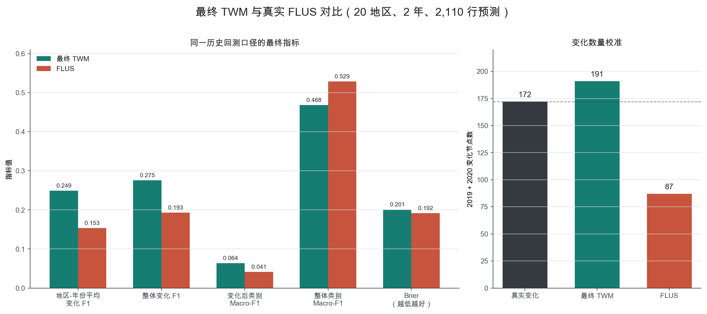
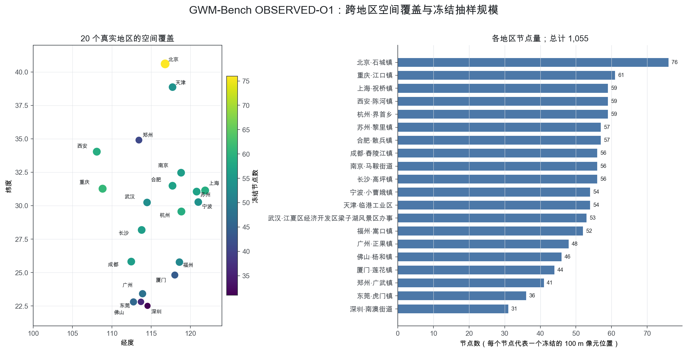
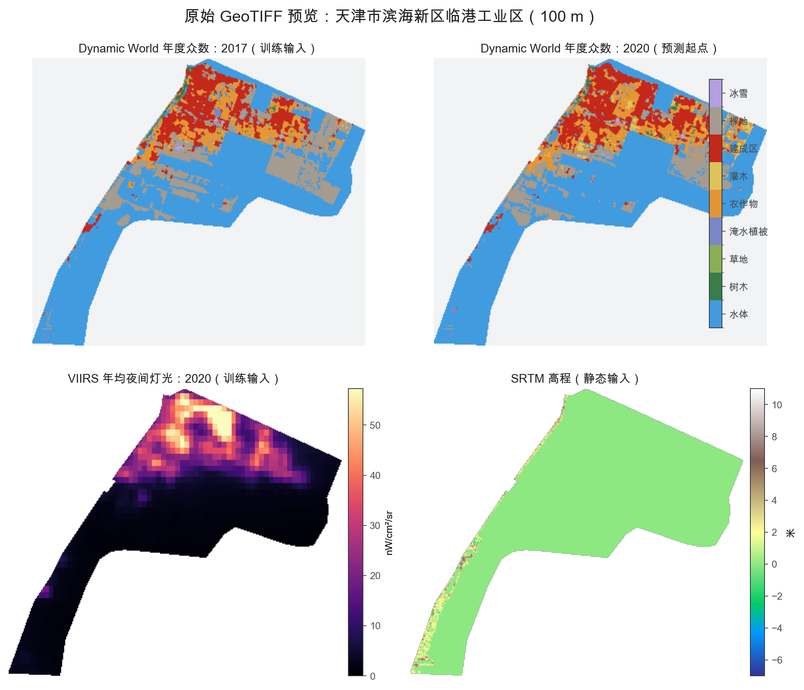
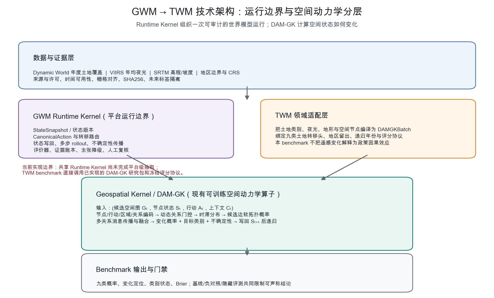
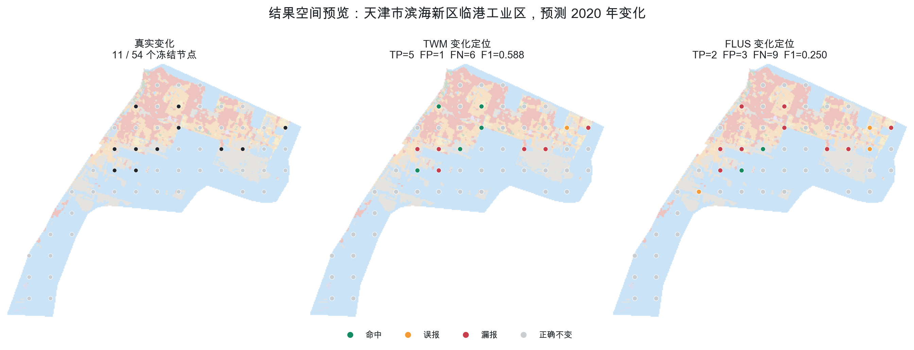

# GWM Benchmark 数据、技术架构与最终 TWM–FLUS 对比说明

日期：2026-07-23

对象：`GWM-Bench Foundation v0.1.1`

文档口径：只展示当前最终 TWM 与真实 FLUS 的结果，不展开中间模型版本

## 1. 结论先行

GWM-Bench Foundation 的内部数据集已经可以使用。20 个真实地区的原始栅格、冻结节点、
空间图、训练表、标签表、基线、评分器、防泄漏检查和数据许可均已通过审计。当前唯一未
完成的是完整 2026 日历年隐藏标签；它最早只能在 `2027-01-01` 之后形成，因此公开
Foundation 仍未最终放行，但这不是数据下载或水库资料造成的工程阻塞。

在已经完成的同口径历史回测中，最终 TWM 的核心指标为 `0.249212`，真实 FLUS 为
`0.153434`。TWM 绝对高 `0.095777`，相对高 `62.4%`。这说明最终 TWM 在当前测试的
核心任务——“在哪些位置发生了土地类别变化”——上优于 FLUS。与此同时，FLUS 的整体
类别 Macro-F1 和 Brier 略好，因此准确表述是：**TWM 赢得变化检测主任务，但不是所有
指标全面优于 FLUS。**



图 1　最终 TWM 与真实 FLUS 在 20 个地区、2019/2020 两个目标年份、2,110 行预测上的
同口径结果。左图是质量指标，右图是变化数量校准。

## 2. Benchmark 到底测什么

Benchmark 不试图用一个数据集证明“通用 GWM 已经成立”。它把问题拆成两个可证伪的
轨道：

| 轨道 | 数据 | 要回答的问题 | 不能据此声称什么 |
| --- | --- | --- | --- |
| `CONTROLLED-M1` | 固定随机种子生成的机制真值合成图 | 模型是否真正使用行动、关系类型、方向、时滞和拓扑，而不是只记住状态相关性 | 真实政策效果、真实地区泛化 |
| `OBSERVED-O1` | 20 个真实地区的遥感土地状态、夜光和地形 | 只用预测起点以前的信息，能否在未见地区预测后续土地状态和变化 | 真实行动因果效应、地块级真值、通用 GWM 有效性 |

设计遵循五条底线：模型成绩不能决定数据集是否有效；评分只使用客观参考标签；禁止用
LLM 打分；禁止使用未来输入或未来标签拟合；失败结果必须保留。

## 3. 数据详细信息

### 3.1 真实地区与空间规模

`OBSERVED-O1` 覆盖 20 个乡镇或街道级地区，行政面积合计约 `4,603.1302 km²`。地区
分布从北京、西安、成都到长三角、珠三角和东南沿海。原始遥感栅格分辨率为 100 米，
每个有效像元约 1 公顷。

为了使图模型训练与严格复核可控，节点从原始栅格的固定起点开始，每隔 24 个像元取一
个位置。也就是说，**原始数据仍是完整 100 米栅格，进入图模型的冻结节点间隔为
2,400 米**。20 个地区共有 1,055 个唯一节点，单地区 31–76 个节点。



图 2　左侧按经纬度展示 20 个地区的近似中心位置；右侧是每个地区进入评分的冻结节点
数量。位置图用于说明覆盖范围，不代替行政区边界地图。

20 个地区为：上海祝桥、东莞虎门、佛山杨和、北京石城、南京马鞍、厦门莲花、合肥
散兵、天津临港工业区、宁波小曹娥、广州正果、成都舂陵江、杭州界首、武汉江夏梁子湖
风景区、深圳南澳、福州嵩口、苏州黎里、西安陈河、郑州广武、重庆江口和长沙高坪。

### 3.2 原始数据源与年份

| 数据源 | 年份 | 在 benchmark 中的角色 | 核心字段/单位 |
| --- | --- | --- | --- |
| Google Dynamic World | 2017–2020 | 土地状态输入 | 年度众数类别，0–8 |
| Google Dynamic World | 2021–2023 | Foundation 真实轨标签 | 年度众数类别，0–8；禁止作为输入 |
| NOAA/VIIRS 月产品年度聚合 | 2016–2020 | 年度夜光输入 | 平均辐亮度，`nW/cm²/sr` |
| VIIRS | 2021–2023 | 本地盘点但隔离 | 不允许进入模型输入或特征统计 |
| SRTMGL1.003 | 静态 | 高程与派生坡度输入 | 米、坡度 |

九类 Dynamic World 编码为：`0 水体`、`1 树木`、`2 草地`、`3 淹水植被`、
`4 农作物`、`5 灌木`、`6 建成区`、`7 裸地`、`8 冰雪`。

当前冻结盘点共 340 个 GeoTIFF：每个地区 7 个土地类别年份、8 个年度 VIIRS 栅格和
2 个地形栅格。其中文件角色如下：

| 盘点类别 | 文件数 | 字节数 | 是否进入正式数据链 |
| --- | ---: | ---: | --- |
| Dynamic World 2017–2023 | 140 | 包含在下列 required 总数中 | 2017–2020 输入，2021–2023 标签 |
| VIIRS 2016–2020 + SRTM 高程/坡度 | 140 | 包含在下列 required 总数中 | 输入 |
| 正式所需资产合计 | **280** | **4,086,299** | 是 |
| VIIRS 2021–2023 | **60** | **556,965** | 否，隔离盘点 |
| 审计盘点合计 | **340** | **4,643,264** | 角色逐文件冻结 |

源目录还可能存在后续研究导出的 2024/2025 栅格或旧的全期夜光均值文件；它们不属于
上述 340 个 Foundation 冻结资产，也不能因为“文件在硬盘上”就自动进入模型。

许可审计结论为：Dynamic World 衍生物按 CC BY 4.0 保留署名和变更说明；VIIRS 来源
可无使用限制但保留来源说明；SRTM 公开共享且需保留 NASA/JPL 引用和衍生说明。

### 3.3 时间边界与防泄漏

Foundation 的正式观测轨以 2020 为预测起点：

```text
土地状态输入：2017, 2018, 2019, 2020
夜光输入：    2016, 2017, 2018, 2019, 2020
静态输入：    SRTM elevation + slope
预测标签：    2021, 2022, 2023
推演方式：    从 2020 开始开环递归，不写回真实后续状态
```

明确禁止以下信息进入拟合：Dynamic World 2021–2023、VIIRS 2021–2023、2017–2023
全期夜光均值、由目标标签计算的变化特征、验证/测试标签的梯度拟合。

节点选择本身也只能看 2020 及以前的输入。未来标签是否缺失不能改变节点成员；若一个
冻结节点缺少目标标签，物化过程直接失败，而不是悄悄删掉难样本。

### 3.4 地区切分与空间图

数据采用五折地区留出。每一折固定为 12 个训练地区、4 个验证地区和 4 个测试地区，
三组互不重叠。每个地区恰好一次作为测试地区、一次作为验证地区，其余三次用于训练。

空间图不是全连接图。只有固定采样格网上相差一个采样步长的上下左右节点才连边：

- 有向四邻接；
- 距离固定为 2,400 米；
- 不允许自环；
- 每条边必须存在反向边；
- 20 个地区合计 3,338 条有向边。

这张图只表示 benchmark 中准入的空间传播通道，不表示真实道路、河网或政策作用关系。

### 3.5 物化数据表

冻结开发数据包大小为 475,428 字节，主要资源如下：

| 文件 | 行数 | 内容 |
| --- | ---: | --- |
| `controlled_nodes.parquet` | 2,048 | 128 个 4×4 合成图的节点状态、行动和上下文 |
| `controlled_edges.parquet` | 9,216 | 合成候选边、关系类型和边特征 |
| `controlled_node_labels.parquet` | 6,144 | 三个时距的节点状态变化真值 |
| `controlled_edge_labels.parquet` | 9,216 | 行动门控、拓扑概率和时滞真值 |
| `observed_train.parquet` | 12,660 | 各折训练地区 2017–2020 年度长表 |
| `observed_inputs.parquet` | 2,110 | 验证/测试节点的预测起点输入；1,055 test + 1,055 validation |
| `observed_edges.parquet` | 3,338 | 地区内部有向四邻接边 |
| `observed_labels.parquet` | 6,330 | 验证/测试节点的 2021–2023 标签 |
| `region_folds.json` | 5 折 | 训练、验证、测试地区身份 |

合成轨共有 128 个样本，固定为 96 个训练样本和 32 个开发评分样本；每个样本 16 个
节点，固定种子为 17，开发样本使用 10,000 的种子偏移。

### 3.6 原始 GeoTIFF 预览



图 3　天津临港工业区的实际 GeoTIFF。上排为土地类别输入，下排为夜光和高程输入。灰白
区域是行政范围外或 nodata，不是“未分类土地”。

该地区的图示文件元数据如下：

| 文件 | 网格 | CRS / 类型 | 有效像元 | 值域 |
| --- | --- | --- | ---: | --- |
| `dynamic_world_2017_100m.tif` | 330×285 | EPSG:3857 / int16 | 33,215 | 0–8 |
| `dynamic_world_2020_100m.tif` | 330×285 | EPSG:3857 / int16 | 33,215 | 0–8 |
| `viirs_nightlight_2020_100m.tif` | 330×285 | EPSG:3857 / float32 | 33,215 | 0.9567–103.5325 |
| `srtm_elevation_100m.tif` | 330×285 | EPSG:3857 / float32 | 33,215 | -7–11 m |

所有冻结栅格统一使用 nodata `-32768`，审计要求同一地区的宽、高、CRS 和仿射变换完全
一致。

进入 `observed_inputs.parquet` 后，原始栅格被编译为可训练节点记录。以下是真实数据行
的简化预览：

| node_id | row/col | 高程 | 坡度 | 土地类别 2017→2020 | 夜光 2016→2020 |
| --- | --- | ---: | ---: | --- | ---: |
| `r00024_c00168` | 24/168 | 0 m | 0.0 | 6→6→6→6（建成区） | 37.43→47.88 |
| `r00024_c00192` | 24/192 | 0 m | 0.0 | 6→6→6→6（建成区） | 44.84→35.09 |
| `r00024_c00216` | 24/216 | 0 m | 0.0 | 0→0→0→0（水体） | 87.74→79.41 |
| `r00048_c00144` | 48/144 | 0 m | 0.0 | 7→6→7→4（裸地/建成区/农作物） | 39.42→30.32 |

### 3.7 数据验证结果

独立验证器没有只检查“文件存在”，而是重新从原始栅格和合成生成器逐值复核：

- 280 个正式来源文件 SHA256 全部一致；
- 128 个合成样本全部由冻结种子重建；
- 节点选择由 2020 以前输入重新计算；
- 观测输入、训练值、标签、坐标、节点编号和空间边全部与原始文件一致；
- 总计 271,698 次数值比较；
- 13/13 项检查通过，错误为 0。

这证明数据包忠实于冻结来源，但不自动证明模型好、存在真实政策因果效应或通用 GWM
有效。

## 4. 作为 TWM 底层的 GWM 技术架构

### 4.1 三个对象不能混为一谈

| 对象 | 职责 | 当前状态 |
| --- | --- | --- |
| GWM Runtime Kernel | 管理状态版本、动作和转移契约、转移路由、状态写回、多步推演、不确定性、评价、证据账本和审计 | 架构边界已定义，但共享平台模块尚未完成统一抽取 |
| Geospatial Kernel / DAM-GK | 在准入空间图上计算关系门控、传播、时滞、软拓扑、状态变化和不确定性 | 核心研究实现已存在并被 TWM 直接调用 |
| TWM | 把国土/土地领域的数据、类别、空间图、预测任务和评分协议绑定到 GWM/DAM-GK | 本 benchmark 中已形成可执行领域实例 |

一句话：**Runtime Kernel 决定世界模型怎样可靠运行，DAM-GK 决定空间状态怎样变化，
TWM 决定土地系统的数据和任务怎样接入。**



图 4　GWM、TWM 与 DAM-GK 的实际职责边界。需要特别注意：共享 Runtime Kernel 尚未
成为一个完整的平台级独立包，当前 benchmark 通过数据合同、运行脚本、状态写回逻辑、
评分器和证据门实现了其中与本实验直接相关的责任。

### 4.2 GWM Runtime Kernel

目标 Runtime 方程可以写为：

```text
S(t+1) = WriteBack(S(t), Route(S(t), A(t), C(t), G(t)))
```

其中 `S` 是版本化地理状态，`A` 是行动，`C` 是上下文，`G` 是空间关系图。`Route`
不是固定指向一个神经网络，而是按变量和证据等级选择 GIS 确定性计算、规则、专业机理
模型、DAM-GK 可学习转移或 Unknown Gate。Runtime 负责把一次推演组织成：

1. 读取可追溯的状态快照和动作合同；
2. 按变量选择合法转移来源；
3. 调用 DAM-GK 或其他算子计算状态增量与不确定性；
4. 将结果写回下一时刻状态；
5. 重新计算受状态影响的关系、规则命中和可行动作；
6. 递归到下一步，同时传播误差和证据边界；
7. 由评价器、规划器、证据门和人工复核消费结果。

当前仓库中，Runtime 的这些责任分布在 TWM 服务、适配器、benchmark 协议和评分器中；
尚不能声称已经形成跨 TWM/UWM/AWM 统一复用的完整 Runtime Kernel 产品。

### 4.3 Geospatial Kernel / DAM-GK

DAM-GK 全称为 Dynamic Action-conditioned Multi-scale Geospatial Kernel。形式上：

```text
Kθ(Gt, St, At, Ct) → (状态传播 Φ、软拓扑变化 ΔG、未来状态与不确定性 U)
```

核心前向过程为：

1. 编码节点状态、外部上下文、行动、地区背景和关系类型；
2. 对候选边构造“源节点—目标节点—行动—关系—地区—边特征”联合表示；
3. 计算动态关系门控 `gᵢⱼ`；
4. 计算候选边软拓扑有效概率 `pᵢⱼ`；
5. 计算影响在多个预测时距上的时滞分布 `τᵢⱼ`；
6. 用 `gᵢⱼ × pᵢⱼ × τᵢⱼ` 加权消息，并按目标节点聚合；
7. 可选地按关系通道分别聚合再融合；
8. 输出状态变化均值、异方差尺度、变化概率和目标状态；
9. 把预测状态写回，再基于新状态计算下一步。

在土地类别任务中，TWM 转移头把 DAM-GK 的状态转移表示分成两个问题：先判断是否发生
变化，再预测变化后的九类目标状态。最终概率是“保持当前状态概率”与“目标类别概率”
的混合，而不是简单输出一个九分类 softmax。

DAM-GK 支持行动条件，但 `OBSERVED-O1` 没有可识别的真实土地行动数据，因此本轨道只
检验土地状态预测，不能声称模型已经学到政策行动效果。行动、关系、时滞和拓扑机制由
`CONTROLLED-M1` 的机制真值和负对照单独约束。

### 4.4 TWM 适配层

TWM 适配层完成四件具体工作：

- 把九类 Dynamic World、VIIRS、地形和地区上下文编译为 `DAMGKBatch`；
- 把冻结节点与有向四邻接图编译为模型张量；
- 绑定土地变化头、递归写回、训练/验证/测试地区身份；
- 把输出转换为严格的九类概率提交，交给独立评分器。

现有 DAM-GK 研究包的物理路径为 `data_agent/uwm/dam_geospatial_kernel/`，其中包含
TWM、UWM 和 HydroControl 适配器。目录位置不改变其“共享 Geospatial Kernel 研究包”
的职责。

## 5. 最终 TWM 与 FLUS 如何公平比较

### 5.1 为什么使用历史回测

正式 Foundation 预测 2021–2023，但这些年份在当前研发阶段已经被查看过，不能再伪装
成全新隐藏测试。为立即比较 TWM 与 FLUS，历史回测把时间向前移动：

```text
实验 A：只使用截至 2018 的信息，预测 2019
实验 B：只使用截至 2019 的信息，预测 2020
```

两个模型使用同一组 20 地区、同一五折 12/4/4 地区切分、同一 1,055 个冻结评分节点
和同一目标标签。最终提交均为九类概率，合计 2,110 行。

### 5.2 最终 TWM 设置

本文“最终 TWM”指当前历史回测中确定的联合集成方案，不展示中间版本。它使用：

- DAM-GK 空间动力学与土地转移头；
- 随机种子 31、47、73；
- 2 个目标年份 × 5 折 × 3 种子，共 30 份保存模型；
- 先平均三个成员的原始变化和目标类别分数；
- 只用相应预测时点以前的 4 个验证地区选择变化偏移和数量上限；
- 验证预测变化数量约束为验证真实变化量的 0.75–1.25 倍；
- 提交先保存并计算 SHA256，评分器核验后才读取目标标签。

最终预测文件为 2,110×13：4 个键列加 9 个类别概率列，SHA256 为
`8b40d99e2192c9f9f976c79e121a6ae660ec1c6446771f278b542878aabe4364`。

### 5.3 FLUS 设置

比较使用的不是自写邻接规则，而是直接调用：

```text
/Users/zhouning/FLUS_console_crossplatform/build/cmake-release/flus_console
```

FLUS 在每个测试地区的完整 100 米有效栅格上运行 ANN 适宜性和元胞分配，土地需求从
训练地区历史转移估计，不读取测试地区目标年份类别。主要设置为：

- 随机种子 31、47、73；
- ANN 训练抽样为每千像元 10 个；
- 每次元胞分配最多 500 次迭代；
- 30 次 ANN 训练、120 次地区完整栅格模拟；
- 三个硬类别成员转换为九类概率后做算术平均；
- 完整栅格模拟结束后，再回到同一 1,055 个冻结节点评分。

FLUS 集成预测为 2,110×13，SHA256 为
`44b5865c90ddabd7ce4d3e61e1b5ec8d0908b5701a4297c146c7efeba141d57a`。
评分链复核了 FLUS 二进制、320 项输入谱系、30 张 ANN 适宜性栅格和 120 张模拟结果，
从结果栅格重建集成预测的最大误差为 0。

这是一条可审计的真实 FLUS 外部核心基线，但不是某篇 FLUS 论文的官方最佳参数复现。

## 6. 结果数据预览



图 5　天津临港工业区 2020 年结果空间预览。淡色背景是完整 100 米 2020 土地类别栅格；
圆点是 54 个冻结评分节点。该年真实变化 11 个，TWM 命中 5、误报 1、漏报 6，变化 F1
为 0.588；FLUS 命中 2、误报 3、漏报 9，变化 F1 为 0.250。

以下是图中实际结果行的简化预览。`TP/FP/FN/TN` 只表示“是否正确判断发生变化”，目标
类别是否正确由类别 Macro-F1 另行衡量。

| node_id | 真实 2019→2020 | TWM 2020 / 变化判定 | FLUS 2020 / 变化判定 |
| --- | --- | --- | --- |
| `r00048_c00144` | 裸地(7)→农作物(4) | 建成区(6) / TP | 裸地(7) / FN |
| `r00120_c00144` | 裸地(7)→水体(0) | 裸地(7) / FN | 水体(0) / TP |
| `r00072_c00288` | 裸地(7)→裸地(7) | 农作物(4) / FP | 水体(0) / FP |
| `r00096_c00288` | 裸地(7)→裸地(7) | 裸地(7) / TN | 水体(0) / FP |
| `r00096_c00120` | 建成区(6)→裸地(7) | 建成区(6) / FN | 建成区(6) / FN |
| `r00096_c00240` | 水体(0)→裸地(7) | 水体(0) / FN | 水体(0) / FN |

这个地区用于展示结果文件怎样落到空间上，不用于替代全体 20 地区的总体结论。

## 7. 最终指标对比与解释

| 指标 | 最终 TWM | FLUS | TWM−FLUS | 判断 |
| --- | ---: | ---: | ---: | --- |
| 40 个地区-年份平均变化 F1（主指标） | **0.249212** | 0.153434 | **+0.095777** | TWM 高 62.4% |
| 整体变化 F1 | **0.275482** | 0.193050 | **+0.082432** | TWM 更能定位变化 |
| 变化后类别 Macro-F1 | **0.063668** | 0.041161 | **+0.022507** | TWM 较高，但两者都很弱 |
| 整体类别 Macro-F1 | 0.468160 | **0.528594** | -0.060434 | FLUS 更好 |
| Brier，越低越好 | 0.200842 | **0.191680** | +0.009162 | FLUS 略好 |
| 预测变化 / 真实变化 | 191 / 172 | 87 / 172 | — | TWM 数量更接近真实 |

按地区成组做 20,000 次配对 bootstrap：TWM 相对 FLUS 的主指标差值 95% 区间为
`[0.001397, 0.180421]`，差值高于 0 的比例为 `97.67%`；20 个地区里 TWM 赢 14、
平 1、输 5。

因此本次历史 benchmark 的最终结果是：

> **最终 TWM 在核心变化检测指标上胜过真实 FLUS，优势为 0.095777，约 62.4%；但
> FLUS 的整体类别识别和概率质量略好，不能把结果写成 TWM 所有方面全面胜出。**

还必须保留一个科学限制：最终 TWM 的联合校准是在历史测试结果已经存在后开发的，属于
事后开发证据。bootstrap 区间虽然高于 0，也不能替代全新前瞻盲测。当前已经封存的
2026 前瞻候选和评分规则不能根据本文结果再修改；完整 2026 标签到期后才会提供无偏的
时间外推验收。

## 8. 当前完成状态

| 项目 | 状态 |
| --- | --- |
| Foundation 原始数据、物化表和空间图 | 已通过 |
| 时间边界和防泄漏 | 已通过 |
| 独立逐值数据验证 | 已通过 |
| 评分器、基线、负对照 | 已通过 |
| 数据许可 | 已通过 |
| 2026 候选、预测、基线和评分规则封存 | 已通过 |
| 完整 2026 日历年标签 | 等待；最早 2027-01-01 |
| 公开 Foundation 最终放行 | 尚未放行 |
| 通用 GWM 已被证明 | 否 |

当前不需要为了 Foundation 继续下载 NWM 水文档案或等待水库机构资料。HydroControl 是
独立、非阻塞的研究扩展，不能改变本说明中的土地状态 benchmark 结论。

## 9. 文件与复现入口

关键数据与结果：

- `benchmarks/gwm_bench_foundation_v0_1/benchmark_contract.json`
- `benchmarks/gwm_bench_foundation_v0_1/readiness_report.json`
- `benchmarks/gwm_bench_foundation_v0_1/development/bundle_manifest.json`
- `benchmarks/gwm_bench_foundation_v0_1/development/data_validation_report.json`
- `benchmarks/gwm_bench_foundation_v0_1/development/twm_v3_historical_backtest/evaluation.json`
- `benchmarks/gwm_bench_foundation_v0_1/development/flus_full_grid_historical_backtest_ensemble/evaluation.json`

架构实现与说明：

- `data_agent/uwm/dam_geospatial_kernel/model.py`
- `data_agent/uwm/dam_geospatial_kernel/contracts.py`
- `data_agent/uwm/dam_geospatial_kernel/twm_adapter.py`
- `data_agent/uwm/dam_geospatial_kernel/twm_transition_head.py`
- `docs/research/GWM_RUNTIME_KERNEL_AND_GEOSPATIAL_KERNEL_RELATIONSHIP.md`

本文图表可重新生成：

```bash
.venv/bin/python scripts/generate_gwm_benchmark_report_assets.py
```

图表来源数字保存在：

```text
docs/research/assets/gwm_benchmark_data_architecture_comparison_2026-07-23/figure_data.json
```

该 JSON 记录了原始清单、输入表、TWM 预测、FLUS 预测、评价报告路径，以及所有图中使用
的关键数字。
