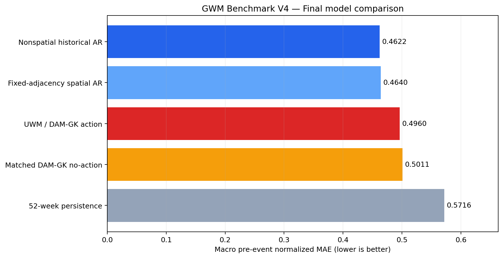
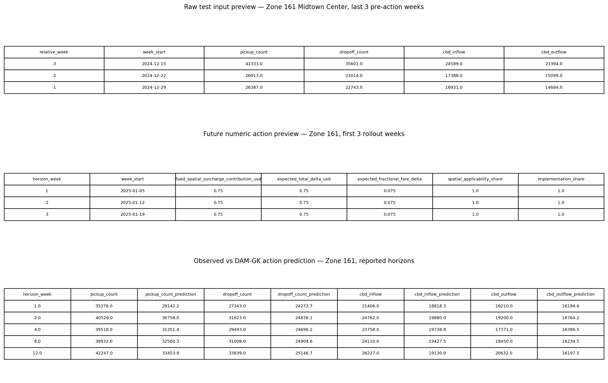
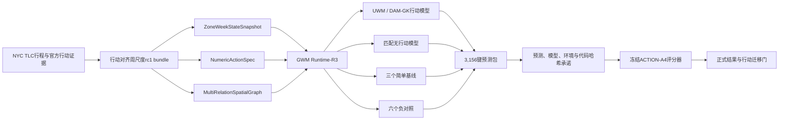
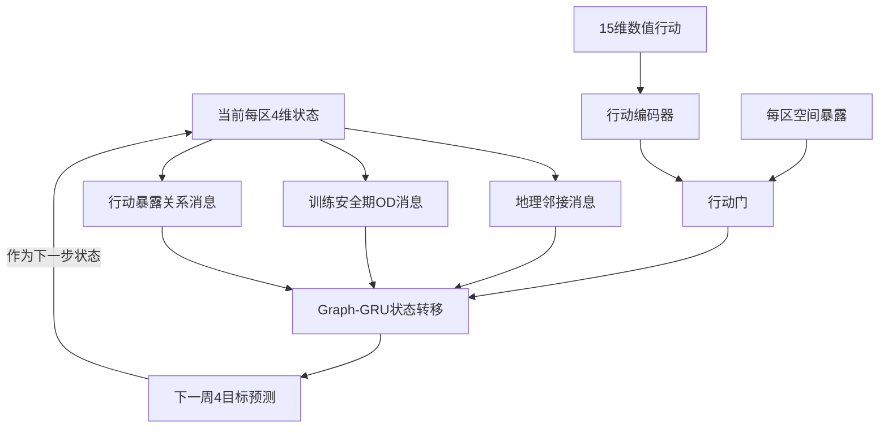
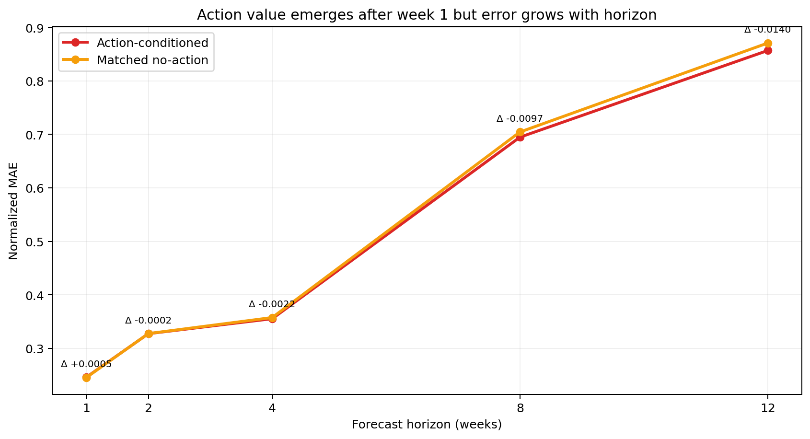
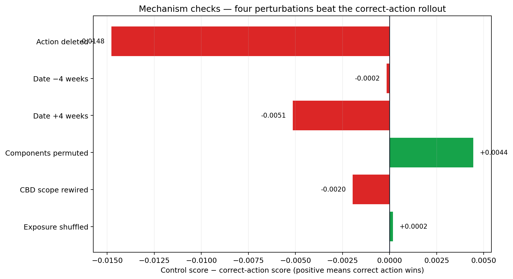
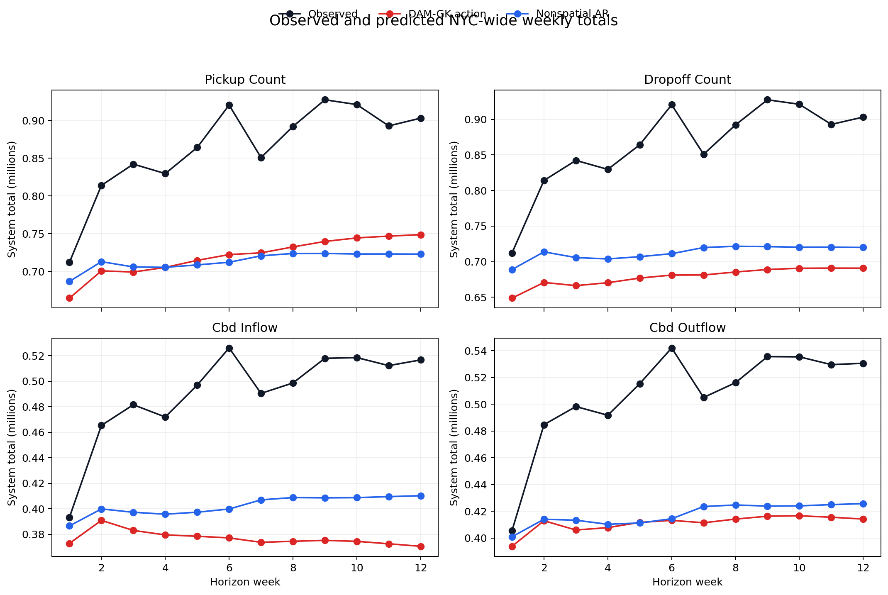

# GWM Benchmark V4.0最终验收报告

日期：2026-07-23

场景：纽约出租车在真实收费行动下的12周空间状态预测

正式状态：`BENCHMARK_COMPLETED / ACTION_TRANSFER_NOT_SUPPORTED`

## 1. 先说结论

GWM Benchmark V4.0已经做完，可以作为一个可复现、可审计、可以公开失败结果的benchmark数据集。

“数据集和考试流程是否OK”的答案是：**OK**。数据、切分、预测承诺、35项重放、评分和审计链均已完成。

“当前UWM / DAM-GK行动模型是否通过考试”的答案是：**没有通过**。它比同结构无行动模型好约
1.02%，而且配对bootstrap区间完全小于0；但它落后于两个简单自回归基线，并且正确CBD范围被重连后
反而略好。因此不能声称模型已经可靠学会了可迁移的行动语义。

这两个结论不矛盾：**benchmark完成了，模型主张失败了。** 一个只能在模型获胜时才算完成的benchmark，
本身就不是可信的benchmark。

## 2. V4到底考什么

V4只考一个问题：

> 模型从2019和2022两次真实纽约出租车收费变化中学习后，在完全不使用2025行动后数据训练、调参、
> 归一化或构图的前提下，能否预测2025年1月5日拥堵收费开始后263个Taxi Zone连续12周的运行状态？

这里的“行动迁移”是预测概念，不是政策因果结论。V4不回答“拥堵收费造成了多少变化”，也不声称
研究人员从未看过2025数据。它只保证模型进程在预测承诺前没有读取2025行动后目标。

训练行动与测试行动如下：

| 事件 | 生效日 | benchmark角色 | 主要行动含义 |
| --- | --- | --- | --- |
| NYS congestion surcharge | 2019-02-02 | 训练与选择 | 曼哈顿适用的2.50美元黄牌出租车附加费 |
| TLC taximeter adjustment | 2022-12-19 | 训练与选择 | 起步价、计价单位及多项附加费调整 |
| MTA Congestion Relief Zone | 2025-01-05 | 模型未见测试行动 | CBD适用的每次0.75美元出租车费用 |

## 3. 数据详细信息

### 3.1 数据来源

| 数据 | 发布者 | 在V4中的用途 |
| --- | --- | --- |
| Yellow Taxi月度Parquet | NYC TLC | pickup、dropoff、OD和费用状态 |
| Taxi Zone边界与lookup | NYC TLC | 263个空间单元、名称和地理邻接 |
| CBD Taxi Zone polygons | MTA / NY State Open Data | 2025行动的空间暴露范围 |
| 2019政策材料 | NY State Taxation and Finance | 行动金额、生效日和适用范围 |
| 2022 adopted rule | NYC TLC / City Record | 计价组件变化及生效日 |
| 2025 CRZ toll schedule | MTA | 0.75美元、生效日和适用规则 |

底层原始TLC数据包括72个月度文件、349,782,159条行程记录，本机占用约5.41 GB。正式rc1并不复制
全部原始行程，而是发布经过哈希追踪的周尺度模型数据包；当前完整V4目录约5.7 MB，适合进入Git仓库。

### 3.2 空间、时间和预测目标

| 项目 | 固定定义 |
| --- | --- |
| 城市 | New York City |
| 空间单元 | 263个NYC TLC Taxi Zone |
| 时间单元 | 从行动生效日对齐的完整7天块 |
| 每个事件输入 | 行动前52周 |
| 每个事件输出 | 行动后12周 |
| 目标1 | 每区每周`pickup_count` |
| 目标2 | 每区每周`dropoff_count` |
| 目标3 | 每区每周`cbd_inflow` |
| 目标4 | 每区每周`cbd_outflow` |

时间窗口固定为：

| 事件 | 行动前52周 | 行动后12周 |
| --- | --- | --- |
| 2019 | 2018-02-03至2019-02-01 | 2019-02-02至2019-04-26 |
| 2022 | 2021-12-20至2022-12-18 | 2022-12-19至2023-03-12 |
| 2025 | 2024-01-07至2025-01-04 | 2025-01-05至2025-03-29 |

### 3.3 rc1数据包数量

| 文件层 | 行数 | 说明 |
| --- | ---: | --- |
| `development/weekly_state_action.parquet` | 33,664 | 2019、2022两个训练事件 |
| `test_input/weekly_state_history.parquet` | 13,676 | 2025行动前52周状态 |
| `test_input/future_action_spec.parquet` | 3,156 | 263区 × 12周数值行动 |
| `test_targets/weekly_targets.parquet` | 3,156 | 独立目录中的正式答案 |
| `graph/zone_metadata.parquet` | 263 | 区域、borough和CBD暴露 |
| `graph/spatial_edges.parquet` | 3,009 | 三类空间关系 |

需要预测的键是263区 × 12周 = 3,156行；每行4个目标，共12,624个预测标量。

### 3.4 行动输入

模型不能读取政策名称、事件ID或年份，只能读取15维数值行动含义，包括固定空间附加费、起步价、
improvement surcharge、计价单位、高峰和夜间附加费、机场费用、期望总金额变化、相对票价变化、
空间适用比例、时间适用比例和实施比例。

Zone 161（Midtown Center）的原始输入、未来行动和结果样例如下。图中上部是行动前真实周状态，中部是
0.75美元数值行动，下部是正式目标与DAM-GK预测；相应CSV也随报告保存。

预览文件：

- [Zone 161历史输入CSV](assets/gwm_benchmark_v4_final_2026-07-23/zone161_history_preview.csv)
- [Zone 161行动输入CSV](assets/gwm_benchmark_v4_final_2026-07-23/zone161_action_preview.csv)
- [Zone 161目标与预测CSV](assets/gwm_benchmark_v4_final_2026-07-23/zone161_result_preview.csv)

## 4. GWM、Runtime Kernel与DAM-GK架构

### 4.1 总体架构

### 4.2 GWM Runtime Kernel：Runtime-R3

Runtime-R3是模型无关的执行内核。它不决定用Graph-GRU还是线性回归，而是保证所有模型参加同一场考试：

- `ZoneWeekStateSnapshot`：263区、52周、4个状态目标；
- `NumericActionSpec`：15维行动向量、12周实施轨迹和空间暴露；
- `MultiRelationSpatialGraph`：地理邻接、OD流、行动暴露；
- `OpenLoopRolloutRequest`：从2025-01-04状态出发连续递推12步；
- `MultiTargetPredictionBundle`：统一3,156个键和4个预测列；
- `RuntimeAuditReceipt`：训练行、代码、环境、模型、种子、耗时、失败和预测哈希。

Runtime-R3禁止模型进程读取`test_targets`，也禁止每预测一周后把真实2025状态写回。随机模型固定使用
31、47、73三个种子，最后在原始数量空间求算术平均。

### 4.3 Geospatial Kernel：DAM-GK

V4核心算法是`action-modulated multi-relation Graph-GRU`：

三类图边为：

| 关系 | 边数 | 作用 |
| --- | ---: | --- |
| Geographic adjacency | 692 | 相邻Taxi Zone之间传递局部状态 |
| Origin-destination flow | 2,054 | 沿训练安全期主要流向传递需求信息 |
| Action exposure | 263 | 每区自关系上注入行动暴露和语义 |

DAM-GK内部回答三个问题：哪里受影响、行动是什么、影响如何沿空间关系传播。它是UWM场景中的地理动力学
内核；GWM Runtime-R3则负责让这个模型和其他模型以相同输入、相同递推方式、相同输出合同接受评测。

## 5. 预测、重放与防泄漏

正式执行生成了：

- 5个正式模型；
- 6个行动机制负对照；
- 31、47、73三个DAM-GK种子；
- 35份prediction Parquet；
- 6份随机模型checkpoint；
- 112个预测目录承诺文件。

35项预测全部从冻结输入和checkpoint重放，最大绝对差为`0.0`。预测承诺状态为
`PREDICTIONS_COMMITTED_EVALUATOR_TARGET_ACCESS_PERMITTED`，承诺完成前记录的目标读取行数为0。

预测承诺SHA-256：
`3c39a405b74d84ba026767c7d50c6ddd28b5e21736166e7c60b743f87660a2b3`。

## 6. 评分方法

主指标是macro pre-event normalized MAE，越低越好。对每个区域和目标，绝对误差先除以该区域行动前
52周目标均值，再对263区、4目标以及第1、2、4、8、12周等权平均。

行动模型减无行动模型的差值以263个区域为配对重采样单位，固定种子20260723进行20,000次bootstrap。
它是预测误差比较，不是政策因果置信区间。

行动迁移门必须全部满足：

1. 行动模型优于匹配无行动模型；
2. 配对95%区间完全小于0；
3. 至少3/4目标改善；
4. 至少4/5报告周改善；
5. 正确行动优于行动分量打乱；
6. 正确行动优于CBD范围重连。

## 7. 最终结果

### 7.1 五个正式模型

| 排名 | 模型 | 主指标 | 相对行动模型 |
| ---: | --- | ---: | ---: |
| 1 | Nonspatial historical AR | 0.462225 | 行动模型差7.31% |
| 2 | Fixed-adjacency spatial AR | 0.463994 | 行动模型差6.90% |
| 3 | UWM / DAM-GK action | 0.495998 | — |
| 4 | Matched DAM-GK no-action | 0.501090 | 行动模型好1.02% |
| 5 | 52-week persistence | 0.571648 | 行动模型好13.23% |

行动模型优于同结构无行动模型，但没有超过简单历史自回归。这说明行动输入带来了一点增量信息，却没有
弥补复杂模型相对强历史基线的预测差距。

### 7.2 行动模型对无行动模型

行动模型减无行动模型的主指标差为`-0.005092`，95% bootstrap区间为
`[-0.005652, -0.004523]`，完全小于0。4个目标全部改善，5个报告周中第2、4、8、12周改善，第1周
略差。

| 目标 | 行动模型 | 无行动模型 | 差值（行动－无行动） |
| --- | ---: | ---: | ---: |
| pickup | 0.781364 | 0.786122 | -0.004759 |
| dropoff | 0.320796 | 0.324834 | -0.004038 |
| CBD inflow | 0.610211 | 0.618038 | -0.007827 |
| CBD outflow | 0.271620 | 0.275366 | -0.003746 |

### 7.3 行动机制负对照

| 对照 | 对照主指标 | 对照－正确行动 | 判断 |
| --- | ---: | ---: | --- |
| action deleted | 0.481227 | -0.014771 | 删除测试行动反而更好 |
| date -4 weeks | 0.495840 | -0.000157 | 提前4周略好 |
| date +4 weeks | 0.490851 | -0.005147 | 推迟4周更好 |
| component permutation | 0.500443 | +0.004445 | 正确行动胜 |
| CBD scope rewire | 0.494034 | -0.001963 | 错误CBD范围反而更好 |
| exposure shuffle | 0.496178 | +0.000180 | 正确行动微弱胜 |

正数表示正确行动更好，负数表示被破坏后的行动更好。六项机制检查中只有行动分量打乱和暴露打乱变差；
其余四项变好。正式门因`CBD scope rewire`这一项失败。

### 7.4 原始结果走势预览

下图直接把12周实际全市总量、DAM-GK行动预测和最佳简单基线放在一起。它不是主评分指标，但可以看到
长期递推时DAM-GK对多个目标存在持续低估，误差随预测周数扩大。

## 8. 行动迁移门判断

| 条件 | 结果 |
| --- | --- |
| 行动优于匹配无行动 | 通过 |
| 95%区间完全小于0 | 通过 |
| 至少3/4目标改善 | 通过，4/4 |
| 至少4/5报告周改善 | 通过，4/5 |
| 正确行动优于分量打乱 | 通过 |
| 正确行动优于CBD范围重连 | **失败** |

最终状态：`ACTION_TRANSFER_NOT_SUPPORTED`。

说人话：模型不是完全没用行动信息；它确实从行动输入中得到了一点稳定收益。但它没有证明自己理解了
正确的空间作用范围，而且整体预测还不如简单历史模型，所以现在不能说DAM-GK已经把2019/2022学到的
行动规律可靠迁移到了2025。

## 9. 为什么可能失败

以下是与结果一致、但仍需新实验验证的解释：

1. 只有两个训练行动，15维行动空间实际上非常稀疏，模型难以区分金额、日期和空间范围各自的作用；
2. Graph-GRU直接预测完整状态，而强自回归基线已经抓住大部分历史惯性，复杂模型增加了估计误差；
3. 12步开环会累计偏差，行动模型在第8、12周的低估尤其明显；
4. 行动暴露通过门控注入，但当前结构没有强制正确CBD范围比重连范围更合理；
5. 2019、2022和2025处于不同总体需求环境，行动信号相对年度结构变化较小。

这些解释不能在V4结果出来后直接用于重调V4。V4预测已经封存，任何后续改模都必须进入新版本并重新定义
开发集和未见测试行动。

## 10. 评分器勘误记录

原始R1评分器封存哈希保持不变，但正式入口首次运行时把Parquet整数存储宽度也当成键内容：冻结键为
`zone_id:int64 / horizon_week:int16`，预测键为`zone_id:int16 / horizon_week:int64`。3,156个键值实际
完全一致且无重复。R1没有生成分数。

R1.1只增加键类型归一化，16项构造测试通过，但包装器正式入口发生递归，同样没有生成分数。R1.2通过
不可变引用调用原R1校验器，新增正式委托测试后17项全部通过，再封存后完成评分。

R1.2只改变键的物理整数宽度归一化，没有改变预测文件、测试目标、指标公式、报告周、bootstrap、门槛或
声明边界。预测在任何评分尝试前已经全部承诺。V4不声称分析者盲测，因此这段勘误应公开保留，而不是隐藏。

## 11. V4完成验收

| 验收项 | 状态 |
| --- | --- |
| rc1数据包22项验证 | 通过 |
| Runtime-R3与原始评分器封存 | 通过 |
| 五模型、六控制全部生成 | 通过 |
| 35项预测重放 | 通过，最大差0.0 |
| 预测、模型、环境、代码承诺 | 通过 |
| R1.2勘误17项测试 | 通过 |
| 正式评分结果生成 | 通过 |
| benchmark完成不依赖模型获胜 | 满足 |
| 失败结果和声明边界公开 | 满足 |

因此，V4的最终验收结论是：

> **GWM Benchmark V4.0完成；数据和执行链可用；当前UWM / DAM-GK模型的行动迁移主张不成立。**

## 12. 下一版应该怎么改

V4结果不能再“优化到通过”。合理的后续版本应当：

- 以最佳历史AR作为底座，只让DAM-GK预测行动残差，避免重新学习全部历史惯性；
- 增加训练行动数量或跨城市重复行动，扩展15维行动支持；
- 把正确空间范围优于删除、日期错位、范围重连和暴露打乱全部列为强制门；
- 增加按CBD/非CBD、borough和暴露强度分层的预注册指标；
- 使用一个模型和研究人员都未用于V4开发的新行动作为下一次正式测试。

在找到新的未见行动前，V4应保持冻结，不应使用2025答案反复调参后仍称为同一场考试。

## 13. 关键机器文件

- 协议：`benchmarks/gwm_bench_foundation_v4_0_draft/suite_protocol.json`
- rc1验证：`benchmarks/gwm_bench_foundation_v4_0_draft/rc1_bundle/bundle_verification.json`
- Runtime封存：`benchmarks/gwm_bench_foundation_v4_0_draft/runtime_r3_evaluator_seal.json`
- 预测承诺：`benchmarks/gwm_bench_foundation_v4_0_draft/predictions/prediction_commitment.json`
- R1.2勘误封存：`benchmarks/gwm_bench_foundation_v4_0_draft/evaluator_r1_2_erratum_seal.json`
- 正式结果：`benchmarks/gwm_bench_foundation_v4_0_draft/final_results/action_a4_results.json`

声明边界：本结果支持纽约出租车场景下可复现的模型未见行动迁移评测和Runtime-R3审计证据；不支持拥堵
收费因果效应、分析者盲测、运营预测有效性、跨城市普适性或完整通用GWM产品已经成立。
