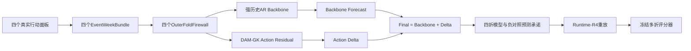

# GWM Benchmark V5.0定义与执行方案

日期：2026-07-23

当前状态：`PASS_V5_BENCHMARK_COMPLETE_ACTION_TRANSFER_NOT_SUPPORTED`。

直白地说：V5已经完成，不需要再等下载或运行。四次行动的数据已做成统一周表，四个轮流留出考试包通过
147项独立检查；运行规则、四折提交格式和评分器在模型运行前冻结；全部正式预测已承诺并零差值重放，
15/15项完成验收通过。Benchmark完成，但当前行动迁移主张不成立，不能根据结果修改冻结门槛。

## 1. 一句话定义

V5把2015、2019、2022、2025四次真实纽约出租车收费行动轮流藏起来考试：每次只用另外三个行动
训练，在最强历史AR预测上由DAM-GK补一个“行动修正量”，检验正确行动是否稳定改善强基线，而且
删除、错日期、错分量和错空间范围后都应该更差。

## 2. 为什么V5必须这样改

V4已经完成，但行动迁移门没有通过：行动DAM-GK得分0.495998，优于同结构无行动模型0.501090，
却落后于非空间历史AR的0.462225；CBD范围重连后的0.494034还略优于正确范围。

因此V5不再让复杂模型重新预测全部出租车状态，而是：

    最终预测 = 强历史AR预测 + DAM-GK行动修正量

V5也不再把结论押在一次2025考试上，而是对四次行动等权进行四个外层留出折。

## 3. 数据与四次行动

| 行动 | 生效日 | 行动前52周 | 行动后12周 |
| --- | --- | --- | --- |
| 2015 improvement surcharge | 2015-01-01 | 2014-01-02至2014-12-31 | 2015-01-01至2015-03-25 |
| 2019 congestion surcharge | 2019-02-02 | 2018-02-03至2019-02-01 | 2019-02-02至2019-04-26 |
| 2022 taximeter adjustment | 2022-12-19 | 2021-12-20至2022-12-18 | 2022-12-19至2023-03-12 |
| 2025 MTA CRZ | 2025-01-05 | 2024-01-07至2025-01-04 | 2025-01-05至2025-03-29 |

四个面板、263个Taxi Zone、2015 OD以及2018—2025 OD均已在本机。V5不需要新下载。每次行动截取
完整的448天，即行动前364天和行动后84天；每个行动都是117,824个日—区单元，没有日期—区域重复。

| 行动 | 完整日—区行 | 行动前原始OD行 | 行动后总费用变化范围（美元） |
| --- | ---: | ---: | ---: |
| 2015 | 117,824 | 4,438,073 | 0.30—0.30 |
| 2019 | 117,824 | 3,748,285 | 0.00—2.50 |
| 2022 | 117,824 | 2,523,470 | 0.70—17.6610 |
| 2025 | 117,824 | 2,838,400 | 0.00—0.75 |

这里的“行动前原始OD行”是预检窗口内的原始记录数；构图时还会去掉自流、非正流量和非法区域，
再为每个出发区保留流量最大的八条边，因此它不等于最终图的边数。

周尺度固定数量为：

| 项目 | 数量 |
| --- | ---: |
| 单行动64周 × 263区 | 16,832行 |
| 四行动总周数据 | 67,328行 |
| 每个外层折训练数据 | 50,496行 |
| 每折测试历史输入 | 13,676行 |
| 每折测试行动/目标 | 各3,156行 |
| 四折正式测试键 | 12,624个 |
| 四目标预测标量 | 50,496个 |

RC1实际产出与上述冻结数量完全一致。

## 4. 四折轮流考试

| 折 | 训练行动 | 测试行动 |
| --- | --- | --- |
| holdout_2015 | 2019、2022、2025 | 2015 |
| holdout_2019 | 2015、2022、2025 | 2019 |
| holdout_2022 | 2015、2019、2025 | 2022 |
| holdout_2025 | 2015、2019、2022 | 2025 |

每个外层折内部还要再做三折行动留出选择：用两个训练行动拟合、第三个训练行动验证，规则确定后再用
全部三个训练行动重训。当前外层测试行动的12周答案不能用于归一化、选模型、选阈值或构图。

2015和2025答案已经在历史研究中被看过，所以V5明确是模型留出的回顾性鲁棒性测试，不声称分析者盲测。

## 5. GWM Runtime-R4



Runtime-R4负责逐折隔离、内部选择凭证、强基线预测、12步开环、三随机种子、哈希承诺、重放和失败记录。

## 6. DAM-GK Residual Kernel

DAM-GK不再承担全部历史需求预测，只预测行动导致的修正：

    delta_(t+1) = K(state_t, action_t, geography, pre-action OD, exposure)
    prediction_(t+1) = history_AR_(t+1) + delta_(t+1)

当行动向量为0时，delta被正则到接近0。模型只能读取15维数值行动和冻结空间暴露，不能读取事件名称、
年份或外层折编号。

每个事件的OD图只使用该事件自身行动前52周构造top-8流向；测试行动后的OD不得更新图。

## 7. 正式模型和对照

正式模型：

1. 非空间历史AR强基线；
2. 固定邻接空间AR；
3. 同结构无行动残差模型；
4. UWM / DAM-GK行动残差模型。

每个折还必须运行七项负对照：行动删除、日期提前4周、日期推迟4周、行动分量打乱、错误空间范围、
跨事件行动替换、固定种子空间暴露打乱。

对城市范围行动，“错误空间范围”改成只在CBD生效；对空间范围行动，则换成冻结的错误范围。这样每个
行动都有真正会改变输入的空间对照。

## 8. 评分和通过门槛

主误差仍采用行动前52周归一化MAE，对263区、4目标、第1/2/4/8/12周等权；四个测试行动再次等权，
避免2025或高流量事件支配结果。

每折技能分数：

    skill = 1 - action_residual_error / history_AR_error

行动迁移成立必须全部满足：

1. 四折平均技能至少1%；
2. 行动模型减历史AR的配对bootstrap区间完全小于0；
3. 至少3/4测试行动改善；
4. 任一测试行动相对历史AR恶化不得超过2%；
5. 16个行动—目标组合中至少12个改善；
6. 五个报告周中至少四个改善；
7. 正确行动在四折等权总分上优于每一项错误行动；
8. 正确行动对每一项错误行动至少赢3/4折。

Benchmark完成仍不要求模型通过。失败结果必须照常发布。

## 9. V5能说什么

如果通过，可以说正确行动语义在四个已知纽约出租车行动的模型留出测试中，能够稳定改善强历史基线。

不能说政策具有因果效果，不能说这是研究人员未见答案的盲测，也不能外推到其他城市、交通方式或未来
政策。真正的新未来行动盲测应属于后续版本，而不是把已看过的2025结果重新包装成隐藏测试。

## 10. 完成路线

| 阶段 | 交付物 | 退出条件 |
| --- | --- | --- |
| V5.0-draft1 | 协议、中文定义、源数据预检 | 四事件窗口和本地源数据全部通过 |
| V5.0-rc1-data | 四个事件周包、四个留出折、逐事件图 | 67,328行及逐折防泄漏验证通过 |
| V5.0-rc2-runtime | Runtime-R4、提交合同、冻结评分器 | 构造答案与失败测试通过 |
| V5.0-rc3-predictions | 四模型、七控制、四折、三种子 | 全部预测承诺并重放 |
| V5.0-final | 多折正式评分、图表、失败和声明边界 | 完成验证通过，不依赖模型胜负 |

## 11. RC1数据验证结果

2026-07-23已完成数据物化与独立复核，状态为`PASS_V5_RC1_DATA_VERIFIED`，147/147项检查通过。

| 事件 | 周表行数 | 地理邻接边 | 行动暴露边 | 行动前OD top-8边 |
| --- | ---: | ---: | ---: | ---: |
| 2015 | 16,832 | 692 | 263 | 2,092 |
| 2019 | 16,832 | 692 | 263 | 2,082 |
| 2022 | 16,832 | 692 | 263 | 2,076 |
| 2025 | 16,832 | 692 | 263 | 2,059 |

验证不只是检查文件能否打开，还包括：

1. 四个事件都恰好包含52个行动前周、12个行动后周和263个区域；
2. 每折训练集只有另外三个事件，当前考试事件为零行；
3. 每折历史输入13,676行，行动说明和答案各3,156行，键完全对应；
4. 答案存放在独立目录，训练、归一化、选模型和构图均被规则禁止读取；
5. 对每次行动重新读取原始OD，只使用行动前52周计算top-8流向边，再与RC1图逐边核对；
6. 692条地理邻接边与V4冻结版本完全一致，263条行动暴露边与当前行动数值完全一致；
7. 原始源文件、协议、预检报告以及全部RC1产物的大小和SHA-256均匹配。

复现命令：

```bash
.venv/bin/python benchmarks/gwm_bench_foundation_v5_0_draft/preflight_v5_draft.py
.venv/bin/python benchmarks/gwm_bench_foundation_v5_0_draft/materialize_v5_rc1_bundle.py
.venv/bin/python benchmarks/gwm_bench_foundation_v5_0_draft/verify_v5_rc1_bundle.py
```

验证报告：`benchmarks/gwm_bench_foundation_v5_0_draft/rc1_bundle/bundle_verification.json`。

## 12. 当前准确进度

- 已完成：V5问题定义、四行动协议、源数据预检、RC1数据物化、四折隔离和独立数据验证；
- 已冻结：Runtime-R4合同、四折提交合同、八项行动迁移门槛和正式评分器；
- 已运行：四模型、七项负对照、四外层折和31/47/73三个随机种子；
- 已承诺：11份汇总提交、27份种子级多折预测、116份逐折预测和400个模型文件；
- 已重放：全部逐折预测和种子集成最大绝对差均为0.0；
- 已评分：Benchmark完成，行动迁移门0/8通过，状态为`ACTION_TRANSFER_NOT_SUPPORTED`；
- 当前允许做的下一步：发布、引用和复核冻结结果，或另立新版本定义新问题；
- 当前禁止做的事：根据V5正式结果重新调参、修改评分器或门槛，或把回顾性测试宣传成盲测和因果评估。

## 13. Runtime-R4与评分器封存结果

评分器首先通过23项构造测试，包括完美答案得分为零、明显偏差得分为正、四事件等权、五个固定报告周、
16个事件—目标方向、八项门槛、整数存储宽度兼容，以及重复键、缺键、错折、非整数键、多余列、负数、
非有限值和错误不确定性区间全部拒绝。

随后执行封存，19/19项检查通过，状态为`RUNTIME_R4_EVALUATOR_SEALED_PREDICTIONS_PENDING`。封存文件
绑定了协议、预检、RC1清单、147项数据验证、四折输入与答案、Runtime-R4合同、提交合同、评分器代码
和构造测试报告的文件大小与SHA-256。

冻结后的正式工作量为：

| 项目 | 固定数量 |
| --- | ---: |
| 正式汇总提交 | 11个（4模型 + 7负对照） |
| 外层留出折 | 4个 |
| 随机模型种子 | 31、47、73 |
| 随机模型种子级多折预测 | 27份 |
| 每份多折提交键 | 12,624个 |
| 每份多折预测标量 | 50,496个 |

封存文件：`benchmarks/gwm_bench_foundation_v5_0_draft/runtime_r4_evaluator_seal.json`。

## 14. 正式运行与最终验收

Runtime-R4烟雾验证15/15通过。正式运行生成11份汇总提交、27份种子级多折预测和116份逐折预测；
400个模型、checkpoint和sidecar文件在评分器读取答案前完成哈希承诺。全部逐折预测从checkpoint重放，
最大绝对差为0.0，重放验证12/12通过。

正式主分数如下，越低越好：

| 方法 | 分数 |
| --- | ---: |
| Date +4w负对照 | 0.358918 |
| 固定邻接空间AR | 0.361416 |
| 历史AR底座 | 0.362616 |
| Action deleted | 0.362616 |
| Exposure shuffle | 0.364012 |
| Component permutation | 0.364847 |
| DAM-GK正确行动残差 | 0.368389 |
| Date -4w | 0.370308 |
| Cross-event swap | 0.371179 |
| DAM-GK无行动残差 | 0.372408 |
| Wrong spatial scope | 0.381496 |

正确行动模型比同结构无行动模型好约1.08%，但比历史AR差0.005773。四折技能分别为2015的-15.35%、
2019的-13.91%、2022的+10.78%和2025的+8.39%，平均为-2.52%。只改善2/4行动、8/16行动—目标
组合和3/5报告周。候选减历史AR的bootstrap 95%区间为`[-0.000279, 0.011827]`，八项冻结门槛全部失败。

最终完成验证15/15通过，状态为：

`PASS_V5_BENCHMARK_COMPLETE_ACTION_TRANSFER_NOT_SUPPORTED`

完整数据、架构、图表、结果预览和失败分析见：
`docs/research/GWM_BENCHMARK_V5_0_FINAL_REPORT_2026-07-23.md`。
