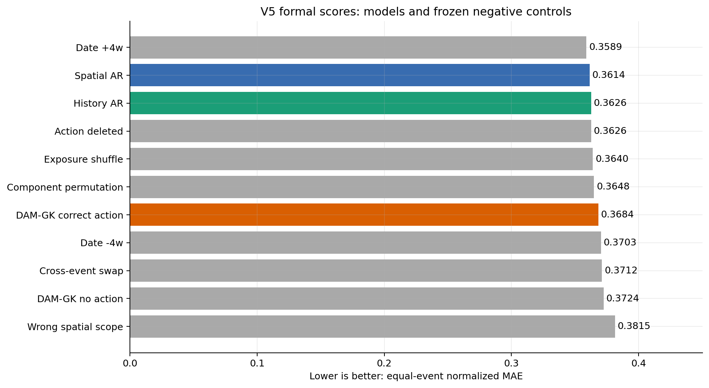
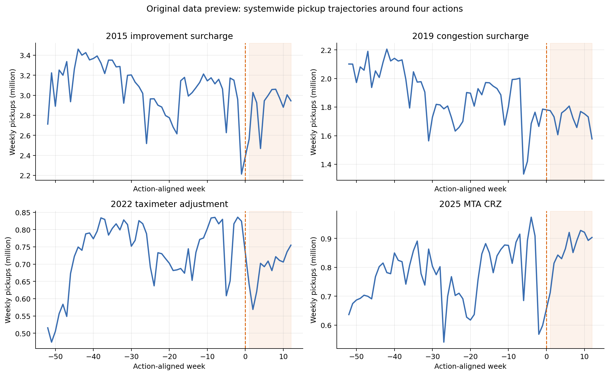
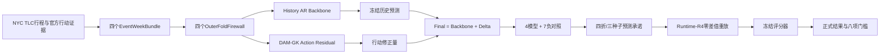
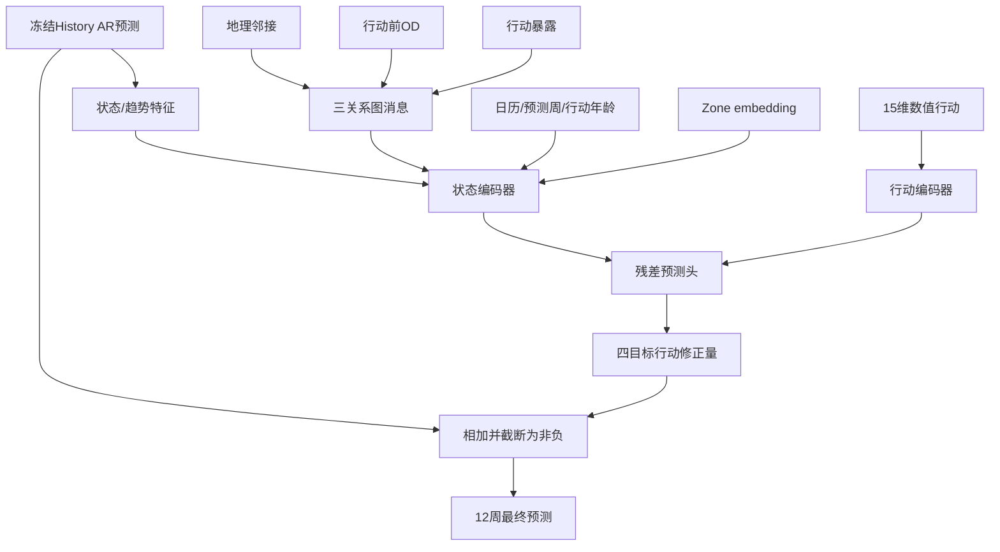
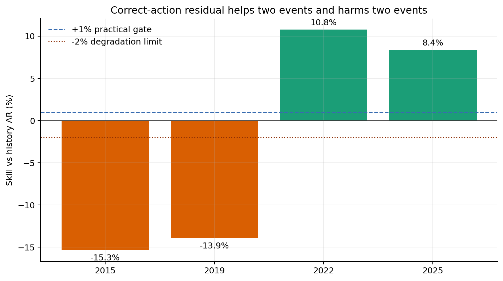
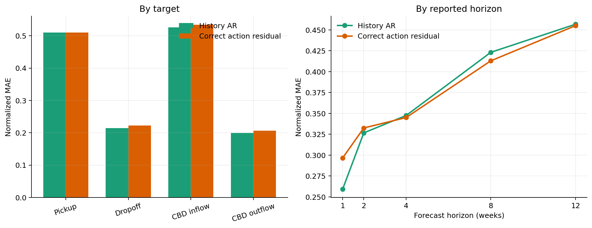
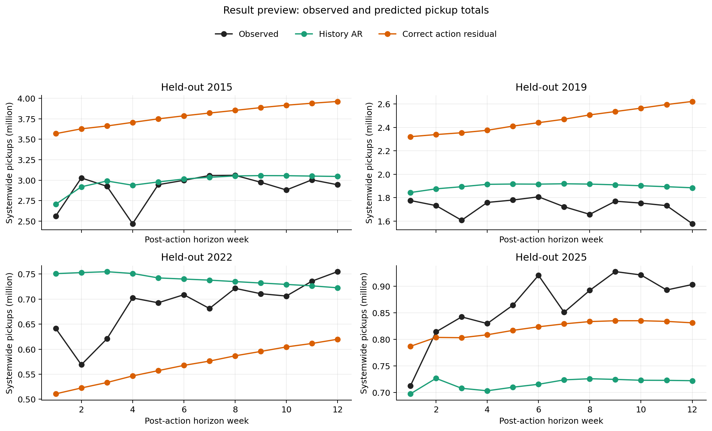
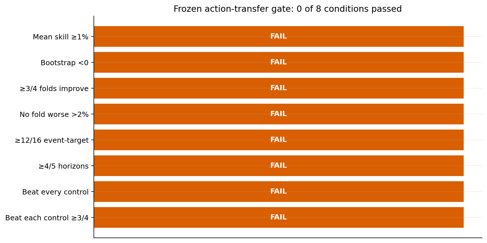

# GWM Benchmark V5.0最终验收报告

日期：2026-07-23

场景：纽约出租车四次真实收费行动的跨行动12周空间状态预测

正式状态：`BENCHMARK_COMPLETE / ACTION_TRANSFER_NOT_SUPPORTED`

完成验证：`15/15 PASS`

## 1. 先说结论

GWM Benchmark V5.0已经完成。数据、四折切分、防泄漏、Runtime-R4、正式预测、预测承诺、逐折重放、
冻结评分和最终报告均已跑通。因此，对“benchmark数据集是否OK”的回答是：**数据集和考试流程已经OK**。

当前DAM-GK行动迁移模型没有通过冻结门槛。正确行动模型比同结构无行动模型好约`1.08%`，说明行动输入
并非完全没有信息；但它仍比历史AR底座差`0.005773`，四折平均技能为`-2.52%`，只改善2022和2025
两个行动，八项门槛全部失败。因此，对“当前模型是否已经学会稳定、可迁移的行动规律”的回答是：
**没有证据支持**。

这两个结论必须分开：**benchmark完成了，模型主张失败了。** V5不允许根据正式结果重新调参或修改门槛。



## 2. V5到底考什么

V5只考一个问题：

> 在先固定一个强历史预测底座后，仅用另外三次真实收费行动训练DAM-GK行动修正量，能否在第四次未参与
> 训练的行动上稳定改善强基线，并且正确行动日期、分量和空间范围比所有错误行动对照更好？

四次行动轮流作为测试集：

| 外层折 | 训练行动 | 测试行动 |
| --- | --- | --- |
| `holdout_2015` | 2019、2022、2025 | 2015 improvement surcharge |
| `holdout_2019` | 2015、2022、2025 | 2019 congestion surcharge |
| `holdout_2022` | 2015、2019、2025 | 2022 taximeter adjustment |
| `holdout_2025` | 2015、2019、2022 | 2025 MTA CRZ |

V5是回顾性、模型留出的鲁棒性考试。2015和2025答案此前已经被分析者看过，因此它不是分析者盲测；它也
不是政策因果实验。严格保证的是：当前外层折的行动后答案在完整预测承诺前没有被模型、归一化、选择器或
构图过程读取。

## 3. 数据详细信息

### 3.1 数据场景与来源

| 数据 | 发布者或来源 | V5用途 |
| --- | --- | --- |
| Yellow Taxi月度Parquet | NYC TLC | pickup、dropoff、OD、费用与行动前后运行状态 |
| Taxi Zone边界与lookup | NYC TLC | 263个空间单元、名称、borough和地理邻接 |
| 2015 improvement surcharge材料 | NYC TLC | 0.30美元行动金额、生效日和全市适用范围 |
| 2019政策材料 | NY State Taxation and Finance | 2.50美元行动金额、生效日和曼哈顿适用规则 |
| 2022 adopted rule | NYC TLC / City Record | 计价组件变化及生效日 |
| CBD Taxi Zone polygons | MTA / NY State Open Data | CBD空间暴露范围 |
| 2025 CRZ toll schedule | MTA | 0.75美元行动金额、生效日和适用规则 |

V5复用已完成哈希审计的本地V4数据产品，不需要新增下载。协议绑定的主要源数据产品为：

- `heldout_2015_event_panel.parquet`：4,127,495 bytes；
- `development_event_panel.parquet`：18,388,927 bytes；
- `heldout_2015_daily_od_state.parquet`：12,310,172 bytes；
- `daily_od_state.parquet`：42,765,003 bytes。

这些是由原始行程、官方行动规则和Taxi Zone空间资料整理出的事件面板与OD面板。正式RC1只发布模型需要的
周尺度数据、图和逐折输入，不要求每次运行重新读取全部原始行程。

### 3.2 四个事件

| 行动 | 生效日 | 行动前52周 | 行动后12周 | 行动后总费用变化范围 |
| --- | --- | --- | --- | ---: |
| 2015 improvement surcharge | 2015-01-01 | 2014-01-02至2014-12-31 | 2015-01-01至2015-03-25 | 0.30—0.30美元 |
| 2019 congestion surcharge | 2019-02-02 | 2018-02-03至2019-02-01 | 2019-02-02至2019-04-26 | 0.00—2.50美元 |
| 2022 taximeter adjustment | 2022-12-19 | 2021-12-20至2022-12-18 | 2022-12-19至2023-03-12 | 0.70—17.6610美元 |
| 2025 MTA CRZ | 2025-01-05 | 2024-01-07至2025-01-04 | 2025-01-05至2025-03-29 | 0.00—0.75美元 |

每次行动都截取完整448天，即行动前364天和行动后84天。每个事件日尺度面板为117,824个日—区单元，
周尺度面板为64周 × 263区 = 16,832行。

| 行动 | 周表行数 | 行动前原始OD行 | 地理邻接边 | 行动暴露边 | 行动前OD top-8边 |
| --- | ---: | ---: | ---: | ---: | ---: |
| 2015 | 16,832 | 4,438,073 | 692 | 263 | 2,092 |
| 2019 | 16,832 | 3,748,285 | 692 | 263 | 2,082 |
| 2022 | 16,832 | 2,523,470 | 692 | 263 | 2,076 |
| 2025 | 16,832 | 2,838,400 | 692 | 263 | 2,059 |

OD图只使用各事件自己的行动前52周。构图时删除自流、非正流量和非法区域，再为每个出发区保留流量最大的
八条边；测试行动后的OD不得用于更新图。

### 3.3 空间、时间、状态与行动字段

| 项目 | 固定定义 |
| --- | --- |
| 城市 | New York City |
| 空间单元 | 263个NYC TLC Taxi Zone |
| 时间单元 | 从行动生效日对齐的完整7天块 |
| 每事件输入 | 行动前52周 |
| 每事件输出 | 行动后12周 |
| 状态目标 | `pickup_count`、`dropoff_count`、`cbd_inflow`、`cbd_outflow` |
| 正式报告周 | 第1、2、4、8、12周 |
| 行动表示 | 15维数值行动向量，不含政策名称、年份或折编号 |

15维行动包括十个费用分量，以及期望总费用变化、相对票价变化、空间适用比例、时间适用比例和实施比例。
模型被禁止把事件名称、政策日期标签、事件年份或外层折ID作为学习特征。

### 3.4 RC1与正式预测规模

| 项目 | 固定数量 |
| --- | ---: |
| 四事件周数据总行数 | 67,328 |
| 每折训练数据 | 50,496 |
| 每折测试历史输入 | 13,676 |
| 每折未来行动输入 | 3,156 |
| 每折独立答案 | 3,156 |
| 四折正式预测键 | 12,624 |
| 每份提交的预测标量 | 50,496 |

RC1数据验证状态为`PASS_V5_RC1_DATA_VERIFIED`，147/147项检查通过，包括完整周数、区域数、键对应、
外层折隔离、训练安全OD构图、源文件哈希和全部产物哈希。

### 3.5 原始数据预览

下图展示四次行动前后全市每周pickup总量。橙色虚线为行动生效时点，淡色区域为12周测试窗口。四个事件的
总量级别和走势明显不同，这也是“跨行动迁移”比单一时间序列外推更难的直接证据。



2015事件的实际Parquet样例：

| 相对周 | 周起始 | Zone | pickup | dropoff | CBD inflow | CBD outflow | improvement surcharge | expected total delta | spatial share | implementation |
| ---: | --- | ---: | ---: | ---: | ---: | ---: | ---: | ---: | ---: | ---: |
| -52 | 2014-01-02 | 1 | 72 | 4,408 | 10 | 3,400 | 0.0 | 0.0 | 0.0 | 0.0 |
| -52 | 2014-01-02 | 2 | 18 | 18 | 1 | 1 | 0.0 | 0.0 | 0.0 | 0.0 |
| 1 | 2015-01-01 | 1 | 40 | 4,181 | 2 | 3,323 | 0.3 | 0.3 | 1.0 | 1.0 |
| 1 | 2015-01-01 | 2 | 7 | 5 | 1 | 3 | 0.3 | 0.3 | 1.0 | 1.0 |

## 4. GWM、Runtime Kernel、Runtime-R4与DAM-GK

### 4.1 必须先区分三个概念

| 层 | 作用 | V5状态 |
| --- | --- | --- |
| GWM Runtime Kernel | 管理状态、行动、转移、写回、不确定性、证据、版本和领域适配的共享平台运行边界 | 研究架构已定义，完整共享产品尚未抽取完成 |
| Runtime-R4 | V5专用的benchmark执行配置，负责四折防泄漏、选择凭证、预测承诺、重放和评分时序 | 已实现并通过正式验收 |
| Geospatial Kernel / DAM-GK | 根据状态、行动和空间关系计算地理状态变化 | V5实现了多关系行动残差配置，但没有证明完整通用DAM-GK有效 |

一句话：**Runtime Kernel决定世界模型怎样被可靠地运行，DAM-GK决定地理状态怎样变化；Runtime-R4则是
这次benchmark使用的严格执行规则。** Runtime-R4完成不等于共享GWM Runtime Kernel产品已经完整。

### 4.2 总体技术架构



### 4.3 Runtime-R4做了什么

Runtime-R4是模型无关的正式运行生命周期：

1. 物化四个外层行动留出折；
2. 在每个外层折内部执行三折“留出训练行动”超参数选择；
3. 保存并冻结选择凭证；
4. 拟合历史AR底座并先生成底座预测；
5. 只在三个训练行动上拟合行动残差；
6. 对测试行动执行12周开环预测，不写回真实测试状态；
7. 验证每折3,156个键和四个目标完整；
8. 固定种子31、47、73并在原始数量空间求平均；
9. 承诺预测、checkpoint、代码、环境、选择凭证和运行报告哈希；
10. 从checkpoint重放全部逐折预测；
11. 只有完整预测承诺后，评分器才允许读取四折答案。

模型运行允许读取当前折的`development`、`test_input`和`graph`，禁止读取当前折`test_targets`、其他模型
预测和提前生成的正式评分结果。任何违反防火墙的提交都必须判为无效。

### 4.4 历史AR底座

V5没有让神经模型重新学习全部历史惯性。最强历史底座是每个Taxi Zone单独拟合的Ridge AR：

- 在`log1p`状态相对行动前均值的残差空间训练；
- 使用第1、2、4、8周滞后；
- 加入季节正余弦、相对周、行动后指示和常数日历特征；
- `alpha=5.0`；
- 连续递推12周；
- 不读取行动字段。

固定邻接空间AR在相同输入上额外加入地理邻接聚合后的上一周状态。

### 4.5 V5中的DAM-GK行动残差

V5最终预测固定为：

```text
final_prediction = frozen_history_AR_prediction + DAM_GK_action_residual
```

DAM-GK残差配置接收三类空间关系：

| 关系 | 构造方式 | 含义 |
| --- | --- | --- |
| Geographic adjacency | V4冻结的692条Taxi Zone邻接边 | 相邻区域状态传播 |
| Origin-destination flow | 每事件行动前52周top-8 OD | 主要出行联系传播 |
| Action exposure | 每区一条带数值暴露的自关系 | 行动空间作用范围 |

每个区域—预测周的状态特征包括历史AR预测相对均值、最近状态、四周趋势、三关系图消息、日历和行动年龄、
区域embedding。15维行动先经行动编码器，再与状态编码结果共同输出四个目标的归一化修正量。



模型使用SiLU多层感知机、AdamW和SmoothL1损失。配置候选为`compact`、`base`和`regularized`，只通过
外层训练行动内部的三折验证选择。每个训练事件的残差底座也采用事件级交叉拟合，避免用同一事件行动后数据
训练它自己的历史底座。

零行动锚点是结构性的：行动向量为零时，行动条件残差严格乘零，因此`action_deleted`预测与历史AR完全
一致。需要特别说明，V5使用的是DAM-GK的“冻结预行动图 + 多关系行动残差”配置，不包含行动后真实图更新，
也不能代表DAM-GK研究规范中所有动态拓扑、多尺度和不确定性能力已经得到验证。

## 5. 正式模型与负对照

四个正式模型：

1. `history_ar_backbone`：非空间历史AR强基线；
2. `fixed_adjacency_spatial_ar`：固定邻接空间AR；
3. `dam_gk_residual_no_action`：同结构无行动残差；
4. `uwm_dam_gk_action_residual`：正确行动DAM-GK残差。

七项冻结负对照：

| 对照 | 被破坏的内容 |
| --- | --- |
| Action deleted | 删除行动向量和行动暴露 |
| Date -4w | 把行动年龄提前4周 |
| Date +4w | 推迟4周注入行动，前4周等于历史AR |
| Component permutation | 十个费用分量做无固定点循环置换 |
| Wrong spatial scope | 所有行动都错误限制为CBD范围 |
| Cross-event swap | 换成另一个训练事件的行动向量和暴露 |
| Exposure shuffle | 固定种子打乱区域暴露；2015全市统一行动为恒等变换，其余三折改变 |

## 6. 正式运行、承诺与重放

| 运行证据 | 结果 |
| --- | --- |
| Runtime-R4烟雾验证 | 15/15通过 |
| 正式汇总提交 | 11份：4模型 + 7负对照 |
| 随机种子级多折预测 | 27份 |
| 逐折预测 | 116份 |
| 预测承诺绑定模型文件 | 400个 |
| 额外全局外层折运行文件 | 8个 |
| 重放验证 | 12/12通过 |
| 最大逐折重放差值 | 0.0 |
| 最大集成重放差值 | 0.0 |
| 承诺前读取测试答案 | 否 |

预测承诺状态为：

`MULTIFOLD_PREDICTIONS_COMMITTED_EVALUATOR_ACCESS_PERMITTED`

承诺边界覆盖11份汇总预测、27份种子级多折预测、116份逐折预测、神经网络checkpoint、运行sidecar、
嵌套选择凭证、runner、模型核心、重放报告和冻结评分器。预测承诺SHA-256为：

`4737e75ee78b982dea767ba5c85b2eb0dd01a1c728de8d729a136103b859b941`

## 7. 评分方法

主指标是四事件等权的行动前归一化MAE，越低越好：

1. 每区每目标的绝对误差除以该区该目标行动前52周均值；
2. 对263区、4目标和第1/2/4/8/12周等权；
3. 再对四个外层测试行动等权，避免大流量事件支配结果。

每折技能：

```text
skill = 1 - correct_action_error / history_AR_error
```

候选模型与历史AR的误差差值以“外层事件折内Taxi Zone”为配对bootstrap单位，固定种子20260723执行
20,000次重采样。该区间只比较预测误差，不是政策效果的因果置信区间。

## 8. 最终结果

### 8.1 所有模型和对照的唯一最终排序

| 排名 | 方法 | 类型 | 主分数，越低越好 |
| ---: | --- | --- | ---: |
| 1 | Date +4w | 负对照 | 0.358918 |
| 2 | Fixed-adjacency spatial AR | 基线 | 0.361416 |
| 3 | History AR backbone | 基线 | 0.362616 |
| 4 | Action deleted | 负对照 | 0.362616 |
| 5 | Exposure shuffle | 负对照 | 0.364012 |
| 6 | Component permutation | 负对照 | 0.364847 |
| 7 | DAM-GK correct action residual | 候选 | 0.368389 |
| 8 | Date -4w | 负对照 | 0.370308 |
| 9 | Cross-event action swap | 负对照 | 0.371179 |
| 10 | DAM-GK no-action residual | 匹配模型 | 0.372408 |
| 11 | Wrong spatial scope | 负对照 | 0.381496 |

正确行动模型比同结构无行动残差好`0.004019`，相对改善约`1.08%`；但它比历史AR差`0.005773`，
比固定邻接空间AR差`0.006973`。最优结果反而是把行动推迟4周的负对照。

### 8.2 四折技能

| 测试行动 | History AR | 正确行动 | 技能 |
| --- | ---: | ---: | ---: |
| 2015 | 0.301008 | 0.347202 | -15.35% |
| 2019 | 0.363261 | 0.413797 | -13.91% |
| 2022 | 0.322433 | 0.287686 | +10.78% |
| 2025 | 0.463764 | 0.424872 | +8.39% |



四折平均技能为`-2.52%`。模型明显帮助2022和2025，却明显伤害2015和2019，说明行动修正方向没有跨
四个事件保持稳定。

### 8.3 按目标与预测周比较

正确行动相对历史AR只在`pickup_count`上微弱改善`0.000118`；`dropoff_count`、`cbd_inflow`和
`cbd_outflow`均变差。五个报告周中第4、8、12周改善，第1、2周变差。



| 维度 | 改善数量 | 总数 |
| --- | ---: | ---: |
| 外层行动 | 2 | 4 |
| 行动—目标组合 | 8 | 16 |
| 报告周 | 3 | 5 |

### 8.4 预测结果预览

下图展示四个留出行动的全市pickup真实值、历史AR和正确行动残差预测。它不是主指标的替代品，但直观显示：
2015和2019行动修正把预测推得过高，2022把预测推低并获得改善，2025则在历史AR偏低时向上修正。



正确行动汇总提交的实际Parquet样例：

| fold | zone | horizon | pickup预测 | dropoff预测 | CBD inflow预测 | CBD outflow预测 |
| --- | ---: | ---: | ---: | ---: | ---: | ---: |
| holdout_2015 | 1 | 1 | 58.0595 | 4,349.7249 | 3.2765 | 3,353.8619 |
| holdout_2015 | 1 | 2 | 61.8816 | 4,357.4925 | 2.8948 | 3,350.2236 |
| holdout_2015 | 1 | 3 | 64.1965 | 4,528.6816 | 2.9955 | 3,517.3171 |
| holdout_2015 | 1 | 4 | 61.5445 | 4,486.6799 | 3.0775 | 3,413.9421 |

## 9. 八项冻结门槛

| 冻结条件 | 实际结果 | 判断 |
| --- | --- | --- |
| 四折平均技能至少+1% | -2.52% | 失败 |
| 候选减历史AR的95%区间完全小于0 | `[-0.000279, 0.011827]` | 失败 |
| 至少3/4行动改善 | 2/4 | 失败 |
| 任一折恶化不得超过2% | 2015恶化15.35%，2019恶化13.91% | 失败 |
| 至少12/16行动—目标改善 | 8/16 | 失败 |
| 至少4/5报告周改善 | 3/5 | 失败 |
| 正确行动总分优于所有错误行动 | 多个错误对照更好 | 失败 |
| 对每个错误行动至少赢3/4折 | 胜折数为2、3、2、3、2、3、1 | 失败 |



最终状态：`ACTION_TRANSFER_NOT_SUPPORTED`。

## 10. 说人话：为什么没有通过

最直接的解释不是“模型完全没读懂行动”，而是“它学到的修正规则不稳定”：

1. 正确行动比无行动残差好，说明数值行动中有一点可用信息；
2. 但只有三个训练行动支撑一个15维行动空间，事件级样本非常少；
3. 四个年份的出租车需求水平和变化机制差异很大，行动向量没有表达所有同时发生的环境变化；
4. 2015和2019被持续向上修正并显著变差，2022和2025则受益，说明修正方向随历史阶段改变；
5. `Date +4w`、暴露打乱和分量打乱等错误输入仍能优于正确行动，说明正确时间、正确分量和正确空间语义
   没有被稳健识别；
6. 历史AR已经抓住大部分可预测惯性，行动残差必须在很小的剩余误差上工作，错误修正会直接抵消强底座。

这些解释与结果一致，但不是已经证明的因果原因。V5正式结果已经冻结，不能在同一版本中针对2015和2019
重新调参后再声称通过。

## 11. V5证明了什么，没有证明什么

V5支持以下结论：

- 四次已知纽约出租车行动可以组成一个可复现的模型留出、多折行动迁移benchmark；
- Runtime-R4实现了外层折防泄漏、三种子、完整承诺和零差值重放；
- 正确行动输入相对同结构无行动模型提供了小幅平均增益；
- 当前行动残差在四个行动之间缺乏稳定性，冻结迁移门不通过。

V5不支持以下结论：

- 任一收费政策的因果效果；
- 分析者未见答案的真正盲测；
- 对一个全新未来行动的预测能力；
- 运营级交通预测有效性；
- 纽约黄牌出租车之外的跨城市或跨领域泛化；
- 完整通用GWM Runtime Kernel、UWM或DAM-GK已经被证明有效。

## 12. 最终完成验收

| 验收项 | 状态 |
| --- | --- |
| 本地源数据预检 | 76/76通过 |
| RC1四事件与四折数据验证 | 147/147通过 |
| 提交合同与评分器构造测试 | 23/23通过 |
| Runtime-R4与评分器预测前封存 | 19/19通过 |
| Runtime-R4烟雾验证 | 15/15通过 |
| 11份正式汇总提交 | 完整 |
| 27份种子级多折预测 | 完整 |
| 116份逐折预测重放 | 全部零差值 |
| 预测承诺 | 400个模型文件已绑定 |
| 正式评分 | 已完成 |
| 八项门槛 | 0/8通过，失败结果已发布 |
| 最终完成验证 | 15/15通过 |

最终验收结论：

> **GWM Benchmark V5.0已经完成，数据和执行链可用；当前DAM-GK行动残差没有证明稳定的跨行动迁移。**

## 13. 下一版如何改进

V5本身不再继续优化。后续新版本应在预测前重新定义问题和数据：

- 增加更多重复、可比较的真实行动，降低“15维行动、只有三个训练事件”的欠支撑；
- 增加行动之外的可观测同期环境状态，但必须在行动生效前可获得；
- 把“早期1—2周”和“中后期4—12周”分成可预注册的响应阶段；
- 使用真正未参与V4/V5开发的新未来行动，形成分析者和模型都未见的外部测试；
- 在跨城市扩展前先验证相同行动语义在同一城市的重复性；
- 若引入动态拓扑、多尺度写回或不确定性传播，必须作为新Runtime和新DAM-GK配置重新封存，不能替换V5结果。

## 14. 关键机器文件

- 协议：`benchmarks/gwm_bench_foundation_v5_0_draft/suite_protocol.json`
- 数据验证：`benchmarks/gwm_bench_foundation_v5_0_draft/rc1_bundle/bundle_verification.json`
- Runtime-R4合同：`benchmarks/gwm_bench_foundation_v5_0_draft/runtime_r4_contract.json`
- Runtime与评分器封存：`benchmarks/gwm_bench_foundation_v5_0_draft/runtime_r4_evaluator_seal.json`
- 预测重放：`benchmarks/gwm_bench_foundation_v5_0_draft/predictions/runtime_replay_report.json`
- 预测承诺：`benchmarks/gwm_bench_foundation_v5_0_draft/predictions/prediction_commitment.json`
- 正式结果：`benchmarks/gwm_bench_foundation_v5_0_draft/final_results/action_transfer_results.json`
- 完成验证：`benchmarks/gwm_bench_foundation_v5_0_draft/final_results/completion_verification.json`
