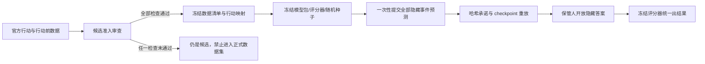
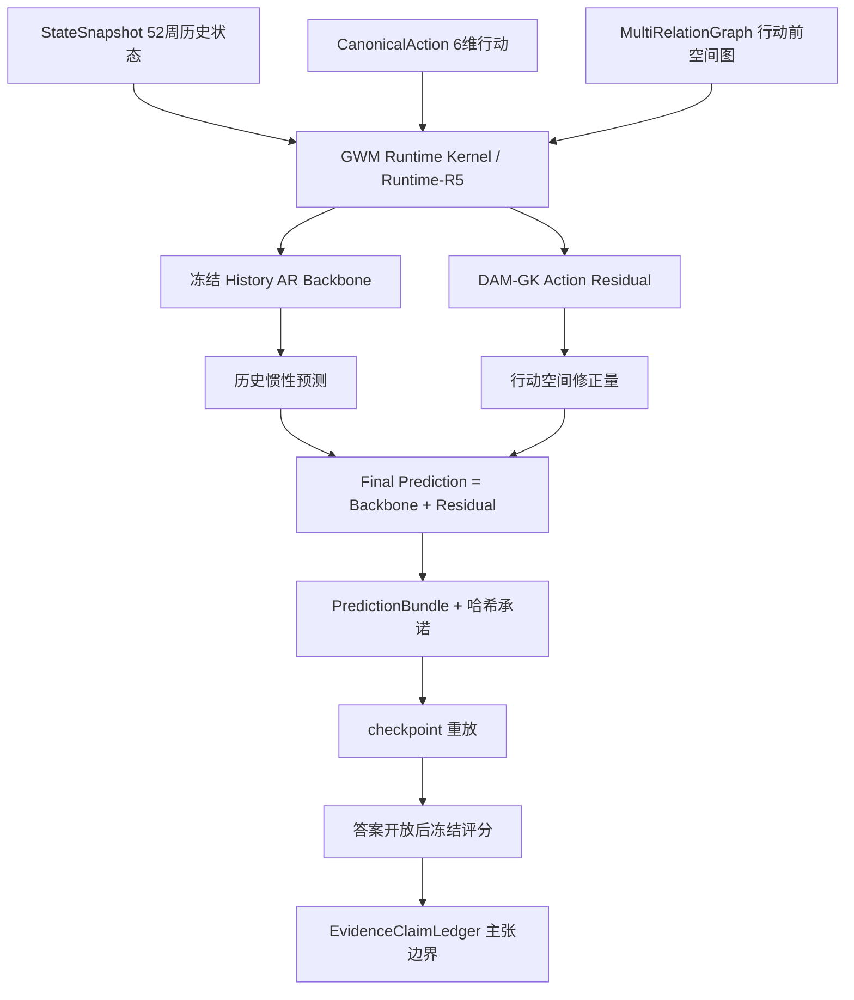

# GWM Benchmark V6.0 定义与激活门

日期：2026-07-24
当前状态：`PASS_V6_DEFINITION_VALIDATED_NOT_ACTIVATED`（定义通过，数据集尚未激活）

## 1. 先说结论

V6.0 不再继续调整 V5，也不是把更多已看过答案的历史事件加进去重新跑一遍。它要做一次真正的
“闭卷考试”：同一个冻结模型必须在任何隐藏答案被打开之前，对至少两个新行动一次性提交未来 12 周的
空间预测，然后才能由冻结评分器统一揭晓答案和评分。

V6 的正式激活最低需要：

| 数据角色 | 最低数量 | 当前数量 | 差额 |
| --- | ---: | ---: | ---: |
| V5 冻结开发事件 | 4 | 4 | 0 |
| 新增开发事件 | 2 | 0 | 2 |
| 真正隐藏测试事件 | 2 | 0 | 2 |
| 总事件 | 8 | 4 | 4 |

所以目前“V6 定义”已经完成，但“V6 benchmark 数据集”还不能称为完成。现在不是等待某个下载自然结束，
而是需要把候选事件逐项验证并正式准入。任何一项关键证据未关闭，候选就不能混进正式数据集。

## 2. V6 到底要回答什么

V5 已经证明 benchmark 工程可以完整运行，但结果是
`PASS_V5_BENCHMARK_COMPLETE_ACTION_TRANSFER_NOT_SUPPORTED`：V5 的 15 维行动 DAM-GK 残差相对历史
AR 的四折平均技能为 -2.52%，四个已知 NYC 行动中只改善两个，冻结的 8 项行动迁移门全部未通过。

V5 的重要局限不是“运行次数不够”，而是四次行动都属于回顾性数据，研究过程中已经接触过部分答案。
因此 V6 只新增一个研究问题：

> 一个在隐藏答案开放前冻结的模型包，能否在至少两个新行动上同时优于强历史基线和空间基线，并且
> 正确行动语义是否稳定优于删除、错日期、错范围、错分量等所有冻结负对照？

这个问题把“模型能拟合过去”与“模型能迁移到新行动”分开。只有后者才是 V6 的新增价值。

## 3. 数据集的正式定义

### 3.1 事件单位

每个事件是一项具有官方生效日、可数值化行动和稳定空间结果序列的真实交通行动。每个事件固定包含：

| 项目 | V6 固定要求 |
| --- | --- |
| 时间粒度 | 以行动生效日对齐的完整 7 天块 |
| 行动前输入 | 52 周 |
| 行动后答案 | 12 周 |
| 稳定空间单元 | 至少 50 个，优先 100 个以上 |
| 状态目标 | pickup、dropoff、中心区流入、中心区流出 |
| 周表完整性 | 完整的区域 × 周网格，行动后答案不得缺失 |
| 空间图 | 只能使用行动前数据构建 |
| 推演方式 | 12 步开环，不能把真实行动后状态逐周写回模型 |

至少一个隐藏事件必须具有空间异质暴露，也就是行动并非对所有区域完全相同。否则“错空间范围”对照
缺少足够辨识力。

### 3.2 为什么是 6 个开发事件加 2 个隐藏事件

V5 每个外层折只有 3 个训练行动，却使用 15 维行动描述，行动样本相对表示维度过少。V6 保留 4 个 V5
事件作为冻结开发证据，再新增至少 2 个开发事件，使模型选择至少建立在 6 个行动上。两个隐藏事件用于
防止结论被单一偶然事件决定，同时仍保持数据获取可执行。

这不是统计学意义上的“交通行动总体充分样本量”。它只是 V6 可执行的最低激活线。因此 V6 即使完成，
也只能对准入的隐藏行动给出证据，不能宣称已经证明所有城市和所有政策的普遍规律。

### 3.3 六维统一行动合同

V6 将 V5 的 15 维行动向量压缩为 6 个可以从官方文件中较稳定识别的量：

| 字段 | 直白含义 |
| --- | --- |
| `fixed_charge_delta` | 每次服务固定增加或减少多少钱 |
| `variable_metered_cost_delta` | 里程或时间计价部分变化多少 |
| `expected_fractional_cost_delta` | 按行动前出行结构估算的相对成本变化 |
| `spatial_applicability_share` | 一个区域受行动作用的空间比例 |
| `temporal_applicability_share` | 一周内受行动作用的时间比例 |
| `implementation_share` | 当周实际实施到位的比例 |

模型禁止把事件名称、城市、年份或测试折编号当作学习特征。隐藏事件的数值映射必须在答案开放前冻结，
避免看到结果后反向解释行动。

## 4. 什么才算“真正隐藏”

公开政策文件和行动前输入可以公开；必须隐藏的是行动后 12 周的目标值。V6 只接受两种隐藏方式：

1. 前瞻方式：行动在协议冻结之后才生效，模型先提交预测，之后自然产生答案；
2. 独立托管方式：历史答案由独立保管人提前封存，模型开发者在提交前不能访问，且有可核验回执。

仅在本机写一句“我没有看过”不算隐藏证据。任何开发者在承诺前打开了该候选的一条行动后结果记录，
该候选在同一 V6 发布中就永久失去隐藏资格，最多降级为开发事件。



## 5. 候选事件现状

当前注册表只有两个“线索”，二者均未准入：

| 候选 | 计划角色 | 已确认信息 | 主要卡点 | 当前结论 |
| --- | --- | --- | --- | --- |
| NYC 2012 计价调整 | 隐藏测试 | 官方政策 PDF 已哈希绑定；未打开、未下载行动后行程记录 | 没有独立答案保管回执；64 周完整源覆盖未核验；历史空间单元重建、实施比例和并发行动污染未关闭 | 只能继续做元数据和证据筛查 |
| Chicago 2026 计价调整 | 开发 | 官方 Socrata 结果源存在；有 77 个社区区候选空间单元 | 12 周行动后窗口到 2026-09-22 才结束；正式行动文件、六维映射、完整下载器和图检查未完成 | 只能作为开发候选，不能再作为隐藏测试 |

Chicago 不能作为隐藏测试，不是因为数据公开，而是因为开发侧已经探查过当前结果表的一条记录。NYC
2012 目前没有打开结果行，但缺少独立保管，所以也不能只凭“尚未下载”就宣称是盲测。

每个候选必须同时通过 13 项准入检查，包括官方行动权威、数值行动映射、官方结果源、可复现下载、
52+12 周覆盖、至少 50 个稳定空间单元、完整周网格、行动前构图、并发行动处理以及隐藏回执。规则是
“全部为真”，不存在用模型效果好来补偿数据证据缺失的做法。

## 6. V6 的技术架构

### 6.1 三层职责

| 层 | 职责 | V6 状态 |
| --- | --- | --- |
| GWM Runtime Kernel | 统一状态、行动、图、推演请求、版本、承诺、重放、证据和主张边界 | 平台级共享产品尚未完整抽取 |
| Runtime-R5 | V6 对共享 Runtime Kernel 的严格运行配置 | 合同已定义，激活前禁止做正式预测 |
| Geospatial Kernel / DAM-GK | 根据状态、行动和多关系空间图计算行动修正量 | 作为候选动力学模型，不能等同于完整 GWM |

一句话：Runtime Kernel 管“怎样可靠地运行和留下证据”，DAM-GK 管“空间状态怎样随行动变化”，
Runtime-R5 是 V6 对前者规定的具体考试流程。



### 6.2 Runtime-R5 必须实现的合同

Runtime-R5 不能再复制一份只服务 benchmark 的临时代码。它必须通过共享接口处理：

- `StateSnapshot`：版本化的 52 周区域状态；
- `CanonicalAction`：冻结的 6 维数值行动；
- `MultiRelationGraph`：地理邻接、行动前流动关系和行动暴露；
- `OpenLoopRolloutRequest`：不写回答案的 12 步推演请求；
- `PredictionBundle`：键完整、模型版本明确的预测包；
- `RuntimeAuditReceipt`：输入、代码、环境、模型、预测和重放的哈希凭证；
- `EvidenceClaimLedger`：根据证据自动限制能说和不能说的结论。

正式运行固定使用随机种子 31、47、73，在原始计数空间做算术平均；承诺后的 checkpoint 重放最大绝对
误差不得超过 `1e-6`。第一个隐藏答案开放后，不允许更新模型、行动映射或超参数。

### 6.3 DAM-GK 在 V6 中的核心算法位置

V6 沿用 V5 中较可控的残差结构，而不是让复杂模型重学全部历史惯性：

```text
最终预测 = 冻结历史 AR 预测 + DAM-GK 行动残差
```

历史 AR 负责周期、惯性和区域自身历史。DAM-GK 接收状态、六维行动、地理邻接、行动前流动图和空间
暴露，学习“该行动相对正常历史会把哪些区域往哪个方向修正”。这样评测的是行动信息是否产生额外价值，
而不是复杂模型是否仅靠历史拟合胜出。

## 7. 如何评判结果好坏

主误差是按每个隐藏事件的行动前尺度归一化 MAE，对稳定区域、4 个目标和第 1/2/4/8/12 周等权，
然后再对隐藏事件等权。误差越低越好。

```text
event_skill = 1 - 候选模型主误差 / 历史AR主误差
```

技能大于 0 表示优于历史 AR；例如 0.01 表示主误差改善 1%。行动迁移成立必须同时满足 8 条冻结门：

1. 隐藏事件平均技能至少 1%；
2. 候选减历史 AR 的配对 bootstrap 区间整体小于 0；
3. 至少一个隐藏事件改善至少 1%；
4. 任一隐藏事件恶化不超过 2%；
5. 8 个“隐藏事件 × 目标”组合至少 6 个改善；
6. 5 个报告周至少 4 个改善；
7. 正确行动总体优于无行动、历史 AR 和固定空间 AR；
8. 正确行动总体优于所有冻结错误行动，且没有一个错误行动同时赢两个隐藏事件。

负对照包括删除行动、生效日提前/推迟 4 周、行动分量打乱、错误空间范围、跨事件行动替换和空间暴露
打乱。若错误行动比正确行动更好，即使平均误差看起来不错，也不能说模型学到了行动机制。

Benchmark 是否“完成”与模型是否“获胜”分开：只要数据准入、冻结、预测、承诺、重放、评分和失败发布
全部按协议完成，V6 就可以完成；8 条门失败时必须原样发布“行动迁移不成立”，不能重新调参后覆盖正式结果。

## 8. 当前允许做什么、禁止做什么

当前允许：核验政策文件、源元数据、许可条款、时间覆盖、空间单元、远程 schema/Parquet footer；建立独立
答案保管机制；寻找额外开发和隐藏候选；补齐每个候选的 13 项准入证据。

当前禁止：下载 NYC 2012 结果行；用候选行动后数据训练 V6；建立正式隐藏预测；在激活前声称 V6 数据集
已经完成；把 V5 失败结果重新调参包装成 V6。

下一里程碑不是“再等一会儿”，而是注册表中至少出现 2 个 `admitted_development` 和 2 个
`admitted_hidden_test`，且至少一个隐藏行动具有空间异质暴露。达到后才能冻结 Runtime-R5 和评分器，
再进行正式数据物化和模型执行。

## 9. 可核验文件

| 文件 | 作用 |
| --- | --- |
| `benchmarks/gwm_bench_foundation_v6_0_draft/suite_protocol.json` | V6 问题、数据下限、Runtime-R5、评分门和主张边界 |
| `benchmarks/gwm_bench_foundation_v6_0_draft/candidate_admission_contract.json` | 候选必须全部通过的准入规则 |
| `benchmarks/gwm_bench_foundation_v6_0_draft/candidate_registry.json` | 当前候选、证据、访问状态和卡点 |
| `benchmarks/gwm_bench_foundation_v6_0_draft/validate_v6_definition.py` | 离线定义与激活状态校验器 |
| `benchmarks/gwm_bench_foundation_v6_0_draft/definition_validation_report.json` | 机器生成的当前验证结论 |

复核命令：

```bash
.venv/bin/python benchmarks/gwm_bench_foundation_v6_0_draft/validate_v6_definition.py
```

在候选数量仍为 0+0 时，正确输出必须是：

```text
PASS_V6_DEFINITION_VALIDATED_NOT_ACTIVATED
```
