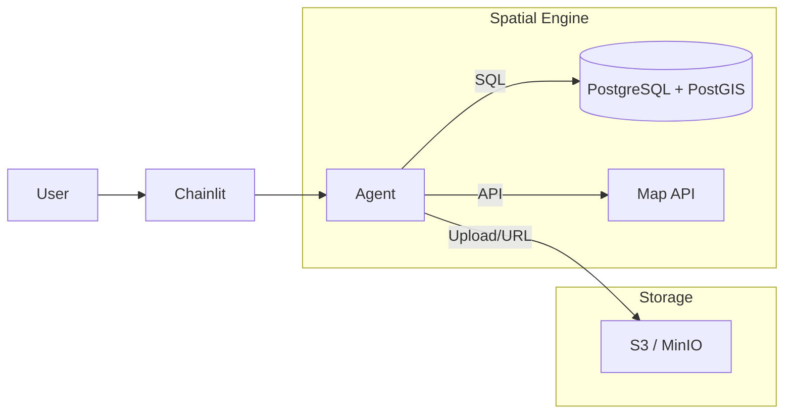

# Data Agent v3.0 Roadmap: Enterprise Spatial Intelligence

## 1. Vision & Goals
**From "Optimization Tool" to "Spatial Intelligence Platform"**
While v2.5 demonstrated deep vertical capability in land use optimization, v3.0 aims to generalize this intelligence for broader business and government use cases. The goal is to lower the barrier to entry so that any user with an Excel file can perform professional-grade spatial analysis.

## 2. Strategic Pillars

### 🟢 Pillar 1: Universal Data Access (The "Excel Barrier")
Most business data lives in Excel spreadsheets with addresses, not Shapefiles with coordinates.
*   **Goal**: Zero-friction data onboarding.
*   **Key Feature**: Integrated **Geocoding**. Upload an Excel file with addresses -> Agent automatically calls Map API -> Converts to Spatial Data.

### 🔵 Pillar 2: Business Analytics Suite
Expand beyond "Fragmentation (FFI)" to general spatial patterns.
*   **Goal**: Answer "Where?" questions for retail, logistics, and public safety.
*   **Key Features**:
    *   **Heatmaps (KDE)**: "Where are the hotspots?"
    *   **Clustering (DBSCAN)**: "How should I group my stores?"
    *   **Buffer/Catchment**: "How many people live within 5km?"

### 🔴 Pillar 3: Cloud-Native Architecture
Move away from local file system dependencies to a scalable, database-backed architecture.
*   **Goal**: Scalability and concurrency.
*   **Key Tech**: **PostGIS** as the spatial engine. The Agent writes SQL instead of Python scripts for heavy lifting.

---

## 3. Feature Backlog (Prioritized)

### Phase 3.1: Commercial Analytics (The "Business" Update)
| Priority | Feature | Description | Value Prop |
| :--- | :--- | :--- | :--- |
| **P0** | **Excel (.xlsx) Support** | Read Excel files directly. | Universality |
| **P0** | **Geocoding Agent** | Convert address strings to Lat/Lon using Geocoding APIs (e.g., Gaode/Baidu/Google). | Unlocks 90% of business data |
| **P1** | **Heatmap Tool** | Generate kernel density visualizations. | Intuitive insight |
| **P1** | **Clustering Tool** | DBSCAN/K-Means for spatial grouping. | Market segmentation |

### Phase 3.2: Architecture Modernization (The "Scale" Update)
| Priority | Feature | Description | Value Prop |
| :--- | :--- | :--- | :--- |
| **P1** | **Docker Support** | Containerize the Chainlit app + Agent environment. | Easy deployment |
| **P2** | **PostGIS Integration** | Replace local `.shp` processing with PostGIS SQL queries. | Performance on large datasets |
| **P2** | **S3/MinIO Storage** | Abstract file storage for cloud deployment. | Statelessness |

---

## 4. Technical Architecture Evolution

### Current (v2.5)
```mermaid
graph LR
    User --> Chainlit
    Chainlit --> Agent
    Agent --> [Pandas/GeoPandas] --> Local_SHP_Files
```

### Target (v3.0)


## 5. Success Metrics (KPIs)
*   **Usability**: User can upload a raw address list and get a map in < 1 minute.
*   **Performance**: Handle 100k+ points rendering via Deck.gl (vs Folium limit of ~10k).
*   **Reliability**: Zero file locking issues (solved by DB/S3).
