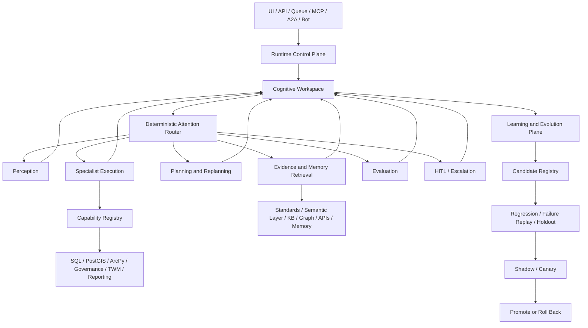

# GIS Data Agent Cognitive Runtime Design

**Date:** 2026-07-15<br>
**Status:** User-approved architecture design<br>
**Primary pilot:** Data-standard-driven spatial data governance<br>
**Target autonomy:** Supervised autonomous execution with controlled self-evolution

## 1. Executive Summary

GIS Data Agent already contains most ingredients commonly associated with an agent “brain”: multiple agents and workflows, semantic models, a standards platform, knowledge retrieval, graph capabilities, memory, planners, evaluators, guardrails, HITL, observability, prompt management, tool evolution, and self-evolution modules.

The missing capability is not another general-purpose agent or a larger RAG system. The missing capability is a coherent cognitive runtime that gives those modules:

- one typed source of runtime state;
- deterministic control over the next action;
- explicit evidence and knowledge provenance;
- constrained specialist execution;
- evaluator-controlled retry and replanning;
- unified identity, policy, budget, checkpoint, and trace semantics;
- structured experience learning;
- versioned, evaluated, reversible self-evolution.

This design defines the GIS Data Agent “brain” as:

> A Cognitive Runtime centered on a typed workspace, grounded in multi-source evidence and data standards, using deterministic attention routing to control perception, retrieval, planning, execution, and evaluation, changing real system state through specialist GIS tools, and improving through a controlled candidate-evaluation-canary-promotion-rollback loop.

The first end-to-end acceptance path is data-standard-driven spatial data governance because it exercises all required capabilities: authoritative knowledge, semantic mapping, planning, SQL/GIS/ArcPy execution, deterministic rules, artifacts, evaluation, HITL, memory, and evolution.

## 2. Goals

The Cognitive Runtime must:

1. convert natural-language goals into typed task contracts;
2. retrieve authoritative, current, permission-filtered evidence;
3. compile data standards into machine-readable and executable knowledge;
4. generate executable task graphs rather than prose-only plans;
5. select capabilities and narrow specialist tool manifests;
6. execute real SQL, PostGIS, ArcPy, governance, TWM, and reporting operations;
7. validate contracts, evidence, domain rules, execution, artifacts, and outcomes;
8. retry, retrieve, replan, request HITL, escalate, or terminate deterministically;
9. preserve trace, checkpoint, lineage, versions, and rollback information;
10. learn structured episodic and procedural experience;
11. produce evolution candidates from evidence-backed failures and feedback;
12. promote only candidates that pass regression, holdout, safety, shadow, and canary gates.

## 3. Non-Goals

The first implementation will not:

- allow an LLM to modify production code directly;
- perform online model-weight updates;
- eliminate HITL for high-risk operations;
- convert all project information into vector embeddings;
- replace SQL, PostGIS, ArcPy, semantic models, or executable rules with RAG;
- split every cognitive module into a separate microservice;
- build a knowledge graph for every data object;
- migrate away from PostgreSQL before a measured bottleneck exists;
- simultaneously rewrite all existing pipelines;
- store complete chat transcripts as unfiltered long-term memory;
- expose all tools to one general-purpose Agent.

## 4. Design Principles

1. **The brain is the runtime, not the LLM.** Models are replaceable reasoning providers.
2. **Evidence before action.** Domain claims and plans must reference evidence or live tool facts.
3. **Typed contracts before prompt conventions.** Control flow cannot depend on free-text verdicts.
4. **Deterministic control around stochastic reasoning.** LLMs propose; the runtime validates and decides.
5. **Capabilities before tools.** Planners select bounded capabilities, not hundreds of raw functions.
6. **Published standards are compiled knowledge.** Original text, structured objects, and executable rules coexist.
7. **Live facts outrank retrieved prose.** SQL, PostGIS, ArcPy, and APIs are authoritative for current state.
8. **Memory is curated experience.** Long-term memory passes importance, evidence, privacy, and conflict gates.
9. **Evaluation controls closure.** Generators cannot declare their own work complete.
10. **Evolution requires proof.** A change is not an improvement until it beats the current version under controlled evaluation.
11. **Safety gates can veto quality gains.** Permission or security regression always blocks promotion.
12. **Start as a modular monolith.** Service decomposition follows observed scale and isolation needs.

## 5. High-Level Architecture



## 6. Runtime Control Plane

Every entry point must use one runtime factory. UI, headless APIs, MCP, A2A, queues, CLI, TUI, and bots cannot instantiate a weaker Runner configuration.

The control plane owns:

- `RuntimeIdentity`: tenant, user, role, organization, permissions, data scopes;
- `RuntimePolicy`: required plugins, side-effect policy, HITL policy, model policy;
- budgets: iterations, tokens, cost, time, tool failures, retrieval calls;
- prompt, model, tool, knowledge, rule, evaluator, and workflow versions;
- trace metadata and correlation IDs;
- checkpoint, resume, idempotency, and cancellation;
- mandatory guardrails and provenance capture.

Authorization is deterministic. LLMs may explain a risk but cannot grant permission, widen data scope, or bypass HITL.

### 6.1 Runtime Identity

```python
class RuntimeIdentity(BaseModel):
    tenant_id: str
    user_id: str
    organization_id: str | None
    role: str
    permissions: set[str]
    data_scopes: set[str]
    knowledge_scopes: set[str]
    session_id: str | None
```

Identity is passed explicitly to retrieval, memory, capabilities, caches, and tools. Security-sensitive code must not depend on implicit `ContextVar` propagation across threads or workers.

## 7. Cognitive Workspace

The workspace is the shared typed working memory for one run. Modules exchange state through it rather than through unstructured conversation history.

```python
class RunWorkspace(BaseModel):
    run_id: str
    identity: RuntimeIdentity
    goal: str
    task_frame: TaskFrame | None
    risk_level: str
    plan: TaskGraph | None
    current_focus: str | None
    evidence_bundle: EvidenceBundle | None
    memory_hits: list[MemoryHit]
    observations: list[ToolObservation]
    artifacts: list[ArtifactReference]
    failed_approaches: list[FailedApproach]
    evaluator_feedback: list[QualityVerdict]
    confidence_profile: ConfidenceProfile | None
    budget: RunBudget
    versions: RuntimeVersions
    next_action: str | None
    termination_reason: str | None
```

### 7.1 Event-Sourced State

The runtime stores immutable events plus periodic checkpoints and a current-state projection.

Event types include:

```text
run_created
goal_perceived
clarification_requested
evidence_retrieved
evidence_conflict_detected
plan_created
plan_revised
tool_requested
tool_completed
tool_failed
quality_evaluated
hitl_requested
hitl_resolved
memory_written
evolution_event_created
run_terminated
```

The system records decision summaries, evidence, inputs, outputs, and versions. It does not require or expose private model chain-of-thought.

## 8. Deterministic Attention Router

The Attention Router selects the next state from a fixed action set:

```text
clarify
retrieve
plan
execute
evaluate
replan
retry_tool
request_hitl
respond
escalate
terminate
```

The router consumes workspace state and typed module outputs. An LLM may recommend an action, but code enforces valid transitions, budgets, risk policy, and stop conditions.

### 8.1 Termination Conditions

A run terminates when any condition is met:

- all success criteria pass;
- maximum iterations, cost, tokens, or wall time are exhausted;
- two consecutive iterations produce no material evidence, plan, or score improvement;
- required evidence cannot be obtained;
- permission or HITL is denied;
- no safe fallback remains;
- the user cancels the run.

Valid terminal states are `success`, `partial_success`, `needs_input`, `awaiting_hitl`, `unsafe_to_continue`, and `failed_with_checkpoint`.

## 9. Perception and Task Framing

Perception converts a user goal and available context into a typed task contract. It does not generate the execution graph.

```python
class TaskFrame(BaseModel):
    goal: str
    task_type: str
    target_assets: list[str]
    desired_outputs: list[str]
    constraints: list[str]
    standard_scope: list[str]
    spatial_scope: str | None
    temporal_scope: str | None
    ambiguities: list[str]
    missing_inputs: list[str]
    risk_level: Literal["low", "medium", "high", "critical"]
    success_criteria: list[str]
```

Missing target data, standard versions, output requirements, or write permissions trigger clarification rather than inference.

## 10. Knowledge and Evidence Architecture

The runtime uses multiple knowledge types, each stored and queried according to its semantics.

| Knowledge type | Examples | Primary mechanism | Authority |
|---|---|---|---|
| Normative | standards, laws, policies, specifications | hybrid retrieval + Standards Platform | valid published versions only |
| Semantic | terms, metrics, fields, ontologies, lineage | semantic layer + SQL + graph | published structured state |
| Operational | current data, GIS features, service and model state | SQL, PostGIS, ArcPy, APIs | highest for live facts |
| Procedural | governance, analysis, mapping, and recovery procedures | workflows, Skills, capability templates | versioned and evaluated |
| Episodic | prior runs, outcomes, failures, corrections | structured event memory | advisory unless verified |
| Parametric | general model knowledge | foundation models | lowest for domain facts |

Knowledge precedence is:

```text
live tool facts
> active published standards and executable rules
> organization-reviewed knowledge
> verified experience
> unverified candidate knowledge
> model parametric knowledge
```

Conflicts lower confidence and trigger retrieval, replanning, or HITL. The runtime does not average conflicting standards or silently choose the most semantically similar result.

## 11. Evidence Bundle

All retrieval providers return a shared contract.

```python
class EvidenceItem(BaseModel):
    evidence_id: str
    source_type: str
    claim: str
    content: str
    source_ref: str
    version: str | None
    effective_at: datetime | None
    region_scope: list[str]
    permission_scope: list[str]
    retrieval_methods: list[str]
    relevance_score: float
    authority_score: float
    verification_status: str

class EvidenceBundle(BaseModel):
    query: str
    items: list[EvidenceItem]
    applicable_rules: list[RuleReference]
    conflicts: list[EvidenceConflict]
    missing_evidence: list[str]
    coverage_score: float
    sufficient: bool
```

Planning, evaluation, reporting, and HITL use the same bundle, preventing independent agents from grounding themselves in inconsistent standard versions.

## 12. Data Standards as Compiled Knowledge

A published standard exists in three synchronized forms:

1. original text for citation and audit;
2. structured objects for terms, clauses, data elements, value domains, references, versions, and applicability;
3. executable rules for schemas, value domains, QC, spatial policy, semantic hints, synonyms, and derivation.

The Standards Platform compiles an active version into a `StandardKnowledgePack`:

```python
class StandardKnowledgePack(BaseModel):
    pack_id: str
    standard_id: str
    version: str
    publisher: str
    effective_period: DateRange
    applicable_regions: list[str]
    applicable_business: list[str]
    clauses: list[ClauseReference]
    data_elements: list[DataElementDefinition]
    terms: list[TermDefinition]
    value_domains: list[ValueDomainDefinition]
    executable_rules: list[ExecutableRule]
    citations: list[CitationReference]
    supersedes: list[str]
    superseded_by: list[str]
    content_hash: str
    approval_status: str
```

RAG finds and explains normative text. Published executable rules make compliance decisions. A retrieved paragraph alone cannot authorize a production data mutation.

## 13. Hybrid Retrieval Router

The retrieval path is:

```text
query analysis
-> RuntimeIdentity and ACL
-> time, region, business, version, and status filters
-> parallel retrieval
   - PostgreSQL FTS/BM25-like lexical retrieval
   - pgvector dense retrieval
   - structured SQL lookup
   - relationship/graph lookup
   - PostGIS spatial lookup
   - live API/tool lookup
   - episodic/procedural memory lookup
-> RRF or weighted fusion
-> reranking
-> permission, validity, and conflict verification
-> EvidenceBundle
```

ACL filtering occurs before retrieval. Cache keys include tenant, user or role scope, knowledge scope, provider version, and ACL digest.

### 13.1 Initial Retrieval Technology

| Capability | Initial choice | Upgrade trigger |
|---|---|---|
| lexical search | PostgreSQL FTS + trigram | million-scale corpora or complex aggregations |
| vector search | pgvector HNSW | independent vector scaling or geographic sharding |
| fusion | RRF | sufficient labeled interaction data for learning-to-rank |
| reranking | small cross-encoder or constrained LLM | domain-labeled data for a specialized reranker |
| graph | existing relational/graph capabilities | multi-hop traversal becomes a dominant workload |
| embedding | existing EmbeddingGateway | benchmark-supported domain model replacement |

OpenSearch, Qdrant, Milvus, a dedicated graph database, ColBERT, or domain rerankers remain provider-level upgrades rather than core-runtime dependencies.

## 14. Memory Architecture

Knowledge and memory remain distinct.

| Memory type | Content | Storage |
|---|---|---|
| working | current goal, plan, evidence, observations, budgets | workspace/event store |
| episodic | what happened in a prior run and its outcome | structured PostgreSQL events |
| procedural | successful and failed tool chains under known conditions | workflow/Skill registry |
| semantic profile | stable user or organization preferences | structured profile + optional vector index |

### 14.1 Memory Write Gate

Before long-term storage, the gate checks:

- importance and future utility;
- duplication;
- supporting evidence;
- contradictions with existing memory;
- sensitive or regulated information;
- tenant and user visibility;
- retention and expiry;
- memory type;
- whether human confirmation is required.

Raw events remain the auditable source. Structured memories, embeddings, and compressed summaries are derived and rebuildable.

## 15. Planning and Task Graphs

The Planner outputs a typed DAG:

```python
class TaskNode(BaseModel):
    node_id: str
    goal: str
    capability: str
    dependencies: list[str]
    input_refs: list[str]
    preconditions: list[str]
    expected_output_schema: str
    verification_rules: list[str]
    side_effect_level: str
    retry_policy: RetryPolicy
    fallback_capabilities: list[str]
```

Plans are validated for acyclicity, capability existence, permission, required evidence, input availability, side effects, output contracts, and budget before execution.

## 16. Capability-Based Execution

The Planner selects a capability, not a raw function.

```python
class CapabilityDefinition(BaseModel):
    capability_id: str
    version: str
    description: str
    task_types: list[str]
    input_schema: dict
    output_schema: dict
    required_permissions: list[str]
    side_effect_level: str
    tools: list[ToolReference]
    specialist_agent: str | None
    estimated_cost: dict
    timeout_seconds: int
    retry_policy: dict
    evaluator_ids: list[str]
```

Specialists include standards governance, spatial analysis, NL2SQL, ArcPy, TWM planning, visualization, and reporting. Front-door agents expose only a small meta-tool set. A specialist normally receives no more than approximately ten primary tools; larger capability families use secondary dynamic loading.

### 16.1 Tool Invocation Contract

```python
class ToolInvocation(BaseModel):
    run_id: str
    node_id: str
    tool_name: str
    tool_version: str
    arguments: dict
    input_artifacts: list[str]
    idempotency_key: str
    side_effect_level: str
    expected_result_schema: str
```

Side-effect levels are:

| Level | Example | Policy |
|---|---|---|
| L0 | search, describe, retrieve | automatic |
| L1 | read-only analysis, temporary output | automatic with audit |
| L2 | create new table, dataset version, or artifact | policy check; optional batch approval |
| L3 | modify production data or publish a standard | mandatory HITL |
| L4 | delete, overwrite, or external formal publication | double confirmation and rollback plan |

## 17. Evaluation and Confidence

Evaluation has five layers:

1. contract validation;
2. evidence and citation validation;
3. domain-rule validation;
4. execution-path and parameter validation;
5. outcome and artifact validation.

```python
class QualityVerdict(BaseModel):
    decision: Literal[
        "pass", "revise", "retrieve", "replan",
        "retry_tool", "request_hitl", "escalate"
    ]
    score: float
    passed_rules: list[str]
    issues: list[str]
    evidence_gaps: list[str]
    failed_node_ids: list[str]
    next_action: str
    confidence_profile: dict
```

Generators do not declare their own work complete. Evaluator decisions drive routed workflow edges.

### 17.1 Confidence Profile

Confidence is derived from observable signals:

```text
retrieval coverage
source authority
version validity
schema validation
domain-rule pass rate
tool success rate
cross-check agreement
historical capability success
unknown-input ratio
unresolved conflicts
```

The runtime uses confidence to select automatic execution, additional retrieval, HITL, or escalation. Model self-reported probability is not treated as calibrated confidence.

## 18. Error Recovery

| Failure | Response |
|---|---|
| missing valid standard | broaden or change retrieval; request standard selection |
| conflicting standards | create conflict report and request HITL |
| low-confidence field mapping | request mapping confirmation |
| tool argument failure | revise typed arguments and retry within budget |
| repeated tool failure | use a registered fallback capability |
| blocking data-quality failure | stop downstream nodes and create remediation prerequisites |
| dependency or planning error | replan the affected subgraph |
| two iterations without improvement | declare stagnation and escalate or terminate |
| insufficient permission | request authorization; never route around policy |
| budget exhaustion | return completed work, missing work, and a resume checkpoint |

## 19. HITL Design

HITL is required for:

- high-risk or irreversible writes;
- standard publication and formal compliance conclusions;
- evidence or rule conflicts;
- low-confidence semantic mappings;
- candidate changes to production prompts, Skills, tools, rules, permissions, or models;
- requests to widen data or permission scope after repeated failure.

An approval request includes action, rationale, evidence, affected assets, expected result, risks, rollback, and alternatives. HITL is risk-focused, not a requirement to approve every tool call.

## 20. Controlled Self-Evolution

Self-evolution is asynchronous and versioned:

```text
production traces and outcomes
-> failure attribution
-> EvolutionEvent
-> CandidateArtifact
-> regression + failure replay + holdout
-> shadow
-> canary
-> promote or roll back
```

### 20.1 Evolvable Artifacts

| Risk | Artifact | Promotion |
|---|---|---|
| L0 | indexes, new documents, expiry markers | automatic after ingestion and ACL checks |
| L1 | experience memories, synonyms, retrieval thresholds | automatic candidate; evaluated canary |
| L2 | prompts, tool descriptions, routing, workflows, Skills | regression, shadow, canary |
| L3 | executable rules, evaluators, code | authority evidence and HITL |
| L4 | model weights and permission policy | independent training/security process and HITL |

Initial work focuses on L0-L2.

### 20.2 Evolution Contracts

```python
class EvolutionEvent(BaseModel):
    event_id: str
    source_run_ids: list[str]
    failure_type: str
    affected_capability: str
    observed_behavior: str
    expected_behavior: str
    evidence_refs: list[str]
    business_impact: str
    frequency: int
    severity: str

class CandidateArtifact(BaseModel):
    candidate_id: str
    artifact_type: str
    parent_version: str
    proposed_content: dict
    supporting_events: list[str]
    expected_improvements: list[str]
    known_risks: list[str]
    required_eval_suites: list[str]
    promotion_policy: str
```

### 20.3 Evaluation Sets

Every candidate runs against:

- an immutable regression set;
- the triggering failure-replay set;
- an unseen holdout set;
- security and permission veto sets;
- cost and latency budgets.

Candidate evaluation is performed independently from candidate generation. Safety, authorization, or core correctness regression rejects the candidate regardless of average quality gain.

### 20.4 Promotion Governor

```python
class PromotionDecision(BaseModel):
    decision: Literal["reject", "revise", "shadow", "canary", "promote"]
    passed_gates: list[str]
    failed_gates: list[str]
    metric_deltas: dict[str, float]
    risk_level: str
    requires_hitl: bool
    rollback_version: str
```

The Governor prevents reward hacking, self-evaluation, uncontrolled promotion frequency, and direct production mutation.

## 21. Proposed Package Boundaries

```text
data_agent/cognitive_runtime/
├── contracts.py
├── identity.py
├── runtime.py
├── runner_factory.py
├── workspace.py
├── event_store.py
├── checkpoint.py
├── attention_router.py
├── perception.py
├── planning/
├── retrieval/
├── execution/
├── evaluation/
├── memory/
└── evolution/
```

Each package exposes typed interfaces. The complete tree is a target boundary map, not a requirement to create all files in one change.

## 22. Core Data Model

The target persistent entities are:

```text
agent_brain_run
agent_brain_event
agent_brain_checkpoint
agent_evidence_item
agent_memory_item
agent_memory_relation
agent_evolution_event
agent_evolution_candidate
agent_candidate_eval
agent_promotion
agent_runtime_version
```

Existing feedback, evaluation history, prompt versions, standards assets, and memory tables are reused or migrated. The design avoids a second parallel feedback or evaluation database.

## 23. Existing Module Integration

| Existing module | Target role |
|---|---|
| `agent.py` | specialist definitions; remove giant global orchestration gradually |
| `pipeline_runner.py` | wrapped by the mandatory RunnerFactory |
| `ContextEngine` | retrieval-provider adapter after identity/cache hardening |
| `conversation_memory.py` | memory repository behind explicit retrieval and write gates |
| `workflow_engine.py` | task-graph execution foundation |
| `task_decomposer.py` | planning component; no independent pipeline invocation |
| `plan_refiner.py` | invoked by Attention Router in `replan` state |
| `plugins.py` | mandatory RuntimePolicy stack |
| `mcp_hub.py` | external capability provider with explicit identity |
| Standards Platform | StandardKnowledgePack compiler and rule authority |
| Semantic Layer | structured semantic evidence provider |
| OTel and DecisionTracer | generated from runtime events and spans |
| self/tool/prompt evolution modules | adapters into the unified Evolution Plane |

## 24. Model Strategy

Models are selected by task:

```text
fast model: intent, extraction, simple classification
standard model: domain interpretation, retrieval rewrite, reporting
reasoning model: complex planning, conflict analysis, failure attribution
specialized models: embeddings, reranking, OCR, vision, GIS/world models
```

The ModelGateway remains the abstraction. Stronger models improve candidates but do not replace contracts, policy, evaluation, or deterministic state transitions.

## 25. Deployment Evolution

1. **Modular monolith:** Cognitive Runtime, PostgreSQL, pgvector, existing workers.
2. **Background separation:** retrieval indexing, memory compression, and candidate evaluation workers.
3. **Capability services:** high-cost ArcPy, GIS, TWM, and model inference services.
4. **Federated specialists:** remote MCP/A2A capabilities across organizations.

## 26. Primary Pilot: Standard-Driven Data Governance

### 26.1 Input

```text
user governance goal
target data assets
target standard or business scope
allowed side-effect level
desired outputs
```

### 26.2 Task Graph

```text
data profiling
-> valid standard selection
-> field-to-data-element mapping
-> gap analysis
-> remediation plan
-> HITL for writes
-> create governed data version
-> standards/QC/spatial validation
-> artifacts, evidence report, and lineage
```

### 26.3 Required Artifacts

```text
governed_dataset
field_mapping
gap_matrix
remediation_plan
quality_report
rule_execution_report
evidence_manifest
lineage_manifest
run_trace
```

Artifacts include schema, hash, version, lineage, and originating run.

## 27. Implementation Phases

### Phase 0: Baseline and Contracts

- establish 50-100 real governance tasks;
- include positive, negative, missing-data, permission, and tool-failure cases;
- freeze current prompt, model, tool, and standards versions;
- measure current completion, human correction, cost, and latency;
- create an immutable security and authorization set.

### Phase 1: Runtime Kernel

- RuntimeIdentity;
- RunnerFactory;
- RunWorkspace and events;
- Attention Router v1;
- TaskFrame, TaskGraph, and QualityVerdict;
- checkpoint and resume;
- true routed quality loops.

### Phase 2: Standards Knowledge Brain

- StandardKnowledgePack compiler;
- governed ontology authority store, knowledge compiler, immutable OntologyPackage, and identity-aware OntologyResolver;
- operational object/action/function/interface contracts and dynamic object/property/link/action policy semantics;
- lexical + vector + structured retrieval;
- EvidenceBundle;
- validity, region, time, and ACL filters;
- citation and conflict evaluation.

### Phase 3: End-to-End Governance

- capability registry and narrow specialists;
- ActionType-to-Capability-to-Tool bindings, ObjectInstanceRef, ChangeSet, ActionResult, and typed consumption contracts;
- full governance task graph;
- deterministic rules and domain evaluation;
- artifact, lineage, HITL, and partial-failure recovery.

### Phase 4: Memory and Experience

- memory write gate;
- episodic and procedural memory;
- experience retrieval evaluation;
- compression, retention, correction, and deletion.

### Phase 5: Offline Evolution

- EvolutionEvent and Candidate Registry;
- failure attribution;
- regression, replay, and holdout orchestration;
- candidate reports and HITL review.

### Phase 6: Shadow, Canary, and Low-Risk Promotion

- champion/challenger shadow execution;
- side-effect-free dry runs;
- canary routing;
- Evolution Governor;
- rollback rehearsal;
- limited L0-L2 automatic promotion.

### Phase 7: Domain Expansion

- NL2Semantic2SQL;
- ArcPy analysis;
- remote sensing;
- farmland DRL;
- TWM/MPC planning;
- automated standards derivation;
- federated specialists.

## 28. Acceptance Gates

### 28.1 Runtime Gates

- all entry points use the same mandatory runtime policy;
- all state transitions and module outputs are typed;
- `revise` and `replan` cause real routed execution;
- checkpoint recovery works;
- traces reproduce goal, plan, evidence, tools, evaluation, and termination;
- cross-tenant context, memory, and tool leakage is zero.

### 28.2 Retrieval Gates

Initial engineering targets are:

| Metric | Gate |
|---|---:|
| correct standard Recall@10 | at least 90% |
| correct clause Recall@10 | at least 85% |
| citation support precision | at least 95% |
| standard-version validity | 100% |
| unauthorized retrieval | 0 |
| unmarked use of expired standards | 0 |

### 28.3 Governance Gates

- all outputs have schema, hash, version, and lineage;
- formal conclusions trace to rules, clauses, or live tool facts;
- low-confidence mappings enter HITL;
- write operations create new versions rather than overwrite originals;
- failed nodes can be retried or replanned locally;
- at least one real or desensitized dataset passes the complete workflow.

### 28.4 Evolution Gates

- every candidate has source events and a parent version;
- failure-set improvement is measurable;
- immutable regression and holdout sets do not regress beyond policy;
- security and permission regressions are zero;
- candidates do not evaluate themselves;
- rollback is tested before promotion;
- production knowledge and behavior are unchanged by failed candidates.

## 29. Metrics

### Business

- end-to-end task completion;
- usable artifact rate;
- human correction volume;
- governance issue remediation rate;
- formal report adoption.

### Cognitive

- evidence recall and citation correctness;
- plan validity;
- tool and parameter correctness;
- replanning recovery;
- stagnation detection;
- confidently wrong result rate.

### Safety and Reliability

- unauthorized retrieval and execution;
- irreversible-operation incidents;
- checkpoint recovery;
- version reproducibility;
- rollback success.

### Evolution

- candidate acceptance;
- failure replay improvement;
- holdout generalization;
- regression and canary rollback rates;
- cost per accepted improvement.

## 30. Key Risks and Responses

| Risk | Response |
|---|---|
| overengineering | modular monolith and phased boundaries |
| pseudo-autonomy | artifact and evaluator-based completion |
| RAG misinterpretation | original citation + structured rules + evaluator |
| stale standards | validity, supersession, version, and time gates |
| retrieval leakage | pre-retrieval ACL and isolated caches |
| retrieved prompt injection | treat documents as untrusted data |
| tool side effects | typed invocation, risk levels, HITL, rollback |
| infinite loops | budgets, attempt fingerprints, stagnation detection |
| memory pollution | write gate, evidence, correction, retention |
| reward hacking | immutable veto sets and independent evaluators |
| vendor lock-in | provider adapters and stable contracts |
| cost and latency | model tiers, fast paths, caching, and explicit budgets |

## 31. Architecture Decisions

1. The brain is a Cognitive Runtime, not a single LLM.
2. The system begins as a modular monolith.
3. Typed workspace and events are the state backbone.
4. A deterministic router controls cognitive transitions.
5. Knowledge is multi-source evidence, not one vector database.
6. Data standards are compiled into text, structured definitions, and executable rules.
7. Planners select capabilities rather than raw tools.
8. Tools use side-effect levels, idempotency, and output contracts.
9. Independent evaluation controls task closure.
10. Confidence derives from observable signals.
11. Long-term memory requires a write gate.
12. Self-evolution uses candidates, evaluation, shadow, canary, promotion, and rollback.
13. Security and permission checks can veto evolution.
14. Live GIS and business facts come from tools, not retrieved prose.
15. Standard-driven governance is the first end-to-end acceptance path.

## 32. Implementation Decomposition

This document is an umbrella architecture specification, not a single implementation-plan scope. Delivery is decomposed into independently testable subprojects:

1. **Runtime Kernel:** RuntimeIdentity, mandatory RunnerFactory, typed workspace/events, Attention Router v1, TaskFrame, TaskGraph, QualityVerdict, checkpoint, and true routed quality loops.
2. **Standards Knowledge Brain:** StandardKnowledgePack, governed domain and operational ontology, Object/Action/Function/Interface contracts, OntologyPackage/Resolver, EvidenceBundle, hybrid retrieval, dynamic policy semantics, validity and ACL filters, citation and conflict evaluation.
3. **Governance Pilot:** ActionType-to-Capability-to-Tool bindings, narrow specialists, typed SDK/REST/MCP/A2A contracts, ChangeSet/ActionResult, end-to-end standard-driven governance, artifacts, lineage, HITL, writeback, rollback, and partial-failure recovery.
4. **Memory and Experience:** memory write gate, episodic and procedural memory, retrieval evaluation, retention, correction, and deletion.
5. **Controlled Evolution:** EvolutionEvent, candidate registry, replay and holdout evaluation, shadow, canary, Governor, promotion, and rollback.

Each subproject must produce deployable and testable value without requiring the later subprojects. Dependencies are sequential: the Standards Knowledge Brain depends on Runtime Kernel identity and workspace contracts; the governance pilot depends on runtime and evidence contracts; memory depends on stable run events and evaluation; controlled evolution depends on all previous trace, evaluation, version, and rollback semantics.

The first implementation plan created from this specification must cover only the Runtime Kernel subproject. Later subprojects receive separate specifications or implementation plans after the preceding acceptance gates pass.

## 33. Domain Ontology Production Addendum

The domain ontology is the governed semantic skeleton of the Cognitive Runtime, not the brain itself. It defines domain concepts, relationships, applicability, constraints, and capability semantics. Runtime policy, authorization, routing, tool execution, evaluation, memory, and promotion remain owned by their respective runtime modules.

The Palantir benchmark exposes a necessary distinction between a knowledge ontology and an operational ontology. The operational layer must add ObjectType, PropertyType, LinkType, ActionType, FunctionType, InterfaceType, ObjectInstanceRef, ChangeSet, and ActionResult. ActionType binds a target object and state transition to a versioned Capability, Tool Manifest, policy decision, approval rule, idempotency rule, compensation path, and independent Evaluator.

The repository already contains ontology foundations: the GIS YAML `OntologyReasoner`, the `mmfe.semantic_ontology.v1` package, and Standards Platform terms, data elements, value domains, references, derivations, impact graphs, and version workflows. These are inputs to a unified compiler; none is treated as a complete production ontology service.

Production uses one authoritative write model and multiple rebuildable read projections:

1. **Stage 1:** PostgreSQL authority store, typed JSON packages, bounded SQL/graph traversal, FTS/pgvector candidate generation, safe rule DSL, version/ACL/provenance/review, and an identity-aware resolver.
2. **Stage 2:** SKOS, SHACL, PROV-O, required GeoSPARQL terms, JSON-LD/RDF export, and build-time RDFLib/pySHACL validation. OWL reasoning is restricted to an evaluated offline OWL 2 RL subset.
3. **Stage 3:** Apache Jena Fuseki/TDB2 may be added as a read-only RDF/SPARQL projection only when representative benchmarks or interoperability requirements prove PostgreSQL/package serving insufficient.
4. **Stage 4:** signed packages, federated namespaces, cross-organization mapping governance, and candidate/evaluation/shadow/canary/rollback for controlled ontology evolution.

PostgreSQL remains the authority even after Stage 3. RDF stores, property graphs, vector indexes, and search engines cannot become independent writable truth sources. LLMs may propose ontology candidates but cannot publish authoritative concepts, exact equivalence, constraints, or executable rules. Runtime formulas use an allowlisted declarative DSL; arbitrary Python, SQL, shell, `eval`, or retrieved instructions are prohibited.

Dynamic authorization covers object visibility, property visibility/editability, link traversal, Action discovery/planning/execution, ActionResult visibility, and AI context inclusion. An OSDK-like typed consumption layer keeps Python, TypeScript, REST/OpenAPI, MCP/A2A, UI forms, approvals, and Evaluator contracts aligned. Ontology and Action changes follow dev namespace, diff, impact analysis, compatibility/security regression, review, shadow, activation, monitoring, and rollback.

Detailed contracts, technology comparison, acceptance gates, security controls, and logical entities are maintained in `docs/designs/gis_data_agent_cognitive_runtime_2026-07-15/GIS_Data_Agent_Cognitive_Runtime_详细设计说明书.md`.

## 34. Heavy Ontology Conditional Target Addendum

The enterprise heavy-ontology route is a conditional target, not a prerequisite for the Cognitive Runtime. It adds an Ontology Studio and governance control plane, Canonical Model Registry, RDF/OWL/SHACL serving, an operational object graph, Semantic Query Gateway, dynamic policy engine, Object & Action Service, Kafka/Redpanda projection propagation, projection reconciliation, ontology CI/CD, SDK generation, HA, backup, disaster recovery, and platform observability.

PostgreSQL/PostGIS remains the business and transaction truth; Standards Platform remains the standard review and release authority. The Model Registry governs ontology packages and release metadata. RDF, graph, search, and vector stores remain rebuildable projections and cannot become independent writable business truth sources. Nationwide parcel, raster, point-cloud, and trajectory facts are not copied wholesale into RDF; PostGIS, ArcPy, object storage, and TWM continue to execute large-scale spatial workloads.

The conditional delivery route is:

1. **H0 — Entry gate and competency questions:** prove stable gaps in the lightweight Stage 1/2 route using business questions, interoperability requirements, capacity/SLO evidence, security cases, team readiness, and TCO.
2. **H1 — Governance and Canonical Model Registry.**
3. **H2 — RDF/SHACL build and validation with SKOS, PROV-O, required GeoSPARQL/OWL-Time terms, and bounded OWL 2 RL evaluation.**
4. **H3 — Policy-aware Semantic Query Gateway and conditional dedicated RDF serving.**
5. **H4 — Operational Object & Action Service and typed SDKs.**
6. **H5 — Event propagation, multi-projection reconciliation, rebuild, and failure handling.**
7. **H6 — HA, DR, observability, SDK compatibility, and release governance.**
8. **H7 — Cross-organization signed namespaces and federated mappings.**

H3 and later are not mandatory when the lightweight route satisfies approved SLO and interoperability needs. The RDF platform, policy engine, event technology, deployment topology, capacity, RPO/RTO, staffing, and vendor decisions remain `needs-owner-input` and require separate ADRs and representative PoCs.

## 35. Final Definition

The GIS Data Agent brain is:

> A model-agnostic, evidence-grounded, standards-and-ontology-aware, capability-driven Cognitive Runtime that maintains typed state, executes specialist tools under deterministic policy, evaluates real artifacts and outcomes, learns curated experience, and performs controlled self-evolution through versioned and reversible promotion.
