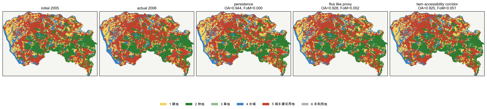
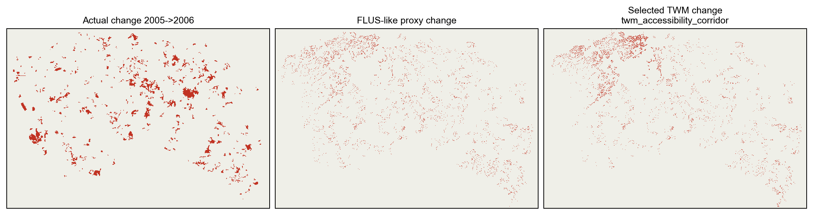
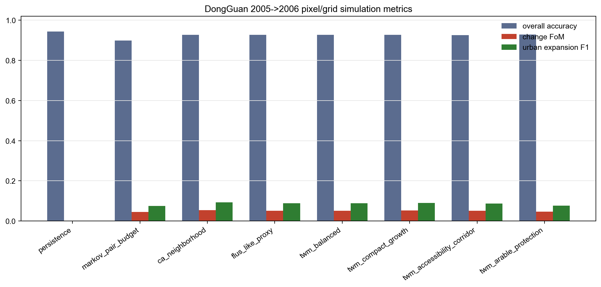
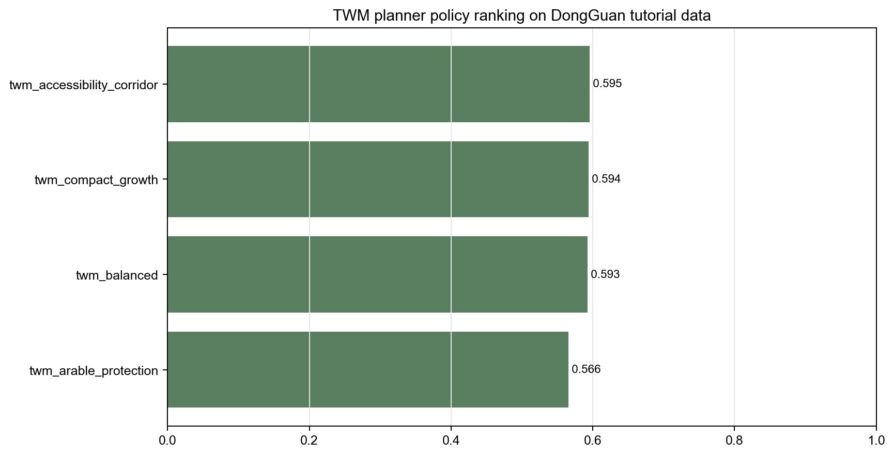

# TWM DongGuan GeoSOS 像元级模拟与规划优化对比

更新日期：2026-06-22

## 1. 结论

这次结果比前一版“数据适配和门控通过”更进一步：已经生成 2005->2006 holdout 的像元级预测图、同口径像元指标、透明 baseline，以及 TWM planner 候选方案排序。

但这里仍然不能写成“已经击败官方 GeoSOS/FLUS”。原因是当前数据包没有提供 GeoSOS/FLUS 软件实际导出的 2006 预测图；本报告中的 `flus_like_proxy` 是透明代理基线，不是官方 FLUS 结果。

## 2. 渲染器输出

## 3. 模拟器指标

| candidate | OA | Kappa | change FoM | change F1 | urban F1 | violation rate | predicted change area |
|---|---:|---:|---:|---:|---:|---:|---:|
| persistence | 0.943746 | 0.920710 | 0.000000 | 0.000000 | 0.000000 | 0.000000 | 0.00 ha |
| markov_pair_budget | 0.898537 | 0.855893 | 0.045612 | 0.087244 | 0.075408 | 0.567899 | 12875.52 ha |
| ca_neighborhood | 0.927881 | 0.897727 | 0.053373 | 0.101337 | 0.092136 | 0.000000 | 5563.52 ha |
| flus_like_proxy | 0.927643 | 0.897390 | 0.051637 | 0.098203 | 0.088712 | 0.000000 | 5563.52 ha |
| twm_balanced | 0.927638 | 0.897383 | 0.051600 | 0.098137 | 0.088632 | 0.000000 | 5563.52 ha |
| twm_compact_growth | 0.927733 | 0.897517 | 0.052301 | 0.099403 | 0.089986 | 0.000000 | 5563.52 ha |
| twm_accessibility_corridor | 0.925397 | 0.894112 | 0.050567 | 0.096265 | 0.086498 | 0.000000 | 6122.88 ha |
| twm_arable_protection | 0.929349 | 0.899913 | 0.045882 | 0.087737 | 0.075958 | 0.000000 | 4892.16 ha |

## 4. 规划器候选方案

规划器选择：`twm_accessibility_corridor`。

| candidate | policy score | demand fit | constraint | protection | compactness | accessibility | ex-post FoM |
|---|---:|---:|---:|---:|---:|---:|---:|
| twm_accessibility_corridor | 0.595274 | 0.646565 | 1.000000 | 0.250000 | 0.343288 | 0.868387 | 0.050567 |
| twm_compact_growth | 0.594242 | 0.562235 | 1.000000 | 0.250000 | 0.546551 | 0.770626 | 0.052301 |
| twm_balanced | 0.592875 | 0.562235 | 1.000000 | 0.250000 | 0.504998 | 0.814990 | 0.051600 |
| twm_arable_protection | 0.565812 | 0.461019 | 1.000000 | 0.250000 | 0.495605 | 0.824149 | 0.045882 |

## 5. 研究边界

可以说：TWM 已经能在 DongGuan GeoSOS 教程数据上形成渲染器、模拟器、规划器组合输出，且能与 persistence、Markov、CA-neighborhood、FLUS-like proxy 做同案指标对比。

不能说：TWM 已经击败官方 GeoSOS/FLUS。要做这个结论，必须拿到 GeoSOS/FLUS 对同一训练期和 holdout 期导出的预测图，加入同一张指标表。

下一步应该补：实际 FLUS 输出图、ANN/logistic suitability、完整驱动因子校准、以及自然资源业务治理图层。
