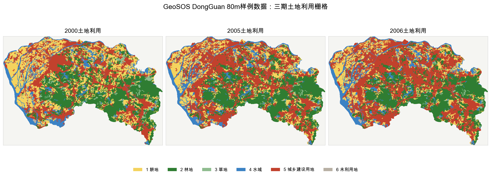
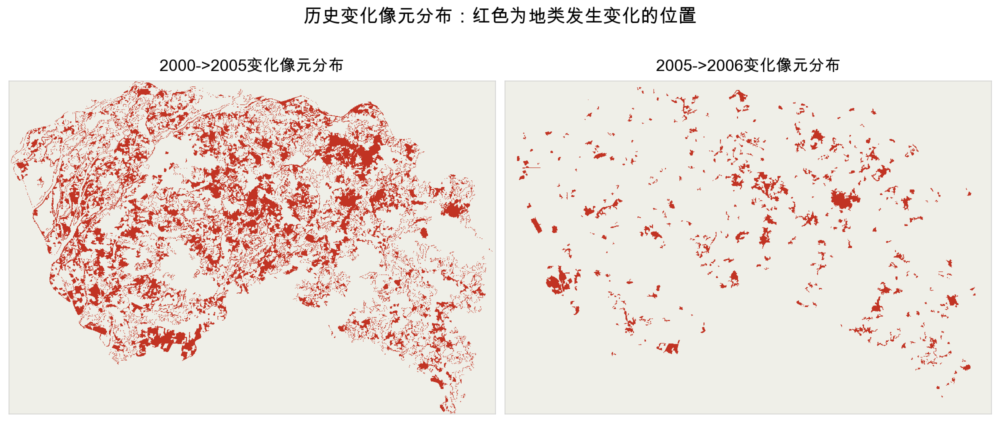
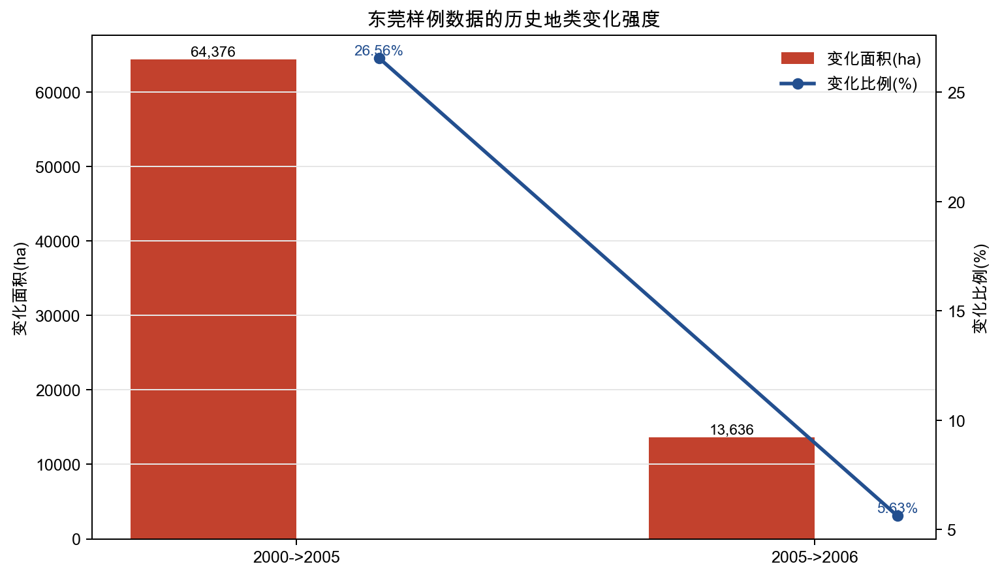
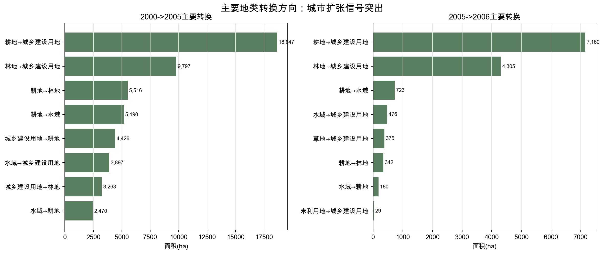
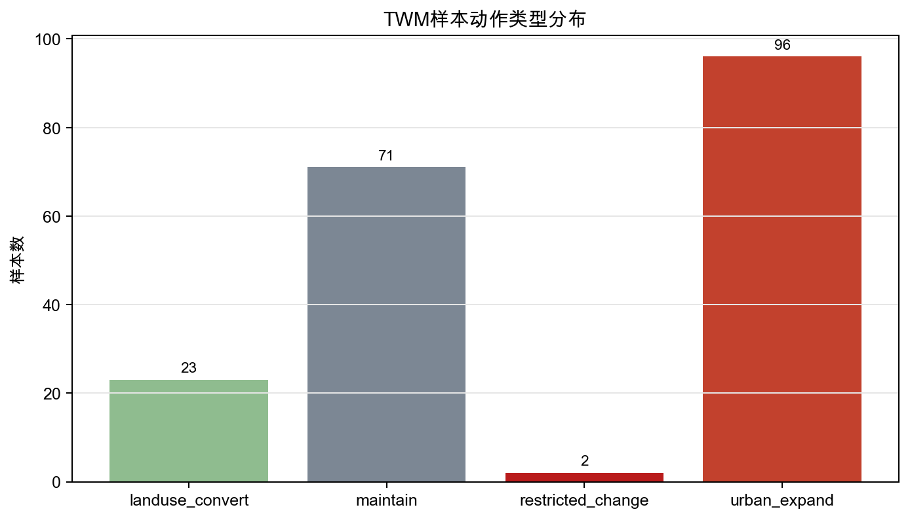
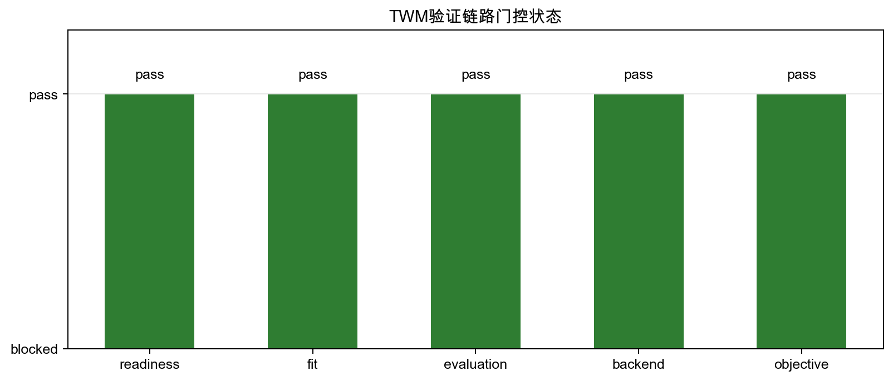
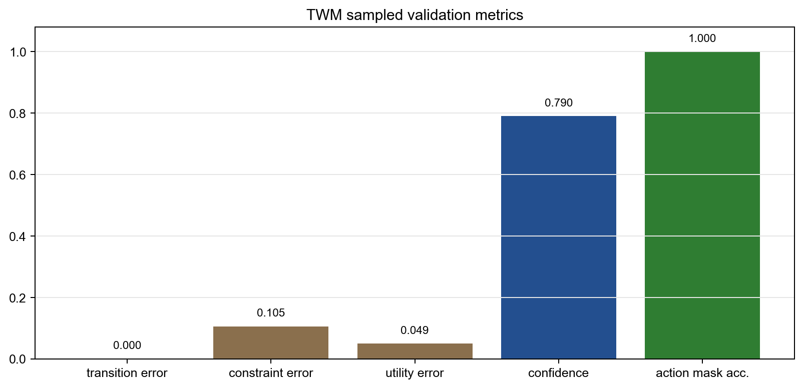

# TWM 基于 GeoSOS DongGuan 80m 样例数据的图文验证报告

更新日期：2026-06-22  
数据来源：`/Users/zhouning/Downloads/1TutorialData_DongGuan_80m.zip`  
验证报告：`docs/reports/twm_dongguan_geosos_validation_2026-06-22.json`

## 1. 结论摘要

这次工作已经把 GeoSOS DongGuan 80m 教程数据做成了一个独立的 TWM 对比验证任务。当前结果说明：

1. GeoSOS DongGuan 样例数据可以被 TWM 读取、解析，并转成 `territory_world_model.dynamics_training_dataset.v1` 形式的动作条件化动力学样本。
2. 2000->2005 和 2005->2006 两个历史变化期可以作为有真实下一状态的 temporal examples，用于 TWM 的 readiness、fit、evaluation、backend、training objective 门控验证。
3. 当前验证通过了 TWM 的 sampled benchmark adapter 链路，但这还不是 TWM 在像素级土地利用模拟上超过 GeoSOS/FLUS 的证据。
4. 这份数据适合作为 TWM 与 GeoSOS/FLUS 做同案对比的起点，但要支撑自然资源治理落地，还需要补充规划边界、用途管制规则、审批/监管记录、人工复核结果和真实业务行动标签。

严谨地说，本次成果是“GeoSOS 东莞教程数据 -> TWM 动作条件化多头动力学契约”的可复现适配验证，不是“TWM 已经优于 FLUS”的结论。

## 2. 论文依据

用户之前提供的两篇文献都可以作为这次对比验证的背景依据：

| 文献 | 本次可核验情况 | 对 TWM 对比验证的意义 |
|---|---|---|
| Liu et al. 2017, *A future land use simulation model (FLUS) for simulating multiple land use scenarios by coupling human and natural effects*, *Landscape and Urban Planning*, 168:94-116, DOI: `10.1016/j.landurbplan.2017.09.019` | 本地 PDF 与项目 BibTeX 均可核验；PDF 元数据包含题名、期刊、页码、DOI 和关键词 | 说明 FLUS 的核心任务是多地类 LUCC 情景模拟，技术路线是 top-down system dynamics + bottom-up cellular automata，并加入自适应惯性、土地类型竞争和 roulette allocation |
| `A Geographical Simulation and Optimization System Based on Coupling Strategies.pdf` | 本地 PDF 存在，但文本提取存在编码问题；目前按本地 PDF 与项目既有笔记引用，精确出版元数据仍需后续核验 | 说明 GeoSOS 是 simulation + optimization 的耦合系统，强调 CA、MAS、SI 等地理模拟与空间优化策略的组合 |

FLUS 论文中可以确定的关键方法点包括：

- 它把宏观土地需求预测与局部空间分配结合起来，使用 system dynamics 提供不同土地类型的需求量，用 cellular automata 在栅格空间中分配变化。
- 它不是只模拟一种地类扩张，而是面向多类土地利用/覆被变化，因此重点处理地类之间的相互作用和竞争。
- 它引入 self-adaptive inertia 和 competition mechanism，让各地类在 CA 迭代中动态调整继承性和竞争关系。
- 它用 ANN 估计各地类在格网单元上的 occurrence probability，再结合邻域效应、转换成本、惯性系数和 roulette selection 做分配。
- 论文报告其在中国 2000-2010 回放中相对 CLUE-S 和传统 CA 取得更好的 grid-to-grid agreement。

这意味着 GeoSOS/FLUS 是 TWM 在土地利用变化模拟方向必须认真对待的强基线，而不是可以轻易否定的旧方法。

## 3. 数据基础画像

GeoSOS DongGuan 80m 教程数据包包含：

- 行政边界：`Boundary/DongGuan.*`
- 三期土地利用栅格：`landuse2000.tif`、`landuse2005.tif`、`landuse2006.tif`
- 地类配置：`Config Files/DefaultLanduseInfo.xml`
- 转换约束矩阵：`Config Files/SuitableMatrix.xml`
- 驱动因子栅格：`dtcity`、`dtfreeway`、`dtrailway`、`dtroad`

本次 TWM 验证实际解析并使用了土地利用栅格、地类配置和转换约束矩阵。驱动因子目前还没有进入完整的同案 FLUS 式适宜性学习链路，因此下一步若要做严格 baseline 对比，应把这些驱动因子也纳入 pixel/grid backend。

| 指标 | 值 |
|---|---:|
| 栅格年份 | 2000, 2005, 2006 |
| 栅格尺寸 | 648 x 946 |
| 空间分辨率 | 80m x 80m |
| 像元面积 | 0.64 ha |
| 投影 | Krasovsky_1940_Albers |
| nodata | 0.0 |
| 地类数 | 6 |

地类体系如下：

| 编码 | 中文地类 | 英文地类 |
|---:|---|---|
| 1 | 耕地 | Arable Land |
| 2 | 林地 | Woodland |
| 3 | 草地 | Meadow |
| 4 | 水域 | Water |
| 5 | 城乡建设用地 | Construction Land |
| 6 | 未利用地 | Unused Land |

图上可以直接看到，2000、2005、2006 三期土地利用图具有明显的城市扩张与地类重分配信号。这使它适合作为 FLUS/GeoSOS 风格土地利用变化模拟的教程型 benchmark。

## 4. 历史变化信号

本次报告以 nodata 和 null value 过滤后的有效像元为口径统计历史变化。

| 时段 | 有效像元 | 变化像元 | 变化比例 | 变化面积 |
|---|---:|---:|---:|---:|
| 2000->2005 | 378,749 | 100,587 | 26.5577% | 64,375.68 ha |
| 2005->2006 | 378,754 | 21,306 | 5.6253% | 13,635.84 ha |

主要变化方向集中在建设用地扩张：

| 时段 | 主要变化方向 | 像元数 | 面积 |
|---|---|---:|---:|
| 2000->2005 | 耕地 -> 城乡建设用地 | 29,136 | 18,647.04 ha |
| 2000->2005 | 林地 -> 城乡建设用地 | 15,308 | 9,797.12 ha |
| 2000->2005 | 耕地 -> 林地 | 8,619 | 5,516.16 ha |
| 2000->2005 | 耕地 -> 水域 | 8,110 | 5,190.40 ha |
| 2005->2006 | 耕地 -> 城乡建设用地 | 11,187 | 7,159.68 ha |
| 2005->2006 | 林地 -> 城乡建设用地 | 6,726 | 4,304.64 ha |
| 2005->2006 | 耕地 -> 水域 | 1,129 | 722.56 ha |
| 2005->2006 | 水域 -> 城乡建设用地 | 744 | 476.16 ha |

这部分很关键：如果数据没有清晰变化信号，就不适合作为 TWM 动力学验证基础；现在的变化强度和方向都说明它有足够的历史转换信号，可以作为土地利用变化模拟的基础实验数据。

## 5. TWM 本次做了什么

本次新增的独立验证任务由 `scripts/run_twm_dongguan_geosos_validation.py` 完成。它直接读取真实 GeoSOS 教程 ZIP，而不是 mock 数据。

处理链路如下：

1. 解压并解析 GeoSOS 教程数据包。
2. 读取 `DefaultLanduseInfo.xml`，获得地类编码、中文名、英文名、可转换类型、不可转换类型和城市建设类型。
3. 读取 `SuitableMatrix.xml`，获得不同地类之间的允许转换矩阵。
4. 读取 2000、2005、2006 三期土地利用栅格。
5. 统计 2000->2005 与 2005->2006 的真实历史变化。
6. 把 sampled land-use cells 映射为 TWM 的 parcel-like tokens，并补充 block/township/county 上下文对象。
7. 补齐 TWM 需要的关系，包括 `annual_change_of_parcel` 和 `project_overlaps_planning_zone`。
8. 生成 `territory_world_model.dynamics_training_dataset.v1` 样本。
9. 运行 TWM readiness、fit、evaluation、backend、training objective 门控。

本次形成的 TWM 状态摘要：

| 项目 | 数量 |
|---|---:|
| TWM object count | 206 |
| TWM relation count | 965 |
| county | 1 |
| township | 1 |
| block | 4 |
| landuse_class | 6 |
| transition_period | 2 |
| parcel-like sampled cell | 192 |

## 6. TWM 动力学样本与门控结果

本次生成了 192 个真实历史时序样本，其中 candidate 96 个、holdout 96 个，全部来自观测到的历史状态转换，不包含 synthetic examples。

| 指标 | 值 |
|---|---:|
| examples | 192 |
| candidate examples | 96 |
| holdout examples | 96 |
| observed temporal examples | 192 |
| usable examples | 192 |
| synthetic examples | 0 |
| not-for-production examples | 192 |
| action-mask blocked count | 50 |

动作类型分布如下：

| action type | 样本数 | 解释 |
|---|---:|---|
| urban_expand | 96 | 目标地类为城乡建设用地且发生变化 |
| maintain | 71 | 地类保持不变 |
| landuse_convert | 23 | 一般地类转换 |
| restricted_change | 2 | 源地类属于不宜转换类型但发生变化 |

TWM 验证链路状态：

| 门控 | 状态 | 含义 |
|---|---|---|
| readiness | pass | 样本数量、监督来源、目标头覆盖和 holdout 切分满足训练/验证契约 |
| fit | pass | named candidate baseline 能在该数据集上形成预测输出 |
| evaluation | pass | 有 ground truth 的样本可被评估，误差指标满足阈值 |
| backend | pass | transparent benchmark backend 可以进入 forecast/rollout 消费链路 |
| objective | pass | transition、constraint、ranking、calibration、uncertainty、evidence、action mask 等 loss contract 覆盖完整 |

验证指标如下：

| 指标 | 值 |
|---|---:|
| evaluated examples | 192 |
| ground-truth examples | 192 |
| holdout examples | 96 |
| mean transition error | 0.000000 |
| mean constraint error | 0.105362 |
| mean utility error | 0.049130 |
| ranking correlation proxy | 0.000000 |
| mean confidence | 0.790417 |
| action mask accuracy | 1.000000 |

这里的 `mean transition error = 0.0` 不能被误读为 TWM 已经像素级预测完美。原因是当前 baseline 是 transparent transition-group baseline，用于验证 TWM 数据契约、后端契约和评估链路是否成立；它还不是一个完整的 FLUS/CA/ANN 像素级预测模型。

## 7. 与 GeoSOS/FLUS 的关系

FLUS 的核心问题是：

> 在给定宏观土地需求、空间驱动因子、邻域效应、转换成本和地类竞争机制的情况下，未来土地利用格局会如何演化？

TWM 当前验证的问题是：

> GeoSOS 东莞教程数据能否被转换为 TWM 的层级对象-关系-规则-证据状态，并形成动作条件化的多头动力学训练/评估样本？

两者不是完全同一个问题。它们的关系可以这样理解：

| 维度 | GeoSOS/FLUS | 当前 TWM 东莞验证 |
|---|---|---|
| 基本空间单元 | raster cell | sampled cell as parcel-like token，并加入 block/township/county 上下文 |
| 核心状态 | 地类、驱动因子、邻域、转换约束、需求量 | GIS 对象、层级关系、地类状态、动作、约束风险、效用、置信度、证据门控 |
| 动力学机制 | SD + CA，ANN suitability，自适应惯性，地类竞争，roulette allocation | action-conditioned multi-head transition contract，当前使用 transparent benchmark baseline 验证契约 |
| 主要输出 | 未来土地利用图与情景模拟结果 | 下一状态、约束风险、规划效用、不确定性、action mask 和 evidence gate |
| 当前对比充分性 | FLUS 是强基线 | 还没有导入实际 GeoSOS/FLUS 预测图，因此不能声称像素级超过 FLUS |
| 业务延展 | 主要偏土地利用情景模拟 | 可延展到项目、规则、审批、证据、复核和审计闭环，但需要补业务数据 |

因此，最稳妥的研究表达是：

> FLUS/GeoSOS 是土地利用变化模拟的成熟基线。TWM 不应声称重新发明或替代 FLUS，而应把 GeoSOS/FLUS 数据和结果纳入自己的可审计世界模型链路中，进一步处理行动条件、规则约束、证据门控、规划效用和治理复核问题。

## 8. 这次验证说明 TWM 靠谱到什么程度

可以肯定的部分：

1. 数据适配是可行的。真实 GeoSOS DongGuan ZIP 已经被解析并转换为 TWM 契约。
2. 历史地类变化信号足够强。两期变化都显示出建设用地扩张等明确转换模式。
3. TWM 的动作条件化多头动力学契约可以承载这类土地利用变化数据。
4. TWM 的 readiness、fit、evaluation、backend、objective 五段验证链路能够在这份数据上跑通。
5. 当前结果为后续同案 FLUS/CA/PLUS baseline 对比建立了可复现入口。

不能夸大的部分：

1. 不能说 TWM 已经在 DongGuan 80m 上超过 GeoSOS/FLUS。
2. 不能说当前结果已经是生产级自然资源治理世界模型。
3. 不能说已有真实审批行动、政策干预、人工复核和因果 treatment label。
4. 不能把 sampled token 验证等同于完整 raster pixel/grid 模拟精度验证。
5. 不能用 transparent benchmark baseline 替代严格的 FLUS/CA/ANN 对照实验。

这正好回应导师的质疑：如果 TWM 只停留在“技术堆砌”，就会回避问题定义和数据基础；本次东莞验证的价值在于把问题收窄到一个可被检查的 benchmark：同一份 GeoSOS 教程数据，TWM 到底能不能读、能不能表征、能不能形成动力学样本、能不能被门控评估。答案是能，但它还只是走到对比研究的第一步。

## 9. 是否足够支撑 TWM 落地

如果目标是“土地利用变化模拟研究验证”，这份数据基本够用。它有多期土地利用图、驱动因子、地类定义和转换矩阵，能支撑 FLUS/GeoSOS 风格的同案对比实验。

如果目标是“自然资源治理业务落地”，这份数据还不够。缺口包括：

| 落地要素 | 当前 DongGuan 教程数据是否具备 | 对 TWM 的影响 |
|---|---|---|
| 多期土地利用状态 | 具备 | 可支撑基础动力学验证 |
| 交通/城市距离等驱动因子 | 具备，但本次尚未全部入模 | 可支撑后续 FLUS 式 suitability/backend |
| 地类转换约束 | 具备 | 可支撑 action mask 与约束风险 |
| 规划分区 | 不完整 | 难以验证用途管制类判断 |
| 永久基本农田/生态红线/城镇开发边界 | 缺失 | 难以验证自然资源底线管控能力 |
| 审批项目边界 | 缺失 | 难以验证真实项目行动后果 |
| 审批/监管/执法记录 | 缺失 | 难以形成业务闭环监督信号 |
| 人工复核结论 | 缺失 | 难以评估人机协同和审计质量 |
| 政策干预标签 | 缺失 | 难以做因果校准与反事实评估 |

因此，当前适合说：

> DongGuan 80m 数据足够支撑 TWM 的土地利用变化 benchmark adapter 和初步模拟验证；但不足以单独支撑 TWM 的完整自然资源治理落地验证。

## 10. 下一步对比验证任务安排

为了把这件事从“能跑通”推进到“研究上站得住”，建议拆成四个后续任务。

### 任务 A：完整 pixel/grid 后端

目标：不再只抽样生成 parcel-like tokens，而是保留完整 648 x 946 raster grid。

应完成：

- 读取全部 land-use raster。
- 读取并标准化 `dtcity`、`dtfreeway`、`dtrailway`、`dtroad` 驱动因子。
- 构建 pixel-level transition dataset。
- 计算 FoM、Kappa、overall accuracy、per-class F1、urban expansion precision/recall。

### 任务 B：同案 FLUS/CA baseline

目标：建立与 GeoSOS/FLUS 更接近的严格对照。

应完成：

- 使用 2000->2005 作为训练/校准期。
- 使用 2005->2006 作为 holdout 预测期。
- 至少实现 persistence baseline、Markov/transition matrix baseline、CA neighborhood baseline。
- 如果能导出 GeoSOS/FLUS 软件预测图，应加入 actual GeoSOS/FLUS output map 做 same-pixel comparison。

### 任务 C：TWM 治理语义增强

目标：让 TWM 的优势不只停留在土地利用模拟，而是进入自然资源业务问题。

应补数据：

- 规划边界。
- 用途管制分区。
- 永久基本农田。
- 生态保护红线。
- 城镇开发边界。
- 项目审批边界。
- 审批和监管记录。
- 人工复核结果。

### 任务 D：论文级实验设计

目标：把这项工作变成严谨研究，而不是系统展示。

应明确：

- 研究问题：TWM 是否能在传统 LUCC 模拟之外，提升行动条件下的约束风险、规划效用和审计可解释性？
- 对照基线：FLUS/PLUS/CA-Markov/rule-only GIS/manual overlay。
- 评价指标：空间精度、约束命中、风险校准、规划效用、人工复核一致性、证据完整性。
- 消融实验：无 evidence gate、无 action mask、无 hierarchy relation、无 uncertainty head、无 causal calibration。

## 11. 可直接对导师说明的版本

这份东莞 GeoSOS 数据是合格的土地利用变化模拟样例数据，包含 2000、2005、2006 三期 80m 土地利用栅格、地类配置、转换矩阵和交通/城市距离等驱动因子。我们已经把它做成了一个独立的 TWM 对比验证任务，并确认它可以被转成 TWM 的层级对象-关系-规则-证据状态，以及动作条件化多头动力学样本。当前样本全部来自真实历史状态转换，非 mock，非 synthetic。

基于这份数据，TWM 当前已经验证的是数据适配、状态表征、动作条件化样本生成、训练目标覆盖、评估门控和后端契约。它证明 TWM 可以把 GeoSOS/FLUS 教程数据纳入自己的世界模型验证链路，但还不能证明 TWM 在像素级土地利用预测上超过 FLUS。下一步必须加入完整 raster backend、驱动因子、实际 FLUS/CA baseline 和 same-pixel metrics。只有完成这些对照，才能讨论 TWM 是否在土地利用模拟任务上有性能优势。

更重要的是，TWM 的研究价值不应只和 FLUS 在“未来地类图预测”上硬碰硬。FLUS 的核心是多地类土地利用情景模拟；TWM 真正要解决的是自然资源治理中的行动后果推演、规则约束、风险校准、规划效用、证据链和审计闭环。因此，东莞样例数据能证明 TWM 的土地利用 benchmark 起点是可行的，但要证明 TWM 的业务落地价值，还必须补充真实规划、审批、监管和人工复核数据。

## 12. 本次产物

代码与测试：

- `scripts/run_twm_dongguan_geosos_validation.py`
- `data_agent/test_twm_dongguan_geosos_validation.py`

数据与报告：

- `docs/reports/twm_dongguan_geosos_validation_2026-06-22.json`
- `docs/twm-dongguan-geosos-validation-illustrated-2026-06-22.md`

图表：

- `docs/assets/twm_dongguan_landuse_maps.png`
- `docs/assets/twm_dongguan_change_maps.png`
- `docs/assets/twm_dongguan_transition_overview.png`
- `docs/assets/twm_dongguan_top_changes.png`
- `docs/assets/twm_dongguan_twm_gate_summary.png`
- `docs/assets/twm_dongguan_validation_metrics.png`
- `docs/assets/twm_dongguan_action_distribution.png`

## 13. 参考资料

1. Liu, Xiaoping; Liang, Xun; Li, Xia; Xu, Xiaocong; Ou, Jinpei; Chen, Yimin; Li, Shaoying; Wang, Shaojian; Pei, Fengsong. 2017. *A future land use simulation model (FLUS) for simulating multiple land use scenarios by coupling human and natural effects*. *Landscape and Urban Planning* 168:94-116. DOI: `10.1016/j.landurbplan.2017.09.019`.
2. 本地提供论文：`/Users/zhouning/Downloads/A Geographical Simulation and Optimization System Based on Coupling Strategies.pdf`。当前用于确认 GeoSOS simulation + optimization coupling 的方法背景；精确出版元数据后续仍需从可靠数据库核验。
3. 本地提供数据：`/Users/zhouning/Downloads/1TutorialData_DongGuan_80m.zip`。
4. 项目既有比较文档：`docs/twm-vs-geosos-flus-comparison.md`、`docs/twm-vs-geosos-flus-academic-positioning.md`、`docs/twm-dongguan-geosos-data-feasibility.md`。
