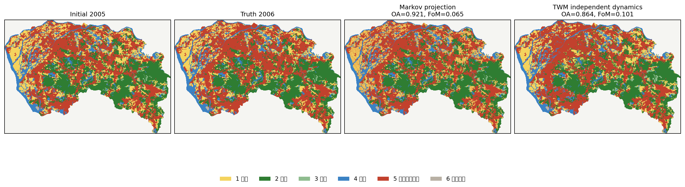
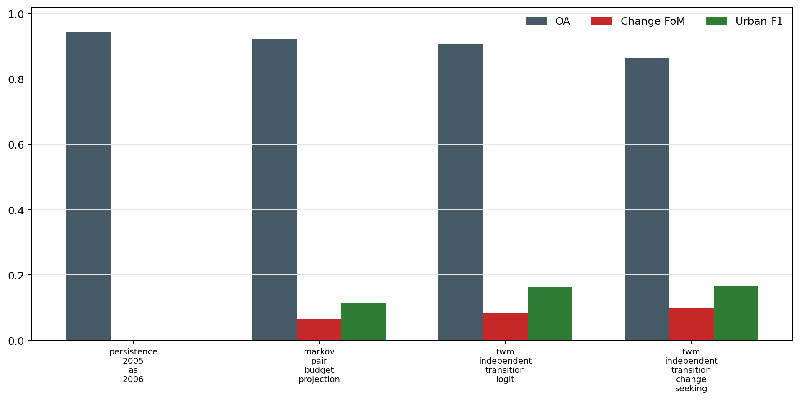

# TWM DongGuan 独立 Transition Dynamics 验证

更新日期：2026-06-22

## 1. 结论

这一步从单期 suitability 推进到独立 transition dynamics：模型只用 2000->2005 的真实转移训练，预测 2005->2006，2006 图只用于 holdout demand 和事后指标。

当前最佳 TWM dynamics 候选是 `twm_independent_transition_change_seeking`，最佳透明 baseline 是 `markov_pair_budget_projection`。这不是官方 FLUS 对比，因为 80m 包没有官方 FLUS 输出图；它验证的是 TWM 能否从历史转移学习 dynamics。

## 2. 渲染器输出

## 3. 指标

| candidate | OA | Kappa | change FoM | change F1 | urban F1 | violation rate | predicted change |
|---|---:|---:|---:|---:|---:|---:|---:|
| persistence_2005_as_2006 | 0.943746 | 0.920710 | 0.000000 | 0.000000 | 0.000000 | 0.000000 | 0 |
| markov_pair_budget_projection | 0.920858 | 0.887048 | 0.065371 | 0.122719 | 0.113853 | 0.000000 | 12560 |
| twm_independent_transition_logit | 0.906355 | 0.866279 | 0.084358 | 0.155591 | 0.162286 | 0.000000 | 20226 |
| twm_independent_transition_change_seeking | 0.863593 | 0.804365 | 0.100769 | 0.183088 | 0.166182 | 0.000000 | 39135 |

## 4. 边界

- 可以说：TWM 已经具备从历史转移对训练独立 dynamics 的实验链路。
- 不能说：这已经是稳健的 multi-period world model；当前只有一个训练转移对。
- 不能说：这项 80m 实验已经击败官方 FLUS；该数据包没有官方 FLUS 输出图。
- 下一步需要更多时期或多城市样本，并把 holdout demand 替换为独立 scenario/demand model。
