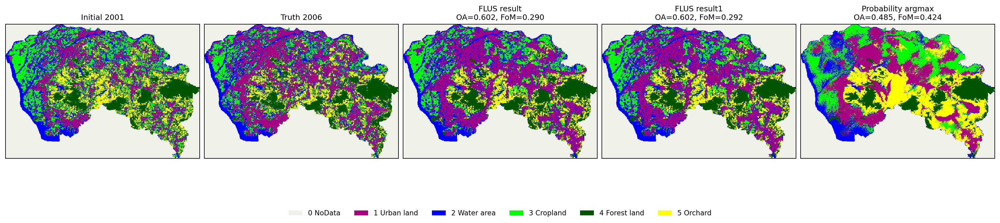
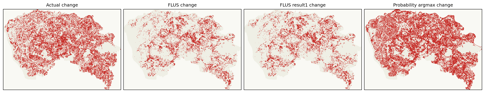
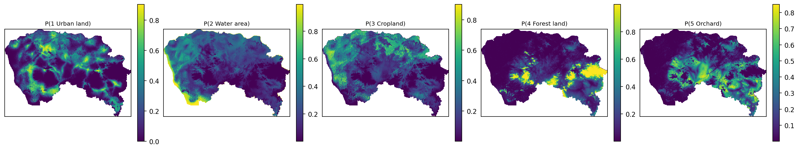
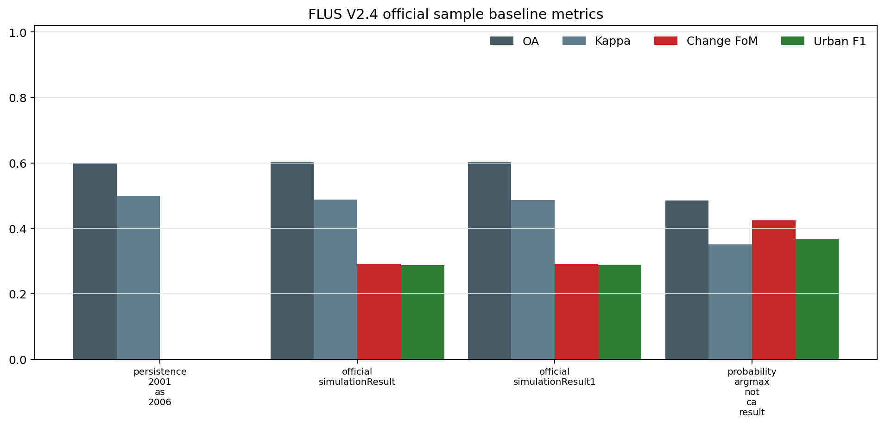

# TWM x GeoSOS-FLUS V2.4 官方样例数据基线评估

更新日期：2026-06-22

## 1. 总体判断

这批 `paralleled FLUS_V2.4.zip` 数据比之前用于 DongGuan 80m 适配的数据更适合做 TWM 与 GeoSOS/FLUS 的 baseline 对比。核心原因是它同时包含起始土地利用、验证真值、概率图、限制区、驱动因子、FLUS 配置日志，以及包内已经生成的 `simulationResult.tif` / `simulationResult1.tif`。

因此，它可以支撑“同一栅格、同一需求量、同一验证真值”的官方 FLUS 样例输出对比；之前的数据更适合验证 TWM 数据接入和 proxy baseline，不足以支撑官方 FLUS 输出对比。

必须保留边界：这仍然是官方教程/样例案例，不是完整自然资源治理业务数据；目前也还不能说 TWM 已经优于 FLUS，只有在 TWM 针对此 V2.4 数据生成同案模拟与规划结果后，才能进入正式比较。

## 2. 数据基础

- 有效像元：`248920`
- 栅格分辨率：`100 m`，单像元约 `1.0` ha
- 土地类型：1 Urban land，2 Water area，3 Cropland，4 Forest land，5 Orchard
- 起始图：`dg2001coor.tif`
- 真值图：`dg2006true.tif`
- 官方样例输出：`simulationResult.tif`、`simulationResult1.tif`
- FLUS 概率图：`Probability-of-occurrence.tif`，5 band
- 限制区：`restrictedarea.tif`
- 驱动因子：DEM、坡度、坡向、距城市中心、距城镇、距高速、距道路、距铁路等

## 3. 官方 FLUS 样例输出指标

这里把 `simulationResult.tif` 和 `simulationResult1.tif` 当作包内官方样例输出；依据是 V2.4 包直接包含这些结果图，且 `output.log` 记录了保存 `simulationResult.tif` 的过程。`Probability-of-occurrence.tif` 的 argmax 只作为概率图诊断基线，不等同于最终 CA 模拟结果。

| baseline | OA | Kappa | change FoM | change F1 | urban F1 | predicted change | actual change | demand MAE |
|---|---:|---:|---:|---:|---:|---:|---:|---:|
| persistence_2001_as_2006 | 0.600771 | 0.499726 | 0.000000 | 0.000000 | 0.000000 | 0 | 99376 | 13210.800 |
| official_simulationResult | 0.602491 | 0.487845 | 0.290021 | 0.449637 | 0.287516 | 44589 | 99376 | 0.000 |
| official_simulationResult1 | 0.601659 | 0.486773 | 0.292161 | 0.452205 | 0.288706 | 45452 | 99376 | 0.000 |
| probability_argmax_not_ca_result | 0.484879 | 0.350820 | 0.424199 | 0.595702 | 0.366715 | 124464 | 99376 | 16990.600 |

关键读法：

- `persistence_2001_as_2006` 的 OA/Kappa 不低，是因为大部分像元不变；但它的 change FoM 和 urban F1 为 0，说明它不能解释变化。
- `official_simulationResult` 与 `official_simulationResult1` 严格贴合 FLUS future-pixel 需求量，变化定位 FoM 约 0.29。
- `probability_argmax_not_ca_result` 的变化 FoM 更高但 OA/Kappa 更低，说明概率图不是最终土地利用需求约束后的 CA 结果。

## 4. 证据链

- 手册可读且包含样例数据角色说明：`True`
- `output.log` 记录保存 `simulationResult.tif`：`True`
- `simulationResult.tif` 类别数量匹配 future-pixel 需求：`True`
- `simulationResult1.tif` 类别数量匹配 future-pixel 需求：`True`
- `FLUS_console.zip` 包含 ANN 与 simulation C++ 代码：`True`

## 5. 对 TWM 的意义

这批数据最适合拆成一个独立任务：`TWM x FLUS V2.4 official sample baseline`。TWM 的渲染器负责把起始图、真值图、官方 FLUS 图、概率图和变化图并列可视化；模拟器负责在相同 100 m 栅格上生成 TWM 候选模拟图；规划器负责在同一需求量和限制条件下输出不同政策目标的候选方案，并与官方 FLUS 样例输出同表比较。

下一步不能只停在数据分析。应把 V2.4 数据接入 TWM runner：使用 `dg2001coor.tif` 作为初始状态、`dg2006true.tif` 作为 holdout 真值、FLUS future-pixel 作为需求约束、`restrictedarea.tif` 和 cost matrix 作为动作约束，再输出 TWM 的模拟/优化结果图。

## 6. 未完成项

- Add a TWM V2.4 runner that uses dg2001coor.tif as initial state, dg2006true.tif as holdout truth, FLUS future-pixel demand as scenario demand, and restrictedarea/cost matrix as action masks.
- Use Probability-of-occurrence.tif as a FLUS-informed suitability input, but keep it separate from the official CA result row.
- Generate TWM simulation and planner candidate maps on the same 531x768, 100 m grid and compare them with official_simulationResult using OA, Kappa, change FoM, urban expansion F1, demand fit and restricted-area violations.
- If FLUS_console is to be executed directly, treat it as a porting/build task because the provided project is Windows/Visual-Studio oriented and depends on GDAL/ALGLIB/OpenCV-style native code.
- Do not claim that TWM beats GeoSOS/FLUS until the TWM V2.4 runner has produced same-case maps and the official baseline row remains in the same metric table.
