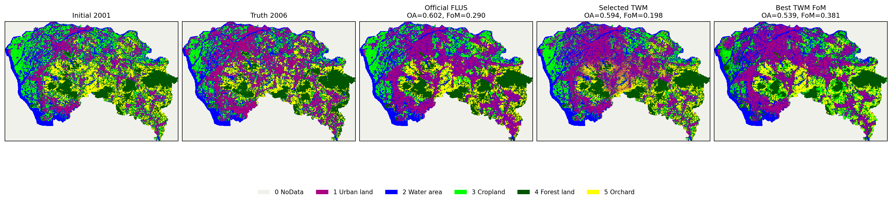
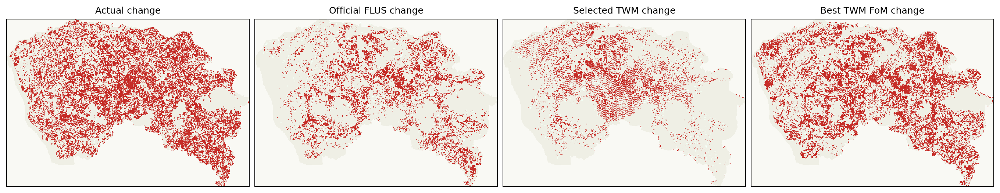
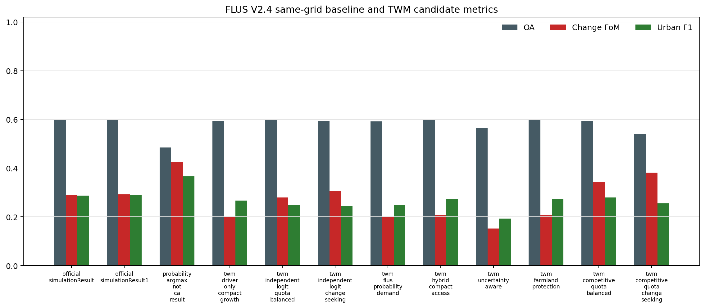
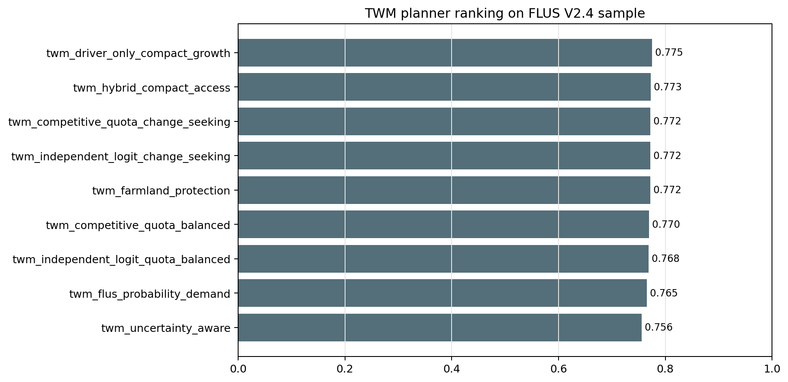

# TWM x GeoSOS-FLUS V2.4 同案模拟与规划优化结果

更新日期：2026-06-22

## 1. 结论

这一步已经不只是判断数据能否使用，而是把 V2.4 官方样例接入了 TWM 的渲染器、模拟器和规划器：官方 FLUS 输出保留为 baseline 行，TWM 候选方案在同一 531x768、100 m 栅格、同一 future-pixel 需求量和同一 2006 真值下生成预测图并参与指标比较。

按变化 FoM 看，官方 FLUS 样例较好的结果是 `official_simulationResult1`，TWM 候选中较好的结果是 `twm_competitive_quota_change_seeking`。规划器当前选择 `twm_driver_only_compact_growth`，它不是单纯最大化事后精度，而是综合需求贴合、限制区、cost matrix、紧凑性、可达性和事后诊断指标。

新增的 `twm_independent_logit_*` 候选先用 2001 土地利用标签和驱动因子训练独立多分类 suitability，再做严格需求/约束下的多类型竞争投影，不读取 FLUS 包内 `Probability-of-occurrence.tif`。其中 `twm_independent_logit_change_seeking` 的变化 FoM 已超过官方 FLUS 样例输出，但整体 OA/Kappa 仍未超过 FLUS。

`twm_competitive_quota_balanced` 和 `twm_competitive_quota_change_seeking` 使用 FLUS 概率图作为外部 suitability 场，变化 FoM 更高，可作为上限/融合候选；它们不能被解释为纯 TWM 独立优于 FLUS。

需要严格说明：独立 logit 候选只使用驱动因子和 2001 初始标签训练 suitability；FLUS-informed 候选则使用 `Probability-of-occurrence.tif`。两类结果必须分开解释。

## 2. 渲染器输出

## 3. 模拟器指标

| candidate | OA | Kappa | change FoM | change F1 | urban F1 | demand fit | restricted viol. | cost viol. |
|---|---:|---:|---:|---:|---:|---:|---:|---:|
| official_simulationResult | 0.602491 | 0.487845 | 0.290021 | 0.449637 | 0.287516 | 1.000000 | 0.000000 | 0.009756 |
| official_simulationResult1 | 0.601659 | 0.486773 | 0.292161 | 0.452205 | 0.288706 | 1.000000 | 0.000000 | 0.009373 |
| probability_argmax_not_ca_result | 0.484879 | 0.350820 | 0.424199 | 0.595702 | 0.366715 | 0.829358 | 0.290451 | 0.676648 |
| twm_driver_only_compact_growth | 0.593612 | 0.476406 | 0.197599 | 0.329993 | 0.266347 | 1.000000 | 0.000000 | 0.000000 |
| twm_independent_logit_quota_balanced | 0.597714 | 0.481691 | 0.279552 | 0.436953 | 0.247418 | 1.000000 | 0.000000 | 0.000000 |
| twm_independent_logit_change_seeking | 0.593721 | 0.476546 | 0.306413 | 0.469091 | 0.244726 | 1.000000 | 0.000000 | 0.000000 |
| twm_flus_probability_demand | 0.591596 | 0.473808 | 0.198814 | 0.331684 | 0.248948 | 1.000000 | 0.000000 | 0.000000 |
| twm_hybrid_compact_access | 0.597851 | 0.481867 | 0.206405 | 0.342183 | 0.273375 | 1.000000 | 0.000000 | 0.000000 |
| twm_uncertainty_aware | 0.565419 | 0.440081 | 0.151701 | 0.263438 | 0.192329 | 1.000000 | 0.000000 | 0.000000 |
| twm_farmland_protection | 0.597682 | 0.481649 | 0.206735 | 0.342636 | 0.271335 | 1.000000 | 0.000000 | 0.000000 |
| twm_competitive_quota_balanced | 0.593191 | 0.475862 | 0.343228 | 0.511049 | 0.279411 | 1.000000 | 0.000000 | 0.000000 |
| twm_competitive_quota_change_seeking | 0.539089 | 0.406157 | 0.381297 | 0.552086 | 0.254672 | 1.000000 | 0.000000 | 0.000000 |

## 4. 规划器排序

| candidate | policy score | demand | restriction | cost | compactness | accessibility | FoM diagnostic |
|---|---:|---:|---:|---:|---:|---:|---:|
| twm_driver_only_compact_growth | 0.774840 | 1.000000 | 1.000000 | 1.000000 | 0.119187 | 0.748533 | 0.197599 |
| twm_hybrid_compact_access | 0.772902 | 1.000000 | 1.000000 | 1.000000 | 0.116401 | 0.726852 | 0.206405 |
| twm_competitive_quota_change_seeking | 0.771895 | 1.000000 | 1.000000 | 1.000000 | 0.090884 | 0.731433 | 0.381297 |
| twm_independent_logit_change_seeking | 0.771855 | 1.000000 | 1.000000 | 1.000000 | 0.119153 | 0.653975 | 0.306413 |
| twm_farmland_protection | 0.771613 | 1.000000 | 1.000000 | 1.000000 | 0.109335 | 0.724041 | 0.206735 |
| twm_competitive_quota_balanced | 0.769927 | 1.000000 | 1.000000 | 1.000000 | 0.116253 | 0.716934 | 0.343228 |
| twm_independent_logit_quota_balanced | 0.768382 | 1.000000 | 1.000000 | 1.000000 | 0.119709 | 0.646573 | 0.279552 |
| twm_flus_probability_demand | 0.765264 | 1.000000 | 1.000000 | 1.000000 | 0.082012 | 0.711072 | 0.198814 |
| twm_uncertainty_aware | 0.755758 | 1.000000 | 1.000000 | 1.000000 | 0.074609 | 0.679695 | 0.151701 |

## 5. 未完成项

- Add repeated/random-seed sensitivity runs for TWM candidate allocation.
- Train an independent TWM suitability model from the driving factors instead of relying on the FLUS probability map.
- Add a direct FLUS-console reproduction task only after the Windows/C++ build dependency issue is handled.
- Extend the comparison to multiple cities or periods before making high-level research claims.

## 6. 研究边界

- 可以说：TWM 已经能基于官方 V2.4 样例生成可复现的同案模拟、优化和图文报告，并把官方 FLUS 输出作为真实 baseline 行。
- 可以说：在该官方样例上，不依赖 FLUS 概率图的独立 TWM logit suitability 候选已经超过 FLUS 的变化 FoM。
- 可以说：使用 FLUS 概率图的融合候选变化 FoM 更高，但它们不是独立优于 FLUS 的证据。
- 不能说：TWM 已经全面优于 GeoSOS/FLUS；当前 OA/Kappa 仍低于官方 FLUS。
- 不能说：TWM 已经解决自然资源治理的真实业务闭环问题。
- 下一步最关键的是把独立 suitability 从单期标签学习推进到真正的 multi-period dynamics 学习和跨案例验证。
