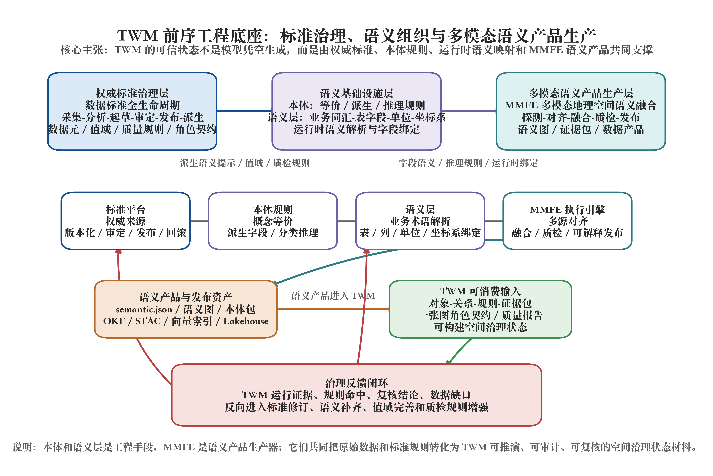
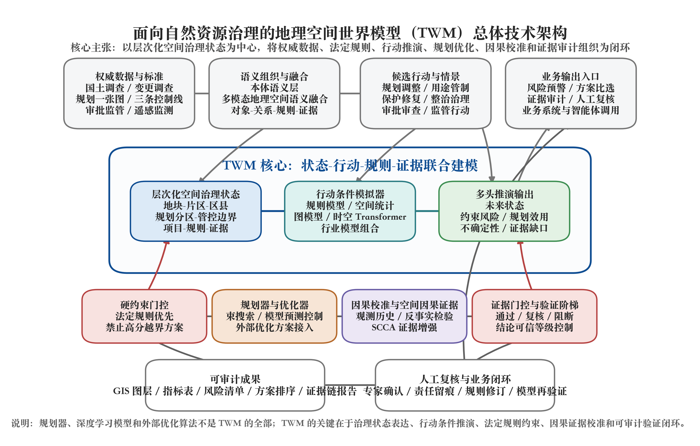

# 面向自然资源治理的地理空间世界模型（TWM）战略技术说明

日期：2026-06-21

面向对象：自然资源部空间规划司、用途管制司相关业务负责人；公司管理层；自然资源信息化、规划实施监督、用途管制和国土空间治理相关技术负责人。

## 1. 摘要：TWM 的定位与合作价值

TWM（Territory World Model，地理空间世界模型）是面向国土空间治理的专业化世界模型。它的目标不是追逐“世界模型”概念热点，也不是让人工智能替代自然资源管理决策，而是把自然资源数据从传统的“图层、表格、报表”转化为“可计算、可推演、可审计的空间状态”，在法定规则约束下进行风险识别、行动后果推演、方案比选和证据链生成。

可以用一句话概括：

> TWM 是面向国土空间规划实施监督和用途管制的智能推演与证据审计引擎，用于帮助业务人员更早发现风险、更系统比较方案、更清楚说明依据、更规范沉淀证据。

TWM 的基本原则是：

- 规则优先：永久基本农田、生态保护红线、城镇开发边界、用途管制、规划指标等法定规则是硬约束；
- 模型辅助：人工智能模型用于推演、预警、比选和证据组织，不直接替代行政判断；
- 人工复核：高风险、证据不足、模型与规则或专家判断不一致的结果必须进入人工复核；
- 全程留痕：数据来源、规则版本、模型过程、方案比较和复核记录必须可追溯；
- 数据不出域：面向部委和地方自然资源部门的数据安全要求，优先支持专有环境、本地环境或可信内网部署；
- 分级验证：工程验证、历史回放验证、生产监控验证必须分级，不把演示结果包装成生产结论。

当前 TWM 已经不是一份纯概念方案。它建立在长期的自然资源业务理解、地理信息系统工程积累、空间优化研究、深度强化学习探索和世界模型方法跟踪之上，并已经形成了可运行的工程骨架，包括 TWM 状态构建、规则证据链、预测、反事实推演、约束规划、优化候选接入、空间因果证据接入和验证阶梯。但要把 TWM 从工程原型推进到自然资源治理中的可信生产能力，还必须进入真实权威数据场景，开展历史回放、空间/时间留出验证、业务专家复核和生产闭环试点。

因此，本说明书的核心目的不是宣称 TWM 已经完成，而是说明：

1. TWM 要解决的自然资源治理问题是真实存在的；
2. TWM 的技术路线已经从概念设想进入可实现、可验证的工程路径；
3. TWM 不替代法定管理职责，而是增强规划实施监督和用途管制的风险识别、方案推演和证据审计能力；
4. 只有接入真实权威数据和真实业务流程，TWM 才能完成从研发验证到生产验证的关键跃迁。

## 2. 当前自然资源治理面临的核心问题

近年来，自然资源管理已经形成了较完整的数据基础和业务系统体系，包括国土调查、年度变更调查、遥感监测、国土空间规划“一张图”、三条控制线、永久基本农田、用途管制、建设用地审批、执法督察、生态修复、耕地保护和规划实施监督等。

这些系统支撑了自然资源治理现代化的重要基础，但在面向更高水平的智能化治理时，仍面临几个突出问题。

### 2.1 数据很多，但还没有统一转化为“治理状态”

自然资源数据往往以图层、表格、业务台账、报告、审批材料、遥感产品和规则文件等形式存在。传统 GIS 能够很好地展示、叠加、查询和统计这些数据，但对“当前国土空间治理状态是什么”这一问题，还缺少统一的可计算表达。

例如，一个建设项目涉及的不是一个简单地块，而是项目边界、地类、耕地质量、永久基本农田、生态红线、城镇开发边界、规划分区、审批记录、补正材料、规则命中、历史变化和监管证据的综合状态。

如果这些信息仍然停留在分散图层和表格中，系统就很难进一步回答：

- 当前项目到底处于什么风险状态？
- 哪些规则已经触碰，哪些只是需要补充证据？
- 哪些空间对象与该项目存在关键关系？
- 如果调整范围、强度或用途，风险会如何变化？

TWM 要解决的第一件事，就是把分散的自然资源数据组织成可计算、可推演、可审计的空间状态。

### 2.2 规则很多，但缺少“规则-空间对象-证据”的闭环

自然资源管理高度依赖规则。空间规划、用途管制、耕地保护、生态保护、审批监管和执法督察都不是简单的数学优化问题，而是依法依规、分级分类、证据充分、责任可追溯的治理问题。

现有系统可以做大量规则校验和空间叠加，但在复杂业务中仍存在几个难点：

- 规则命中结果与原始证据之间的链条不够自动化；
- 规则版本、数据版本和审查结论之间的关系不够清晰；
- 同一项目可能涉及多类规则，多规则之间的冲突、优先级和复核要求难以统一组织；
- 对于证据不足或口径不一致的情况，系统往往难以自动形成“需复核”的规范化任务。

TWM 的目标不是把规则变成黑箱模型，而是让规则成为模型推演和方案比选的硬边界。任何模型输出都必须能够说明：

- 依据哪些规则；
- 使用哪些数据；
- 命中了哪些约束；
- 哪些结论证据充分；
- 哪些结论需要人工复核。

### 2.3 能看到现状，但难以系统推演“如果这样做会怎样”

自然资源管理不仅要掌握现状，还要判断未来影响。规划实施监督和用途管制经常需要回答：

- 如果某个片区建设强度提高，会对耕地、生态、交通、公共服务和规划指标产生什么影响？
- 如果某个项目调整边界，是否降低对永久基本农田或生态红线的风险？
- 如果多个候选方案都符合法定边界，哪个方案的综合风险更低、证据更充分、长期影响更稳健？
- 如果某类空间变化持续发生，哪些区域未来可能出现规划偏离或用途冲突？

传统 GIS 擅长“看清楚现在发生了什么”，但对“行动后的未来状态和风险变化”支持不足。传统空间模拟模型可以预测土地利用变化，但往往不直接服务于审批、用途管制、证据审计和人工复核闭环。

TWM 的核心价值正是在这里：它不是简单预测一张未来地图，而是以“当前状态 + 行动 + 情景 + 规则”为输入，推演未来状态、约束风险、方案效用、不确定性和复核需求。

### 2.4 人工智能能回答问题，但不能直接成为行政依据

当前大模型和智能体技术发展很快，但自然资源治理不能直接依赖“模型说了什么”。原因很明确：

- 行政决策必须依法依规；
- 数据必须权威可信；
- 结论必须可追溯；
- 风险必须可复核；
- 责任边界必须清晰；
- 不能让黑箱模型替代审批、审查和监管职责。

因此，自然资源行业真正需要的不是一个会聊天的人工智能，而是一个能够与自然资源数据、规则、空间关系、证据链和人工复核机制结合的智能治理引擎。

TWM 的设计正是基于这一判断：人工智能只做辅助推演和证据组织，结论是否能进入业务使用，必须由规则、证据、历史验证和人工复核共同决定。

## 3. TWM 是什么：第一性原理与边界

### 3.1 TWM 的第一性原理

TWM 的第一性原理可以用三句话说明。

第一，国土空间治理的对象本质上是空间状态。

自然资源管理面对的是地块、图斑、行政区、规划分区、管控边界、生态空间、耕地、建设项目、基础设施和监管证据。这些对象不是孤立存在的，而是具有空间位置、空间关系、时间版本、业务属性和规则约束。

第二，规划、审批、保护、整治和监管行为本质上是对空间状态的干预。

一个建设项目、一个用途调整、一个耕地保护措施、一个生态修复工程、一个规划实施监督行动，都会改变或影响空间状态、约束风险和治理目标。

第三，好的治理工具必须能够预测干预后果，并说明证据、规则和适用边界。

如果一个系统只能展示现状，而不能推演行动后果，它只能作为静态 GIS 工具；如果一个系统能给出模型结论，但不能说明依据和边界，它不能进入严肃治理场景；只有把状态、行动、规则、推演、证据和复核组织在一起，才有可能形成可信的地理空间世界模型。

因此，TWM 的基本形式可以表达为：

> 当前空间状态 + 行动 + 情景 + 规则约束 -> 未来状态、约束风险、规划效用、不确定性、复核需求、证据链

更技术化地说，TWM 关注的是：

> p(next_state, constraint_state, utility_state | current_state, action, scenario, rules, evidence)

但在给业务领导说明时，不需要强调公式。核心意思是：TWM 不是只看现在，而是推演“如果采取某种行动，未来可能怎样，并且为什么这样判断”。

### 3.2 TWM 不是什么

为了避免误解，需要明确 TWM 的边界。

TWM 不是通用大模型。

它不是一个只靠语言理解回答问题的系统。它需要真实 GIS 数据、规则、证据、空间关系、历史变化和业务流程支撑。

TWM 不是视频生成或视觉世界模型。

当前很多世界模型讨论来自自动驾驶、具身智能和视频生成领域，关注局部物理场景、下一帧预测、机器人动作和短时控制。TWM 的“世界”是国土空间治理世界，空间尺度更大、时间周期更长、规则约束更强、证据审计要求更高。

TWM 不是传统数字孪生的简单换名。

数字孪生通常强调对象映射、可视化、状态监测和仿真展示。TWM 更强调行动条件推演、规则约束、反事实比较、因果校准、规划消费和证据门控。它可以作为自然资源数字孪生的智能推演核心，但不等同于一个三维展示系统。

TWM 不是单纯 GIS 空间分析工具。

传统 GIS 叠加、缓冲、统计、可视化非常重要，TWM 也必须依赖这些能力。但 TWM 的目标是把 GIS 分析结果组织成可计算状态，并进一步支撑未来推演、方案比选和证据审计。

TWM 不替代行政审批和专家判断。

TWM 的输出应定位为辅助研判、风险预警、方案比较和证据组织。法定审批结论仍应由有权部门和责任人员依据法律法规、政策要求、业务规则和专家复核作出。

### 3.3 TWM 与当前“世界模型”热潮的关系

“世界模型”这个概念正在变热，确实存在炒作风险。很多场景把它泛化为“能模拟世界的一切模型”，这并不严谨。

TWM 与通用世界模型的共同点是：都关心状态、行动和未来结果。

但 TWM 的不同之处在于：

- TWM 的世界不是抽象物理世界，而是国土空间治理世界；
- TWM 的对象不是像素或视频帧，而是地块、图斑、项目、规则、证据和规划空间；
- TWM 的行动不是机器人控制，而是规划调整、用途管制、审批审查、保护修复、整治治理等管理行动；
- TWM 的目标不是生成逼真场景，而是识别风险、比较方案、解释依据、支持复核；
- TWM 的可信度不是来自模型规模，而是来自数据权威性、规则一致性、历史回放、因果校准、证据门控和人工复核。

因此，更准确的说法是：

> TWM 是世界模型思想在自然资源治理领域的专业化落地。它吸收“状态-行动-未来”的基本思想，但把模型边界严格限定在国土空间规划、用途管制、自然资源保护和治理审计场景中。

## 4. TWM 与通用世界模型、数字孪生、传统 GIS 的区别

| 对比对象 | 主要特点 | 与 TWM 的关系 | TWM 的差异 |
|---|---|---|---|
| 传统 GIS | 图层管理、空间查询、叠加分析、制图表达 | TWM 必须建立在 GIS 能力之上 | TWM 进一步把图层转化为可推演状态 |
| 自然资源“一张图” | 数据汇聚、规划展示、空间管控、业务支撑 | TWM 可嵌入“一张图”作为推演与审计能力 | TWM 强调行动后果模拟和方案比选 |
| 数字孪生 | 对现实对象进行数字映射、监测和仿真展示 | TWM 可作为数字孪生中的智能推演核心 | TWM 更强调规则、证据、反事实和验证阶梯 |
| 土地利用模拟模型 | 预测土地利用/覆被变化格局 | 可作为 TWM 的模拟器基线或子模块 | TWM 不只预测图斑变化，还要处理规则、行动、审批和证据 |
| 通用大模型/智能体 | 语言理解、问答、任务编排、工具调用 | 可作为 TWM 的交互入口和任务编排层 | TWM 的可信性来自 GIS 状态、规则和验证，不来自语言生成 |
| 当前热门世界模型 | 强调状态、行动、未来预测，常见于自动驾驶、机器人、视频生成 | TWM 借鉴其状态-行动-未来思想 | TWM 面向宏观地理空间治理，不追求视频生成或自动控制 |

这个区别非常重要。TWM 不是要推翻现有 GIS、数字孪生或“一张图”，而是要在这些基础之上增加一类新的能力：**可推演、可反事实、可规划、可审计的空间治理智能能力**。

## 5. TWM 能解决的自然资源业务问题

### 5.1 规划实施监督：从事后发现到提前预警

规划实施监督需要关注规划目标、空间格局、建设活动、用途变化、指标执行和约束边界之间的关系。传统方法往往偏重事后监测和统计核查。

TWM 可以增强以下能力：

- 识别规划实施偏离风险；
- 发现建设活动与规划分区、开发边界、生态空间之间的潜在冲突；
- 推演某类空间变化持续发生后对规划指标的影响；
- 对不同管控策略进行情景比较；
- 将风险判断追溯到图斑、项目、规则和证据。

这意味着规划实施监督可以从“发现问题后处理”逐步增强为“提前识别风险、提前比较方案、提前组织证据”。

### 5.2 用途管制辅助审查：从规则校验到风险解释

用途管制涉及空间准入、用地审批、规划许可、建设项目审查和多类管控边界。业务人员不仅要知道某个项目是否命中规则，还要知道命中原因、证据来源、风险程度和可能的调整方案。

TWM 可以辅助：

- 将项目与用途管制分区、三条控制线、永久基本农田、生态保护红线等规则自动关联；
- 判断哪些命中属于硬约束阻断，哪些属于需要补充材料或人工复核；
- 对项目边界、用地规模、用途类型和调整方案进行模拟比较；
- 形成规则命中清单、证据链和复核任务；
- 支持业务人员快速定位风险来源。

这里需要强调：TWM 不给出最终审批结论，而是提供审查辅助、风险提示和证据组织。

### 5.3 耕地保护：从数量管控到空间质量和格局推演

耕地保护不仅是面积数量问题，还涉及永久基本农田、耕地质量、空间连片度、补充耕地质量、占补平衡、进出平衡、整治潜力和长期稳定性。

TWM 可以支持：

- 识别项目或规划调整对耕地保护目标的影响；
- 推演不同整治或保护方案对耕地连片度、质量和风险的变化；
- 对候选方案进行约束审计，避免高分但违法违规的方案被推荐；
- 将外部优化器或已有规划模型生成的方案纳入 TWM 进行规则门控、风险排序和证据审计；
- 对耕地保护结论进行历史回放和生产验证。

当前工程中，TWM 已经具备外部耕地布局优化候选方案的接入、硬约束审计和束搜索规划排序能力。这说明 TWM 不必替代所有优化算法，而可以作为自然资源治理场景中的统一方案审计和推演框架。

### 5.4 生态保护和修复：从红线校验到影响传导分析

生态保护涉及生态保护红线、自然保护地、生态敏感区、水源保护、修复工程、生态连通性和人类活动影响。很多问题不仅是单点规则命中，而是空间影响传导。

TWM 可以支持：

- 识别项目或空间变化对生态保护红线和敏感区的风险；
- 推演生态修复或建设活动对周边空间单元的影响；
- 对多方案进行生态约束、建设需求和空间格局的比较；
- 形成生态风险图层、影响对象清单和证据链；
- 对证据不足或模型不确定性较高的结论自动标记复核。

### 5.5 多方案比选：从单指标最优到规则约束下的综合稳健

自然资源管理中的方案比选很少是单一数学目标最优。一个方案可能建设效率高，但生态风险大；另一个方案可能风险低，但耕地质量影响较大；还有的方案看似分数高，但触碰硬约束，根本不能推荐。

TWM 的 planner 不是脱离规则去寻找“数学最优”，而是在硬约束门控之后，对候选方案进行综合比较：

- 约束是否允许；
- 风险是否可控；
- 证据是否充分；
- 规划效用是否提升；
- 不确定性是否可接受；
- 是否需要人工复核。

这对空间规划、用途管制和耕地保护中的多方案论证非常关键。

### 5.6 证据审计：从模型输出到可追溯治理证据

自然资源治理不能只要一个模型分数。业务人员需要知道：

- 这个结论来自哪些数据；
- 使用了哪个规则版本；
- 命中了哪些空间对象；
- 哪些证据支持，哪些证据不足；
- 模型不确定性在哪里；
- 是否经过人工复核；
- 后续责任边界如何。

TWM 的证据门控和审计报告正是为此设计。每一个预测、反事实推演、束搜索规划和验证报告都应携带证据状态，而不是只输出结果。

## 6. TWM 的总体技术架构：从数据标准到地理空间世界模型

TWM 不是孤立模型，而是一条从数据治理到智能推演的完整链路。

总体路径可以概括为：

> 数据标准全生命周期管理 -> 本体/语义层 -> 多模态地理空间语义融合 -> TWM 状态构建 -> 行动条件模拟器 -> 规划器消费 -> 因果校准与证据门控 -> GIS 审计输出 -> 人工复核闭环

图 1. TWM 的前序工程底座。数据标准全生命周期管理提供权威治理源，本体和语义层把标准、概念、字段、值域和空间规则转化为运行时可解析的语义基础设施，MMFE 负责把多源异构地理空间数据加工为可发布、可追溯、可质检的语义产品。TWM 在此基础上消费对象、关系、规则和证据包，构建可推演、可审计、可复核的空间治理状态。

图 2. 面向自然资源治理的地理空间世界模型总体架构。TWM 的关键不是简单叠加地理信息系统、人工智能模型和优化算法，而是以层次化空间治理状态为核心，把权威数据、法定规则、候选行动、行动后果推演、规划优化、因果校准、证据门控和人工复核组织为闭环。

### 6.1 TWM 的核心关键技术

TWM 的核心关键技术可以概括为六个方面。它们共同决定 TWM 是否只是概念拼装，还是能够进入自然资源治理场景的可信工程系统。

第一，层次化空间治理状态建模。

TWM 不把国土空间简单看成一张栅格图或一批图层，而是把地块、图斑、项目、片区、区县、规划分区、管控边界、规则、证据和复核任务组织成统一的空间治理状态。这一状态既包含空间几何和属性，也包含时间版本、业务关系、规则命中和证据来源。它是后续推演、优化和审计的共同底座。

第二，规则约束与模型推演的耦合机制。

自然资源治理不是单纯追求数学最优，永久基本农田、生态保护红线、城镇开发边界、用途管制规则和规划指标等法定约束必须优先。TWM 的关键技术之一，是把规则引擎、行动掩膜和硬约束门控嵌入模型推演与方案排序过程，确保高分但违法违规的方案不会被推荐。

第三，行动条件下的空间动态推演。

传统地理信息系统主要回答“现在是什么”，TWM 必须回答“如果采取某个行动，将来可能怎样”。因此，TWM 的模拟器以当前状态、候选行动、业务情景、规则约束和证据状态为输入，输出未来状态、约束风险、规划效用、不确定性和证据缺口。规则模型、空间统计模型、图模型、时空 Transformer、传统空间模拟模型和专业行业模型都可以作为后端，但核心合同是行动条件推演，而不是某一个具体算法名称。

第四，多方案规划与反事实比较。

TWM 的规划器不是替代世界模型的本体，而是使用世界模型评估候选方案的消费者。它可以接收外部优化算法生成的候选方案，也可以通过束搜索、模型预测控制或强化学习等方法生成方案，再由 TWM 统一进行规则门控、风险排序、反事实推演和证据审计。这样既能继承既有优化研究成果，也能避免把单一优化器误包装成“世界模型”。

第五，因果校准与空间上下文证据。

自然资源治理关注的是行动效果，而不仅是统计相关性。例如某类管控措施是否真正降低风险，某项整治措施是否改善耕地格局，都需要尽可能利用历史观测、空间上下文和反事实证据进行校准。TWM 因此引入因果校准机制，并可接入 SCCA（Spatial Contextual Causal Adjustment，空间上下文因果调整）等外部空间因果证据，用于增强行动效果判断的可信度。

第六，证据门控与验证阶梯。

TWM 的输出不能只给一个分数或一张预测图，而必须说明数据来源、规则版本、模型过程、证据充分性、不确定性和人工复核状态。证据门控负责把结论分为“通过、复核、阻断”等状态，验证阶梯负责控制结论能否从工程验证升级到历史回放验证、专家复核验证和生产级辅助决策。这个机制是 TWM 区别于普通人工智能演示系统的关键。

### 6.2 数据标准全生命周期管理

自然资源数据智能化的第一步不是建模型，而是把数据标准、字段口径、空间基准、时间版本、质量规则和业务编码管理起来。

这一层解决的是：

- 数据从哪里来；
- 是否权威；
- 坐标、边界、尺度是否一致；
- 字段和业务口径是否统一；
- 版本是否可追溯；
- 数据质量是否满足建模要求。

如果没有这一层，后面的人工智能模型会建立在不稳定的数据基础上，结论也难以进入严肃业务场景。

### 6.3 本体和语义层：一种工程手段，不是概念包装

这里所说的本体和语义层，不是为了炒作概念，而是为了解决自然资源业务对象和规则口径统一的问题。

自然资源业务中有大量对象：

- 地块、图斑、项目、行政区、规划分区；
- 永久基本农田、生态红线、城镇开发边界；
- 审批记录、审查任务、执法线索、遥感证据；
- 规则、指标、政策、技术规程。

这些对象之间存在复杂关系：

- 包含、邻接、叠置、交叉、距离、上下游、影响范围；
- 项目关联地块；
- 地块命中规则；
- 规则关联证据；
- 证据触发复核；
- 复核影响结论升级。

语义层的作用，就是把这些对象、关系和规则表达成系统能够理解和计算的结构，而不是让人工智能模型在散乱表格和文本中猜测含义。

### 6.4 多模态地理空间语义融合

自然资源数据具有明显的多模态特征，包括：

- 矢量图层；
- 栅格和遥感影像；
- 空间指标；
- 审批表格；
- 政策文本；
- 规则库；
- 巡查和执法证据；
- 历史变化记录。

多模态地理空间语义融合（MMFE, Multimodal Geospatial Feature and Semantic Fusion）的作用，是把这些多源数据融合成统一的地理信息语义数据包，为 TWM 提供可入模的状态输入。

也就是说，TWM 不直接面对零散文件，而是面对已经经过语义融合的数据包。这样可以保证后续模型推演具备统一的对象、关系、规则和证据基础。

### 6.5 TWM 状态构建

TWM 的状态不是一个普通表格，也不是一个扁平向量，而是层次化地理信息系统状态。

典型层次包括：

- 地块或图斑；
- 片区或街区；
- 镇街或管理单元；
- 区县或试点区域；
- 规划分区；
- 管控边界；
- 建设或整治项目；
- 证据项；
- 规则项。

这类状态表达使 TWM 能够同时理解微观地块、中观片区和宏观区域之间的关系，避免把一个复杂区域简单压缩成不可解释的数字向量。

### 6.6 行动条件模拟器

TWM 的核心不是静态分类，而是行动条件模拟。

输入包括：

- 当前空间状态；
- 候选行动；
- 业务情景；
- 规则约束；
- 证据状态。

输出包括：

- 未来状态；
- 约束违规概率或风险；
- 规划效用变化；
- 不确定性；
- 可行性；
- 需要复核的证据缺口。

模拟器可以使用不同技术后端，包括规则模型、空间统计模型、图模型、时空 Transformer（时空注意力神经网络）、传统空间模拟模型、专业行业模型或组合模型。但这些技术只是后端，TWM 的核心合同是“行动条件下的空间治理状态推演”。

### 6.7 规划器是消费者，不是 TWM 本体

TWM 中的规划器、束搜索（beam search）、模型预测控制（MPC, Model Predictive Control）、多目标优化、强化学习或外部优化器，都应被理解为 TWM 输出的消费者。

规划器的任务是：

- 生成或接收候选方案；
- 调用 TWM 模拟器评估后果；
- 应用硬约束门控；
- 比较风险、效用和不确定性；
- 输出可审计的推荐排序。

这一区分很重要。不能把一个优化器或搜索器直接包装成 TWM。真正的 TWM 必须有状态、行动、动态推演、规则约束、证据审计和验证阶梯。

### 6.8 因果校准与空间上下文因果证据

自然资源治理中很多问题不是简单相关性问题，而是“采取某项行动会产生什么效果”的干预问题。

例如：

- 某类管控措施是否降低了风险；
- 某种整治方案是否改善了耕地空间格局；
- 某类审批条件是否影响后续违规概率；
- 某项空间治理行动的效果是否受周边区域影响。

因此，TWM 必须引入因果校准。当前工程中已经建立了本地因果校准能力，并接入了 SCCA（Spatial Contextual Causal Adjustment，空间上下文因果调整），作为外部空间因果证据来源。

这里的定位很明确：

- SCCA 不替代 TWM；
- SCCA 不替代自然资源专业判断；
- SCCA 用于增强反事实和行动效果判断的证据基础；
- 如果 SCCA 证据不足，TWM 结论应保持“需要复核”状态，而不是强行升级。

### 6.9 证据门控和验证阶梯

TWM 的每个关键输出都应经过证据门控。

典型状态包括：

- 通过：证据充分，可以作为辅助研判依据；
- 复核：证据不足或不确定性较高，需要人工复核；
- 阻断：触碰硬约束或数据条件不满足，不能推荐。

验证阶梯则负责分层验证：

1. 状态构建是否正确；
2. 规则约束是否正确；
3. 未来状态预测是否可信；
4. 反事实推演是否有观测或因果证据支持；
5. 方案比选是否优于基线；
6. GIS 审计和人工复核是否完成；
7. 是否具备生产级可信结论。

这套机制是 TWM 区别于普通人工智能演示系统的关键。

## 7. 当前工程进展与已验证能力

当前 TWM 已经完成了从概念需求到工程骨架的关键转变。

### 7.1 已完成的核心能力

当前工程已经具备以下能力：

- 从多模态地理空间语义融合数据包构建 TWM 空间治理状态；
- 表达自然资源对象、关系、规则、证据和复核任务；
- 执行规则评估和审计报告；
- 生成行动条件预测；
- 执行反事实推演；
- 执行约束束搜索规划；
- 生成验证报告和结论升级阶梯；
- 支持行动掩膜和硬约束门控；
- 支持动态模型训练数据集、就绪度检查、后端登记和目标函数报告；
- 支持多层感知机（MLP, Multilayer Perceptron）、层次图模型、时空 Transformer 等候选动态模型后端；
- 支持地理空间基础模型（GeoFM, Geospatial Foundation Model）的 B0/B1 分级门控和下游规划消融；
- 支持本地因果校准；
- 支持 SCCA 外部空间因果证据接入；
- 支持耕地空间布局优化候选方案接入和硬约束审计；
- 提供应用程序接口（API, Application Programming Interface）和智能体开发工具集，可被智能体调用。

这说明 TWM 已经不再只是一个想法，而是一个可以继续迭代、验证和接入真实业务的工程体系。

### 7.2 当前已验证的工程闭环

当前已验证的闭环包括：

- 数据语义融合包进入 TWM 空间治理状态；
- 空间治理状态进入规则评估和证据链；
- 行动条件预测输出未来状态、风险、效用和不确定性；
- 反事实推演比较基线与干预行动；
- 束搜索规划对候选行动进行排序；
- 硬约束门控阻止不可行方案被高分误选；
- 优化方案包可被转换为 TWM 候选行动；
- SCCA 输出可被转换为 TWM 因果证据报告；
- 因果校准报告可携带 SCCA 证据状态；
- 验证报告和结论升级阶梯控制结论升级边界。

这些能力对自然资源治理非常关键，因为它们证明 TWM 的架构不是停留在“人工智能会回答问题”，而是开始具备“状态、规则、推演、规划、证据、复核”的闭环能力。

### 7.3 仍需明确的边界

必须坦诚说明：当前 TWM 还不是生产级系统。

当前主要依赖演示数据、结构化测试样例和合成压力测试。它们能够证明工程路线、接口合同、约束逻辑和验证机制可行，但不能证明生产级准确率。

要达到生产级，需要接入真实权威数据，开展：

- 真实历史审批和审查数据验证；
- 真实规划实施监督数据验证；
- 真实用途管制规则和版本验证；
- 时间留出验证；
- 空间留出验证；
- 行动留出验证；
- 与现有人工基线、规则基线和传统模型对比；
- 专家复核闭环。

这一边界必须写清楚。它不是削弱 TWM，而是增强可信度。因为严肃自然资源治理场景不接受未经验证的模型结论。

## 8. 真实落地还需要的条件和试点建议

TWM 要真正落地，最关键的不是再增加概念，而是进入真实权威数据和真实业务场景。

### 8.1 需要的数据条件

建议试点阶段至少需要以下数据：

- 试点区域国土调查和年度变更调查数据；
- 国土空间规划“一张图”相关图层；
- 三条控制线；
- 永久基本农田；
- 用途管制分区；
- 建设用地审批和审查记录；
- 项目边界、用地类型、审批状态、补正材料；
- 规划实施监督记录；
- 遥感监测和变化检测成果；
- 执法督察或疑似违法线索；
- 规则版本、指标口径和审查流程；
- 历史处理结果和人工复核结论。

尤其重要的是历史数据。只有历史数据才能做“用过去预测后来发生的真实情况”的验证。

### 8.2 需要的业务条件

建议先选择边界清晰、价值明确、规则充分的试点问题，不宜一开始就试图覆盖全部自然资源业务。

优先试点方向可以包括：

1. 用途管制项目审查风险辅助；
2. 规划实施监督风险预警；
3. 耕地保护和永久基本农田约束审计；
4. 建设项目多方案空间比选；
5. 生态保护红线和敏感区影响评估。

每个试点都应明确：

- 业务问题是什么；
- 输入数据是什么；
- 输出结果给谁用；
- 哪些规则是硬约束；
- 哪些结果必须人工复核；
- 如何判断 TWM 是否比现有流程有改进。

### 8.3 需要的验证条件

TWM 的可信度必须靠验证，不靠概念。

建议建立四类验证：

第一，数据基础验证。

检查数据是否权威、完整、一致、可追溯，是否具备建模资格。

第二，历史回放验证。

用过去某个时间点的数据预测之后真实发生的结果，评估预测是否准确。

第三，空间和时间留出验证。

不能只在训练过的区域和时间上表现好，还要检验跨区域、跨年份、跨情景的稳定性。

第四，业务复核验证。

由自然资源业务专家对风险清单、方案排序和证据链进行复核，判断是否真正减轻审查负担、提高风险识别能力、增强证据完整性。

### 8.4 需要的部署条件

考虑自然资源数据安全和业务合规要求，TWM 应优先支持：

- 本地化部署；
- 专有云或内网部署；
- 数据不出域；
- 模型版本管理；
- 审计日志；
- 权限控制；
- 与现有“一张图”、实施监督和用途管制系统接口对接；
- 可导出的 GIS 图层、指标表和审计报告。

## 9. 风险控制：不替代审批、不越权决策、证据门控、人工复核

TWM 的落地必须把风险控制放在显著位置。

### 9.1 不替代行政审批

TWM 输出不能直接作为审批结论。它只能作为辅助研判、风险提示、方案比较和证据组织工具。

最终行政判断仍应由有权部门和责任人员依据法律法规、政策要求、技术规程和专家复核作出。

### 9.2 不越权生成法定结论

TWM 可以说：

- 该项目命中了哪些规则；
- 哪些风险需要关注；
- 哪些证据支持该判断；
- 哪些证据不足；
- 哪些方案相对更稳健；
- 哪些结果需要人工复核。

TWM 不应直接说：

- 该项目应当批准；
- 该项目应当否决；
- 某方案就是法定最优方案；
- 某模型预测可以替代审查结论。

### 9.3 证据不足时必须降级

如果数据不完整、规则版本不明确、历史验证不足、因果证据不足或模型不确定性较高，TWM 必须输出“需要复核”，而不是强行给出确定性结论。

### 9.4 硬约束必须优先

对永久基本农田、生态保护红线、城镇开发边界、用途管制等硬约束，TWM 必须坚持规则优先。任何高分方案如果触碰硬约束，都不能因为模型分数高而被推荐。

### 9.5 全程留痕

TWM 必须记录：

- 数据来源；
- 规则版本；
- 模型版本；
- 输入状态；
- 推演过程；
- 约束命中；
- 输出结果；
- 人工复核；
- 结论升级或降级原因。

这既是业务需要，也是自然资源治理责任体系的需要。

## 10. 未来发展前景与战略价值

TWM 的长期价值不在于做一个独立炫技系统，而在于推动自然资源信息化从静态管理走向可推演治理。

### 10.1 从静态“一张图”走向可推演“一张图”

当前“一张图”重点解决数据汇聚、空间展示、规划管控和业务支撑。未来可以在此基础上增加推演能力，使系统不仅能回答“现在是什么”，还能回答“如果这样做，未来可能怎样”。

这将使“一张图”从空间数据底座进一步演进为国土空间治理智能底座。

### 10.2 从事后监管走向事前预警

通过历史变化、规划实施、用途管制和风险推演，TWM 可以帮助业务部门在问题完全暴露之前识别高风险区域、高风险项目和高风险行动。

这对提高治理主动性具有重要价值。

### 10.3 从经验审查走向证据链辅助审查

自然资源管理仍然需要专家经验，但专家经验可以通过 TWM 逐步沉淀为规则、案例、证据链和验证数据。

长期看，TWM 可以帮助形成可复用、可审计、可迭代的自然资源治理知识体系。

### 10.4 从单点模型走向治理模型平台

过去很多人工智能应用是单点模型：识别一个变化、分类一个地物、预测一个指标。TWM 的不同在于，它试图把多类模型组织到统一治理闭环中：

- 遥感模型；
- 空间模拟模型；
- 规则模型；
- 因果模型；
- 规划优化模型；
- 大模型交互和智能体编排。

这些模型不再孤立输出，而是围绕空间状态、行动、规则和证据协同工作。

### 10.5 可扩展到其它强地理空间行业

TWM 的第一落点应是自然资源治理。但其架构思想可以扩展到水利、能源、生态环境、应急灾害、交通基础设施、农业农村、海洋空间等强地理空间行业。

不过跨行业扩展必须有边界。只有当行业问题具有强空间对象、强规则约束、行动后果推演和证据审计需求时，TWM 才有迁移价值。

## 11. 建议的试点路线

为了稳妥推进，建议采用“三阶段”试点路线。

### 11.1 第一阶段：数据和规则试点

目标：验证 TWM 是否能够正确理解试点区域的自然资源数据、空间对象、规则和证据。

重点任务：

- 选定试点区县或片区；
- 接入权威数据；
- 建立对象-关系-规则-证据状态；
- 验证规则命中和证据链；
- 输出审计报告。

阶段成果：

- TWM 空间治理状态；
- 规则命中清单；
- 证据链报告；
- 数据质量和规则适配问题清单。

### 11.2 第二阶段：历史回放和风险推演试点

目标：验证 TWM 是否能基于过去状态预测后续风险和变化。

重点任务：

- 构建历史状态序列；
- 设置时间留出；
- 对规划实施、用途管制或耕地保护场景做历史回放；
- 比较 TWM 输出与真实后续结果；
- 引入 SCCA 等空间因果证据进行校准。

阶段成果：

- 历史回放验证报告；
- 风险识别准确性评估；
- 误判案例分析；
- 模型适用边界说明。

### 11.3 第三阶段：方案比选和业务闭环试点

目标：验证 TWM 是否能在真实业务流程中辅助方案比较、风险审查和证据归档。

重点任务：

- 接入真实或准真实候选方案；
- 进行硬约束门控；
- 进行反事实推演；
- 输出方案排序、风险解释和证据链；
- 由业务专家复核；
- 形成闭环改进机制。

阶段成果：

- 方案比选报告；
- 人工复核记录；
- TWM 结论升级/降级清单；
- 与现有工作流的效率和质量对比。

## 12. 对自然资源部合作的建议

为了使 TWM 从工程验证走向真实业务验证，建议与自然资源部相关司局共同设计一个受控试点。

### 12.1 建议选择的试点方向

优先建议从以下方向中选择一个或两个：

- 用途管制项目审查风险辅助；
- 规划实施监督风险预警；
- 耕地保护和永久基本农田约束审计；
- 建设项目多方案比选；
- 生态保护红线影响评估。

选择标准应包括：

- 数据相对完整；
- 规则相对明确；
- 历史记录可获得；
- 业务价值清晰；
- 适合专家复核；
- 试点结果可衡量。

### 12.2 建议建立联合工作机制

建议建立业务、数据、技术、审查专家共同参与的工作机制：

- 业务部门定义问题和使用边界；
- 数据部门提供权威数据和版本说明；
- 规则专家确认规则口径；
- 技术团队完成模型和系统实现；
- 业务专家复核输出结果；
- 双方共同评估试点成效。

### 12.3 建议采用“辅助决策”而非“自动决策”定位

试点阶段必须明确：

- TWM 不作为法定审批依据；
- TWM 不替代人工审查；
- TWM 输出只作为辅助研判和风险提示；
- 所有结论必须携带证据和适用边界。

这一定位既符合自然资源治理要求，也有利于降低试点风险。

## 13. 对公司管理层的战略意义

对公司而言，TWM 的意义不是简单做一个人工智能演示，而是关系到传统地理信息系统公司能否从“数据、平台、项目交付”升级到“行业智能治理能力”的关键探索。

### 13.1 从 GIS 工具公司走向空间智能能力公司

传统 GIS 公司擅长数据处理、平台建设、地图服务、空间分析和项目交付。未来竞争会逐步转向：

- 是否能理解行业规则；
- 是否能组织多源数据语义；
- 是否能提供可信人工智能推演；
- 是否能把模型输出变成可审计业务证据；
- 是否能嵌入真实治理流程。

TWM 正是从传统 GIS 能力走向空间智能能力的关键抓手。

### 13.2 从单个项目交付走向可复用核心产品

如果 TWM 成熟，它可以形成一套可复用的核心能力：

- 数据标准和语义融合；
- 国土空间状态构建；
- 规则证据链；
- 行动条件推演；
- 方案比选；
- 证据审计；
- 人工复核工作台。

这比单个定制项目更有长期价值。

### 13.3 从概念竞争走向真实验证竞争

人工智能概念很容易被复制，但真实行业数据、规则、验证体系和业务闭环很难复制。

如果公司能够率先在自然资源真实场景中完成 TWM 的历史回放、生产验证和业务闭环，就会形成远比概念宣传更强的竞争壁垒。

## 14. 结语

TWM 的价值不在于把“世界模型”四个字用于自然资源行业，而在于真正解决自然资源治理中长期存在的几个关键问题：

- 数据如何从图层表格转为可计算状态；
- 规则如何从文本和经验转为可执行约束；
- 规划和用途管制行动如何进行后果推演；
- 多个方案如何在规则边界内进行稳健比较；
- 模型结果如何转化为可追溯证据链；
- 人工智能如何在不替代行政判断的前提下增强治理能力。

因此，TWM 应被定位为自然资源治理智能化的基础能力之一。它不是短期概念包装，也不是脱离业务规则的通用人工智能。它的成功取决于真实数据、真实规则、真实业务流程和严格验证。

下一步最重要的工作，是在自然资源部相关司局指导下，选择合适试点场景，接入真实权威数据，开展历史回放和专家复核验证。只有完成这一步，TWM 才能从工程原型真正走向可信、可控、可审计的自然资源治理智能引擎。

## 附录 A：TWM 核心模块

| 模块 | 作用 |
|---|---|
| 数据标准管理 | 统一数据口径、版本、质量和元数据 |
| 语义层/本体 | 组织自然资源对象、关系、规则和证据 |
| 多模态地理空间语义融合 | 融合矢量、栅格、遥感、文本、审批和证据数据 |
| TWM 状态构建器 | 构建层次化国土空间状态 |
| 规则引擎 | 执行法定规则和业务规则校验 |
| 行动掩膜 | 限制非法或高风险行动进入规划空间 |
| 行动条件模拟器 | 推演行动后的未来状态、风险和效用 |
| 规划器消费者 | 消费模拟器输出，对候选方案排序 |
| 因果校准 | 用观测数据和因果证据校准行动效果 |
| SCCA 空间因果证据 | 提供空间上下文因果证据 |
| 证据门控 | 控制结论通过、复核或阻断 |
| 验证阶梯 | 分层验证 TWM 输出的可信等级 |
| 审计报告 | 输出图层、指标、证据链和复核记录 |

## 附录 B：建议验证指标

| 验证对象 | 指标示例 |
|---|---|
| 数据基础 | 数据完整率、版本一致性、空间拓扑错误率、字段标准符合率 |
| 规则校验 | 规则命中准确率、误报率、漏报率、硬约束漏放率 |
| 未来状态预测 | 时间留出误差、空间留出误差、风险排序准确性 |
| 行动可行性 | 误放行率、误阻断率、人工复核通过率 |
| 方案比选 | 规划后悔值、约束违规率、专家认可度 |
| 因果校准 | treatment/control 覆盖、overlap、balance、空间干扰诊断 |
| 证据审计 | 证据链完整率、复核任务闭环率、审计报告可读性 |
| 生产运行 | 模型漂移、异常告警、用户复核反馈、版本留痕完整性 |

## 附录 C：推荐对外表述

面向业务领导：

> TWM 不是让人工智能替代自然资源管理决策，而是让系统能够把数据、规则、空间对象和证据组织起来，对规划实施和用途管制中的风险进行提前识别、方案推演和可追溯审计。

面向技术负责人：

> TWM 将国土空间系统表示为层次化 GIS 对象-关系-规则-证据状态，并以行动和情景为条件预测未来状态、约束风险、规划效用和不确定性。其结论必须通过因果校准、硬约束门控、历史回放和证据验证后才能升级。

面向公司管理层：

> TWM 是公司从传统 GIS 平台能力走向自然资源空间智能能力的重要抓手。它的竞争力不在概念，而在真实业务数据、规则体系、验证方法和可审计工作流。
