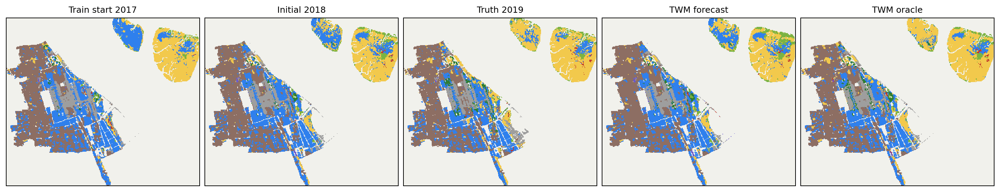
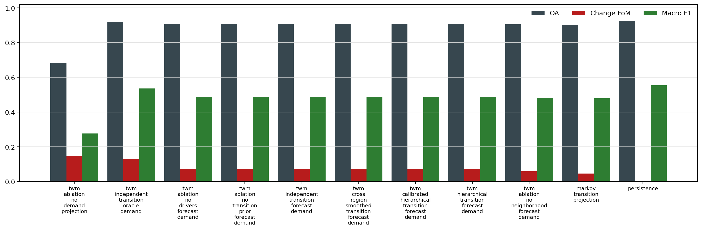

# TWM 公开多时期土地利用基准

更新日期：2026-06-22

## 1. 当前结论

本轮新增的是 TWM 的公开数据基准入口：它面向 GLC_FCS30D、Dynamic World、MODIS 等本地导出的多时期土地覆盖栅格栈，也可以用现有 DongGuan 80m 样例作为真实数据适配验证。

关键边界：`forecast_demand` 是正式预测设定；`oracle_demand` 使用目标年类别总量，只能作为上限诊断，不能作为真实预测结果。

## 2. 数据画像

- source type: `dongguan_zip_adapter`
- region count: `1`
- rolling case count: `1`

## 3. 渲染器输出

## 4. 汇总指标

| candidate | cases | mean OA | mean Kappa | mean change FoM | mean change F1 | mean macro F1 | target demand abs err | oracle demand abs err |
|---|---:|---:|---:|---:|---:|---:|---:|---:|
| twm_independent_transition_oracle_demand | 1 | 0.913423 | 0.875828 | 0.107556 | 0.194222 | 0.912728 | 0 | 0 |
| twm_ablation_no_demand_projection | 1 | 0.627917 | 0.478864 | 0.078559 | 0.145674 | 0.482179 | 26976 | 37642 |
| twm_independent_transition_forecast_demand | 1 | 0.931324 | 0.902460 | 0.057363 | 0.108502 | 0.918808 | 0 | 24522 |
| twm_ablation_no_transition_prior_forecast_demand | 1 | 0.931324 | 0.902460 | 0.057363 | 0.108502 | 0.918808 | 0 | 24522 |
| twm_ablation_no_drivers_forecast_demand | 1 | 0.931239 | 0.902340 | 0.056787 | 0.107472 | 0.918555 | 0 | 24522 |
| markov_transition_projection | 1 | 0.928715 | 0.898755 | 0.041221 | 0.079179 | 0.914930 | 0 | 24522 |
| twm_ablation_no_neighborhood_forecast_demand | 1 | 0.928676 | 0.898699 | 0.037771 | 0.072792 | 0.914821 | 0 | 24522 |
| persistence | 1 | 0.943746 | 0.920710 | 0.000000 | 0.000000 | 0.946601 | 15636 | 38656 |

## 5. 单案例指标

### dongguan_80m_2000_2005_2006

- train: `2000->2005`
- holdout: `2005->2006`
- best forecast by change FoM: `twm_independent_transition_forecast_demand`
- best oracle by change FoM: `twm_independent_transition_oracle_demand`
- forecast demand abs error against oracle: `24522`

| candidate | demand mode | OA | Kappa | change FoM | change F1 | macro F1 | predicted change |
|---|---|---:|---:|---:|---:|---:|---:|
| persistence | forecast_demand | 0.943746 | 0.920710 | 0.000000 | 0.000000 | 0.946601 | 0 |
| markov_transition_projection | forecast_demand | 0.928715 | 0.898755 | 0.041221 | 0.079179 | 0.914930 | 7818 |
| twm_independent_transition_forecast_demand | forecast_demand | 0.931324 | 0.902460 | 0.057363 | 0.108502 | 0.918808 | 7818 |
| twm_ablation_no_drivers_forecast_demand | forecast_demand | 0.931239 | 0.902340 | 0.056787 | 0.107472 | 0.918555 | 7818 |
| twm_ablation_no_neighborhood_forecast_demand | forecast_demand | 0.928676 | 0.898699 | 0.037771 | 0.072792 | 0.914821 | 7818 |
| twm_ablation_no_transition_prior_forecast_demand | forecast_demand | 0.931324 | 0.902460 | 0.057363 | 0.108502 | 0.918808 | 7818 |
| twm_ablation_no_demand_projection | no_demand_projection | 0.627917 | 0.478864 | 0.078559 | 0.145674 | 0.482179 | 138887 |
| twm_independent_transition_oracle_demand | oracle_demand | 0.913423 | 0.875828 | 0.107556 | 0.194222 | 0.912728 | 19328 |

Ablation deltas against `twm_independent_transition_forecast_demand`:

| ablation | Δ change FoM | Δ OA | Δ change F1 | Δ target demand error | Δ predicted change |
|---|---:|---:|---:|---:|---:|
| twm_ablation_no_drivers_forecast_demand | -0.000576 | -0.000085 | -0.001030 | 0 | 0 |
| twm_ablation_no_neighborhood_forecast_demand | -0.019592 | -0.002648 | -0.035710 | 0 | 0 |
| twm_ablation_no_transition_prior_forecast_demand | 0.000000 | 0.000000 | 0.000000 | 0 | 0 |
| twm_ablation_no_demand_projection | 0.021196 | -0.303407 | 0.037172 | 26976 | 131069 |

## 6. 下一步

- 建立 GLC_FCS30D 或 Dynamic World 的多区域 manifest。
- 增加 region-holdout，并将 ablation 从单区域扩展到多区域显著性统计。
- 将 demand 从简单历史趋势升级为独立情景需求模型。
